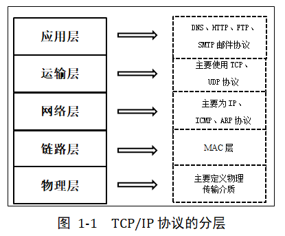
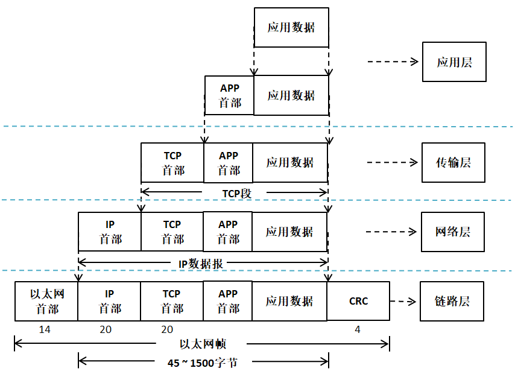

网络协议简介
------------

常用网络协议
~~~~~~~~~~~~

互联网对人类社会产生的巨大变革，大家是有目共睹的，它几乎改变了人类生活的方方面面。互联网通信的本质是数字通信，任何数字通信都离不开通信协议的制定，通信设备只有按照约定的、统一的方式去封装和解析信息，才能实现通信。互联网通信所要遵守的众多协议，被统称为TCP/IP。

TCP/IP是一个协议族，包含众多的协议。但对于网络应用开发人员，可能听到更多的是其中的应用层协议，比如HTTP、FTP、MQTT等。

HTTP协议是Hyper Text Transfer
Protocol（超文本传输协议）的缩写，HTTP的应用最为广泛。比如大家日常使用电脑时的一个常规操作：打开电脑，打开浏览器，输入网址，最后按下回车，这一刻你就开启了HTTP通信。HTTP协议工作于<客户端-服务端>架构之上，（服务端也称作为服务器端，除非特别说明，否则本书出现的“服务端”即为“服务器端”），浏览器作为HTTP客户端通过URL向HTTP服务端即WEB服务器发送所有请求。Web服务器根据接收到的请求后，向客户端发送响应信息。借助这种浏览器和服务器之间的HTTP通信，我们能够足不出户地获得来自世界各个角落的信息。另外，网页不仅仅是大型服务器的专利，
在物联网风潮盛行的今天，许多随处可见的小型设备（空调、冰箱、插座、路由器等），都内嵌网页，在物理链路畅通的情况下，用户可以用手机、平板电脑上的浏览器随时随地监控这些设备。

FTP（File Transfer
Protocol）是文件传输协议的简称。FTP是工作在应用层的网络协议。FTP使得主机间可以共享文件，用于在两台设备之间传输文件（双向传输）。它也是一个客户端-服务端框架系统。用户可以通过一个支持FTP协议的客户端程序，连接到在远程主机上的FTP服务端程序，通过客户端程序向服务端程序发出命令，服务端程序执行用户所发出的命令，并将执行的结果返回到客户机。FTP除了基本的文件上传/下载功能外，还有目录操作、权限设置、身份验证机制，许多网盘的文件传输功能都是基于FTP实现的。

在物联网发展的处期，物联网场景中的设备使用何种应用层协议进行通信一直是备受争议的话题。很多开发人员习惯了网页的开发模式，于是经常选择HTTP作为通信方式。使用HTTP有以下不利因素：HTTP是一种同步协议，设备需要等待服务器的响应才可以进行下一步的工作，然而在设备数量多、网络不可靠的场景下，实现同步通信很困难；HTTP是单向的，设备只能主动向服务器发出数据，无法被动的接收来自网络的数据，这不适用于实时控制的场合；HTTP是有许多帧头和规则的重量级协议，实现在设备中需要耗费大量的系统资源。基于上述的形势，MQTT和COAP等轻量级、异步的通信协议便得到了物联网设备开发商的宠爱，尤其是MQTT。MQTT（消息队列遥测传输）是IBM公司于1990年设计并推出的一款通信协议，于2014年正式成为了一个OASIS开放标准。近年来，MQTT的应用呈现出爆炸性的增长势头，大有一统物联网的趋势。另外，MQTT在物联网以外的其他领域也得到了广泛的应用，比如许多公司在制作手机APP时，会使用MQTT来实现消息推送、即时聊天等功能。

嵌入式设备接入互联网的需求越来越大，有以下几点原因：

（1）近些年，各种带网络接入功能的MCU、SoC层出不穷，开源轻量的TCP/IP协议栈日趋成熟和完善，云平台的市场越来越繁荣，这些因素大大降低了嵌入式设备的入网成本，也为许多资源受限的低端设备接入互联网提供了可能。

（2）“物联网+”的风潮日渐盛行，设备能够被远程监控，这一点已经成为许多产品的技术要求。

（3）人们对于设备“智能性”的追求越来越高，当今热门的大数据、图像处理、语音识别、机器学习等功能都可以被集成在云端，成为云平台能提供的服务。终端设备大多是计算、存储能力有限的设备，这些设备如果想要获取“智能”，最便捷的办法就是接入云平台，利用各项云服务。

互联网的基础就是TCP/IP。TCP/IP是一个非常复杂的协议族，即便我们能把它的设计思想和实现原理都解释得清清楚楚，你也不见得有时间和精力去学习它，所以本书的写作重点不在于对TCP/IP的解读，而在于对它的应用。另外，TCP/IP的复杂性也决定了它并不是那么简单就能用好的东西，即便我们只关注应用开发，也依然需要对它的许多概念和设计思想有所了解，才能编写出正确、高效、健壮性好的应用程序。

希望能借此书，让嵌入式开发工程师们以浓厚的兴趣和清晰的视野，搭上物联网发展的快车。

网络协议的分层模型
~~~~~~~~~~~~~~~~~~

TCP/IP是一个庞大的协议族，它是众多网络协议的集合，包括：ARP、IP、ICMP、UDP、TCP、DNS、DHCP、HTTP、FTP、MQTT等等。
这些协议按照功能，可以被划分为几个不同的层次，如 图1_1_ 所示。
我们在上一节中介绍的HTTP、FTP、MQTT，它们隶属于应用层。
那么TCP/IP为什么需要分层，分层又是依靠什么依据呢？

图 1‑1 TCP/IP协议的分层

TCP/IP协议栈中不同协议所完成的功能是不一样的，
某些协议的实现要依赖于其它协议，依据这种依赖关系，可以将协议栈分层。在
图1_1_ 中，低层协议为相邻的上层协议提供服务，是上层协议得以实现的基础。

其中，物理层（PHY）规定了传输信号所需要的物理电平、介质特征；链路层（MAC）规定了数据帧能被网卡接收的条件，最常见的方式是利用网卡的MAC地址，发送方会在欲发送的数据帧的首部加上接收方网卡的MAC地址信息，接收方只有监听到属于自己的MAC地址信息后，才会去接收并处理该数据；每台网络设备都应该有自己的网络地址，网络层规定了主机的网络地址该如何定义，以及如何在网络地址和MAC地址之间进行映射，即ARP协议；网络层实现了数据包在主机之间的传递，而一台主机内部可能运行着多个网络程序，传输层可以区分数据包是属于哪一个应用程序的，可以说传输层实现了数据包端到端的传递。另外，数据包在传输过程中可能会出现丢包、乱序和重复的现象，网络层并没有提供应对这些错误的机制，而传输层可以解决这些问题，如TCP协议；应用层以下的工作完成了数据的传递工作，应用层则决定了你如何应用和处理这些数据，之所以会有许多的应用层协议，是因为互联网中传递的数据种类很多、差异很大、应用场景十分多样。

协议层报文间的封装与拆封
~~~~~~~~~~~~~~~~~~~~~~~~

本书的后面章节会对TCP/IP协议栈中的每层协议进行分析和讲解。在这里，
我们以 图1_2_ 简单解释一下在数据的发送和接收过程中，TCP/IP都做了哪些事儿。

当用户发送数据时，将数据向下交给传输层，这是处于应用层的操作，应用层可以通过调用传输层的接口来编写特定的应用程序。而
TCP/IP 协议一般也会包含一些简单的应用程序如 Telnet 远程登录、FTP
文件传输、 SMTP
邮件传输协议等。传输层会在数据前面加上传输层首部（此处以TCP协议为例，
图1_2_ 的传输层首部为TCP首部，也可以是UDP首部），然后向下交给网络层。
同样地，网络层会在数据前面加上网络层首部（IP首部），
然后将数据向下交给链路层，链路层会对数据进行最后一次封装，
即在数据前面加上链路层首部（此处使用以太网接口为例），然后将数据交给网卡。
最后，网卡将数据转换成物理链路上的电平信号，数据就这样被发送到了网络中。
数据的发送过程，可以概括为TCP/IP的各层协议对数据进行封装的过程，如 图1_2_ 所示。

当设备的网卡接收到某个数据包后，它会将其放置在网卡的接收缓存中，并告知TCP/IP内核。然后TCP/IP内核就开始工作了，它会将数据包从接收缓存中取出，并逐层解析数据包中的协议首部信息，并最终将数据交给某个应用程序。数据的接收过程与发送过程正好相反，可以概括为TCP/IP的各层协议对数据进行解析的过程。

图 1‑2 TCP/IP协议栈各层的报文封装与拆封
