ARP协议
-----------

链路层概述
~~~~~~~~~~~~~~

我们首先学习一些有用的术语。在本章中为方便讨论，将运行链路层协议（即第2层）协议的任何设备均称为结点（node）。结点包括主机、路由器、交换机和WiFi接入点。我们也把沿着通信路径连接相邻结点的通信信道称为链路（link）。为了将一个数据报从源主机传输到目标主机，数据报必须通过端到端路径上的各段链路才能到达目标主机。在通过特定的链路时，传输结点将数据报封装在链路层帧中，并将该帧传送到链路中。

链路层的主体部分是网卡中实现的，在发送的数据帧的时候，协议栈取得由高层传递过的数据报（注意，数据帧与数据报不是一个东西，数据帧一般形容链路层的数据，是一帧一帧的，也是链路层的服务——数据成帧），在链路层中封装该数据报，也就是填写数据帧的各个字段，然后遵循链路接入协议将该帧数据进行传输；在接收端，控制器接收了整个数据帧，抽取出网络层的数据报，往上层传递。

其实这些知识过于底层，我们暂时也无需了解太多，只需要知道所有不同主机的信息都是必须通过链路层才能传递数据，所有链路层的完整与稳定是传递信息的必要条件。

MAC地址的基本概念
~~~~~~~~~~~~~~~~~

MAC Address(Media Access Control Address)，亦称为EHA（Ethernet Hardware
Address）、硬件地址、物理地址（Physical
Address）。MAC地址就是在媒体接入层上使用的地址，也叫物理地址、硬件地址或链路地址，其被固化在网卡的ROM中。可见MAC地址实际上就是网卡地址或网卡标识符。当某台计算机使用某块网卡后，网卡上的标识符就成为该计算机的MAC地址。MAC地址长度为6字节（48比特），其前3个字节表示组织唯一标志符（Organizationally
Unique
Identifier，即OUI），由IEEE的注册管理机构给不同厂家分配的代码，以区分不同的厂家，后3个字节由厂家自行分配，称为扩展标识符。同一个厂家生产的网卡中MAC地址后24位是不同的。

初识ARP
~~~~~~~

地址解析协议（Address Resolution
Protocol，ARP）是通过解析IP地址得到数据链路层地址的，是一个在网络协议包中极其重要的网络传输协议，它与网卡有着极其密切的关系，在TCP/IP分层结构中，把ARP划分为网络层，为什么呢，因为在网络层看来，源主机与目标主机是通过IP地址进行识别的，而所有的数据传输又依赖网卡底层硬件，即链路层，那么就需要将这些IP地址转换为链路层可以识别的东西，在所有的链路中都有着自己的一套寻址机制，如在以太网中使用MAC地址进行寻址，标识不同的主机，那么就需要有一个协议将IP地址转换为MAC地址，由此就出现了ARP协议，ARP协议在网络层被应用，它是网络层与链路层连接的重要枢纽。

在局域网中，网络中实际传输的是“帧”，帧里面是有目标主机的MAC地址的。在以太网中，一个主机要和另一个主机进行直接通信，必须要知道目标主机的MAC地址，那就需要ARP进行地址解析，所谓“地址解析”就是主机在发送帧前将目标IP地址转换成目标MAC地址的过程。ARP协议的基本功能就是通过目标设备的IP地址，查询目标设备的MAC地址，以保证通信的顺利进行。

以太网帧结构
~~~~~~~~~~~~

既然谈到MAC地址，那就不得不说一下以太网帧结构了，每个网卡都有唯一一个物理地址，在硬件中进行数据帧传输的时候就必须有正确的目的物理地址，例如以太网的48位MAC地址就是存储在网卡内部存储器中。

以太网帧结构如 图10_1_ 所示：

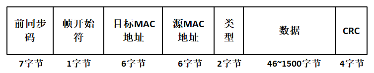

图 10‑1以太网帧结构

一看这个以太网帧结构，就觉得它有7个字段，但是事实上，前同步码与帧开始符字段不能算是真正的以太网帧数据结构，他们是在网卡发送的时候添加进去的，为了数据的准确传输。

以太网帧以一个7字节的前同步码（Preamble）字段开始。该前同步码的值都是10101010（0x55，大端模式）；而后紧接着一个字节的帧开始符，其值是10101011（0xD5，大端模式）。前同步码字段的作用是实现物理层帧输入输出的同步，而帧开始符表示着以太网帧的开始，剩下的5个字段才是真正的以太网数据帧结构。

目标MAC地址（6字节）：这个字段包含目标网卡的MAC地址，当一个网卡收到一个以太网数据帧，如果该数据帧的目标地址是网卡自身的MAC地址或者是MAC广播地址，它都将该帧的数据字段的内容传递给网络层；如果它收到了具有任何其他MAC地址的帧，则将该数据帧丢弃。

源MAC地址（6字节）：这个字段包含了传输该帧到局域网上的适配器的MAC地址。

类型字段（2字节）：类型字段允许以太网复用多种网络层协议。为了理解这点，我们需要记住主机能够使用除了IP以外的其他网络层协议。事实上，一台给定的主机可以支持多种网络层协议，以对不同的应用采用不同的协议。因此，当以太网帧到达网卡中，网卡需要知道它应该将数据字段的内容传递给哪个网络层协议。如IP协议、ARP协议等。

注意了：当这个字段的值小于1518时，它表示后面数据字段的数据长度，当大于1518的时候才表示递交给哪个协议。

数据字段（46~1500字节）：这个字段承载了IP数据报。以太网的最大传输单元（MTU）是1500字节。这意味着如果IP数据报超过了1500字节，则主机必须将该数据报分片（关于分片会在后续讲解）。数据字段的最小长度是46字节，这意味着如果IP数据报小于46字节，数据报必须被填充到46字节。当采用填充时，传递到网络层的数据包括IP数据报和填充部分，网络层使用IP数据报首部中的长度字段来去除填充部分。

CRC（4字节）：CRC字段包含了以太网的差错校验信息。

在以太网帧中，目标MAC地址可以分成三类，单播地址、多播地址和广播地址。单播地址通常是与某个网卡的MAC地址对应，它要求以太网第一个字节的bit0（最先发出去的位）必须是0；而多播地址则要求第一个字节的bit0为1，这样子多播地址就不会与任何网卡的MAC地址相同，可以被多个网卡同时接收；广播地址的48位MAC地址全为1，也就是FF-FF-FF-FF-FF-FF，
同一局域网内的所有网卡都会收到广播的数据包。

所有的以太网计算都向网络层提供不可靠的无连接服务，也就是说在网卡发送数据的时候，不会向目标网卡进行事先的通知（握手），网卡只在以太网帧中封装好来自上层的数据报，然后把数据报发送到局域网上。同样的当一个网卡接收一个以太网数据帧的时候，它也不会进行回复确认，如果当网卡执行CRC校验不通过的时候，它也不会发送否定确认，这样子当一些以太网帧不通过CRC校验时，网卡只是将其丢弃，而发送的一方就不会知道它传输的数据是否达到并且通过校验。

IP地址映射为物理地址
~~~~~~~~~~~~~~~~~~~~

TCP/IP协议有自己的IP地址，IP地址（IPv4）是一个32位的IP地址，网络层发送数据包只需要知道目标主机IP地址即可，而以太网发送数据则必须知道对方的硬件MAC地址，同时IP地址的分配与硬件MAC地址是没有关系的，为了让网络层只需要知道IP地址就可以完成通信工作，那就需要有一个协议将IP地址映射成为对应的MAC地址，此外还需要考虑IP地址可能是动态的，非常灵活，使用静态的映射方法是行不通的，所以ARP协议就提供优质的地址动态解析的机制，让32位的IP地址能映射成为48位的MAC地址，让上层应用于底层完全分离开，这样子在上层应用就能灵活使用IP地址作为标识，进行通信。

ARP缓存表
~~~~~~~~~

既然已经解释了ARP的用途，我们再来看看它是如何工作的。为了实现IP地址与网卡MAC地址的查询与转换，ARP协议引入了ARP缓存表的概念，每台主机或路由器在其内存中具有一个ARP缓存表（ARP
table），这张表包含IP地址到MAC地址的映射关系，表中记录了<IP地址，MAC地址>对，它们是主机最近运行时获得关于其他主机的IP地址到物理地址的映射，当需要发送IP数据的时候，主机就会根据目标IP地址到ARP缓存表中进行查找对应的MAC地址，然后通过网卡将数据发送出去。ARP表也包含一个寿命（TTL）值，它指示了从表中删除每个映射的时间。从一个表项放置到某ARP表中开始，一个表项通常的过期时间是10分钟。

我们电脑也是有自己的ARP缓存表的，可以在控制台中通过“arp
-a”命令进行查看，具体见 图10_2_。

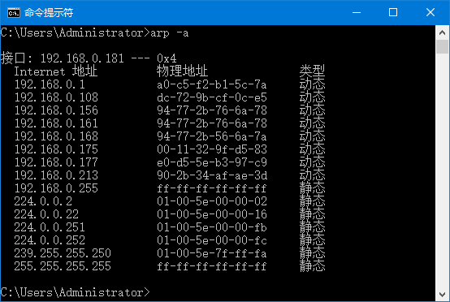

图 10‑2ARP缓存表

从图中可以看到作者的电脑有很多这样子的缓存表，其中192.168.0.181是我电脑的IP地址，而192.168.0.xxx这些IP是公司的其他电脑与其对应的物理地址（MAC地址），比如IP地址为192.168.0.108的电脑MAC地址为dc-72-9b-cf-0c-e5，如果我想向该电脑发送一个数据包，那么我的电脑就会从已有的ARP缓存表中寻找这个IP地址对应的物理地址，然后直接将数据写入以太网数据帧中让网卡进行发送即可，而如果没有找到这个IP地址，那么这个数据就没法立即发送，电脑会先在局域网上广播一个ARP请求（目标MAC地址为FF-FF-FF-FF-FF-FF），广播的ARP请求发出后，处于同一局域网内的所有主机都会接收到这个请求，如果目标IP地址与主机自身IP地址吻合就会返回一个ARP应答，告诉请求者自身的MAC地址，当我的电脑收到这个ARP应答后，就去更新ARP缓存表，并且重新将数据发送出去。

ARP协议的核心就是对缓存表的操作，发送数据包的时候，查找ARP缓存表以得到对应的MAC地址，必要时进行ARP缓存表的更新，此外ARP还需要不断处理其他主机的ARP请求，在ARP缓存表中的TTL即将过期的时候更新缓存表以保证缓存表中的表项有效。

其运作过程大致可以理解为：

1. 如果主机A想发送数据给主机B，主机A首先会检查自己的ARP缓存表，查看是否有主机B的IP地址和MAC地址的对应关系，
如果有，则会将主机B的MAC地址作为源MAC地址封装到数据帧中。如果本地ARP缓存中没有对应关系，
主机A就会向局域网中广播ARP请求（包括发送方的IP地址、MAC地址、接收方的IP地址），
每台主机接收到ARP请求后都检查自己的IP地址是否与ARP请求中的接收方IP地址相同，若不相同则丢弃ARP请求包。

2. 当交换机接受到此数据帧之后，发现此数据帧是广播帧，因此，会将此数据帧从非接收的所有接口发送出去。

3. 当主机B接受到此数据帧后，会校对IP地址是否是自己的，并将主机A的IP地址和MAC地址的对应关系记录到自己的ARP缓存表中，
同时会发送一个ARP响应，其中包括自己的MAC地址。

4. 主机A在收到这个回应的数据帧之后，在自己的ARP缓存表中记录主机B的IP地址和MAC地址的对应关系。
而此时交换机已经学习到了主机A和主机B的MAC地址了。

那么在LwIP中缓存表是如何实现的呢？下面我们就结合源码进行讲解。

ARP协议的核心是ARP缓存表，ARP的实质就是对缓存表的建立、更新、查询等操作，
ARP缓存表的核心是表项（entry）。LwIP使用一个arp_table数组描述ARP缓存表，
数组的内容是表项的内容，具体见 代码清单10_1_。
每个表项都必须记录一对IP地址与MAC地址的映射关系，此外还有一些基本的信息，
如表项的状态、生命周期（生存时间）以及对应网卡的基本信息，
LwIP使用一个etharp_entry结构体对表项进行描述，具体见 代码清单10_2_。

代码清单 10‑1ARP缓存表

.. code-block:: c
   :name: 代码清单10_1

    static struct etharp_entry arp_table[ARP_TABLE_SIZE];

编译器预先定义了缓存表的大小，ARP_TABLE_SIZE默认为10，也就是最大能存放10个表项，由于这个表很小，LwIP对表的操作直接采用遍历方式，遍历每个表项并且更改其中的内容。

代码清单 10‑2 etharp_entry结构体

.. code-block:: c
   :name: 代码清单10_2

    struct etharp_entry
    {
    #if ARP_QUEUEING
        /** 指向此ARP表项上挂起的数据包队列的指针。 */
        struct etharp_q_entry *q;				//(1)-①
    #else
        /** 指向此ARP表项上的单个挂起数据包的指针。 */
        struct pbuf *q;					//(1)-②
    #endif
        ip4_addr_t ipaddr;					(2)
        struct netif *netif;				(3)
        struct eth_addr ethaddr;				(4)
        u16_t ctime;					(5)
        u8_t state;					(6)
    };

代码清单
10‑2\ **(1)**\ ：这里使用了一个宏定义进行预编译，默认配置该宏定义是不打开的，
其实都是一样，q都是指向数据包，\ **(1)-①**\ 中的etharp_q_entry指向的是数据包缓存队列，
etharp_q_entry是一个结构体，具体见 代码清单10_3_，如果将ARP_QUEUEING宏定义打开，
系统会为etharp_q_entry结构体开辟一些MEMP_ARP_QUEUEING类型的内存池，
以便快速申请内存。而\ **(1)-②**\ 中的q直接指向单个数据包。具体见 图10_3_ 与 图10_4_。

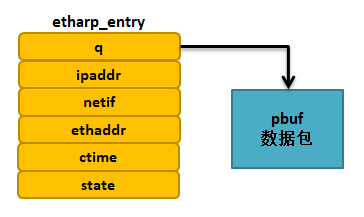

图 10‑3 ARP表项上的单个挂起数据包

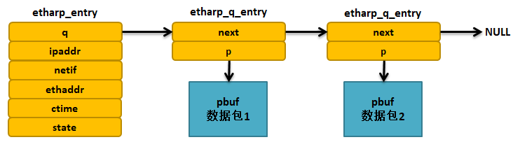

图 10‑4 ARP表项上挂起的数据包队列

代码清单 10‑3etharp_q_entry结构体

.. code-block:: c
   :name: 代码清单10_3

    struct etharp_q_entry
    {
        struct etharp_q_entry *next;
        struct pbuf *p;
    };

代码清单 10‑2\ **(2)**\ ：记录目标IP地址。

代码清单 10‑2\ **(3)**\ ： 对应网卡信息。

代码清单 10‑2\ **(4)**\ ：记录与目标IP地址对应的MAC地址。

代码清单 10‑2\ **(5)**\ ：生存时间。

代码清单10‑2\ **(6)**\ ：表项的状态，LwIP中用枚举类型定义了不同的状态，
具体见 代码清单10_4_。

代码清单 10‑4表项的状态

.. code-block:: c
   :name: 代码清单10_4

    /** ARP states */
    enum etharp_state
    {
        ETHARP_STATE_EMPTY = 0,
        ETHARP_STATE_PENDING,
        ETHARP_STATE_STABLE,
        ETHARP_STATE_STABLE_REREQUESTING_1,
        ETHARP_STATE_STABLE_REREQUESTING_2
    #if ETHARP_SUPPORT_STATIC_ENTRIES
        , ETHARP_STATE_STATIC
    #endif /* ETHARP_SUPPORT_STATIC_ENTRIES */
    };

ARP缓存表在初始化的时候，所有的表项都会被初始化为ETHARP_STATE_EMPTY，也就是空状态，表示这些表项能被使用，在需要添加表项的时候，LwIP内核就会遍历ARP缓存表，找到合适的表项，进行添加。如果ARP表项处于ETHARP_STATE_PENDING状态，表示ARP已经发出了一个ARP请求包，但是还未收到目标IP地址主机的应答，处于这个状态的缓存表项是有等待时间的，它通过宏定义ARP_MAXPENDING指定，默认为5秒钟，如果从发出ARP请求包后的5秒内还没收到应答，那么该表项又会被删除；而如果收到应答后，ARP就会更新缓存表的信息，记录目标IP地址与目标MAC地址的映射关系并且开始记录表项的生存时间，同时该表项的状态会变成ETHARP_STATE_STABLE状态。当要发送数据包的时候，而此时表项为ETHARP_STATE_PENDING状态，那么这些数据包就会暂时被挂载到表项的数据包缓冲队列上，直到表项的状态为ETHARP_STATE_STABLE，才进行发送数据包。对于状态为ETHARP_STATE_STABLE的表项，这些表项代表着ARP记录了IP地址与MAC地址的映射关系，能随意通过IP地址进行数据的发送，但是这些表项是具有生存时间的，通过宏定义ARP_MAXAGE指定，默认为5分钟，在这些时间，LwIP会不断维护这些缓存表以保持缓存表的有效。当表项是ETHARP_STATE_STABLE的时候又发送一个ARP请求包，那么表项状态会暂时被设置为ETHARP_STATE_STABLE_REREQUESTING_1，然后被设置为ETHARP_STATE_STABLE_REREQUESTING_2状态，这些是一个过渡状态，当收到ARP应答后，表项又会被设置为ETHARP_STATE_STABLE，这样子能保持表项的有效。

所以ARP缓存表是一个动态更新的过程，为什么要动态更新呢？因为以太网的物理性质并不能保证数据传输的是可靠的。以太网发送数据并不会知道对方是否已经介绍成功，而两台主机的物理线路不可能一直保持有效畅通，那么如果不是动态更新的话，主机就不会知道另一台主机是否在工作中，这样子发出去的数据是没有意义的。比如两台主机A和B，一开始两台主机都是处于连接状态，能正常进行通信，但是某个时刻主机B断开了，但是主机A不会知道主机B是否正常运行，因为以太网不会提示主机B已经断开，那么主机A会一直按照MAC地址发送数据，而此时在物理链路层就已经是不通的，那么这些数据是没有意义的，而如果ARP动态更新的话，主机A就会发出ARP请求包，如果得不到主机B的回应，则说明无法与主机B进行通信，那么就会删除ARP表项，就无法进行通信。

ARP缓存表的超时处理
~~~~~~~~~~~~~~~~~~~

从前面的章节也知道，ARP是动态处理的，现在总结一下：ARP表项的生存时间是5分钟，而ARP请求的等待时间是5秒钟，当这些时间到达后，就会更新ARP表项，如果在物理链路层无法连通则会删除表项。这就需要ARP层有一个超时处理函数对ARP进行管理，这些操作都是根据ARP表项的ctime字段进行的，它记录着对应表项的生存时间，而超时处理函数是etharp_tmr()，它是一个周期性的超时处理函数，每隔1秒就调用一次，当ctime的值大于指定的时间，就会删除对应的表项，具体见
代码清单10_5_。

代码清单 10‑5 etharp_tmr()源码

.. code-block:: c
   :name: 代码清单10_5

    void
    etharp_tmr(void)
    {
        int i;

        LWIP_DEBUGF(ETHARP_DEBUG, ("etharp_timer\n"));
        /* 遍历ARP表，从ARP表中删除过期的表项 */
        for (i = 0; i < ARP_TABLE_SIZE; ++i)	(1)
        {
            u8_t state = arp_table[i].state;
            if (state != ETHARP_STATE_EMPTY
    #if ETHARP_SUPPORT_STATIC_ENTRIES
                    && (state != ETHARP_STATE_STATIC)
    #endif /* ETHARP_SUPPORT_STATIC_ENTRIES */
            )
            {
                arp_table[i].ctime++;		(2)
                if ((arp_table[i].ctime >= ARP_MAXAGE) ||
                        ((arp_table[i].state == ETHARP_STATE_PENDING)  &&
                        (arp_table[i].ctime >= ARP_MAXPENDING))) (3)
                {
                    /* 等待表项稳定或者表项已经过期*/
            LWIP_DEBUGF(ETHARP_DEBUG,("etharp_timer: expired %s entry %d.\n",
                arp_table[i].state >= ETHARP_STATE_STABLE ? "stable" : "pending", i));
                    /*从ARP表中删除过期的表项 */
                    etharp_free_entry(i);		(4)
                }
                else if (arp_table[i].state == ETHARP_STATE_STABLE_REREQUESTING_1)
                {
                    /* 过渡 */
                    arp_table[i].state = ETHARP_STATE_STABLE_REREQUESTING_2;
                }
            else if (arp_table[i].state == ETHARP_STATE_STABLE_REREQUESTING_2)
                {
            /* 进入ETHARP_STATE_STABLE状态 */

                    arp_table[i].state = ETHARP_STATE_STABLE;
                }
                else if (arp_table[i].state == ETHARP_STATE_PENDING)
                {
                    /*仍然挂起，重新发送ARP请求 */
                    etharp_request(arp_table[i].netif, &arp_table[i].ipaddr);
                }
            }
        }
    }

代码清单
10‑5\ **(1)**\ ：由于LwIP的ARP表是比较小的，直接遍历表即可，更新ARP表的内容。

代码清单 10‑5\ **(2)**\ ：如果ARP表项不是空的，那么就记录表项的时间。

代码清单
10‑5\ **(3)(4)**\ ：当表项的时间大于表项的生存时间（5分钟），
或者表项状态是ETHARP_STATE_PENDING处于等待目标主机回应ARP请求包，
并且等待的时间超过ARP_MAXPENDING（5秒），那么LwIP就认为这些表项是无效了，
就调用etharp_free_entry()函数删除表项。

ARP报文
~~~~~~~

ARP的请求与应答都是依赖ARP报文结构进行的，ARP报文是放在以太网数据帧中进行发送的，所以下图会将以太网首部一同画出来，具体见
图10_5_。

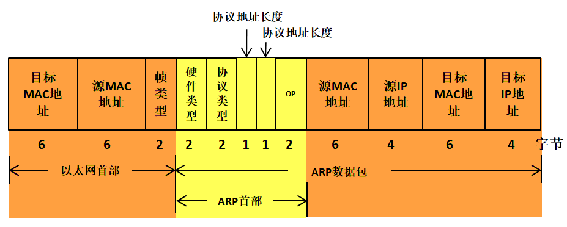

图 10‑5ARP报文

在ARP表建立前，主机并不知道目标MAC地址，所以在一开始的时候只能通过广播的方式将ARP请求包发送出去，处于同一局域网的主机都能接收到广播的数据包。所以一开始目标MAC地址是FF-FF-FF-FF-FF-FF，而以太网首部的帧类型是有多种，对于ARP数据包来说，其值为0x0806，对于IP数据报来说，其值为0x0800，此处我们只需简单了解一下即可，无需记住。

接下来就是ARP报文部分，ARP也是一种协议，也有ARP首部，在ARP首部一开始的2个字节存储的是硬件类型，表示要知道目标网卡的硬件类型，其中，值为1表示以太网地址，其他还可能表示令牌环地址；接下来还有2字节的协议类型，表示硬件地址要映射的协议地址类型，其中，0x0800表示IP地址，其他还可能是ICMP/IGMP等；接下来有1个字节表示硬件地址长度，指出该报文中硬件地址的长度，对于以太网，它的值为6；还有1字节的协议地址长度，对于ARP请求或应答来说，该值为4；ARP首部最后的op字段用于记录ARP操作的类型，分别是：

-  ARP请求，其值为1。

-  ARP应答，其值为2。

-  RARP请求，其值为3。

-  RARP应答，其值为4。

我们只关心ARP的请求与应答即可，RARP是逆地址解析协议，在这里我们就不用去了解，它在网络中基本已经被淘汰，用于主机在启动的时候获得自己的IP地址。

对于ARP首部后面的四个字段分别是源MAC地址、源IP地址、目标MAC地址、目标IP地址，这些就是比较简单的了。

在ARP请求包中，除了目标MAC地址是未知以外，其他地址3个字段都应该填写正确，然后通过广播的形式将该ARP请求包发送出去，目标主机接收到该请求包后判断目标IP地址与自身IP地址是否一致，如果一致则返回ARP应答；对应ARP应答包，只需要把自己的MAC地址填充进去，并且请求包的源主机信息与目标主机信息进行交换位置，然后把op字段设置为2，就返回ARP应答包即可。

注意，在发送ARP请求包的时候，以太网首部的目标MAC地址是FF-FF-FF-FF-FF-FF，而ARP首部目标MAC地址为00-00-00-00-00-00-00，这里千万不要混淆。

在LwIP中，使用了大量的数据结构对ARP进行描述，比较麻烦，我们暂时不用去学它，只要知道原理是这样子的即可，关于这些数据结构的定义位于etharp.h
、ethernet.h等头文件中，具体见 代码清单10_6_。

代码清单 10‑6与ARP报文相关的数据结构（已删减）

.. code-block:: c
   :name: 代码清单10_6

    #define ETH_HWADDR_LEN    6     //以太网地址长度

    truct eth_addr    //以太网地址结构体
    {
        PACK_STRUCT_FLD_8(u8_t addr[ETH_HWADDR_LEN]);
    } PACK_STRUCT_STRUCT;

    struct eth_hdr    //以太网首部
    {
        PACK_STRUCT_FLD_S(struct eth_addr dest);  //以太网目标MAC地址
        PACK_STRUCT_FLD_S(struct eth_addr src);   //以太网源MAC地址
        PACK_STRUCT_FIELD(u16_t type);            //帧类型
    } PACK_STRUCT_STRUCT;

    struct etharp_hdr               //ARP报文
    {
        PACK_STRUCT_FIELD(u16_t hwtype);    //硬件类型
        PACK_STRUCT_FIELD(u16_t proto);     //协议类型
        PACK_STRUCT_FLD_8(u8_t  hwlen);     //硬件地址长度
        PACK_STRUCT_FLD_8(u8_t  protolen);  //协议地址长度
        PACK_STRUCT_FIELD(u16_t opcode);    //op字段
        /* 以上是ARP报文首部 */

        PACK_STRUCT_FLD_S(struct eth_addr shwaddr);   //源MAC地址
        PACK_STRUCT_FLD_S(struct ip4_addr_wordaligned sipaddr);//源ip地址
        PACK_STRUCT_FLD_S(struct eth_addr dhwaddr);   //目标MAC地址
        PACK_STRUCT_FLD_S(struct ip4_addr_wordaligned dipaddr);//目标ip地址
    } PACK_STRUCT_STRUCT;

    enum etharp_opcode    //op字段操作
    {
        ARP_REQUEST = 1,     //请求包
        ARP_REPLY   = 2      //应答包
    };

为了加深理解，我们使用wireshark网络抓包工具形象地讲解报文格式与内容，
关于wireshark网络抓包工具的使用方式我们就不做过多讲解，
打开工具，然后抓取电脑网络中的数据包，具体见 图10_6_。

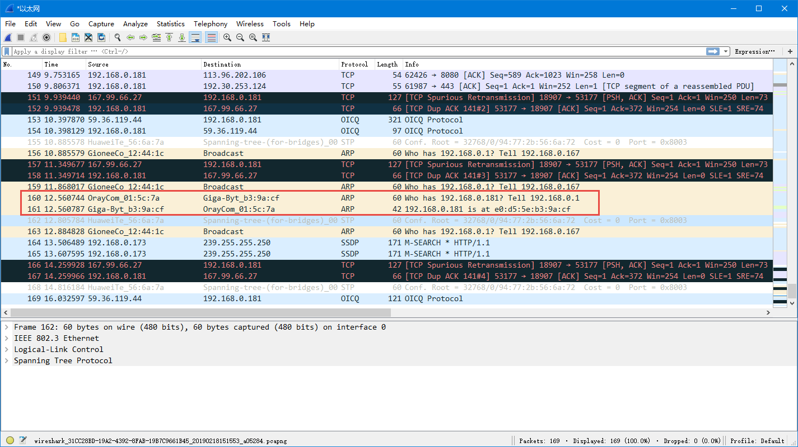

图 10‑6抓包界面

然后我们找到ARP协议，双击进行查看ARP协议中的数据包，然后我们可以看到第一个ARP协议是一个请求包，而第二个ARP协议是一个应答包，具体见
图10_7_ 与 图10_8_。

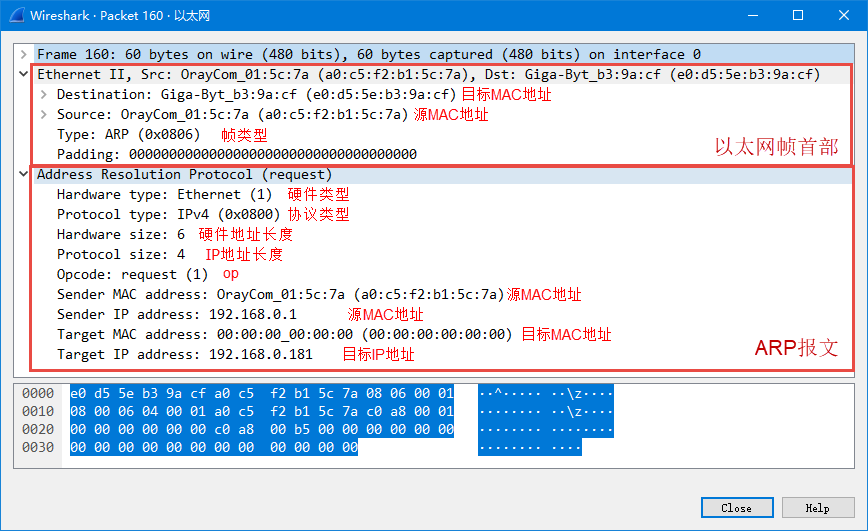

图 10‑7ARP请求包（op字段为1）

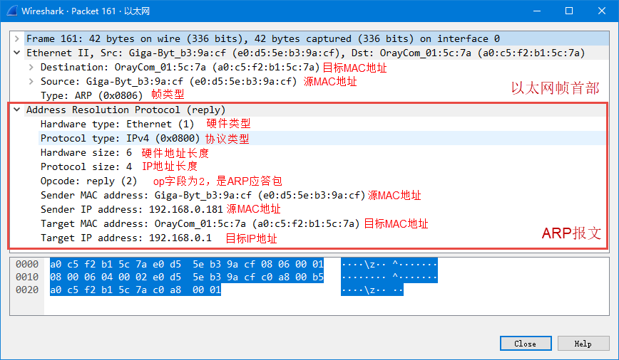

图 10‑8 ARP应答包（op字段为2）

发送ARP请求包
~~~~~~~~~~~~~

发送ARP请求包的时候，需要填充已知的目标IP地址、源MAC地址、源IP地址等，并且需要该ARP包进行广播出去，所以以太网首部的目标MAC地址为FF-FF-FF-FF-FF-FF，源码具体见
代码清单10_7_。

代码清单 10‑7 发送ARP请求包相关源码

.. code-block:: c
   :name: 代码清单10_7

    /*发送原始ARP数据包（操作码和所有地址都可以修改）
    * @param netif用于发送ARP数据包的lwip网络接口
    * @param ethsrc_addr以太网头的源MAC地址
    * @param ethdst_addr以太网头的目标MAC地址
    * @param hwsrc_addr ARP协议头的源MAC地址
    * @param ipsrc_addr ARP协议头的源IP地址
    * @param hwdst_addr ARP协议头的目标MAC地址
    * @param ipdst_addr ARP协议头的目标IP地址
    * @param操作编码ARP数据包的类型
    * @return ERR_OK如果已发送ARP数据包
    * 如果无法分配ARP数据包，则为ERR_MEM
    */
    static err_t
    etharp_raw(struct netif *netif, //用于发送ARP数据包的lwip网络接口
            const struct eth_addr *ethsrc_addr,//以太网头的源MAC地址
            const struct eth_addr *ethdst_addr,//以太网头的目标MAC地址
            const struct eth_addr *hwsrc_addr,//ARP协议头的源MAC地址
            const ip4_addr_t *ipsrc_addr,//ARP协议头的源IP地址
            const struct eth_addr *hwdst_addr, //ARP协议头的目标MAC地址
            const ip4_addr_t *ipdst_addr,// ARP协议头的目标IP地址
            const u16_t opcode)//操作编码ARP数据包的类型(op字段)
    {
        struct pbuf *p;
        err_t result = ERR_OK;
        struct etharp_hdr *hdr;

        //申请ARP报文的内存空间
        p = pbuf_alloc(PBUF_LINK, SIZEOF_ETHARP_HDR, PBUF_RAM);

        if (p == NULL)
        {
            ETHARP_STATS_INC(etharp.memerr);//内存申请失败，返回错误代码
            return ERR_MEM;
        }

        //ARP报文的数据区域，并且强制将起始地址转化成ARP报文首部
        hdr = (struct etharp_hdr *)p->payload;

        hdr->opcode = lwip_htons(opcode); //填写ARP数据包的op字段

        //填写源MAC地址
        SMEMCPY(&hdr->shwaddr, hwsrc_addr, ETH_HWADDR_LEN);
        //填写目标MAC地址
        SMEMCPY(&hdr->dhwaddr, hwdst_addr, ETH_HWADDR_LEN);

        //以太网首部源MAC地址
        IPADDR_WORDALIGNED_COPY_FROM_IP4_ADDR_T(&hdr->sipaddr, ipsrc_addr);
        /
        //以太网首部目标MAC地址
        IPADDR_WORDALIGNED_COPY_FROM_IP4_ADDR_T(&hdr->dipaddr, ipdst_addr);

        //填写ARP首部硬件类型
        hdr->hwtype = PP_HTONS(LWIP_IANA_HWTYPE_ETHERNET);
        //填写ARP首部协议类型
        hdr->proto = PP_HTONS(ETHTYPE_IP);

        //填写ARP数据包硬件地址长度
        hdr->hwlen = ETH_HWADDR_LEN;
        //填写ARP数据包协议地址长度
        hdr->protolen = sizeof(ip4_addr_t);

        //调用底层发送函数将以太网数据帧发送出去
        ethernet_output(netif, p, ethsrc_addr, ethdst_addr, ETHTYPE_ARP);

        ETHARP_STATS_INC(etharp.xmit);

        pbuf_free(p);//发送完成释放内存
        p = NULL;

        return result;  //返回结果
    }

    //FF-FF-FF-FF-FF-FF
    const struct eth_addr ethbroadcast =
                {{0xff, 0xff, 0xff, 0xff, 0xff, 0xff}};
    //00-00-00-00-00-00
    const struct eth_addr ethzero = {{0, 0, 0, 0, 0, 0}};

    //发送ARP请求包，指定目标MAC地址
    static err_t
    etharp_request_dst(struct netif *netif,
                    const ip4_addr_t *ipaddr,
                    const struct eth_addr *hw_dst_addr)
    {
        return etharp_raw(netif,
                        (struct eth_addr *)netif->hwaddr,
                        hw_dst_addr,
                        (struct eth_addr *)netif->hwaddr,
                        netif_ip4_addr(netif), &ethzero,
                        ipaddr, ARP_REQUEST);
    }

    //发送ARP请求包，目标MAC地址为 ethbroadcast
    err_t
    etharp_request(struct netif *netif, const ip4_addr_t *ipaddr)
    {
        return etharp_request_dst(netif, ipaddr, &ethbroadcast);
    }

总的来说就是先调用etharp_request()函数进行发送ARP请求包，在etharp_request()函数中会调用etharp_request_dst()函数进行发送，此时指定的目标MAC地址是ethbroadcast，而在etharp_request_dst()函数中会调用etharp_raw()进行发送ARP请求包，层层调用，并且每层的参数都是越来越多的，这样子封装对于上层程序来说更加好处理，在etharp_raw()函数中，会对ARP数据包进行封装，然后再封装到以太网数据帧中，最终调用以太网底层发送函数进行将以太网数据帧发送出去。

数据包接收流程
~~~~~~~~~~~~~~

以太网之数据包接收
^^^^^^^^^^^^^^^^^^^^^^^^^

以太网是有自己独立的寻址方式（MAC地址），而对于TCP/IP的上层协议（如TCP协议、IP协议），
它们是以IP地址作为网络的标识，如果没有IP地址则无法进行收发数据。当数据通过网卡中接收回来的时候，
LwIP内核就需要将数据进行分解，如果是IP数据报则递交给IP协议去处理，如果是ARP数据包则交由ARP协议去处理。
LwIP中数据包从网卡接收的函数是ethernetif_input()，从第9章我们可以知道，真正让LwIP内核去处理接收到的数据包是ethernet_input()函数，这两个函数是不一样的，名字稍微有点区别，LwIP就是在这个函数中处理不同的数据包类型，其源码具体见
代码清单10_8_。

代码清单 10‑8 ethernet_input()函数

.. code-block:: c
   :name: 代码清单10_8

    err_t
    ethernet_input(struct pbuf *p, struct netif *netif)
    {
        struct eth_hdr *ethhdr;
        u16_t type;

    #if LWIP_ARP || ETHARP_SUPPORT_VLAN || LWIP_IPV6

        u16_t next_hdr_offset = SIZEOF_ETH_HDR;

    #endif

        LWIP_ASSERT_CORE_LOCKED();

        //校验数据长度
        if (p->len <= SIZEOF_ETH_HDR)
        {
            ETHARP_STATS_INC(etharp.proterr);
            ETHARP_STATS_INC(etharp.drop);
            MIB2_STATS_NETIF_INC(netif, ifinerrors);
            goto free_and_return;
        }

        if (p->if_idx == NETIF_NO_INDEX)
        {
            p->if_idx = netif_get_index(netif);
        }

        /* ethhdr指针指向以太网帧头部，并且强制转换成eth_hdr结构 */
        ethhdr = (struct eth_hdr *)p->payload;			(1)

        type = ethhdr->type;

        if (ethhdr->dest.addr[0] & 1)
        {
            /* 这可能是多播或广播数据包 */
            if (ethhdr->dest.addr[0] == LL_IP4_MULTICAST_ADDR_0)
            {
                if ((ethhdr->dest.addr[1] == LL_IP4_MULTICAST_ADDR_1) &&
                        (ethhdr->dest.addr[2] == LL_IP4_MULTICAST_ADDR_2))
                {
                    /* 将pbuf标记为链路层多播 */
                    p->flags |= PBUF_FLAG_LLMCAST;			(2)
                }
            }

            else if (eth_addr_cmp(&ethhdr->dest, &ethbroadcast))
            {
                /* 将pbuf标记为链路层广播 */
                p->flags |= PBUF_FLAG_LLBCAST;			(3)
            }
        }

        switch (type)
        {
        /* 如果是IP数据报 */
        case PP_HTONS(ETHTYPE_IP):
            if (!(netif->flags & NETIF_FLAG_ETHARP))
            {
                goto free_and_return;
            }
            /* 跳过以太网首部 */
            if (pbuf_remove_header(p, next_hdr_offset))		(4)
            {
                goto free_and_return;
            }
            else
            {
                /* 传递到IP协议去处理 */
                ip4_input(p, netif);				(5)
            }
            break;

        //对于是ARP包
        case PP_HTONS(ETHTYPE_ARP):
            if (!(netif->flags & NETIF_FLAG_ETHARP))
            {
                goto free_and_return;
            }
            /* 跳过以太网首部 */
            if (pbuf_remove_header(p, next_hdr_offset))		(6)
            {
                ETHARP_STATS_INC(etharp.lenerr);
                ETHARP_STATS_INC(etharp.drop);
                goto free_and_return;
            }
            else
            {
                /*传递到ARP协议处理 */
                etharp_input(p, netif);				(7)
            }
            break;

    //如果支持PPPOE
    #if PPPOE_SUPPORT
        case PP_HTONS(ETHTYPE_PPPOEDISC):
            pppoe_disc_input(netif, p);
            break;

        case PP_HTONS(ETHTYPE_PPPOE):
            pppoe_data_input(netif, p);
            break;
    #endif /* PPPOE_SUPPORT */

    //如果支持ipv6
    #if LWIP_IPV6
        case PP_HTONS(ETHTYPE_IPV6): /* IPv6 */
            /* skip Ethernet header */
            if ((p->len < next_hdr_offset) ||
                    pbuf_remove_header(p, next_hdr_offset))
            {
                goto free_and_return;
            }
            else
            {
                /* pass to IPv6 layer */
                ip6_input(p, netif);
            }
            break;
    #endif /* LWIP_IPV6 */

        default:
    #ifdef LWIP_HOOK_UNKNOWN_ETH_PROTOCOL
            if (LWIP_HOOK_UNKNOWN_ETH_PROTOCOL(p, netif) == ERR_OK)
            {
                break;
            }
    #endif
            ETHARP_STATS_INC(etharp.proterr);
            ETHARP_STATS_INC(etharp.drop);
            MIB2_STATS_NETIF_INC(netif, ifinunknownprotos);
            goto free_and_return;
        }

        return ERR_OK;

    free_and_return:
        pbuf_free(p);
        return ERR_OK;
    }

代码清单
10‑8\ **(1)**\ ：ethhdr指针指向以太网帧首部，并且强制转换成eth_hdr结构，这是为了方便对以太网帧首部进行操作。

代码清单
10‑8\ **(2)**\ ：如果目标IP地址的第一个字节的bit0是1，
那么有可能是多播或者是广播数据包，所以，还需要进行判断，如果是多播的，就将pbuf标记为链路层多播。

代码清单 10‑8\ **(3)**\ ：如果是广播的，就将pbuf标记为链路层广播。

代码清单
10‑8\ **(4)**\ ：如果数据包是ETHTYPE_IP类型，则调用pbuf_remove_header()函数跳过以太网帧首部，方便对数据进行操作。

代码清单
10‑8\ **(5)**\ ：除去以太网帧首部成功，调用ip4_input()函数将数据包递交到IP协议去处理，对于IP层的处理，我们在后面的章节中讲解。

代码清单 10‑8\ **(6)**\ ：跳过以太网帧首部。

代码清单 10‑8\ **(7)**\ ：除去以太网帧首部成功，调用etharp_input
()函数将数据包递交到ARP协议去处理。

ARP数据包处理
^^^^^^^^^^^^^

ARP数据包的处理函数为etharp \_input()，在这里它完成两个任务：

1. 如果收到的是ARP应答包，说明本机之前发出的ARP请求包有了回应，就根据应答包更新自身的ARP缓存表；

2. 如果收到的是ARP请求包，如果包中的目标IP地址与主机IP地址匹配，除了记录原主机的IP与MAC地址，
更新自身的ARP表外，还要向源主机发送一个ARP应答包。但是如果包中目标IP地址与主机IP地址不匹配，
则尽可能记录源主机的IP与MAC地址，更新自身的ARP表，并丢弃该请求包，为什么说是尽可能呢，
因为主机的ARP缓存表是有限的，不可能记录太多的ARP表项，所以在有空闲的表项时才记录，如果没有空闲的表项，
ARP觉得它自己已经尽力了，也记不住那么多表项。

etharp_input()函数的源码具体见代码清单 10‑9。

代码清单 10‑9 etharp_input()源码

.. code-block:: c
   :name: 代码清单10_9

    void
    etharp_input(struct pbuf *p, struct netif *netif)
    {
        struct etharp_hdr *hdr;

        ip4_addr_t sipaddr, dipaddr;
        u8_t for_us;

        LWIP_ASSERT_CORE_LOCKED();

        LWIP_ERROR("netif != NULL", (netif != NULL), return;);

        hdr = (struct etharp_hdr *)p->payload;

        /* 判断ARP包的合法性 */
        if ((hdr->hwtype != PP_HTONS(LWIP_IANA_HWTYPE_ETHERNET)) ||
                (hdr->hwlen != ETH_HWADDR_LEN) ||
                (hdr->protolen != sizeof(ip4_addr_t)) ||
                (hdr->proto != PP_HTONS(ETHTYPE_IP)))		(1)
        {
            LWIP_DEBUGF(ETHARP_DEBUG | LWIP_DBG_TRACE | LWIP_DBG_LEVEL_WARNING,
            ("etharp_input: packet dropped, wrong hw type, hwlen, proto,protolen or ethernet type(%"U16_F"/%"U16_F"/%"U16_F"/%"U16_F")\n",hdr->hwtype,(u16_t)hdr->hwlen, hdr->proto, (u16_t)hdr->protolen));

            ETHARP_STATS_INC(etharp.proterr);
            ETHARP_STATS_INC(etharp.drop);

            pbuf_free(p);
            return;
        }
        ETHARP_STATS_INC(etharp.recv);

        //拷贝源IP地址与目标IP地址
        IPADDR_WORDALIGNED_COPY_TO_IP4_ADDR_T(&sipaddr, &hdr->sipaddr); (2)
        IPADDR_WORDALIGNED_COPY_TO_IP4_ADDR_T(&dipaddr, &hdr->dipaddr); (3)

        /* 看看主机网卡是否配置了IP地址 */
        if (ip4_addr_isany_val(*netif_ip4_addr(netif)))		(4)
        {
            for_us = 0;
        }
        else
        {
            /* 判断目标IP地址与主机IP地址是否一样 */
            for_us = (u8_t)ip4_addr_cmp(&dipaddr, netif_ip4_addr(netif)); (5)
        }

        /* 更新ARP缓存表 */
        etharp_update_arp_entry(netif, &sipaddr, &(hdr->shwaddr),	(6)
                    for_us ? ETHARP_FLAG_TRY_HARD : ETHARP_FLAG_FIND_ONLY);

        /* 更新完毕，根据包的类型处理 */
        switch (hdr->opcode)					(7)
        {
        /* ARP request? */
        case PP_HTONS(ARP_REQUEST):				(8)
            /* ARP请求包 */
            LWIP_DEBUGF (ETHARP_DEBUG | LWIP_DBG_TRACE,
                        ("etharp_input: incoming ARP request\n"));
            /* 是请求自己的 */
            if (for_us)
            {
                /* 做出回应 */
                etharp_raw(netif,
                        (struct eth_addr *)netif->hwaddr, &hdr->shwaddr,
                    (struct eth_addr *)netif->hwaddr, netif_ip4_addr(netif),
                        &hdr->shwaddr, &sipaddr,
                        ARP_REPLY);					(9)
                /* 不是给自己的 */
            }
            else if (ip4_addr_isany_val(*netif_ip4_addr(netif)))	(10)
            {
                LWIP_DEBUGF(ETHARP_DEBUG | LWIP_DBG_TRACE,
                        ("etharp_input: we are unconfigured, ARP request ignored.\n"));
            }
            else							(11)
            {
                LWIP_DEBUGF(ETHARP_DEBUG | LWIP_DBG_TRACE,
                            ("etharp_input: ARP request was not for us.\n"));
            }
            break;
        case PP_HTONS(ARP_REPLY):					(12)
            /* 对于ARP应答包*/
            LWIP_DEBUGF(ETHARP_DEBUG | LWIP_DBG_TRACE,
                        ("etharp_input: incoming ARP reply\n"));
            break;
        default:
            LWIP_DEBUGF(ETHARP_DEBUG | LWIP_DBG_TRACE,
                        ("etharp_input: ARP unknown opcode type %"S16_F"\n",
                        lwip_htons(hdr->opcode)));
            ETHARP_STATS_INC(etharp.err);				(13)
            break;
        }
        /* 释放内存 */
        pbuf_free(p);						(14)
    }

代码清单
10‑9\ **(1)**\ ：判断ARP包的合法性，已经类型是否为以太网、
硬件地址长度是否为ETH_HWADDR_LEN、协议地址长度是否为sizeof(ip4_addr_t)以及协议是否为ARP协议，
如果都满足则表示ARP包合法。

代码清单
10‑9\ **(2)**\ ：拷贝源IP地址到sipaddr变量中，因为在ARP包中的IP地址字段并不是对齐的，
不能直接使用，所以需要拷贝到临时变量，方便直接操作。

代码清单 10‑9\ **(3)**\ ：同理拷贝目标IP地址到dipaddr变量中。

代码清单
10‑9\ **(4)**\ ：看看主机网卡是否配置了IP地址，如果没有配置，将for_us变量设置为0，表示不是给主机自己的ARP包。

代码清单
10‑9\ **(5)**\ ：调用ip4_addr_cmp()函数判断目标IP地址与主机IP地址是否一样，
如果一样则返回1，将for_us变量设置为1，反之设置为0。

代码清单
10‑9\ **(6)**\ ：调用etharp_update_arp_entry()函数更新ARP缓存表，这个操作有点特殊，我们稍后讲解。

代码清单
10‑9\ **(7)**\ ：更新完毕，根据包的类型处理，即根据ARP数据包的op字段进行处理。

代码清单
10‑9\ **(8)**\ ：对于ARP请求包，首先要判断一下是否是给主机自己的，如果是则要回应，否则就直接丢弃即可。

代码清单 10‑9\ **(9)**\ ：是请求自己的，调用etharp_raw()函数作出应答。

代码清单
10‑9\ **(10)**\ ：如果不是给自己的，原因有两种，一种是网卡自身尚未配置IP地址，这样子就只打印相关调试信息。

代码清单
10‑9\ **(11)**\ ：另一种是ARP包中的目标IP地址与主机IP地址不符合，也不用做出回应，直接丢弃即可，并输出相关调试信息。

代码清单
10‑9\ **(12)**\ ：对于ARP应答包，理论上应该更新ARP缓存表的，
毕竟发出去的ARP请求包得到回应，但是在前面已经更新了缓存表了，此处就不用重复更新了。

代码清单 10‑9\ **(13)**\ ：对于其他情况，直接返回错误代码。

代码清单 10‑9\ **(14)**\ ：释放内存。

更新ARP缓存表
^^^^^^^^^^^^^

etharp_update_arp_entry()函数是用于更新ARP缓存表的，它会在收到一个ARP数据包的时候被调用，
它会先查找一个ARP表项，如果没有找到这个ARP表项的记录，就会去新建一个ARP表项，
然后重置ARP表项的参数（状态、网卡。IP地址与对应的MAC地址以及生存时间等），
然后检测ARP表项中是否挂载数据包，如果有就将这些数据包发送出去，其源码具体见
代码清单10_10_。

代码清单 10‑10 etharp_update_arp_entry()函数源码

.. code-block:: c
   :name: 代码清单10_10

    static err_t
    etharp_update_arp_entry(struct netif *netif,			(1)
                            const ip4_addr_t *ipaddr,		(2)
                            struct eth_addr *ethaddr,		(3)
                            u8_t flags)				(4)
    {
        s16_t i;

        /* non-unicast address? */
        if (ip4_addr_isany(ipaddr) ||
                ip4_addr_isbroadcast(ipaddr, netif) ||
                ip4_addr_ismulticast(ipaddr))			(5)
        {
            return ERR_ARG;
        }
        /* 查找或者创建ARP表项，并且返回索引值 */
        i = etharp_find_entry(ipaddr, flags, netif);		(6)

        /* 如果索引值不合法，更新ARP表项失败 */
        if (i < 0)
        {
            return (err_t)i;
        }

        /* 设置表项状态为ETHARP_STATE_STABLE */
        arp_table[i].state = ETHARP_STATE_STABLE;			(7)

        /* 记录网卡 */
        arp_table[i].netif = netif;				(8)
        /* 插入ARP索引树 */
        mib2_add_arp_entry(netif, &arp_table[i].ipaddr);		(9)

        /* 更新缓存表中的MAC地址 */
        SMEMCPY(&arp_table[i].ethaddr, ethaddr, ETH_HWADDR_LEN);	(10)
        /* 重置生存时间 */
        arp_table[i].ctime = 0;					(11)

        /* 如果表项上与未发送的数据包，那就将这些数据包发送出去 */
    #if ARP_QUEUEING
        while (arp_table[i].q != NULL)
        {
            struct pbuf *p;
            /* 定义q指向ARP表项中的数据包缓存队列 */
            struct etharp_q_entry *q = arp_table[i].q;		(12)
            /* 指向下一个数据包节点 */
            arp_table[i].q = q->next;				(13)
            /* 获取pbuf数据包 */
            p = q->p;						(14)
            /* 释放MEMP_ARP_QUEUE类型的内存块 */
            memp_free(MEMP_ARP_QUEUE, q);				(15)
    #else /* ARP_QUEUEING */
        if (arp_table[i].q != NULL)
        {
            struct pbuf *p = arp_table[i].q;			(16)
            arp_table[i].q = NULL;
    #endif /* ARP_QUEUEING */
            /* 发送缓存队列的数据包 */
            ethernet_output(netif, p,
                            (struct eth_addr *)(netif->hwaddr),
                            ethaddr,
                            ETHTYPE_IP);				(17)
            /* 释放pbuf数据包的内存空间 */
            pbuf_free(p);						(18)
        }
        return ERR_OK;
    }

代码清单 10‑10\ **(1)**\ ：对应表项中的网卡。

代码清单 10‑10\ **(2)**\ ：对应表项中的IP地址。

代码清单 10‑10\ **(3)**\ ：对应表项中的MAC地址。

代码清单
10‑10\ **(4)**\ ：表项的更新方式，动态表项有两种方式，
分别为ETHARP_FLAG_TRY_HARD和ETHARP_FLAG_FIND_ONLY。
前者表示无论如何都要创建一个表项，如果ARP缓存表中没有空间了，那就需要回收较老的表项，
将他们删除，然后建立新的表项。而如果是后者，就让内核尽量更新表项，如果ARP缓存表中没有空间了，
那么也无能为力，实在是添加不了新的表项。

代码清单
10‑10\ **(5)**\ ：IP地址验证，ARP数据包中的目标IP地址不能是广播、多播地址。

代码清单
10‑10\ **(6)**\ ：调用etharp_find_entry()函数查找或者创建ARP表项，并且返回索引值，
如果索引值不合法，表示更新ARP表项失败，该函数比较复杂，此处就不做过多讲解，
想要了解的可以在源码中查看该函数。

代码清单 10‑10\ **(7)**\ ：设置表项状态为ETHARP_STATE_STABLE。

代码清单 10‑10\ **(8)**\ ：记录网卡信息。

代码清单 10‑10\ **(9)**\ ：插入ARP索引树。

代码清单 10‑10\ **(10)**\ ：更新表项中的MAC地址。

代码清单 10‑10\ **(11)**\ ：重置表项的生存时间。

代码清单
10‑10\ **(12)**\ ：如果表项上与未发送的数据包，那就将这些数据包发送出去。
这里通过宏定义ARP_QUEUEING采用哪种方式发送数据包，如果定义了缓存数据包队列，
那就需要将队列上的所有数据包发送出去，定义q指向ARP表项中的数据包缓存队列。

代码清单 10‑10\ **(13)**\ ：指向下一个数据包节点。

代码清单 10‑10\ **(14)**\ ：获取pbuf数据包。

代码清单 10‑10\ **(15)**\ ：释放MEMP_ARP_QUEUE类型的内存块。

代码清单
10‑10\ **(16)**\ ：此处是单个数据包挂载到表项上，无需太多操作，直接将数据包获取到，然后发送出去即可。

代码清单
10‑10\ **(17)**\ ：调用ethernet_output()函数发送挂载在表项上的数据包。

代码清单 10‑10\ **(18)**\ ：释放pbuf数据包的内存空间。

整个ARP处理的流程示意图具体见 图10_9_。

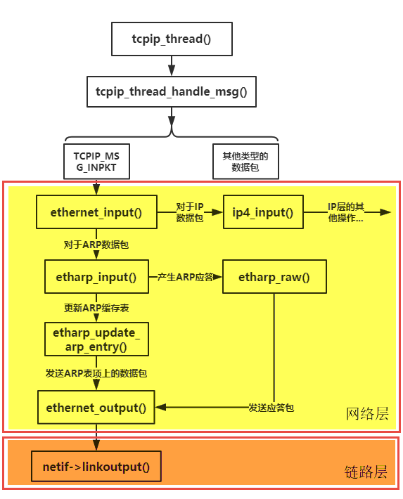

图 10‑9ARP协议处理的流程示意图

数据包发送流程
~~~~~~~~~~~~~~

经过学习，我们知道一个数据包从底层传递进来的流程是怎么样的，如果是ARP数据包就会给ARP去处理，如果是IP数据报就使用ip4_input()函数传递到上层，这些处理在后面的章节讲解。那么如果上层协议想要发送数据，也肯定需要经过ARP协议将IP地址映射为MAC地址才能完成发送操作，IP数据报通过ip4_output()函数将上层数据包传递到ARP协议处理，关于IP协议是怎么样传递的我们暂且不说，那么ARP通过etharp_output()函数接收到IP数据报后，就会进行发送，ARP会先从数据包中进行分析，看看这个IP数据报是单播数据包还是多播或者是广播数据包，然后进行不同的处理：

-  对于多播或者是广播数据包，这种处理就很简单，直接将数据包丢给网卡就行了（调用ethernet_output()函数）。

-  对于单播包的处理稍微麻烦一点，ARP协议需要根据IP地址找到对应的MAC地址，
   然后才能正确发送，如果找不到MAC地址的话，还要延迟发送数据包，ARP协议首先会创建一个ARP表项，
   然后将数据包挂到ARP表项对应的缓存队列上，与此同时会发出一个ARP请求包，等待目标主机的回应后再发送IP数据报。

此处需要注意的是，对于PBUFF_ERF、PBUF_POOL、PBUF_RAM类型的数据包是不允许直接挂到ARP表项对应的缓存队列上的，因为此时内核需要等待目标主机的ARP应答，而这段时间里，这些数据有可能会被上层改动，这是不允许的，所以LwIP需要将这些pbuf数据包拷贝到新的空间，等待发送。

etharp_output()函数
^^^^^^^^^^^^^^^^^^^

etharp_output()函数被IP层的ip4_output()函数调用，IP层传递一个数据包到ARP中，
etharp_output()会根据数据包的目标IP地址选择不同的处理，其源码具体见 代码清单10_11_。

代码清单 10‑11 etharp_output()源码

.. code-block:: c
   :name: 代码清单10_11

    const struct eth_addr ethbroadcast =
                    {{0xff, 0xff, 0xff, 0xff, 0xff, 0xff}};

    const struct eth_addr ethzero = {{0, 0, 0, 0, 0, 0}};

    /** 24位IANA IPv4多播OUI为01-00-5e： */
    #define LL_IP4_MULTICAST_ADDR_0 0x01
    #define LL_IP4_MULTICAST_ADDR_1 0x00
    #define LL_IP4_MULTICAST_ADDR_2 0x5e

    err_t etharp_output
        (struct netif *netif, struct pbuf *q, const ip4_addr_t *ipaddr)
    {
        const struct eth_addr *dest;
        struct eth_addr mcastaddr;
        const ip4_addr_t *dst_addr = ipaddr;

        LWIP_ASSERT_CORE_LOCKED();
        LWIP_ASSERT("netif != NULL", netif != NULL);
        LWIP_ASSERT("q != NULL", q != NULL);
        LWIP_ASSERT("ipaddr != NULL", ipaddr != NULL);

        if (ip4_addr_isbroadcast(ipaddr, netif))
        {
            /* 如果是广播数据包，目标MAC地址设置为FF-FF-FF-FF-FF-FF-FF */
            dest = (const struct eth_addr *)&ethbroadcast;	(1)
            /* multicast destination IP address? */
        }
        else if (ip4_addr_ismulticast(ipaddr))
        {
            /* 如果是多播数据包，目标MAC地址设置为多播地址：01-00-5E-XX-XX-XX*/
            mcastaddr.addr[0] = LL_IP4_MULTICAST_ADDR_0;
            mcastaddr.addr[1] = LL_IP4_MULTICAST_ADDR_1;
            mcastaddr.addr[2] = LL_IP4_MULTICAST_ADDR_2;
            mcastaddr.addr[3] = ip4_addr2(ipaddr) & 0x7f;
            mcastaddr.addr[4] = ip4_addr3(ipaddr);
            mcastaddr.addr[5] = ip4_addr4(ipaddr);

            dest = &mcastaddr;				(2)

        }
        else
        {
            /* 如果是单播目标地IP地址 */
            netif_addr_idx_t i;
            /* 判断目标IP地址是否与主机处于同一子网上，
            如果不是，则修改IP地址 */
            if (!ip4_addr_netcmp(ipaddr, netif_ip4_addr(netif),
                                netif_ip4_netmask(netif)) &&
                    !ip4_addr_islinklocal(ipaddr))		(3)
            {
    #if LWIP_AUTOIP
                struct ip_hdr *iphdr =
                    LWIP_ALIGNMENT_CAST(struct ip_hdr *, q->payload);

                if (!ip4_addr_islinklocal(&iphdr->src))
    #endif
                {
    #ifdef LWIP_HOOK_ETHARP_GET_GW
                    dst_addr = LWIP_HOOK_ETHARP_GET_GW(netif, ipaddr);
                    if (dst_addr == NULL)
    #endif
                    {
                        /* 判断一下网关地址是否有效 */
                        if (!ip4_addr_isany_val(*netif_ip4_gw(netif))) (4)
                        {
                            /* 发送到默认网关，让网关进行转发 */
                            dst_addr = netif_ip4_gw(netif);
                            /* 没有默认网关可用 */
                        }
                        else
                        {
                            /* 返回错误 */
                            return ERR_RTE;
                        }
                    }
                }
            }
            /* 遍历ARP缓存表 */
            for (i = 0; i < ARP_TABLE_SIZE; i++)
            {
                if ((arp_table[i].state >= ETHARP_STATE_STABLE) &&
                        (arp_table[i].netif == netif) &&
                        (ip4_addr_cmp(dst_addr, &arp_table[i].ipaddr)))
                {
                    /* 如果找到目标IP地址对应的表项，直接发送 */
                    ETHARP_SET_ADDRHINT(netif, i);
                    return etharp_output_to_arp_index(netif, q, i); (5)
                }
            }
            /* 如果没有找到与目标IP地址对应的ARP表项 */
            return etharp_query(netif, dst_addr, q);		(6)
        }

        /* 对于多播、广播数据包，直接能得到对应的MAC地址，可以进行发送*/
        return ethernet_output(netif, q,
                    (struct eth_addr *)(netif->hwaddr), dest, ETHTYPE_IP); (7)
    }

代码清单
10‑11\ **(1)**\ ：如果是广播数据包，目标MAC地址设置为FF-FF-FF-FF-FF-FF-FF。

代码清单
10‑11\ **(2)**\ ：如果是多播数据包，目标MAC地址设置为多播地址：01-00-5E-XX-XX-XX。

此处简单补充一下单播包、广播包与多播包的相关知识：

单播包：顾名思义，就是一对一通信，发送的目标主机IP地址是唯一的，就像是人们之间的对话一样，一个人对另外一个人说话。

多播包：“多播”可以理解为一个人向多个人（但不是在场的所有人）说话，比如在一个大餐厅中，一个人说话只能让一桌人知道，而其他桌上的人并不知道说了什么。同理的，主机发送的多播包只能让某些满足条件的目标主机接收到。

广播包：而广播就是类似于用大喇叭进行广播通知，在场的所有人都能知道。广播包是让所有处于同一子网的主机都能接收到数据包。

代码清单
10‑11\ **(3)**\ ：如果是单播目标地IP地址，首先判断目标IP地址是否与主机处于同一子网上，
如果不是，则修改IP地址，IP地址为网关的IP地址，目的是为了让网关进行转发。

代码清单
10‑11\ **(4)**\ ：判断一下网关地址是否有效，如果有效，则发送到默认网关，让网关进行转发，没有默认网关可用则返回错误代码。

代码清单
10‑11\ **(5)**\ ：遍历ARP缓存表，如果找到目标IP地址对应的表项，
调用etharp_output_to_arp_index()函数直接发送，该函数源码具体见代码清单
10‑12。

代码清单
10‑11\ **(6)**\ ：如果没有找到与目标IP地址对应的ARP表项，
需要调用etharp_query()函数进行发送，这个函数在稍后讲解，具体见10.11.3
小节。

代码清单
10‑11\ **(7)**\ ：对于多播、广播数据包，直接能得到对应的MAC地址，可以进行发送。

etharp_output_to_arp_index()函数
^^^^^^^^^^^^^^^^^^^^^^^^^^^^^^^^

这个函数是ARP找到了IP地址与MAC地址对应的表项，从而能直接进行发送，除此之外，ARP还需要更新ARP表项，我们知道，LwIP中的ARP表项生存时间是5分钟（300秒），那么在APP表项的生存时间即将到来的时候，ARP需要更新表项，为什么要在发送数据的时候更新呢？因为如果不发送数据，那就没必要更新ARP表项，这样子表项在生存时间到来的时候就会被系统删除，回收ARP表项空间，而一直使用的ARP表项需要是谁更新，更新的方式也有两种：

如果ARP表项还差15秒就过期了，LwIP会通过广播的方式发送一个ARP请求包，试图得到主机的回应。

而如果ARP表项还差30秒就过期了，那么LwIP会通过单播的方式向目标主机发送一个请求包并试图得到回应。

在这种情况下发送ARP请求包的时候，表项的状态会由ETHARP_STATE_STABLE变成ETHARP_STATE_STABLE_REREQUESTING_1，如果目标主机回应了，那就更新ARP缓存表中的表项。

当然，如果还没那么快到期的话，那就直接调用ethernet_output()函数将数据包传递给网卡进行发送。
函数源码具体见 代码清单10_12_

代码清单 10‑12 etharp_output_to_arp_index()函数源码

.. code-block:: c
   :name: 代码清单10_12

    #define ARP_MAXAGE                      300

    /* 即将到期的时间 */
    #define ARP_AGE_REREQUEST_USED_UNICAST   (ARP_MAXAGE - 30)
    #define ARP_AGE_REREQUEST_USED_BROADCAST (ARP_MAXAGE - 15)

    static err_t
    etharp_output_to_arp_index(struct netif *netif,
                            struct pbuf *q,
                            netif_addr_idx_t arp_idx)
    {
        LWIP_ASSERT("arp_table[arp_idx].state >= ETHARP_STATE_STABLE",
                    arp_table[arp_idx].state >= ETHARP_STATE_STABLE);
        /* 如果arp表项即将过期：LwIP会重新请求它，
            但只有当它的状态是ETHARP_STATE_STABLE才能请求*/
        if (arp_table[arp_idx].state == ETHARP_STATE_STABLE)
        {
            /* 还差15秒到期 */
            if (arp_table[arp_idx].ctime >= ARP_AGE_REREQUEST_USED_BROADCAST)
            {
                /* 使用广播方式发出请求包 */
            if (etharp_request(netif, &arp_table[arp_idx].ipaddr) == ERR_OK)
                {
                arp_table[arp_idx].state = ETHARP_STATE_STABLE_REREQUESTING_1;
                }
            }
            /* 还差30秒到期 */
        else if (arp_table[arp_idx].ctime >= ARP_AGE_REREQUEST_USED_UNICAST)
            {
                /* 发出单播请求（持续15秒），以防止不必要的广播 */
                if (etharp_request_dst(netif,
                                    &arp_table[arp_idx].ipaddr,
                                    &arp_table[arp_idx].ethaddr) == ERR_OK)
                {
                arp_table[arp_idx].state = ETHARP_STATE_STABLE_REREQUESTING_1;
                }
            }
        }

        return ethernet_output(netif, q,
                            (struct eth_addr *)(netif->hwaddr),
                            &arp_table[arp_idx].ethaddr, ETHTYPE_IP);
    }

etharp_query()函数
^^^^^^^^^^^^^^^^^^

如果在ARP缓存表中没有找到目标IP地址对应的表项，那么ARP协议就会创建一个表项，
这也是ARP协议的核心处理，对于刚创建的表项，它在初始化网卡信息后会被设置为ETHARP_STATE_PENDING状态，
与此同时一个ARP请求包将被广播出去，这个时候的表项是无法发送数据的，
只有等待到目标主机回应了一个ARP应答包才能发送数据，那么这些数据在这段时间中将被挂到表项的等待队列上，
在ARP表项处于ETHARP_STATE_STABLE状态完成数据的发送，
函数源码具体见 代码清单10_13_。

代码清单 10‑13 etharp_query()函数

.. code-block:: c
   :name: 代码清单10_13

    err_t
    etharp_query(struct netif *netif,
                const ip4_addr_t *ipaddr,
                struct pbuf *q)
    {
        struct eth_addr *srcaddr = (struct eth_addr *)netif->hwaddr;
        err_t result = ERR_MEM;
        int is_new_entry = 0;
        s16_t i_err;
        netif_addr_idx_t i;

        /* 检是否为单播地址 */
        if (ip4_addr_isbroadcast(ipaddr, netif) ||
                ip4_addr_ismulticast(ipaddr) ||
                ip4_addr_isany(ipaddr))
        {
            return ERR_ARG;
        }

        /* 在ARP缓存中查找表项，如果没有则尝试创建表项 */
        i_err = etharp_find_entry(ipaddr, ETHARP_FLAG_TRY_HARD, netif);(1)

        /* 没有发现表项或者没有创建表项成功 */
        if (i_err < 0)
        {
            LWIP_DEBUGF(ETHARP_DEBUG | LWIP_DBG_TRACE,
                        ("etharp_query: could not create ARP entry\n"));
            if (q)
            {
                LWIP_DEBUGF(ETHARP_DEBUG | LWIP_DBG_TRACE,
                            ("etharp_query: packet dropped\n"));
                ETHARP_STATS_INC(etharp.memerr);
            }
            return (err_t)i_err;  //返回错误代码
        }
        LWIP_ASSERT("type overflow", (size_t)i_err < NETIF_ADDR_IDX_MAX);

        //找到对应的表项或者创建表项成功
        i = (netif_addr_idx_t)i_err;

        /* 将新表项标记为待处理 */
        if (arp_table[i].state == ETHARP_STATE_EMPTY)
        {
            is_new_entry = 1;
            arp_table[i].state = ETHARP_STATE_PENDING;
            /* 记录网络接口 */
            arp_table[i].netif = netif;				(2)
        }

        /* 是否有新的表项 */
        if (is_new_entry || (q == NULL))				(3)
        {
            /* 发送ARP请求包*/
            result = etharp_request(netif, ipaddr);
            if (result != ERR_OK)
            {
                /* 无法发送ARP请求 */
            }
            if (q == NULL)
            {
                return result;					(4)
            }
        }

        LWIP_ASSERT("q != NULL", q != NULL);
        /* 表项状态是否稳定 */
        if (arp_table[i].state >= ETHARP_STATE_STABLE)
        {
            ETHARP_SET_ADDRHINT(netif, i);
            /* 发送数据包 */
            result = ethernet_output(netif, q,
                                    srcaddr,
                                    &(arp_table[i].ethaddr),
                                    ETHTYPE_IP);			(5)
        }
        /* 如果表项是ETHARP_STATE_PENDING状态 */
        else if (arp_table[i].state == ETHARP_STATE_PENDING)
        {
            /* 将给数据包'q'排队 */
            struct pbuf *p;
            int copy_needed = 0;
            /* 如果q包含必须拷贝的pbuf，请将整个链复制到一个新的PBUF_RAM */
            p = q;
            while (p)
            {
                LWIP_ASSERT("no packet queues allowed!",
                            (p->len != p->tot_len) || (p->next == 0));
                if (PBUF_NEEDS_COPY(p))				(6)
                {
                    //需要拷贝
                    copy_needed = 1;
                    break;
                }
            p = p->next;
        }
        if (copy_needed)
        {
            /* 将整个数据包复制到新的pbuf中 */
            p = pbuf_clone(PBUF_LINK, PBUF_RAM, q);		(7)
            }
            else
            {
                /* 引用旧的pbuf就足够了 */
                p = q;
                pbuf_ref(p);
            }

            if (p != NULL)
            {
                /* 如果使用队列 */
    #if ARP_QUEUEING
                struct etharp_q_entry *new_entry;
                /* 分配一个新的arp队列表项 */			(8)
            new_entry = (struct etharp_q_entry *)memp_malloc(MEMP_ARP_QUEUE);
                if (new_entry != NULL)
                {
                    unsigned int qlen = 0;
                    new_entry->next = 0;
                    new_entry->p = p;
                    if (arp_table[i].q != NULL)
                    {
                        /* 队列已经存在，将新数据包插入队列后面 */
                        struct etharp_q_entry *r;
                        r = arp_table[i].q;
                        qlen++;
                        while (r->next != NULL)
                        {
                            r = r->next;
                            qlen++;
                        }
                        r->next = new_entry;			(9)
                    }
                    else
                    {
                        /* 队列不存在，数据包就是队列的第一个节点 */
                        arp_table[i].q = new_entry;		(10)
                    }
    #if ARP_QUEUE_LEN
                    if (qlen >= ARP_QUEUE_LEN)
                    {
                        struct etharp_q_entry *old;
                        old = arp_table[i].q;
                        arp_table[i].q = arp_table[i].q->next;
                        pbuf_free(old->p);
                        memp_free(MEMP_ARP_QUEUE, old);
                    }
    #endif
                    result = ERR_OK;
                }
                else
                {
                    /* 申请内存失败 */
                    pbuf_free(p);
                    result = ERR_MEM;
                }
    #else
                /* 如果只是挂载单个数据包，那么始终只为每个ARP请求排队一个数据包，
                就需要释放先前排队的数据包 */
                if (arp_table[i].q != NULL)
                {
                    pbuf_free(arp_table[i].q);			(11)
                }
                arp_table[i].q = p;
                result = ERR_OK;

    #endif
            }
            else
            {
                ETHARP_STATS_INC(etharp.memerr);
                result = ERR_MEM;
            }
        }
        return result;
    }

代码清单
10‑13\ **(1)(2)**\ ：函数的处理逻辑是很清晰的，首先调用etharp_find_entry()函数在ARP缓存表中查找表项，
如果没有找到就尝试创建表项并且返回表项的索引，当然ARP缓存表中可能存在表项，
可能为新创建的表项（ETHARP_STATE_EMPTY），也可能为ETHARP_STATE_PENDING或者ETHARP_STATE_STABLE状态。
如果是新创建的表项，那么表项肯定没有其他信息，LwIP就会初始化一些信息，如网卡，
然后就将表项设置为ETHARP_STATE_PENDING状态。

代码清单
10‑13\ **(3)**\ ：如果表项是刚创建的或者数据包是空的，那么就会调用etharp_request()函数发送一个ARP请求包。

代码清单 10‑13\ **(4)**\ ：如果数据包是空的，直接返回结果

代码清单 10‑13\ **(5)**\ ：如果表项的状态大于等于
ETHARP_STATE_STABLE，表示表项已经是稳定状态了，就调用ethernet_output()函数发送数据包。

代码清单
10‑13\ **(6)**\ ：通过宏定义PBUF_NEEDS_COPY(p)对数据包的类型进行判断，
如果需要拷贝则将变量copy_needed设置为1，表示需要拷贝。

代码清单 10‑13\ **(7)**\ ：将整个数据包复制到新的pbuf中。

代码清单
10‑13\ **(8)**\ ：如果ARP_QUEUEING宏定义为1，则表示使用队列，那么LwIP会分配一个新的ARP数据包队列节点，然后插入队列中。

代码清单 10‑13\ **(9)**\ ：如果队列已经存在，将新数据包插入队列后面。

代码清单 10‑13\ **(10)**\ ：如果队列不存在，数据包就是队列的第一个节点。

代码清单
10‑13\ **(11)**\ ：如果只是挂载单个数据包，就需要释放先前排队的数据包，然后再挂载新的数据包。

挂载的这些数据在等待到目标主机产生ARP应答的时候会发送出去，此时的发送就是延时了，所以在没有ARP表项的时候，发送数据会产生延时，在指定等待ARP应答时间内如果等不到目标主机的应答，那么这个表项将被系统回收，同时数据也无法发送出去。

上层数据包通过ARP协议进行发送数据的流程示意图具体见 图10_10_。

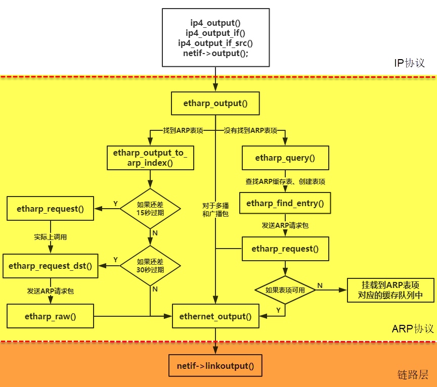

图 10‑10数据包通过ARP协议发送流程图

整个ARP协议运作示意图具体见 图10_11_。

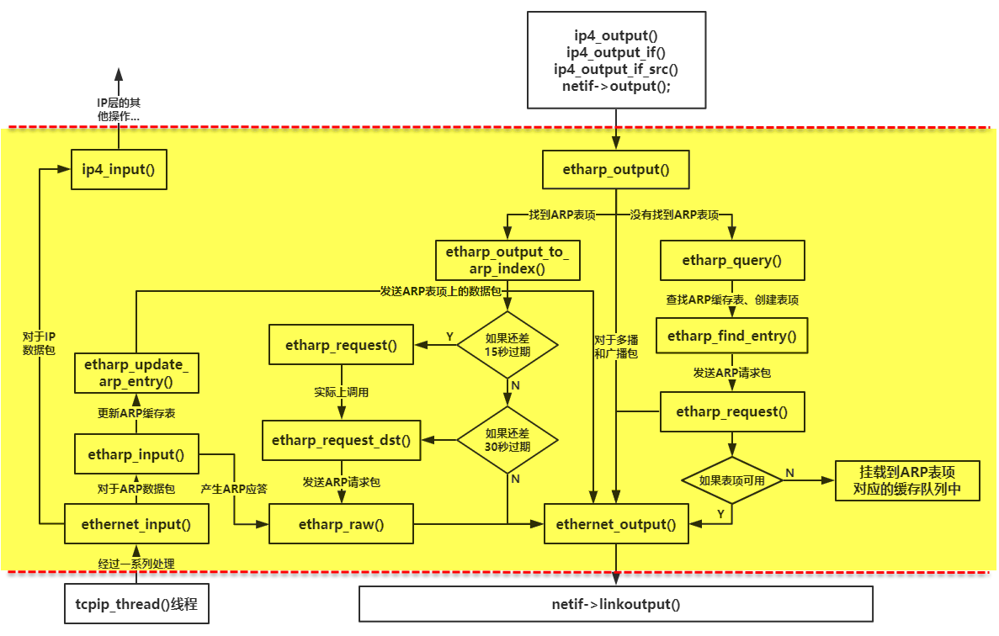

图 10‑11整个ARP协议运作示意图
