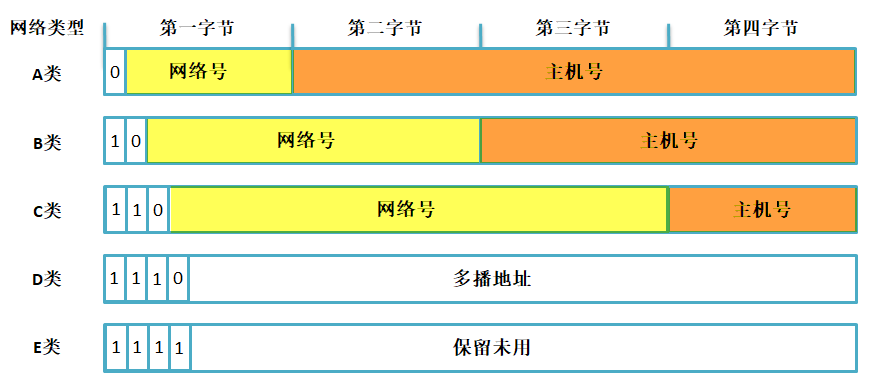
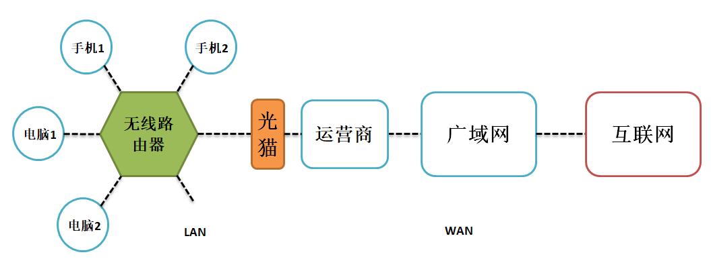
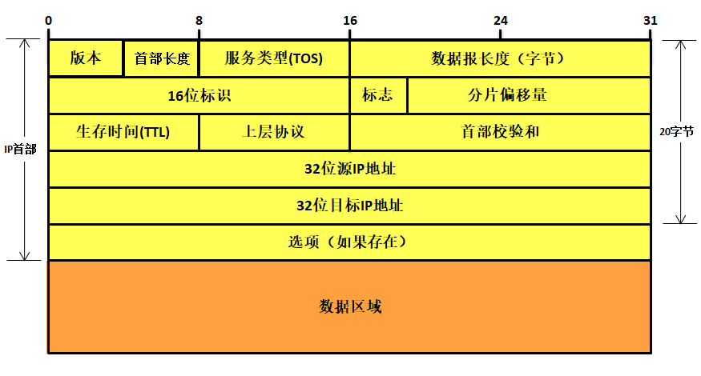
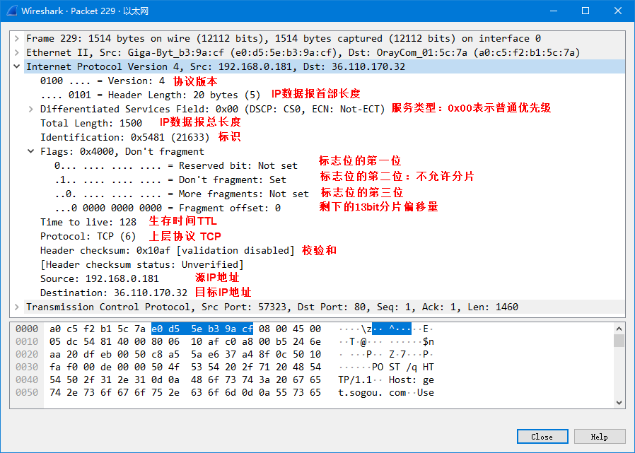
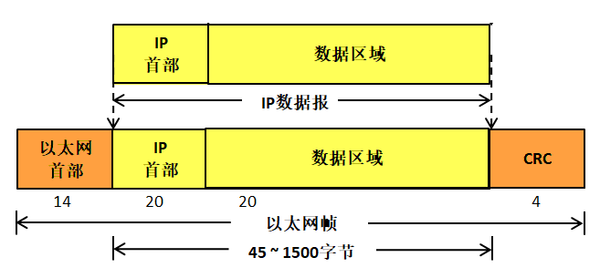
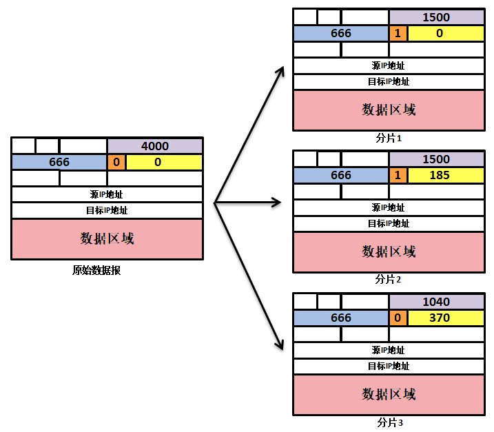
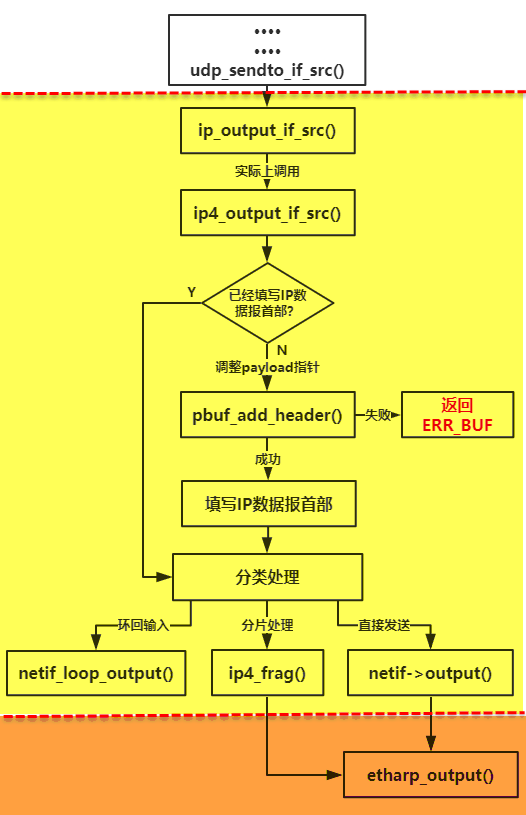
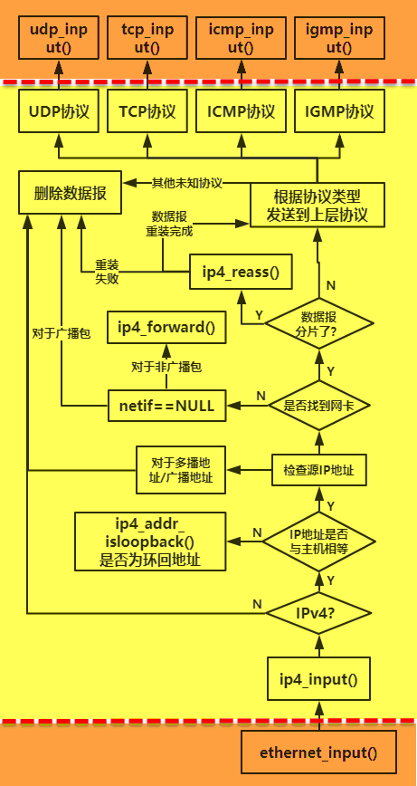

IP协议
------

IP协议（Internet
Protocol），又称之为网际协议，IP协议处于IP层工作，它是整个TCP/IP协议栈的核心协议，上层协议都要依赖IP协议提供的服务，IP协议负责将数据报从源主机发送到目标主机，通过IP地址作为唯一识别码，简单来说，不同主机之间的IP地址是不一样的，在发送数据报的过程中，IP协议还可能对数据报进行分片处理，同时在接收数据报的时候还可能需要对分片的数据报进行重装等等。

IP协议是一种无连接的不可靠数据报交付协议，协议本身不提供任何的错误检查与恢复机制。

IP地址
~~~~~~

概述
^^^^

在TCP/IP设计之初，为了标识互联网中的每台主机的身份，设计人员为每个接入网络中的主机都分配一个IP地址（Internet
Protocol
Address），是一个32位的整数地址，只有合法的IP地址才能接入互联网中并且与其他主机进行通信，IP地址是软件地址，不是硬件地址，硬件MAC地址是存储在网卡中的，应用于本地网络中寻找目标主机。而IP地址能让一个网络中的主机能够与另一个网络中的主机进行通信，无需理会这些主机之间的MAC地址。

在学习IP地址之前，我们需要简述一下主机与路由器连入网络的通信的方法：一台主机通常只有一条链路连接到网络，一般只有一个网卡；当主机中想发送一个数据报时，它就在该链路上发送，一个网卡对应一个MAC地址与IP地址，当然，主机也可能有多个网卡，这样子主机就有多个MAC地址与IP地址。

每个IP地址长度为32比特（4字节），因此总共有\ :math:`2^{32}`\ 个可能的IP地址，
大约有40亿个IP地址能被使用的。这些地址一般按所谓点分十进制记法（dotted-decimal notation）书写，
即地址中的每个字节用它的十进制形式书写，各字节间以点分隔开。例如，
IP地址为192.168.0.122，192是该地址第一个8比特的十进制等价数，168是该地址第二个8比特的十进制等价数，依次类推。

IP地址编址
^^^^^^^^^^

在全球的互联网中，每个主机都要唯一的一个IP地址作为身份识别，那么这么多IP地址是怎么样分配的呢？这不可能是随意自由选择IP地址的，实际上每个主机的IP地址的一部分都由其所在的子网决定的，所以又出现了IP地址分类编址的概念，网络的类型决定了IP
地址将如何划分成网络部分和节点部分，在分类编址中，设计者把所有的IP地址划分为5大类，分别为A、B、C、D、E五类，每一类地址都觉定了其中IP地址的一部分组成，具体见 图11_1_。

图 11‑1分类编址

A 类网络地址的第一个字节的第一位必须为0 ，因此， A
类网络地址第一个字节的取值范围为0~127（注意：但0 和127 不是有效的A
类网络地址号），A类地址总共有128个网络号，其中3个网络号用作特殊用途，
因此可以在互联网上使用的还有125个，而每一个网络号后面的3字节主机号表示能用于A类网络地址不同网络号的的主机数量（多达\ :math:`2^{24}`-2
=
16777214个），所以总的来说A类网络支持的主机数量为125*16777214=2097151750个，大约占据了40亿IP地址的半壁江山，这些IP地址通常被分配给世界上超大型的机构使用，但是通常没有任何一个机构能使用那么大量的IP地址，所以A类地址的很多IP地址都会被白白浪费掉。

B 类网络地址的第一个字节的第一位必须为1 ，且第二位必须为0，因此， B
类网络地址第一个字节的取值范围为128~191，前2字节剩余的14bit表示网络号，多达16384个网络号，
其中16个网络号被保留使用，因此可以分配给企业使用的网络号有16368个，每一个网络号中可以拥有\ :math:`2^{16}`-2
=65534个主机，总的来说B类网络支持的主机个数为16368*65534=1072660512，大约占据了所有IP地址的四分之一。

C 类网络地址的第一个字节的第一位必须为1，第二位必须为1，第三位必须为0，因此C类网络第一个字节的取值范围为192~223，
C类地址的前三个字节用于表示网络号（剩下的21bit），所以拥有2097152个网络号，但是其中的256个网络号被保留出来，
因此C类地址的可用网络号为2096896个，每个网络号下的主机个数为254，因此C类网络支持的主机数量为532611584，
大约占据了所有IP地址的八分之一。

D 类IP地址的第一个字节前四位为1110，那么它第一个字节的取值范围为224~239，约占据了所有IP地址的十六分之一，
R它是一个专门保留的地址，它并不指向特定的网络，目前这一类地址被用于多播。

E类IP地址的第一个字节前四位必须为1111，那么它第一个字节的取值范围为240~255，约占据了所有IP地址的十六分之一，是为将来使用而保留的，其中32bit全为1的IP地址（255.255.255.255）用作广播地址。

各类IP地址的特点具体见

表格 11‑1各类IP地址的特点

+------+-----------+------------------+------------+----------+----------+
| 类别 | 第一字节  | 第一字节取值范围 | 网络号个数 | 主机号   | 适用范围 |
|      |           |                  |            |          |          |
|      | (二进制)  |                  |            | 个数     |          |
+======+===========+==================+============+==========+==========+
| A类  | 0XXX XXXX | 0~127            | 125        | 16777214 | 大型网络 |
+------+-----------+------------------+------------+----------+----------+
| B类  | 10XX XXXX | 128~191          | 16368      | 65534    | 中型网络 |
+------+-----------+------------------+------------+----------+----------+
| C类  | 110X XXXX | 192~223          | 2097152    | 254      | 小型网络 |
+------+-----------+------------------+------------+----------+----------+
| D类  | 1110 XXXX | 224~239          | —          | —        | 多播     |
+------+-----------+------------------+------------+----------+----------+
| E类  | 1111 XXXX | 240~255          | —          | —        | 保留     |
+------+-----------+------------------+------------+----------+----------+

特殊IP地址
^^^^^^^^^^

除了上述的网络地址外，还有一些特殊用途的地址，这些地址是不允许分配给任何一个网络的主机使用的，下面简单介绍几个常见的特殊地址。

受限广播地址
''''''''''''

广播通信是一对所有的通信方式，受限广播地址用于定义整个互联网，如果设备想使IP数据报被整个网络所接收，就发送这个目的地址全为1的广播包，但这样会给整个互联网带来灾难性的负担，所以在任何情况下，路由器都会禁止转发目的地址为255.255.255.255的广播数据包，因此这样的数据包仅会出现在本地网络中（局域网），255.255.255.255这个地址指本网段内的所有主机，
相当于“房子里面的人都听着”通知所有主机。

注意：此处不要与以太网的广播地址（255-255-255-255-255-255）混淆了。

直接广播地址
''''''''''''

受限广播地址是网络号与主机号都为1的地址，但是直接广播地址是主机号全为1而得到的地址，广播地址代表本网络内的所有主机，使用该地址可以向网络内的所有主机发送数据，比如一个IP地址是192.168.0.181，这是C类地址，所以它的主机号只有一个字节，那么对主机号全取1得到一个广播地址192.168.0.255，向这个地址发送数据就能让同一网络下的所有主机接收到。

A、B、C三类地址的广播地址结构如下：

-  A类地址的广播地址为：XXX.255.255.255（XXX为A类地址的第一个字节取值范围）。

-  A类地址的广播地址为：XXX.
   XXX.255.255（XXX为B类地址的前两个字节取值范围）。

-  A类地址的广播地址为：XXX. XXX.
   XXX.255（XXX为C类地址的前三个字节取值范围）。

注意：这个地址在IP数据报中只能作为目的地址。另外，直接广播地址使一个网段中可分配给设备的地址数减少了1个。

多播地址
''''''''

多播地址用在一对多的通信中，即一个发送者，多个接收者，不论接受者员数量的多少，发送者只发送一次数据包。多播地址属于分类编址中的D类地址，
D类地址只能用作目的地址，而不能作为主机中的源地址。

环回地址
''''''''

127网段的所有地址都称为环回地址，主要用来测试网络协议是否工作正常的作用。比如在电脑中使用ping
命令去ping
127.1.1.1就可以测试本地TCP/IP协议是否正常。用通俗的话表示，就是“我自己”，不能以127网段中的IP地址作为主机地址，因此A类地址又少了一个可用网络号。

本网络本主机
''''''''''''

IP地址32bit全为0的地址（0.0.0.0）表示的是本网络本主机，这个IP地址在IP数据报中只能用作源IP地址，这发生在当设备启动时但又不知道自己的IP地址情况下。在使用DHCP分配IP地址的网络环境中，这样的地址是很常见的，主机为了获得一个可用的IP地址，就给DHCP服务器发送IP数据报，并用这样的地址（0.0.0.0）作为源地址，目的地址为255.255.255.255（因为主机这时还不知道DHCP服务器的IP地址），然后DHCP服务器就会知道这个主机暂时没有IP地址，那么就会分配一个IP给这个主机。

局域网和广域网的概念
~~~~~~~~~~~~~~~~~~~~

什么是局域网
^^^^^^^^^^^^

局域网（Local Area
Network，缩写为LAN），又称内网，指覆盖局部区域（如办公室或楼层）的计算机网络，局域网可以实现文件管理、应用软件共享、打印机共享、工作组内的日程安排、电子邮件和传真通信服务等功能，是在一定区域内由多个计算机连接组成的网络，比如腾讯、阿里的内网，在内部的计算机上的数据可以互联互通、数据共享等。简单来说，当我们使用的开发板接入路由器的时候，电脑的网络也接入路由器，那么开发板与电脑就组成局域网，数据在链路层上是互联互通的。当然，板子也能通过网线直连电脑，这样子也是组成一个局域网络，数据可以在两个主机之间进行通信。

什么是广域网
^^^^^^^^^^^^

广域网（Wide Area Network，缩写为
WAN），又称广域网、外网、公网。是连接不同地区计算机以进行通信的网络，这种网络通常会跨越很大的范围，覆盖的范围从几十公里到几千公里，它能连接多个地区、城市并能提供远距离通信服务，但是注意的是我们说的广域网并不等同于互联网。

简单来说（我使用比喻的方式表达），如果局域网是小溪，不同区域有很多的小溪，这些小溪汇聚成江河，那么这些江河就是广域网，然后这些江河再流入大海，这个大海就是互联网。互联网就是由无数个局域网，通过广域网线路汇聚互联起来，就形成了互联网。互联网的特点是开放、互联，如果一个公司的局域网没有连接到互联网，那这个局域网就不属于互联网，仅仅属于内部通信的网络。

举个例子，如果你家在某网络运营商办理了网络服务，可能他们将送你一个光猫，然后你拿着这个光猫就能上网了，
你可能觉得需要多人使用网络，所以你又去买了一个无线路由器，让家人也能连接到网络上，那么这个家就是一个局域网，
然后局域网的通信是通过运营商连接到广域网上的，示意图具体见 图11_2_。

图 11‑2局域网与广域网示意图

这个示意图虽然简单，却把LAN、WAN、Internet三者全包含了。无线路由器把电脑、手机等设备连接到局域网LAN上，并分配IP地址，即局域网IP，我们可以称之为LAN-IP，LAN-IP所到之处，就是局域网的范围，像我们电脑的IP地址（192.168.0.xxx）就是一个局域网IP，而路由器的地址就是运营商给我们的一个IP地址，这个IP地址是有效的，可以看做是WAN-IP（实际上这个IP地址也是运营商的局域网IP地址（相对运营商来说），这个地址在运营商中转换成一个真正的广域网IP地址，但是这些事情我们暂时无需理会，只要把路由器的IP地址看做是WAN-IP即可）。

而运营商是一个边界，国家与国家之间有边界，网络之间也有边界，运营商就是局域网LAN与广域网WAN的边界。局域网LAN-IP可以在局域网内部有效，但是无法跨越边界进入广域网中，LAN-IP是路由器分配给我们的IP，那么我们想要跨越边界进入广域网中，就需要将LAN-IP变成有效的的IP地址，也就是WAN-IP，那么在路由器中就需要将IP地址进行转换，完成LAN-IP<—>WAN-IP地址转换（NAT），关于地址转换的内容我们稍后讲解统一换成特别通行证才可以在广域网里继续邀游。

当持有WAN-IP的IP包顺利到达下一个边界Internet
Gateway，这是通往互联网Internet的最后一道关卡，即边界。左边是广域网，右边是互联网，也需要做WAN-IP
与
Global-IP（互联网公共IP）的转换才能进入互联网中，我们知道这种概念即可，无需过多深入。

网络地址转换（NAT）
~~~~~~~~~~~~~~~~~~~

NAT英文全称是“Network Address
Translation”，中文意思是“网络地址转换”，它是一个IETF(Internet
Engineering Task Force，
Internet工程任务组)标准，允许一个整体机构以一个公用IP（Internet
Protocol）地址出现在Internet上。顾名思义，它是一种把内部私有网络地址（IP地址）翻译成合法网络IP地址的技术。因此NAT在一定程度上，能够有效的解决IP地址不足的问题，它是一个方便且得到了广泛应用的技术，当然，NAT也让主机之间的通信变得复杂，导致了通信效率的降低。

具有NAT功能的路由器必须拥有一个内部地址与一个外部地址，内部地址是为了与局域网的用户通信而使用的，它使用一个特定的内部IP地址，如192.168.0.1（也是局域网的网关），外部地址是与广域网进行通信而使用的，这是一个有效的IP地址，通常为运营商分配给我们，假设运营商分配给我们的IP地址是一个C类网络地址223.166.166.66，假设我们电脑上的IP地址是192.168.0.181，端口号是5555。

那么在局域网的电脑想要与外网进行通信的时候，比如我们想访问百度（假设百度的IP地址是123.125.115.110，端口号是80），那么电脑就会把这些数据报发送到路由器中，请求路由器帮忙转发，假设这些数据报格式简化为：

（源IP地址，端口号，目标IP地址，端口号）

（192.168.0.181，5555，123.125.115.110， 80）

具有NAT功能的路由器会在内部维护一个NAT转换表，当路由器收到局域网的IP数据报时，就会为这个数据报分配一个路由器内部的NAT端口，假设为6666，并且路由器会将原始IP数据报中源IP地址与端口号（192.168.0.181，5555）转换成一个有效IP地址与端口号（223.166.166.66，6666），然后转换后的路由器发出的数据就是：

（223.166.166.66，6666，123.125.115.110， 80）

当百度响应这个数据报的时候，就会返回一个响应信息，它返回的目标IP地址就是我们路由器的有效IP地址和端口号（223.166.166.66，6666），那么路由器收到的数据报就是：

（123.125.115.110， 80，223.166.166.66，6666）

当路由器收到这个数据报之后，会在NAT转换表中查找端口号为6666的连接，并且把数据报中的目标IP地址与端口号（223.166.166.66，6666）转换成局域网内我们电脑的IP地址与端口号（192.168.0.181，5555），并且将数据报转发到我们的主机上，那么我们电脑上收到的数据报就是：

（123.125.115.110， 80，192.168.0.181，5555）

这样子的数据报对于电脑来说，是很正常的通信方式，但是它并不知道路由器已经转换过这些数据报的IP地址与端口内容，所以NAT对于所有用户来说是透明的，通过这样子的两次转换，局域网就实现了与广域网的通信，在NAT转换中，NAT端口号是一个关键的因素，路由器应及时为每个连接分配唯一的端口号，并且要及时回收那些不使用的端口号。

IP数据报
~~~~~~~~

虽然前面我们也接触过IP数据报（也可以称之为IP数据报或者IP分组，为了统一，下文均采用IP数据报），IP数据报与ARP报文都是一种报文格式，都有自己的组织形式，与ARP报文一样，由两部分组成，一部分是IP首部，另一部分是数据区域，一个IP数据报的首部长度是不定的，通常为20~60字节，根据选项决定。而数据区域理论上可以多达65535个字节，但是很少有数据是那么大的，并且受限于网卡硬件。

IP数据报的格式如所示 图11_3_。

图 11‑3IP数据报格式（IPv4）

版本（号），占据4bit空间。这个字段规定了数据报的IP协议版本，对于IPv4，该值为4；对于IPv6，该值为6。通过查看版本号，路由器能够确定如何解释IP数据报的其他部分，不同的IP版本使用不同的数据报格式。目前版本的IP（即IPv4）的数据报格式如图
11‑3所示，而新版本的IP（IPv6）的数据报格式又有所不同，此处我们就不做过多讨论IPv6版本的IP数据报格式，若无特殊说明，本书所写的IP数据报内容均为IPv4。

部首长度字段占据4bit空间，用于记录IP首部的数据的长度，为什么需要记录首部长度呢？因为IP首部中包含了一些可变的数据选项，故需要这4bit记录首部的长度，以便区分数据部分的起始位置，当然啦，4bit的部首长度单位是字，只有这样子才能最大记录60个字节的数据（15*4=60）。

服务类型(TOS)占据8bit空间，服务类型（TOS）包含在IPv4首部中，以便使不同类型的IP数据报（例如，一些特别要求低时延、高吞吐量或可靠性的数据报）能相互区别开来。提供特定等级的服务是一个由路由器管理员决定的策略问题，简单来说就路由器根据是这个字段的值来为数据报提供（选择）最合理的路径。

数据报长度字段占据16bit空间。这是IP数据报的总长度（首部加上数据区域），以字节为单位。因为该字段长为16bit，所以整个IP数据报的理论最大长度为65535字节，然而，数据报很少有超过1500字节的，这是因为底层链路硬件不允许那么大的数据报出现在链路上，以太网数据帧的最大长度为1500个字节，当有一个很大的IP数据报出现的时候，就需要进行分片处理；而如果IP数据报的数据很少的时候，比如少于46个字节，那么在以太网进行发送数据的时候会填充一定的字节以满足以太网帧最小长度，那么在接收方就要根据这个字段的内容进行提取有效数据。

标识、标志、分片偏移量这三个字段与IP数据报分片有关，这是一个我们将很快要深入学习的一个问题，在后文详细讲解。但更有趣的是，新版本的IP（即IPv6）数据报则不允许对数据进行分片处理。

标识字段用于表示IP层发送出去的每一份IP数据报，在发送每一份报文，该值加1，在分片的时候，该字段会被复制到每个分片数据报中，在目标接收主机中，使用该字段判断这些数据是否属于同一个IP数据报。

标志位（3bit）的定义如下：第一位保留未用；第二位是不分片标志位，如果该位为1，则表示IP数据报在发送的过程中不允许进行分片，如果这个IP数据报的大小超过链路层能承载的大小，这个IP数据报将被丢弃，如果该位为0则表示IP层在必要的时候可以对其进行分片处理；第三位为更多分片位，如果为1则表示该分片数据报不是整个IP数据报的最后一个分片，如果为0则表示是整个IP数据报的最后一个分片。

分片偏移量占据13bit空间，表示当前分片所携带的数据在整个IP数据报中的相对偏移位置（以8字节为单位），目标主机必须受到以0偏移量开始到最高偏移量的所有分片，才能将分片进行重装为一个完整的IP数据报，并且重装IP数据报的依据就是分片的偏移量。

生存时间（Time-To-Live，TTL），该字段用来确保数据报不会永远在网络中循环（例如由于长时间的路由选择环路）。每当IP数据报由一台路由器处理时，该字段的值减1，若TTL字段减为0，则该数据报必须丢弃，同时会返回一个ICMP差错报文给源主机，这样子数据就不会永远在网络中漂流而占据资源。

上层协议字段占据8bit空间。该字段仅在一个IP数据报到达其最终目的地才会有用。该字段的值指示了IP数据报的数据部分应交给哪个特定的传输层协议。例如，值为6表明数据部分要交给TCP，而值为17表明数据要交给UDP。在IP数据报中的协议号所起的作用，类似于运输层报文段中端口号字段所起的作用。协议字段是将网络层与运输层绑定到一起的粘合剂，而端口号是将运输层和应用层绑定到一起的粘合剂，此处了解这个概念即可。

首部检验和字段占据16bit空间。首部检验和用于帮助路由器检测收到的IP数据报首部是否发生错误，而对应IP数据报中的数据区域校验那是上层协议处理的事情。首部检验和是这样计算的：将首部中的每2个字节当作一个数，用反码运算对这些数求和，该和的反码（被称为因特网检验和）存放在检验和字段中。路由器要对每个收到的IP数据报计算其首部检验和，如果数据报首部中携带的检验和与计算得到的检验和不一致，则表示出现错误，路由器一般会丢弃检测出错误的IP数据报。注意了：IP数据报在到达每个路由器上都必须重新计算检验和并再次存放到原处，因为TTL字段以及可能的选项字段会改变。

可能很多人都会有疑问：为什么TCP/IP协议在传输层与网络层都执行差错检测？首先，在IP层只对IP首部计算了检验和，而传输层检验和是对整个TCP/UDP报文段进行的。

这样子在每个路由器对IP数据报首部检查校验能提高效率，直到IP数据报到达目标IP地址。

源IP地址与目标IP地址就不用过多解释了，源主机在生存ip数据包的时候会在源IP地址字段中插入它的IP地址，在目标IP地址字段中插入其想要发送的最终目标IP地址。

选项字段占据0~40个字节。它允许IP首部被扩展，首部选项在日常生活中还是比较少使用的，因此在每个IP数据报首部中必须存在的字段是不包括选项字段的，这样能够节约开销，如果与选项字段就添加，而如果没有就无需理会。在LwIP中只识别选项字段，但是不会处理选项字段的内容。因为选项的存在的确是件复杂的事，IP数据报首部长度可变，故不能预先确定数据字段从何处开始，而且还因为有些数据报要求处理选项，而有些数据报则不要求，故导致一台路由器处理一个IP数据报所需的时间变化很大，这些考虑对于高性能路由器和主机上的IP协议处理来说特别重要，由于这样或那样的原因，在IPv6数据报首部中已去掉了IP数据报中的选项字段（此处我们不讲解选项字段的知识）。

数据区域（也可以称之为有效载荷），这是IP数据报的最后的一个字段，也是最重要的内容，因为有数据区域才会有数据报首部的存在，在大多数情况下，IP数据报中的数据字段包含要交付给目标IP地址的运输层（TCP协议或UDP协议），当然，数据区域也可承载其他类型的报文，如ICMP报文。

至此，整个IP数据报的字段内容已经全部讲解完毕，我们可以验证一下我们的数据报格式是否正确，
打开wireshark网络抓包工具，然后随便抓数据，在这里我们抓取了一个TCP协议，
然后查看它的IP层数据结构，具体见 图11_4_。

图 11‑4IP数据报格式

IP数据报封装在以太网帧的格式具体见

图 11‑5IP数据报在以太网帧上的封装

IP数据报的数据结构
~~~~~~~~~~~~~~~~~~

为了描述IP数据报首部的信息，LwIP定义了一个ip_hdr的结构体作为描述IP数据报首部，
同时还定义了很多获取IP数据报首部的宏定义与设置IP数据报首部的宏定义，具体见 代码清单11_1_。

代码清单 11‑1 LwIP中对IP数据报首部描述的数据结构与宏定义

.. code-block:: c
   :name: 代码清单11_1

    PACK_STRUCT_BEGIN
    struct ip_hdr
    {
        /* 版本 / 首部长度 */
        PACK_STRUCT_FLD_8(u8_t _v_hl);
        /* 服务类型 */
        PACK_STRUCT_FLD_8(u8_t _tos);
        /* 数据报总长度 */
        PACK_STRUCT_FIELD(u16_t _len);
        /* 标识字段 */
        PACK_STRUCT_FIELD(u16_t _id);
        /* 标志与偏移 */
        PACK_STRUCT_FIELD(u16_t _offset);
    #define IP_RF 0x8000U        /* 保留的标志位 */
    #define IP_DF 0x4000U        /* 不分片标志位 */
    #define IP_MF 0x2000U        /* 更多分片标志 */
    #define IP_OFFMASK 0x1fffU   /* 用于分段的掩码 */
        /* 生存时间 */
        PACK_STRUCT_FLD_8(u8_t _ttl);
        /* 上层协议*/
        PACK_STRUCT_FLD_8(u8_t _proto);
        /* 校验和 */
        PACK_STRUCT_FIELD(u16_t _chksum);
        /* 源IP地址与目标IP地址 */
        PACK_STRUCT_FLD_S(ip4_addr_p_t src);
        PACK_STRUCT_FLD_S(ip4_addr_p_t dest);
    } PACK_STRUCT_STRUCT;
    PACK_STRUCT_END

    /* 获取IP数据报首部各个字段信息的宏 */

    //获取协议版本
    #define IPH_V(hdr)  ((hdr)->_v_hl >> 4)
    //获取首部长度（字）
    #define IPH_HL(hdr) ((hdr)->_v_hl & 0x0f)
    //获取获取首部长度字节
    #define IPH_HL_BYTES(hdr) ((u8_t)(IPH_HL(hdr) * 4))
    //获取服务类型
    #define IPH_TOS(hdr) ((hdr)->_tos)
    //获取数据报长度
    #define IPH_LEN(hdr) ((hdr)->_len)
    //获取数据报标识
    #define IPH_ID(hdr) ((hdr)->_id)
    //获取分片标志位+偏移量
    #define IPH_OFFSET(hdr) ((hdr)->_offset)
    //获取偏移量大小(字节)
    #define IPH_OFFSET_BYTES(hdr) \
    ((u16_t)((lwip_ntohs(IPH_OFFSET(hdr)) & IP_OFFMASK) * 8U))
    //获取生存时间
    #define IPH_TTL(hdr) ((hdr)->_ttl)
    //获取上层协议
    #define IPH_PROTO(hdr) ((hdr)->_proto)
    //获取校验和
    #define IPH_CHKSUM(hdr) ((hdr)->_chksum)

    /* 用于填写IP数据报首部的宏*/

    //设置版本号跟首部长度
    #define IPH_VHL_SET(hdr, v, hl) \
    (hdr)->_v_hl = (u8_t)((((v) << 4) | (hl)))
    //设置服务类型
    #define IPH_TOS_SET(hdr, tos) (hdr)->_tos = (tos)
    //设置数据报总长度
    #define IPH_LEN_SET(hdr, len) (hdr)->_len = (len)
    //设置标识
    #define IPH_ID_SET(hdr, id) (hdr)->_id = (id)
    //设置分片标志与偏移量
    #define IPH_OFFSET_SET(hdr, off) (hdr)->_offset = (off)
    //设置生存时间
    #define IPH_TTL_SET(hdr, ttl) (hdr)->_ttl = (u8_t)(ttl)
    //设置上层协议
    #define IPH_PROTO_SET(hdr, proto) (hdr)->_proto = (u8_t)(proto)
    //设置校验和
    #define IPH_CHKSUM_SET(hdr, chksum) (hdr)->_chksum = (chksum)

当然啦，在定义结构体的时候要禁止编译器进行对齐操作，因为结构体中的很多字段都是按位进行操作的。

IP数据报分片
~~~~~~~~~~~~

从IP首部我们就知道IP数据报分片这个概念，也知道不是每个底层网卡都能承载每个IP数据报长度的报文，例如以太网帧最大能承载1500个字节的数据，而某些广域网链路的帧可承载不超过576字节的数据。一个链路层帧能承载的最大数据量叫做最大传送单元（Maximum
Transmission
Unit，MTU）。因为每个IP数据报都必须封装在链路层帧中从一台路由器传输到下一台路由器，故链路层协议的MTU严格地限制着IP数据报的长度。对IP数据报长度具有严格限制并不是主要问题，问题在于在发送方与目的地路径上的每段链路可能使用不同的链路层协议，且不同的硬件可能具有不同的MTU，这就需要有一个很好的处理方式，随之而来的就是IP数据报分片处理。

分片处理是将IP数据报中的数据分片成两个或更多个较小的IP数据报，用单独的链路层帧封装这些较小的IP数据报；然后向输出链路上发送这些帧，每个这些较小的数据报都称为分片，由于IP数据报的分片偏移量是用8的整数倍记录的，所以每个数据报中的分片数据大小也必须是8的整数倍。

所有分片数据报在其到达目标主机的传输层之前需要在IP层完成重新组装（也称之为重装）。IPv4协议的设计者觉得如果在每个IP层中组装分片数据包，那么将严重影响路由器的性能，例如一台路由器，在收到数据分片后又进行重装，然后再转发，这样子的处理是万万不可的，所以
IPv4的设计者决定将数据报的重新组装工作放到端系统中，而不是放到网络路由器中，什么是端系统呢？简单来说就是数据包中的目标IP地址的主机，在这台机器上的IP层进行数据分片的重装，这样子数据分片可以任意在各个路由之间进行转发，而路由器就无需理会数据分片是在哪里重装，只要数据分片不是给路由器的，那么就将其转发出去即可，当然，这样子的处理就会是的每个数据分片到达目标IP地址的主机时间是不一样的。

那么怎么样处理每个分片的数据呢？其实在发送主机中，它会把需要分片的数据进行切割（分片），按照数据的偏移量进行切割，切割后形成的每个IP数据报（即分片）具有与初始IP数据报几乎一样的IP数据报首部，为什么说是几乎一样而不是全部一样呢，因为IP数据报首部的标志、分片偏移量这两个字段与分片有关，不同的分片，这些信息可能不一样，不同的分片数据报长度也是不一样的，校验和字段也是不一样的。但是源IP地址、目标IP地址与标识号肯定是一样的，每个分片上的分片偏移量字段是不一样的。

IP是一种不可靠的服务，一个或多个分片可能永远到达不了目的地。因为这种原因，为了让目标主机相信它已经收到了初始IP数据报的最后一个分片，其最后一个分片上的标志字段（最后一位）被设置为0。而所有其他分片的标志被设为1。另外，为了让目的主机确定是否丢失了一个分片（且能按正确的顺序重新组装分片），使用偏移字段指定该分片应放在初始IP数据报的哪个位置。

可能使用文字描述的不够清晰，那么我们结合图片进行描述，如图 11‑6所示：

一个主机打算发送4000字节的IP数据报（20字节IP首部加上3980字节IP数据区域，假设没有IP数据报首部选项字段），且该数据报必须通过一条MTU为1500字节的以太网链路。这就意味着源始IP数据报中3980字节数据必须被分配为3个独立的数据报分片（其中的每个分片也是一个IP数据报）。假定初始IP数据报贴上的标识号为666，那么第一个分片的数据报总大小为1500字节（1480字节数据大小+20字节IP数据报首部），分片偏移量为0，第二个分片的数据报大小也为1500字节，分片偏移量为185（185*8=1480），第三个分片的数据报大小为1040（3980-1480-1480+20），分片偏移量为370（185+185）。

图 11‑6IP数据报分片示意图

下面看看源码是怎么样实现的，具体见 代码清单11_2_。

代码清单 11‑2IP数据报分片源码

.. code-block:: c
   :name: 代码清单11_2

    err_t
    ip4_frag(struct pbuf *p,
            struct netif *netif,
            const ip4_addr_t *dest)
    {
        struct pbuf *rambuf;
        struct pbuf *newpbuf;
        u16_t newpbuflen = 0;
        u16_t left_to_copy;
        struct ip_hdr *original_iphdr;
        struct ip_hdr *iphdr;
        const u16_t nfb = (u16_t)((netif->mtu - IP_HLEN) / 8);
        u16_t left, fragsize;
        u16_t ofo;
        int last;
        u16_t poff = IP_HLEN;
        u16_t tmp;
        int mf_set;

        original_iphdr = (struct ip_hdr *)p->payload;
        iphdr = original_iphdr;
        if (IPH_HL_BYTES(iphdr) != IP_HLEN)
        {
            /* 如果ip4_frag不支持IP选项 */
            return ERR_VAL;
        }

        /* 保存原始偏移量 */
        tmp = lwip_ntohs(IPH_OFFSET(iphdr));
        ofo = tmp & IP_OFFMASK;
        /* 得到更多的分配标志位 */
        mf_set = tmp & IP_MF;

        /* 得到要发送数据的长度 */
        left = (u16_t)(p->tot_len - IP_HLEN);

        //要发送的数据长度大于0
        while (left)
        {
            fragsize = LWIP_MIN(left, (u16_t)(nfb * 8));

            //申请分片pbuf结构
            rambuf = pbuf_alloc(PBUF_LINK, IP_HLEN, PBUF_RAM);
            if (rambuf == NULL)
            {
                goto memerr;
            }
            LWIP_ASSERT("this needs a pbuf in one piece!",
                        (rambuf->len >= (IP_HLEN)));
            //拷贝原始数据的部分到分片中
            SMEMCPY(rambuf->payload, original_iphdr, IP_HLEN);

            //得到分片包存储区域
            iphdr = (struct ip_hdr *)rambuf->payload;

            //更新还需要拷贝的数据
            left_to_copy = fragsize;

            while (left_to_copy)
            {
                struct pbuf_custom_ref *pcr;

                //定义记录已经拷贝的数据大小变量 plen
                u16_t plen = (u16_t)(p->len - poff);

                //需要创建一个新pbuf拷贝剩下的
                newpbuflen = LWIP_MIN(left_to_copy, plen);
                if (!newpbuflen)
                {
                    poff = 0;
                    p = p->next;
                    continue;
                }
                //申请分片新的pbuf
                pcr = ip_frag_alloc_pbuf_custom_ref();
                if (pcr == NULL)
                {
                    pbuf_free(rambuf);
                    goto memerr;
                }
                /* 初始化这个pbuf */
                newpbuf = pbuf_alloced_custom(PBUF_RAW,
                                            newpbuflen,
                                            PBUF_REF,
                                            &pcr->pc,
                                            (u8_t *)p->payload + poff,
                                            newpbuflen);

                if (newpbuf == NULL)
                {
                    ip_frag_free_pbuf_custom_ref(pcr);
                    pbuf_free(rambuf);
                    goto memerr;
                }

                pbuf_ref(p);
                pcr->original = p;
                pcr->pc.custom_free_function = ipfrag_free_pbuf_custom;

                //将它添加到rambuf链的末尾
                pbuf_cat(rambuf, newpbuf);
                left_to_copy = (u16_t)(left_to_copy - newpbuflen);
                if (left_to_copy)
                {
                    poff = 0;
                    p = p->next;
                }
            }

            //更新数据报的偏移量
            poff = (u16_t)(poff + newpbuflen);

            last = (left <= netif->mtu - IP_HLEN);

            /* 设置新的偏移和MF标志 */
            tmp = (IP_OFFMASK & (ofo));
            if (!last || mf_set)
            {
                tmp = tmp | IP_MF;
            }
            //填写分片相关字段
            IPH_OFFSET_SET(iphdr, lwip_htons(tmp));
            IPH_LEN_SET(iphdr, lwip_htons((u16_t)(fragsize + IP_HLEN)));
            IPH_CHKSUM_SET(iphdr, 0);
    #if CHECKSUM_GEN_IP
            //校验和
            IF__NETIF_CHECKSUM_ENABLED(netif, NETIF_CHECKSUM_GEN_IP)
            {
                IPH_CHKSUM_SET(iphdr, inet_chksum(iphdr, IP_HLEN));
            }
    #endif

            /* 发送数据报 */
            netif->output(netif, rambuf, dest);
            IPFRAG_STATS_INC(ip_frag.xmit);

            //释放分片空间
            pbuf_free(rambuf);
            //待发送数据减少
            left = (u16_t)(left - fragsize);
            //分片偏移增加
            ofo = (u16_t)(ofo + nfb);
        }
        MIB2_STATS_INC(mib2.ipfragoks);
        return ERR_OK;
    memerr:
        MIB2_STATS_INC(mib2.ipfragfails);
        return ERR_MEM;
    }

整个函数是比较复杂的，主要是循环处理数据报的分片，主要是处理偏移量与分片标志，拷贝原始数据的部分到分片空间中并发送出去，然后填写IP数据报首部的其他字段，如果是分片的最后一个数据报，则修改标志位并且发送出去，发送完成则释放分片空间。

IP数据报发送
~~~~~~~~~~~~

IP协议是网络层的主要协议，在上层传输协议（如TCP/UDP）需要发送数据时，就会将数据封装起来，然后传递到IP层，IP层首先会根据上层协议的目标IP地址选择一个合适的网卡进行发送数据，当IP协议获得数据后将其封装成IP数据报的格式，填写IP数据报首部对应的各个字段，如目标IP地址、源IP地址、协议类型、生存时间等重要信息。最后在IP层通过回调函数netif->output（即etharp_output()函数）将IP数据报投递给ARP协议，再调用网卡底层发送函数进行发送，这样子自上而下的数据就发送出去，IP协议以目标IP地址作为目标主机的身份地址。

不过IP数据报发送流程是比较麻烦的，因为它嵌套了很多子函数，但是最终调用ip4_output_if_src()函数进行发送数据（
此处不讲解带有选项字段的操作），IP数据报发送相关的源码具体
代码清单11_3_。

代码清单 11‑3IP数据报发送

.. code-block:: c
   :name: 代码清单11_3

    err_t
    ip4_output(struct pbuf *p,					(1)
            const ip4_addr_t *src,				(2)
            const ip4_addr_t *dest,				(3)
            u8_t ttl,						(4)
            u8_t tos,						(5)
            u8_t proto)						(6)
    {
        struct netif *netif;

        LWIP_IP_CHECK_PBUF_REF_COUNT_FOR_TX(p);

        //根据目标IP地址找到对应的网卡发送数据
        if ((netif = ip4_route_src(src, dest)) == NULL)		(7)
        {
            return ERR_RTE;
        }

        return ip4_output_if(p,
                            src,
                            dest,
                            ttl,
                            tos,
                            proto,
                            netif); //新增了一个netif参数		(8)
    }

    err_t
    ip4_output_if(struct pbuf *p,
                const ip4_addr_t *src,
                const ip4_addr_t *dest,
                u8_t ttl,
                u8_t tos,
                u8_t proto,
                struct netif *netif)
    {

        const ip4_addr_t *src_used = src;
        if (dest != LWIP_IP_HDRINCL)
        {
            //如果源IP地址是0
            if (ip4_addr_isany(src))				(9)
            {
                //填写网卡的IP地址
                src_used = netif_ip4_addr(netif);
            }
        }
        return ip4_output_if_src(p, src_used, dest,
                                ttl, tos, proto, netif);
    }

    err_t
    ip4_output_if_src(struct pbuf *p,
                    const ip4_addr_t *src,
                    const ip4_addr_t *dest,
                    u8_t ttl,
                    u8_t tos,
                    u8_t proto,
                    struct netif *netif)
    {
        struct ip_hdr *iphdr;
        ip4_addr_t dest_addr;

        LWIP_ASSERT_CORE_LOCKED();
        LWIP_IP_CHECK_PBUF_REF_COUNT_FOR_TX(p);

        MIB2_STATS_INC(mib2.ipoutrequests);

        /* 如果dest不为LWIP_IP_HDRINCL，
        表示pbuf中未填写IP数据报首部 */
        if (dest != LWIP_IP_HDRINCL)				(10)
        {
            u16_t ip_hlen = IP_HLEN;

            /* 调整数据区域指针以指向IP数据报首部 */
            if (pbuf_add_header(p, IP_HLEN))			(11)
            {
                IP_STATS_INC(ip.err);
                MIB2_STATS_INC(mib2.ipoutdiscards);
                return ERR_BUF;   //操作失败返回ERR_BUF错误
            }

            //将数据首部区域强制转换成IP数据报首部的ip_hdr数据结构
            iphdr = (struct ip_hdr *)p->payload;			(12)

            //填写生存时间
            IPH_TTL_SET(iphdr, ttl);				(13)
            //填写上层协议
            IPH_PROTO_SET(iphdr, proto);				(14)

            /* 填写目标IP地址 */
            ip4_addr_copy(iphdr->dest, *dest);			(15)

            //填写版本号+首部长度
            IPH_VHL_SET(iphdr, 4, ip_hlen / 4);			(16)
            //填写服务类型
            IPH_TOS_SET(iphdr, tos);				(17)
            //填写数据报总长度
            IPH_LEN_SET(iphdr, lwip_htons(p->tot_len));		(18)
            //填写标志位和分片偏移量
            IPH_OFFSET_SET(iphdr, 0);				(19)
            //填写标识
            IPH_ID_SET(iphdr, lwip_htons(ip_id));			(20)
            //标识加一
            ++ip_id;

            //填写源IP地址
            if (src == NULL)
            {
                ip4_addr_copy(iphdr->src, *IP4_ADDR_ANY4);
            }
            else
            {
                ip4_addr_copy(iphdr->src, *src);			(21)
            }
            //不进行校验和检查
            IPH_CHKSUM_SET(iphdr, 0);				(22)

        }
        //如果已经填写了IP首部
        else
        {
            //如果数据报总长度小于IP数据报首部长度
            if (p->len < IP_HLEN)					(23)
            {
                IP_STATS_INC(ip.err);
                MIB2_STATS_INC(mib2.ipoutdiscards);
                return ERR_BUF;   //返回错误
            }

            //将数据首部区域强制转换成IP数据报首部的ip_hdr数据结构
            iphdr = (struct ip_hdr *)p->payload;
            //利用des变量记录IP数据报中的目标IP地址
            ip4_addr_copy(dest_addr, iphdr->dest);
            dest = &dest_addr;					(24)
        }

        IP_STATS_INC(ip.xmit);
        ip4_debug_print(p);

        /* 如果目标IP地址是自己的网卡IP地址 */
        if (ip4_addr_cmp(dest, netif_ip4_addr(netif)))		(25)
        {
            /* 调用环回输入 */
            LWIP_DEBUGF(IP_DEBUG, ("netif_loop_output()"));
            return netif_loop_output(netif, p);
        }
        /* 如果IP数据报太大，进行分片处理 */
        if (netif->mtu && (p->tot_len > netif->mtu))		(26)
        {
            return ip4_frag(p, netif, dest);

            //直接调用注册的netif->output接口传递给ARP协议进行发送
            return netif->output(netif, p, dest);			(27)
        }

代码清单
11‑3\ **(1)**\ ：传输层协议需要发送的数据包pbuf，payload指针已经指向协议首部（
注意：此处的协议首部并非IP数据报首部，是上层协议格式的首部）。

代码清单 11‑3\ **(2)**\ ：源IP地址。

代码清单
11‑3\ **(3)**\ ：目标IP地址，若为LWIP_IP_HDRINCL表示已经填写好IP数据报首部，且payload指针也指向了IP数据报首部。

代码清单 11‑3\ **(4)**\ ：设置生存时间。

代码清单 11‑3\ **(5)**\ ：设置服务类型。

代码清单 11‑3\ **(6)**\ ：设置上层协议。

代码清单
11‑3\ **(7)**\ ：根据目标IP地址找到合适的网卡发送数据，它会线性搜索网卡列表，
如果找到匹配项就进行数据发送，netif就指向找到的网卡，如果没有就返回错误。

代码清单
11‑3\ **(8)**\ ：调用ip4_output_if()函数进行发送，这里多增加了一个netif参数，是刚刚找到的网卡。

代码清单 11‑3\ **(9)**\ ：如果源IP地址是0，就填写网卡中初始化的IP地址。

代码清单
11‑3\ **(10)**\ ：如果dest不为LWIP_IP_HDRINCL，表示pbuf中未填写IP数据报首部，需要我们自己填写IP数据报首部。

代码清单
11‑3\ **(11)**\ ：调用pbuf_add_header()函数调整数据区域指针以指向IP数据报首部，若操作失败返回ERR_BUF错误。

代码清单
11‑3\ **(12)**\ ：将数据首部区域强制转换成IP数据报首部的ip_hdr数据结构，方便进行填写操作。

代码清单 11‑3\ **(13)**\ ：填写生存时间。

代码清单 11‑3\ **(14)**\ ：填写上层协议。

代码清单 11‑3\ **(15)**\ ：填写目标IP地址。

代码清单
11‑3\ **(16)**\ ：填写版本号与首部长度，这里的首部长度单位是字。

代码清单 11‑3\ **(17)**\ ：填写服务类型。

代码清单 11‑3\ **(18)**\ ：填写数据报总长度。

代码清单 11‑3\ **(19)**\ ：填写标志位和分片偏移量。

代码清单 11‑3\ **(20)**\ ：填写标识，并且将标识加一。

代码清单 11‑3\ **(21)**\ ：填写源IP地址

代码清单 11‑3\ **(22)**\ ：不进行校验和检查。

代码清单
11‑3\ **(23)**\ ：如果已经填写了IP首部，就无需填写IP数据报首部了，如果数据报总长度小于IP数据报首部长度，返回错误。

代码清单
11‑3\ **(24)**\ ：将数据首部区域强制转换成IP数据报首部的ip_hdr数据结构，
并且利用des变量记录IP数据报中的目标IP地址，这样子能直接使用。

代码清单
11‑3\ **(25)**\ ：如果目标IP地址是自己的网卡IP地址，调用环回输入函数netif_loop_output()发送IP数据报给自己，
这种处理一般是用于测试代码。

代码清单
11‑3\ **(26)**\ ：如果IP数据报太大，数据报总长度大于网卡的MTU，则需要进行分片处理，
调用ip4_frag()函数进行发送，这个函数在数据报分片处理的时候也讲解过。

代码清单
11‑3\ **(27)**\ ：直接调用注册的netif->output接口传递给ARP协议，实际上就是调用etharp_output()函数，
在这里它会将IP地址解析成对应的MAC地址，并且调用网卡发送函数进行发送。

此处补充一下知识点：在上层应用一般不会调用ip4_output()这些函数，而是通过 代码清单11_4_
所示的带参宏进行直接发送数据包，因为这些函数层层封装，直接调用底层的函数效率会更高，
比如UDP协议就是通过调用ip_output_if_src()将数据包发送到IP层，
因此IP数据报发送流程示意图具体见 图11_7_。

代码清单 11‑4

.. code-block:: c
   :name: 代码清单11_4

    #define ip_output(p, src, dest, ttl, tos, proto) \
            ip4_output(p, src, dest, ttl, tos, proto)

    #define ip_output_if(p, src, dest, ttl, tos, proto, netif) \
            ip4_output_if(p, src, dest, ttl, tos, proto, netif)

    #define ip_output_if_src(p, src, dest, ttl, tos, proto, netif) \
            ip4_output_if_src(p, src, dest, ttl, tos, proto, netif)

    #define ip_output_hinted(p, src, dest, ttl, tos, proto, netif_hint) \
            ip4_output_hinted(p, src, dest, ttl, tos, proto, netif_hint)

    #define ip_output_if_hdrincl(p, src, dest, netif) \
            ip4_output_if(p, src, LWIP_IP_HDRINCL, 0, 0, 0, netif)

    #define ip_route(src, dest) \
            ip4_route_src(src, dest)

    #define ip_netif_get_local_ip(netif, dest) \
            ip4_netif_get_local_ip(netif)

图 11‑7IP数据报发送流程

IP数据报接收
~~~~~~~~~~~~

从上一章的图10_11中我们就可以看出，一个IP数据报从网卡进入到IP协议，
是通过ethernet_input()函数再到ip4_input()函数进入IP协议中被处理，对于IPv4版本的协议，
所有的IP数据报都需要经过ip4_input()才能进入IP协议中，相对于IP数据报发送，接收的流程会更加复杂，
因为对于所有输入的IP数据报，内核都要确认这些数据报是否是给自己的，并且还要保证这些数据报的格式必须是正确的；
如不是给本地的数据报，IP层还要将这些数据报进行转发或者丢弃，当然，如果对于分片的数据报，
IP层还需要负责将其组装起来，并且校验组装完成的数据报是否完整，如果不完整则丢弃它（关于组装数据报的部分比较麻烦，
我们也无需了解太多，只要知道即可），当数据报是正确的，IP层就会递交给上层协议（如UDP协议、TCP协议），
ip4_input()源码具体见 代码清单11_5_。

代码清单 11‑5 ip4_input()源码（已删减）

.. code-block:: c
   :name: 代码清单11_5

    err_t
    ip4_input(struct pbuf *p, struct netif *inp)
    {
        const struct ip_hdr *iphdr;
        struct netif *netif;
        u16_t iphdr_hlen;
        u16_t iphdr_len;

        LWIP_ASSERT_CORE_LOCKED();

        IP_STATS_INC(ip.recv);
        MIB2_STATS_INC(mib2.ipinreceives);

        /* 识别IP数据报首部  */
        iphdr = (struct ip_hdr *)p->payload;			(1)
        //如果不是IPv4，删除pbuf，返回ERR_OK。
        if (IPH_V(iphdr) != 4)					(2)
        {
            ip4_debug_print(p);
            pbuf_free(p);
            IP_STATS_INC(ip.err);
            IP_STATS_INC(ip.drop);
            MIB2_STATS_INC(mib2.ipinhdrerrors);
            return ERR_OK;
        }

        /* 以字节为单位获取IP头长度 */
        iphdr_hlen = IPH_HL_BYTES(iphdr);
        /* 以字节为单位获取数据报总长度 */
        iphdr_len = lwip_ntohs(IPH_LEN(iphdr));			(3)

        if (iphdr_len < p->tot_len)
        {
            pbuf_realloc(p, iphdr_len);
        }

        /* 标头长度超过第一个pbuf长度，或者ip长度超过总pbuf长度 */
        if ((iphdr_hlen > p->len) ||
                (iphdr_len > p->tot_len) ||
                (iphdr_hlen < IP_HLEN))				(4)
        {
            /* 删除pbuf，返回ERR_OK */
            pbuf_free(p);
            IP_STATS_INC(ip.lenerr);
            IP_STATS_INC(ip.drop);
            MIB2_STATS_INC(mib2.ipindiscards);
            return ERR_OK;
        }

        /* 将源IP地址与目标IP地址复制到对齐的ip_addr_t */
        ip_addr_copy_from_ip4(ip_data.current_iphdr_dest, iphdr->dest);
        ip_addr_copy_from_ip4(ip_data.current_iphdr_src, iphdr->src);

        /* 匹配网卡的数据包，即这个包是发给我们的 */
        if (ip4_addr_ismulticast(ip4_current_dest_addr()))		(5)
        {
            //如果网卡已经挂载了并且IP地址有效
            if ((netif_is_up(inp)) &&
                    (!ip4_addr_isany_val(*netif_ip4_addr(inp))))
            {
                netif = inp;
            }
            else
            {
                netif = NULL;
            }
        }
        //不是给我们的
        else
        {
            if (ip4_input_accept(inp))
            {
                netif = inp;
            }
            else
            {
                netif = NULL;
                /* 检查一下目标IP地址是否是环回地址 */
                if (!ip4_addr_isloopback(ip4_current_dest_addr())) (6)
                {
                    NETIF_FOREACH(netif)
                    {
                        if (netif == inp)
                        {

                            continue;
                        }
                        if (ip4_input_accept(netif))
                        {
                            break;
                        }
                    }
                }
            }
        }

        //校验源IP地址，源IP地址不能是多播或者广播地址
        if ((ip4_addr_isbroadcast(ip4_current_src_addr(), inp)) ||
                (ip4_addr_ismulticast(ip4_current_src_addr())))	(7)
        {
            pbuf_free(p);
            IP_STATS_INC(ip.drop);
            MIB2_STATS_INC(mib2.ipinaddrerrors);
            MIB2_STATS_INC(mib2.ipindiscards);
            return ERR_OK;
        }

        /* 到了这里，如果还没找到对应的网卡，说明数据包不是给我们的 */
        if (netif == NULL)
        {
            /* 路由转发或者丢弃。如果IP_FORWARD宏定义被使能，则进行转发 */
    #if IP_FORWARD
            /* 非广播包 */
            if (!ip4_addr_isbroadcast(ip4_current_dest_addr(), inp)) (8)
            {
                /* 尝试在（其他）网卡上转发IP数据包 */
                ip4_forward(p, (struct ip_hdr *)p->payload, inp);
            }
            else
    #endif
            {
                /* 删除pbuf，返回ERR_OK */
                IP_STATS_INC(ip.drop);
                MIB2_STATS_INC(mib2.ipinaddrerrors);
                MIB2_STATS_INC(mib2.ipindiscards);
            }
            pbuf_free(p);						(9)
            return ERR_OK;
        }
        /* 如果数据报由多个片段组成，也就是数据报被分片处理了 */
        if ((IPH_OFFSET(iphdr) & PP_HTONS(IP_OFFMASK | IP_MF)) != 0)
        {
    #if IP_REASSEMBLY /*  */
            /* 重装数据报*/
            p = ip4_reass(p);					(10)
            /* 如果重装没有完成 */
            if (p == NULL)
            {
                return ERR_OK;
            }
            //分片重装完成，将数据报首部强制转换为ip_hdr类型
            iphdr = (const struct ip_hdr *)p->payload;		(11)
    #else
            //不支持重装的数据，就删除掉
            pbuf_free(p);						(12)
            IP_STATS_INC(ip.opterr);
            IP_STATS_INC(ip.drop);
            MIB2_STATS_INC(mib2.ipinunknownprotos);
            return ERR_OK;
    #endif
        }

        /* IP数据报首部中不支持IP选项？ */
    #if IP_OPTIONS_ALLOWED == 0

        //如果IP数据报首部长度大于20字节，就表示错误
        if (iphdr_hlen > IP_HLEN)					(13)
        {
            pbuf_free(p);
            IP_STATS_INC(ip.opterr);
            IP_STATS_INC(ip.drop);
            /* 不支持的协议功能 */
            MIB2_STATS_INC(mib2.ipinunknownprotos);
            return ERR_OK;
        }
    #endif

        /* 发送到上层协议 */
        LWIP_DEBUGF(IP_DEBUG, ("ip4_input: \n"));
        ip4_debug_print(p);

        ip_data.current_netif = netif;
        ip_data.current_input_netif = inp;
        ip_data.current_ip4_header = iphdr;
        ip_data.current_ip_header_tot_len = IPH_HL_BYTES(iphdr);

    #if LWIP_RAW
        /* RAW API输入 */
        raw_status = raw_input(p, inp);
        if (raw_status != RAW_INPUT_EATEN)
    #endif /* LWIP_RAW */
        {
            /* 移动payload指针，指向有效的数据区域 */
            pbuf_remove_header(p, iphdr_hlen);			(14)

            //根据IP数据报首部的协议的类型处理
            switch (IPH_PROTO(iphdr))
            {
            //对于UDP协议
            case IP_PROTO_UDP:
            case IP_PROTO_UDPLITE:
                MIB2_STATS_INC(mib2.ipindelivers);
                udp_input(p, inp);				(15)
                break;

            //对于TCP协议
            case IP_PROTO_TCP:
                MIB2_STATS_INC(mib2.ipindelivers);
                tcp_input(p, inp);				(16)
                break;

            //对于ICMP协议
            case IP_PROTO_ICMP:
                MIB2_STATS_INC(mib2.ipindelivers);
                icmp_input(p, inp);				(17)
                break;

            //对于IGMP协议
            case IP_PROTO_IGMP:
                igmp_input(p, inp, ip4_current_dest_addr());	(18)
                break;

            default:
                //找不到上层协议
    #if LWIP_RAW
                if (raw_status == RAW_INPUT_DELIVERED)
                {
                    MIB2_STATS_INC(mib2.ipindelivers);
                }
                else
    #endif /* LWIP_RAW */
                {
    #if LWIP_ICMP
                    /* 除非是广播，否则发送ICMP目标协议不可达差错报文 */
                    if (!ip4_addr_isbroadcast(ip4_current_dest_addr(), netif)
                            &&!ip4_addr_ismulticast(ip4_current_dest_addr()))
                    {
                        pbuf_header_force(p, (s16_t)iphdr_hlen);
                        icmp_dest_unreach(p, ICMP_DUR_PROTO);	(19)
                    }
    #endif /* LWIP_ICMP */

                    IP_STATS_INC(ip.proterr);
                    IP_STATS_INC(ip.drop);
                    MIB2_STATS_INC(mib2.ipinunknownprotos);
                }
                pbuf_free(p);
                break;
            }
        }

        /* 全局变量清零*/
        ip_data.current_netif = NULL;				(20)
        ip_data.current_input_netif = NULL;
        ip_data.current_ip4_header = NULL;
        ip_data.current_ip_header_tot_len = 0;
        ip4_addr_set_any(ip4_current_src_addr());
        ip4_addr_set_any(ip4_current_dest_addr());

        return ERR_OK;
    }

代码清单
11‑5\ **(1)**\ ：根据数据报的个数识别数据报首部，并且将首部强制转换成ip_hdr结构体格式。

代码清单
11‑5\ **(2)**\ ：检测IP数据报版本，如果不是IPv4，删除pbuf，返回ERR_OK。

代码清单
11‑5\ **(3)**\ ：以字节为单位获取IP头长度保存在iphdr_hlen变量中，以字节为单位获取数据报总长度保存在iphdr_len变量中。

代码清单
11‑5\ **(4)**\ ：标头长度超过第一个pbuf长度，或者ip长度超过总pbuf长度，表示这些数据报是错误的，删除pbuf，返回ERR_OK。

代码清单
11‑5\ **(5)**\ ：将源IP地址与目标IP地址复制到对齐的ip_addr_t，然后匹配网卡的数据包，
即看看这个数据报是不是发给我们的，如果网卡已经挂载了并且IP地址有效，则继续。

代码清单
11‑5\ **(6)**\ ：如果不是给我们的，那就再检查一下目标IP地址是否是环回地址。

代码清单 11‑5\ **(7)**\ ：校验源IP地址，源IP地址不能是多播或者广播地址。

代码清单
11‑5\ **(8)**\ ：程序执行到了这里，如果还没找到对应的网卡，说明数据包不是给我们的，
内核可以选择路由转发或者丢弃，如果IP_FORWARD宏定义被使能，则进行转发，对于非广播包，就尝试在（其他）网卡上转发IP数据报。

代码清单 11‑5\ **(9)**\ ：否则就删除pbuf，返回ERR_OK。

代码清单
11‑5\ **(10)**\ ：如果数据报由多个片段组成，也就是数据报被分片处理了，如果定义了IP_REASSEMBLY这个宏，
那就调用ip4_reass()函数重装数据报，关于数据报的重装处理是比较麻烦的，我们暂且不讲解它。

代码清单
11‑5\ **(11)**\ ：分片重装完成，将数据报首部强制转换为ip_hdr类型。

代码清单 11‑5\ **(12)**\ ：如果不支持重装的数据，就删除掉数据报。

代码清单 11‑5\ **(13)**\ ：如果宏定义IP_OPTIONS_ALLOWED
被定义为0，表示IP数据报首部中不支持IP选项，如果IP数据报首部长度大于20字节，就表示错误。

代码清单
11‑5\ **(14)**\ ：程序执行到这里，就表示数据报是正确的，可以发送到上层协议，移动payload指针，指向有效的数据区域。

代码清单
11‑5\ **(15)**\ ：根据IP数据报首部的协议的类型处理，对于UDP协议，调用UDP协议的输入函数udp_input()接收数据报。

代码清单 11‑5\ **(16)**\ ：对于TCP协议，调用tcp_input()函数接收数据报。

代码清单
11‑5\ **(17)**\ ：对于ICMP协议，调用icmp_input()函数接收数据报。

代码清单
11‑5\ **(18)**\ ：对于IGMP协议，调用igmp_input()函数接收数据报。

代码清单
11‑5\ **(19)**\ ：如果找不到上层协议，除非是广播包，否则内核将发送ICMP目标协议不可达差错报文返回源主机。

代码清单 11‑5\ **(20)**\ ：全局变量清零。

整个IP数据报输入过程示意图具体见 图11_8_。

图 11‑8IP数据报接收处理流程
