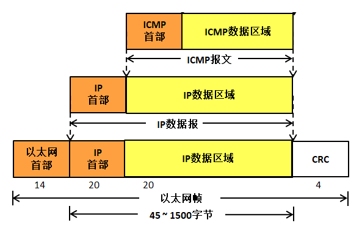
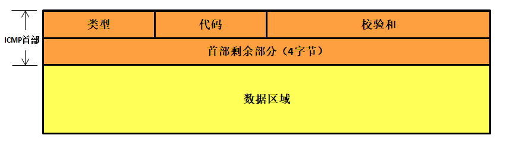
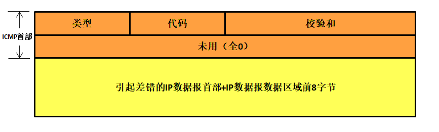
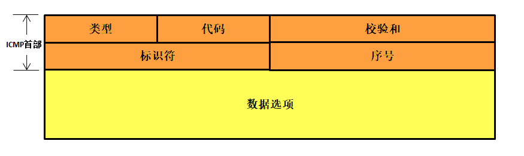
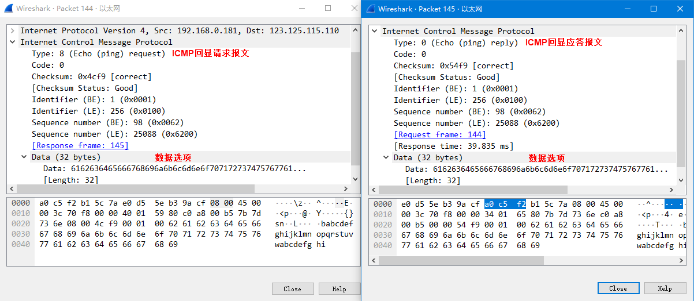

网际控制报文协议ICMP
--------------------

ICMP功能简介
~~~~~~~~~~~~

ICMP是“Internet Control Message
Protocol”（因特网控制报文协议）的缩写。在前面的学习中，我们也知道IP协议是一种不可靠、无连接的协议，只在各个主机间交付数据，但是对于数据的到达与否，IP协议并不关心，为了提高数据交付的准确性，ICMP就随之出现，在交付数据的时候，如果由于网络状况、链路不通等情况数据报无法到达目标主机，ICMP就会返回一个差错报文，让源主机知道数据没能正常到达目标主机，接着进行重发或者放弃发送都可以。如在IP数据报生存时间TTL为0
的时候，路由器不再对数据报进行转发操作，而是会直接丢弃这个数据报，并且返回一个ICMP报文，告诉源主机——你的数据报生存时间到了，还是没有送到目标主机那里，你可以选择重发或者放弃，你看着办就好。

为什么需要ICMP，因为IP协议认为丢掉没用的数据是合理的，这样子能提高数据处理的效率，但是源主机更希望能得到当数据没能发送到目标的时候有个回应，不然目标主机都不知道发的数据到了哪里，到达接收没用，就像石沉大海一样，这是不可接受的。此外，ICMP也被主机和路由器用来彼此沟通网络层的信息，如果链路都连不通，那发送数据就是没有意义的事情，ICMP报文虽然不传输用户数据，但是对于用户数据的传递起着重要的作用。

ICMP最典型的用途是差错报告。例如，当运行一个FTP或HTTP应用时，也许会遇到一些诸如“目的不可达”之类的错误报文，这种报文就是在ICMP中产生的，可能在转发的时候，在某个位置，路由器不能找到一条合适的路径转发该数据包以通往FTP或HTTP应用所指定的主机，该路由器就会向源主机创建和发出一个类型为3的ICMP报文以指示该错误（目的不可达）。

ICMP通常被认为是IP层协议的一部分，但从体系结构上讲它是位于IP之上的，因为ICMP报文是承载在IP数据报中的。这就是说，ICMP报文是作为IP数据报数据区域的（有一些书籍也称之为有效载荷），就像TCP与UDP报文段作为IP数据报数据区域那样。类似地，当一台主机收到一个指明上层协议为ICMP的IP数据报时，它将分解出该数据报的内容给ICMP，就像分解出一个数据报的内容给TCP或UDP一样，但与TCP或UDP协议又有所不同，ICMP出现的目的不是为上层应用程序提供服务，只是在IP层传递差错的报文，依赖于IP协议进行传输。

ICMP报文结构
~~~~~~~~~~~~

ICMP报文是使用IP数据报来封装发送的，所以ICMP报文也是没有额外的可靠性与优先级，它一样会被别的路由器丢弃，
与此同时，ICMP报文封装在IP数据报中，IP数据报封装在以太网帧中，
因此ICMP报文是经过了两次的封装，具体见 图12_1_。

图 12‑1ICMP报文的封装

ICMP报文与IP数据报一样，都是由首部与数据区域组成，ICMP首部是8个字节，对于不同类型的ICMP报文，ICMP报文首部的格式也会有点差异，但是首部的前4个字节都是通用的：

第一个字节（占据8bit空间）是类型（Type）字段，表示产生这种类型ICMP报文的原因。

第二个字节是代码（Code）字段，它进一步描述了产生这种类型ICMP报文的具体原因。因为每种类型的报文都可能有多个，比如目的不可达报文，产生这种原因可能有主机不可达、协议不可达、端口不可达等多个原因。

接下来的校验和字段（占据16bit）用于记录包括ICMP报文数据部分在内的整个ICMP数据报的校验和，以检验报文在传输过程中是否出现了差错，其计算方法与在我们介绍IP数据包首部中的校验和计算方法是一样的。

剩下的4个字节部分在讲解报文类型的时候详细讲解，因为不同类型的报文都有不一样的定义，
并且数据部分的长度也存在差异，ICMP报文格式具体见 图12_2_。

图 12‑2ICMP报文格式

ICMP报文类型
~~~~~~~~~~~~

ICMP报文有两大类型，可以划分为差错报告报文和查询报文，差错报告报文主要是用来向IP数据报源主机返回一个差错报告信息，而这个差错报告信息产生的原因是路由器或者主机不能对当前数据报进行正常的处理，简单来说就是源主机发送的数据报没法到目标主机中，或者到达了目标主机而无法递交给上层协议。

查询报文是用于一台主机向另一台主机发起一个请求，如果目标主机收到这个查询的请求后，就会按照查询报文的格式向源主机做出应答，比如我们使用的ping命令，它的本质就是一个ICMP查询报文。

差错报文与查询报文报文都有其具体的类型，具体见

+--------------+----------+--------------------+
| ICMP报文类型 | 具体类型 | 描述               |
+==============+==========+====================+
| 差错报告报文 | 3        | 目的不可达         |
+--------------+----------+--------------------+
|              | 4        | 源站抑制           |
+--------------+----------+--------------------+
|              | 5        | 重定向             |
+--------------+----------+--------------------+
|              | 11       | 超时               |
+--------------+----------+--------------------+
|              | 12       | 参数错误报文       |
+--------------+----------+--------------------+
| 查询报文     | 0或8     | 回显请求或回显应答 |
+--------------+----------+--------------------+
|              | 9或10    | 路由器询问或通告   |
+--------------+----------+--------------------+
|              | 13或14   | 时间戳请求或应答   |
+--------------+----------+--------------------+
|              | 15或16   | 信息请求或信息应答 |
+--------------+----------+--------------------+
|              | 17或18   | 掩码请求或应答     |
+--------------+----------+--------------------+

虽然ICMP报文很多，但是它并不能纠正错误，它只是借助IP协议简单报告差错，差错报文是被返回源主机的，因为出现差错了，数据报中唯一可用的就是目标IP地址与源IP地址，源主机收到ICMP差错报告后，传递给上层协议，要怎么样处理就不是ICMP协议的事情了。

ICMP差错报告报文
^^^^^^^^^^^^^^^^

目的不可达
''''''''''

在日常生活中，邮寄包裹会经过多个传递环节，任意一环如果无法传下去，都会返回给寄件人，并附上无法邮寄的原因。同理，当路由器收到一个无法传递下去的IP数据报时，那么路由器就会丢弃这个数据报，然后返回一个ICMP目的不可达差错报告报文（类型为3）给IP报文的源发送方，产生差错的原因有很多，如网络不可达、主机不可达、协议不可达、端口不可达等，在ICMP报文中的代码字段（Code）就用于记录引起差错的原因。

对于不同的差错代码字段的值是不一样的，但是LwIP实现的只有前6种，具体见表格
12‑1。

表格 12‑1目的不可达的代码字段取值及说明

+----------+------------------------+----------+-----------------------------+
| 代码取值 | 说明                   | 代码取值 | 说明                        |
+==========+========================+==========+=============================+
| 0        | 网络不可达             | 8        | 源主机被隔离（作废不用）    |
+----------+------------------------+----------+-----------------------------+
| 1        | 主机不可达             | 9        | 目标网络被禁止              |
+----------+------------------------+----------+-----------------------------+
| 2        | 协议不可达             | 10       | 目标主机被禁止              |
+----------+------------------------+----------+-----------------------------+
| 3        | 端口不可达             | 11       | 由于服务类型TOS，网络不可达 |
+----------+------------------------+----------+-----------------------------+
| 4        | 需要分片但设置了不分片 | 12       | 由于服务类型TOS，主机不可达 |
+----------+------------------------+----------+-----------------------------+
| 5        | 源站路由失败           | 13       | 由于过滤，通信被强行禁止    |
+----------+------------------------+----------+-----------------------------+
| 6        | 目标网络未知           | 14       | 主机越权                    |
+----------+------------------------+----------+-----------------------------+
| 7        | 目标主机未知           | 15       | 优先级中止生效              |
+----------+------------------------+----------+-----------------------------+

同时ICMP目的不可达报文首部剩下的4字节全部未用，而ICMP报文数据区域则装载IP数据报首部及IP数据报的数据区域前8字节，
为什么需要装载IP数据报的数据区域中前8个字节的数据呢？因为IP数据报的数据区域前8个字节刚好覆盖了传输层协议中的端口号字段，
而IP数据报首部就拥有目标IP地址与源IP地址，当源主机收到这样子的ICMP报文后，
它能根据ICMP报文的数据区域判断出是哪个数据包出现问题，并且IP层能够根据端口号将报文传递给对应的上层协议处理，
ICMP目的不可达报文的格式具体见 图12_3_。

图 12‑3ICMP目的不可达报文

源站抑制
''''''''

因为IP协议本身就是一个无反馈的协议，IP层发送数据出去的时候就不会收到任何回复，当然也没不会知道目标主机那边的网络状况如何，可能源主机就一直发送数据到目标主机那边，但是由于处理性能、网络等其他因素，就会导致拥塞现象，就好比我们的公路一样，IP数据报就是在公路上行驶的车辆，如果数据报太多了，路由/目标主机来不及处理这些数据报，那么就会堵在这里，就跟堵车是一个道理，而ICMP源站抑制报文的出现就是告诉源主机，你不要发送那么多数据报了。

这个对于我们来说也不太重要，就简单看看其格式，实际上ICMP源站抑制报文的格式与ICMP目的不可达报文的格式是一样的，但代码字段为0。

重定向
''''''

一般来说，某个主机在启动的时候只有一个路由表（即默认路由），所以它发送的数据就是都发给了默认路由，让其帮忙转发，而路由器发现数据应该是发给另一个路由器的，那么它就会返回一个ICMP重定向报文给源主机，告诉它应该直接发给另一个路由器。举个例子，比如有人在你们班级找人，但是要找的人不在你们班，而在隔壁班，你们就会告诉他那个人在隔壁班，让他在隔壁班找就行了，路由器也是这样子。

重定向一般用来让刚启动的主机逐渐建立更完善的路由表，因为主机启动时路由表中可能只有一个默认路由。一旦默认路由器发现它可以转发给其他路由器的时候，默认路由器将通知它进行重定向，告诉主机对路由表作相应的改动，这样子就无需默认路由处理这些事情，而且数据报传输的效率更高了，当然啦，重定向报文是只能由路由器生成而不能由主机生成，但是使用重定向报文的只能是主机而非路由器，所以我们暂时不用理会这些报文的格式是怎么样的，而且LwIP对于这类数据报都不给予理会。

超时
''''

IP数据报首部有一个TTL字段，就是防止IP数据报永远在网络中漂流，当数据报每被转发一次，TTL的值就减一，如果TTL为0，那么路由或者主机就会丢弃该数据报，并且返回一个ICMP超时报文到源主机中；此外，在数据报分片重装的时候也使用了ICMP报文，当所有的IP分片数据报无法在规定的时间内完成重装，那么主机也会认为它超时了，那么这些数据报就会被删除，同时也返回一个ICMP超时报文到源主机中，ICMP超时报文格式与ICMP目的站不可达报文格式一样，但代码字段中有两种取值，具体见表格
12‑2。

表格 12‑2超时报文代码字段及说明

+--------------+------------------------+
| 代码字段取值 | 说明                   |
+==============+========================+
| 0            | 生存时间超时（TTL为0） |
+--------------+------------------------+
| 1            | 分片数据报重装超时     |
+--------------+------------------------+

参数错误
''''''''

IP数据报在网络中传输的时候，都是根据其首部进行识别的，如果首部出现错误，那么就会产生严重的问题，因此如果IP数据报首部出现错误就会丢弃数据报，并且向源主机返回一个ICMP参数错误报文，当然啦，对于携带ICMP差错报文的数据报、非第一个分片的分片数据报、具有特殊目的地址的数据报（如环回、多播、广播）这些类型的数据报，即使是出现了差错也不会返回对应的差错报文。

ICMP查询报文
^^^^^^^^^^^^

我们知道，ping
命令使用的就是ICMP查询报文，若能ping成功，说明网卡、IP层、ICMP层都能通信正常，所以能证明LwIP已经移植成功了，我们一般在移植完成的时候都会测试一下ping命令，查看一下是否移植成功。

ping这个名字源于声纳定位操作。 ping程序由Mike
Muuss编写，目的是为了测试另一台主机是否可达。该程序发送一份
ICMP回显请求报文给目标主机，并等待目标主机返回ICMP回显应答报文。

ICMP回显请求报文和回显应答报文是LwIP中唯一实现的报文，而其他几种报文只是在以前的时候主机启动时确定自己的IP地址、掩码、路由状况等信息，现在基本用不到了，因为DHCP协议就已全部帮我们实现了，使用我们只讲解ICMP回显请求报文和回显应答报文。

我们称发送回显请求的ping程序为客户，而称被 ping的主机为服务器。大多数的
TCP/IP协议栈中都在内核中直接支持ping服务器，但是注意了，这种ping服务器不是一个用户线程，只是在内核线程中进行处理的。

ICMP回显请求和回显应答报文格式具体见 图12_4_。

图 12‑4ICMP回显请求和回显应答报文格式

ICMP报文首部剩下的4字节内容分为了两个字段，标识符用于标识在同一台主机上同时运行了多个ping程序，ping程序也可以识别出返回的信息。序列号从0开始，每发送一次新的回显请求就进行加
1。
ping程序打印出返回的每个分组的序列号，允许我们查看是否有分组丢失、失序或重复。数据选项区域表示回显请求报文中可包含的数据，其长度是可选的，发送方选择合适的长度并且填充该段数据，在接收方，它会根据这个会回显请求返回一个回显应答报文，回显应答报文中的数据选项区域是与回显请求报文的数据选项区域完全一致。

我们可以通过wireshark抓包工具进行抓包查看ICMP回显请求报文与回显应答报文的格式，首先打开
wireshark抓包工具开始抓包，
然后打开cmd控制台，输入“ping
baidu.com”，接着我们在wireshark抓包工具就能看到ICMP的数据包了，
点击对应的数据包查看ICMP回显请求报文与回显应答报文即可，具体见 图12_5_

图 12‑5ICMP回显请求报文与回显应答报文

LwIP中的ICMP实现
~~~~~~~~~~~~~~~~

ICMP报文数据结构
^^^^^^^^^^^^^^^^

ICMP报文与IP数据报的数据结构差不多，在LwIP中定义一个结构体对其进行描述，该结构体名字为icmp_echo_hdr，
看名字的话是不是很吃惊，居然是ICMP回显报文的首部，其实的确也是这样子的，
因为各个类型的ICMP报文首部都是差不多的，所以能将ICMP回显报文首部用于其他ICMP报文首部，
其内的成员变量分别对应ICMP报文首部的类型、代码、校验和、标识符、序号等字段，icmp_echo_hdr结构体具体见 代码清单12_1_。

代码清单 12‑1 icmp_echo_hdr结构体

.. code-block:: c
   :name: 代码清单12_1

    PACK_STRUCT_BEGIN
    struct icmp_echo_hdr
    {
        PACK_STRUCT_FLD_8(u8_t type);
        PACK_STRUCT_FLD_8(u8_t code);
        PACK_STRUCT_FIELD(u16_t chksum);
        PACK_STRUCT_FIELD(u16_t id);
        PACK_STRUCT_FIELD(u16_t seqno);
    } PACK_STRUCT_STRUCT;
    PACK_STRUCT_END

此外LwIP还定义了很多宏与枚举类型的变量对ICMP的类型及代码字段进行描述，具体见 代码清单12_2_。

代码清单 12‑2 LwIP中实现的宏及枚举变量

.. code-block:: c
   :name: 代码清单12_2

    #define ICMP_ER   0    /* 回显应答 */
    #define ICMP_DUR  3    /* 目的不可达 */
    #define ICMP_SQ   4    /* 源站抑制 */
    #define ICMP_RD   5    /* 重定向 */
    #define ICMP_ECHO 8    /* 回显请求 */
    #define ICMP_TE  11    /* 超时 */
    #define ICMP_PP  12    /* 参数错误 */
    #define ICMP_TS  13    /* 时间戳请求 */
    #define ICMP_TSR 14    /* 时间戳应答 */
    #define ICMP_IRQ 15    /* 信息请求 */
    #define ICMP_IR  16    /* 信息应答 */
    #define ICMP_AM  17    /* 地址掩码请求 */
    #define ICMP_AMR 18    /* 地址掩码应答 */

    /** ICMP目标不可达代码字段 */
    enum icmp_dur_type
    {
        /** 网络不可达 */
        ICMP_DUR_NET   = 0,
        /** 主机不可达 */
        ICMP_DUR_HOST  = 1,
        /** 协议不可达 */
        ICMP_DUR_PROTO = 2,
        /** 端口不可达 */
        ICMP_DUR_PORT  = 3,
        /** 需要分片但设置了不分片 */
        ICMP_DUR_FRAG  = 4,
        /** 源站路由失败 */
        ICMP_DUR_SR    = 5
    };

    /** ICMP超时代码字段 */
    enum icmp_te_type
    {
        /** 生存时间超时 */
        ICMP_TE_TTL  = 0,
        /** 分片重装超时 */
        ICMP_TE_FRAG = 1
    };

看到这些宏定义是不是发现很多类型的ICMP报文都没被实现，在LwIP中确实也是这样子，我们也知道，LwIP是一个较为完整的TCP/IP协议栈，只实现了对ICMP回显请求报文的处理，以及某些差错发送报告，如目的不可达报告报文、超时报文，而对于其他的ICMP报文，LwIP均只做识别，而不给予理会。

此外为了快速操作ICMP报文的类型与代码字段，LwIP也定义了两组宏定义对其进行读取和填写操作，具体见
代码清单12_3_。

代码清单 12‑3操作ICMP报文首部的宏定义

.. code-block:: c
   :name: 代码清单12_3

    #define ICMPH_TYPE(hdr) ((hdr)->type)			/** 读取类型字段 */
    #define ICMPH_CODE(hdr) ((hdr)->code)			/** 读取代码字段 */
    #define ICMPH_TYPE_SET(hdr, t) ((hdr)->type = (t))	/** 填写类型字段 */
    #define ICMPH_CODE_SET(hdr, c) ((hdr)->code = (c))	      /** 填写代码字段*/

发送ICMP差错报文
^^^^^^^^^^^^^^^^

无论是何种情况下，在数据报无法向上层递交的时候，协议栈就会向源主机返回一个类型为目的不可达的ICMP报文（
具体的类型还要看代码字段），如IP数据报无法递交到传输层时，就会调用icmp_dest_unreach()函数返回一个ICMP协议不可达报文；
而如果在传输层中，UDP协议无法向应用层递交数据报，那么也将调用该函数返回一个ICMP端口不可达报文。
另一种是超时差错报文，在转发数据报的时候如果数据报中TTL为0，或者在分片数据报重装的时候超时，
LwIP将调用icmp_time_exceeded()函数会发送一个ICMP超时报文到源主机中，下面一起来看看ICMP差错报文的发送，
具体见 代码清单12_4_。

代码清单 12‑4发送ICMP差错报文

.. code-block:: c
   :name: 代码清单12_4

    void
    icmp_dest_unreach(struct pbuf *p, enum icmp_dur_type t) //发送目标不可达报文
    {
        MIB2_STATS_INC(mib2.icmpoutdestunreachs);
        icmp_send_response(p, ICMP_DUR, t);
    }

    void
    icmp_time_exceeded(struct pbuf *p, enum icmp_te_type t) //发送ICMP超时报文
    {
        MIB2_STATS_INC(mib2.icmpouttimeexcds);
        icmp_send_response(p, ICMP_TE, t);
    }

    static void
    icmp_send_response(struct pbuf *p, u8_t type, u8_t code)
    {
        struct pbuf *q;
        struct ip_hdr *iphdr;
        /* we can use the echo header here */
        struct icmp_echo_hdr *icmphdr;
        ip4_addr_t iphdr_src;
        struct netif *netif;

        /* 申请pbuf内存块，大小为ICMP 首部 + IP 首部 + 8 字节数据 */
        q = pbuf_alloc(PBUF_IP, sizeof(struct icmp_echo_hdr)
                    + IP_HLEN + ICMP_DEST_UNREACH_DATASIZE,
                    PBUF_RAM);
        if (q == NULL)
        {
            MIB2_STATS_INC(mib2.icmpouterrors);
            return;
        }

        //指向IP数据报首部
        iphdr = (struct ip_hdr *)p->payload;

        LWIP_DEBUGF(ICMP_DEBUG, ("icmp_time_exceeded from "));
        ip4_addr_debug_print_val(ICMP_DEBUG, iphdr->src);
        LWIP_DEBUGF(ICMP_DEBUG, (" to "));
        ip4_addr_debug_print_val(ICMP_DEBUG, iphdr->dest);
        LWIP_DEBUGF(ICMP_DEBUG, ("\n"));

        //指针指向pbuf数据区域，并且强制将该地址转化为ICMP报文首部
        icmphdr = (struct icmp_echo_hdr *)q->payload;
        //填写类型字段
        icmphdr->type = type;
        //填写代码字段
        icmphdr->code = code;
        icmphdr->id = 0;
        icmphdr->seqno = 0;

        /* 从原始数据包中复制字段，IP数据报首部+8字节的数据区域 */
        SMEMCPY((u8_t *)q->payload + sizeof(struct icmp_echo_hdr),
                (u8_t *)p->payload,
                IP_HLEN + ICMP_DEST_UNREACH_DATASIZE);

        //得到源IP地址
        ip4_addr_copy(iphdr_src, iphdr->src);

        netif = ip4_route(&iphdr_src);

        if (netif != NULL)
        {
            icmphdr->chksum = 0;

            ICMP_STATS_INC(icmp.xmit);

            //发送出去
            ip4_output_if(q, NULL, &iphdr_src, ICMP_TTL, 0,
                        IP_PROTO_ICMP, netif);
        }
        pbuf_free(q);
    }

发送的时候就单纯为ICMP申请pbuf空间，大小为ICMP 报文首部 + IP 数据报首部
+ 8
字节，然后直接填写ICMP报文首部区域，再拷贝IP数据报首部及IP数据报数据区域的前8字节内容，然后再直接调用发送函数将ICMP报文发送出去。

处理ICMP报文
^^^^^^^^^^^^

LwIP协议是轻量级TCP/IP协议栈，所以对ICMP报文中很多类型的报文都不做处理，LwIP会将这些不处理的报文丢掉，
但是对ICMP回显请求报文就做出处理，所以这也是为什么我们能ping通开发板的原因。
从上一章的 图11_8 我们可以看到，当IP层收到一个ICMP报文的时候，会调用icmp_input()函数将报文传递到ICMP协议去处理，
关于这个函数的处理也是比较简单明了的，只处理ICMP请求报文，然后返回一个ICMP应答报文，
具体看注释即可，icmp_input()函数具体见 代码清单12_5_。

代码清单 12‑5 icmp_input()函数

.. code-block:: c
   :name: 代码清单12_5

    void
    icmp_input(struct pbuf *p, struct netif *inp)
    {
        u8_t type;
        struct icmp_echo_hdr *iecho;
        const struct ip_hdr *iphdr_in;
        u16_t hlen;
        const ip4_addr_t *src;

        ICMP_STATS_INC(icmp.recv);
        MIB2_STATS_INC(mib2.icmpinmsgs);

        iphdr_in = ip4_current_header();
        hlen = IPH_HL_BYTES(iphdr_in);
        if (hlen < IP_HLEN)
        {
            goto lenerr;
        }
        if (p->len < sizeof(u16_t) * 2)
        {
            goto lenerr;
        }

        type = *((u8_t *)p->payload);

        switch (type)
        {
        case ICMP_ER:
            MIB2_STATS_INC(mib2.icmpinechoreps);
            break;
        case ICMP_ECHO:
            MIB2_STATS_INC(mib2.icmpinechos);
            src = ip4_current_dest_addr();

            if (ip4_addr_ismulticast(ip4_current_dest_addr()))
            {
                goto icmperr;
            }
        if (ip4_addr_isbroadcast(ip4_current_dest_addr(),
                        ip_current_netif()))
            {
                goto icmperr;
            }

            if (p->tot_len < sizeof(struct icmp_echo_hdr))
            {

                goto lenerr;
            }

            /* 调整回显报文请求中的相关字段以生成回显应答报文 */

            //强制将数据区域转换为ICMP报文首部
            iecho = (struct icmp_echo_hdr *)p->payload;

            if (pbuf_add_header(p, hlen))
            {
                LWIP_DEBUGF(ICMP_DEBUG | LWIP_DBG_LEVEL_SERIOUS,
                            ("Can't move over header in packet"));
            }
            else
            {
                err_t ret;
                struct ip_hdr *iphdr = (struct ip_hdr *)p->payload;
                //拷贝源IP地址
                ip4_addr_copy(iphdr->src, *src);
                //拷贝目标IP地址
                ip4_addr_copy(iphdr->dest, *ip4_current_src_addr());
                //填写报文类型
                ICMPH_TYPE_SET(iecho, ICMP_ER);

                iecho->chksum = 0;

                //填写生存时间
                IPH_TTL_SET(iphdr, ICMP_TTL);
                IPH_CHKSUM_SET(iphdr, 0);

                ICMP_STATS_INC(icmp.xmit);
                MIB2_STATS_INC(mib2.icmpoutmsgs);
                MIB2_STATS_INC(mib2.icmpoutechoreps);

                /* 发送ICMP回显应答报文 */
                ret = ip4_output_if(p, src, LWIP_IP_HDRINCL,
                                    ICMP_TTL, 0, IP_PROTO_ICMP, inp);
                if (ret != ERR_OK)
                {
                    LWIP_DEBUGF(ICMP_DEBUG, ("icmp_input: ip_output_if returned an error: %s\n", lwip_strerr(ret)));
                }
            }
            break;
        default:
            //对于其他类型的报文，直接丢掉
            if (type == ICMP_DUR)
            {
                MIB2_STATS_INC(mib2.icmpindestunreachs);
            }
            else if (type == ICMP_TE)
            {
                MIB2_STATS_INC(mib2.icmpintimeexcds);
            }
            else if (type == ICMP_PP)
            {
                MIB2_STATS_INC(mib2.icmpinparmprobs);
            }
            else if (type == ICMP_SQ)
            {
                MIB2_STATS_INC(mib2.icmpinsrcquenchs);
            }
            else if (type == ICMP_RD)
            {
                MIB2_STATS_INC(mib2.icmpinredirects);
            }
            else if (type == ICMP_TS)
            {
                MIB2_STATS_INC(mib2.icmpintimestamps);
            }
            else if (type == ICMP_TSR)
            {
                MIB2_STATS_INC(mib2.icmpintimestampreps);
            }
            else if (type == ICMP_AM)
            {
                MIB2_STATS_INC(mib2.icmpinaddrmasks);
            }
            else if (type == ICMP_AMR)
            {
                MIB2_STATS_INC(mib2.icmpinaddrmaskreps);
            }

            ICMP_STATS_INC(icmp.proterr);
            ICMP_STATS_INC(icmp.drop);
        }
        pbuf_free(p);
        return;
    lenerr:
        pbuf_free(p);
        ICMP_STATS_INC(icmp.lenerr);
        MIB2_STATS_INC(mib2.icmpinerrors);
        return;
    #if LWIP_ICMP_ECHO_CHECK_INPUT_PBUF_LEN || !LWIP_MULTICAST_PING ||
    !LWIP_BROADCAST_PING
    icmperr:
        pbuf_free(p);
        ICMP_STATS_INC(icmp.err);
        MIB2_STATS_INC(mib2.icmpinerrors);
        return;
    #endif
    }
