TCP协议
-------

本章开始就进入了本书最难的部分，也是最重要的部分，TCP协议（Transmission
Control
Protocol，传输控制协议）在LwIP协议栈中占据了大半的代码，它是最常用传输层协议，也是最稳定传输层协议，很多上层应用都是依赖于TCP协议进程传输数据，如SMTP、FTP等等，虽然说学习TCP协议是件很枯燥无味的事情
，但是大家还是要坚持学下去，必有很大的收获。

TCP服务简介
~~~~~~~~~~~

TCP与UDP一样，都是传输层的协议，但是提供的服务却大不相同，UDP为上层应用提供的是一种不可靠的，无连接的服务，而TCP则提供一种面向连接、可靠的字节流传输服务，TCP让两个主机建立连接的关系，应用数据以数据流的形式进行传输，这与UDP协议是不一样：

UDP运载的数据是以报文的形式，各个报文在网络中互不相干传输，UDP每收到一个报文就递交给上层应用，因此如果对于大量数据来说，应用层的重装是非常麻烦的，因为UDP报文在网络中到达目标主机的顺序是不一样的；

而TCP采用数据流的形式传输，先后发出的数据在网络中虽然也是互不相干的传输，但是这些数据本身携带的信息却是紧密联系的，TCP协议会给每个传输的字节进行编号，当然啦，两个主机方向上的数据编号是彼此独立的，在传输的过程中，发送方把数据的起始编号与长度放在TCP报文中，在接收方将所有数据按照编号组装起来，然后返回一个确认，当所有数据接收完成后才将数据递交到应用层中。

TCP的特性
~~~~~~~~~

连接机制
^^^^^^^^

TCP是一个面向连接的协议，无论哪一方向另一方发送数据之前，都必须先在双方之间建立一个连接，否则将无法发送数据，一个TCP连接必须有双方IP地址与端口号，就像打电话一样，必须知道双方的电话号码才会打电话，关于具体的连接我们在后文讲解。

确认与重传
^^^^^^^^^^

一个完整的TCP传输必须有数据的交互，接收方在接收到数据之后必须正面进行确认，向发送方报告接收的结果，而发送方在发送数据之后必须等待接收方的确认，同时发送的时候会启动一个定时器，在指定超时时间内没收到确认，发送方就会认为发送失败，然后进行重发操作，这就是重传报文。

TCP提供可靠的运输层，但它依赖的是IP层的服务，IP数据报的传输是无连接、不可靠的，因此它要通过确认来知道接收方确实已经收到数据了。但数据和确认都有可能会丢失，因此TCP通过在发送时设置一个超时机制（定时器）来解决这种问题，如果当超时时间到达的时候还没有收到对方的确认，它就重传该数据。

缓冲机制
^^^^^^^^

在发送方想要发送数据的时候，由于应用程序的数据大小、类型都是不可预估的，而TCP协议提供了缓冲机制来处理这些数据，如在数据量很小的时候，TCP会将数据存储在一个缓冲空间中，等到数据量足够大的时候在进行发送数据，这样子能提供传输的效率并且减少网络中的通信量，而且在数据发送出去的时候并不会立即删除数据，还是让数据保存在缓冲区中，因为发送出去的数据不一定能被接收方正确接收，它需要等待到接收方的确认再将数据删除。同样的，在接收方也需要有同样的缓冲机制，因为在网络中传输的数据报到达的时间是不一样的，而且TCP协议还需要把这些数据报组装成完整的数据，然后再递交到应用层中。

全双工通信
^^^^^^^^^^

在TCP连接建立后，那么两个主机就是对等的，任何一个主机都可以向另一个主机发送数据，数据是双向流通的，所以TCP协议是一个全双工的协议，这种机制为TCP协议传输数据带来很大的方便，一般来说，TCP协议的确认是通过捎带的方式来实现，即接收方把确认信息放到反向传来的是数据报文中，不必单独为确认信息申请一个报文，捎带机制减少了网络中的通信流量。由于双方主机是对等的存在，那么任意一方都可以断开连接，此时这个方向上的数据流就断开了，但是另一个
方向上的数据仍是连通的状态，这种情况就称之为半双工。

流量控制
^^^^^^^^

在前面讲过，一条TCP连接每一侧的主机都设置了缓冲区域。当该接收方收到数据后，它就将数据放入接收缓冲区，当确认这段数据是正常的时候，就会向发送方返回一个确认。并且向相关的应用层递交该数据，但不一定是数据刚一到达就立即递交。事实上，接收方应用也许正忙于其他任务，甚至要过很长时间后才会去处理这些数据。这样子如果接收方处理这些数据时相对缓慢，而发送方发送得太多、太快，就会很容易地使接收方的接收缓冲区发生溢出。

因此TCP提供了流量控制服务（flow-control
service）以消除发送方使接收方缓冲区溢出的可能性。流量控制是一个速度匹配服务，即发送方的发送速率与接收方应用程序的读取速率相匹配，TCP通过让发送方维护一个称为接收窗口（receive
window）的变量来提供流量控制，是的，你没看错，是接收窗口（rwnd），它用于给发送方一个指示：接收方还能接收多少数据，接收方会将此窗口值放在
TCP
报文的首部中的窗口字段，然后传递给发送方，这个窗口的大小是在发送数据的时候动态调整的。

那可能有人问，这个窗口既然是动态调整的，那有没有可能是0，这样子发送方不就是没法继续发送数据到接收方了？为了解决这个问题，TCP协议的规范中有些要求，当接收方主机的接收窗口为0时，发送方继续发送只有一个字节的报文段，这些报文段将被接收方接收，直到缓存清空，并在确认报文中包含一个非0的接收窗口值。

流量控制是双方通信之间的控制信息，这是很有必要的，比如两个性能不对等的主机，建立了TCP协议连接，但是其中一个主机一直发送数据，但是接收的主机来不及处理，这样子的处理就不是最佳的，因此，TCP协议中使用滑动窗口的流量控制方法，它允许接收方根据自身的处理能力来确定能接收数据的多少，因此会告诉发送方可以发送多少数据过来，即窗口的大小，而发送方尽可能将数据都多发到对方那里，所以发送方会根据这个窗口的大小发送对应的数据
，通俗地来说就是接收方告诉发送方“我还有能力处理那么多的数据，你就发那么多数据给我就行了，不要发多了，否则我处理不了”。

差错控制
^^^^^^^^

除了确认与重传之外，TCP协议也会采用校验和的方式来检验数据的有效性，主机在接收数据的时候，会将重复的报文丢弃，将乱序的报文重组，发现某段报文丢失了会请求发送方进行重发，因此在TCP往上层协议递交的数据是顺序的、无差错的完整数据。

拥塞控制
^^^^^^^^

什么是拥塞？当数据从一个大的管道（如一个快速局域网）向一个较小的管道（如一个较慢的广域网）发送时便会发生拥塞。当多个输入流到达一个路由器，而路由器的输出流小于这些输入流的总和时也会发生拥塞，这种是网络状况的原因。

如果一个主机还是以很大的流量给另一个主机发送数据，但是其中间的路由器通道很小，无法承受这样大的数据流量的时候，就会导致拥塞的发生，这样子就导致了接收方无法在超时时间内完成接收（接收方此时完全有能力处理大量数据），而发送方又进行重传，这样子就导致了链路上的更加拥塞，延迟发送方必须实现一直自适应的机制，在网络中拥塞的情况下调整自身的发送速度，这种形式对发送方的控制被称为拥塞控制（congestion
control），与前面我们说的流量控制是非常相似的，而且TCP协议采取的措施也非常相似，均是限制发送方的发送速度。

端口号的概念
~~~~~~~~~~~~

TCP协议的连接是包括上层应用间的连接，简单来说，TCP连接是两个不同主机的应用连接，而传输层与上层协议是通过端口号进行识别的，如IP协议中以IP地址作为识别一样，端口号的取值范围是0~65535，这些端口标识着上层应用的不同线程，一个主机内可能只有一个IP地址，但是可能有多个端口号，每个端口号表示不同的应用线程。一台拥有IP地址的主机可以提供许多服务，比如Web服务、FTP服务、SMTP服务等，这些服务完全可以通过1个IP地址来实现，主机是怎样区分不同的网络服务呢？显然不能只靠IP地址，因为IP
地址只能识别一台主机而非主机提供的服务，这些服务就是主机上的应用线程，因此是通过“IP地址+端口号”来区分主机不同的线程。

常见的TCP协议端口号有21、53、80等等，更多端口描述具体见表格
13‑1，其中80端口号是我们日常生活中最常见的一个端口号，它也是HTTP服务器默认开放的端口。

表格 13‑1TCP协议常用的端口号

+--------+--------+------------------------------------------+
| 端口号 |  协议  |                   说明                   |
+========+========+==========================================+
| 20/21  | FTP    | 文件传输协议，使得主机间可以共享文件。   |
+--------+--------+------------------------------------------+
| 23     | Telnet | 终端远程登录，它为用户提供了在本地计算机 |
|        |        | 上完成远程主机工作的能力。               |
+--------+--------+------------------------------------------+
| 25     | SMTP   | 简单邮件传输协议，它帮助每台计算机在发送 |
|        |        | 或中转信件时找到下一个目的地。           |
+--------+--------+------------------------------------------+
| 69     | TFTP   | 普通文件传输协议。                       |
+--------+--------+------------------------------------------+
| 80     | HTTP   | 超文本传输协议，通过使用网页浏览器、网络 |
|        |        | 爬虫或者其它的工具，客户端发起一个HTT    |
|        |        | P请求到服务器上指定端口（默认端口为80    |
|        |        | ），应答的服务器上存储着一些资源，比如H  |
|        |        | TML文件和图像，那么就会返回这些数据到    |
|        |        | 客户端。                                 |
+--------+--------+------------------------------------------+
| 110    | POP3   | 邮局协议版本3，本协议主要用于支持使用客  |
|        |        | 户端远程管理在服务器上的电子邮件。       |
+--------+--------+------------------------------------------+

举个例子，我们访问“https://www.baidu.com”这个网站，如果我们在浏览器中输入“https://www.baidu.com:80”，访问这个服务器的80端口，我们还是会进入一样的页面，但是如果我们输入“https://www.baidu.com:90”去访问这个服务器的90端口，这是不允许访问的，具体见图
13‑1。

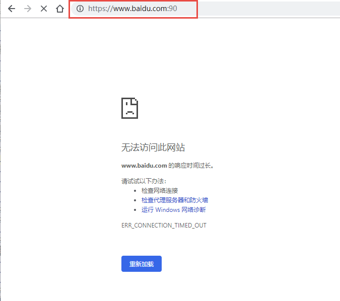

图 13‑1不允许访问HTTP服务器其他端口

TCP报文段结构
~~~~~~~~~~~~~

在前面说了那么多，我们就直接来看TCP协议的报文是怎么样的，按照协议栈实现的方式，这TCP协议也肯定像ARP协议、IP协议一样，都是使用报文进行描述，为了使用更加官方的描述，我们将TCP报文（数据包）称为报文段。

TCP报文段的封装
^^^^^^^^^^^^^^^

如ICMP报文一样，TCP报文段依赖IP协议进行发送，因此TCP报文段与ICMP报文一样，都是封装在IP数据报中，
IP数据报封装在以太网帧中，因此TCP报文段也是经过了两次的封装，然后发送出去，其封装具体见 图13_2_。

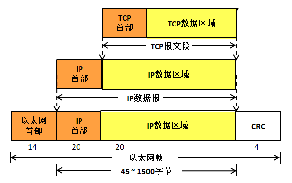

图 13‑2TCP报文段封装

TCP报文段格式
^^^^^^^^^^^^^

TCP报文段如APR报文、IP数据报一样，也是由首部+数据区域组成，TCP报文段的首部我们称之为TCP首部，
其首部内推很丰富，各个字段都有不一样的含义，如果不计算选项字段，一般来说TCP首部只有20个字节，
具体见 图13_2_。在LwIP中，报文段首部采用一个名字叫tcp_hdr的结构体进行描述，具体见 代码清单13_1_

代码清单 13‑1 tcp_hdr结构体

.. code-block:: c
   :name: 代码清单13_1

    PACK_STRUCT_BEGIN
    struct tcp_hdr
    {
        PACK_STRUCT_FIELD(u16_t src);		/* 源端口 */
        PACK_STRUCT_FIELD(u16_t dest);		/* 目标端口 */
        PACK_STRUCT_FIELD(u32_t seqno);		/* 序号 */
        PACK_STRUCT_FIELD(u32_t ackno);		/* 确认序号 */
        PACK_STRUCT_FIELD(u16_t _hdrlen_rsvd_flags); /* 首部长度+保留位+标志位 */
        PACK_STRUCT_FIELD(u16_t wnd);		/* 窗口大小 */
        PACK_STRUCT_FIELD(u16_t chksum);		/* 校验和 */
        PACK_STRUCT_FIELD(u16_t urgp);		/* 紧急指针 */
    } PACK_STRUCT_STRUCT;
    PACK_STRUCT_END

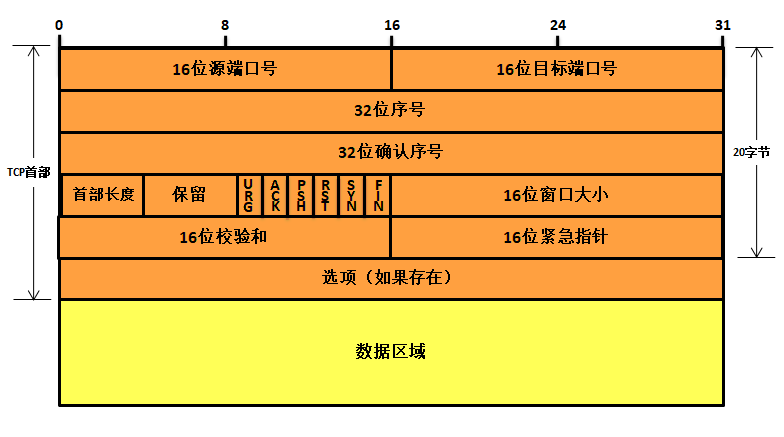

图 13‑3TCP报文段格式

每个TCP报文段都包含源主机和目标主机的端口号，用于寻找发送端和接收端应用线程，这两个值加上I
P首部中的源I P地址和目标I P地址就能确定唯一一个TCP连接。

序号字段用来标识从TCP发送端向TCP接收端发送的数据字节流，它的值表示在这个报文段中的第一个数据字节所处位置吗，根据接收到的数据区域长度，就能计算出报文最后一个数据所处的序号，因为TCP协议会对发送或者接收的数据进行编号（按字节的形式），那么使用序号对每个字节进行计数，就能很轻易管理这些数据。序号是32
bit的无符号整数。

当建立一个新的连接时，TCP报文段首部的
SYN标志变1，序号字段包含由这个主机随机选择的初始序号ISN（Initial
Sequence Number）。该主机要发送数据的第一个字节序号为
ISN+1，因为SYN标志会占用一个序号，在这里我们只需要了解一下即可，后面会讲解的。

既然TCP协议给每个传输的字节都了编号，那么确认序号就包含接收端所期望收到的下一个序号，因此，确认序号应当是上次已成功收到数据的最后一个字节序号加
1。当然，只有ACK标志为
1时确认序号字段才有效，TCP为应用层提供全双工服务，这意味数据能在两个方向上独立地进行传输，因此确认序号通常会与反向数据（即接收端传输给发送端的数据）封装在同一个报文中（即捎带），所以连接的每一端都必须保持每个方向上的传输数据序号准确性。

首部长度字段占据4bit空间，它指出了TCP报文段首部长度，以字节为单位，最大能记录15*4=60字节的首部长度，因此，TCP报文段首部最大长度为60字节。在字段后接下来有6bit空间是保留未用的。

此外还有6bit空间，是TCP报文段首部的标志字段，用于标志一些信息：

-  URG：首部中的紧急指针字段标志，如果是1表示紧急指针字段有效。

-  ACK：首部中的确认序号字段标志，如果是1表示确认序号字段有效。

-  PSH：该字段置一表示接收方应该尽快将这个报文段交给应用层。

-  RST：重新建立TCP连接。

-  SYN：用同步序号发起连接。

-  FIN：中止连接。

TCP的流量控制由连接的每一端通过声明的窗口大小来提供，窗口大小为字节数，起始于确认序号字段指明的值，这个值是接收端正期望接收的数据序号，发送方根据窗口大小调整发送数据，以实现流量控制。窗口大小是一个占据16
bit空间的字段，因而窗口最大为
65535字节，当接收方告诉发送方一个大小为0的窗口时，将完全阻止发送方的数据发送。

检验和覆盖了整个的
TCP报文段：TCP首部和TCP数据区域，由发送端计算和填写，并由接收端进行验证。

只有当URG标志置1时紧急指针才有效，紧急指针是一个正的偏移量，和序号字段中的值相加表示紧急数据最后一个字节的序号。简单来说，本TCP报文段的紧急数据在报文段数据区域中，从序号字段开始，偏移紧急指针的值结束。

选项字段我们暂时就无需理会了。

自此，我们已经把TCP报文段的内容讲解完毕，我们可以通过wireshark抓包工具进行抓包查看一下TCP报文段的数据，具体见 图13_4_。

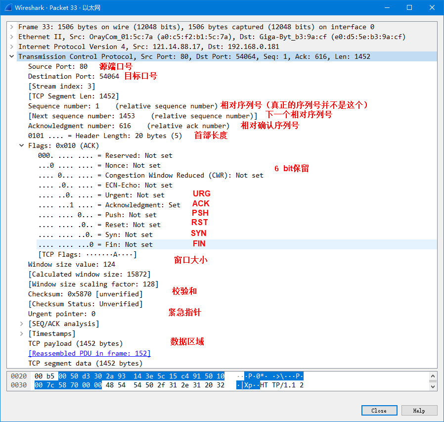

图 13‑4wireshark抓包工具的TCP报文段格式

此处有一个要注意的地方：当某个主机开启一个TCP会话时，他的初始序列号（ISN）是随机的，可能是0~4294967295之间的任意值，然而，像wireshark这种抓包工具，通常显示的都是相对序列号与确认号，而不是实际序列号与确认号，相对序列号与确认号是和TCP会话的初始序列号相关联的。因为比起真实序列号与确认号，wireshark工具跟踪更小的相对序列号与确认号会相对容易一些。

当然啦，我们也可以自己选择看真实的序列号，直接在wireshark抓包工具中取消相对序列号配置即可，在wireshark菜单栏中的
Edit -> Preferences ->protocols ->TCP，去掉Relative sequence
number后面勾选框中的√即可，具体见 图13_5_，取消后的序列号具体见 图13_6_。

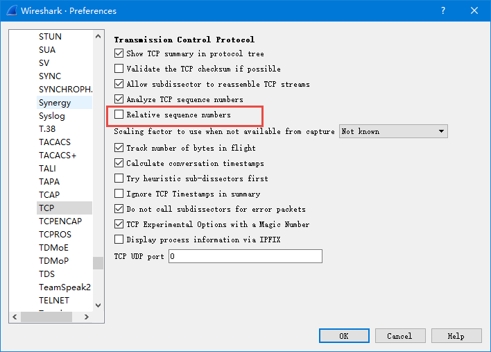

图 13‑5取消相对序列号配置

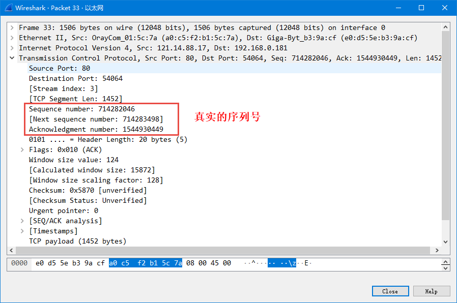

图 13‑6真实序列号

TCP连接
~~~~~~~

TCP是一个面向连接的协议，无论哪一方向另一方发送数据之前，都必须先在双方之间建立一条连接，俗称“握手”，可能在学习网络之前，大家或多或少都听过“三次握手”、“四次挥手”这两个词汇，那么“三次握手”、“四次挥手”是怎么样的呢？本小节将详细讨论一个
TCP连接是如何建立的以及通信结束后是如何终止的。

“三次握手”建立连接
^^^^^^^^^^^^^^^^^^

首先建立连接的过程是由客户端发起，而服务器无时无刻都在等待着客户端的连接，其示意图具体见
图13_7_，TCP连接一般来说会经历以下过程：

第一步：客户端的TCP首先向服务器端的TCP发送一个特殊的TCP报文段。该报文段中不包含应用层数据，但是在报文段的首部中的SYN标志位会被置为1。因此，这个特殊报文段被称为SYN报文段（我们暂且称之为握手请求报文）。另外，客户会随机地选择一个初始序号（ISN，假设为A），并将此序号放置于该SYN报文段的序号字段中；但SYN报文段中的ACK标志位0，此时它的确认序号段是无效的。该报文段会被封装在一个IP数据报中，然后发送给目标服务器。

第二步：一旦服务器收到了客户端发出的SYN报文段，知道客户端要请求握手了，服务器便会从SYN报文段中提取对应的信息，为该TCP连接分配TCP缓存和变量，并向该客户TCP发送允许连接的报文段（握手应答报文）。这个报文段同样也不包含任何应用层数据，但是，在报文段的首部却包含3个重要的信息。

1. SYN与ACK标志都被置为1。

2. 将TCP报文段首部的确认序号字段设置为A+1（这个A（ISN）是从握手请求报文中得到）。

3. 服务器随机选择自己的初始序号（ISN，注意此ISN是服务器端的ISN，假设为B），并将其放置到TCP报文段首部的序号字段中。

这个允许连接的报文段实际上表明了：“我收到了你发起建立连接的请求，初始序号为A，我同意建立该TCP连接，我自己的初始序号是B。”该允许连接的报文段有时被称为SYN
ACK报文段（SYN ACK
segment），同时由于ACK标志位1，所以TCP报文段首部的窗口大小字段是有效的。

第三步：当客户端收到服务器的握手应答报文后，会将ACK标志置位，此时客户端的TCP报文段的
ACK标志被设置为1，而对于SYN标志，因为连接已经建立了，所以该标志会被置为0，同时客户端也要给该TCP连接分配缓存和变量，并且客户端还需要返回一个应答报文段，这个报文对服务器的应答报文段作出应答，将TCP报文段首部的确认序号字段设置为B+1，同时也会告知服务器的窗口大小。

补充提示：在三次握手的第三个阶段可以在报文段数据区域中携带客户到服务器的数据。

在完成握手后，客户端与服务器就建立了连接，同时双方都得到了彼此的窗口大小，序列号等信息，在传输TCP报文段的时候，每个TCP报文段首部的SYN标志都会被置0，因为它只用于发起连接，同步序号。

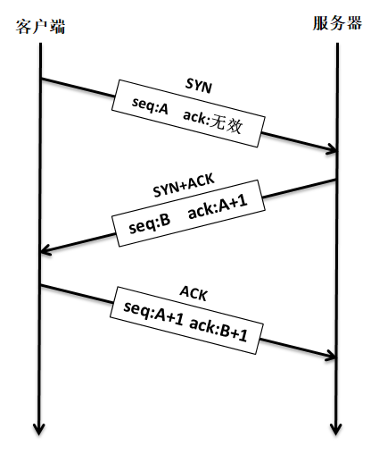

图 13‑7建立连接示意图

我们还可以通过wireshark抓包工具可以查看TCP协议三次握手的标志位，具体见 图13_8_。

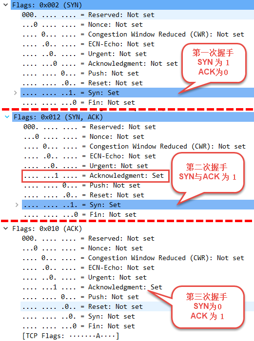

图 13‑8三次握手TCP报文段首部的标志

此外
，为了更好的理解在整个TCP连接期间，TCP序列号和确认号是如何工作的，我们可以使用wireshark内置的绘制流功能，选择菜单栏中的
Statistics ->Flow Graph，具体见图 13‑9。

当然啦，这样子肯定会得到一个比较乱的协议流程界面，因为有太多太多其他协议的内容了，而我们不需要分析这些协议，因此我们需要设置过滤，wireshark有两种过滤器：

1. 捕捉过滤器（CaptureFilters）：用于决定将什么样的信息记录在捕捉结果中。

2. 显示过滤器（DisplayFilters）：用于在捕捉结果中进行详细查找。

捕捉过滤器在抓抱前进行设置，决定抓取怎样的数据；显示过滤器用于过滤抓包数据，便stream的追踪和排查。捕捉过滤器仅支持协议过滤，显示过滤器既支持协议过滤也支持内容过滤，两种过滤器它们支持的过滤语法并不一样。

对于我个人来说，我更喜欢第一种，我们就设置过滤规则，关于规则太多了，我们就不细分设置，我们只简单设置过滤的IP地址，比如说访问一个网页（HTTP依赖TCP协议），我们就设置过滤规则为“ip.src
==47.95.47.253 or ip.dst
==47.95.47.253”，表示只抓取IP地址为47.95.47.253的数据，具体见 图13_10_。

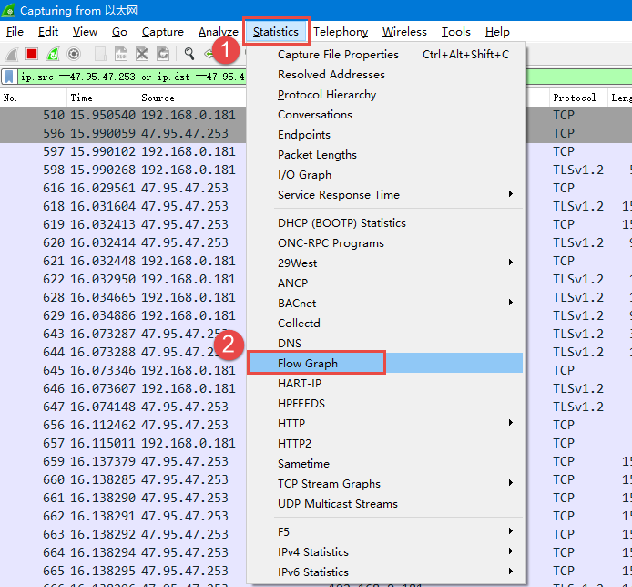

图 13‑9wireshark内置的绘制流功能

.. image:: media/image10.png
   :align: center
   :alt: 图 13‑10设置过滤规则
   :name: 图13_10

图 13‑10设置过滤规则

然后再次选择菜单栏中的 Statistics ->Flow
Graph绘制流功能，并且在Flow窗口吧Limit to display filter选项勾选，吧Flow
type选择TCP
Flows，通过分析，与我们理论的结果是一致的，说明我们得到正确的抓取结果，具体见 图13_11_。

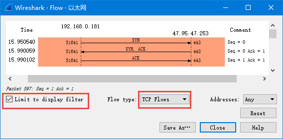

图 13‑11得到正确的Flow窗口（使用相对序号）

“四次挥手”终止连接
^^^^^^^^^^^^^^^^^^

建立一个连接需要三次握手，而终止一个连接要经过
四次挥手（有一些书上也会称为“四次握手”），这由 TCP的特性造成的，因为
TCP连接是全双工连接的服务，因此每个方向上的连接必须单独关闭。当一端完成它的数据发送任务后就能发送一个
FIN报文段（可以称之为终止连接请求，其实就是FIN标志位被设置为1）来终止这个方向上的连接。另一端收到一个
FIN报文段，它必须通知应用层对方几经终止了那个方向的连接，发送FIN报文段通常是应用层进行关闭的结果。

注意了：客户端发送一个FIN报文段只意味着在这一方向上没有数据流动，一个
TCP连接在发送一个 FIN后仍能接收数据，但是在实际应用中只有很少的
TCP应用程序这样做。

“四次挥手”终止连接示意图具体见 图13_12_，其具体过程如下：

第一步：客户端发出一个FIN报文段主动进行关闭连接，此时报文段的FIN标志位为1，假设序号为C，一般来说ACK标志也会被置一，但确认序号字段是无效的。

第二步：当服务器收到这个
FIN报文段，它发回一个ACK报文段（此报文段是终止连接应答），确认序号为收到的序号加
1（C+1），和SYN一样，一个FIN将占用一个序号，此时断开客户端->服务器的方向连接。

第三步：服务器会向应用程序请求关闭与这个客户端的连接，接着服务器就会发送一个FIN报文段（这个报文段是服务器向客户端发出，请求终止连接），此时假设序号为D，ACK标志虽然也为1，但是确认序号字段是无效的。

第四步：客户端返回一个ACK报文段来确认终止连接的请求，ACK标志置一，并将确认序号设置为收到序号加1（D+1），此时断开服务器->客户端的方向连接。

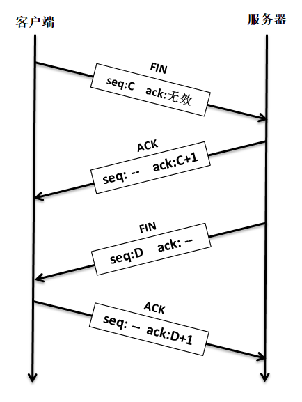

图 13‑12终止连接示意图

同样的，我们也能通过wireshark抓包工具抓取到终止连接的数据，具体见 图13_13_。

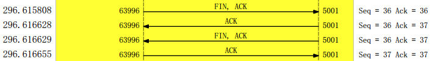

图 13‑13终止连接Flow窗口（使用相对序号）

TCP状态
~~~~~~~

LwIP中定义的TCP状态
^^^^^^^^^^^^^^^^^^^

TCP协议根据连接时接收到报文的不同类型，采取相应动作也不同，还要处理各个状态的关系，
如当收到握手报文时候、超时的时候、用户主动关闭的时候等都需要不一样的状态去采取不一样的处理。
在LwIP中，为了实现TCP协议的稳定连接，采用数组的形式定义了11种连接时候的状态，
具体见 代码清单13_2_。

代码清单 13‑2LwIP中的TCP连接状态

.. code-block:: c
   :name: 代码清单13_2

    #if TCP_MSS > 536
    #define INITIAL_MSS 536
    #else
    #define INITIAL_MSS TCP_MSS
    #endif

    static const char *const tcp_state_str[] =
    {
        "CLOSED",     //关闭状态（无连接）
        "LISTEN",     //监听状态
        "SYN_SENT",   //已发起请求连接（等待确认）
        "SYN_RCVD",   //已收到请求连接
        "ESTABLISHED",//稳定连接状态
        "FIN_WAIT_1", //单向请求终止连接状态
        "FIN_WAIT_2", //对方已应答请求终止连接
        "CLOSE_WAIT", //等待终止连接
        "CLOSING",    //两端同时关闭
        "LAST_ACK",   //服务器等待对方接受关闭
        "TIME_WAIT"   //关闭成功（2MSL等待状态）
    };

在这里简单讲解几个状态：

1. ESTABLISHED状态：这个状态是处于稳定连接状态，建立连接的TCP协议两端的主机都是处于这个状态，
它们相互知道彼此的窗口大小、序列号、最大报文段等信息。

2. FIN_WAIT_1与FIN_WAIT_2状态：处于这个状态一般都是单向请求终止连接，然后主机等待对方的回应，
   而如果对方产生应答，则主机状态转移为FIN_WAIT_2，此时{主机->对方}方向上的TCP连接就断开，
   但是{对方->主机}方向上的连接还是存在的。此处有一个注意的地方：如果主机处于FIN_WAIT_2状态，
   说明主机已经发出了FIN报文段，并且对方也已对它进行确认，除非主机是在实行半关闭状态，
   否则将等待对方主机的应用层处理关闭连接，因为对方已经意识到它已收到FIN报文段，它需要主机发一个
   FIN 来关闭{对方->主机}方向上的连接。只有当另一端的进程完成这个关闭，
   主机这端才会从FIN_WAIT_2状态进入TIME_WAIT状态。否则这意味着主机这端可能永远保持这个FIN_WAIT_2状态，另一端的主机也将处于
   CLOSE_WAIT状态，并一直保持这个状态直到应用层决定进行关闭。

3. TIME_WAIT状态：TIME_WAIT状态也称为
   2MSL等待状态。每个具体TCP连接的实现必须选择一个TCP报文段最大生存时间MSL（Maximum
   Segment
   Lifetime），如IP数据报中的TTL字段，表示报文在网络中生存的时间，它是任何报文段被丢弃前在网络内的最长时间，这个时间是有限的，为什么需要等待呢？我们知道IP数据报是不可靠的，而TCP报文段是封装在IP数据报中，TCP协议必须保证发出的ACK报文段是正确被对方接收，
   因此处于该状态的主机必须在这个状态停留最长时间为2倍的MSL，以防最后这个ACK丢失，因为TCP协议必须保证数据能准确送达目的地。

TCP状态转移
^^^^^^^^^^^

讲了那么多理论，下面就结合图文来详解一下TCP协议在建立连接与终止连接的时候所有的状态转移处理是怎么样的，具体见 图13_14_

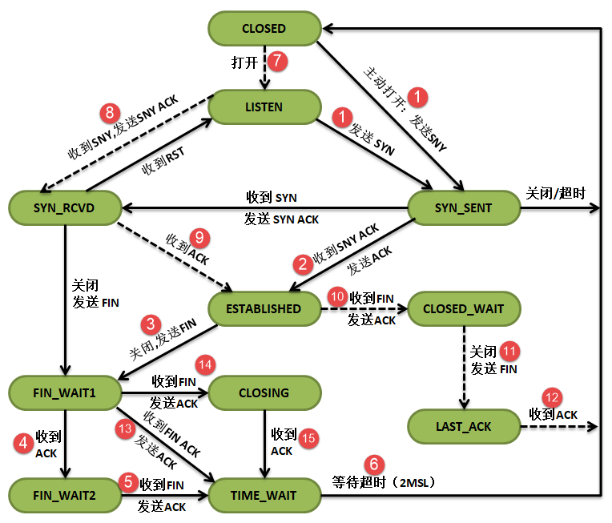

图 13‑14TCP协议状态转移图

对图 13‑14的补充说明（很重要，要牢牢记住）：

-  虚线：表示服务器的状态转移。

-  实线：表示客户端的状态转移。

-  图中所有“关闭”、“打开”都是应用程序主动处理。

-  图中所有的“超时”都是内核超时处理。

三次握手过程
''''''''''''

图
13‑14\ **(7)**\ ：服务器的应用程序主动使服务器进入监听状态，等待客户端的连接请求。

图
13‑14\ **(1)**\ ：首先客户端的应用程序会主动发起连接，发送SNY报文段给服务器，在发送之后就进入SYN_SENT状态等待服务器的SNY
ACK报文段进行确认，如果在指定超时时间内服务器不进行应答确认，那么客户端将关闭连接。

图
13‑14\ **(8)**\ ：处于监听状态的服务器收到客户端的连接请求（SNY报文段），那么服务器就返回一个SNY
ACK报文段应答客户端的响应，并且服务器进入SYN_RCVD状态。

图 13‑14\ **(1)**\ ：如果客户端收到了服务器的SNY
ACK报文段，那么就进入ESTABLISHED稳定连接状态，并向服务器发送一个ACK报文段。

图
13‑14\ **(9)**\ ：同时，服务器收到来自客户端的ACK报文段，表示连接成功，
进入ESTABLISHED稳定连接状态，这正是我们建立连接的三次握手过程。

四次挥手过程
''''''''''''

图
13‑14\ **(3)**\ ：一般来说，都是客户端主动发送一个FIN报文段来终止连接，
此时客户端从ESTABLISHED稳定连接状态转移为FIN_WAIT_1状态，并且等待来自服务器的应答确认。

图
13‑14\ **(10)**\ ：服务器收到FIN报文段，知道客户端请求终止连接，那么将返回一个ACK报文段到客户端确认终止连接，
并且服务器状态由稳定状态转移为CLOSE_WAIT等待终止连接状态。

图
13‑14\ **(4)**\ ：客户端收到确认报文段后，进入FIN_WAIT_2状态，等待来自服务器的主动请求终止连接，
此时{客户端->服务器}方向上的连接已经断开。

图
13‑14\ **(11)**\ ：一般来说，当客户端终止了连接之后，服务器也会终止{服务器->客户端}方向上的连接，
因此服务器的原因程序会主动关闭该方向上的连接，发送一个FIN报文段给客户端。

图
13‑14\ **(5)**\ ：处于FIN_WAIT_2的客户端收到FIN报文段后，发送一个ACK报文段给服务器。

图
13‑14\ **(12)**\ ：服务器收到ACK报文段，就直接关闭，此时{服务器->客户端}方向上的连接已经终止，进入CLOSED状态。

图
13‑14\ **(6)**\ ：客户端还会等待2MSL，以防ACK报文段没被服务器收到，这就是四次挥手的全部过程。

注意：对于图
13‑14\ **(13)(14)(15)**\ 的这些状态都是一些比较特殊的状态，我们暂时就不讲解了，总的来说都是一样的。

TCP中的数据结构
~~~~~~~~~~~~~~~

与其他协议一样，为了描述TCP协议，LwIP定义了一个名字叫tcp_pcb的结构体，我们称之为TCP控制块，其内定义了大量的成员变量，基本定义了整个TCP协议运作过程的所有需要的东西，如发送窗口、接收窗口、数据缓冲区。超时处理、拥塞控制、滑动窗口等等，具体见
代码清单13_3_。

代码清单 13‑3 TCP控制块

.. code-block:: c
   :name: 代码清单13_3

    #define IP_PCB                             \
    /* 本地ip地址与远端IP地址 */             \
    ip_addr_t local_ip;                      \
    ip_addr_t remote_ip;                     \
    /* 绑定netif索引 */                      \
    u8_t netif_idx;                          \
    /* 套接字选项 */                         \
    u8_t so_options;                         \
    /* 服务类型 */                           \
    u8_t tos;                                \
    /* 生存时间 */                           \
    u8_t ttl                                 \
    /* 链路层地址解析提示 */                 \
    IP_PCB_NETIFHINT

    #define TCP_PCB_COMMON(type) \
    type *next; /* 指向链表中的下一个控制块 */ \
    void *callback_arg; \
    TCP_PCB_EXTARGS \
    enum tcp_state state; /* TCP状态 */ \
    u8_t prio; \
    /* 本地主机端口号 */ \
    u16_t local_port

    /** TCP协议控制块 */
    struct tcp_pcb
    {
        IP_PCB;
        /** 协议特定的PCB成员 */
        TCP_PCB_COMMON(struct tcp_pcb);

        /* 远端端口号 */
        u16_t remote_port;

        tcpflags_t flags;
    #define TF_ACK_DELAY   0x01U   /* 延迟发送ACK */
    #define TF_ACK_NOW     0x02U   /* 立即发送ACK. */
    #define TF_INFR        0x04U   /* 在快速恢复。 */
    #define TF_CLOSEPEND   0x08U   /* 关闭挂起 */
    #define TF_RXCLOSED    0x10U   /* rx由tcp_shutdown关闭 */
    #define TF_FIN         0x20U   /* 连接在本地关闭 */
    #define TF_NODELAY     0x40U   /* 禁用Nagle算法 */
    #define TF_NAGLEMEMERR 0x80U   /* 本地缓冲区溢出 */
    #define TF_TIMESTAMP   0x0400U   /* Timestamp option enabled */
    #endif
    #define TF_RTO         0x0800U /* RTO计时器 */

        u8_t polltmr, pollinterval;
        /* 控制块被最后一次处理的时间 */
        u8_t last_timer;
        u32_t tmr;

        /* 接收窗口相关的字段 */
        u32_t rcv_nxt;   /* 下一个期望收到的序号 */
        tcpwnd_size_t rcv_wnd;   /* 接收窗口大小 */
        tcpwnd_size_t rcv_ann_wnd; /* 告诉对方窗口的大小 */
        u32_t rcv_ann_right_edge; /* 窗口的右边缘 */

        /* 重传计时器。*/
        s16_t rtime;

        u16_t mss;   /* 最大报文段大小 */

        /* RTT（往返时间）估计变量 */
        u32_t rttest; /* RTT估计，以为500毫秒递增 */
        u32_t rtseq;  /* 用于测试RTT的报文段序号 */
        s16_t sa, sv; /* RTT估计得到的平均值与时间差 */

        s16_t rto;    /* 重传超时 */
        u8_t nrtx;    /* 重传次数 */

        /* 快速重传/恢复 */
        u8_t dupacks;
        u32_t lastack; /* 接收到的最大确认序号 */

        /* 拥塞避免/控制变量 */
        tcpwnd_size_t cwnd;     /* 连接当前的窗口大小 */
        tcpwnd_size_t ssthresh; /* 拥塞避免算法启动的阈值 */

        u32_t rto_end;

        u32_t snd_nxt;   /* 下一个要发送的序号 */
        u32_t snd_wl1, snd_wl2; /* 上一次收到的序号和确认号 */
        u32_t snd_lbb;       /* 要缓冲的下一个字节的序列号 */
        tcpwnd_size_t snd_wnd;   /* 发送窗口大小 */
        tcpwnd_size_t snd_wnd_max; /* 对方的最大发送方窗口 */

        /* 可用的缓冲区空间（以字节为单位）。 */
        tcpwnd_size_t snd_buf;

        tcpwnd_size_t bytes_acked;

        struct tcp_seg *unsent;   /* 未发送的报文段 */
        struct tcp_seg *unacked;  /* 已发送但未收到确认的报文段 */
        struct tcp_seg *ooseq;	/* 已收到的无序报文 */
        /* 以前收到但未被上层处理的数据 */
        struct pbuf *refused_data;

    #if LWIP_CALLBACK_API || TCP_LISTEN_BACKLOG
        struct tcp_pcb_listen* listener;
    #endif

    //TCP协议相关的回调函数
    #if LWIP_CALLBACK_API
        /* 当数据发送成功后被调用 */
        tcp_sent_fn sent;
        /* 接收数据完成后被调用 */
        tcp_recv_fn recv;
        /* 建立连接后被调用 */
        tcp_connected_fn connected;
        /* 该函数被内核周期调用 */
        tcp_poll_fn poll;
        /* 发送错误时候被调用 */
        tcp_err_fn errf;
    #endif

        /* 保持活性 */
        u32_t keep_idle;
        /* 坚持计时器计数器值 */
        u8_t persist_cnt;
        u8_t persist_backoff;
        u8_t persist_probe;

        /* 保持活性报文发送次数 */
        u8_t keep_cnt_sent;

    };

其实TCP控制块我们暂时无需太深入理会，只要知道即可，在后续的使用中知道控制块的内容是干什么的即可。

LwIP中除了定义了一个完整的TCP控制块之外，还定义了一个删减版的TCP控制块，叫tcp_pcb_listen，
用于描述处于监听状态的连接，因为分配完整的TCP控制块是比较消耗内存资源的，而TCP协议在连接之前，
是无法进行数据传输的，那么在监听的时候只需要把对方主机的相关信息得到，然后无缝切换到完整的TCP控制块中，
这样子就能节省不少资源，此外，LwIP还定义了4个链表来维护TCP连接时的各种状态，具体见
代码清单13_4_。

代码清单 13‑4 监听TCP控制块与链表

.. code-block:: c
   :name: 代码清单13_4

    /** 用于监听的TCP协议控制块 */
    struct tcp_pcb_listen
    {
        /** 所有PCB类型的通用成员 */
        IP_PCB;
        /** 协议特定的PCB成员 */
        TCP_PCB_COMMON(struct tcp_pcb_listen);
    };

    /* The TCP PCB lists. */

    /** 新绑定的端口 */
    struct tcp_pcb *tcp_bound_pcbs;
    /** 处于监听状态的TCP控制块 */
    union tcp_listen_pcbs_t tcp_listen_pcbs;
    /** 其他状态的TCP控制块*/
    struct tcp_pcb *tcp_active_pcbs;
    /** 处于TIME_WAIT状态的控制块 */
    struct tcp_pcb *tcp_tw_pcbs;

tcp_bound_pcbs链表上的TCP控制块可以看做是处于CLOSED状态，那些新绑定的端口初始的时候都是处于这个状态。tcp_listen_pcbs链表用于记录处于监听状态的TCP控制块，一般就是记录的是tcp_pcb_listen控制块。tcp_tw_pcbs链表用于记录连接中处于TIME_WAIT状态下的TCP控制块。而tcp_active_pcbs链表用于记录所有其他状态的TCP控制块，这些端口是活跃的，可以不断进行状态转移。

窗口的概念
~~~~~~~~~~

相信大家在前面看到很多窗口的东西，但是不知道是怎么一回事，下面就来了解一下窗口是个什么东西，
前面也说了，TCP协议的发送和接收都会给每个字节的数据进行编号，这个编号可以理解为相对序号，
如 图13_15_ 所示，就是每个字节的数据的编号。

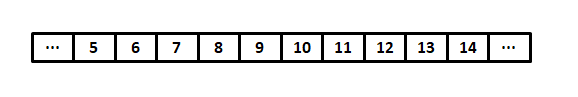

图 13‑15数据编号

接收窗口
^^^^^^^^

TCP控制块中关于接收窗口的成员变量有rcv_nxt、rcv_wnd、rcv_ann_wnd、rcv_ann_right_edge，
其中这些成员变量的定义在控制块中也讲解了，rcv_nxt表示下次期望接收到的数据编号，
rcv_wnd表示接收窗口的大小，rcv_ann_wnd用于告诉发送方窗口的大小，rcv_ann_right_edge记录了窗口的右边界，
这4个成员变量都会在数据传输的过程中动态改变的，其示意图具体见 图13_16_。

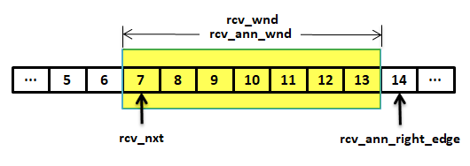

图 13‑16接收窗口示意图

如 图13_16_ 所示，比如在7字节之前的数据，都是已经接收确认的数据，而7字节正是主机想要接收到的下一个字节数据编号，
而窗口的大小是7，它会告诉发送方“你可以发送7个数据过来”，窗口的右边界为14，当主机下一次接收到N（
不一定是7）字节数据的时候，窗口就会向右移动N个字节，但是rcv_wnd、rcv_ann_wnd、rcv_ann_right_edge变量的值是不确定的，
通过LwIP内部计算得出，而下一次想要接收的数据编号就为7+N。

发送窗口
^^^^^^^^

TCP控制块中关于发送窗口的成员变量有lastack、snd_nxt、snd_lbb、snd_wnd，lastack记录了已经确认的最大序号，
snd_nxt表示下次要发送的序号，snd_lbb是表示下一个将被应用线程缓冲的序号，而snd_wnd表示发送窗口的大小，
是由接收已方提供的。这些值也是动态变化的，当发送的数据收到确认，就会更新lastack，并且随着数据的发送出去，
窗口会向右移动，即snd_nxt的值在增加，其示意图具体见
图13_17_。

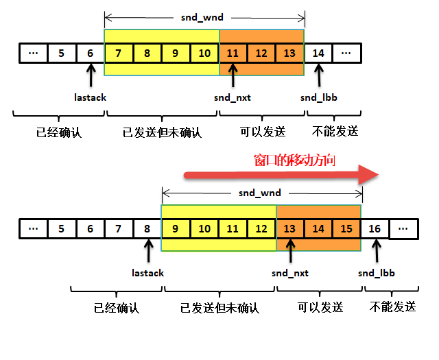

图 13‑17发送窗口

每条TCP 连接的每一端都必须设有两个窗口——一个发送窗口和一个接收窗口，TCP
的可靠传输机制用字节的序号（编号）进行控制，TCP
所有的确认都是基于数据的序号而不是基于报文段，发送过的数据未收到确认之前必须保留，以便超时重传时使用，发送窗口在没收到确认序号之前是保持不动的，当收到确认序号就会向右移动，并且更新lastack
的值。

发送缓冲区用来暂时存放应用程序发送给对方的数据，这是主机已发送出但未收到确认的数据。接收缓存用来暂时存放按序到达的、但尚未被接收应用程序读取的数据以及
不按序到达的数据。

关于窗口的概念必须强调三点：

1. 发送方的发送窗口并不总是和接收方接收窗口一样大，因为有一定的时间滞后。

2. TCP标准没有规定对不按序到达的数据应如何处理，通常是先临时存放在接收窗口中，
   等到字节流中所缺少的字节收到后，再按序交付上层的应用进程。

3. TCP 要求接收方必须有确认的功能，这样可以减小传输开销。

TCP报文段处理
~~~~~~~~~~~~~

报文段缓冲队列
^^^^^^^^^^^^^^

我们知道，TCP连接的每一端都有接收缓冲区与发送缓冲区（也可以称之为缓冲队列，下文均用缓冲队列），而
TCP控制块只是维护缓冲区队列的指针，通过指针简单对这些缓冲区进行管理，LwIP为了更好管理TCP报文段的缓冲队列数据，
特地定义了一个数据结构，命名为tcp_seg，使用它将所有的报文段连接起来，这些报文可能是无发送的、
可能是已发送但未确认的或者是已经接收到的无序报文，都是需要缓冲在TCP控制块内部的，以便识别是哪个连接，
而TCP控制块，又不可能单独为每个连接开辟那么大的空间，只能使用指针来管理，具体见 代码清单13_5_。

代码清单 13‑5tcp_seg结构体

.. code-block:: c
   :name: 代码清单13_5

    struct tcp_seg
    {
        struct tcp_seg *next;    /* 指向下一个tcp_seg */
        struct pbuf *p;          /* 指向报文段的pbuf */
        u16_t len;               /* 报文段的数据长度 */

        u8_t  flags;             /* 报文段标志属性 */
    #define TF_SEG_OPTS_MSS         (u8_t)0x01U
    #define TF_SEG_OPTS_TS          (u8_t)0x02U
    #define TF_SEG_DATA_CHECKSUMMED (u8_t)0x04U
    #define TF_SEG_OPTS_WND_SCALE   (u8_t)0x08U
    #define TF_SEG_OPTS_SACK_PERM   (u8_t)0x10U
        struct tcp_hdr *tcphdr;  /* 指向报文段首部*/
    };

每个已经连接的TCP控制块中维护了3个是指针，分别是unsent、unacked、ooseq，unsent指向未发送的报文段缓冲队列，
unacked指向已发送但未收到确认的报文段缓冲队列，ooseq指向已经收到的无序报文段缓冲队列，当然啦，
如果都没有这些报文段，那么这些指针都会指向NULL，其指向示意图具体见 图13_18_。

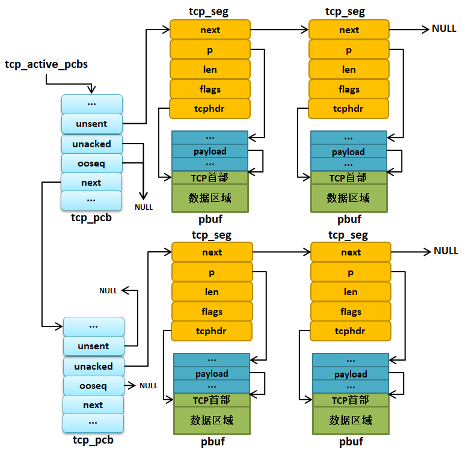

图 13‑18TCP报文段缓冲队列管理示意图

TCP报文段发送
^^^^^^^^^^^^^

一般我们在应用层使用NETCONN API或者Socket
API进行编程的时候，会将用户数据传递给传输层，那么本章关于应用层是如何传递数据到传输层的就暂时先不讲解，只需要知道数据到达传输层后是怎么输出的即可，如果我们使用的是NETCONN
API对已经连接的TCP应用发送数据，那么经过内核的一系列处理，就会调用lwip_netconn_do_writemore()函数对发送数据，但是真正处理TCP报文段缓冲等操作是在tcp_write()函数中，在这个函数里，LwIP会写入数据，但是不会立即发送，也就是存储在缓冲区里面，等待更多的数据进行高效的发送，这也是著名的Nagle算法，然后在调用tcp_output()函数进行发送出去，这样子一个应用层的数据就通过TCP协议传递给IP层了，tcp_output()函数具体见 代码清单13_6_。

代码清单 13‑6 tcp_output()源码（已删减）

.. code-block:: c
   :name: 代码清单13_6

    err_t
    tcp_output(struct tcp_pcb *pcb)
    {
        struct tcp_seg *seg, *useg;
        u32_t wnd, snd_nxt;
        err_t err;
        struct netif *netif;

        //如果控制块有数据在处理，直接返回
        if (tcp_input_pcb == pcb)
        {
            return ERR_OK;
        }

        //得到合适的发送窗口
        wnd = LWIP_MIN(pcb->snd_wnd, pcb->cwnd);

        //找到控制块中的未发送数据缓冲区链表
        seg = pcb->unsent;

        //根据控制块IP地址信息找到合适的网卡发送
        netif = tcp_route(pcb, &pcb->local_ip, &pcb->remote_ip);
        if (netif == NULL)
        {
            return ERR_RTE;
        }

        /* 如果没有本地IP地址，我们会从netif获得一个 */
        if (ip_addr_isany(&pcb->local_ip))
        {
            const ip_addr_t *local_ip =
                ip_netif_get_local_ip(netif, &pcb->remote_ip);
            if (local_ip == NULL)
            {
                return ERR_RTE;
            }
            ip_addr_copy(pcb->local_ip, *local_ip);
        }

        /* 处理当前不适合窗口的报文段 */
        if (lwip_ntohl(seg->tcphdr->seqno) - pcb->lastack + seg->len > wnd)
        {
            //开始持续定时器
            if (wnd == pcb->snd_wnd && pcb->unacked == NULL &&
                    pcb->persist_backoff == 0)
            {
                pcb->persist_cnt = 0;
                pcb->persist_backoff = 1;
                pcb->persist_probe = 0;
            }
            /* 我们需要ACK，但现在无法发送数据（无法捎带），所以发送一个ACK报文段 */
            if (pcb->flags & TF_ACK_NOW)
            {
                return tcp_send_empty_ack(pcb);
            }
            goto output_done;
        }
        /* 停止持续计时器 */
        pcb->persist_backoff = 0;

        /* useg指向未应答队列中的最后一个tcp_seg结构 */
        useg = pcb->unacked;
        if (useg != NULL)
        {
            for (; useg->next != NULL; useg = useg->next);
        }
        /* 可用数据和窗口允许它发送报文段，直到把数据全部发送出去或者填满发送窗口 */
        while (seg != NULL &&lwip_ntohl(seg->tcphdr->seqno)
                - pcb->lastack + seg->len <= wnd)
        {
            if ((tcp_do_output_nagle(pcb) == 0) &&
                    ((pcb->flags & (TF_NAGLEMEMERR | TF_FIN)) == 0))
            {
                break;
            }

            if (pcb->state != SYN_SENT)
            {
                TCPH_SET_FLAG(seg->tcphdr, TCP_ACK);
            }

            //真正发送TCP报文的函数，此处发送TCP报文段
            err = tcp_output_segment(seg, pcb, netif);

            if (err != ERR_OK)
            {
                tcp_set_flags(pcb, TF_NAGLEMEMERR);
                return err;
            }

            //得到下一个未发送的tcp_seg
            pcb->unsent = seg->next;
            if (pcb->state != SYN_SENT)
            {
                tcp_clear_flags(pcb, TF_ACK_DELAY | TF_ACK_NOW);
            }
            //计算snd_nxt的值
            snd_nxt = lwip_ntohl(seg->tcphdr->seqno) + TCP_TCPLEN(seg);

            //更新下一个要发送的数据编号
            if (TCP_SEQ_LT(pcb->snd_nxt, snd_nxt))
            {
                pcb->snd_nxt = snd_nxt;
            }
            /* 如果发送出去的数据长度>0，则将这些报文段放在未确认链表中 */
            if (TCP_TCPLEN(seg) > 0)
            {
                seg->next = NULL;
                /* 未确认链表为空，插入即可 */
                if (pcb->unacked == NULL)
                {
                    pcb->unacked = seg;
                    useg = seg;

                }
                //如果不为空，按照顺序插入未确认链表中
                else
                {
                    if (TCP_SEQ_LT(lwip_ntohl(seg->tcphdr->seqno),
                                    lwip_ntohl(useg->tcphdr->seqno)))
                    {
                        struct tcp_seg **cur_seg = &(pcb->unacked);
                        while (*cur_seg &&
                                TCP_SEQ_LT(lwip_ntohl((*cur_seg)->tcphdr-
                                >seqno), lwip_ntohl(seg->tcphdr->seqno))){
                            cur_seg = &((*cur_seg)->next );
                        }
                        seg->next = (*cur_seg);
                        (*cur_seg) = seg;
                    }
                    else
                    {
                        useg->next = seg;
                        useg = useg->next;
                    }
                }
            }
            else
            {
                tcp_seg_free(seg);
            }
            seg = pcb->unsent;
        }

    output_done:
        tcp_clear_flags(pcb, TF_NAGLEMEMERR);
        return ERR_OK;
    }

总的来说，这个函数的流程还是很简单的，如果控制块的flags字段被设置为TF_ACK_NOW，但是此时还没有数据发送，就只发送一个纯粹的ACK报文段，如果能发送数据，那就将ACK应答捎带过去，这样子就能减少网络中的流量，同时在发送的时候先找到未发送链表，然后调用tcp_output_segment()->ip_output_if()函数进行发送，直到把未发送链表的数据完全发送出去或者直到填满发送窗口，并且更新发送窗口相关字段，同时将这些已发送但是未确认的数据存储在未确认链表中，以防丢失数据进行重发操作，放入未确认链表的时候是按序号升序进行排序的。

TCP报文段接收
^^^^^^^^^^^^^

我们在学习IP层的时候就知道，IP数据报中如果是递交给TCP协议的数据，就会调用tcp_input()函数往上层传递，
而TCP协议收到数据就会对这些数据进行一系列的处理与验证，因此这个函数是很麻烦的一个函数，
源码足足有476行，由于太多我们就对其进行删减，删除绝大部分内容，简单看看这个函数的流程，具体见 代码清单13_7_。

代码清单 13‑7tcp_input()函数（已删减）

.. code-block:: c
   :name: 代码清单13_7

    void
    tcp_input(struct pbuf *p, struct netif *inp)
    {
        struct tcp_pcb *pcb, *prev;
        struct tcp_pcb_listen *lpcb;

        u8_t hdrlen_bytes;
        err_t err;

        LWIP_UNUSED_ARG(inp);

        PERF_START;

        TCP_STATS_INC(tcp.recv);
        MIB2_STATS_INC(mib2.tcpinsegs);

        tcphdr = (struct tcp_hdr *)p->payload;

        /* 检查报文段是否有有效数据 */
        if (p->len < TCP_HLEN)
        {
            /* 如果没有就丢掉报文段 */
            TCP_STATS_INC(tcp.lenerr);
            goto dropped;
        }

        /* 不处理传入的广播/多播报文段。 */
        if (ip_addr_isbroadcast(ip_current_dest_addr(),
                                ip_current_netif()) ||
                ip_addr_ismulticast(ip_current_dest_addr()))
        {
            TCP_STATS_INC(tcp.proterr);
            goto dropped;
        }

        /* 检查TCP报文段首部长度 */
        hdrlen_bytes = TCPH_HDRLEN_BYTES(tcphdr);
        if ((hdrlen_bytes < TCP_HLEN) || (hdrlen_bytes > p->tot_len))
        {
            TCP_STATS_INC(tcp.lenerr);
            goto dropped;
        }

        /* 移动pbuf指针，指向TCP报文段数据区域 */
        tcphdr_optlen = (u16_t)(hdrlen_bytes - TCP_HLEN);
        tcphdr_opt2 = NULL;
        if (p->len >= hdrlen_bytes)
        {
            tcphdr_opt1len = tcphdr_optlen;
            pbuf_remove_header(p, hdrlen_bytes);
        }

        /* 将TCP首部中的各字段内容提取出来。 */
        tcphdr->src = lwip_ntohs(tcphdr->src);
        tcphdr->dest = lwip_ntohs(tcphdr->dest);
        seqno = tcphdr->seqno = lwip_ntohl(tcphdr->seqno);
        ackno = tcphdr->ackno = lwip_ntohl(tcphdr->ackno);
        tcphdr->wnd = lwip_ntohs(tcphdr->wnd);

        flags = TCPH_FLAGS(tcphdr);
        tcplen = p->tot_len;

        if (flags & (TCP_FIN | TCP_SYN))
        {
            tcplen++;
            if (tcplen < p->tot_len)
            {
                /* u16_t溢出，无法处理这个 */
                TCP_STATS_INC(tcp.lenerr);
                goto dropped;
            }
        }

        prev = NULL;

        //遍历tcp_active_pcbs链表寻找对应的TCP控制块
        for (pcb = tcp_active_pcbs; pcb != NULL; pcb = pcb->next)
        {
            /* 检查控制块是否与对应的网卡绑定 */
            if ((pcb->netif_idx != NETIF_NO_INDEX) &&
                    (pcb->netif_idx !=
                    netif_get_index(ip_data.current_input_netif)))
            {
                prev = pcb;
                continue;
            }
            /* ••• */
            /* 省略处理 */
            /* ••• */

            if (pcb == NULL)
            {
                /* 如果TCP控制块没有处于连接状态，就去tcp_tw_pcbs链表中找 */
                for (pcb = tcp_tw_pcbs; pcb != NULL; pcb = pcb->next)
                {
                    /* 检查控制块是否与对应的网卡绑定 */
                    if ((pcb->netif_idx != NETIF_NO_INDEX) &&
                            (pcb->netif_idx != netif_get_index
                            (ip_data.current_input_netif)))
                    {
                        continue;
                    }

                    if (pcb->remote_port == tcphdr->src &&
                            pcb->local_port == tcphdr->dest &&
                    ip_addr_cmp(&pcb->remote_ip, ip_current_src_addr()) &&
                    ip_addr_cmp(&pcb->local_ip, ip_current_dest_addr()))
                    {
                        //找到了就处理它
                        tcp_timewait_input(pcb);

                        pbuf_free(p);
                        return;
                    }
                }

                /* 还是找不到就去tcp_listen_pcbs链表中找 */
                prev = NULL;
                for (lpcb = tcp_listen_pcbs.listen_pcbs;
                        lpcb != NULL; lpcb = lpcb->next)
                {
                    /* 检查控制块是否与对应的网卡绑定 */
            if ((lpcb->netif_idx != NETIF_NO_INDEX) &&
        (lpcb->netif_idx != netif_get_index(ip_data.current_input_netif)))
                    {
                        prev = (struct tcp_pcb *)lpcb;
                        continue;
                    }
                    /* ••• */
                    /* 省略处理 */
                    /* ••• */

                    //找到了处于监听状态的TCP控制块
                    if (lpcb != NULL)
                    {
                        if (prev != NULL)
                        {
                        ((struct tcp_pcb_listen *)prev)->next = lpcb->next;
                            lpcb->next = tcp_listen_pcbs.listen_pcbs;
                            tcp_listen_pcbs.listen_pcbs = lpcb;
                        }
                        else
                        {
                            TCP_STATS_INC(tcp.cachehit);
                        }
                        //处理报文段
                        tcp_listen_input(lpcb);
                        pbuf_free(p);
                        return;
                    }
                }

                /* ••• */
                /* 省略处理 */
                /* ••• */

                tcp_input_pcb = pcb;
                err = tcp_process(pcb);

                /* ••• */
                /* 省略处理 */
                /* ••• */

    }

tcp_input()函数会对传递进来的IP数据报进行处理，做一些校验数据报是否正确的操作，查看一下数据报中是否有数据，如果没有就丢掉，看一下是不是多播、广播报文，如果是就不做处理，释放pbuf。将TCP首部中的各字段内容提取出来，首先在
tcp_active_pcbs链表中寻找对应的TCP控制块，找到了就调用tcp_process()函数进行处理；如果找不到就去tcp_tw_pcbs链表中查找，找到了就调用tcp_timewait_input()函数处理它；如果还是找不到就去tcp_listen_pcbs链表中找，如果找到就调用tcp_listen_input()函数处理，如果找不到的话，就释放pbu。

此外，还要补充，对于正常接收处理的数据，如果收到的报文段是复位报文或终止连接应答报文，那么就释放pbuf，终止连接；如果TCP协议确认了报文段是新的数据，那么就调用带参宏TCP_EVENT_SENT（其实是一个sent的回调函数）去处理，如果报文段中包含有效的数据，就调用TCP_EVENT_RECV去处理
，如果是收到FIN报文，则调用TCP_EVENT_CLOSED去处理它。

因为TCP协议的代码量太多了，对于初学者就不用理会太过于深入，我们知道TCP层是怎么处理这些数据的即可，整个TCP层的工作流程示意图具体见。

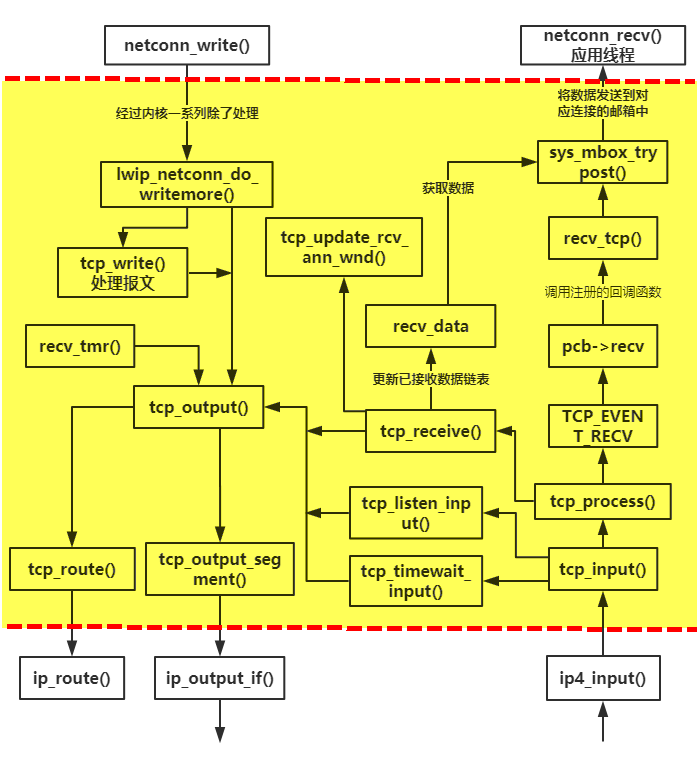

图 13‑19 TCP层的工作流程示意
