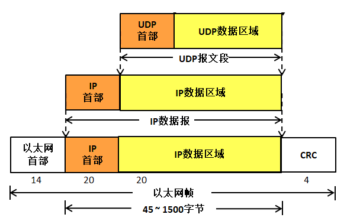
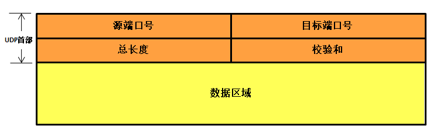
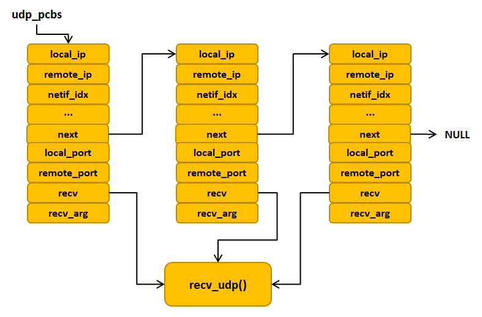
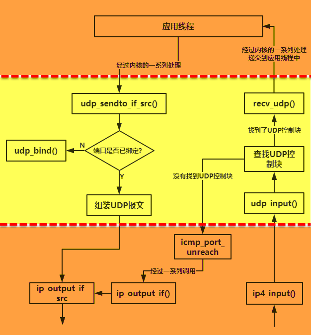

UDP协议
-------

UDP是一个简单的数据报的传输层协议：应用线程的每个输出数据都正好产生一个
UDP数据报，并组装成一份待发送的
IP数据报。这与面向数据流的TCP协议不同，TCP协议的应用程序产生的全体数据与真正发送的单个TCP报文段可能没有什么联系。

UDP协议简介
~~~~~~~~~~~

UDP 是User Datagram Protocol的简称，
中文名是用户数据报协议，是一种无连接、不可靠的协议，它只是简单地实现从一端主机到另一端主机的数据传输功能，这些数据通过IP层发送，在网络中传输，到达目标主机的顺序是无法预知的，因此需要应用程序对这些数据进行排序处理，这就带来了很大的不方便，此外，UDP协议更没有流量控制、拥塞控制等功能，在发送的一端，UDP只是把上层应用的数据封装到UDP报文中，在差错检测方面，仅仅是对数据进行了简单的校验，然后将其封装到IP数据报中发送出去。而在接收端，无论是否收到数据，它都不会产生一个应答发送给源主机，并且如果接收到数据发送校验错误，那么接收端就会丢弃该UDP报文，也不会告诉源主机，这样子传输的数据是无法保障其准确性的，如果想要其准确性，那么就需要应用程序来保障了。

UDP协议的特点：

1. 无连接、不可靠。

2. 尽可能提供交付数据服务，出现差错直接丢弃，无反馈。

3. 面向报文，发送方的UDP拿到上层数据直接添加个UDP首部，然后进行校验后就递交给IP层，
   而接收的一方在接收到UDP报文后简单进行校验，然后直接去除数据递交给上层应用。

4. 支持一对一，一对多，多对一，多对多的交互通信。

5. 速度快，UDP没有TCP的握手、确认、窗口、重传、拥塞控制等机制，UDP是一个无状态的传输协议，
   所以它在传递数据时非常快，即使在网络拥塞的时候UDP也不会降低发送的数据。

UDP虽然有很多缺点，但是也不排除其能用于很多场合，因为在如今的网络环境下，UDP协议传输出现错误的概率是很小的，并且它的实时性是非常好，常用于实时视频的传输，比如直播、网络电话等，因为即使是出现了数据丢失的情况，导致视频卡帧，这也不是什么大不了的事情，所以，UDP协议还是会被应用与对传输速度有要求，并且可以容忍出现差错的数据传输中。

UDP常用端口号
~~~~~~~~~~~~~

与TCP协议一样，UDP报文协议根据对应的端口号传递到目标主机的应用线程，同样的，传输层到应用层的唯一标识是通过端口号决定的，两个线程之间进行通信必须用端口号进行识别，同样的使用“IP地址+端口号”来区分主机不同的线程。

常见的UDP协议端口号有

+--------+------+------------------------------------------+
| 端口号 | 协议 |                   说明                   |
+========+======+==========================================+
| 53     | DNS  | 域名服务器，因特网上作为域名和IP地址相   |
|        |      | 互映射的一个分布式数据库，能够使用户更方 |
|        |      | 便的访问互联网，而不用去记住能够被机器直 |
|        |      | 接读取的IP数串。                         |
+--------+------+------------------------------------------+
| 69     | TFTP | 小型文件传输协议                         |
+--------+------+------------------------------------------+
| 123    | NTP  | 网络时间协议，它是用来同步网络中各个计算 |
|        |      | 机时间的协议。                           |
+--------+------+------------------------------------------+
| 161    | SNMP | 简单网络管理协议                         |
+--------+------+------------------------------------------+

UDP报文
~~~~~~~

UDP报文也被称为用户数据报，与TCP协议一样，由报文首部与数据区域组成。在UDP协议中，
它只是简单将应用层的数据进行封装（添加一个UDP报文首部），然后传递到IP层，再通过网卡发送出去，
因此，UDP数据也是经过两次封装，具体见 图14_1_。

图 14‑1UDP报文封装

UDP报文结构示意图具体见图 14‑2。

图 14‑2UDP报文结构

关于源端口号、目标端口号与校验和字段的作用与TCP报文段一样，端口号的取值在0~65535之间；16bit的总长度用于记录UDP报文的总长度，包括8字节的首部长度与数据区域。

UDP报文的数据结构
~~~~~~~~~~~~~~~~~

UDP报文首部结构体
^^^^^^^^^^^^^^^^^

LwIP定义了一个UDP报文首部数据结构，名字叫udp_hdr，是一个结构体，它定义了UDP报文首部的各个字段，具体见
代码清单14_1_。

代码清单 14‑1 udp_hdr结构体

.. code-block:: c
   :name: 代码清单14_1

    PACK_STRUCT_BEGIN
    struct udp_hdr
    {
        PACK_STRUCT_FIELD(u16_t src);
        PACK_STRUCT_FIELD(u16_t dest);  /*src/dest UDP ports */
        PACK_STRUCT_FIELD(u16_t len);
        PACK_STRUCT_FIELD(u16_t chksum);
    } PACK_STRUCT_STRUCT;
    PACK_STRUCT_END

UDP控制块
^^^^^^^^^

与TCP协议一样，为了更好管理UDP报文，LwIP定义了一个UDP控制块，记录与UDP通信的所有信息，
如源端口号、目标端口号、源IP地址、目标IP地址以及收到数据时候的回调函数等等，
系统会为每一个基于UDP协议的应用线程创建一个UDP控制块，并且将其与对应的端口绑定，这样子就能进行UDP通信了。
与TCP协议一样，LwIP会把多个这样子的UDP控制块用一个链表连接起来，在处理的时候遍历列表，
然后对控制块进行操作，具体见 代码清单14_2_。

代码清单 14‑2UDP控制块

.. code-block:: c
   :name: 代码清单14_2

    #define IP_PCB                             \
    /* 本地ip地址与远端IP地址 */             \
    ip_addr_t local_ip;                      \
    ip_addr_t remote_ip;                     \
    /* 网卡id */                             \
    u8_t netif_idx;                          \
    /* Socket 选项 */                        \
    u8_t so_options;                         \
    /* 服务类型   */                         \
    u8_t tos;                                \
    /* 生存时间 */                           \
    u8_t ttl                                 \
    IP_PCB_NETIFHINT

    /** UDP控制块 */
    struct udp_pcb
    {

        IP_PCB;

        //指向下一个控制块
        struct udp_pcb *next;

        //控制块状态
        u8_t flags;

        /** 本地端口号与远端端口号 */
        u16_t local_port, remote_port;

        /** 接收回调函数 */
        udp_recv_fn recv;
        /** 回调函数参数 */
        void *recv_arg;
    };

UDP控制块会使用IP层的一个宏定义IP_PCB，里面包括IP层需要使用的信息，如本地IP地址与目标IP地址（或者称为远端IP地址），服务类型、网卡、生存时间等，此外UDP控制块还要本地端口号与目标（远端）端口号，这两个字段很重要，UDP协议就是根据这些端口号识别应用线程，当UDP收到一个报文的时候，会遍历链表上的所有控制块，根据报文的目标端口号找到与本地端口号相匹配的UDP控制块，然后递交数据到上层应用，而如果找不到对应的端口号，那么就会返回一个端口不可达ICMP差错控制报文。

除此之外LwIP会为我们注册一个接收数据回调函数，当然啦，如果我们使用RAW
API编程，这个回调函数就需要我们自己实现，在LwIP接收到一个给本地的数据时候，
就会调用这个回调函数，而recv字段就是指向这个回调函数的，其函数原型具体见 代码清单14_3_。

代码清单 14‑3 udp_recv_fn函数原型

.. code-block:: c
   :name: 代码清单14_3

    typedef void (*udp_recv_fn)(void *arg,
                                struct udp_pcb *pcb,
                                struct pbuf *p,
                                const ip_addr_t *addr,
                                u16_t port);

一般来说，我们使用NETCONN API或者是Socket
API编程，是不需要我们自己去注册回调函数recv_udp()，因为这个函数LwIP内核会自动给我们注册，具体见
代码清单14_4_。

代码清单 14‑4注册接收回调函数

.. code-block:: c
   :name: 代码清单14_4

    void
    udp_recv(struct udp_pcb *pcb,
            udp_recv_fn recv,
            void *recv_arg)
    {
        LWIP_ASSERT_CORE_LOCKED();

        /* 注册回调函数 */
        pcb->recv = recv;
        pcb->recv_arg = recv_arg;
    }

    udp_recv(msg->conn->pcb.udp,
            recv_udp,
            msg->conn);

LwIP中定义了一个名字为udp_pcbs的UDP控制块链表，记录主机中所有的UDP控制块，每个UDP协议的应用线程都能受到内核的处理，
UDP控制块链表将UDP控制块连接起来，在收到数据需要处理的时候，内核变量链表，查找UDP控制块的信息，
从而调用对应的回调函数，当然，我们不使用RAW
API编程的时候，回调函数只有一个，UDP控制块链表示意图具体见 图14_3_。

图 14‑3UDP控制块链表

UDP报文发送
~~~~~~~~~~~

UDP协议是传输层，所以需要从上层应用线程中得到数据，我们使用NETCONN
API或者是Socket
API编程，那么传输的数据经过内核的层层处理，最后调用udp_sendto_if_src()函数进行发送UDP报文，具体见
代码清单14_5_。

代码清单 14‑5 udp_sendto_if_src()源码（已删减）

.. code-block:: c
   :name: 代码清单14_5

    err_t
    udp_sendto_if_src(struct udp_pcb *pcb, struct pbuf *p,
                    const ip_addr_t *dst_ip, u16_t dst_port,
                    struct netif *netif, const ip_addr_t *src_ip)
    {
        struct udp_hdr *udphdr;
        err_t err;
        struct pbuf *q; /* q will be sent down the stack */
        u8_t ip_proto;
        u8_t ttl;

        /* 如果UDP控制块尚未绑定到端口，请将其绑定到这里 */
        if (pcb->local_port == 0)
        {
            err = udp_bind(pcb, &pcb->local_ip, pcb->local_port);
            if (err != ERR_OK)
            {
                return err;
            }
        }

        /* 数据包太大，无法添加UDP首部 */
        if ((u16_t)(p->tot_len + UDP_HLEN) < p->tot_len)
        {
            return ERR_MEM;
        }
        /* 没有足够的空间将UDP首部添加到给定的pbuf中 */
        if (pbuf_add_header(p, UDP_HLEN))
        {
            /* 在一个单独的新pbuf中分配标头 */
            q = pbuf_alloc(PBUF_IP, UDP_HLEN, PBUF_RAM);
            /* 无法分配新的标头pbuf */
            if (q == NULL)
            {
                return ERR_MEM;
            }
            if (p->tot_len != 0)
            {
                /* 把首部pbuf和数据pbuf连接到一个pbuf链表上 */
                pbuf_chain(q, p);
            }
        }
        else
        {
            /* 在数据pbuf中已经预留UDP首部空间 */
            /* q指向pbuf */
            q = p;

        }

        /* 填写UDP首部各个字段 */
        udphdr = (struct udp_hdr *)q->payload;
        udphdr->src = lwip_htons(pcb->local_port);
        udphdr->dest = lwip_htons(dst_port);
        /* in UDP, 0 checksum means 'no checksum' */
        udphdr->chksum = 0x0000;

        udphdr->len = lwip_htons(q->tot_len);

        ip_proto = IP_PROTO_UDP;

        /* 发送到IP层 */
        NETIF_SET_HINTS(netif, &(pcb->netif_hints));

        err = ip_output_if_src(q, src_ip,
                            dst_ip, ttl, pcb->tos,
                            ip_proto, netif);

        NETIF_RESET_HINTS(netif);

        MIB2_STATS_INC(mib2.udpoutdatagrams);

        if (q != p)
        {
            /* 释放内存 */
            pbuf_free(q);
            q = NULL;

        }

        UDP_STATS_INC(udp.xmit);

相比于TCP协议的处理，UDP发送的处理就简单太多了，即使我们加上校验那部分，也是非常简单的，就是直接将用户的数据添加UDP首部然后调用ip_output_if_src()函数发送到IP层，当然啦，在这个函数之前还是有很多操作的，比如找到本地合适的网卡发送出去，找到本地IP地址与本地端口、找到目标IP地址与目标端口等等

UDP报文接收
~~~~~~~~~~~

根据前面第十一章 图11_8 我们知道：当有一个UDP报文被IP层接收的时候，IP层会调用udp_input()函数将报文传递到传输层，
LwIP就会去处理这个UDP报文，UDP协议会对报文进行一些合法性的检测，如果确认了这个报文是合法的，
那么就遍历UDP控制块链表，在这些控制块中找到对应的端口，然后递交到应用层，首先要判断本地端口号、
本地IP地址与报文中的目标端口号、目标IP地址是否匹配，如果匹配就说明这个报文是给我们的，
然后调用用户的回调函数recv_udp()将受到的数据传递给上层应用。而如果找不到对应的端口，
那么将返回一个端口不可达ICMP差错控制报文到源主机，当然，如果LwIP接收到这个端口不可达ICMP报文，也是不会去处理它的，udp_input()函数源码具体见。

代码清单 14‑6udp_input()源码

.. code-block:: c
   :name: 代码清单14_6

    void
    udp_input(struct pbuf *p, struct netif *inp)
    {
        struct udp_hdr *udphdr;
        struct udp_pcb *pcb, *prev;
        struct udp_pcb *uncon_pcb;
        u16_t src, dest;
        u8_t broadcast;
        u8_t for_us = 0;

        LWIP_UNUSED_ARG(inp);

        LWIP_ASSERT_CORE_LOCKED();

        PERF_START;

        UDP_STATS_INC(udp.recv);

        /* 检查最小长度，不能小于UDP首部 */
        if (p->len < UDP_HLEN)
        {
            UDP_STATS_INC(udp.lenerr);
            UDP_STATS_INC(udp.drop);
            MIB2_STATS_INC(mib2.udpinerrors);
            pbuf_free(p);
            goto end;
        }
        //指向UDP报文首部，并且强制转换成udp_hdr类型，方便操作
        udphdr = (struct udp_hdr *)p->payload;

        /* 判断一下是不是广播包 */
        broadcast = ip_addr_isbroadcast(ip_current_dest_addr(),
                                        ip_current_netif());

        /* 得到UDP首部中的源主机和目标主机端口号 */
        src = lwip_ntohs(udphdr->src);
        dest = lwip_ntohs(udphdr->dest);

        udp_debug_print(udphdr);

        pcb = NULL;
        prev = NULL;
        uncon_pcb = NULL;

        //遍历UDP链表，找到对应的端口号，如果找不到，
        //那就用链表的第一个未使用的UDP控制块
        for (pcb = udp_pcbs; pcb != NULL; pcb = pcb->next)
        {
            /* 将UDP控制块本地地址+端口与UDP目标地址+端口进行比较 */
            if ((pcb->local_port == dest) &&
                    (udp_input_local_match(pcb, inp, broadcast) != 0))
            {
                if ((pcb->flags & UDP_FLAGS_CONNECTED) == 0)
                {
                    if (uncon_pcb == NULL)
                    {
                        /* 如果未找到使用第一个UDP控制块 */
                        uncon_pcb = pcb;
    #if LWIP_IPV4
                    }
                    else if (broadcast && ip4_current_dest_addr()->addr
                            == IPADDR_BROADCAST)
                    {
                        /* 对于全局广播地址 */
                        if (!IP_IS_V4_VAL(uncon_pcb->local_ip) ||
                                !ip4_addr_cmp(ip_2_ip4(&uncon_pcb->local_ip),
                                            netif_ip4_addr(inp)))
                        {
                            /* 当前UDP控制块与输入netif不匹配，检查此UDP控制块 */
                        if (IP_IS_V4_VAL(pcb->local_ip) &&
                            ip4_addr_cmp(ip_2_ip4(&pcb->local_ip),netif_ip4_addr(inp)))
                            {
                                /* 得到更好的匹配 */
                                uncon_pcb = pcb;
                            }
                        }
    #endif /* LWIP_IPV4 */
                    }
                }

                /* 将UDP控制块的目标地址+端口与UDP控制块源地址+端口进行比较 */
                if ((pcb->remote_port == src) &&
                        (ip_addr_isany_val(pcb->remote_ip) ||
                        ip_addr_cmp(&pcb->remote_ip, ip_current_src_addr())))
                {
                    /* 第一个完全匹配的UDP控制块 */
                    if (prev != NULL)
                    {
                        /* 将UDP控制块移动到udp_pcbs的前面，
                        这样就可以在下次查找的时候处理速度更快 */
                        prev->next = pcb->next;
                        pcb->next = udp_pcbs;
                        udp_pcbs = pcb;
                    }
                    else
                    {
                        UDP_STATS_INC(udp.cachehit);
                    }
                    break;
                }
            }

            prev = pcb;
        }
        /*  找不到完全匹配的UDP控制块？
            将第一个未使用的UDP控制块作为匹配结果 */
        if (pcb == NULL)
        {
            pcb = uncon_pcb;
        }

        /* 检查校验和是否匹配或是否匹配。 */
        if (pcb != NULL)
        {
            for_us = 1;
        }
        else
        {

            if (!ip_current_is_v6())
            {
                for_us = ip4_addr_cmp(netif_ip4_addr(inp),
                                    ip4_current_dest_addr());
            }
        }
        //匹配
        if (for_us)
        {
            //调整报文的数据区域指针
            if (pbuf_remove_header(p, UDP_HLEN))
            {
                UDP_STATS_INC(udp.drop);
                MIB2_STATS_INC(mib2.udpinerrors);
                pbuf_free(p);
                goto end;
            }
            //如果找到对应的控制块
            if (pcb != NULL)
            {
                MIB2_STATS_INC(mib2.udpindatagrams);
                /* 回调函数，将数据递交给上层应用 */
                if (pcb->recv != NULL)
                {
                    /* recv函数需要负责释放p */
                    pcb->recv(pcb->recv_arg, pcb, p,
                            ip_current_src_addr(), src);
                }
                else
                {
                    /* 如果recv函数没有注册，直接释放p */
                    pbuf_free(p);
                    goto end;
                }
            }
            /* 没有找到匹配的控制块，返回端口不可达ICMP报文 */
            else
            {
                if (!broadcast &&
                        !ip_addr_ismulticast(ip_current_dest_addr()))
                {
                    /* 将数据区域指针移回IP数据报首部 */
                    pbuf_header_force(p,
                            (s16_t)(ip_current_header_tot_len() + UDP_HLEN));
                    //返回一个端口不可达ICMP差错控制报文到源主机中
                    icmp_port_unreach(ip_current_is_v6(), p);
                }
                UDP_STATS_INC(udp.proterr);
                UDP_STATS_INC(udp.drop);
                MIB2_STATS_INC(mib2.udpnoports);
                pbuf_free(p);
            }
        }
        else
        {
            pbuf_free(p);
        }
    end:
        PERF_STOP("udp_input");
        return;
    }

虽然udp_input()函数看起来很长，但是其实是非常简单的处理，主要就是遍历UDP控制块链表udp_pcbs找到对应的UDP控制块，然后将去掉UDP控制块首部信息，提取UDP报文数据递交给应用程序，而递交的函数就是在UDP控制块初始化时注册的回调函数，即recv_udp()，而这个函数会让应用能读取到数据，然后做对应的处理。

至此，UDP系统的内容就讲解完毕，对比TCP协议是不是简单太多了，整个UDP协议的处理过程具体见 图14_4_。

图 14‑4UDP协议的处理过程
