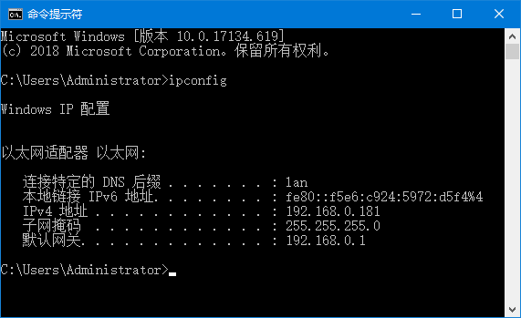

使用NETCONN接口编程
-------------------

当你学习到这章的时候，说明已经对LwIP中各个层的处理已经稔熟于心了，此时，再去回顾第9章
的内容，相信，你会更加熟悉整个LwIP的运作过程，本书全是基于操作系统之上来讲解LwIP，那么NETCONN接口编程的学习就是必须的，下面一起来学习一下NETCONN
API。

netbuf结构体
~~~~~~~~~~~~

LwIP为了更好描述应用线程发送与接收的数据，并且为了更好管理这些数据的缓冲区，LwIP定义了一个netbuf结构体，它是基于pbuf上更高一层的封装，记录了主机的IP地址与端口号，在这里再提醒一下大家，端口号对应的其实就是应用线程。在接收的时候，应用程序肯定需要知道到底是谁发数据给自己，而在发送的时候，应用程序需要将自己的端口号与IP地址填充到netbuf结构体对应字段中。netbuf结构体具体见代码清单
15‑1。

代码清单 15‑1netbuf结构体（已删减）

.. code-block:: c
   :name: 代码清单15_1

    struct netbuf
    {
        struct pbuf *p, *ptr;		(1)
        ip_addr_t addr;			(2)
        u16_t port;			(3)
    };

代码清单
15‑1\ **(1)**\ ：netbuf的p字段的指针指向pbuf链表，这是基于pbuf上封装的结构体，
因此，ptr字段的指针也是指向pbuf，但是它与p字段的指针有一点不一样，因为它可以指向任意的pbuf，
由netbuf_next()与netbuf_first()函数来控制。

代码清单 15‑1\ **(2)**\ ：addr字段记录了数据发送方的IP地址。

代码清单 15‑1\ **(3)**\ ：port记录了数据发送方的端口号。

此外，LwIP的一贯操作就是还会定义一些带参宏来快速操作这些结构体的字段，在这里操作netbuf也例外，如：

代码清单 15‑2处理netbuf字段的带参宏

.. code-block:: c
   :name: 代码清单15_2

    #define netbuf_fromaddr(buf)         (&((buf)->addr))
    #define netbuf_set_fromaddr(buf, fromaddr) \
                    ip_addr_set(&((buf)->addr), fromaddr)
    #define netbuf_fromport(buf)         ((buf)->port)

netbuf结构体指向示意图具体见 图15_1_ 与 图15_2_，虚线表示ptr指针的指向位置是不固定的，
它是由netbuf_next()函数与netbuf_first()函数来调整的。

图 15‑1指向不同类型的pbuf链表

图 15‑2指向相同类型pbuf链表

netbuf相关函数说明
~~~~~~~~~~~~~~~~~~

netbuf是LwIP描述用户数据很重要的一个结构体，因为LwIP是不可能让我们直接操作pbuf的，因为分层的思想，应用数据必然是由用户操作的，因此LwIP会提供很多函数接口让用户对netbuf进行操作，无论是UDP报文还是TCP报文段，其本质都是数据，要发送出去的数据都会封装在netbuf中，然后通过邮箱发送给内核线程（tcpip_thread线程），然后经过内核的一系列处理，放入发送队列中，然后调用底层网卡发送函数进行发送，反之，应用线程接收到数据，也是通过netbuf进行管理，下面一起来看看LwIP提供给我们操作netbuf的相关函数。

netbuf_new()
^^^^^^^^^^^^

这个函数的功能是申请一个新的netbuf结构体内存空间，通过memp内存池进行申请，大小为MEMP_NETBUF，
并且将netbuf结构体全部初始化为0，并且返回一个指向netbuf结构体的指针，此时的netbuf结构体的p与ptr字段不指向任何的pbuf，
具体见 代码清单15_3_。

代码清单 15‑3 netbuf_new()源码

.. code-block:: c
   :name: 代码清单15_3

    struct
    netbuf *netbuf_new(void)
    {
        struct netbuf *buf;

        buf = (struct netbuf *)memp_malloc(MEMP_NETBUF);
        if (buf != NULL)
        {
            memset(buf, 0, sizeof(struct netbuf));
        }
        return buf;
    }

netbuf_delete()
^^^^^^^^^^^^^^^

与netbuf_new()函数相反，释放一个netbuf结构体内存空间，如果netbuf结构体的p或者ptr字段指向的pbuf是拥有数据的，
那么对应的pbuf也会被释放掉，具体见 代码清单15_4_。

代码清单 15‑4 netbuf_delete()源码

.. code-block:: c
   :name: 代码清单15_4

    void
    netbuf_delete(struct netbuf *buf)
    {
        if (buf != NULL)
        {
            if (buf->p != NULL)
            {
                pbuf_free(buf->p);
                buf->p = buf->ptr = NULL;
            }
            memp_free(MEMP_NETBUF, buf);
        }
    }

netbuf_alloc()
^^^^^^^^^^^^^^

这个函数比较有意思，为netbuf结构体中的p字段指向的数据区域分配指定大小的内存空间，简单来说就是申请pbuf内存空间，
由于这个函数是在应用层调用的，因此这个内存会包含链路层首部、IP层首部与传输层首部大小，当然，
这些空间是附加上去的，用户指定的是数据区域大小，当然还有很重要的一点就是，如果当前netbuf中已经存在数据区域了，
那么这个数据区域会被释放掉，然后重新申请用户指定大小的数据区域，而函数的返回是一个指向数据区域起始地址的指针（
即pbuf的payload指针），具体见 代码清单15_5_。

代码清单 15‑5 netbuf_alloc()源码

.. code-block:: c
   :name: 代码清单15_5

    void *
    netbuf_alloc(struct netbuf *buf, u16_t size)
    {
        LWIP_ERROR("netbuf_alloc: invalid buf", (buf != NULL), return NULL;);

        /* Deallocate any previously allocated memory. */
        if (buf->p != NULL)
        {
            pbuf_free(buf->p);
        }
        buf->p = pbuf_alloc(PBUF_TRANSPORT, size, PBUF_RAM);
        if (buf->p == NULL)
        {
            return NULL;
        }
        LWIP_ASSERT("check that first pbuf can hold size",
                    (buf->p->len >= size));
        buf->ptr = buf->p;
        return buf->p->payload;
    }

netbuf_free()
^^^^^^^^^^^^^

这个函数的功能是比较简单的，直接释放netbuf结构体指向的pbuf内存空间，如果结构体中指向pbuf的内容为空，
则不做任何释放操作，直接将p与ptr字段的指针设置为NULL，具体见 代码清单15_6_。

注意：这个函数释放的是pbuf内存空间，而不是netbuf结构体的内存空间。

代码清单 15‑6 netbuf_free()源码

.. code-block:: c
   :name: 代码清单15_6

    void
    netbuf_free(struct netbuf *buf)
    {
        LWIP_ERROR("netbuf_free: invalid buf", (buf != NULL), return;);
        if (buf->p != NULL)
        {
            pbuf_free(buf->p);
        }
        buf->p = buf->ptr = NULL;
    }

netbuf_ref()
^^^^^^^^^^^^

这个函数与netbuf_alloc()函数很像，都是申请内存空间，但是，有一个很大的不同，
netbuf_ref()函数只申请pbuf首部的内存空间，包含链路层首部、IP层首部与传输层首部，
而不会申请数据区域内存空间，然后把pbuf的payload指针指向用户指定的数据区域起始地址dataptr，
这种申请经常在发送静态数据的时候用到，因为数据保存的地址是固定的，而不用动态申请，
如果netbuf的p或者ptr字段已经指向了pbuf，那么这些pbuf将被释放掉，具体见 代码清单15_7_。

注意：在使用该函数的时候用户需要传递有效的静态数据区域起始地址，比如某个静态字符串的起始地址。

代码清单 15‑7netbuf_ref()源码

.. code-block:: c
   :name: 代码清单15_7

    err_t
    netbuf_ref(struct netbuf *buf, const void *dataptr, u16_t size)
    {
        LWIP_ERROR("netbuf_ref: invalid buf", (buf != NULL), return ERR_ARG;);
        if (buf->p != NULL)
        {
            pbuf_free(buf->p);
        }
        buf->p = pbuf_alloc(PBUF_TRANSPORT, 0, PBUF_REF);
        if (buf->p == NULL)
        {
            buf->ptr = NULL;
            return ERR_MEM;
        }
        ((struct pbuf_rom *)buf->p)->payload = dataptr;
        buf->p->len = buf->p->tot_len = size;
        buf->ptr = buf->p;
        return ERR_OK;
    }

netbuf_chain()
^^^^^^^^^^^^^^

netbuf_chain()函数是将tail中的pbuf数据连接到head中的pbuf后面，形成一个pbuf链表，在调用此函数之后，
会将tail结构删除，具体见 代码清单15_8_。

代码清单 15‑8 netbuf_chain()源码

.. code-block:: c
   :name: 代码清单15_8

    void
    netbuf_chain(struct netbuf *head, struct netbuf *tail)
    {
        LWIP_ERROR("netbuf_chain: invalid head", (head != NULL), return;);
        LWIP_ERROR("netbuf_chain: invalid tail", (tail != NULL), return;);
        pbuf_cat(head->p, tail->p);
        head->ptr = head->p;
        memp_free(MEMP_NETBUF, tail);
    }

netbuf_data()
^^^^^^^^^^^^^

该函数可以将netbuf结构体中的ptr指针指向的pbuf数据起始地址填写到dataptr中，同时将数据长度填入len中，
netbuf结构体中p字段的指针指向的数据可能是一个pbuf链表，但是这个函数的操作只能是将ptr指针指向的pbuf数据填写到dataptr中，
如果想要操作netbuf中p指向的链表数据，想要使用netbuf_next()或者netbuf_first()函数来调整ptr指针指向的pbuf，
具体见 代码清单15_9_。

代码清单 15‑9 netbuf_data()

.. code-block:: c
   :name: 代码清单15_9

    err_t
    netbuf_data(struct netbuf *buf, void **dataptr, u16_t *len)
    {
    LWIP_ERROR("netbuf_data: invalid buf", (buf != NULL), return ERR_ARG;);
    LWIP_ERROR("netbuf_data: invalid dataptr", (dataptr != NULL), return ERR_ARG;);
    LWIP_ERROR("netbuf_data: invalid len", (len != NULL), return ERR_ARG;);

        if (buf->ptr == NULL)
        {
            return ERR_BUF;
        }
        *dataptr = buf->ptr->payload;
        *len = buf->ptr->len;
        return ERR_OK;
    }

netbuf_next()与netbuf_first()
^^^^^^^^^^^^^^^^^^^^^^^^^^^^^

netbuf_next()用于移动netbuf的ptr数据指针，使ptr指针指向pbuf链表的下一个pbuf。
同样的netbuf_first()函数可以将ptr指针指向pbuf链表的第一个pbuf。这两个函数是很有用的，
比如netbuf中p字段的指针指向一个pbuf链表，并且pbuf链表中拥有多个pbuf，
那么需要配合netbuf_data()函数将链表中的所有的pbuf读取并且处理；如果netbuf_next()函数的返回值为0，
表示调整成功，而如果返回值小于0时，则表示调整失败，当前pbuf已经是链表的最后一个pbuf，
具体见 代码清单15_10_。

代码清单 15‑10 netbuf_next()与netbuf_first()源码

.. code-block:: c
   :name: 代码清单15_10

    s8_t
    netbuf_next(struct netbuf *buf)
    {
        LWIP_ERROR("netbuf_next: invalid buf", (buf != NULL), return -1;);
        if (buf->ptr->next == NULL)
        {
            return -1;
        }
        buf->ptr = buf->ptr->next;
        if (buf->ptr->next == NULL)
        {
            return 1;
        }
        return 0;
    }

    void
    netbuf_first(struct netbuf *buf)
    {
        LWIP_ERROR("netbuf_first: invalid buf", (buf != NULL), return;);
        buf->ptr = buf->p;
    }

netbuf_copy()
^^^^^^^^^^^^^

这个函数用于将netbuf
结构体数据区域pbuf中的所有数据拷贝到dataptr指针指向的存储区，即使pbuf（链表）中的数据被保存在多个pbuf中，
它也会完全拷贝出来，len参数指定要拷贝数据的最大长度，如果netbuf的数据区域空间小于len指定的大小，
那么内核只会拷贝netbuf数据区域大小的数据，此外，该函数本质是一个宏定义，
真正实现的函数在pbuf.c中，具体见 代码清单15_11_。

代码清单 15‑11 netbuf_copy()源码

.. code-block:: c
   :name: 代码清单15_11

    #define netbuf_copy_partial(buf, dataptr, len, offset) \
                pbuf_copy_partial((buf)->p, (dataptr), (len), (offset))
    #define netbuf_copy(buf,dataptr,len)  \
                netbuf_copy_partial(buf, dataptr, len, 0)

    u16_t pbuf_copy_partial(const struct pbuf *buf, void *dataptr,
                u16_t len, u16_t offset)
    {
        const struct pbuf *p;
        u16_t left = 0;
        u16_t buf_copy_len;
        u16_t copied_total = 0;

        for (p = buf; len != 0 && p != NULL; p = p->next)
        {
            if ((offset != 0) && (offset >= p->len))
            {
                offset = (u16_t)(offset - p->len);
            }
            else
            {
            buf_copy_len = (u16_t)(p->len - offset);
                if (buf_copy_len > len)
                {
                    buf_copy_len = len;
                }
                MEMCPY(&((char *)dataptr)[left],
                        &((char *)p->payload)[offset], buf_copy_len);
                copied_total = (u16_t)(copied_total + buf_copy_len);
                left = (u16_t)(left + buf_copy_len);
                len = (u16_t)(len - buf_copy_len);
                offset = 0;
            }
        }
        return copied_total;
    }

netbuf_take()
^^^^^^^^^^^^^

这个函数用于将用户指定区域的数据dataptr拷贝到netbuf
结构体数据区域pbuf中，可能用户数据太多，一个pbuf存储不下用户的数据，那么内核将对数据进行切割处理，使用多个pbuf存储，len参数指定要拷贝数据的长度，具体见 代码清单15_12_。

代码清单 15‑12 netbuf_take()源码

.. code-block:: c
   :name: 代码清单15_12

    #define netbuf_take(buf, dataptr, len) \
        pbuf_take((buf)->p, dataptr, len)

    err_t
    pbuf_take(struct pbuf *buf, const void *dataptr, u16_t len)
    {
        struct pbuf *p;
        size_t buf_copy_len;
        size_t total_copy_len = len;
        size_t copied_total = 0;

        if ((buf == NULL) || (dataptr == NULL) || (buf->tot_len < len))
        {
            return ERR_ARG;
        }

        /* 拷贝数据 */
        for (p = buf; total_copy_len != 0; p = p->next)
        {
            LWIP_ASSERT("pbuf_take: invalid pbuf", p != NULL);
            buf_copy_len = total_copy_len;
            if (buf_copy_len > p->len)
            {
                /* 此pbuf无法保存所有剩余数据 */
                buf_copy_len = p->len;
            }
            /* 从dataptr 拷贝数据到 p->payload*/
            MEMCPY(p->payload, &((const char *)dataptr)[copied_total], buf_copy_len);
            total_copy_len -= buf_copy_len;
            copied_total += buf_copy_len;
        }
        return ERR_OK;
    }

其他操作netbuf的宏定义
^^^^^^^^^^^^^^^^^^^^^^

除了上述的一些函数（宏定义）以外，LwIP还定义了很多宏直接操作netbuf，获得netbuf的信息，或者设置netbuf的字段信息，具体见

代码清单 15‑13其他操作netbuf的宏定义

.. code-block:: c
   :name: 代码清单15_13

    //获取数据的总长度
    #define netbuf_len(buf)              ((buf)->p->tot_len)

    //得到远端IP地址（目标IP地址）
    #define netbuf_fromaddr(buf)         (&((buf)->addr))

    //设置远端IP地址（目标IP地址）
    #define netbuf_set_fromaddr(buf, fromaddr) \
    ip_addr_set(&((buf)->addr), fromaddr)

    //得到远端端口号
    #define netbuf_fromport(buf)         ((buf)->port)

netconn结构体
~~~~~~~~~~~~~

在LwIP中，如TCP连接，UDP通信，都是需要提供一个编程接口给用户使用的，那么为了描述这样子的一个接口，LwIP抽象出来一个nettonn结构体，它能描述一个连接，供应用程序使用，同时内核的NETCONN
API接口也对各种连接操作函数进行了统一的封装，这样子，用户程序可以很方便使netconn和编程函数，我们暂且将netconn称之为连接结构体。

一个连接结构体中包含的成员变量很多，如描述连接的类型，连接的状态（主要是在TCP连接中使用），
对应的控制块（如UDP控制块、TCP控制块等等），还有对应线程的消息邮箱以及一些记录的信息，具体见 代码清单15_14_。

代码清单 15‑14 netconn结构体

.. code-block:: c
   :name: 代码清单15_14

    struct netconn
    {
        /** netconn类型 */
        enum netconn_type type;
        /** 当前netconn状态 */
        enum netconn_state state;
        /** LwIP的控制块指针，如TCP控制块、UDP控制块 */
        union
        {
            struct ip_pcb  *ip;
            struct tcp_pcb *tcp;
            struct udp_pcb *udp;
            struct raw_pcb *raw;
        } pcb;
        err_t pending_err;/** 这个netconn最后一个异步未报告的错误 */
        sys_sem_t op_completed;	//信号量
        /** 消息邮箱，存储接收的数据，直到它们被提取 */
        sys_mbox_t recvmbox;
        /** 用于TCP服务器上的请求连接缓冲区 */
        sys_mbox_t acceptmbox;

        /** socket描述符，用于Socket API */
    #if LWIP_SOCKET
        int socket;
    #endif /* LWIP_SOCKET */

        /** 标志 */
        u8_t flags;
    #if LWIP_TCP
        /** 当调用netconn_write()函数发送的数据不适合发送缓冲区时，
            数据会暂时存储在current_msg中，等待数据合适的时候进行发送 */
        struct api_msg *current_msg;
    #endif /* LWIP_TCP */
        /** 连接相关的回调函数 */
        netconn_callback callback;
    };

在这里我们简单讲解一下netconn结构体中的部分字段，op_completed信号量是非常重要的字段，它是等待对应的处理函数处理完成时两部分线程进行同步，具体可以参考图9_4的运作过程。

recvmbox邮箱是接收数据的邮箱，内核线程会把接收到的数据投递到这个邮箱中，等待应用线程来读取这些数据。

同时LwIP为了描述连接的类型与状态，定义了一些枚举类型的变量，此外还定义了一个回调函数的指针类型，具体见
代码清单15_15_。

代码清单 15‑15 描述netconn的类型、状态及回调函数

.. code-block:: c
   :name: 代码清单15_15

    enum netconn_type
    {
        NETCONN_INVALID     = 0,
        /** TCP */
        NETCONN_TCP         = 0x10,
        /** UDP */
        NETCONN_UDP         = 0x20,
        /** UDP lite */
        NETCONN_UDPLITE     = 0x21,
        /** 无校验UDP */
        NETCONN_UDPNOCHKSUM = 0x22,
        /** Raw */
        NETCONN_RAW         = 0x40
    };

    enum netconn_state
    {
        NETCONN_NONE,       //不处于任何状态
        NETCONN_WRITE,      //正在写（发送）数据
        NETCONN_LISTEN,     //处于监听状态
        NETCONN_CONNECT,    //处于连接状态
        NETCONN_CLOSE       //处于关闭状态
    };

    typedef void (* netconn_callback)(struct netconn *,
                                    enum netconn_evt,
                                    u16_t len);

netconn函数接口说明
~~~~~~~~~~~~~~~~~~~

在前面一直都是NETCONN
API，但是都没真正使用到这些API，下面我们就正式进入NETCONN
API的学习阶段，下面这些函数都在api_lib.c文件中实现，在api.h头文件中声明。

提示：本章的内容建议结合第9章 一起查看，更深入了解这些函数接口的运作。

netconn_new()
^^^^^^^^^^^^^

函数 netconn_new
()本质上是一个宏定义，它用来创建一个新的连接结构，连接结构的类型可以选择为
TCP 或 UDP等，参数 type 描述了连接的类型，可以为 NETCONN_TCP
或NETCONN_UDP
等，在这个函数被调用时，会初始化相关的字段，而并不会创建连接，具体见 代码清单15_16_。

代码清单 15‑16 netconn_new()源码

.. code-block:: c
   :name: 代码清单15_16

    //该函数本质是宏定义
    #define netconn_new(t)   \
                netconn_new_with_proto_and_callback(t, 0, NULL)

    //真正实现的函数
    struct netconn *
    netconn_new_with_proto_and_callback(enum netconn_type t,
                                        u8_t proto,
                                        netconn_callback callback)
    {
        struct netconn *conn;
        API_MSG_VAR_DECLARE(msg);
        API_MSG_VAR_ALLOC_RETURN_NULL(msg);

        conn = netconn_alloc(t, callback);		(1)
        if (conn != NULL)
        {
            err_t err;

            API_MSG_VAR_REF(msg).msg.n.proto = proto;
            API_MSG_VAR_REF(msg).conn = conn;
            err = netconn_apimsg(lwip_netconn_do_newconn,
                                &API_MSG_VAR_REF(msg));		(2)
            if (err != ERR_OK)
            {
                sys_sem_free(&conn->op_completed);
                sys_mbox_free(&conn->recvmbox);
                memp_free(MEMP_NETCONN, conn);
                API_MSG_VAR_FREE(msg);
                return NULL;
            }
        }
        API_MSG_VAR_FREE(msg);
        return conn;
    }

代码清单
15‑16\ **(1)**\ ：我们先看看这个函数的执行过程，首先调用netconn_alloc()函数申请并且并且初始化一个netconn结构，
初始化的过程包括设置
netconn 结构体中类型字段等，同时为该结构的 op_completed
创建一个信号量（用于同步）、在netconn 结构体中的 recvmbox
字段创建一个接收邮箱。但是注意了， netconn_alloc ()函数并不是在
api_lib.c 文件中，而是在api_msg.c
中，具体的实现过程大家可以自行去了解，在这里就不多讲解。

代码清单
15‑16\ **(2)**\ ：调用netconn_apimsg()函数构造一个消息，并且通过系统的消息邮箱发送给内核线程，
请求LwIP内核去执行lwip_netconn_do_newconn()函数，并且在执行的时候，需要利用op_completed
字段的信号量进行同步，直到内核处理完后，会释放一个信号量表示执行完成，这样子就形成两个线程间的同步，netconn_new()函数才得以继续执行。

netconn_delete()
^^^^^^^^^^^^^^^^

这个函数的功能与netconn_new()函数刚好是相反的，它用于删除一个netconn连接结构，对于TCP连接，
如果此时是处于连接状态的，在调用该函数后，将请求内核执行终止连接操作，此时应用线程是无需理会到底是怎么运作的，
因为LwIP内核将会完成所有的挥手过程，需要注意的是此时的TCP控制块还是不会立即被删除的，
因为需要完成真正的断开挥手操作，这些状态可以参考TCP协议状态转移图。而对于UDP协议，UDP控制块将被删除，
终止通信，具体见 代码清单15_17_。

代码清单 15‑17 netconn_delete()源码

.. code-block:: c
   :name: 代码清单15_17

    err_t
    netconn_delete(struct netconn *conn)
    {
        err_t err;

        /* 判断一下netconn结构是否正确 */
        if (conn == NULL)
        {
            return ERR_OK;
        }

        err = netconn_prepare_delete(conn);			(1)

        if (err == ERR_OK)
        {
            netconn_free(conn);
        }
        return err;
    }

    err_t
    netconn_prepare_delete(struct netconn *conn)
    {
        err_t err;
        API_MSG_VAR_DECLARE(msg);

        if (conn == NULL)
        {
            return ERR_OK;
        }

        API_MSG_VAR_ALLOC(msg);
        API_MSG_VAR_REF(msg).conn = conn;

        //记录时间
        API_MSG_VAR_REF(msg).msg.sd.polls_left =
            ((LWIP_TCP_CLOSE_TIMEOUT_MS_DEFAULT
            + TCP_SLOW_INTERVAL - 1) / TCP_SLOW_INTERVAL) + 1;

        err = netconn_apimsg(lwip_netconn_do_delconn,
                            &API_MSG_VAR_REF(msg)); 	 (2)

        API_MSG_VAR_FREE(msg);

        if (err != ERR_OK)
        {
            return err;
        }
        return ERR_OK;
    }

代码清单
15‑17\ **(1)(2)**\ ：这个函数真正处理的函数是netconn_prepare_delete()，
它同样是调用netconn_apimsg()函数先构造一个API消息，然后投递到系统邮箱，
请求LwIP内核线程去执行lwip_netconn_do_delconn()函数，这个函数会将对应的netconn连接结构删除，
在执行完毕之后，通过信号量进行同步，应用线程得以继续执行。

netconn_getaddr()
^^^^^^^^^^^^^^^^^

netconn_getaddr()函数的作用很简单，就是获取一个netconn连接结构的源IP地址、端口号与目标IP地址、端口号等信息，
并且IP地址保存在addr中，端口号保存在port中，而local指定需要获取的信息是本地IP地址（源IP地址）
还是远端IP地址（目标IP地址），如果是1则表示获取本地IP地址与端口号，如果为0表示远端IP地址与端口号。
同样的，该函数会调用netconn_apimsg()函数构造一个API消息，并且请求内核执行lwip_netconn_do_getaddr()函数，
然后通过netconn连接结构的信号量进行同步，具体见 代码清单15_18_。

代码清单 15‑18 netconn_getaddr()源码

.. code-block:: c
   :name: 代码清单15_18

    err_t
    netconn_getaddr(struct netconn *conn,
                    ip_addr_t *addr,
                    u16_t *port,
                    u8_t local)
    {
        API_MSG_VAR_DECLARE(msg);
        err_t err;

        API_MSG_VAR_ALLOC(msg);
        API_MSG_VAR_REF(msg).conn = conn;
        API_MSG_VAR_REF(msg).msg.ad.local = local;
        msg.msg.ad.ipaddr = addr;
        msg.msg.ad.port = port;

        err = netconn_apimsg(lwip_netconn_do_getaddr, &msg);

        API_MSG_VAR_FREE(msg);

        return err;
    }

netconn_bind()
^^^^^^^^^^^^^^

netconn_bind()函数用于将一个 IP
地址及端口号与netconn连接结构进行绑定，如果作为服务器端，这一步操作是必然需要的，同样的，
该函数会调用netconn_apimsg()函数构造一个API消息，并且请求内核执行lwip_netconn_do_bind()函数，
然后通过netconn连接结构的信号量进行同步，事实上内核线程的处理也是通过函数调用xxx_bind（
xxx_bind可以是udp_bind、tcp_bind、raw_bind，具体是哪个函数内核是根据netconn的类型决定的）
完成相应控制块的绑定工作，具体见 代码清单15_19_。

代码清单 15‑19 netconn_bind()源码

.. code-block:: c
   :name: 代码清单15_19

    err_t
    netconn_bind(struct netconn *conn,
                const ip_addr_t *addr,
                u16_t port)
    {
        API_MSG_VAR_DECLARE(msg);
        err_t err;
        /* 如果IP地址为空，将设置为 */
        if (addr == NULL)
        {
            addr = IP4_ADDR_ANY;
        }

        API_MSG_VAR_ALLOC(msg);
        API_MSG_VAR_REF(msg).conn = conn;
        API_MSG_VAR_REF(msg).msg.bc.ipaddr = API_MSG_VAR_REF(addr);
        API_MSG_VAR_REF(msg).msg.bc.port = port;

        err = netconn_apimsg(lwip_netconn_do_bind,
                            &API_MSG_VAR_REF(msg));

        API_MSG_VAR_FREE(msg);

        return err;
    }

netconn_connect()
^^^^^^^^^^^^^^^^^

netconn_connect()函数是一个主动建立连接的函数，它一般在客户端中调用，将服务器端的
IP 地址和端口号与本地的netconn
连接结构绑定，当TCP协议使用该函数的时候就是进行握手的过程，调用的应用线程将阻塞至握手完成；
而对于UDP协议来说，调用该函数只是设置UDP控制块的目标IP地址与目标端口号，
其实这个函数也是通过调用netconn_apimsg()函数构造一个API消息，并且请求内核执行lwip_netconn_do_connect()函数，
然后通过netconn连接结构的信号量进行同步，在lwip_netconn_do_connect()函数中，根据netconn的类型不同，
调用对应的xxx_connect()函数进行对应的处理，如果是TCP连接，将调用tcp_connect()；如果是UDP协议，
将调用udp_connect()；如果是RAW，将调用raw_connect()函数处理，具体见 代码清单15_20_。

代码清单 15‑20 netconn_connect()源码

.. code-block:: c
   :name: 代码清单15_20

    err_t
    netconn_connect(struct netconn *conn,
                    const ip_addr_t *addr,
                    u16_t port)
    {
        API_MSG_VAR_DECLARE(msg);
        err_t err;

        if (addr == NULL)
        {
            addr = IP4_ADDR_ANY;
        }

        API_MSG_VAR_ALLOC(msg);
        API_MSG_VAR_REF(msg).conn = conn;
        API_MSG_VAR_REF(msg).msg.bc.ipaddr = API_MSG_VAR_REF(addr);
        API_MSG_VAR_REF(msg).msg.bc.port = port;

        err = netconn_apimsg(lwip_netconn_do_connect,
                            &API_MSG_VAR_REF(msg));

        API_MSG_VAR_FREE(msg);

        return err;
    }

netconn_disconnect()
^^^^^^^^^^^^^^^^^^^^

该函数是用于终止一个UDP协议的通信，注意，是UDP协议，而不是TCP协议，因为这个函数只能用于UDP协议，
简单来说就是将UDP控制块的目标IP地址与目标端口号清除，不过麻雀虽小，但五脏俱全，
同样的该函数也是构造API消息请求内核执行lwip_netconn_do_disconnect()函数，具体见 代码清单15_21_。

代码清单 15‑21 netconn_disconnect()源码

.. code-block:: c
   :name: 代码清单15_21

    err_t
    netconn_disconnect(struct netconn *conn)
    {
        API_MSG_VAR_DECLARE(msg);
        err_t err;

        API_MSG_VAR_ALLOC(msg);
        API_MSG_VAR_REF(msg).conn = conn;

        err = netconn_apimsg(lwip_netconn_do_disconnect,
                            &API_MSG_VAR_REF(msg));

        API_MSG_VAR_FREE(msg);

        return err;
    }

netconn_listen()
^^^^^^^^^^^^^^^^

netconn_listen()函数的本质是一个带参宏，其真正调用的函数是netconn_listen_with_backlog()，
只适用于TCP服务器中调用，它的作用是让netconn连接结构处于监听状态，同时让TCP控制块的状态处于LISTEN状态，
以便客户端连接，同样的，它通过netconn_apimsg()函数请求内核执行lwip_netconn_do_listen()，
这个函数才是真正处理TCP连接的监听状态，并且在这个函数中会创建一个连接邮箱——acceptmbox邮箱在netconn连接结构中，
然后在TCP控制块中注册连接回调函数——accept_function()，当有客户端连接的时候，这个回调函数被执行，
并且向acceptmbox邮箱发送一个消息，通知应用程序有一个新的客户端连接，以便用户去处理这个连接。当然，
在wip_netconn_do_listen()函数处理完成的时候会释放一个信号量，以进行线程间的同步，具体见 代码清单15_22_。

代码清单 15‑22 netconn_listen()源码

.. code-block:: c
   :name: 代码清单15_22

    #define netconn_listen(conn)	\
        netconn_listen_with_backlog(conn, TCP_DEFAULT_LISTEN_BACKLOG)

    err_t
    netconn_listen_with_backlog(struct netconn *conn, u8_t backlog)
    {
        API_MSG_VAR_DECLARE(msg);
        err_t err;

        LWIP_UNUSED_ARG(backlog);

        API_MSG_VAR_ALLOC(msg);
        API_MSG_VAR_REF(msg).conn = conn;

        err = netconn_apimsg(lwip_netconn_do_listen,
                            &API_MSG_VAR_REF(msg));

        API_MSG_VAR_FREE(msg);

        return err;
    }

netconn_accept()
^^^^^^^^^^^^^^^^

该函数用于TCP服务器中，接受远端主机的连接，内核会在acceptmbox邮箱中获取一个连接请求，如果邮箱中没有连接请求，将阻塞应用程序，直到接收到从远端主机发出的连接请求。调用这个函数的应用程序必须处于监听（LISTEN）状态，因此在调用netconn_accept()函数之前必须调用netconn_listen()函数进入监听状态，在与远程主机的连接建立后，函数返回一个连接结构netconn；该函数在并不会构造一个API消息，而是直接获取acceptmbox邮箱中的连接请求，如果没有连接请求，将一直阻塞，当接收到远端主机的连接请求后，它会触发一个连接事件的回调函数（netconn结构体中的回调函数字段），连接的信息由accept_function()函数完成。可能很多同学一看那源码，没发现这个回调函数啊，其实在LwIP在将TCP服务器进入监听状态的时候就已经注册了这个回调函数，在有连接的时候，就直接进行连接。在lwip_netconn_do_listen()
函数中调用
tcp_accept()函数进行注册连接时候的回调函数，netconn_accept()源码具体见 代码清单15_23_。

代码清单 15‑23 netconn_accept()源码

.. code-block:: c
   :name: 代码清单15_23

    err_t
    netconn_accept(struct netconn *conn, struct netconn **new_conn)
    {
    #if LWIP_TCP
        err_t err;
        void *accept_ptr;
        struct netconn *newconn;

        err = netconn_err(conn);
        if (err != ERR_OK)
        {
            /* return pending error */
            return err;
        }
        if (!NETCONN_ACCEPTMBOX_WAITABLE(conn))
        {
            /* 如果acceptmbox无效 */
            return ERR_CLSD;
        }
        //如果netconn是不阻塞的
        if (netconn_is_nonblocking(conn))
        {
            //从 acceptmbox 邮箱获取远端主机的连接请求
            if (sys_arch_mbox_tryfetch(&conn->acceptmbox, &accept_ptr)
                    == SYS_ARCH_TIMEOUT)
            {
                //如果超时
                return ERR_WOULDBLOCK;
            }
        }
        else
        {
            //一直等待着远端的连接请求
            sys_arch_mbox_fetch(&conn->acceptmbox, &accept_ptr, 0);
        }

        /* 触发连接事件的回调函数 */
        API_EVENT(conn, NETCONN_EVT_RCVMINUS, 0);

        if (lwip_netconn_is_err_msg(accept_ptr, &err))
        {
            /* 如果连接错误 */
            return err;
        }
        if (accept_ptr == NULL)
        {
            /* 连接已终止 */
            return ERR_CLSD;
        }
        newconn = (struct netconn *)accept_ptr;
        *new_conn = newconn;

        return ERR_OK;
    }

netconn_recv()
^^^^^^^^^^^^^^

这个函数可能是我们在写代码中遇到最多的函数了，它可以接收一个UDP或者TCP的数据包，从recvmbox邮箱中获取数据包，如果该邮箱中没有数据包，那么线程调用这个函数将会进入阻塞状态以等待消息的到来，如果在等待TCP连接上的数据时，远端主机终止连接，将返回一个终止连接的错误代码（ERR_CLSD），应用程序可以根据错误的类型进行不一样的处理。

对应TCP连接，netconn_recv()函数将调用netconn_recv_data_tcp()函数去获取TCP连接上的数据，
在获取数据的过程中，调用netconn_recv_data()函数从recvmbox邮箱获取pbuf，
然后通过netconn_tcp_recvd_msg()->netconn_apimsg()函数构造一个API消息投递给系统邮箱，
请求内核执行lwip_netconn_do_recv()函数，该函数将调用tcp_recved()函数去更新TCP接收窗口，
同时netconn_recv()函数将完成pbuf数据包封装在netbuf中，返回个应用程序；而对于UDP协议、RAW连接，
将简单多了，将直接调用netconn_recv_data()函数获取数据，完成pbuf封装在netbuf中，
返回给应用程序，具体见 代码清单15_24_。

代码清单 15‑24 netconn_recv()源码

.. code-block:: c
   :name: 代码清单15_24

    err_t
    netconn_recv(struct netconn *conn, struct netbuf **new_buf)
    {
    #if LWIP_TCP
        struct netbuf *buf = NULL;
        err_t err;
    #endif /* LWIP_TCP */

        *new_buf = NULL;

    #if LWIP_TCP
    #if (LWIP_UDP || LWIP_RAW)

        //如果是TCP连接
        if (NETCONNTYPE_GROUP(conn->type) == NETCONN_TCP)
    #endif /* (LWIP_UDP || LWIP_RAW) */
        {
            struct pbuf *p = NULL;
            /* 申请内存 */
            buf = (struct netbuf *)memp_malloc(MEMP_NETBUF);
            if (buf == NULL)
            {
                return ERR_MEM;
            }

            //等待数据 —— TCP连接
            err = netconn_recv_data_tcp(conn, &p, 0);
            if (err != ERR_OK)
            {
                memp_free(MEMP_NETBUF, buf);
                return err;
            }
            LWIP_ASSERT("p != NULL", p != NULL);

            buf->p = p;
            buf->ptr = p;
            buf->port = 0;
            ip_addr_set_zero(&buf->addr);
            *new_buf = buf;

            return ERR_OK;
        }
    #endif /* LWIP_TCP */
    #if LWIP_TCP && (LWIP_UDP || LWIP_RAW)
        //如果是UDP协议、RAW连接
        else
    #endif /* LWIP_TCP && (LWIP_UDP || LWIP_RAW) */
        {
    #if (LWIP_UDP || LWIP_RAW)

            //等待数据
            return netconn_recv_data(conn, (void **)new_buf, 0);
    #endif /* (LWIP_UDP || LWIP_RAW) */
        }
    }

整个运作过程的示意图具体见图 15‑3。

图 15‑3接收数据运作的示意图（已省略部分细节）

netconn_send()
^^^^^^^^^^^^^^

整个数据发送函数我们在实际中使用的也是非常多的，它用于UDP协议、RAW连接发送数据，
通过参数conn选择指定的UDP或者RAW控制块发送参数buf中的数据，UDP/RAW控制块中已经记录了目标IP地址与目标端口号了。
这些数据被封装在netbuf中，如果没有使用IP数据报分片功能，那么这些数据不能太大，数据长度不能大于网卡最大传输单元MTU，因为这个API目前还没有提供直接获取底层网卡最大传输单元MTU数值的函数，这就需要采用其它的途径来避免超过MTU值，所以规定了一个上限，即netbuf中包含的数据不能大于1000个字节，这就需要我们自己在发送数据的时候要注意，当然，使用了IP数据报分片功能的话，就不用管这些限制了。该函数会调用netconn_apimsg()函数构造一个API消息，并且请求内核执行lwip_netconn_do_send()函数，这个函数会通过消息得到目标IP地址与端口号以及pbuf数据报等信息，然后调用raw_send()/udp_send()等函数发送数据，最后通过netconn连接结构的信号量进行同步，netconn_send()函数源码具体见 代码清单15_25_

代码清单 15‑25netconn_send()源码

.. code-block:: c
   :name: 代码清单15_25

    err_t
    netconn_send(struct netconn *conn, struct netbuf *buf)
    {
        API_MSG_VAR_DECLARE(msg);
        err_t err;

        API_MSG_VAR_ALLOC(msg);
        API_MSG_VAR_REF(msg).conn = conn;
        API_MSG_VAR_REF(msg).msg.b = buf;

        err = netconn_apimsg(lwip_netconn_do_send,
                            &API_MSG_VAR_REF(msg));

        API_MSG_VAR_FREE(msg);

        return err;
    }

netconn_sendto()
^^^^^^^^^^^^^^^^

这个函数与netconn_send()函数是一样的功能，只不过参数中直接指出目标IP地址与目标端口号，并且填写在pbuf中，具体见
代码清单15_26_。

代码清单 15‑26 netconn_sendto()

.. code-block:: c
   :name: 代码清单15_26

    err_t
    netconn_sendto(struct netconn *conn,
                struct netbuf *buf,
                const ip_addr_t *addr,
                u16_t port)
    {
        if (buf != NULL)
        {
            ip_addr_set(&buf->addr, addr);
            buf->port = port;
            return netconn_send(conn, buf);
        }
        return ERR_VAL;
    }

netconn_write()
^^^^^^^^^^^^^^^

netconn_write()函数的本质是一个宏，用于处于稳定连接状态的TCP协议发送数据，我们也知道，TCP协议的数据是以流的方式传输的，只需要指出发送数据的其实地址与长度即可，LwIP内核会帮我们直接处理这些数据，将这些数据按字节流进行编号，让它们按照TCP协议的方式进行传输，这样子就无需我们理会怎么传输了，对于数据的长度也没限制，内核会直接处理，使得它们变成最适的方式发送出去具体见

这个函数的功能是把dataptr指针指向的数据放在属于conn连接的TCP连接的发送队列中，size参数指定了数据的长度，
apiflags参数有以下几种，具体见 代码清单15_27_。

代码清单 15‑27 apiflags参数

.. code-block:: c
   :name: 代码清单15_27

    /* 没有标志位（默认标志位） */
    #define NETCONN_NOFLAG      0x00

    /* 不拷贝数据到内核线程 */
    #define NETCONN_NOCOPY      0x00
    /* 拷贝数据到内核线程 */
    #define NETCONN_COPY        0x01

    /* 尽快递交给上层应用 */
    #define NETCONN_MORE        0x02

    /* 当内核缓冲区满时，不会被阻塞，而是直接返回 */
    #define NETCONN_DONTBLOCK   0x04

    /* 不自动更新接收窗口，需要调用netconn_tcp_recvd()函数完成 */
    #define NETCONN_NOAUTORCVD  0x08

    /* 上层已经收到数据，将FIN保留在队列中直到再次调用 */
    #define NETCONN_NOFIN       0x10

当apiflags的值为NETCONN_COPY时，
dataptr指针指向的数据将会被拷贝到为这些数据分配的内部缓冲区，这样的话，在调用本函数之后可以直接对这些数据进行修改而不会影响数据，但是拷贝的过程是需要消耗系统资源的，CPU需要参与数据的拷贝，而且还会占用新的内存空间。

如果apiflags值为NETCONN_NOCOPY，数据不会被拷贝而是直接使用dataptr指针来引用。但是这些数据在函数调用后不能立即被修改，因为这些数据可能会被放在当前TCP连接的重传队列中，以防对方未收到数据进行重传，而这段时间是不确定的。但是如果用户需要发送的数据在ROM中（静态数据），这样子就无需拷贝数据，直接引用数据即可。

如果apiflags值为NETCONN_MORE，那么接收端在组装这些TCP报文段的时候，会将报文段首部的PSH标志置一，这样子，这些数据完成组装的时候，将会被立即递交给上层应用。

如果apiflags值为NETCONN_DONTBLOCK，表示在内核发送缓冲区满的时候，再调用netconn_write()函数将不会被阻塞，而是会直接返回一个错误代码ERR_VAL告诉应用程序发送数据失败，应用程序可以自行处理这些数据，在适当的时候进行重传操作。

如果apiflags值为NETCONN_NOAUTORCVD，表示在TCP协议接收到数据的时候，调用netconn_recv_data_tcp()函数的时候不会去更新接收窗口，只能由用户自己调用netconn_tcp_recvd()函数完成接收窗口的更新操作。

netconn_write()函数的源码具体见 代码清单15_28_，
但是真正实现这些功能的函数是netconn_write_vectors_partly()。

代码清单 15‑28 netconn_write()源码

.. code-block:: c
   :name: 代码清单15_28

    err_t
    netconn_write_partly(struct netconn *conn,
                        const void *dataptr,
                        size_t size,
                        u8_t apiflags,
                        size_t *bytes_written)
    {
        struct netvector vector;
        vector.ptr = dataptr;
        vector.len = size;
        return netconn_write_vectors_partly(conn,
                                            &vector,
                                            1,
                                            apiflags,
                                            bytes_written);
    }

    err_t
    netconn_write_vectors_partly(struct netconn *conn,
                                struct netvector *vectors,
                                u16_t vectorcnt,
                                u8_t apiflags,
                                size_t * bytes_written)
    {
        API_MSG_VAR_DECLARE(msg);
        err_t err;
        u8_t dontblock;
        size_t size;
        int i;

        dontblock = netconn_is_nonblocking(conn)
                    || (apiflags & NETCONN_DONTBLOCK);

        if (dontblock && !bytes_written)
        {
            /* 不允许非阻塞写入 */
            return ERR_VAL;
        }

        /* 计算总大小 */
        size = 0;
        for (i = 0; i < vectorcnt; i++)
        {
            size += vectors[i].len;
            if (size < vectors[i].len)
            {
                /* 溢出 */
                return ERR_VAL;
            }
        }
        if (size == 0)
        {
            return ERR_OK;
        }
        else if (size > SSIZE_MAX)
        {
            ssize_t limited;
            /*  */
            if (!bytes_written)
            {
                return ERR_VAL;
            }
            /* 限制最大长度65535,TCP数据流最大能记录这么大的数据 */
            limited = SSIZE_MAX;
            size = (size_t)limited;
        }

        API_MSG_VAR_ALLOC(msg);
        /* 尽可能多发送数据 */
        API_MSG_VAR_REF(msg).conn = conn;
        API_MSG_VAR_REF(msg).msg.w.vector = vectors;
        API_MSG_VAR_REF(msg).msg.w.vector_cnt = vectorcnt;
        API_MSG_VAR_REF(msg).msg.w.vector_off = 0;
        API_MSG_VAR_REF(msg).msg.w.apiflags = apiflags;
        API_MSG_VAR_REF(msg).msg.w.len = size;
        API_MSG_VAR_REF(msg).msg.w.offset = 0;

        /* 请求内核执行 lwip_netconn_do_write()函数 */
        err = netconn_apimsg(lwip_netconn_do_write,
                            &API_MSG_VAR_REF(msg));
        if (err == ERR_OK)
        {
            if (bytes_written != NULL)
            {
                *bytes_written = API_MSG_VAR_REF(msg).msg.w.offset;
            }
        }
        API_MSG_VAR_FREE(msg);

        return err;
    }

netconn_close()
^^^^^^^^^^^^^^^

netconn_close()函数用于主动终止一个TCP连接，它通过调用netconn_apimsg()函数构造一个API消息，并且请求内核执行lwip_netconn_do_close()函数，然后通过netconn连接结构的信号量进行同步，内核会完成终止TCP连接的全过程，无需我们理会，具体见
代码清单15_29_。

代码清单 15‑29 netconn_close()

.. code-block:: c
   :name: 代码清单15_29

    err_t
    netconn_close(struct netconn *conn)
    {
        return netconn_close_shutdown(conn, NETCONN_SHUT_RDWR);
    }

    static err_t
    netconn_close_shutdown(struct netconn *conn, u8_t how)
    {
        API_MSG_VAR_DECLARE(msg);
        err_t err;
        LWIP_UNUSED_ARG(how);

        API_MSG_VAR_ALLOC(msg);
        API_MSG_VAR_REF(msg).conn = conn;

        API_MSG_VAR_REF(msg).msg.sd.shut = how;

        API_MSG_VAR_REF(msg).msg.sd.polls_left =
            ((LWIP_TCP_CLOSE_TIMEOUT_MS_DEFAULT +
            TCP_SLOW_INTERVAL - 1) / TCP_SLOW_INTERVAL) + 1;

        err = netconn_apimsg(lwip_netconn_do_close, &API_MSG_VAR_REF(msg));
        API_MSG_VAR_FREE(msg);

        return err;
    }

实验
~~~~

讲解了那么多API，是时候来一次实战演练了，下面我们将使用NETCONN
API搭建一个TCP客户端、TCP服务器、以及一个UDP收发数据。

TCP Client
^^^^^^^^^^

在这个实验中，我们将用野火开发板实现一个TCP客户端，去连接我们电脑的TCP上位机模拟的服务器，
首先准备我们已经移植好的工程模板，在工程模板中添加两个文件，分别为client.c和client.h，
并且在client.c文件中添加 代码清单15_30_ 的内容。

代码清单 15‑30client.c文件内容

.. code-block:: c
   :name: 代码清单15_30

    #include "client.h"

    #include "lwip/opt.h"

    #include "lwip/sys.h"
    #include "lwip/api.h"

    static void client(void *thread_param)
    {
        struct netconn *conn;
        int ret;
        ip4_addr_t ipaddr;

        uint8_t send_buf[]= "This is a TCP Client test...\n";

        while (1)
        {
            conn = netconn_new(NETCONN_TCP);		(1)
            if (conn == NULL)
            {
                printf("create conn failed!\n");
                vTaskDelay(10);
                continue;
            }

            IP4_ADDR(&ipaddr,192,168,0,181);		(2)

            ret = netconn_connect(conn,&ipaddr,5001);	(3)
            if (ret == -1)
            {
                printf("Connect failed!\n");
                netconn_close(conn);			(4)
                vTaskDelay(10);
                continue;
            }

            printf("Connect to iperf server successful!\n");

            while (1)
            {
                ret = netconn_write(conn,send_buf,sizeof(send_buf),0); (5)

                vTaskDelay(1000);
            }
        }

    }

    void
    client_init(void)
    {
        sys_thread_new("client", client, NULL, 512, 4);
    }

代码清单 15‑31client.h文件内容

.. code-block:: c
   :name: 代码清单15_31

    #ifndef _CLIENT_H
    #define _CLIENT_H

    void client_init(void);

    #endif /* _CLIENT_H */

代码清单
15‑30\ **(1)**\ ：调用netconn_new()函数申请一个连接结构，指定参数是NETCONN_TCP，
即TCP连接，在这里将初始化netconn连接结构的相关参数，但并不会产生连接，返回指向连接结构的指针并且保存在conn中。

代码清单 15‑30\ **(2)**\ ：配置服务器的IP地址。

代码清单
15‑30\ **(3)**\ ：调用netconn_connect()函数连接服务器，指定端口为5001。

代码清单
15‑30\ **(4)**\ ：如果连接失败就删除conn连接结构，然后尝试重连。

代码清单
15‑30\ **(5)**\ ：连接成功后，每隔1秒调用netconn_write()函数发送数据到服务器中。

除此之外，我们还需要配置一些宏定义，首先打开lwipopts.h配置头文件，在里面添加下面已经宏定义配置：

.. code-block:: c

    #define LWIP_NETCONN 1

然后我们打开工程的sys_arch.h头文件，根据自己的实际网络情况配置开发板的IP地址，网关等信息，具体见
代码清单15_32_ 加粗部分，如果不知道自己网络情况的话，可以通过cmd控制台，
输入ipconfig就可以知道开发板所处的网络环境，这样子根据实际情况修改IP地址与网关即可，
但是千万不要将IP地址改成与电脑IP地址是一致的，电脑的IP地址是我们要使用的连接服务器的IP地址，具体见
图15_4_。

代码清单 15‑32sys_arch.h文件内容

.. code-block:: c
   :name: 代码清单15_32

    #include <lwip/opt.h>
    #include <lwip/arch.h>
    #include "tcpip.h"

    /* FreeRTOS头文件 */
    #include "FreeRTOS.h"
    #include "task.h"
    #include "queue.h"
    #include "semphr.h"

    /* USER CODE BEGIN 0 */
    #define DEST_IP_ADDR0               192
    #define DEST_IP_ADDR1               168
    #define DEST_IP_ADDR2                 0
    #define DEST_IP_ADDR3               181

    #define DEST_PORT                  6000

    #define UDP_SERVER_PORT            5002
    #define UDP_CLIENT_PORT            5002

    #define LOCAL_PORT                 5001

    /*Static IP ADDRESS: IP_ADDR0.IP_ADDR1.IP_ADDR2.IP_ADDR3 */
    #define IP_ADDR0                    192
    #define IP_ADDR1                    168
    #define IP_ADDR2                      0
    #define IP_ADDR3                    122

    /*NETMASK*/
    #define NETMASK_ADDR0               255
    #define NETMASK_ADDR1               255
    #define NETMASK_ADDR2               255
    #define NETMASK_ADDR3                 0

    /*Gateway Address*/
    #define GW_ADDR0                    192
    #define GW_ADDR1                    168
    #define GW_ADDR2                      0
    #define GW_ADDR3                      1
    /* USER CODE END 0 */

    #define SYS_MBOX_NULL  (QueueHandle_t)0
    #define SYS_SEM_NULL   (SemaphoreHandle_t)0
    #define SYS_MRTEX_NULL SYS_SEM_NULL
    #define SYS_DEFAULT_THREAD_STACK_DEPTH  configMINIMAL_STACK_SIZE

    typedef SemaphoreHandle_t sys_sem_t;
    typedef SemaphoreHandle_t sys_mutex_t;
    typedef QueueHandle_t sys_mbox_t;
    typedef TaskHandle_t sys_thread_t;

    typedef int sys_prot_t;
    void TCPIP_Init(void);

图 15‑4查看网络环境信息

同时在main.c文件中添加测试代码，关于TCP客户端的代码具体见
代码清单15_33_ 加粗部分。

代码清单 15‑33main.c文件内容

.. code-block:: c
   :name: 代码清单15_33

    #include "main.h"
    /* FreeRTOS头文件 */
    #include "FreeRTOS.h"
    #include "task.h"
    #include "queue.h"
    #include "client.h"
    /**************************** 任务句柄 ********************************/
    /*
    * 任务句柄是一个指针，用于指向一个任务，当任务创建好之后，它就具有了一个任务句柄
    * 以后我们要想操作这个任务都需要通过这个任务句柄，如果是自身的任务操作自己，那么
    * 这个句柄可以为NULL。
    */
    static TaskHandle_t AppTaskCreate_Handle = NULL;/* 创建任务句柄 */
    static TaskHandle_t Test1_Task_Handle = NULL;/* LED任务句柄 */
    static TaskHandle_t Test2_Task_Handle = NULL;/* KEY任务句柄 */
    /*
    *************************************************************************
    *                             函数声明
    *************************************************************************
    */
    static void AppTaskCreate(void);/* 用于创建任务 */

    static void Test1_Task(void* pvParameters);/* Test1_Task任务实现 */
    static void Test2_Task(void* pvParameters);/* Test2_Task任务实现 */

    extern void TCPIP_Init(void);

    /*****************************************************************
    * @brief  主函数
    * @param  无
    * @retval 无
    * @note   第一步：开发板硬件初始化
                第二步：创建APP应用任务
                第三步：启动FreeRTOS，开始多任务调度
    ****************************************************************/
    int main(void)
    {
        BaseType_t xReturn = pdPASS;/* 定义一个创建信息返回值，默认为pdPASS */

        /* 开发板硬件初始化 */
        BSP_Init();

        /* 创建AppTaskCreate任务 */
        xReturn = xTaskCreate((TaskFunction_t )AppTaskCreate,  /* 任务入口函数 */
                            (const char*    )"AppTaskCreate",/* 任务名字 */
                            (uint16_t       )512,  /* 任务栈大小 */
                            (void*          )NULL,/* 任务入口函数参数 */
                            (UBaseType_t    )1, /* 任务的优先级 */
                            (TaskHandle_t*  )&AppTaskCreate_Handle);
        /* 启动任务调度 */
        if (pdPASS == xReturn)
            vTaskStartScheduler();   /* 启动任务，开启调度 */
        else
            return -1;

        while (1);  /* 正常不会执行到这里 */
    }

    /***********************************************************************
    * @ 函数名  ： AppTaskCreate
    * @ 功能说明： 为了方便管理，所有的任务创建函数都放在这个函数里面
    * @ 参数    ： 无
    * @ 返回值  ： 无
    **********************************************************************/
    static void AppTaskCreate(void)
    {
        BaseType_t xReturn = pdPASS;/* 定义一个创建信息返回值，默认为pdPASS */

        TCPIP_Init();

        client_init();

        taskENTER_CRITICAL();           //进入临界区

        /* 创建Test1_Task任务 */
        xReturn = xTaskCreate((TaskFunction_t )Test1_Task, /* 任务入口函数 */
                            (const char*    )"Test1_Task",/* 任务名字 */
                            (uint16_t       )512,   /* 任务栈大小 */
                            (void*          )NULL,  /* 任务入口函数参数 */
                            (UBaseType_t    )1,     /* 任务的优先级 */
                            (TaskHandle_t*  )&Test1_Task_Handle);
        if (pdPASS == xReturn)
            printf("Create Test1_Task sucess...\r\n");

        /* 创建Test2_Task任务 */
        xReturn = xTaskCreate((TaskFunction_t )Test2_Task,  /* 任务入口函数 */
                            (const char*    )"Test2_Task",/* 任务名字 */
                            (uint16_t       )512,  /* 任务栈大小 */
                            (void*          )NULL,/* 任务入口函数参数 */
                            (UBaseType_t    )2, /* 任务的优先级 */
                            (TaskHandle_t*  )&Test2_Task_Handle);
        if (pdPASS == xReturn)
            printf("Create Test2_Task sucess...\n\n");

        vTaskDelete(AppTaskCreate_Handle); //删除AppTaskCreate任务

        taskEXIT_CRITICAL();            //退出临界区
    }

    /**********************************************************************
    * @ 函数名  ： Test1_Task
    * @ 功能说明： Test1_Task任务主体
    * @ 参数    ：
    * @ 返回值  ： 无
    ********************************************************************/
    static void Test1_Task(void* parameter)
    {
        while (1)
        {
            LED1_TOGGLE;
    //    PRINT_DEBUG("LED1_TOGGLE\n");
            vTaskDelay(1000);/* 延时1000个tick */
        }
    }

    /**********************************************************************
    * @ 函数名  ： Test2_Task
    * @ 功能说明： Test2_Task任务主体
    * @ 参数    ：
    * @ 返回值  ： 无
    ********************************************************************/
    static void Test2_Task(void* parameter)
    {
        while (1)
        {
            LED2_TOGGLE;
    //    PRINT_DEBUG("LED2_TOGGLE\n");
            vTaskDelay(2000);/* 延时2000个tick */
        }
    }

TCP Client实验现象
^^^^^^^^^^^^^^^^^^

将工程编译好，然后下载到开发板中，打开我们提供的网络调试工具——USR-TCP232-Test，然后在软件中按
图15_5_ 的步骤操作，按下开发板的复位按键，就得到实验现象，具体见
图15_6_，刚好与我们写的程序是一致的。

图 15‑5配置USR-TCP232-Test调试工具

图 15‑6 TCP Client实验现象

TCP Server
^^^^^^^^^^

在这个实验中，我们将用野火开发板实现一个TCP服务器，用电脑的TCP上位机模拟TCP客户端来连接我们的开发板，首先准备我们已经移植好的工程模板，在工程模板中添加两个文件，分别为tcpecho.c和tcpecho.h，并且在tcpecho.c文件中添加代码清单
15‑34所示的代码，在tcpecho.h添加代码清单 15‑35所示的代码。

代码清单 15‑34 tcpecho.c文件内容

.. code-block:: c
   :name: 代码清单15_34

    #include "tcpecho.h"

    #include "lwip/opt.h"

    #if LWIP_NETCONN

    #include "lwip/sys.h"
    #include "lwip/api.h"
    /*----------------------------------------------------------------*/
    static void
    tcpecho_thread(void *arg)
    {
        struct netconn *conn, *newconn;
        err_t err;
        LWIP_UNUSED_ARG(arg);

        /* Create a new connection identifier. */
        /* Bind connection to well known port number 7. */
    #if LWIP_IPV6
        conn = netconn_new(NETCONN_TCP_IPV6);
        netconn_bind(conn, IP6_ADDR_ANY, 5001);
    #else /* LWIP_IPV6 */
        conn = netconn_new(NETCONN_TCP);			(1)
        netconn_bind(conn, IP_ADDR_ANY, 5001);		(2)
    #endif /* LWIP_IPV6 */
        LWIP_ERROR("tcpecho: invalid conn", (conn != NULL), return;);

        /* Tell connection to go into listening mode. */
        netconn_listen(conn);				(3)

        while (1)
        {

            /* Grab new connection. */
            err = netconn_accept(conn, &newconn);		(4)
            /*printf("accepted new connection %p\n", newconn);*/
            /* Process the new connection. */
            if (err == ERR_OK)
            {
                struct netbuf *buf;
                void *data;
                u16_t len;

                while ((err = netconn_recv(newconn, &buf)) == ERR_OK) (5)
                {
                    /*printf("Recved\n");*/
                    do
                    {
                    netbuf_data(buf, &data, &len);		(6)
                    err= netconn_write(newconn, data, len, NETCONN_COPY); (7)
    #if 0
                        if (err != ERR_OK)
                        {
                            printf("tcpecho: netconn_write: error \"%s\"\n",
                                lwip_strerr(err));
                        }
    #endif
                    }
                    while (netbuf_next(buf) >= 0);			(8)
                    netbuf_delete(buf);				(9)
                }
                /*printf("Got EOF, looping\n");*/
                /* Close connection and discard connection identifier. */
                netconn_close(newconn);				(10)
                netconn_delete(newconn);				(11)
            }
        }
    }
    /*----------------------------------------------------------------*/
    void
    tcpecho_init(void)
    {
        sys_thread_new("tcpecho_thread", tcpecho_thread, NULL, 512, 4);
    }
    /*-----------------------------------------------------------------*/

    #endif /* LWIP_NETCONN */

代码清单 15‑35 tcpecho.h文件内容

.. code-block:: c
   :name: 代码清单15_35

    #ifndef LWIP_TCPECHO_H
    #define LWIP_TCPECHO_H

    void tcpecho_init(void);

    #endif /* LWIP_TCPECHO_H */

我们来分析一下tcpecho.c的代码：

代码清单
15‑34\ **(1)**\ ：调用netconn_new()函数申请一个连接结构，指定参数是NETCONN_TCP，
即TCP连接，在这里将初始化netconn连接结构的相关参数，但并不会产生连接，返回指向连接结构的指针并且保存在conn中。

代码清单
15‑34\ **(2)**\ ：调用netconn_bind()函数绑定本地的IP地址与端口号，在这里我们指定任意一个网卡的IP地址IP_ADDR_ANY，
我们的网卡只有一个（以太网），那IP地址就是我们设定的网卡IP地址了，端口号指定为5001。

代码清单
15‑34\ **(3)**\ ：调用netconn_listen()函数使得TCP服务器进入监听状态。

代码清单
15‑34\ **(4)**\ ：通过netconn_accept()函数处理客户端的连接请求，当只有当有客户端发送连接请求的时候才会处理，
否则将进入阻塞态，而客户端的信息保存在newconn连接结构中。

代码清单
15‑34\ **(5)**\ ：程序来到这里，说明已经有客户端连接了，那么就调用netconn_recv()函数来接收newconn客户端发来的数据。

代码清单
15‑34\ **(6)**\ ：如果接收到数据，我们用netbuf_data()函数将这些数据保存到data中，长度为len。

代码清单
15‑34\ **(7)**\ ：再调用netconn_write()函数将数据返回给newconn客户端，信息为data，
长度为len，并且指定为不拷贝方式NETCONN_COPY。

代码清单
15‑34\ **(8)**\ ：可能客户端发送的数据很多，可能netbuf中还有数据，那就调用netbuf_next()函数移动ptr指针，
指向下一个pbuf。

代码清单
15‑34\ **(9)**\ ：循环处理完所有的消息，那就调用netbuf_delete()函数释放这些数据区域空间。

代码清单
15‑34\ **(10)**\ ：调用netconn_close()函数主动关闭与客户端的连接。

代码清单 15‑34\ **(11)**\ ：调用netconn_delete()函数释放newconn的空间。

提示：在代码中要注意的是，我们是单独使用一个线程来处理这些事情的，因此需要我们熟悉操作系统相关的知识，野火也有很多本RTOS系列的书籍，建议先学操作系统在学习LwIP。

同样的，需要在sys_arch.h头文件中配置网络IP地址等相关参数，并且需要在main.c文件中添加测试代码，关于TCP服务器的代码具体见
代码清单15_36_ 加粗部分。

代码清单 15‑36main.c文件内容

.. code-block:: c
   :name: 代码清单15_36

    #include "main.h"
    /* FreeRTOS头文件 */
    #include "FreeRTOS.h"
    #include "task.h"
    #include "queue.h"

    #include "tcpecho.h"
    /**************************** 任务句柄 ********************************/
    /*
    * 任务句柄是一个指针，用于指向一个任务，当任务创建好之后，它就具有了一个任务句柄
    * 以后我们要想操作这个任务都需要通过这个任务句柄，如果是自身的任务操作自己，那么
    * 这个句柄可以为NULL。
    */
    static TaskHandle_t AppTaskCreate_Handle = NULL;/* 创建任务句柄 */
    static TaskHandle_t Test1_Task_Handle = NULL;/* LED任务句柄 */
    static TaskHandle_t Test2_Task_Handle = NULL;/* KEY任务句柄 */

    /*
    *************************************************************************
    *                             函数声明
    *************************************************************************
    */
    static void AppTaskCreate(void);/* 用于创建任务 */

    static void Test1_Task(void* pvParameters);/* Test1_Task任务实现 */
    static void Test2_Task(void* pvParameters);/* Test2_Task任务实现 */

    extern void TCPIP_Init(void);

    /*****************************************************************
    * @brief  主函数
    * @param  无
    * @retval 无
    * @note   第一步：开发板硬件初始化
                第二步：创建APP应用任务
                第三步：启动FreeRTOS，开始多任务调度
    ****************************************************************/
    int main(void)
    {
        BaseType_t xReturn = pdPASS;/* 定义一个创建信息返回值，默认为pdPASS */

        /* 开发板硬件初始化 */
        BSP_Init();

        /* 创建AppTaskCreate任务 */
        xReturn = xTaskCreate((TaskFunction_t )AppTaskCreate, /*任务入口函数 */
                            (const char*    )"AppTaskCreate",/* 任务名字 */
                            (uint16_t       )512,  /* 任务栈大小 */
                            (void*          )NULL,/* 任务入口函数参数 */
                            (UBaseType_t    )1, /* 任务的优先级 */
                            (TaskHandle_t*  )&AppTaskCreate_Handle);
        /* 启动任务调度 */
        if (pdPASS == xReturn)
            vTaskStartScheduler();   /* 启动任务，开启调度 */
        else
            return -1;

        while (1);  /* 正常不会执行到这里 */
    }

    /***********************************************************************
    * @ 函数名  ： AppTaskCreate
    * @ 功能说明： 为了方便管理，所有的任务创建函数都放在这个函数里面
    * @ 参数    ： 无
    * @ 返回值  ： 无
    **********************************************************************/
    static void AppTaskCreate(void)
    {
        BaseType_t xReturn = pdPASS;/* 定义一个创建信息返回值，默认为pdPASS */

        TCPIP_Init();

        tcpecho_init();		//创建tcp服务器线程

        taskENTER_CRITICAL();           //进入临界区

        /* 创建Test1_Task任务 */
        xReturn = xTaskCreate((TaskFunction_t )Test1_Task, /* 任务入口函数 */
                            (const char*    )"Test1_Task",/* 任务名字 */
                            (uint16_t       )512,   /* 任务栈大小 */
                            (void*          )NULL,  /* 任务入口函数参数 */
                            (UBaseType_t    )1,     /* 任务的优先级 */
                            (TaskHandle_t*  )&Test1_Task_Handle);
        if (pdPASS == xReturn)
            printf("Create Test1_Task sucess...\r\n");

        /* 创建Test2_Task任务 */
        xReturn = xTaskCreate((TaskFunction_t )Test2_Task,  /* 任务入口函数 */
                            (const char*    )"Test2_Task",/* 任务名字 */
                            (uint16_t       )512,  /* 任务栈大小 */
                            (void*          )NULL,/* 任务入口函数参数 */
                            (UBaseType_t    )2, /* 任务的优先级 */
                            (TaskHandle_t*  )&Test2_Task_Handle);
        if (pdPASS == xReturn)
            printf("Create Test2_Task sucess...\n\n");

        vTaskDelete(AppTaskCreate_Handle); //删除AppTaskCreate任务

        taskEXIT_CRITICAL();            //退出临界区
    }

    static void Test1_Task(void* parameter)
    {
        while (1)
        {
            LED1_TOGGLE;
    //    PRINT_DEBUG("LED1_TOGGLE\n");
            vTaskDelay(1000);/* 延时1000个tick */
        }
    }

    static void Test2_Task(void* parameter)
    {
        while (1)
        {
            LED2_TOGGLE;
    //    PRINT_DEBUG("LED2_TOGGLE\n");
            vTaskDelay(2000);/* 延时2000个tick */
        }
    }

TCP Server实验现象
^^^^^^^^^^^^^^^^^^

将工程编译好，然后下载到开发板中，打开我们提供的网络调试工具——USR-TCP232-Test，然后在软件中按
图15_7_ 的步骤操作，按下开发板的复位按键，然后点击上位机的连接按钮，就得到实验现象，具体见
图15_8_ ，刚好与我们写的程序是一致的。

图 15‑7 USR-TCP232-Test工具操作步骤

图 15‑8 TCP Server实验现象

UDP
^^^

在这个实验中，我们将用野火开发板实现一个UDP协议通信，用电脑的UDP协议上位机与我们的开发板进行通讯，因为UDP协议是没有任何连接的，因此我们在电脑上位机发送数据到开发板，然后开发板返回应用的数据，如果现实是一样的，那么表示通信正确，首先准备我们已经移植好的工程模板，在工程模板中添加两个文件，分别为udpecho.c和udpecho.h，并且在dupecho.c文件中添加
代码清单15_37_ 所示的代码，在udpecho.h添加 代码清单15_38_ 所示的代码。

代码清单 15‑37dupecho.c文件内容

.. code-block:: c
   :name: 代码清单15_37

    #include "udpecho.h"

    #include "lwip/opt.h"

    #if LWIP_NETCONN

    #include "lwip/api.h"
    #include "lwip/sys.h"

    /*--------------------------------------------------------------------*/
    static void
    udpecho_thread(void *arg)
    {
        struct netconn *conn;
        struct netbuf *buf;
        char buffer[4096];
        err_t err;
        LWIP_UNUSED_ARG(arg);

    #if LWIP_IPV6
        conn = netconn_new(NETCONN_UDP_IPV6);
        netconn_bind(conn, IP6_ADDR_ANY, 5001);
    #else /* LWIP_IPV6 */
        conn = netconn_new(NETCONN_UDP);
        netconn_bind(conn, IP_ADDR_ANY, 5001);
    #endif /* LWIP_IPV6 */
        LWIP_ERROR("udpecho: invalid conn", (conn != NULL), return;);

        while (1)
        {
            err = netconn_recv(conn, &buf);
            if (err == ERR_OK)
            {
                if (netbuf_copy(buf, buffer, sizeof(buffer))
                            != buf->p->tot_len)
                {
                    LWIP_DEBUGF(LWIP_DBG_ON, ("netbuf_copy failed\n"));
                }
                else
                {
                    buffer[buf->p->tot_len] = '\0';
                    err = netconn_send(conn, buf);
                    if (err != ERR_OK)
                    {
                    LWIP_DEBUGF(LWIP_DBG_ON, ("netconn_send failed: %d\n", (int)err));
                    }
                    else
                    {
                        LWIP_DEBUGF(LWIP_DBG_ON, ("got %s\n", buffer));
                    }
                }
                netbuf_delete(buf);
            }
        }
    }
    /*--------------------------------------------------------------------*/
    void
    udpecho_init(void)
    {
        sys_thread_new("udpecho_thread", udpecho_thread, NULL, 2048, 4);
    }

    #endif /* LWIP_NETCONN */

代码清单 15‑38udpecho.h文件内容

.. code-block:: c
   :name: 代码清单15_38

    #ifndef LWIP_UDPECHO_H
    #define LWIP_UDPECHO_H

    void udpecho_init(void);

    #endif /* LWIP_UDPECHO_H */

这个UDP实验是非常简单的，都是首先通过netconn_new()函数创建一个UDP类型的连接结构（UDP的目标IP地址与端口号是保存在UDP控制块中的），然后调用netconn_bind()函数进行绑定本地IP地址与端口，直接接受数据即可，无需连接，通过netconn_recv()函数接收数据。然后把接收到的数据拷贝出来，最后再调用netconn_send()函数返回给目标主机。

当然，我们也不能忘记修改main.c文件，具体见 代码清单15_39_ 加粗部分。

代码清单 15‑39main.c文件内容

.. code-block:: c
   :name: 代码清单15_39

    #include "main.h"
    /* FreeRTOS头文件 */
    #include "FreeRTOS.h"
    #include "task.h"
    #include "queue.h"
    #include "udpecho.h"

    /**************************** 任务句柄 ********************************/
    /*
    * 任务句柄是一个指针，用于指向一个任务，当任务创建好之后，它就具有了一个任务句柄
    * 以后我们要想操作这个任务都需要通过这个任务句柄，如果是自身的任务操作自己，那么
    * 这个句柄可以为NULL。
    */
    static TaskHandle_t AppTaskCreate_Handle = NULL;/* 创建任务句柄 */
    static TaskHandle_t Test1_Task_Handle = NULL;/* LED任务句柄 */
    static TaskHandle_t Test2_Task_Handle = NULL;/* KEY任务句柄 */

    /*
    *************************************************************************
    *                             函数声明
    *************************************************************************
    */
    static void AppTaskCreate(void);/* 用于创建任务 */

    static void Test1_Task(void* pvParameters);/* Test1_Task任务实现 */
    static void Test2_Task(void* pvParameters);/* Test2_Task任务实现 */

    extern void TCPIP_Init(void);

    /*****************************************************************
    * @brief  主函数
    * @param  无
    * @retval 无
    * @note   第一步：开发板硬件初始化
                第二步：创建APP应用任务
                第三步：启动FreeRTOS，开始多任务调度
    ****************************************************************/
    int main(void)
    {
        BaseType_t xReturn = pdPASS;/* 定义一个创建信息返回值，默认为pdPASS */

        /* 开发板硬件初始化 */
        BSP_Init();

        /* 创建AppTaskCreate任务 */
        xReturn = xTaskCreate((TaskFunction_t )AppTaskCreate,  /* 任务入口函数 */
                            (const char*    )"AppTaskCreate",/* 任务名字 */
                            (uint16_t       )512,  /* 任务栈大小 */
                            (void*          )NULL,/* 任务入口函数参数 */
                            (UBaseType_t    )1, /* 任务的优先级 */
                            (TaskHandle_t*  )&AppTaskCreate_Handle); 53     /* 启
    务调度 */
        if (pdPASS == xReturn)
            vTaskStartScheduler();   /* 启动任务，开启调度 */
        else
            return -1;

        while (1);  /* 正常不会执行到这里 */
    }

    /***********************************************************************
    * @ 函数名  ： AppTaskCreate
    * @ 功能说明： 为了方便管理，所有的任务创建函数都放在这个函数里面
    * @ 参数    ： 无
    * @ 返回值  ： 无
    **********************************************************************/
    static void AppTaskCreate(void)
    {
        BaseType_t xReturn = pdPASS;/* 定义一个创建信息返回值，默认为pdPASS */

        TCPIP_Init();

        udpecho_init();

        taskENTER_CRITICAL();           //进入临界区

        /* 创建Test1_Task任务 */
        xReturn = xTaskCreate((TaskFunction_t )Test1_Task, /* 任务入口函数 */
                            (const char*    )"Test1_Task",/* 任务名字 */
                            (uint16_t       )512,   /* 任务栈大小 */
                            (void*          )NULL,  /* 任务入口函数参数 */
                            (UBaseType_t    )1,     /* 任务的优先级 */
                            (TaskHandle_t*  )&Test1_Task_Handle);
        if (pdPASS == xReturn)
            printf("Create Test1_Task sucess...\r\n");

        /* 创建Test2_Task任务 */
        xReturn = xTaskCreate((TaskFunction_t )Test2_Task,  /* 任务入口函数 */
                            (const char*    )"Test2_Task",/* 任务名字 */
                            (uint16_t       )512,  /* 任务栈大小 */
                            (void*          )NULL,/* 任务入口函数参数 */
                            (UBaseType_t    )2, /* 任务的优先级 */
                            (TaskHandle_t*  )&Test2_Task_Handle);
        if (pdPASS == xReturn)
            printf("Create Test2_Task sucess...\n\n");

        vTaskDelete(AppTaskCreate_Handle); //删除AppTaskCreate任务

        taskEXIT_CRITICAL();            //退出临界区
    }

    static void Test1_Task(void* parameter)
    {
        while (1)
        {
            LED1_TOGGLE;
    //    PRINT_DEBUG("LED1_TOGGLE\n");
            vTaskDelay(1000);/* 延时1000个tick */
        }
    }

    static void Test2_Task(void* parameter)
    {
        while (1)
        {
            LED2_TOGGLE;
    //    PRINT_DEBUG("LED2_TOGGLE\n");
            vTaskDelay(2000);/* 延时2000个tick */
        }
    }

UDP实验现象
^^^^^^^^^^^

将工程编译好，然后下载到开发板中，打开我们提供的网络调试工具——USR-TCP232-Test，然后在软件中按
图15_9_ 的步骤操作，按下开发板的复位按键，然后点击上位机的连接按钮，就得到实验现象，具体见
图15_10_，刚好与我们写的程序是一致的。

图 15‑9 USR-TCP232-Test工具操作步骤

图 15‑10 UDP实验现象
