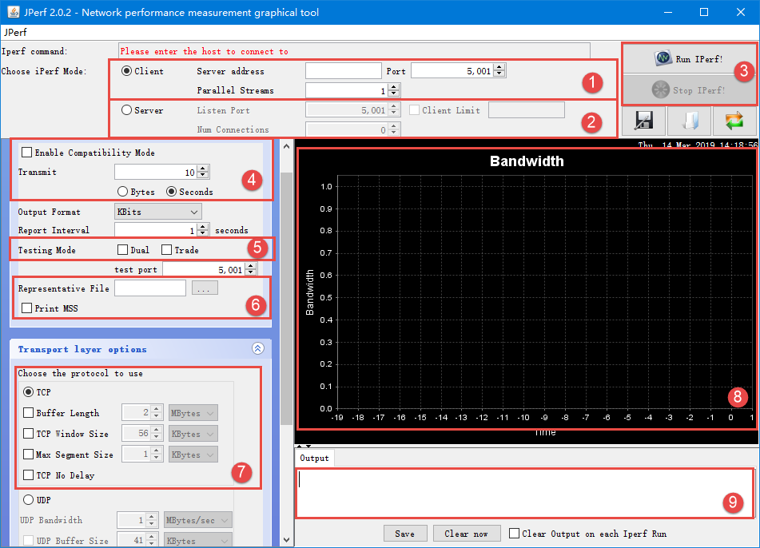
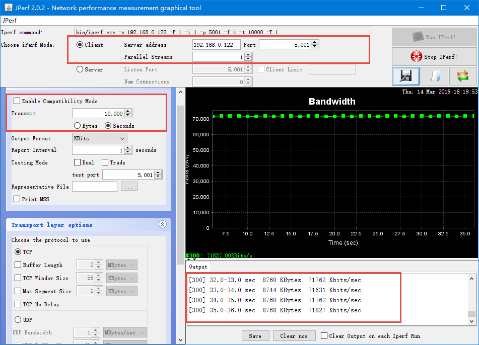
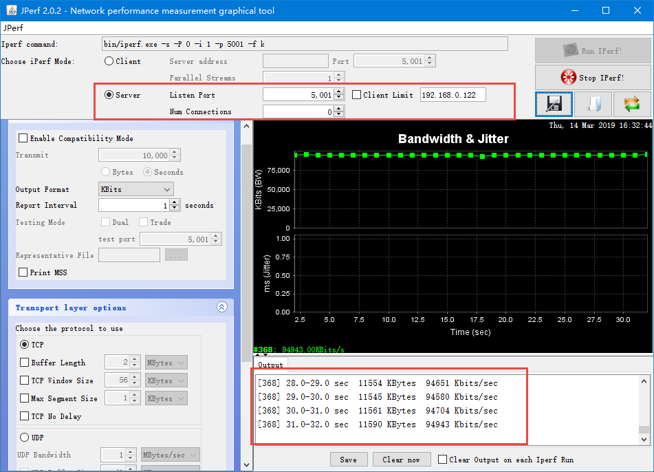
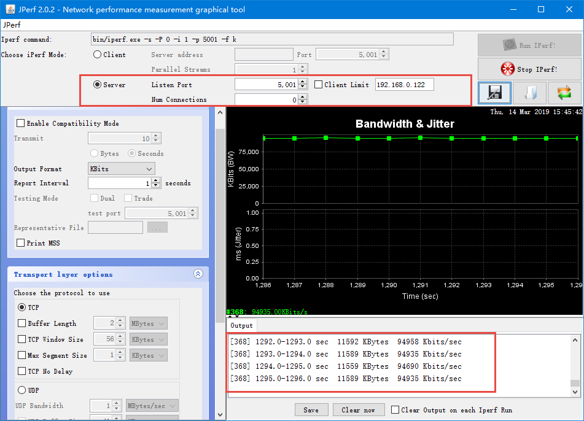

使用JPerf工具测试网速
---------------------

iPerf与JPerf
~~~~~~~~~~~~

在讲解网络测速之前，我们先来了解一下测速的工具：iPerf是一个跨平台的网络性能测试工具，它支持Win/Linux/Mac/Android/iOS等平台，iPerf可以测试TCP和UDP（我们一般不对UDP进行测速）带宽质量，iPerf可以测量最大TCP带宽，可以具有多种参数进行测试，同时iPerf还可以报告带宽，延迟抖动和数据包丢失的情况，我们可以利用iPerf的这些特性来测试一些网络设备如路由器，防火墙，交换机等的性能。

虽然iPerf很好用，但是它却是命令行格式的软件，对使用测试的人员并不友好，使用者需要记下他繁琐的命令，不过它还有一个图形界面程序叫做JPerf，使用JPerf程序能简化了复杂命令行参数的构造，而且
它还保存测试结果，并且将测试结果实时图形化出来，更加一目了然，当然，JPerf也肯定拥有iPerf的所有功能。

测试网络速度
~~~~~~~~~~~~

获取JPerf网络测速工具
^^^^^^^^^^^^^^^^^^^^^

在测速之前，我们需要得到网络测速工具，在我们的论坛上有这个工具，然后，我们直接下载即可：\ `http://www.firebbs.cn/forum.php?mod=viewthread&tid=26274&fromuid=37393 <http://www.firebbs.cn/forum.php?mod=viewthread&tid=26274&fromuid=37393>`__\ 。

下载后解压，双击jperf.bat运行，稍等一会就出现JPerf的界面，具体见 图18_1_。

图 18‑1JPerf界面

我们来讲解一下这个界面的一些内容：

图
18‑1\ **(1)**\ ：客户端设置，电脑作为客户端，连接到服务器中（即我们的开发板作为服务器），
服务器地址需要填写正确，端口号默认是5001，并发流默认是1个。

图
18‑1\ **(2)**\ ：服务器设置，电脑作为服务器，我们的开发板作为客户端，client
limit选项表示仅允许指定客户端连接，Num
Connections指定最大允许连接的数量，为0不限制。

图 18‑1\ **(3)**\ ：开始和停止JPerf的运行。

图
18‑1\ **(4)**\ ：兼容旧版本（当server端和client端版本不一样时使用），默认不勾选，Transmit设置测试模式，
我们一般指定发送的时间，以秒为单位，当然也可以指定发送的数据大小，以字节为单位。

图
18‑1\ **(5)**\ ：如果勾选Dual表示同时进行双向传输测试，如果勾选Trade表示单独进行双向传输测试，默认不勾选。

图 18‑1\ **(6)**\ ：指定需要传输的文件以及显示最大TCP报文段。

图 18‑1\ **(7)**\ ：传输层设置，我们一般用来测试TCP连接的速度，Buffer
Length选项用于设置缓冲区大小，TCP Window Size用于指定TCP窗口大小，Max
Segment Size用于设定最大MTU值，TCP No Delay用于设定TCP不延时。

图 18‑1\ **(8)**\ ：网速显示窗口，以折线图的形式显示出来。

图 18‑1\ **(9)**\ ：网速相关数据输出窗口，以文本的形式。

测试开发板接收速度（NETCONN API）
^^^^^^^^^^^^^^^^^^^^^^^^^^^^^^^^^

首先，我们肯定需在开发板上开发程序的，那么我们就单独创建一个iPerf测速线程，在开发板上运行，开发板作为客户端，不断监听客户端（JPerf上位机）的连接。

代码实现部分：我们首先拷贝一个移植好的工程，并且在工程中添加两个文件，分别为ipref.c和ipref.h，
然后在ipref.c文件下添加 代码清单18_1_ 中的代码，其实这个代码跟TCP服务器实验的代码都是差不多的，
只不过接收到数据不进行处理而已，在ipref.h文件下添加 代码清单18_2_ 中的代码。

代码清单 18‑1ipref.c文件内容

.. code-block:: c
   :name: 代码清单18_1

    /* FreeRTOS头文件 */
    #include "FreeRTOS.h"
    #include "task.h"
    #include "queue.h"
    #include "semphr.h"

    #include <stdint.h>
    #include <stdio.h>

    #include <lwip/sockets.h>

    #include "iperf.h"

    #include "lwip/opt.h"

    #include "lwip/sys.h"
    #include "lwip/api.h"

    #define IPERF_PORT          5001
    #define IPERF_BUFSZ         (4 * 1024)

    void iperf_server(void *thread_param)
    {
        struct netconn *conn, *newconn;
        err_t err;
        void* recv_data;

        recv_data = (void *)pvPortMalloc(IPERF_BUFSZ);
        if (recv_data == NULL)    {
            printf("No memory\n");
        }

        conn = netconn_new(NETCONN_TCP);
        netconn_bind(conn, IP_ADDR_ANY, 5001);

        LWIP_ERROR("tcpecho: invalid conn", (conn != NULL), return;);

        /* Tell connection to go into listening mode. */
        netconn_listen(conn);

        while (1)
        {

            /* Grab new connection. */
            err = netconn_accept(conn, &newconn);
            /*printf("accepted new connection %p\n", newconn);*/
            /* Process the new connection. */
            if (err == ERR_OK)
            {
                struct netbuf *buf;
    //      void *data;
                u16_t len;

                while ((err = netconn_recv(newconn, &buf)) == ERR_OK)
                {
                    /*printf("Recved\n");*/
                    do
                    {
                        netbuf_data(buf, &recv_data, &len);
    //             err = netconn_write(newconn, data, len, NETCONN_COPY);
                    }
                    while (netbuf_next(buf) >= 0);
                    netbuf_delete(buf);
                }
                /*printf("Got EOF, looping\n");*/
                /* Close connection and discard connection identifier. */
                netconn_close(newconn);
                netconn_delete(newconn);
            }
        }
    }

    void
    iperf_server_init(void)
    {
        sys_thread_new("iperf_server", iperf_server, NULL, 2048, 4);
    }

代码清单 18‑2ipref.h文件内容

.. code-block:: c
   :name: 代码清单18_2

    #ifndef LWIP_IPERF_H
    #define LWIP_IPERF_H

    #define TCP_SERVER_THREAD_NAME            "iperf_server"
    #define TCP_SERVER_THREAD_STACKSIZE        1024
    #define TCP_SERVER_THREAD_PRIO             4

    void iperf_server(void *thread_param);
    void iperf_server_init(void);

在main.c文件中将iperf_server_init()调用一下即可。并且配置好开发板的IP地址与端口号，我们打开JPerf测速软件，
配置好要连接的服务器IP地址与端口，测试时间设置得长一点，我们使用10000秒，然后点击开始，就得到我们需要的网速数据，
速度高达94Mbps，即11.5M字节/秒，已经是非常高的速度了，而且通过折线图，我们也能看到这速度是很稳定的，具体见 图18_2_。

图 18‑2NETCONN API接收速度

测试开发板接收速度（Socket API）
^^^^^^^^^^^^^^^^^^^^^^^^^^^^^^^^

这个实验我们只需要把上一个实验中的ipref.c文件内容替换掉就行了，具体见 代码清单18_3_。

代码清单 18‑3ipref.c文件内容

.. code-block:: c
   :name: 代码清单18_3

    /* FreeRTOS头文件 */
    #include "FreeRTOS.h"
    #include "task.h"
    #include "queue.h"
    #include "semphr.h"

    #include <stdint.h>
    #include <stdio.h>

    //#include <lwip/time.h>
    #include <lwip/sockets.h>
    //#include <lwip/select.h>
    //#include "netdb.h"
    #include "iperf.h"

    #include "lwip/opt.h"

    #include "lwip/sys.h"
    #include "lwip/api.h"

    #define IPERF_PORT          5001
    #define IPERF_BUFSZ         (4 * 1024)

    void iperf_server(void *thread_param)
    {
        uint8_t *recv_data;
        socklen_t sin_size;
        uint32_t tick1, tick2;
        int sock = -1, connected, bytes_received;
        uint64_t recvlen;
        struct sockaddr_in server_addr, client_addr;
        char speed[32] = { 0 };
        fd_set readset;
        struct timeval timeout;

        recv_data = (uint8_t *)pvPortMalloc(IPERF_BUFSZ);
        if (recv_data == NULL)
        {
            printf("No memory\n");
            goto __exit;
        }

        sock = socket(AF_INET, SOCK_STREAM, 0);
        if (sock < 0)
        {
            printf("Socket error\n");
            goto __exit;
        }

        server_addr.sin_family = AF_INET;
        server_addr.sin_addr.s_addr = INADDR_ANY;
        server_addr.sin_port = htons(IPERF_PORT);
        memset(&(server_addr.sin_zero), 0x0, sizeof(server_addr.sin_zero));

    if (bind(sock, (struct sockaddr *)&server_addr, sizeof(struct sockaddr)) == -1)
        {
            printf("Unable to bind\n");
            goto __exit;
        }

        if (listen(sock, 5) == -1)
        {
            printf("Listen error\n");
            goto __exit;
        }

        timeout.tv_sec = 3;
        timeout.tv_usec = 0;

        printf("iperf_server\n");
        while (1)
        {
            FD_ZERO(&readset);
            FD_SET(sock, &readset);

            if (select(sock + 1, &readset, NULL, NULL, &timeout) == 0)
                continue;

            printf("iperf_server\n");

            sin_size = sizeof(struct sockaddr_in);

            connected = accept(sock, (struct sockaddr *)&client_addr, &sin_size);

            printf("new client connected from (%s, %d)\n",
                inet_ntoa(client_addr.sin_addr), ntohs(client_addr.sin_port));

            {
                int flag = 1;

                setsockopt(connected,
                        IPPROTO_TCP,     /* set option at TCP level */
                        TCP_NODELAY,     /* name of option */
                        (void *) &flag,  /* the cast is historical cruft */
                        sizeof(int));    /* length of option value */
            }

            recvlen = 0;
            tick1 = xTaskGetTickCount();
            while (1)
            {
                bytes_received = recv(connected, recv_data, IPERF_BUFSZ, 0);
                if (bytes_received <= 0) break;

                recvlen += bytes_received;

                tick2 = xTaskGetTickCount();
                if (tick2 - tick1 >= configTICK_RATE_HZ * 5)
                {
                    float f;
                    f=(float)(recvlen * configTICK_RATE_HZ/125/(tick2-tick1));
                    f /= 1000.0f;
    //                snprintf(speed, sizeof(speed), "%.4f Mbps!\n", f);
    //                printf("%s", speed);
                    tick1 = tick2;
                    recvlen = 0;
                }
            }

            if (connected >= 0) closesocket(connected);
            connected = -1;
        }

    __exit:
        if (sock >= 0) closesocket(sock);
        if (recv_data) free(recv_data);
    }

    void
    iperf_server_init(void)
    {
        sys_thread_new("iperf_server", iperf_server, NULL, 2048, 4);
    }

然后得到数据，对比数据，我们发现，NETCONN API的效率是比Socket
API的效率更高，这是因为Socket
API需要对数据进行拷贝，才能传递到上层应用中，不过71Mbps（8.7M字节/秒）的速度已经是算很高了，具体见
图18_3_。

图 18‑3Socket API接收速度

测试开发板发送速度（NETCONN API）
^^^^^^^^^^^^^^^^^^^^^^^^^^^^^^^^^

测完两种API的接收速度，那么就来测试一下开发板的发送速度，发送速度其实是更加重要的，比如开发板采集一些图像，想要发送出去，如果发送速度跟不上的话，传输出去的图像就会卡帧，而发送速度足够快，就会很流畅，我们测试发送速度将开发板作为客户端，JPerf软件则作为服务器，我们开发板向服务器发送数据。首先我们也是把移植好的工程拿过来，并且添加两个文件，分别为iperf_client.c和iperf_client.h，然后在对应的文件中添加所示的代码

代码清单 18‑4iperf_client.c文件内容

.. code-block:: c
   :name: 代码清单18_4

    #include "iperf_client.h"

    #include "lwip/opt.h"

    #include "lwip/sys.h"
    #include "lwip/api.h"

    #define IPERF_PORT          5001
    #define IPERF_BUFSZ         (4 * 1024)

    static void iperf_client(void *thread_param)
    {
        struct netconn *conn;

        int i;

        int ret;

        uint8_t *send_buf;

        uint64_t sentlen;

        u32_t tick1, tick2;
        ip4_addr_t ipaddr;

        send_buf = (uint8_t *) pvPortMalloc(IPERF_BUFSZ);
        if (!send_buf) return ;

        for (i = 0; i < IPERF_BUFSZ; i ++)
            send_buf[i] = i & 0xff;

        while (1)
        {
            conn = netconn_new(NETCONN_TCP);
            if (conn == NULL)
            {
                printf("create conn failed!\n");
                vTaskDelay(10);
                continue;
            }

            IP4_ADDR(&ipaddr,192,168,0,181);

            ret = netconn_connect(conn,&ipaddr,5001);
            if (ret == -1)
            {
                printf("Connect failed!\n");
                netconn_close(conn);
                vTaskDelay(10);
                continue;
            }

            printf("Connect to iperf server successful!\n");

            tick1 = sys_now();
            while (1)
            {
                tick2 = sys_now();

                if (tick2 - tick1 >= configTICK_RATE_HZ * 5)
                {
                    float f;
                    f = (float)(sentlen*configTICK_RATE_HZ/125/(tick2 - tick1));
                    f /= 1000.0f;
                    printf("send speed = %.4f Mbps!\n", f);

                    tick1 = tick2;
                    sentlen = 0;
                }
                ret = netconn_write(conn,send_buf,IPERF_BUFSZ,0);
                if (ret == ERR_OK)
                {
                    sentlen += IPERF_BUFSZ;
                }

            }
    //    netconn_close(conn);
    //    netconn_delete(conn);
        }
    }

    void
    iperf_client_init(void)
    {
        sys_thread_new("iperf_client", iperf_client, NULL, 2048, 4);
    }

代码清单 18‑5iperf_client.h文件内容

.. code-block:: c
   :name: 代码清单18_5

    #ifndef IPERF_CLIENT_H
    #define IPERF_CLIENT_H

    void iperf_client_init(void);

    #endif /* IPERF_CLIENT_H */

在main.c文件中调用iperf_client_init()函数即可，然后配置JPerf软件成为客户端，让开发板进行连接，
开发板连接的客户端IP地址与端口号根据实际情况去配置即可，具体见 图18_4_，从实验现象可以看出，
发送的速度还是很快的（94Mbps，即11.5M字节/秒）而且还很稳定。

图 18‑4NETCONN API发送速度

测试开发板发送速度（Socket API）
^^^^^^^^^^^^^^^^^^^^^^^^^^^^^^^^

本实验基于是一个实验，我们将测试开发板发送速度（NETCONN
API）的工程拿过来，将iperf_client.c的内容替换代码清单
18‑6所示的代码即可。

代码清单 18‑6iperf_client.c文件内容

.. code-block:: c
   :name: 代码清单18_6

    #include "iperf_client.h"

    #include "lwip/opt.h"

    #include "lwip/sys.h"
    #include "lwip/api.h"
    #include <lwip/sockets.h>

    #define PORT              5001
    #define IP_ADDR        "192.168.0.181"

    #define IPERF_BUFSZ         (4 * 1024)

    static void iperf_client(void *thread_param)
    {
        int sock = -1,i;
        struct sockaddr_in client_addr;
        uint8_t* send_buf;
        u32_t tick1, tick2;
        uint64_t sentlen;

        send_buf = (uint8_t *) pvPortMalloc(IPERF_BUFSZ);
        if (!send_buf)
            return ;

        for (i = 0; i < IPERF_BUFSZ; i ++)
            send_buf[i] = i & 0xff;

        while (1)
        {
            sock = socket(AF_INET, SOCK_STREAM, 0);
            if (sock < 0)
            {
                printf("Socket error\n");
                vTaskDelay(10);
                continue;
            }

            client_addr.sin_family = AF_INET;
            client_addr.sin_port = htons(PORT);
            client_addr.sin_addr.s_addr = inet_addr(IP_ADDR);
            memset(&(client_addr.sin_zero), 0, sizeof(client_addr.sin_zero));

            if (connect(sock,
                        (struct sockaddr *)&client_addr,
                        sizeof(struct sockaddr)) == -1)
            {
                printf("Connect failed!\n");
                closesocket(sock);
                vTaskDelay(10);
                continue;
            }

            printf("Connect to iperf server successful!\n");
            tick1 = sys_now();
            while (1)
            {
                tick2 = sys_now();
                if (tick2 - tick1 >= configTICK_RATE_HZ * 5)
                {
                    float f;
                    f = (float)(sentlen*configTICK_RATE_HZ/125/(tick2 - tick1));
                    f /= 1000.0f;
                    printf("send speed = %.4f Mbps!\n", f);

                    tick1 = tick2;
                    sentlen = 0;
                }

                if (write(sock,send_buf,IPERF_BUFSZ) < 0)
                    break;
                else
                {
                    sentlen += IPERF_BUFSZ;
                }
            }
            closesocket(sock);
        }

    }

    void
    iperf_client_init(void)
    {
        sys_thread_new("iperf_client", iperf_client, NULL, 2048, 8);
    }

测试结果具体见 图18_5_，从两个实验的对比可以看出，基于Socket
API的发送速度基本相差无几。

图 18‑5 Socket API发送速度

提高LwIP网络传输的速度
~~~~~~~~~~~~~~~~~~~~~~

如果按照LwIP默认的配置，是远不可能达到我们实验所显示的速度的，因为还没优化，那肯定也是不稳定的，下面我们来看看优化的参数，
首先，网速必然受限于硬件，只有硬件是很好的，那么软件才能优化的更好，网卡肯定要选择好一点的网卡，
然后在工程中的stm32f4xx_hal_config.h文件中配置以太网发送和接收的缓冲区大小，默认是4，我们可以稍微改大一点，
具体见 代码清单18_7_。

代码清单 18‑7stm32f4xx_hal_config.h文件配置参数

.. code-block:: c
   :name: 代码清单18_7

    #define ETH_RXBUFNB   ((uint32_t)8U)       /* 接收缓冲区 */
    #define ETH_TXBUFNB  ((uint32_t)8U)       /* 发送缓冲区  */

此外，还需在lwipopts.h文件中配置LwIP的参数，具体见 代码清单18_8_，首先，我们对LwIP管理的内存肯定要分配的大一些，
而对于发送数据是存储在ROM或者静态存储区的时候，还要将MEMP_NUM_PBUF宏定义改的大一点，
当然发送缓冲区大小和发送缓冲区队列长度决定了发送速度的大小，根据不同需求进行配置，并且需要不断调试，
而对于接收数据的配置，应该配置TCP缓冲队列中的报文段数量与TCP接收窗口大小，特别是接收窗口的大小，
这直接可以影响数据的接收速度。

代码清单 18‑8lwipopts.h文件配置参数

.. code-block:: c
   :name: 代码清单18_8

    //内存堆heap大小
    #define MEM_SIZE                (25*1024)

    /* memp结构的pbuf数量,如果应用从ROM或者静态存储区发送大量数据时
    这个值应该设置大一点 */
    #define MEMP_NUM_PBUF           25

    /* 最多同时在TCP缓冲队列中的报文段数量 */
    #define MEMP_NUM_TCP_SEG        150

    /* 内存池大小 */
    #define PBUF_POOL_SIZE          65

    /* 每个pbuf内存池大小 */
    #define PBUF_POOL_BUFSIZE       \

    LWIP_MEM_ALIGN_SIZE(TCP_MSS+40+PBUF_LINK_ENCAPSULATION_HLEN+PBUF_LINK_HLEN)

    /* 最大TCP报文段，TCP_MSS = (MTU - IP报头大小 - TCP报头大小 */
    #define TCP_MSS                 (1500 - 40)

    /* TCP发送缓冲区大小（字节） */
    #define TCP_SND_BUF             (11*TCP_MSS)

    /*  TCP发送缓冲区队列的最大长度 */
    #define TCP_SND_QUEUELEN        (8* TCP_SND_BUF/TCP_MSS)

    /* TCP接收窗口大小 */
    #define TCP_WND                 (11*TCP_MSS)

当然，除此之外，想要整个LwIP能高速平稳运行，只配置这些是不够的，比如我们应该使用中断的方式接收数据，这就省去了CPU查询数据，而且，我们应该将内核邮箱的容量增大，这样子在接收到数据之后，投递给内核就不会因为无法投递而阻塞，同时内核线程的优先级应该设置得更高一点，这样子就能及时去处理这些数据，当然，我们也可以独立使用一个新的发送线程，这样子内核就无需调用底层网卡函数，它可以专心处理数据，发送数据的事情就交由发送线程去处理，同时，在处理数据的时候，不使用串口打印信息，因为串口是一个很慢的外设，当然啦，关于提高LwIP网络传输的速度，还有很多东西要优化的，这也跟使用环境有关系，不能一概而论，只是给出一些方向，具体怎么实现，还需要大家亲身实践去调试。
