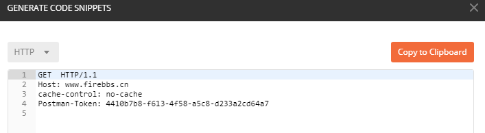
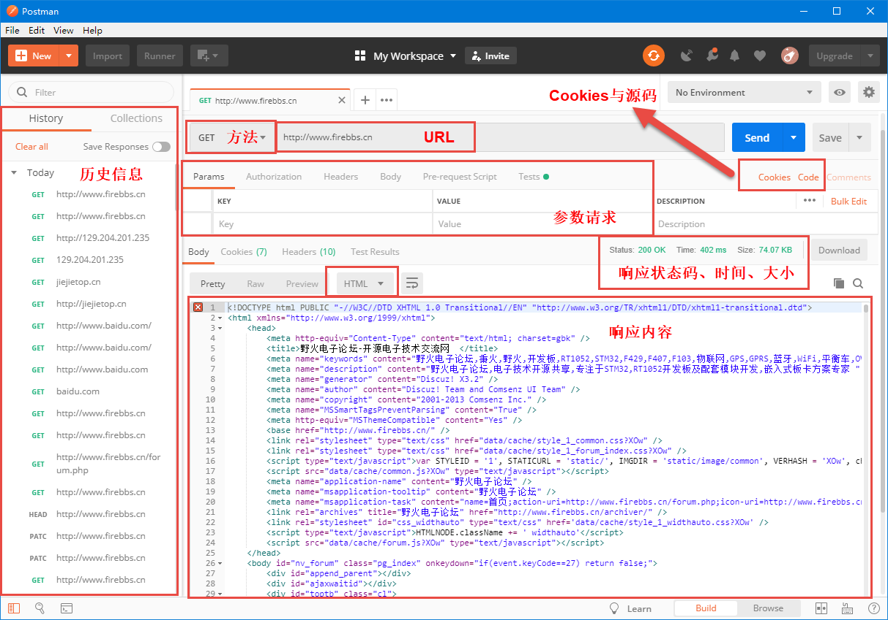
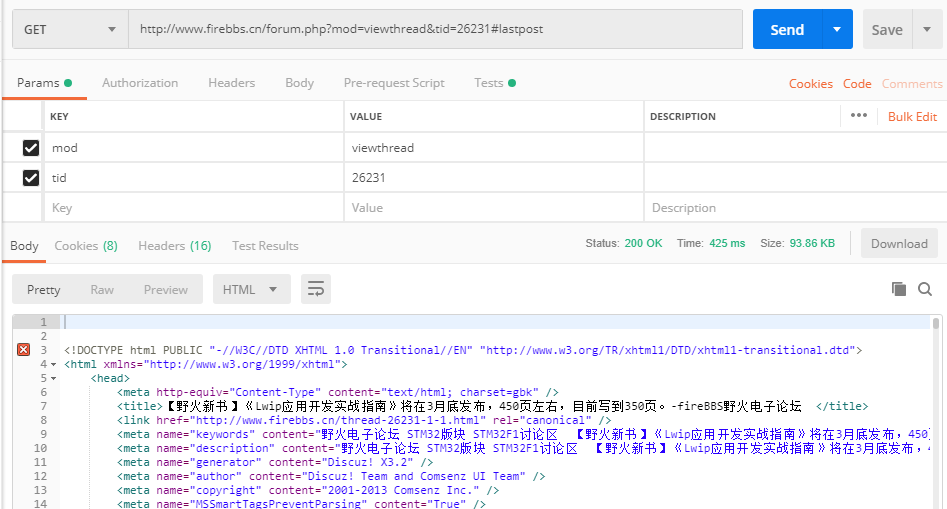
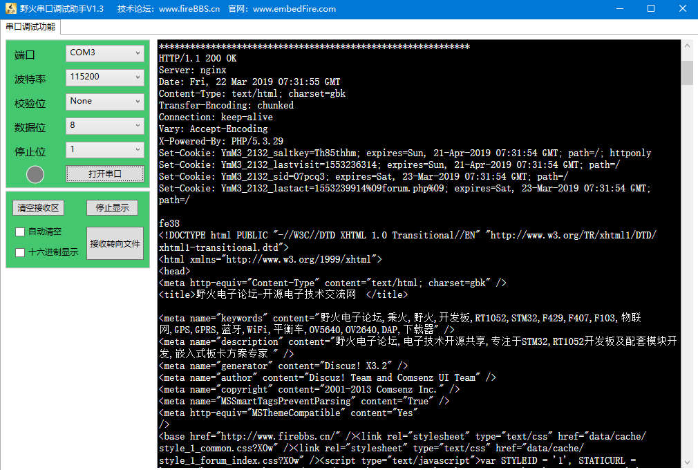

HTTP协议
--------

什么是HTTP协议?
~~~~~~~~~~~~~~~

日常我们使用网络用得最多的无疑是在Web浏览器（下文统一使用浏览器）上查找资料、看视频、看书、看新闻等等，而在浏览器中只需要输入一些搜索就可以得到想要的信息，这归根于搜索引擎的好处，但是实际上每个网页其实由多个资源组成。我们的浏览器就是一个HTTP客户端，通过HTTP协议访问服务器，得到服务器中的HTML页面、文本文件、图片、音频等资源，并且将这些资源搬运到浏览器（客户端）显示给我们。

HTTP协议是Hyper Text Transfer
Protocol（超文本传输协议）的缩写，是用于从万维网（WWW:World Wide Web
）服务器传输超文本到本地浏览器的传输协议，它是基于TCP/IP协议通信的，因此它也是基于<客户端-服务器>模型运作的，是一个应用层协议，可以用它来传输服务器的各种资源，如文本、图片、音频等。

HTTP协议的特点：

1. 简单：当客户端向服务器请求服务时，只需传送请求方法和路径即可获取服务器的资源，
   请求方法常用的有GET、HEAD、POST等，每种方法规定了客户端与服务器通信的类型不同。

2. 快捷：由于HTTP协议简单，使得HTTP服务器的程序规模小，因而通信速度很快。

3. 灵活：HTTP允许传输任意类型的数据对象，传输的类型由Content-Type加以标记。

4. 无连接：无连接的含义是限制每次连接只处理一个请求，服务器处理完客户的请求，并收到客户的应答后，即断开连接，
   简单来说就是每进行一次HTTP通信，都要断开一次TCP连接，可随着HTTP的普及，文档中包含大量图片的情况多了起来，每次请求完都要断开TCP连接，无疑增加通信量的开销，为了解决TCP的连接问题，HTTP1.1提出了持久连接的方法，即任意一端只要没有明确提出断开连接，则保持TCP连接状态，这样子就就减少了TCP连接的重复建立和断开所造成的额外开销，减轻了服务端的负载。注意，在HTTP1.1版本之后才出现持久连接的方法。

5. 无状态：HTTP协议是无状态协议，无状态是指协议对于事务处理没有记忆能力，即HTTP协议无法根据之前的状态进行本次的请求处理，
   这就意味着如果后续处理需要前面的信息，它必须重传数据，这样的情况可能导致HTTP协议传输的数据量增大，当然，凡事都有两面性，在另一方面，在服务器不需要先前信息时它的应答就较快，可以减少服务器的资源消耗，其实这种无状态对于用户来说也是不友好的，因此为了解决无状态的问题，引入了Cookie技术，这是一种可以让服务器知道用户上一次做了什么操作，并且记录下来，它是存储在客户端之中的，比如我们在淘宝上买东西，我们选择了几个商品，但是到了结账会跳转到另一个页面，此时如果服务器不知道我们选择了哪些商品，那怎么能结账成功呢？所以Cookie就是用来绕开HTTP的无状态性的“手段”之一，服务器可以设置或读取Cookies中包含信息，让服务器知道我们选择了什么商品，借此维护用户跟服务器会话中的状态，当然，Cookie会被加密存储在客户端中，直到过期或者手动清除。

URL与资源
~~~~~~~~~

我们可以把整个英特网看做是一个巨大的图书馆，里面的资源应有尽有，并且是对我们是开放的，我们想要找一本书，那么我们就需要直到他存放在哪里，然后去找到它。

网络中的资源也是应有尽有，那么怎么样才能在网络的海洋中找到我们想要的资源呢？因此URI（Uniform
Resource
Identifiers）就被设计出来，用于统一管理资源，就像我们去图书馆找书一样，我们必须通过图书馆的系统，找到书所在的位置，而不是让我们自己一本一本书去找。

URL全称是Uniform Resource
Locator，中文叫统一资源定位符，是互联网上用来标识某一处资源的绝对地址，使用它我们就必然能找到资源，除非资源已经被转移了。URI是一个通用的概念，由两个子集组成，分别是URL和URN，URL是通过资源的位置来标识资源，而URN更高级一点，只需通过资源名字即可识别资源，与他们所处的位置是无关的，目前暂时还未推广URN。

大部分URL都会遵循URL的语法，一个URL的组成有多个不同的组件，一个URL的通用格式如下：

.. code-block:: c

    <scheme>://<user>:<password>@<host>:<port>/<path>;<params>?<query>#<frag>

当然，绝大部分的URL是不会包含所有组件的内容的，关于URL组件具体见表格
23‑1。

表格 19‑1URL组件

+--------------+--------------------------------------------------------------------+
|     组件     |                                描述                                |
+==============+====================================================================+
| 方案scheme   | 指定访问服务器获取资源时使用哪种协议，有HTTP、HTTPS、FT            |
|              | P、SMTP等协议。                                                    |
+--------------+--------------------------------------------------------------------+
| 用户user     | 某些方案访问资源时候需要指定用户名，才有权限获取资源。             |
+--------------+--------------------------------------------------------------------+
| 密码password | 用户名后面可能需要密码进行验证，用户名与密码直接使用“:”冒号分隔    |
|              | 连接。                                                             |
+--------------+--------------------------------------------------------------------+
| 主机host     | 资源宿主服务器的主机名或者IP地址（点分十进制）。                   |
+--------------+--------------------------------------------------------------------+
| 端口port     | 资源宿主服务器正在监听的端口号，很多方案都有默认的端口号，而无需我 |
|              | 们自己填写，比如HTTP默认使用80端口，HTTPS默认使用443               |
|              | 端口。端口不是一个URL必须的部分，如果省略端口部分，将采用默认端    |
|              | 口。                                                               |
+--------------+--------------------------------------------------------------------+
| 路径path     | 服务器本地资源的路径，类似于电脑中的文件路径一样，使用“/”将路径    |
|              | 与端口隔离。从域名后的第一个“/”开始到最后一个“/”为止，虚拟目       |
|              | 录也不是一个URL必须的部分，在路径之后是需要一个文件名，这就是U     |
|              | RL指定的资源。文件名部分也不是一个URL必须的部分，如果省略该部      |
|              | 分，则使用默认的文件名                                             |
+--------------+--------------------------------------------------------------------+
| 参数params   | 某些方案会使用这个组件来输入参数，可以拥有多个参数，使用“;”符号    |
|              | 与路径分隔开。                                                     |
+--------------+--------------------------------------------------------------------+
| 查询query    | 某些方案会使用这个组件传递参数以激活应用程序，查询组件的内容没有通 |
|              | 用的格式，用“?”字符与其他组件分隔开                                |
+--------------+--------------------------------------------------------------------+
| 片段frag     | 一小片或者一部分资源的名字，引用对象时，不会将片段组件内容传输给服 |
|              | 务器，这个字段是在客户端内部使用的，通过“#”字符与其他组件分隔开    |
|              | 。                                                                 |
+--------------+--------------------------------------------------------------------+

比如像我们论坛的网址：http://www.firebbs.cn/forum.php，它就是一个URL，这是最简单的一个URL格式，通过它我们能访问论坛的首页资源，其中http就是方案，指定HTTP协议进行连接
，域名就是\ `www.firebbs.cn，HTTP <http://www.firebbs.cn，HTTP>`__\ 协议默认端口是80，在这里就无需指定端口号，路径就是forum.php，其实这个是一个脚本文件，当客户端连接到服务器后，服务器会自动运行这个脚本文件，这样子就访问到我们论坛上的资源了。

HTTP报文
~~~~~~~~

HTTP报文是由3个部分组成，分别是：对报文进行描述的“起始行”，包含属性的“首部”，以及可选的“数据主体”，对于请求报文与应答报文，
只有“起始行”的格式是不一样的，具体见 代码清单19_1_ 与 代码清单19_2_。

代码清单 19‑1HTTP请求报文

.. code-block:: c
   :name: 代码清单19_1

    <method> <request-URL> <version>		//起始行
    <headers>					//首部

    <entity-body>					  //数据主体

代码清单 19‑2HTTP应答报文

.. code-block:: c
   :name: 代码清单19_2

    <version> <status> <reason-phrase>		//起始行
    <headers>					//首部

    <entity-body>					    //数据主体

起始行和首部就是由行分隔的 ASCII
文本组成，每行都以由两个字符组成的行终止序列作为结束，其中包括一个回车符（ASCII
码 13）和一个换行符（ASCII 码 10）， 这个行终止序列可以写做 CRLF。

下面就对这两种HTTP报文的各个部分简单描述一下：

-  方法（method）：HTTP请求报文的起始行以方法作为开始，方法用来告知服务器要做些什么，常见的方法有GET、POST、HEAD等，比如“GET
   /forum.php HTTP/1.1” 使用的就是GET方法。

-  请求URL（request-URL）：指定了所请求的资源。

-  版本（version）：指定报文所使用的HTTP协议版本，其中<major>指定了主要版本号，
   <minor>指定了次要版本号，它们都是整数，其格式如下：

1 HTTP/<major>.<minor>

-  状态码（status）：这是在HTTP应答报文中使用的，状态码是在每条响应报文的起始行中返回的一个数字码，
   描述了请求过程中所发送的情况，比如成功、失败等，不同的状态码有不同的含义，具体见表格19‑2。

表格 19‑2状态码说明

+-----------+----------------+------------+
| 整体范围  | 已定义使用范围 | 描述       |
+===========+================+============+
| 100 ~ 199 | 100 ~ 101      | 信息提示   |
+-----------+----------------+------------+
| 200~299   | 200 ~ 206      | 成功       |
+-----------+----------------+------------+
| 300 ~ 399 | 300 ~ 305      | 重定向     |
+-----------+----------------+------------+
| 400 ~ 499 | 400 ~ 415      | 客户端错误 |
+-----------+----------------+------------+
| 500 ~ 599 | 500 ~ 505      | 服务器错误 |
+-----------+----------------+------------+

-  原因短语（reason-phrase）：这其实是给我们看的原因短语，因为数字是不够直观，它只是状态码的一个文本形式表达而已。

-  首部（header）：HTTP报文可以有0个、1个或者多个首部，HTTP
   首部字段向请求和响应报文中添加了一些附加信息，从本质上来说，它们是一个<名字：值>对，每个首部都包含一个名字，紧跟着一个冒号“:”，然后是一个可选的空格，接着是一个值，最后以CRLF结束，比如“Host:
   `www.firebbs.cn <http://www.firebbs.cn>`__\ ”就是一个首部。

-  数据主体（entity-body）：这部分包含一个由任意数据组成的数据块，其实这与我们前面所讲的报文数据区域是一样的，用于携带数据，HTTP
   报文可以承载很多类型的数字数据：图片、视频、音频、HTML
   文档、软件应用程 序等。

使用Postman获取论坛数据
~~~~~~~~~~~~~~~~~~~~~~~

既然了解了HTTP协议与HTTP报文的相关知识，我们就来使用Postman软件了解一下HTTP协议的传输过程，首先去我们的论坛上下载Postman软件：\ `http://www.firebbs.cn/forum.php?mod=viewthread&tid=26274&fromuid=37393 <http://www.firebbs.cn/forum.php?mod=viewthread&tid=26274&fromuid=37393>`__\ ，然后安装后打开软件，就可以使用软件进行测试HTTP协议，可以很直观看到发送的HTTP报文是什么，也能很直观看到响应的数据。

首先我们测试一下获取我们论坛的资源信息，在URL中输入“http://www.firebbs.cn”，方法选择“GET”方法，然后点击Send，就可以看到我们的论坛就返回了大量的数据，查看状态码、时间还有大小就立马知道这次HTTP请求的相关信息，而且在响应内容中，就是一个HTML文件内容，如果将这个内容保存下来，并且命名为xxxx.HTML文件的话，就可以直接在浏览器中显示我们的论坛首页了，因为这次的请求就是获取论坛首页的数据，参数一栏中并无内容，然后我们点击源码Code，可以看到请求的HTTP报文内容，具体见 图19_1_，整个Postman界面说明具体见 图19_2_。

图 19‑1HTTP请求报文

图 19‑2Postman界面

我们再访问URL：\ `http://www.firebbs.cn/forum.php?mod=viewthread&tid=26231#lastpost <http://www.firebbs.cn/forum.php?mod=viewthread&tid=26231#lastpost>`__\ ，从这个URL中很明显可以可看到路径与参数等，那么这个请求又是怎么样的呢，具体见
图19_3_，很明显这个Postman软件也给我们写入了对应的参数，而不用我们自己设置，我们再点开Code可以看到HTTP请求包的源码，具体见
图19_4_。除此之外，我们还可以点击Preview预览返回的数据，其实就是跟我们直接打开网页一样的，不过会产生中文乱码。

图 19‑3带参数的URL

图 19‑4带参数的HTTP请求

我们还可以继续测试POST方法与其他方法，在这里我们就不再讲解太多。

使用开发板获取论坛数据
~~~~~~~~~~~~~~~~~~~~~~

起始很多初学者，并不懂单片机是怎么访问外网的，可能就是没有一个概念，如果学到这一章的时候还不懂的话，建议回头再看看第11.2
章的内容，然后在回来这里学习使用开发板获取外网的数据。

首先明确一下整个HTTP协议的流程：

1. 创建一个连接结构。

2. 连接到域名的服务器中（一般建议打开DNS），端口号为方案对应的默认端口号。

3. 发送HTTP请求报文。

4. 等待服务器端的应答，并且接收数据。

此处有一个需要注意的地方，那就是网络中的数据量是非常大的，这就需要在接收数据的时候使用足够大的缓冲区，当然也可以只接收一部分数据，或者通过FIFO进行接收，我们本次实验是使用外部SDRAM进行存储数据，这样子就可以接收很大的数据量，因为SDRAM有8M的空间。

首先我们拿到一个移植好的工程，然后创建一个client.c文件，加入 代码清单19_3_ 所示代码，
然后在main.c文件中调用client_init()函数即可。在这里要注意的是HTTP请求报文的处理，
需要按照HTTP报文格式编写，如果在获取数据的时候出现错误或者乱码，那很可能就是HTTP请求报文编写错误。

代码清单 19‑3client.c文件内容

.. code-block:: c
   :name: 代码清单19_3

    #include "client.h"

    #include "lwip/opt.h"

    #include "lwip/sys.h"
    #include "lwip/api.h"

    #include <lwip/sockets.h>
    #include "./sdram/bsp_sdram.h"

    #define PORT            80
    #define IP_ADDR        "114.215.151.106"

    #ifdef    LWIP_DNS
    #define   HOST_NAME       "www.firebbs.cn"     //
    #else
    #define   HOST_NAME       "114.215.151.106"     //
    #endif

    uint32_t *pSDRAM= (uint32_t*)SDRAM_BANK_ADDR;

    uint8_t get_buf[]= "GET /forum.php HTTP/1.1\r\n \
                Host: www.firebbs.cn \r\n\r\n\r\n\r\n";

    static void client(void *thread_param)
    {
        int sock = -1,rece;
        struct sockaddr_in client_addr;

        uint8_t *pbufdata = pvPortMalloc(5000);

        char* host_ip;

    #ifdef  LWIP_DNS
        ip4_addr_t dns_ip;
        netconn_gethostbyname(HOST_NAME, &dns_ip);
        host_ip = ip_ntoa(&dns_ip);
        PRINT_DEBUG("host name : %s , host_ip : %s\n",HOST_NAME,host_ip);
    #else
        host_ip = HOST_NAME;
    #endif

        while (1)
        {
            sock = socket(AF_INET, SOCK_STREAM, 0);
            if (sock < 0)
            {
                printf("Socket error\n");
                vTaskDelay(10);
                continue;
            }

            client_addr.sin_family = AF_INET;
            client_addr.sin_port = htons(PORT);
            client_addr.sin_addr.s_addr = inet_addr(host_ip);
            memset(&(client_addr.sin_zero), 0, sizeof(client_addr.sin_zero));

            if (connect(sock,
                        (struct sockaddr *)&client_addr,
                        sizeof(struct sockaddr)) == -1)
            {
                printf("Connect failed!\n");
                closesocket(sock);
                vTaskDelay(10);
                continue;
            }

            printf("Connect to server successful!\n");
            memset(pSDRAM,0,400000);
            printf("\n***************************************************\n");
            write(sock,get_buf,sizeof(get_buf));
            while (1)
            {
    //      if(write(sock,get_buf,sizeof(get_buf)) < 0)
    //        break;

                rece = recv(sock, (uint8_t*)pSDRAM, 400000, 0);
                if (rece <= 0)
                    break;

    //      printf("rece = %d\n",rece);
                printf("%s\n",(uint8_t*)pSDRAM);
    //      pSDRAM = (uint32_t*)(pSDRAM + rece);

            }
    //    printf("%s\n",(uint8_t*)pSDRAM);
            printf("\n**************************************************\n");

            memset(pSDRAM,0,400000);
            closesocket(sock);
            vTaskDelay(10000);
        }

    }

    void
    client_init(void)
    {
        sys_thread_new("client", client, NULL, 2048, 4);
    }

通过这个实验，我们就能获取到论坛的数据，因为论坛的数据量太大，因此获取的数据并无实际意义，仅做HTTP协议的使用方法而已，
当然，我们可以通过HTTP协议获取其他类型的数据，这就需要自己去处理了，就不过多赘述，
实验现象具体见 图19_5_。

图 19‑5实验现象
