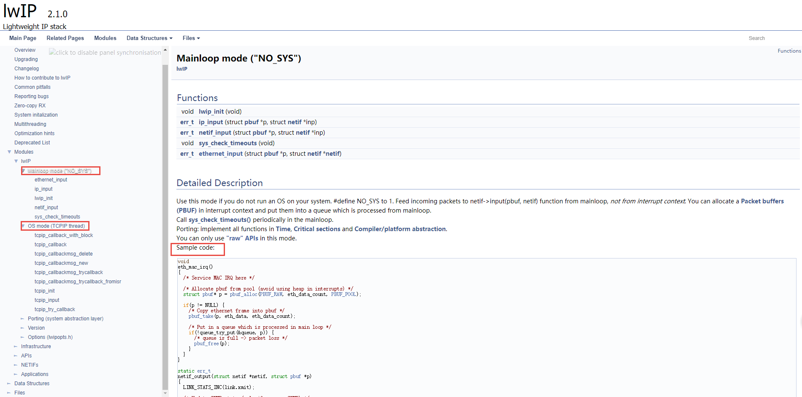

LwIP简介
--------

本书使用最新的LwIP
2.1.2版本，官方下载链接：\ `http://savannah.nongnu.org/projects/lwip/ <http://savannah.nongnu.org/projects/lwip/>`__\ 。

LwIP的优缺点
~~~~~~~~~~~~

本书以LwIP 2.
1.2为主要对象进行讲解，后续中出现的LwIP如果没有特殊声明，均指2.1.2版本。此时的LwIP
2.
1.2为最新版本，可能当这本书写完的时候，LwIP又被更新了，对于学习而言，大家其实不必纠结于是否必须用最新的版本，因为2.1.2版本和它后面的版本在移植和应用方法上并没有什么区别。

LwIP全名：Light weight
IP，意思是轻量化的TCP/IP协议，是瑞典计算机科学院(SICS)的Adam Dunkels
开发的一个小型开源的TCP/IP协议栈。LwIP的设计初衷是：用少量的资源消耗实现一个较为完整的TCP/IP协议栈，其中“完整”主要指的是TCP协议的完整性，实现的重点是在保持TCP协议主要功能的基础上减少对RAM
的占用。此外LwIP既可以移植到操作系统上运行，也可以在无操作系统的情况下独立运行。

LwIP具有主要特性：

1.  支持ARP协议（以太网地址解析协议）。

2.  支持ICMP协议（控制报文协议），用于网络的调试与维护。

3.  支持IGMP协议（互联网组管理协议），可以实现多播数据的接收。

4.  支持UDP协议(用户数据报协议)。

5.  支持TCP协议(传输控制协议)，包括阻塞控制、RTT
    估算、快速恢复和快速转发。

6.  支持PPP协议（点对点通信协议），支持PPPoE。

7.  支持DNS（域名解析）。

8.  支持DHCP协议，动态分配IP地址。

9.  支持IP协议，包括IPv4、IPv6协议，支持IP分片与重装功能，多网络接口下的数据包转发。

10. 支持SNMP协议（简单网络管理协议）。

11. 支持AUTOIP，自动IP地址配置。

12. 提供专门的内部回调接口(Raw API)，用于提高应用程序性能。

13. 提供可选择的Socket API、NETCONN API (在多线程情况下使用) 。

LwIP在嵌入式中使用有以下优点：

1. 资源开销低，即轻量化。LwIP内核有自己的内存管理策略和数据包管理策略，
   使得内核处理数据包的效率很高。另外，LwIP高度可剪裁，一切不需要的功能都可以通过宏编译选项去掉。
   LwIP的流畅运行需要40KB的代码ROM和几十KB的RAM，这让它非常适合用在内存资源受限的嵌入式设备中。

2. 支持的协议较为完整。几乎支持TCP/IP中所有常见的协议，这在嵌入式设备中早已够用。

3. 实现了一些常见的应用程序：DHCP客户端、DNS客户端、HTTP服务器、MQTT客户端、TFTP服务器、SNTP客户端等等。

4. 同时提供了三种编程接口：RAW API、NETCONN API（注：NETCONN
   API即为Sequential API，为了统一，下文均采用NETCONN API）和Socket
   API。这三种API的执行效率、易用性、可移植性以及时空间的开销各不相同，用户可以根据实际需要，平衡利弊，选择合适的API进行网络应用程序的开发。

5. 高度可移植。其源代码全部用C实现，用户可以很方便地实现跨处理器、跨编译器的移植。
   另外，它对内核中会使用到操作系统功能的地方进行了抽象，使用了一套自定义的API，
   用户可以通过自己实现这些API，从而实现跨操作系统的移植工作。

6. 开源、免费，用户可以不用承担任何商业风险地使用它。

7. 相比于嵌入式领域其它的TCP/IP协议栈，比如uC-TCP/IP、FreeRTOS-TCP等，
   LwIP的发展历史要更悠久一些，得到了更多的验证和测试。LwIP被广泛用在嵌入式网络设备中，
   国内一些物联网公司推出的物联网操作系统，其TCP/IP核心就是LwIP；物联网知名的WiFi模块ESP8266，其TCP/IP固件，使用的就是LwIP。

LwIP尽管有如此多的优点，但它毕竟是为嵌入式而生，所以并没有很完整地实现TCP/IP协议栈。相比于Linux和Windows系统自带的TCP/IP协议栈，LwIP的功能不算完整和强大。但对于大多数物联网领域的网络应用程序，LwIP已经足够了。

LwIP的文件说明
~~~~~~~~~~~~~~

如何获取LwIP源码文件
^^^^^^^^^^^^^^^^^^^^

LwIP的代码已经交给Savannah托管，LwIP的项目主页是：\ `http://savannah.nongnu.org/projects/lwip/ <http://savannah.nongnu.org/projects/lwip/>`__\ 。这个主页简单地介绍了一下LwIP，然后给出了许多链接，你可以通过这些链接去挖掘更多关于LwIP的信息。在这里，我们只关注两个地方，如 图2_1_ 中的方框所示。

图 2‑1 LwIP项目主页截图

点击“Project Homepage”，会得到一个网页，如
图2_2_ 所示。这个网页可以看成是LwIP的官方说明文档。
我们可以通过这个网页获得关于LwIP的很多信息，包括LwIP的使用注意、
数据的拷贝、系统初始化流程、多线程中要注意的问题、优化方法、内核模块的分类介绍、
内核数据结构、内核重要全局变量、内核源码文件等。这些内容专业性比较强，
不建议初学时在它上面花费精力，并且里面的很多内容在我们教材的后续章节中中会有所讲解。
在这里，读者只要知道有这么个东西就行了。

图 2‑2 LwIP官方说明文档（HTML网页 ）

图 2‑3 LwIP的资源下载

点击“Download Area”，会得到一个网页，如
图2_3_ 所示。通过这个网页，我们可以下载到LwIP所有版本的源代码包和contrib包。
你每点击一个红色字体的资源链接，浏览器就会开启一个ftp连接，帮助你下载想要的文件到电脑中。
但是这个页面提供的下载链接，在国内一般是没有响应的。
这个网页最下方的黑字内容推荐我们使用另外一个下载页面：\ `http://download-mirror.savannah.gnu.org/releases/ <http://download-mirror.savannah.gnu.org/releases/>`__\ 。
在这个页面下，用户可以下载到所有在Savannah托管的开源软件，
但我们只关心LwIP。利用浏览器的搜索功能，快捷键Ctrl+F，可以快速找到lwip目录。
在这里为了方便读者，我们直接给出最终的下载链接：http://download-mirror.savannah.gnu.org/releases/lwip/。

可能有读者会问，什么是contrib包，它与源代码包有什么不同？源代码包里面装的主要是LwIP内核的源码文件，而contrib包里面装的是移植和应用LwIP的一些demo，即应用示例。contrib包不属于LwIP内核的一部分，里面的很多内容来自开源社区的贡献，因此contrib包的版本管理不像内核源码那样严格和规范，但也是很有参考价值的。按理说，LwIP源码面世越久，开源社区对它的贡献就越大，所以越高版本的contrib包，提供的应用示例就越丰富，越有参考价值。在大版本区别不大的情况下，建议大家下载最新的contrib包。后续我们会对contrib包里面提供的应用示例进行讲解。另外，还有些“.sig”后缀的文件，这是数字签名，大家忽略就好。

LwIP文件说明
^^^^^^^^^^^^

按照上一小节的介绍，我们下载两个包：lwip-2.1.2.zip（源码包）和contrib-2.1.0.zip（contrib包）。解压以后会得到两个文件夹，如
图2_4_ 所示。

图 2‑4 下载解压后得到的源码包和contrib包

我们先打开“lwip-2.1.2”文件夹，如 图2_5_ 所示。

图 2‑5 源码包的目录

该目录的内容为：

（1）CHANGELOG文件记录了LwIP在版本升级过程中源代码发生的变化。

（2）COPYING文件记录了LwIP这个开源软件的license。一个软件开源，不代表你能无限制地使用它，你需要在使用它的过程中遵守一定的规则，这些规则就是license。大家可以用记事本打开这个COPYING文件看看它的内容。开源软件的license有很多种，LwIP的属于BSD
License。LwIP的开源程度是很高的，你几乎可以无限制地使用它。

（3）FILES文件用于介绍当前目录下的目录信息。

（4）README文件对LwIP进行了一个简单的介绍。

（5）UPGRADING文件记录了LwIP每个大版本的更新，会对用户使用和移植LwIP造成的影响。所谓大版本更新指的是：1.3.x
- 1.4.x – 2.0.x – 2.1.x。小版本更新，比如2.0.1 – 2.0.2 –
2.0.3，这个过程只是一些bug的修复和性能的改善，不会对用户的使用造成影响。用户只要将原有工程的目录中与LwIP相关的旧版本文件替换成新版本的文件，重新编译，就能直接使用。

（6）doc文件夹里面是关于LwIP的一些文档，可以看成是应用和移植LwIP的指南。但是这些文档比较零散，不成体系，而且纯文本阅读起来很费劲，阅读意义不是很大。

（7）test文件夹里面是测试LwIP内核性能的源码，将它们和LwIP源码加入到工程中一起编译，调用它们提供的函数，可以获得许多与LwIP内核性能有关的指标。这种内核性能测试功能，只有非常专业的人士才用的到。

（8）src文件夹里面就是我们最关心的LwIP源码文件，下面会详细讲解。

打开src文件夹，如 图2_6_ 所示。

图 2‑6 src目录（LwIP源码文件所在的目录）

api文件夹里面装的是NETCONN API和Socket
API相关的源文件，只有在操作系统的环境中，才能被编译。

apps文件夹里面装的是应用程序的源文件，包括常见的应用程序，如httpd、mqtt、tftp、sntp、snmp等。

core文件夹里面是LwIP的内核源文件，后续会详细讲解。

include文件夹里面是LwIP所有模块对应的头文件。

netif文件夹里面是与网卡移植有关的文件，这些文件为我们移植网卡提供了模板，我们可以直接使用。

LwIP内核是由一系列模块组合而成的，这些模块包括：TCP/IP协议栈的各种协议、内存管理模块、数据包管理模块、网卡管理模块、网卡接口模块、基础功能类模块、API模块。每个模块是由相关的几个源文件和头文件组成的，通过头文件对外声明一些函数、宏、数据类型，使得其它模块可以方便地调用此模块的功能。而构成每个模块的头文件都被组织在了include目录中，而源文件则根据类型被分散地组织在api、apps、core、netif目录中。

接下来，我们介绍一下core文件夹，如 图2_7_ 所示。

图 2‑7 core目录

我们逐一介绍一下这些源文件的功能。

ipv4文件夹里面是与IPv4模块相关的源文件，它们实现了IPv4协议规定的对数据包的各种操作。ipv4文件夹中还包括一些并非属于IP协议，但会受IP协议影响的协议源文件，包括DHCP、ARP、ICMP、IGMP。

ipv6文件夹里面是与IPv6模块相关的源文件，它们实现了IPv6协议规定的对数据包的各种操作。ipv6文件夹中还包括一些并非属于IP协议，但会受IP协议影响的协议源文件，包括DHCP、ARP、ICMP、IGMP。

altcp.c、altcp_alloc.c、altcp_tcp.c等文件是应用程序分层TCP连接API，从TCPIP线程使用，是一个抽象层，可以模拟应用程序的tcp回调API，同时防止直接链接，这样，应用程序可以使用其他应用程序层协议在TCP之上而不知道细节（例如TLS，代理连接），此类接口我们并没有怎么使用，或者如果选择使用安全的加密传输的话，可以配合mbed
TLS使用。

def.c文件定义了一些基础类函数，比如主机序和网络序的转换、字符串的查找和比较、整数转换成字符串等，这些函数会被LwIP内核的很多模块所调用。在include目录里面的def.h文件对外声明了def.c所实现的函数，同时定义了许多宏，能实现一些基础操作，比如取最大值、取最小值、计算数组长度等，这些宏同样也被内核的许多模块所调用。我们经常可以看到某个内核的源文件在开始的地方#include
“def.h”。

dns.c文件实现了域名解析的功能，有了它，用户就可以在知道服务器域名的情况下，获得该服务器的IP地址。很多时候我们只记得服务器域名而不记得服务器IP地址，例如“www.baidu.com”就是一个域名，通过dns功能，我们就可以得到与服务器域名对应的IP地址，这给用户使用带来很大的方便。

inet_chksum.c文件提供了LwIP所需的校验和功能，在IP、UDP、TCP协议的实现中，需要计算校验和。

init.c文件对LwIP的用户宏配置进行了检查，会将配置错误和不合理的地方，通过编译器的#error和#warning功能表示出来。另外，init.c定义了lwip_init初始化函数，这个函数会依次对LwIP的各个模块进行初始化。

ip.c文件实现了IP协议相关的函数，但只是封装了ipv4和ipv6文件夹中的函数。

mem.c文件实现了动态内存池管理机制，使得LwIP内核的各个模块可以灵活地申请和释放内存。

memp.c文件实现了静态内存堆管理机制，使得LwIP内核的各个模块可以快速地申请和释放内存。

netif.c文件实现了网卡的操作，比如注册/删除网卡、使能/禁能网卡、设置网卡IP地址等等。netif.c与include目录中的netif.h文件共同构成了LwIP的netif模块，它对网卡进行了抽象，使得LwIP内核可以方便地管理多个特性各异的物理网卡。

pbuf.c文件实现了LwIP对网络数据包的各种操作。网络数据包在LwIP内核中以pbuf结构体的形式存在，这提高了LwIP内核对数据包处理效率，以及提高了数据包在各层之间递交的效率。pbuf结构体也是我们使用RAW/Callback
API进行网络应用程序开发的关键，后续我们会详细讲解。

raw.c文件实现了一个传输层协议的框架，我们可以在它的基础上修改和添加代码，实现自定义的传输层协议，与UDP/TCP一样，它可以与IP层直接进行交互。这类似RAW
Socket。在实际的应用中，我们常用UDP和TCP作为传输层协议。但有时，底层网络开发人员会嫌UDP的可靠性太差，或者TCP虽然可靠性强，但是很耗费时间和内存，他们需要根据实际需求，平衡利弊，定义自己的传输层协议。LwIP的raw模块可以满足他们的需求。

stat.c文件实现了LwIP内核的统计功能，使用户可以实时地查看LwIP内核对网络数据包的处理情况。

sys.c文件和sys.h文件构成了LwIP的sys模块，它提供了与临界区相关的操作。

tcp.c、tcp_in.c和tcp_out.c文件实现了TCP协议，包括对TCP连接的操作、对TCP数据包的输入输出操作和TCP定时器，它们和include目录中名称带tcp的头文件共同构成了LwIP的TCP模块。TCP模块的实现是LwIP的最大特点，它以很小的资源开销几乎实现了TCP协议中规定的全部内容。TCP协议是非常复杂的协议，这几个与TCP模块相关的文件占据了LwIP内核的绝大部分。

timeouts.c定义了LwIP内核的超时处理机制。LwIP内核中多个模块的实现需要借助超时处理机制，包括ARP表项的时间统计、IP分片报文的重装、TCP的各种定时器、实现各种应用层协议需要的超时处理。

udp.c文件实现了UDP协议，包括对UDP连接的操作和UDP数据包的操作。

查看LwIP的说明文档
~~~~~~~~~~~~~~~~~~

关于LwIP的官方说明文档：http://www.nongnu.org/lwip/2_1_x/index.html，我就简单带大家浏览一下。打开连接，我们可以看到LwIP的Overview（概述），这里就简单看看即可，我们可以点击左侧的“Common
pitfalls”，查看一下LwIP常见的陷阱，可能在使用中会遇到，到时候注意一下即可，在前面的章节中，我们也提到过，LwIP可以工作在无操作系统环境也可以工作在有操作系统的环境中，Common
pitfalls中提到Mainloop Mode（主函数轮询模式）与OS
Mode（操作系统模式）需要注意的一些事情，具体见 图2_8_。

图 2‑8 Common pitfalls

此外，我们还可以点击左侧的“Modules”，查看一些模块相关的说明，以及例子，比如有无操作系统相关的，如，还有基础配置，如LwIP的内存管理模块，数据包缓冲区等会是在“Modules
–>Infrastructure”页面中，具体见 图2_9_。

图 2‑9 Modules

当然，还有很重要的一些用户常用的API函数，也是在“Modules”中可以找到，例如Raw
API，NETCONN API和Socket API等，具体见 图2_10_。

图 2‑10 Modules->APIs

此外还有一些“Applications”应用层相关的说明，如HTTP、MQTT、TFTP等，具体见
图2_11_。

图 2‑11 Modules->Applications

还有一些数据结构相关的说明，当我们在程序中看到哪个数据结构不懂的，都可以在这里找到对应的说明，也是比较重要的，LwIP本质就是对数据的处理，其中也使用了大量的数据结构，有空可以多研究研究它，具体见
图2_12_。

图 2‑12 Data Structures

当然，我们也能通过函数名字的首字母来查找函数的作用，具体见 图2_13_。

图 2‑13 Function

使用vscode查看源码
~~~~~~~~~~~~~~~~~~

查看文件中的符号列表（函数列表）
^^^^^^^^^^^^^^^^^^^^^^^^^^^^^^^^

LwIP的源码很庞大，我们使用微软的开源软件——vs
code查看源码，并且快速找到源码的函数与定义，首先我们先安装vs
code，我们可以在https://code.visualstudio.com/download中下载时候自己电脑的vs
code版本，然后安装即可。

然后打开我们的源码文件夹，右键，选择Open with Code，这样子就能直接在vs
code打开我们整个文件夹的源码了，具体见 图2_14_。

图 2‑14 Open with Code

在vs code中，就显示了我们打开的源码，LwIP那么多文件，我们怎么去快速找到源码文件中的某个函数呢？
很简单，比如我们知道某个函数的名字的话，可以直接搜索的，这点就不必我多说，
但是有时候，我们不记得某个函数的名字，只知道它在哪个文件，或者只知道在好几个文件中的某一个，
那么我们就需要一个个去查找这个函数了，vs code提供很强大的功能，
就是可以快速查文件中的符号列表和函数列表，我们首先打开一个源码文件，
比如tcp.c，然后我们通过快捷键“Shift+Ctrl+O”即可打开对应源码文件的符号列表和函数列表，
通过查看这些列表，就能知道该源码文件中是否有我们需要的函数或者宏定义等，
具体见 图2_15_ 与 图2_16_。

图 2‑15符号列表

图 2‑16函数列表

函数定义跳转
^^^^^^^^^^^^

vs
code看源码是非常方便的，比如，我们可以通过F12按键进行跳转到定义，通过“Alt+F12”速览定义
，或者通过快捷键“Ctrl+F12”进行Go to
Declaration，这些操作还是很方便的，当然啦，我们也能通过鼠标右键，进行选择，具体见
图2_17_。如果在查看函数之后，想返回跳转前的位置，
只需要通过快捷键“Alt+键盘的←（前后左右的左按键）”跳回即可。

.. image:: media/image17.png
   :align: center
   :alt: 图 2‑17函数定义跳转
   :name: 图2_17

图 2‑17函数定义跳转

LwIP源码里的example
~~~~~~~~~~~~~~~~~~~

（后面LwIP的基础例程主要直接使用或参考源码里的example即可）

我们打开之前下载好的contrib-2.1.0文件夹，如 图2_18_ 所示。

图 2‑18 contrib包的目录

我们先讲解一下这个目录：

（1）addons目录。LwIP中很多模块的实现，都是可以由用户干预的，比如校验和、TCP初始序列号。LwIP的内核代码，通过宏编译选项的设置，可以将内核中某些模块的实现方法配置成LwIP默认的方法，或者用户自定义的方法。用户自定义的方法通常需要用户在钩子函数中实现。在实际应用中，我们采用内核默认的方法就足够了，只有在非常特定的场合下，为了性能、资源开销等因素的考虑，我们可能会需要自己实现相关的模块，或者说编写相应的钩子函数。那么这时该怎么办呢？addons目录下的内容就为我们提供了参考。对于初学者，没必要关心这个目录。

（2）apps目录里实现了很多应用层协议。LwIP源码包中也有apps目录，但源码包中apps目录下的应用程序全部用RAW/Callback
API实现，属于内核代码的一部分。而此apps目录里的应用程序可以是由三种API中的任何一种实现的。读者可以把它看成是内核源码所提供的应用程序的一个补充。

（3）examples目录里是一些LwIP的应用示例。在使用LwIP开发应用程序时会出现的典型问题，比如如何移植网卡、如何使用LwIP的API、如何使用源码中提供的应用程序，对于这些问题，这个目录为我们提供了参考。我们在后续的章节中，会使用这个目录中的例子来讲解LwIP的应用程序。

（4）ports目录里是一些移植文件，它可以帮助我们将LwIP移植到某个具体的操作系统中。目前这个目录所提供的移植文件，只支持FreeRTOS、UNIX、Win32。我们会在后续的章节中讲解如何移植LwIP。

LwIP的三种编程接口
~~~~~~~~~~~~~~~~~~

LwIP提供了三种编程接口，分别为RAW/Callback API、NETCONN API、SOCKET
API。它们的易用性从左到右依次提高，而执行效率从左到右依次降低，用户可以根据实际情况，平衡利弊，选择合适的API进行网络应用程序的开发。以下内容将分别介绍这三种API。

RAW/Callback API
^^^^^^^^^^^^^^^^

RAW/Callback
API是指内核回调型的API，这在许多通信协议的C语言实现中都有所应用。对于从来没有接触过回调式编程的人来说，可能理解起来会比较困难，我们在后面的章节中会详细介绍它。

RAW/Callback
API是LwIP的一大特色，在没有操作系统支持的裸机环境中，只能使用这种API进行开发，同时这种API也可以用在操作系统环境中。这里先简要说明一下“回调”的概念。你新建了一个TCP或者UDP的连接，你想等它接收到数据以后去处理它们，这时你需要把处理该数据的操作封装成一个函数，然后将这个函数的指针注册到LwIP内核中。LwIP内核会在需要的时候去检测该连接是否收到数据，如果收到了数据，内核会在第一时间调用注册的函数，这个过程被称为“回调”，这个注册函数被称为“回调函数”。这个回调函数中装着你想要的业务逻辑，在这个函数中，你可以自由地处理接收到的数据，也可以发送任何数据，也就是说，这个回调函数就是你的应用程序。到这里，我们可以发现，在回调编程中，LwIP内核把数据交给应用程序的过程就只是一次简单的函数调用，这是非常节省时间和空间资源的。每一个回调函数实际上只是一个普通的C函数，这个函数在TCP/IP内核中被调用。每一个回调函数都作为一个参数传递给当前TCP或UDP连接。而且，为了能够保存程序的特定状态，可以向回调函数传递一个指定的状态，并且这个指定的状态是独立于TCP/IP协议栈的。。

在有操作系统的环境中，如果使用RAW/Callback
API，用户的应用程序就以回调函数的形式成为了内核代码的一部分，用户应用程序和内核程序会处于同一个线程之中，这就省去了任务间通信和切换任务的开销了。

简单来说，RAW/Callback API的优点有两个：

（1）可以在没有操作系统的环境中使用。

（2）在有操作系统的环境中使用它，对比另外两种API，可以提高应用程序的效率、节省内存开销。

RAW/Callback API的优点是显著的，但缺点也是显著的：

（1）基于回调函数开发应用程序时的思维过程比较复杂。在后面与RAW/Callback
API相关的章节中可以看到，利用回调函数去实现复杂的业务逻辑时，会很麻烦，而且代码的可读性较差。

（2）在操作系统环境中，应用程序代码与内核代码处于同一个线程，虽然能够节省任务间通信和切换任务的开销，但是相应地，应用程序的执行会制约内核程序的执行，不同的应用程序之间也会互相制约。在应用程序执行的过程中，内核程序将不可能得到运行，这会影响网络数据包的处理效率。如果应用程序占用的时间过长，而且碰巧这时又有大量的数据包到达，由于内核代码长期得不到执行，网卡接收缓存里的数据包就持续积累，到最后很可能因为满载而丢弃一些数据包，从而造成丢包的现象。

NETCONN API
^^^^^^^^^^^

在操作系统环境中，可以使用NETCONN API或者Socket
API进行网络应用程序的开发。NETCONN
API是基于操作系统的IPC机制（即信号量和邮箱机制）实现的，它的设计将LwIP内核代码和网络应用程序分离成了独立的线程。如此一来，LwIP内核线程就只负责数据包的TCP/IP封装和拆封，而不用进行数据的应用层处理，大大提高了系统对网络数据包的处理效率。

前面提到，使用RAW/Callback
API会造成内核程序和网络应用程序、不同网络应用程序之间的相互制约，如果使用NETCONN
API或者Socket API，这种制约将不复存在。

在操作系统环境中，LwIP内核会被实现为一个独立的线程，名为tcpip_thread，使用NETCONN
API或者Socket
API的应用程序处在不同的线程中，我们可以根据任务的重要性，分配不同的优先级给这些线程，从而保证重要任务的时效性，分配优先级的原则具体见表格2‑1。

表格 2‑1线程优先级分配原则

+--------------------------------------------+--------+
| 线程                                       | 优先级 |
+============================================+========+
| LwIP内核线程tcpip_thread                   | 很高   |
+--------------------------------------------+--------+
| 重要的网络应用程序                         | 高     |
+--------------------------------------------+--------+
| 不太重要而且处理数据比较耗时的网络应用程序 | 低     |
+--------------------------------------------+--------+

NETCONN
API使用了操作系统的IPC机制，对网络连接进行了抽象，用户可以像操作文件一样操作网络连接（打开/关闭、读/写数据）。但是NETCONN
API并不如操作文件的API那样简单易用。举个例子，调用f_read函数读文件时，读到的数据会被放在一个用户指定的数组中，用户操作起来很方便，而NETCONN
API的读数据API，就没有那么人性化了。用户获得的不是一个数组，而是一个特殊的数据结构netbuf，用户如果想使用好它，就需要对内核的pbuf和netbuf结构体有所了解，我们会在后续的章节中对它们进行讲解。NETCONN
API之所以采取这种不人性的设计，是为了避免数据包在内核程序和应用程序之间发生拷贝，从而降低程序运行效率。当然，用户如果不在意数据递交时的效率问题，也可以把netbuf中的数据取出来拷贝到一个数组中，然后去处理这个数组。

简单来说，NETCONN API的优缺点是:

（1）相较于RAW/Callback API，NETCONN
API简化了编程工作，使用户可以按照操作文件的方式来操作网络连接。但是，内核程序和网络应用程序之间的数据包传递，需要依靠操作系统的信号量和邮箱机制完成，这需要耗费更多的时间和内存，另外还要加上任务切换的时间开销，效率较低。

（2）相较于Socket API，NETCONN
API避免了内核程序和网络应用程序之间的数据拷贝，提高了数据递交的效率。但是，NETCONN
API的易用性不如Socket
API好，它需要用户对LwIP内核所使用数据结构有一定的了解。

SOCKET API
^^^^^^^^^^

Socket，即套接字，它对网络连接进行了高级的抽象，使得用户可以像操作文件一样操作网络连接。它十分易用，许多网络开发人员最早接触的就是Socket编程，Socket已经成为了网络编程的标准。在不同的系统中，运行着不同的TCP/IP协议，但是只要它实现了Socket的接口，那么用Socket编写的网络应用程序就能在其中运行。可见用Socket编写的网络应用程序具有很好的可移植性。

不同的系统有自己的一套Socket接口。Windows系统中支持的是WinSock，UNIX/Linux系统中支持的是BSD
Socket，它们虽然风格不一致，但大同小异。LwIP中的Socket API是BSD
Socket。但是LwIP并没有也没办法实现全部的BSD
Socket，如果开发人员想要移植UNIX/Linux系统中的网络应用程序到使用LwIP的系统中，就要注意这一点。

相较于NETCONN API， Socket API具有更好的易用性。使用Socket
API编写的程序可读性好，便于维护，也便于移植到其它的系统中。Socket
API在内核程序和应用程序之间存在数据的拷贝，这会降低数据递交的效率。另外，LwIP的Socket
API是基于NETCONN API实现的，所以效率上相较前者要打个折扣。
