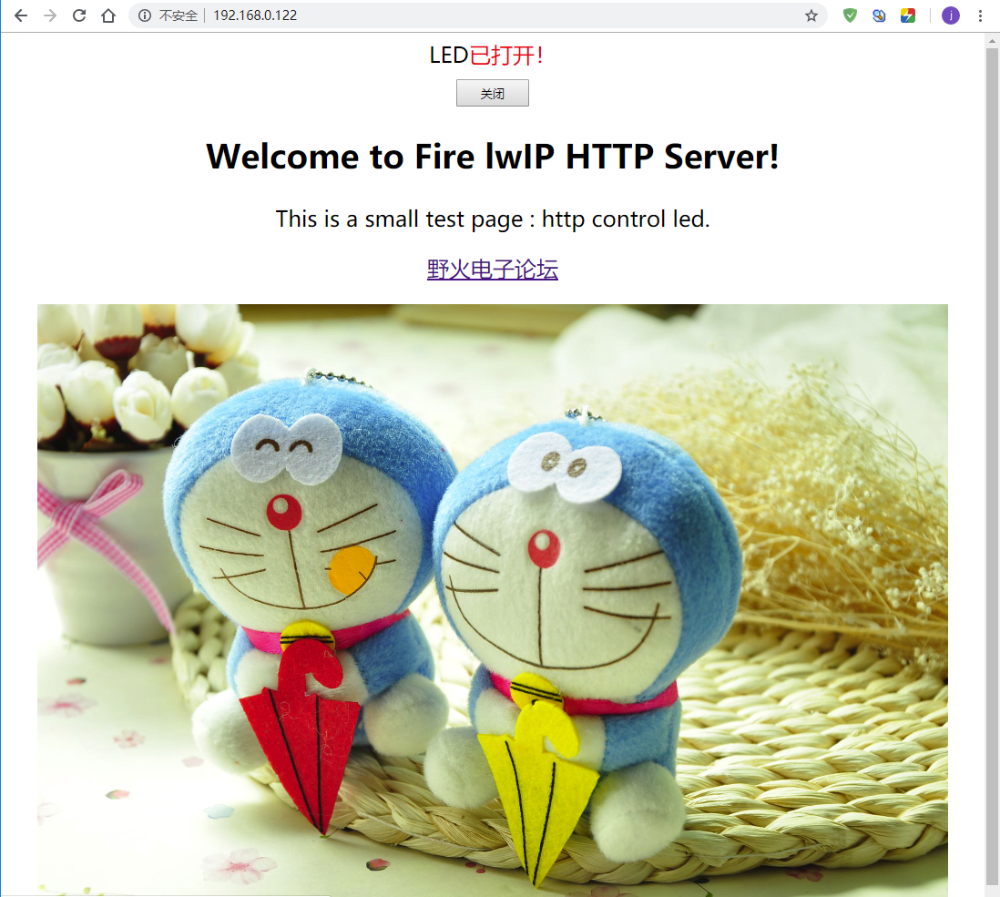

HTTP服务器
----------

Hello World 网页demo
~~~~~~~~~~~~~~~~~~~~

本次实验我们利用开发板来搭建一个HTTP服务器，通过浏览器去访问我们的开发板，我们使用NETCONN
API去实现，具体步骤如下：

1. 创建一个NETCONN_TCP连接结构

2. 将本地IP地址、端口号与连接结构进行绑定。

3. 监听客户端的连接。

4. 处理该连接。

5. 发送接收数据。

在这里有几个注意事项，因为浏览器访问我们的服务器，其实是通过“GET”操作命令获取我们开发板的资源，那么我们在接收到这个命令后，返回我们的资源数据给浏览器，而浏览器显示是通过HTML代码来标记这些资源的，那么我们在开发板中就需要定义好相关的HTML数据，此外，HTTP服务器默认是打开80端口的。

首先我们拿到移植好的带操作系统工程，创建两个文件，分别为httpserver_netconn.c和httpserver_netconn.h，
在其中加入 代码清单20_1_ 与 代码清单20_2_ 所示代码。

代码清单 20‑1httpserver_netconn.c文件内容

.. code-block:: c
   :name: 代码清单20_1

    #include "lwip/opt.h"
    #include "lwip/arch.h"
    #include "lwip/api.h"

    #include "httpserver-netconn.h"

    #if LWIP_NETCONN

    #ifndef HTTPD_DEBUG
    #define HTTPD_DEBUG         LWIP_DBG_OFF
    #endif

    static const char http_html_hdr[] =
        "HTTP/1.1 200 OK\r\nContent-type: text/html\r\n\r\n";
    static const char http_index_html[] =
    "<html><head><title>Congrats!</title></head>\
    <body><h1 align=\"center\">Hello World!</h1>\
    <h2 align=\"center\">Welcome to Fire lwIP HTTP Server!</h1>\
    
This is a small test page, served by httpserver-netconn.
\
    
<a href=\"http://www.firebbs.cn/forum.php/\">\
     野火电子论坛  </a>
\
    <a href=\"http://www.firebbs.cn/forum.php/\">\
    
</a>\
    </body></html>";

    /** Serve one HTTP connection accepted in the http thread */
    static void
    http_server_netconn_serve(struct netconn *conn)
    {
        struct netbuf *inbuf;
        char *buf;
        u16_t buflen;
        err_t err;

        /* 读取数据 */
        err = netconn_recv(conn, &inbuf);

        if (err == ERR_OK)
        {
            netbuf_data(inbuf, (void**)&buf, &buflen);

            /* 判断是不是HTTP的GET命令*/
            if (buflen>=5 &&
                    buf[0]=='G' &&
                    buf[1]=='E' &&
                    buf[2]=='T' &&
                    buf[3]==' ' &&
                    buf[4]=='/' )
            {

                /* 发送数据头 */
                netconn_write(conn, http_html_hdr,
                sizeof(http_html_hdr)-1, NETCONN_NOCOPY);
                /* 发送网页数据 */
                netconn_write(conn, http_index_html,
                    sizeof(http_index_html)-1, NETCONN_NOCOPY);
            }
        }
        netconn_close(conn); /* 关闭连接 */

        /* 释放inbuf */
        netbuf_delete(inbuf);
    }

    /** The main function, never returns! */
    static void
    http_server_netconn_thread(void *arg)
    {
        struct netconn *conn, *newconn;
        err_t err;
        LWIP_UNUSED_ARG(arg);

        /* 创建netconn连接结构 */
        /* 绑定端口号与IP地址，端口号默认是80 */
        conn = netconn_new(NETCONN_TCP);
        netconn_bind(conn, IP_ADDR_ANY, 80);

        LWIP_ERROR("http_server: invalid conn", (conn != NULL), return;);

        /* 监听 */
        netconn_listen(conn);

        do
        {
            //处理连接请求
            err = netconn_accept(conn, &newconn);
            if (err == ERR_OK)
            {
                //发送网页数据
                http_server_netconn_serve(newconn);

                //删除连接结构
                netconn_delete(newconn);
            }
        }
        while (err == ERR_OK);
        //关闭
        netconn_close(conn);
        netconn_delete(conn);
    }

    /** Initialize the HTTP server (start its thread) */
    void
    http_server_netconn_init(void)
    {
    sys_thread_new("http_server_netconn", http_server_netconn_thread, NULL, 2048, 4);
    }

    #endif

代码清单 20‑2httpserver_netconn.h文件内容

.. code-block:: c
   :name: 代码清单20_2

    #ifndef LWIP_HTTPSERVER_NETCONN_H
    #define LWIP_HTTPSERVER_NETCONN_H

    void http_server_netconn_init(void);

    #endif /* LWIP_HTTPSERVER_NETCONN_H */

根据自己开发板所处的环境配置好IP地址，然后在main.c文件中调用http_server_netconn_init()函数即可，打开电脑的浏览器，
输入自己开发板的IP地址，即可得到相应的服务器信息，具体见 图20_1_

.. image:: media/image1.png
   :align: center
   :alt: 图 20‑1HTTP服务器
   :name: 图20_1

图 20‑1HTTP服务器

提供网页控制LED灯开关的功能
~~~~~~~~~~~~~~~~~~~~~~~~~~~

这个实验是基于上个实验的再次开发，我们的开发板作为服务器，电脑浏览器访问服务器，然后通过网页上的控制按钮来控制我们开发板上的LED灯，那是什么原理呢？首先我们从上一节知道，浏览器是通过“GET”命令来获取开发板上的数据（资源），同样的，浏览器也可以通过“POST”命令来设置开发板上的资源，当然，我们在服务器端（开发板）需要对“POST”命令产生应答并且处理才可以，因此我们需要对服务器进行改写，而且将开发板上LED等的状态实时显示在网页上。

首先将上一个实验的工程拷贝过来，将httpserver_netconn.c文件替换 代码清单20_3_ 所示的代码，在浏览器中输入我们的IP地址信息，
然后通过网页上的控制LED开关按钮就可以进行控制开发板上的LED灯了，具体见
图20_2_。

代码清单 20‑3httpserver_netconn.c文件内容

.. code-block:: c
   :name: 代码清单20_3

    #include "lwip/opt.h"
    #include "lwip/arch.h"
    #include "lwip/api.h"

    #include "httpserver-netconn.h"

    #if LWIP_NETCONN

    #ifndef HTTPD_DEBUG
    #define HTTPD_DEBUG         LWIP_DBG_OFF
    #endif

    const static char http_html_hdr[] =
        "HTTP/1.1 200 OK\r\nContent-type: text/html\r\n\r\n";

    const unsigned char Led1On_Data[] =
        "<HTML> \
    <head><title>HTTP LED Control</title></head> \
    
 \
    
 \
    LED已打开！ \
    <form method=post action=\"off\" name=\"ledform\"> \
    <input type=\"submit\" value=\"关闭\" style=\"width:80px;height:30px;\"></form> \
    
 \
    </HTML> ";

    //当LED灭时，向浏览器返回如下html信息，显示结果如下图15-7所示
    const unsigned char Led1Off_Data[] =
        "<HTML> \
    <head><title>HTTP LED Control</title></head> \
    
 \
    
 \
    LED已关闭！ \
    <form method=post action=\"on\" name=\"ledform\"> \
    <input type=\"submit\" value=\"打开\" style=\"width:80px;height:30px;\"></form> \
    
 \
    </HTML> ";

    static const char http_index_html[] =
        "<html><head><title>Congrats!</title></head>\
    <body><h2 align=\"center\">Welcome to Fire lwIP HTTP Server!</h2>\
    
This is a small test page : http control led.
\
    
<a href=\"http://www.firebbs.cn/forum.php/\">\
     野火电子论坛  </a>
\
    <a href=\"http://www.firebbs.cn/forum.php/\">\
    </a>\
    </body></html>";

    static bool led_on = FALSE;

    /*发送网页数据*/
    void httpserver_send_html(struct netconn *conn, bool led_status)
    {
        //发送数据头
        netconn_write(conn, http_html_hdr,
                    sizeof(http_html_hdr)-1, NETCONN_NOCOPY);

        /* 根据LED状态，发送不同的LED数据 */
        if (led_status == TRUE)
            netconn_write(conn, Led1On_Data,
                        sizeof(Led1On_Data)-1, NETCONN_NOCOPY);
        else
            netconn_write(conn, Led1Off_Data,
                        sizeof(Led1Off_Data)-1, NETCONN_NOCOPY);

        netconn_write(conn, http_index_html,
                    sizeof(http_index_html)-1, NETCONN_NOCOPY);

    }

    static void httpserver_serve(struct netconn *conn)
    {
        struct netbuf *inbuf;
        char *buf;
        u16_t buflen;
        err_t err;

        /* 等待客户端的命令数据 */
        err = netconn_recv(conn, &inbuf);

        if (err == ERR_OK)
        {
            netbuf_data(inbuf, (void**)&buf, &buflen);
            /* “GET”命令 */
            if (buflen>=5 &&
                    buf[0]=='G' &&
                    buf[1]=='E' &&
                    buf[2]=='T' &&
                    buf[3]==' ' &&
                    buf[4]=='/' )
            {

                /* 发送数据 */
                httpserver_send_html(conn, led_on);
            }
            //“POST” 命令
            else if (buflen>=8&&buf[0]=='P'&&buf[1]=='O'
                    &&buf[2]=='S'&&buf[3]=='T')
            {
                if (buf[6]=='o'&&buf[7]=='n')
                {
                    //请求打开LED
                    led_on = TRUE;
                    LED1_ON;
                }
                else if (buf[6]=='o'&&buf[7]=='f'&&buf[8]=='f')
                {
                    //请求关闭LED
                    led_on = FALSE;
                    LED1_OFF;
                }
                //发送数据
                httpserver_send_html(conn, led_on);
            }

            netbuf_delete(inbuf);
        }
        /* 关闭 */
        netconn_close(conn);

    }

    /** The main function, never returns! */
    static void
    httpserver_thread(void *arg)
    {
        struct netconn *conn, *newconn;
        err_t err;
        LWIP_UNUSED_ARG(arg);

        /* 创建连接结构 */
        conn = netconn_new(NETCONN_TCP);
        LWIP_ERROR("http_server: invalid conn", (conn != NULL), return;);

        led_on = TRUE;
        LED1_ON;

        /* 绑定IP地址与端口号*/
        netconn_bind(conn, NULL, 80);

        /* 监听 */
        netconn_listen(conn);

        do
        {
            err = netconn_accept(conn, &newconn);
            if (err == ERR_OK)
            {
                httpserver_serve(newconn);
                netconn_delete(newconn);
            }
        }
        while (err == ERR_OK);

        netconn_close(conn);

        netconn_delete(conn);
    }

    /** Initialize the HTTP server (start its thread) */
    void
    httpserver_init()
    {
    sys_thread_new("http_server_netconn",httpserver_thread, NULL, 1024, 4);
    }

    #endif

图 20‑2网页控制LED灯
