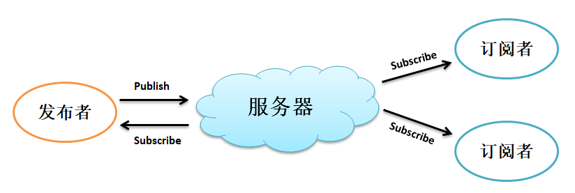
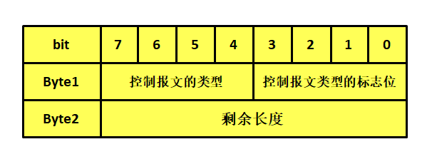
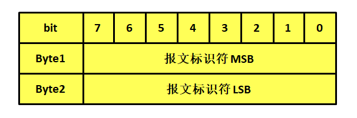
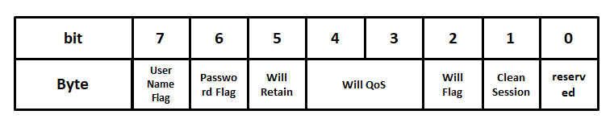
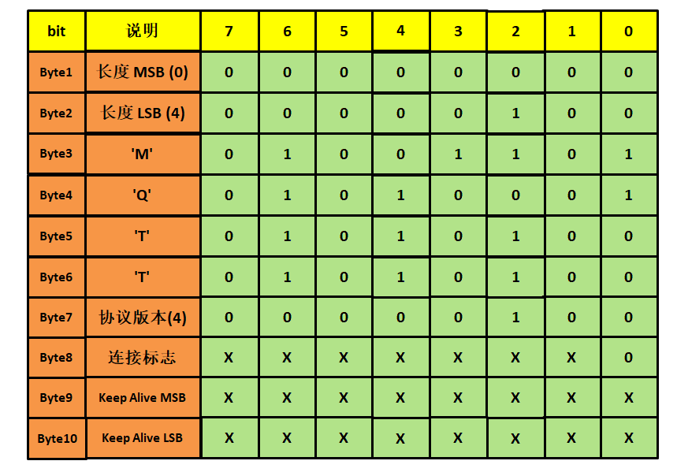
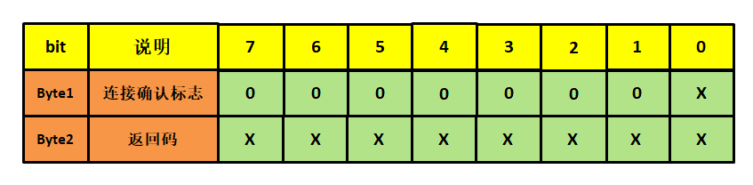
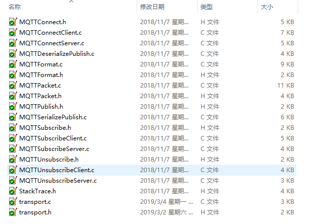

MQTT协议
--------

MQTT协议简介
~~~~~~~~~~~~

MQTT协议全称是Message Queuing Telemetry
Transport，翻译过来就是消息队列遥测传输协议，它是物联网常用的应用层协议，运行在TCP/IP中的应用层中，依赖TCP协议，因此它具有非常高的可靠性，同时它是基于TCP协议的<客户端-服务器>模型发布/订阅主题消息的轻量级协议，也是我们常说的发送与接收数据，下面我们来初步了解一下mqtt相关的名称与功能。

MQTT通信模型
~~~~~~~~~~~~

MQTT
协议提供一对多的消息发布，可以降低应用程序的耦合性，用户只需要编写极少量的应用代码就能完成一对多的消息发布与订阅，该协议是基于<客户端-服务器>模型，在协议中主要有三种身份：发布者（Publisher）、服务器（Broker）以及订阅者（Subscriber）。其中，MQTT消息的发布者和订阅者都是客户端，服务器只是作为一个中转的存在，将发布者发布的消息进行转发给所有订阅该主题的订阅者；发布者可以发布在其权限之内的所有主题，并且消息发布者可以同时是订阅者，实现了生产者与消费者的脱耦，发布的消息可以同时被多个订阅者订阅。

图 21‑1MQTT通信模型

MQTT客户端的功能：

1. 发布消息给其它相关的客户端。

2. 订阅主题请求接收相关的应用消息。

3. 取消订阅主题请求移除接收应用消息。

4. 从服务端终止连接。

MQTT 服务器常被称为
Broker（消息代理），以是一个应用程序或一台设备，它一般为云服务器，比如BTA三巨头的一些物联网平台就是常使用MQTT协议，它是位于消息发布者和订阅者之间，以便用于接收消息并发送到订阅者之中，它的功能有：

1. 接受来自客户端的网络连接请求。

2. 接受客户端发布的应用消息。

3. 处理客户端的订阅和取消订阅请求。

4. 转发应用消息给符合条件的已订阅客户端（包括发布者自身）。

消息主题与服务质量
~~~~~~~~~~~~~~~~~~

什么是主题？MQTT服务器为每个连接的客户端（订阅者）添加一个标签，该标签与服务器中的所有订阅相匹配，服务器会将消息转发给与标签相匹配的每个客户端（订阅者），当然订阅者也是需要有权限才能订阅对应的主题，比如像阿里云中的，订阅者只能订阅同一个产品下的主题，而不能跨产品订阅，这样子的处理就能达到信息的安全性以及多个订阅者能及时收到消息。一个主题可以有多个级别，各个级别之间用斜杠字符分隔，例如/test
和 /test/test1/test2都 是有效的主题。

发布者与订阅者可以通过主题名字，一般为UTF-8编码（反正用英文字符串就不会错）的形式发布和订阅主题，比如我们可以直接定义一个名字为“test”的主题，绝大多数的MQTT服务器支持动态发布/定阅主题，即当前服务器中没有某个主题，但是客户端直接可以向该主题发布/订阅消息，这样子服务器就会创建对应的主题，当然，服务器中一般也会默认提供多个系统主题，所有连接的客户端均可订阅。

每个客户端与服务器建立连接后就是一个会话，客户端和服务器之间会有状态交互，订阅是基于会话之上，每个订阅中，都会包含一个主题过滤器，它是一个表达式，用于标识订阅相关的一个或多个主题，主题过滤器可以使用通配符，因此订阅者需要指定订阅的主题名字与服务质量（QoS），订阅者能订阅多个主题，也就能接收到多个发布者发布的消息。同理，发布者也需要首先与服务器建立会话，并且指定发送的主题名字与服务质量，同时它也能向多个不同的主题发送消息。

那么什么是服务质量呢？MQTT的服务质量提供3个等级：

1. QoS0：最多发送一次消息，在消息发送出去后，接收者不会发送回应，发送者也不会重发消息，消息可能送达一次也可能根本没送达，
   这个服务质量常用在不重要的消息传递中，因为即使消息丢了也没有太大关系。

2. QoS1：最少发送一次消息（消息最少需要送达一次，也有可送达多次），QoS1的PUBLISH报文的可变报头中包含一个报文标识符，
   需要PUBACK报文确认。即需要接收者返回PUBACK应答报文。

3. QoS2：这是最高等级的服务质量，消息丢失和重复都是不可接受的，只不过使用这个服务质量等级会有额外的开销，
   这个等级常用于支付中，因为支付是必须有且仅有一次成功，总不能没给钱或者给了多次钱吧。

MQTT控制报文
~~~~~~~~~~~~

固定报头
^^^^^^^^

MQTT协议工作在TCP协议之上，因为客户端和服务器都是应用层，那么必然需要一种协议在两者之间进行通信，那么随之而来的就是MQTT控制报文，
MQTT控制报文有3个部分组成，分别是固定报头（fixed
header）、可变报头（variable
header）、有效荷载（数据区域payload）。固定报头，所有的MQTT控制报文都包含，可变报头与有效载荷是部分MQTT控制报文包含。

固定报头占据两字节的空间，具体见 图21_2_。

图 21‑2固定报头

固定报头的第一个字节分为控制报文的类型（4bit），以及控制报文类型的标志位，控制类型共有14种，其中0与15被系统保留出来，其他的类型具体见表格21‑1。

表格 21‑1固定报头类型

+-------------+----+---------------------------+
| 类型        | 值 | 说明                      |
+=============+====+===========================+
| Reserved    | 0  | 系统保留                  |
+-------------+----+---------------------------+
| CONNECT     | 1  | 客户端请求连接服务端      |
+-------------+----+---------------------------+
| CONNACK     | 2  | 连接报文确认              |
+-------------+----+---------------------------+
| PUBLISH     | 3  | 发布消息                  |
+-------------+----+---------------------------+
| PUBACK      | 4  | 消息发布收到确认（QoS 1） |
+-------------+----+---------------------------+
| PUBREC      | 5  | 发布收到（QoS2）          |
+-------------+----+---------------------------+
| PUBREL      | 6  | 发布释放（QoS2）          |
+-------------+----+---------------------------+
| PUBCOMP     | 7  | 消息发布完成（QoS2）      |
+-------------+----+---------------------------+
| SUBSCRIBE   | 8  | 客户端订阅请求            |
+-------------+----+---------------------------+
| SUBACK      | 9  | 订阅请求报文确认          |
+-------------+----+---------------------------+
| UNSUBSCRIBE | 10 | 客户端取消订阅请求        |
+-------------+----+---------------------------+
| UNSUBACK    | 11 | 取消订阅报文确认          |
+-------------+----+---------------------------+
| PINGREQ     | 12 | 心跳请求                  |
+-------------+----+---------------------------+
| PINGRESP    | 13 | 心跳响应                  |
+-------------+----+---------------------------+
| DISCONNECT  | 14 | 客户端断开连接            |
+-------------+----+---------------------------+
| Reserved    | 15 | 系统保留                  |
+-------------+----+---------------------------+

固定报头的bit0-bit3为标志位，依照报文类型有不同的含义，事实上，除了PUBLISH类型报文以外，其他报文的标志位均为系统保留，PUBLISH报文的第一字节bit3是控制报文的重复分发标志（DUP），bit1-bit2是服务质量等级，bit0是PUBLISH报文的保留标志，用于标识PUBLISH是否保留，当客户端发送一个PUBLISH消息到服务器，如果保留标识位置1，那么服务器应该保留这条消息，当一个新的订阅者订阅这个主题的时候，最后保留的主题消息应被发送到新订阅的用户。

固定报头的第二个字节开始是剩余长度字段，是用于记录剩余报文长度的，表示当前的消息剩余的字节数，包括可变报头和有效载荷区域（如果存在），但剩余长度不包括用于编码剩余长度字段本身的字节数。

剩余长度字段使用一个变长度编码方案，对小于128的值它使用单字节编码，而对于更大的数值则按下面的方式处理：每个字节的低7位用于编码数据长度，最高位（bit7）用于标识剩余长度字段是否有更多的字节，且按照大端模式进行编码，因此每个字节可以编码128个数值和一个延续位，剩余长度字段最大可拥有4个字节。

当剩余长度使用1个字节存储时，其取值范围为0(0x00)~127(0x7f)。

当使用2个字节时，其取值范围为128(0x80,0x01)~16383(0Xff,0x7f)。

当使用3个字节时，其取值范围为16384(0x80,0x80,0x01)~2097151(0xFF,0xFF,0x7F)。

当使用4个字节时，其取值范围为2097152(0x80,0x80,0x80,0x01)~268435455(0xFF,0xFF,0xFF,0x7F)。

总的来说，MQTT报文理论上可以发送最大256M的报文，当然，这种情况是非常少的。

可变报头
^^^^^^^^

可变报头并不是所有的MQTT报文都带有的（比如PINGREQ心跳请求与PINGRESP心跳响应报文就没有可变报头），只有某些报文才拥有可变报头，它在固定报头和有效负载之间，可变报头的内容会根据报文类型的不同而有所不同，但可变报头的报文标识符（Packet
Identifier）字段存在于在多个类型的报文里，而有一些报文又没有报文标识符字段，具体见表格
21‑2，报文标识符结构具体见 图21_3_。

表格 21‑2需要报文标识符字段的报文类型

+-------------+------------------------+
| 报文类型    | 是否需要报文标识符字段 |
+=============+========================+
| CONNECT     | 不需要                 |
+-------------+------------------------+
| CONNACK     | 不需要                 |
+-------------+------------------------+
| PUBLISH     | 需要（如果QoS > 0）    |
+-------------+------------------------+
| PUBACK      | 需要                   |
+-------------+------------------------+
| PUBREC      | 需要                   |
+-------------+------------------------+
| PUBREL      | 需要                   |
+-------------+------------------------+
| PUBCOMP     | 需要                   |
+-------------+------------------------+
| SUBSCRIBE   | 需要                   |
+-------------+------------------------+
| SUBACK      | 需要                   |
+-------------+------------------------+
| UNSUBSCRIBE | 需要                   |
+-------------+------------------------+
| UNSUBACK    | 需要                   |
+-------------+------------------------+
| PINGREQ     | 不需要                 |
+-------------+------------------------+
| PINGRESP    | 不需要                 |
+-------------+------------------------+
| DISCONNECT  | 不需要                 |
+-------------+------------------------+

图 21‑3报文标识符

因为对于不同的报文，可变报头是不一样的，下面就简单讲解几个报文的可变报头。

CONNECT
'''''''''''

在一个会话中，客户端只能发送一次CONNECT报文，它是客户端用于请求连接服务器的报文，常称之为连接报文，如果客户端发送多次连接报文，那么服务端必须将客户端发送的第二个CONNECT报文当作协议违规处理并断开客户端的连接。

CONNECT报文的可变报头包含四个字段：协议名（Protocol
Name）、协议级别（Protocol Level）、连接标志（Connect
Flags）以及保持连接（Keep Alive）字段。

协议名是MQTT
的UTF-8编码的字符串，其中还包含用于记录协议名长度的两字节字段MSB与LSB。

在协议名之后的是协议级别，MQTT协议使用8位的无符号值表示协议的修订版本，对于MQTT3.1版的协议，协议级别字段的值是3(0x03)，而对于MQTT3.1.1版的协议，协议级别字段的值是4(0x04)。如果服务器发现连接报文中的协议级别字段是不支持的协议级别，服务端必须给发送一个返回码为0x01（不支持的协议级别）的CONNACK响应连接报文，然后终止客户端的连接请求。

连接标志字段涉及的内容比较多，它在协议级别之后使用一个字节表示，但分成很多个标志位，具体见 图21_4_。

图 21‑4连接标志字段

bit0是MQTT保留的标志位，在连接过程中，服务器会检测连接标志的bit0是否为0，如果不为0则服务器任务这个连接报文是不合法的，会终止连接请求。

bit1是清除会话标志Clean
Session，一般来说，客户端在请求连接服务器时总是将清除会话标志设置为0或1，在建立会话连接后，这个值就固定了，当然这个值的选择取决于具体的应用，如果清除会话标志设置为1，那么客户端不会收到旧的应用消息，而且在每次连接成功后都需要重新订阅相关的主题。清除会话标志设置为0的客户端在重新连接后会收到所有在它连接断开期间（其他发布者）发布的QoS1和QoS2级别的消息。因此，要确保不丢失连接断开期间的消息，需要使用QoS1或
QoS2级别，同时将清除会话标志设置为0。

bit2是遗嘱标志 Will
Flag，如果该位被设置为1，表示如果客户端与服务器建立了会话，遗嘱消息（Will
Message）将必须被存储在服务器中，当这个客户端断开连接的时候，遗嘱消息将被发送到订阅这个会话主题的所有订阅者，这个消息是很有用的，我们可以知道这个设备的状况，它是否已经掉线了，以备启动备用方案，当然，想要不发送遗嘱消息也是可以的，只需要让服务器端收到DISCONNECT报文时删除这个遗嘱消息即可。

bit3-bit4用于指定发布遗嘱消息时使用的服务质量等级，与其他消息的服务质量是一样的，遗嘱QoS的值可以等于0(0x00)，1(0x01)，2(0x02)，当然，使用遗嘱消息的前提是遗嘱标志位为1。

bit5表示遗嘱保留标志位，当客户端意外断开连接时，如果 Will
Retain置一，那么服务器必须将遗嘱消息当作保留消息发布，反之则无需保留。

bit6是密码标志位Password
Flag，如果密码标志被设置为0，有效载荷中不能包含密码字段，反之则必须包含密码字段。

bit6是用户名标志位User Name
Flag，如果用户名标志被设置为0，有效载荷中不能包含用户名字段，反之则必须包含用户名字段。

保持连接字段是一个以秒为单位的时间间隔，它使用了两个字节来记录允许客户端最大空闲时间间隔，简单来说就是，客户端必须在这段时间中与服务器进行通信，让服务器知道客户端还处于连接状态而不是断开了，当然，如果没有任何其它的控制报文可以发送，客户端也必须要发送一个PINGREQ报文，以告知服务器还是处于连接状态的。

总的来说，整个CONNECT报文可变报头的内容如下，具体见 图21_5_。

图 21‑5CONNECT报文可变报头

CONNACK
'''''''

我们再来讲解一下CONNACK报文的可变报头部分，其实有了上一个的经验，这部分对大家来说是很简单的，它是由连接确认标志字段（Connect
Acknowledge Flags）与连接返回码字段 （Connect Return
code）组成，各占用1个字节。

它的第1个字节是 连接确认标志字段，bit1-bit7是保留位且必须设置为0，
bit0是当前会话（Session Present）标志位。

它的第2个字节是返回码字段，如果服务器收到一个CONNECT报文，但出于某些原因无法处理它，服务器会返回一个包含返回码的CONNACK报文。如果服务器返回了一个返回码字段是非0的CONNACK报文，那么它必须关闭网络连接，返回码描述具体见表格21‑3。

表格 21‑3返回码值与对应的描述

+-----------+---------------------------------------------------------+
| 返回码值  | 描述                                                    |
+===========+=========================================================+
| 0x00      | 连接已被服务端接受                                      |
+-----------+---------------------------------------------------------+
| 0x01      | 连接已拒绝，服务端不支持客户端请求的MQTT协议级别        |
+-----------+---------------------------------------------------------+
| 0x02      | 连接已拒绝，服务器标识符是正确的UTF-8编码，但不允许使用 |
+-----------+---------------------------------------------------------+
| 0x03      | 连接已拒绝，网络连接已建立，但MQTT服务不可用            |
+-----------+---------------------------------------------------------+
| 0x04      | 连接已拒绝，用户名或密码的数据格式无效                  |
+-----------+---------------------------------------------------------+
| 0x05      | 连接已拒绝，客户端未被授权连接到此服务器                |
+-----------+---------------------------------------------------------+
| 0x06~0xFF | 保留未使用                                              |
+-----------+---------------------------------------------------------+

提示：如果服务端收到清理会话（CleanSession）标志为1的连接，除了将CONNACK报文中的返回码设置为0之外，还必须将CONNACK报文中的当前会话设置（Session
Present）标志为0。

那么总的来说，CONNACK报文的可变报头部分内容具体见 图21_6_。

图 21‑6CONNACK可变报头

在此，就不再对MQTT报文的可变报头部分过多赘述，大家可以参考MQTT协议手册，里面有很详细的描述。

有效载荷
^^^^^^^^

有效载荷也是存在与某些报文中，不同的报文有效载荷也是不一样的，比如：

CONNECT报文的有效载荷（payload）包含一个或多个以长度为前缀的字段，可变报头中的标志决定是否包含这些字段。如果包含的话，必须按这个顺序出现：客户端标识符，遗嘱主题，遗嘱消息，用户名，密码 。

SUBSCRIBE报文的有效载荷包含了一个主题过滤器列表，它们标识着客户端想要订阅的主题，每一个过滤器后面跟着一个字节，这个字节被叫做服务质量要求（Requested
QoS），它给出了服务端向客户端发送应用消息所允许的最大QoS等级。

这里只是讲述了一小部分内容，关于具体的有效载荷部分也可以去看MQTT手册，此处就不再赘述。

移植MQTT协议
~~~~~~~~~~~~

初步了解了MQTT协议，那么我们怎么在开发板上运行它呢？首先，LwIP协议肯定是要的，因为MQTT是应用层协议，基于TCP协议至少，首先我们就需要把LwIP协议跑通，我们就使用Socket
API来进行移植。

首先下载MQTT的库：
`https://github.com/eclipse/paho.mqtt.embedded-c <https://github.com/eclipse/paho.mqtt.embedded-c>`__\ 。

然后创建一个MQTT文件夹，再将MQTTPacket\src目录下的文件添加到工程目录MQTT文件夹，
再将MQTTPacket\samples目录下的transport.c、transport.h添加到这个文件夹下，
添加完成后文件夹内容具体见 图21_7_。

图 21‑7MQTT文件夹下的内容

我们把这些文件加入我们的工程之中，并且指定头文件路径，然后实现transport.c文件的移植层接口，其内容具体见
代码清单21_1_

代码清单 21‑1transport.c文件内容

.. code-block:: c
   :name: 代码清单21_1

    #include "transport.h"
    #include "lwip/opt.h"
    #include "lwip/arch.h"
    #include "lwip/api.h"
    #include "lwip/inet.h"
    #include "lwip/sockets.h"			(1)
    #include "string.h"

    static int mysock;

    /************************************************************************
    ** 函数名称: transport_sendPacketBuffer
    ** 函数功能: 以TCP方式发送数据
    ** 入口参数: unsigned char* buf：数据缓冲区
    **           int buflen：数据长度
    ** 出口参数: <0发送数据失败
    ************************************************************************/
    int32_t transport_sendPacketBuffer( uint8_t* buf, int32_t buflen)
    {
        int32_t rc;
        rc = write(mysock, buf, buflen);		(2)
        return rc;
    }

    /************************************************************************
    ** 函数名称: transport_getdata
    ** 函数功能: 接收TCP数据
    ** 入口参数: unsigned char* buf：数据缓冲区
    **           int count：数据长度
    ** 出口参数: <=0接收数据失败
    ************************************************************************/
    int32_t transport_getdata(uint8_t* buf, int32_t count)
    {
        int32_t rc;

        rc = recv(mysock, buf, count, 0);		(3)
        return rc;
    }

    /************************************************************************
    ** 函数名称: transport_open
    ** 函数功能: 打开一个接口，并且和服务器 建立连接
    ** 入口参数: char* servip:服务器域名
    **           int   port:端口号
    ** 出口参数: <0打开连接失败
    ************************************************************************/
    int32_t transport_open(int8_t* servip, int32_t port)
    {
        int32_t *sock = &mysock;
        int32_t ret;
    //  int32_t opt;
        struct sockaddr_in addr;

        //初始化服务器信息
        memset(&addr,0,sizeof(addr));
        addr.sin_len = sizeof(addr);
        addr.sin_family = AF_INET;
        //填写服务器端口号
        addr.sin_port = PP_HTONS(port);
        //填写服务器IP地址
        addr.sin_addr.s_addr = inet_addr((const char*)servip);

        //创建SOCK
        *sock = socket(AF_INET,SOCK_STREAM,0);	(4)
        //连接服务器
        ret = connect(*sock,(struct sockaddr*)&addr,sizeof(addr));	(5)
        if (ret != 0)
        {
            //关闭链接
            close(*sock);
            //连接失败
            return -1;
        }
        //连接成功,设置超时时间1000ms
    //  opt = 1000;
    //  setsockopt(*sock,SOL_SOCKET,SO_RCVTIMEO,&opt,sizeof(int));

        //返回套接字
        return *sock;
    }

    /************************************************************************
    ** 函数名称: transport_close
    ** 函数功能: 关闭套接字
    ** 入口参数: unsigned char* buf：数据缓冲区
    **           int buflen：数据长度
    ** 出口参数: <0发送数据失败
    ************************************************************************/
    int transport_close(void)
    {

        int rc;
    //  rc = close(mysock);
        rc = shutdown(mysock, SHUT_WR);
        rc = recv(mysock, NULL, (size_t)0, 0);
        rc = close(mysock);			(6)
        return rc;
    }

代码清单 21‑1\ **(1)**\ ：添加头文件，我们使用Socket
API就添加LwIP中对应的头文件。

代码清单
21‑1\ **(2)**\ ：transport_sendPacketBuffer()函数是MQTT发送数据函数，这个函数必须以TCP协议发送数据，
参数buf指定数据缓冲区，buflen指定了数据长度，调用write()函数进行发送数据，并且返回发送状态。

代码清单
21‑1\ **(3)**\ ：transport_getdata()函数是MQTT接收数据的函数，需要我们用Socket
API获取接收到的数据，参数buf指定数据缓冲区，count指定了获取数据长度，我们只要调用recv()将数据获取回来即可。

代码清单
21‑1\ **(4)(5)**\ ：transport_open()函数用于打开一个连接接口，并且让客户端和服务器建立连接，
这个函数是实现MQTT的前提，必须产生TCP连接才能进入下一步操作，因此我们在函数中需要根据配置信息连接到服务器中，
socket()用于创建一个套接字，并且调用connect()函数连接到服务器上，如果连接失败则关闭套接字，返回-1。

代码清单
21‑1\ **(6)**\ ：transport_close()是MQTT与服务器断开的时候会调用的函数，它用来关闭一个套接字的。

然后我们在工程中实现两个线程，一个是MQTT发送线程，另一个是MQTT接收线程，这样子的话，我们的MQTT协议就在开发板中跑起来了，
我们提供了完整的MQTT客户端连接到服务器demo，下面简单实现两个线程的处理，更多的代码请参考我们的工程，我们首先在USER目录下创建一个mqttclient.c文件，然后加入 代码清单21_2_ 所示代码。

代码清单 21‑2mqttclient.c文件内容（部分）

.. code-block:: c
   :name: 代码清单21_2

    void mqtt_recv_thread(void *pvParameters)
    {
        uint32_t curtick;
        uint8_t no_mqtt_msg_exchange = 1;
        uint8_t buf[MSG_MAX_LEN];
        int32_t buflen = sizeof(buf);
        int32_t type;
        fd_set readfd;
        struct timeval tv;      //等待时间
        tv.tv_sec = 0;
        tv.tv_usec = 10;

    MQTT_START:
        //开始连接
        Client_Connect();
        //获取当前滴答，作为心跳包起始时间
        curtick = xTaskGetTickCount();
        while (1)
        {
            //表明无数据交换
            no_mqtt_msg_exchange = 1;

            FD_ZERO(&readfd);
            FD_SET(MQTT_Socket,&readfd);

            //等待可读事件
            select(MQTT_Socket+1,&readfd,NULL,NULL,&tv);

            //判断MQTT服务器是否有数据
            if (FD_ISSET(MQTT_Socket,&readfd) != 0)
            {
                //读取数据包--注意这里参数为0，不阻塞
                type = ReadPacketTimeout(MQTT_Socket,buf,buflen,0);
                if (type != -1)
                {
                    mqtt_pktype_ctl(type,buf,buflen);
                    //表明有数据交换
                    no_mqtt_msg_exchange = 0;
                    //获取当前滴答，作为心跳包起始时间
                    curtick = xTaskGetTickCount();
                }
            }

            //这里主要目的是定时向服务器发送PING保活命令
            if ((xTaskGetTickCount() - curtick) >(KEEPLIVE_TIME/2*1000))
            {
                curtick = xTaskGetTickCount();
                //判断是否有数据交换
                if (no_mqtt_msg_exchange == 0)
                {
                    //如果有数据交换，这次就不需要发送PING消息
                    continue;
                }

                if (MQTT_PingReq(MQTT_Socket) < 0)
                {
                    //重连服务器
                    PRINT_DEBUG("发送保持活性ping失败....\n");
                    goto CLOSE;
                }

                //心跳成功
                PRINT_DEBUG("发送保持活性ping作为心跳成功....\n");
                //表明有数据交换
                no_mqtt_msg_exchange = 0;
            }
        }

    CLOSE:
        //关闭链接
        transport_close();
        //重新链接服务器
        goto MQTT_START;
    }

    void mqtt_send_thread(void *pvParameters)
    {
        int32_t ret;
        uint8_t no_mqtt_msg_exchange = 1;
        uint32_t curtick;
        uint8_t res;
        /* 定义一个创建信息返回值，默认为pdTRUE */
        BaseType_t xReturn = pdTRUE;
        /* 定义一个接收消息的变量 */
    //    uint32_t* r_data;
        DHT11_Data_TypeDef* recv_data;
        //初始化json数据
        cJSON* cJSON_Data = NULL;
        cJSON_Data = cJSON_Data_Init();
        double a,b;
    MQTT_SEND_START:

        while (1)
        {

            xReturn = xQueueReceive( MQTT_Data_Queue,    /* 消息队列的句柄 */
                                    &recv_data,      /* 发送的消息内容 */
                                    3000); /* 等待时间 3000ms */
            if (xReturn == pdTRUE)
            {
                a = recv_data->temperature;
                b = recv_data->humidity;
                printf("a = %f,b = %f\n",a,b);
                //更新数据
                res = cJSON_Update(cJSON_Data,TEMP_NUM,&a);
                res = cJSON_Update(cJSON_Data,HUM_NUM,&b);

                if (UPDATE_SUCCESS == res)
                {
                    //更新数据成功，
                    char* p = cJSON_Print(cJSON_Data);
                    //发布消息
                    ret = MQTTMsgPublish(MQTT_Socket,(char*)TOPIC,QOS0,(uint8_t*)p);
                    if (ret >= 0)
                    {
                        //表明有数据交换
                        no_mqtt_msg_exchange = 0;
                        //获取当前滴答，作为心跳包起始时间
                        curtick = xTaskGetTickCount();
                    }
                    vPortFree(p);
                    p = NULL;
                }
                else
                    PRINT_DEBUG("update fail\n");
            }
            //这里主要目的是定时向服务器发送PING保活命令
            if ((xTaskGetTickCount() - curtick) >(KEEPLIVE_TIME/2*1000))
            {
                curtick = xTaskGetTickCount();
                //判断是否有数据交换
                if (no_mqtt_msg_exchange == 0)
                {
                    //如果有数据交换，这次就不需要发送PING消息
                    continue;
                }

                if (MQTT_PingReq(MQTT_Socket) < 0)
                {
                    //重连服务器
                    PRINT_DEBUG("发送保持活性ping失败....\n");
                    goto MQTT_SEND_CLOSE;
                }

                //心跳成功
                PRINT_DEBUG("发送保持活性ping作为心跳成功....\n");
                //表明有数据交换
                no_mqtt_msg_exchange = 0;
            }
        }
    MQTT_SEND_CLOSE:
        //关闭链接
        transport_close();
        //开始连接
        Client_Connect();
        goto MQTT_SEND_START;
    }

    void
    mqtt_thread_init(void)
    {
        sys_thread_new("mqtt_recv_thread", mqtt_recv_thread, NULL, 2048, 6);
        sys_thread_new("mqtt_send_thread", mqtt_send_thread, NULL, 2048, 7);
    }

cJSON移植
~~~~~~~~~

其实在mqttclient.c文件中我们就使用了cJSON的内容，而且，在连接到各大云平台中经常使用JSON格式发送和接收数据，因此我们必须将cJSON也移植到我们的工程中。cJSON是一个用于解析JSON包的C语言库，库文件为cJSON.c和cJSON.h，
所有的实现都在这两个文件中。

cJSON的移植很简单，首先我们首先下载到cJSON的源码文件：\ `https://github.com/DaveGamble/cJSON <https://github.com/DaveGamble/cJSON>`__\ 。

然后在文件目录下找到cJSON.c和cJSON.h，将它们拷贝到我们的工程目录下的cJSON文件夹下（如果没有就创建它），
然后添加到工程中，并且指定头文件路径即可，因为我们使用的是FreeRTOS操作系统，那么cJSON中的动态内存分配、
释放函数就需要配合操作系统的动态内存分配函数与释放函数，在cJSON.c文件中修改 代码清单21_3_ 所示的代码即可，
当然还需要注意包含FreeRTOS相关的头文件。

代码清单 21‑3cJSON.c文件修改的内容

.. code-block:: c
   :name: 代码清单21_3

    static void * CJSON_CDECL internal_malloc(size_t size)
    {
    //    return malloc(size);
        return pvPortMalloc(size);
    }
    static void CJSON_CDECL internal_free(void *pointer)
    {
    //    free(pointer);
        vPortFree(pointer);
    }
    static void * CJSON_CDECL internal_realloc(void *pointer,
            size_t size)
    {
    //    return realloc(pointer, size);
        return NULL;
    }
    #else
    #define internal_malloc pvPortMalloc
    #define internal_free vPortFree
    #define internal_realloc
    #endif

为了更好利用cJSON提供的函数来处理我们的程序，我们简单对cJSON进行了封装，包含cJSON格式数据的初始化、更新、解析等，当然大家也可以自行封装使用，我们创建一个cJSON_Process.c文件，并添加以下代码，具体见
代码清单21_4_。

代码清单 21‑4 cJSON_Process.c文件内容

.. code-block:: c
   :name: 代码清单21_4

    #include "cJSON_Process.h"
    #include "main.h"

    cJSON* cJSON_Data_Init(void)
    {
        cJSON* cJSON_Root = NULL;    //json根节点

        cJSON_Root = cJSON_CreateObject();   /*创建项目*/
        if (NULL == cJSON_Root)
        {
            return NULL;
        }/*添加元素  键值对*/
        cJSON_AddStringToObject(cJSON_Root, NAME, DEFAULT_NAME);
        cJSON_AddNumberToObject(cJSON_Root, TEMP_NUM, DEFAULT_TEMP_NUM);
        cJSON_AddNumberToObject(cJSON_Root, HUM_NUM, DEFAULT_HUM_NUM);

        char* p = cJSON_Print(cJSON_Root);  /*p 指向的字符串是json格式的*/

    //  PRINT_DEBUG("%s\n",p);

        vPortFree(p);
        p = NULL;

        return cJSON_Root;

    }
    uint8_t cJSON_Update(const cJSON * const object,const char * const string,void *d)
    {
        cJSON* node = NULL;    //json根节点
        node = cJSON_GetObjectItem(object,string);
        if (node == NULL)
            return NULL;
        if (cJSON_IsBool(node))
        {
            int *b = (int*)d;
    //    printf ("d = %d",*b);
            cJSON_GetObjectItem(object,string)->type = *b ? cJSON_True : cJSON_False;
    //    char* p = cJSON_Print(object);    /*p 指向的字符串是json格式的*/
            return 1;
        }
        else if (cJSON_IsString(node))
        {
            cJSON_GetObjectItem(object,string)->valuestring = (char*)d;
    //    char* p = cJSON_Print(object);    /*p 指向的字符串是json格式的*/
            return 1;
        }
        else if (cJSON_IsNumber(node))
        {
            double *num = (double*)d;
    //    printf ("num = %f",*num);
    //    cJSON_GetObjectItem(object,string)->valueint = (double)*num;
            cJSON_GetObjectItem(object,string)->valuedouble = (double)*num;
    //    char* p = cJSON_Print(object);    /*p 指向的字符串是json格式的*/
            return 1;
        }
        else
            return 1;
    }

    void Proscess(void* data)
    {
        PRINT_DEBUG("开始解析JSON数据");
        cJSON *root,*json_name,*json_temp_num,*json_hum_num;
        root = cJSON_Parse((char*)data); //解析成json形式

        json_name = cJSON_GetObjectItem( root , NAME);  //获取键值内容
        json_temp_num = cJSON_GetObjectItem( root , TEMP_NUM );
        json_hum_num = cJSON_GetObjectItem( root , HUM_NUM );

        PRINT_DEBUG("name:%s\n temp_num:%f\n hum_num:%f\n",
                    json_name->valuestring,
                    json_temp_num->valuedouble,
                    json_hum_num->valuedouble);

        cJSON_Delete(root);  //释放内存
    }

到了这里，我们的整个MQTT的程序框架基本完成了，下面我们就开始使用MQTT程序。
