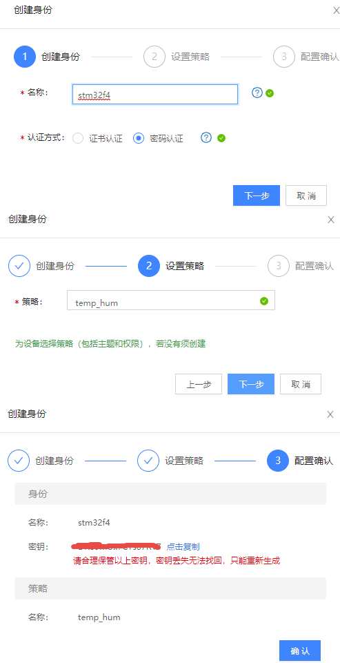
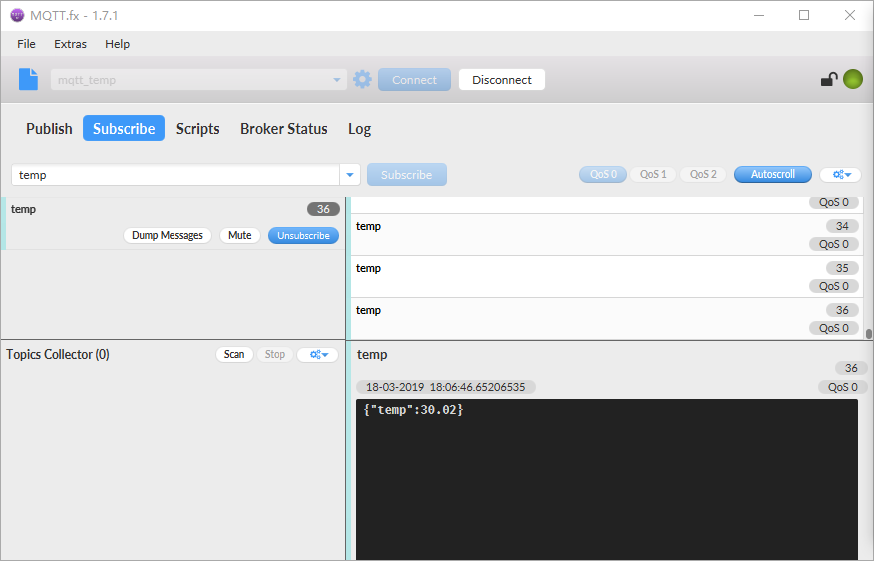

连接到百度天工物接入
--------------------

物接入简介
~~~~~~~~~~

物接入（IoT
Hub）是面向物联网领域开发者的全托管云服务，通过主流的物联网协议（如MQTT）进行通信，可以在智能设备与云端之间建立安全的双向连接，快速实现物联网项目。支持亿级并发连接和消息数，支持海量设备与云端安全可靠的双向连接，无缝对接天工平台和百度云的各项产品和服务。

物接入分为设备型和数据型两种项目类型，我们在这里使用数据型项目类型，传输一些温湿度数据，同时可以无缝对接时序数据库TSDB、物可视等，将数据实时显示出来，同时我们采用MQTT协议与云端进行通讯。

使用IoT Hub
~~~~~~~~~~~

创建计费套餐
^^^^^^^^^^^^

在使用物接入服务前，必须要创建一个百度云账号用于管理我们的设备，所有的设备信息都是在云端后台进行管理的，地址：\ `https://console.bce.baidu.com/iot2/hub/ <https://console.bce.baidu.com/iot2/hub/>`__\ 。

在使用IoT
Hub之前应先创建计费套餐并设定每个月收发消息的流量额度，每个用户只能创建一个计费套餐，所有项目将共享该套餐的额度，目前IoT
Hub的计费是很便宜的，每个月的前1000000条消息是免费的，更多的消息数量请自行参考IoT
Hub的收费说明，因此我们用它来做实验早已足够，计算一下，假设我们的开发板在一个月内不间断以3秒的频率发送一次消息到IoT
Hub，那么一个月只能发送30*24*60*(60/3) =
864000，还不到1000000条呢，因此这个流量用来做实验早就绰绰有余，即使这个月用完了流量，
下个月还有1000000条，只要当月没超出这个流量都是可以免费使用，具体见 图22_1_。

图 22‑1创建计费套

创建项目
^^^^^^^^

IoT Hub是用于物联网设备的后台管理的，将设备接入IoT
Hub的第二步就是创建一个项目，每个项目会对应一个接入点（endpoint），一个项目就表示一个完整的物接入服务，首先登录物接入控制台页面：\ `https://console.bce.baidu.com/iot2/hub/project/list <https://console.bce.baidu.com/iot2/hub/project/list>`__\ ，点击“创建项目”，填写需要创建
IoT Hub
服务的项目名称、选择项目类型为数据型，并提交即可，创建的项目，默认具有多种通信方式，
我们暂时只关注TCP连接方式即可，因为开发板是采用MQTT协议与云端交互的，端口号是1883，
具体见 图22_1_ 与 图22_3_。

此处补充说明一点：通过项目可以将不同项目的设备进行隔离和管理，一个项目下允许有多个用户（设备），用户与身份进行绑定，而每个身份需要绑定一个策略，而策略下可以创建多个不同的主题，因此一个设备可以订阅多个不同的主题，并且同一个项目下的主题是共享的，所有的设备均可进行订阅。

图 22‑2创建项目

图 22‑3创建完成

创建策略
^^^^^^^^

首先我们点击“fire_temp_hum”项目，进入项目里面，首先创建一个策略（简单来说就是主题），
输入对应的名称与主题，选择发布与订阅权限，当创建完成后，项目下的设备就可以订阅这个主题，具体见 图22_4_。

图 22‑4创建策略

创建身份与创建用户
^^^^^^^^^^^^^^^^^^

身份是开发板连接IoT
Hub的重要途径，这里面包含了秘钥，标识着开发板能否通过IoT
Hub的验证，这也是安全保障的主要操作，首先点击“身份列表”，再点击“创建身份”，然后根据自己的信息进行填写，
在这里要注意的是需要勾选密码验证，再选择之前我们创建的策略进行绑定（如果没有则必须创建），
当身份创建完成时候生成的秘钥是用于开发板连接IoT
Hub的必要条件，记住不能丢失，如果丢失了就找不回来了，在创建的时候就把它保存好，具体见 图22_6_。

在创建用户的时候，只需要把用户名设置好，然后再绑定身份即可，这样子一个设备就对应到云端了，
并且可以向策略中设置的主题发布消息和订阅主题，具体见 图22_5_。

图 22‑5创建用户并绑定身份

图 22‑6创建身份

当所有的东西都创建完成，我们点击身份操作中的“测试连接”，在网页上测试一下我们能不能正常进行MQTT通信、发布与定阅主题，
在页面中输入刚刚保存的秘钥，点击“connect”进行连接测试，如果前面的步骤全部做完，并且秘钥是正确的，
就可以发现我们的连接是正常的，然后我们订阅一下之前创建策略时候的主题名字“temp&hum”，再向这个主题发送一个消息，
消息的内容由自己定义，具体见 图22_7_。

图 22‑7测试连接

MQTT软件测试连接
^^^^^^^^^^^^^^^^

仔细观察的同学可能会发现，这个连接的端口是8884，因为这是在网页上测试连接的，所以端口不一样是正常的，那么我们也可以使用MQTT客户端软件进行连接测试，首先在我们论坛中提供的资料下载客户端软件，\ `http://www.firebbs.cn/forum.php?mod=viewthread&tid=26274&fromuid=37393 <http://www.firebbs.cn/forum.php?mod=viewthread&tid=26274&fromuid=37393>`__\ ，然后进行安装，就可以利用软件当做客户端去测试连接天工物接入平台，MQTT.fx是一款基于Eclipse
Paho，使用Java语言编写的MQTT客户端工具，支持通过Topic订阅和发布消息。
打开软件，点击设置，来配置客户端的基本信息，填写用户名与密码，进行连接，具体见 图22_8_

图 22‑8配置MQTT客户端软件

配置完成之后，可以尝试连接，点击Connetc，当连接成功后，下面的Publish与Subscribe等选项是可以选择的，
那么我们点击订阅选项Subscribe，输入订阅的主题，然后点击subscribe，可以发现已经成功订阅，
具体见 图22_9_，但是此时还未有消息，因此我们需要去Publish选项中向这个主题发布消息，
当发布成功后，订阅的主题就会回显出服务器发送给客户端的消息，
具体见 图22_10_。

图 22‑9订阅主题

图 22‑10发布消息与收到消息

这样子说明我们已经能正常连接到百度天工物了，下一步就是使用开发板进行连接测试。

开发板连接IoT Hub
~~~~~~~~~~~~~~~~~

首先拿到上一章移植好的例程，打开mqttclient.h文件，配置连接的参数，如服务器域名（此处需要开启DNS
域名解析功能），然后配置端口号、用户名与秘钥（这里的秘钥是自己的，根据实际情况进行配置），配置订阅的主题等信息，具体见
代码清单22_1_。

代码清单 22‑1mqttclient.h的宏定义配置

.. code-block:: c
   :name: 代码清单22_1

    #ifdef    LWIP_DNS
    #define   HOST_NAME       "rvmbdy8.mqtt.iot.gz.baidubce.com"   //服务器域名
    #else
    #define   HOST_NAME       "14.215.190.20"     //服务器IP地址
    #endif

    //#define   HOST_IP       "129.204.201.235"
    #define   HOST_PORT     1883    //由于是TCP连接，端口必须是1883

    #define   CLIENT_ID     "client_ID"         //随机的id
    #define   USER_NAME     "rvmbdy8/stm32f4"     //用户名
    #define   PASSWORD      "9EeVCRrCN5i6XXXX"  //秘钥

    #define   TOPIC         "temp&hum"      //订阅的主题

    #define   TEST_MESSAGE  "test_message"  //发送测试消息

然后开始连接到云平台，首先我们介绍一下我们提供的封装代码，看看MQTT客户端是怎么连接到云平台的，具体见
代码清单22_2_。

代码清单 22‑2连接到云平台

.. code-block:: c
   :name: 代码清单22_2

    void Client_Connect(void)
    {
        char* host_ip;

    #ifdef  LWIP_DNS
        ip4_addr_t dns_ip;
        netconn_gethostbyname(HOST_NAME, &dns_ip);		(1)
        host_ip = ip_ntoa(&dns_ip);
        PRINT_DEBUG("host name : %s , host_ip : %s\n",HOST_NAME,host_ip);
    #else
        host_ip = HOST_NAME;
    #endif
    MQTT_START:

        //创建网络连接
        PRINT_DEBUG("1.开始连接对应云平台的服务器...\n");
        PRINT_DEBUG("服务器IP地址：%s，端口号：%0d！\n",host_ip,HOST_PORT);
        while (1)
        {
            //连接服务器
            MQTT_Socket = transport_open((int8_t*)host_ip,HOST_PORT); (2)
            //如果连接服务器成功
            if (MQTT_Socket >= 0)
            {
                PRINT_DEBUG("连接云平台服务器成功！\n");
                break;
            }
            PRINT_DEBUG("连接云平台服务器失败，等待3秒再尝试重新连接！\n");
            //等待3秒
            vTaskDelay(3000);
        }

        PRINT_DEBUG("2.MQTT用户名与秘钥验证登陆...\n");
        //MQTT用户名与秘钥验证登陆
        if (MQTT_Connect() != Connect_OK)				(3)
        {
            //重连服务器
            PRINT_DEBUG("MQTT用户名与秘钥验证登陆失败...\n");
            //关闭链接
            transport_close();
            goto MQTT_START;
        }

        //订阅消息
        PRINT_DEBUG("3.开始订阅消息...\n");
        //订阅消息
        if (MQTTSubscribe(MQTT_Socket,(char *)TOPIC,QOS1) < 0)	(4)
        {
            //重连服务器
            PRINT_DEBUG("客户端订阅消息失败...\n");
            //关闭链接
            transport_close();
            goto MQTT_START;
        }

        //无限循环
        PRINT_DEBUG("4.开始循环接收订阅的消息...\n");

    }

代码清单 22‑2\ **(1)**
：如果打开了DNS域名解析功能，就将天工物的域名进行解析，转成IP地址。

代码清单 22‑2\ **(2)**
：根据IP地址与端口号建立TCP连接，这个函数的功能在一开始的时候就已经讲解过了，如果没能连接成功就等待3秒重新尝试连接直到连接成功。

代码清单 22‑2\ **(3)**
：调用MQTT_Connect()函数进行验证操作，验证用户名与密码是否准确，如果无法通过验证，就终止TCP连接，然后goto
MQTT_START尝试重新连接，该函数具体见代码清单 22‑3。

代码清单 22‑2\ **(4)**
：调用MQTTSubscribe()函数订阅主题，指定主题的名字，与消息服务质量，该函数的实现具体见
代码清单22_3_。

代码清单 22‑3 连接相关函数

.. code-block:: c
   :name: 代码清单22_3

    uint8_t MQTT_Connect(void)
    {
        MQTTPacket_connectData data = MQTTPacket_connectData_initializer; (1)
        uint8_t buf[200];
        int buflen = sizeof(buf);
        int len = 0;
        data.clientID.cstring = CLIENT_ID;      //可以是随机的
        data.keepAliveInterval = KEEPLIVE_TIME; //保持活跃
        data.username.cstring = USER_NAME;      //用户名
        data.password.cstring = PASSWORD;       //秘钥
        data.MQTTVersion = MQTT_VERSION;        //3表示3.1版本，4表示3.11版本
        data.cleansession = 1;
        //组装消息
        len = MQTTSerialize_connect((unsigned char *)buf, buflen, &data); (2)
        //发送消息
        transport_sendPacketBuffer(buf, len);			(3)

        /* 等待连接响应 */
        if (MQTTPacket_read(buf, buflen, transport_getdata) == CONNACK) (4)
        {
            unsigned char sessionPresent, connack_rc;
            if (MQTTDeserialize_connack(&sessionPresent, &connack_rc,
                            buf, buflen) != 1 || connack_rc != 0)
            {
                PRINT_DEBUG("无法连接，错误代码是: %d！\n", connack_rc);
                return Connect_NOK;
            }
            else
            {
                PRINT_DEBUG("用户名与秘钥验证成功，MQTT连接成功！\n");
                return Connect_OK;
            }
        }
        else
            PRINT_DEBUG("MQTT连接无响应！\n");
        return Connect_NOTACK;
    }

    /************************************************************************
    ** 函数名称: MQTTSubscribe
    ** 函数功能: 订阅消息
    ** 入口参数: int32_t sock：套接字
    **           int8_t *topic：主题
    **           enum QoS pos：消息质量
    ** 出口参数: >=0:发送成功 <0:发送失败
    ** 备    注:
    ************************************************************************/
    int32_t MQTTSubscribe(int32_t sock,char *topic,enum QoS pos)
    {
        static uint32_t PacketID = 0;
        uint16_t packetidbk = 0;
        int32_t conutbk = 0;
        uint8_t buf[100];
        int32_t buflen = sizeof(buf);
        MQTTString topicString = MQTTString_initializer;
        int32_t len;
        int32_t req_qos,qosbk;

        fd_set readfd;
        struct timeval tv;
        tv.tv_sec = 2;
        tv.tv_usec = 0;

        FD_ZERO(&readfd);
        FD_SET(sock,&readfd);

        //复制主题
        topicString.cstring = (char *)topic;
        //订阅质量
        req_qos = pos;

        //串行化订阅消息
        len = MQTTSerialize_subscribe(buf, buflen, 0,
                                    PacketID++, 1, &topicString, &req_qos);
        //发送TCP数据
        if (transport_sendPacketBuffer(buf, len) < 0)		(5)
            return -1;

        //等待可读事件--等待超时
        if (select(sock+1,&readfd,NULL,NULL,&tv) == 0)		(6)
            return -2;
        //有可读事件--没有可读事件
        if (FD_ISSET(sock,&readfd) == 0)
            return -3;

        //等待订阅返回--未收到订阅返回
        if (MQTTPacket_read(buf, buflen, transport_getdata) != SUBACK)
            return -4;

        //拆订阅回应报文
        if (MQTTDeserialize_suback(&packetidbk,1,
                                &conutbk, &qosbk, buf, buflen) != 1)
            return -5;

        //检测返回数据的正确性
        if ((qosbk == 0x80)||(packetidbk != (PacketID-1)))
            return -6;

        //订阅成功
        return 0;
    }

代码清单
22‑3\ **(1)**\ ：首先定义一个MQTTPacket_connectData类型的结构体，它是MQTT库中提供的结构体，
用于MQTT建立会话时候的字段填充，我们从MQTT连接报文也知道，它有很多字段，因此我们需要填写对应的字段，
如客户端ID、保存活跃的时间、用户名、密码、MQTT版本等信息，当然也可以选择遗嘱消息等。

代码清单
22‑3\ **(2)**\ ：调用MQTT库提供的MQTTSerialize_connect()函数，将我们定义的数据组装好，也可以称之为串行格式化数据，
然后我们就可以直接将组装好的数据发送出去，这样子能满足服务器的处理数据格式要求。

代码清单
22‑3\ **(3)**\ ：调用底层transport_sendPacketBuffer()函数将数据发送出去。

代码清单
22‑3\ **(4)**\ ：调用MQTTPacket_read()函数等待着服务器的连接应答报文，如果等不到就表示没建立会话。

代码清单
22‑3\ **(5)**\ ：对于订阅主题，也是差不多的操作，调用MQTTSerialize_connect()函数将数据封装好，再发送出去。

代码清单
22‑3\ **(6)**\ ：等待着服务器的回应，如果有消息回应，就将订阅回应报文拆解，得到相关的信息。

在建立会话之后，我们就能发布与订阅消息了，当然，如果需要订阅多个主题，在合适的地方将订阅主题的函数再调用一次即可，注意传递的参数是主题的名称。

我们使用DHT11传感器采集温湿度数据，然后将这些数据实时上报到云端，打开我们的配套例程，将程序编译，
下载到开发板，打开串口调试助手，复位就可以看到实验的现象，具体见 图22_11_。

图 22‑11发布与订阅主题实验现象

IoT Hub的规则引擎
~~~~~~~~~~~~~~~~~

什么是规则引擎
^^^^^^^^^^^^^^

什么是规则引擎？简单来说就是一个中间层，它在软件上的实现能省去很多if/else等判断的嵌套。但是我们现在说的IoT
Hub规则引擎是为了让业务逻辑更加清晰，从海量的物联网数据筛选出适合的数据，并将其进行储存、转发、汇报等操作，让业务规则也变得更加简单，因为在物联网中，数据量是非常巨大的，业务规则更是多种多样，IoT
Hub规则引擎就是需要将海量的数据与千奇百怪的业务规则变得简单，以适应业务规则的多样性，我们只需要在后台设置一些规则，就能让数据产生不同的作用。而物联网产品会产生大量的数据上报到云端，这些数据往往对应着不同的应用分析场景，如监控厂区的温度湿度监控点，每分钟都会有温度和湿度数据传往云端，对于这些数据，我们往往希望它们发挥不同的作用，并且实时性要非常好，以便在出现问题的时候第一时间能得到告警作用，例如以下应用场景：

1. 实时告警异常的数据，如温度湿度过高或者过低；

2. 分析数据，统计两个小时内的温度最大最小和均值等；

3. 将全部的数据做冷备份以便查询；

4. 对去除异常数据之后的正常数据做数据分析和预测等等。

而规则引擎就是通过灵活的设定规则，将设备传上云端的数据，送往不同的数据目的地（如监控告警设备、时序数据库TSDB、Kafka、
对象存储BOS等）以达到不同的业务目标，其示意图具体见 图22_12_。

图 22‑12规则引擎示意图

使用规则引擎
^^^^^^^^^^^^

在使用规则引擎之前，我们需要指定，规则引擎处理的数据是JSON数据（查询字段为*且约束条件为空的规则除外），因此我们需要将数据以JSON格式上报云端，这样子才能让规则引擎识别到我们的数据，然后明确使用规则引擎的目的，比如我们要监控温度数据，只有当温度高于30℃（此处是为了方便测试而选取的温度值）的时候，就告警一下温度数据，那么问题来了，这些数据应该告警到哪里呢？所以我们需要创建一个监控设备，按照之前创建开发板设备一样，创建一个监控温度的设备，此处就不再赘述过程，我们创建一个MQTT上位机软件作为监控设备的客户端，监控开发板上报的温湿度数据。

首先打开设置规则引擎的网页：\ `https://console.bce.baidu.com/iot2/re/rule/list <https://console.bce.baidu.com/iot2/re/rule/list>`__\ ，点击创建一个规则引擎，填写要处理数据的实例（项目）和主题“temp&hum”，在输入完成的时候，如果我们开发板运行程序，那么测速输入就会有数据，当然，也能自己将数据输入来测试规则引擎是否可用，然后在查询字段中填写“temp”，表示查询数据中的temp字段内容，而约束条件表示对数据的处理，比如我们输入“temp>30”就表示只对“temp”值大于30的数据进行处理，通过测试我们也知道，当前“temp”的值是25.06，还不满足规则引擎的约束条件，因此是不会有数据输出的。此外我们还需设置数据目的地，即规则满足引擎运作之后的数据要往哪里转发，是存储还是告警到监控设备中，我们在设置数据目的地的时候，选择物接入主题，选择实例和主题，完成之后就提交，其操作过程具体见 图22_13_，按编号顺序进行操作即可。

图 22‑13添加规则引擎

提示：这里设置的规则是无法写入时序数据库的。

然后在MQTT客户端软件上连到天工物，订阅temp主题，然后打开开发板，当DHT11温湿度传感器测得的温度大于30℃，
就会触发规则引擎，并且将数据转发到指定的数据目的地——temp主题，在MQTT软件上我们就能看到对应的数据，具体见 图22_14_。

图 22‑14触发规则引擎

数据可视化
~~~~~~~~~~

IoT Hub的时序数据库
^^^^^^^^^^^^^^^^^^^

时序数据库（Time Series
Database）是用于存储和管理时间序列数据的专业化数据库，为时间序列数据提供高性能读写和强计算能力的分布式云端数据库服务。时序数据库特别适用于物联网设备监控和互联网业务监控场景。

在物联网场景下，时序数据库有非常广泛的应用。如工业生产环境下，每个厂区有大量的监测点，如果以10秒的频率发送监测点的数据。1万个监测点每年会产生310亿左右的数据点，时序数据库不仅可以轻松存储海量数据点，还可以对这些数据进行快速查询，而且IoT
Hub提供的物可视能让大量的数据通过图形化（仪表、折线图、柱形图等）实时显示，更加直观，由于规则引擎的设置，
使得管理人员不用盯着海量数据找到异常数据；同时还能利用大数据工具分析数据，
一般时序数据库的运作流程如下，具体见 图22_15_。

图 22‑15时序数据库

在使用顺序数据库之前，我们先创建一个时序数据库，打开连接：\ `https://console.bce.baidu.com/iot2/tsdb/list <https://console.bce.baidu.com/iot2/tsdb/list>`__\ ，然后点击“创建数据库”，根据实际需求进行创建操作，注意，时序数据库是需要钱的，不过不贵，每个月100万点写入只需要2块钱，我们用来测试的早就足以。

从 图22_15_ 的流程我们也知道，开发板采集的温湿度数据想要写入时序数据库，必须通过规则引擎，
而且还必须满足时序数据库的写入要求，因此我们需要先设置规则引擎，具体见 图22_16_。

图 22‑16设置写入时序数据库的规则引擎

首先我们想要筛选温度数据，那么我们在查询字段中写入：

代码清单 22‑4时序数据库的规则引擎设置

.. code-block::
   :name: 代码清单22_4

    ts AS `timestamp`,
    'temp' AS metric,
    temp AS `value`,
    name AS `name`

这段代码表示将设备的温度数据写入到名为temp的metric里的默认域value里面去，时间戳为消息自带的ts字段（如果没有就是系统时间），把name的内容写入到name字段中，可以查看一下写入时序数据库后的格式预览，如果符合需求就可以写入，当然，这些规则是由我们自己定义的，大家可以随意设置，此外点击查询字段的“SQL模板”，会弹出提示，有很多规则的说明，大家自行参考。

同理对湿度的数据也是这样子写入时序数据库，在此就不再重复赘述。

IoT Hub的物可视
^^^^^^^^^^^^^^^

操作这一步之前，必须将数据写入了时序数据库，然后通过物可视页面进行创建，打开：\ `https://console.bce.baidu.com/iot2/viz2/#/workspaces <https://console.bce.baidu.com/iot2/viz2/#/workspaces>`__\ ，创建一个工作区，然后点击“新建仪表盘”，拖动仪表盘到画布上，具体见 图22_17_

图 22‑17仪表盘

然后设置自定义的格式，关于设置显示的内容就不过多讲解，此处主要是讲解从时序数据库得到数据并且显示的过程。

首先在数据区域新建一个数据表，数据表的数据来源是时序数据库，具体见 图22_18_。

图 22‑18新建数据表

然后在数据表中填写各项信息，度量Metric就是我们之前在写入时序数据库时候设置的度量，
域Field就是我们写入数据库时候设置的温度值，，标签就是name，然后勾选自动更新，更新时间为5秒即可，具体见 图22_19_。

图 22‑19数据表信息完善

设置好数据表之后，就可以给仪表盘绑定数据源，首先在设计中点击仪表盘，选择数据设置，点击指标值的“绑定按钮”，
选择其中一个数据表，然后进行绑定，当绑定成功，仪表盘的数据就会跟随数据表中的值动态变化，当然，
数据表的数据更新是5秒钟，会稍有延迟，不过影响不大，具体见 图22_20_。

同理对于湿度数据也是这样子的操作流程，设置规则引擎，将湿度数据写入时序数据库，创建数据表并且绑定，就不再赘述。

图 22‑20绑定数据源

本次实验完成的效果图具体见图
22‑21，当然，大家也可以通过连接来查看一下这个效果：\ `https://viz.baidubce.com/prod/sharing/dashboard/b8dc632168679b05fe79c9a16f48942b <https://viz.baidubce.com/prod/sharing/dashboard/b8dc632168679b05fe79c9a16f48942b>`__\ 。它是动态更新的，只要开发板将数据上报到云端，那么这些东西就会一直工作，只要通过浏览器都能随时随地查看数据信息。

提示：此处修改了仪表盘的名称为“野火办公室温/湿度”。

图 22‑21实验效果图
