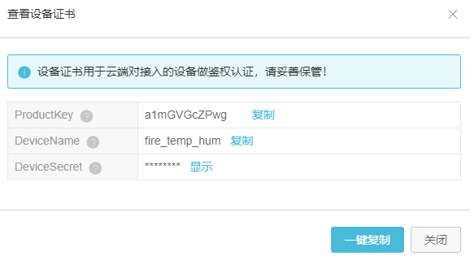

连接到阿里云物联
----------------

既然懂得专门连接百度天工物接入，那么连接阿里云物联其实也是一样的，因为都是基于MQTT协议进行通信的，首先打开阿里云物联：\ `https://iot.console.aliyun.com/product <https://iot.console.aliyun.com/product>`__\ ，创建账号并登陆，而且阿里云物联是需要通过实名认证才能使用的。

相对于百度天工物接入，阿里云物联的安全性更好，因为即使是客户端连接服务器都需要各种验证，还使用哈希加密算法进行加密。

使用阿里云物联
~~~~~~~~~~~~~~

下面开始使用阿里云物联，首先在“产品”信息中创建一个产品，每个产品下允许有多个设备，产品就是设备的集合，通常是一组具有相同功能定义的设备集合。例如：产品指同一个型号的产品，设备就是该型号下的某个设备。操作步骤“创建产品”->“高级产品”->填写产品信息，联网方式选择“以太网”，这样子一个产品就创建完成。

然后在“设备”选项中添加一个设备，比如我们添加一个“fire_temp_hum”设备，是开发板的温湿度数据采集设备，
在创建完成后，会有设备证书，这个一定要保存好，丢失了就找不回来了，具体见 图23_1_。

图 23‑1设备证书

最后我们定义一个主题（Topic类列表），让设备能对这个主题进行订阅或者发布操作，回到“产品”选项，
选择“Topic类列表”，定义“Topic类列表”，具体见 图23_2_，再填写“Topic类列表”的信息即可，
注意选择设备的操作权限“发布和订阅”，这点很重要，如果没有权限，设备是无法对这个主题进行操作的，
具体见 图23_3_，至此，一个产品与设备就创建完成了，当然，为了更好调试，我们可以尝试创建多个设备，
以备在后续进行调试。

图 23‑2 Topic类列表

图 23‑3 Topic类列表信息

MQTT软件测试连接
~~~~~~~~~~~~~~~~

在创建完成后，可以通过MQTT软件来测试一下能否正常连接，在这一步之前必须已在物联网平台控制台中创建产品和设备，并获取设备证书信息（ProductKey、DeviceName和DeviceSerect）。

打开软件，点击设置图标，配置连接的信息，具体见 图23_4_，只不过这里的配置比百度云天工物接入麻烦很多，
因为考虑了安全的问题，需要进行加密验证。

图 23‑4MQTT软件配置

这个参数看起来很简单，但是它的组成却不简单，下面具体介绍一下参数是怎么来的，具体见表格
23‑1。

表格 23‑1连接的参数设置

+----------------+------------------------------------------------------------+
|      参数      |                            说明                            |
+================+============================================================+
| Profile Name   | 自定义名称                                                 |
+----------------+------------------------------------------------------------+
| Profile Type   | 选择MQTT Broker                                            |
+----------------+------------------------------------------------------------+
| Broker Address | 连接域名。                                                 |
|                |                                                            |
|                | 格式：${YourProductKey}.iot-as-mqtt.                       |
|                | ${region}.aliyuncs.com。                                   |
|                |                                                            |
|                | 其中：                                                     |
|                |                                                            |
|                | ${YourProductKey}是在创建设备时候保存的YourP               |
|                | roductKey                                                  |
|                |                                                            |
|                | ${region}是你物联网平台服务所在地域的代码，一般在控制台左  |
|                | 上角就有显示，根据https://help.aliyun.com/                 |
|                | document_detail/40654.html?                                |
|                |                                                            |
|                | spm=a2c4g.11186623.2.21.1ce29ff5q                          |
|                | TtXmW替换物联网平台服务所在地域的代码即可                  |
+----------------+------------------------------------------------------------+
| Broker Port    | 因为是TCP连接，端口号为1883                                |
+----------------+------------------------------------------------------------+
| Client ID      | 格式：${clientId}securemode=3,signm                        |
|                | ethod=hmacsha1。                                           |
|                |                                                            |
|                | ${clientId}为设备的ID信息。可取任意值，长度在64字符        |
|                | 以内即可，                                                 |
|                |                                                            |
|                | securemode为安全模式，TCP直连模式设置为securemode=3        |
|                | ，TLS直连为securemode=2，                                  |
|                |                                                            |
|                | signmethod为算法类型，支持hmacmd5和hmacsha                 |
|                | 1，常用的是哈希加密。                                      |
+----------------+------------------------------------------------------------+
| User Name      | 格式：${YourDeviceName}&${YourPrduct                       |
|                | Key}                                                       |
|                |                                                            |
|                | 由设备名DeviceName、符号（&）和产品ProductKey              |
|                | 组成，这些信息在创建设备的时候都已经保存的。               |
+----------------+------------------------------------------------------------+
| Password       | 密码由参数值拼接加密而成，可以使用Password生成小工具生成。 |
|                |                                                            |
|                |                                                            |
|                | 小工具可以从我们提供的资料中下载：                         |
|                |                                                            |
|                |                                                            |
|                | `http://www.firebbs.cn/forum.php?                          |
|                | mod=viewthread&tid=26274&fromuid=                          |
|                | 37393 <http://www.firebbs.cn/foru                          |
|                | m.php?mod=viewthread&tid=26274&fr                          |
|                | omuid=37393>`__\ ，小工具的使用具体见 图23_5_              |
|                |                                                            |
|                | ，填写对应的信息，然后生成password，就可以用来连接         |
|                | 了，注意的是clientId是填写前面自己定义的clientId即         |
|                | 可。                                                       |
+----------------+------------------------------------------------------------+

图 23‑5Password生成小工具

把信息全部填写完毕，可以测试连接，点击Connect，然后在订阅选项Subscribe中，
输入订阅的主题“/a1MZHjK2SCF/fire_temp_hum/user/temp_hum”，这个主题可以在“设备”选项中的“Topic列表”得到，
然后点击subscribe，可以发现已经成功订阅，然后对这个主题进行发布操作，我们就能看到订阅已经收到发布的消息，
表明MQTT通信成功，具体见 图23_6_。

.. image:: media/image6.png
   :align: center
   :alt: 图 23‑6测试成功
   :name: 图23_6

图 23‑6测试成功

与此同时，在阿里云物联的控制台中可以看到设备是处于在线状态的，这就说明我们的连接是正常的，具体见
图23_7_。

图 23‑7设备状态

开发板连接阿里云物联
~~~~~~~~~~~~~~~~~~~~

接下来就使用开发板进行连接阿里云物联，其实在连接百度天工物接入的时候，我们就已经封装好一整套MQTT连接云平台的函数接口，
现在只需要修改一下mqttclient.h头文件的宏定义即可，具体见 代码清单23_1_。

代码清单 23‑1mqttclient.h宏定义

.. code-block:: c
   :name: 代码清单23_1

    #if    LWIP_DNS
    #define   HOST_NAME     \
        "a1MZHjK2SCF.iot-as-mqtt.cn-shanghai.aliyuncs.com"  //服务器域名
    #else
    #define   HOST_NAME       "139.196.135.135"     //服务器IP地址
    #endif

    #define   HOST_PORT     1883    //由于是TCP连接，端口必须是1883

    #define   CLIENT_ID     "12345|securemode=3,signmethod=hmacsha1|"         //
    #define   USER_NAME     "fire_temp_hum&a1MZHjK2SCF"     //用户名
    #define   PASSWORD      "D6419896E7BEAF8BD9D03C88BF854EA0D3XXXXX"  //密码

    #define   TOPIC         "/a1MZHjK2SCF/fire_temp_hum/user/temp_hum" //主题
    #define   TEST_MESSAGE  "test_message"  //发送测试消息

将程序编译并且下载到开发板上，就能看到连接的实验现象，整个代码的运作过程也是一样的，因为都是MQTT协议通信，首先与服务器建立连接，然后通过MQTT报文请求建立会话，然后进行订阅主题，再发布消息，当收到消息的时候使用cJSON将消息解析出来，具体见
图23_8_。

图 23‑8实验现象

阿里云物联的规则引擎
~~~~~~~~~~~~~~~~~~~~

与百度的规则引擎作用是一样的，可以将收到的消息进行不同的业务处理，比如我们也利用规则引擎监控开发板的稳定数据。

首先，打开规则引擎设置页面：\ `https://iot.console.aliyun.com/rule/list <https://iot.console.aliyun.com/rule/list>`__\ ，点击创建一个规则，填写基本的规则信息，并且选择数据的格式是JSON格式，具体见 图23_9_。

图 23‑9创建规则

然后编写SQL语句处理数据，关于SQL语句的语法可以参考网页：\ `https://help.aliyun.com/document_detail/30554.html?spm=5176.11485173.0.0.5af859afrAuwd0 <https://help.aliyun.com/document_detail/30554.html?spm=5176.11485173.0.0.5af859afrAuwd0>`__\ 。此处就不做过多赘述，当然，阿里云物联这个平台还是很不错的，只需要我们填写少量的规则语句就能筛选出需要的数据，具体见 图23_10_。

.. image:: media/image10.png
   :align: center
   :alt: 图 23‑10设置规则
   :name: 图23_10

图 23‑10设置规则

配置好规则我们就先进行测试一下规则是否可用，点击“SQL调试”，输入我们的JSON数据，然后通过其输出验证，具体见
图23_11_，表明我们的规则是能正常运作的。

代码清单 23‑2验证数据

.. code-block:: c
   :name: 代码清单23_2

    {
        "name": "fire",
        "temp": 32.04,
        "hum":  68
    }

图 23‑11SQL测试

接下来“转发数据”选项中添加数据目的地，数据目的地可以是另一个主题、时序数据库、存储到云数据库(RDS)中、发送数据到消息队列(Message
Queue)中等等，我们就将数据转发到同产品下的另一个主题即可，这就需要我们创建多一个设备（监控设备），具体见
图23_12_。

注意，在创建规则完成后一定要记得启动规则，因为阿里云物联的规则引擎默认是不启动的，需要我们自己去启动它。

图 23‑12数据目的地

打开我们的MQTT客户端软件，并且使用新的设备进行连接（注意：不要是与开发板是同一个设备），然后订阅规则引擎转发的目的地主题；打开开发板电源，开发板连接到阿里云物平台后就会发送数据，如果满足规则就会将数据转发到目的地主题中，具体见
图23_13_。

图 23‑13实验现象
