连接到OneNET
------------

有了前面两个实验的经验，废话不多说，直接使用OneNET。

使用OneNET
~~~~~~~~~~

首先注册与登陆OneNET，然后进入开发者中心：\ `https://open.iot.10086.cn/develop/global/product/#/public <https://open.iot.10086.cn/develop/global/product/#/public>`__\ ，选择公有协议产品，点击“添加产品”，填写产品相关的信息，联网方式选择wifi（其实我们是以太网，但是没有这个选项，那就选择wifi，没啥影响的），接入协议必须选择MQTT，操作系统选择无，运营商这个随意选择，具体见 图24_1_。

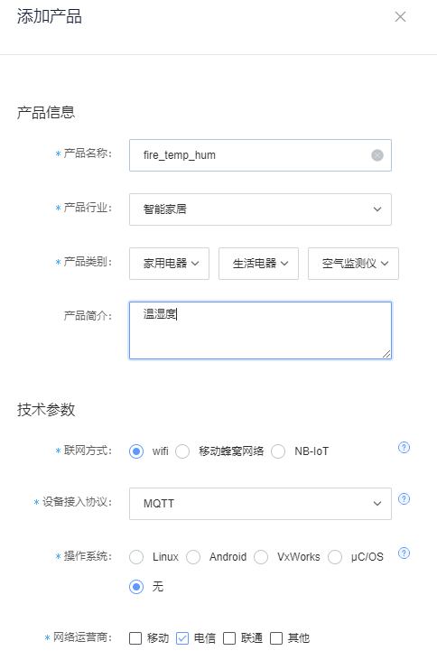

图 24‑1添加产品

在添加产品完毕，继续添加设备，填写设备的相关信息，鉴权信息就是登陆密码，不过需要注意的是，这个鉴权信息在产品内是唯一的，一般推荐使用产品序列号，可作为设备登录参数之一，不同协议设备可能鉴权信息的参数不一致，不过现在是做实验，选择一个好记的即可，数据保密性要选择私有，除此之外还剩下一些设备相关的信息，就不过多赘述，具体见
图24_2_，为了测试，我们在这里就创建2个设备，大家可以自行创建更多的设备用于测试也是可以的。

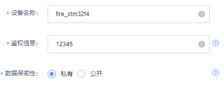

图 24‑2创建设备信息

测试连接
~~~~~~~~

OneNET的数据交互做的很好，它支持动态创建主题（除系统主题外），即不用我们在平台上创建任何的主题，只需要随意订阅某个主题即可，同一个产品下，即使是不同设备之间的主题之间的消息是共享的，简单来说，我们在开发板上可以随意向某个主题发起订阅请求，也可以向这个主题发布消息，而同一产品的其他设备如果订阅了这个主题，那么将收到开发板发布的消息数据，这样子更加方便嵌入式的开发者，只不过这样子的信息安全就没有阿里云物联那么好。

现在我们打开MQTT软件，进行连接测试，与前面的实验操作是一样的，配置好相关信息，即可，这些信息都可以在平台上找到，需要注意的是服务器地址是183.230.40.39；端口号是6002，这与我们常见的1883是不一样的；Client
ID是设备ID，在设备列表中是可以找到的；用户名是产品ID，在产品列表中可以找到；密码就是创建设备时候的鉴权信息，具体见 图24_3_。

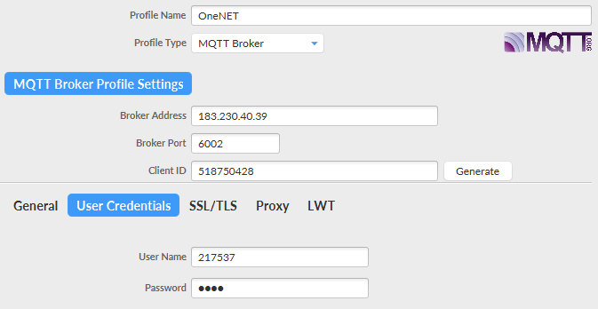

图 24‑3MQTT软件配置

配置好就可以连接，然后随便订阅一个主题，再用客户端进行发布消息，如果收到消息，表明通信成功，具体见 图24_4_。

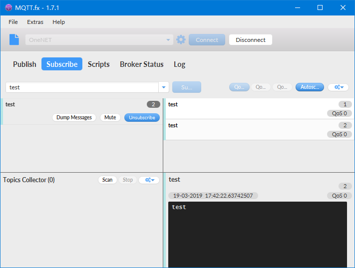

图 24‑4 测试连接结果

开发板连接OneNET
~~~~~~~~~~~~~~~~

在开发板中，我们将连接阿里云物联的代码拷贝一份，然后修改一下mqttclient.h头文件的宏定义即可，具体见代码清单
24‑1。

代码清单 24‑1mqttclient.h头文件的宏定义

.. code-block:: c
   :name: 代码清单24_1

    #if    LWIP_DNS
    #define   HOST_NAME       "mqtt.heclouds.com"     //服务器域名
    #else
    #define   HOST_NAME       "183.230.40.39"     //服务器IP地址
    #endif

    #define   HOST_PORT     6002

    #define   CLIENT_ID     "518725049"         //
    #define   USER_NAME     "217537"     //用户名
    #define   PASSWORD      "12345"  //秘钥

    #define   TOPIC         "temp_hum"      //订阅的主题
    #define   TEST_MESSAGE  "test_message"  //发送测试消息

下载到开发板上，就能连接到OneNET了，因为都是使用MQTT协议，因此连接的过程都是一样的，而且数据的订阅与发布也是一样的，编译好程序，然后下载到开发板，就能看到发布数据与接收数据了，具体见
图24_5_。

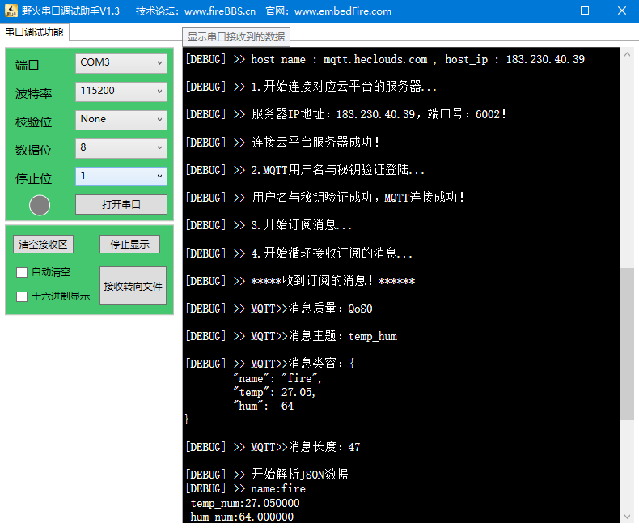

图 24‑5实验现象

此外，我们再使用MQTT软件来订阅一下开发板发布的主题“temp_hum”，很显然，软件收到了开发板发布的消息，
说明正如我们所了解一样，通信正常，具体见 图24_6_。

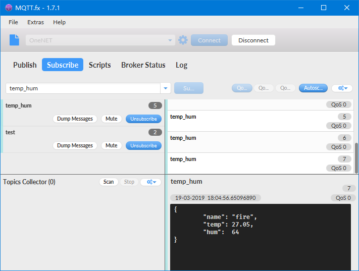

图 24‑6MQTT软件订阅temp_hum主题

添加数据流
~~~~~~~~~~

OneNET平台通过数据流与数据点来组织设备上行数据，设备上传并存储数据时，必须以key-value的格式上传数据，其中key即为数据流（stream）名称，value为实际存储的数据点（point），value格式可以为int、float、string、json等多种自定义格式，我们本书就教大家向OneNET平台上报数据点，而平台会将所有的数据点按时序进行存储，这就形成了数据流，数据流中的数据在存储的同时可以“流向”后续服务，数据流是平台后续数据服务（规则、触发器、消息队列等）的服务对象，用户可以通过选择数据流的方式选择服务的数据来源，这与我们之前的规则引擎差不多，只不过换了个说法而已。

首先在OneNET控制台中添加两个数据流，分别为temp与hum，表示温度与湿度的数据流，打开：\ `https://open.iot.10086.cn/develop/global/product/#/datasm?pid=217537 <https://open.iot.10086.cn/develop/global/product/#/datasm?pid=217537>`__\ ，点击“添加数据流模板”，填写相关信息，数据流名称填写你发布数据的JSON格式的字符串，类似于规则引擎的筛选，具体见
图24_7_，添加temp完成后再添加一个hum数据流模板。

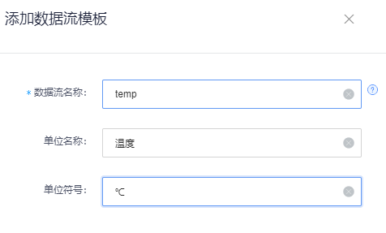

图 24‑7添加数据流模板

设备是使用 publish
报文来上传数据点的，而且上报数据点的格式也是有要求的，对于普通的主题，发布消息数据根本没有任何格式要求，随意发布数据都可以，但是对于发布数据点等与平台数据相关的操作，则必须通过系统主题进行发布，发布数据点的主题是“$dp”，“$”符号表示系统的主题，所有的数据都要往这个主题发布，否则系统是不会存储数据的，
大家在创建数据流之后，打开开发板，向OneNET平台上报数据（非“$dp”主题），然后在后台可以看到并无数据记录，具体见 图24_8_。

如果想要发送数据并让平台存储，形成数据流，将数据应用到可视化上或者其他服务，那么就必须向“$dp”主题发送数据，而向系统主题发送数据就会有格式要求，目前OneNET支持7种格式的发布，我在这里只讲解第三种格式的数据上报，因为这与我们的前面实验的数据最为相似，而其他的数据格式大家可以参考一下官方的接入资料，可以到论坛里面获取：\ `http://www.firebbs.cn/forum.php?mod=viewthread&tid=26274&fromuid=37393 <http://www.firebbs.cn/forum.php?mod=viewthread&tid=26274&fromuid=37393>`__\ 。

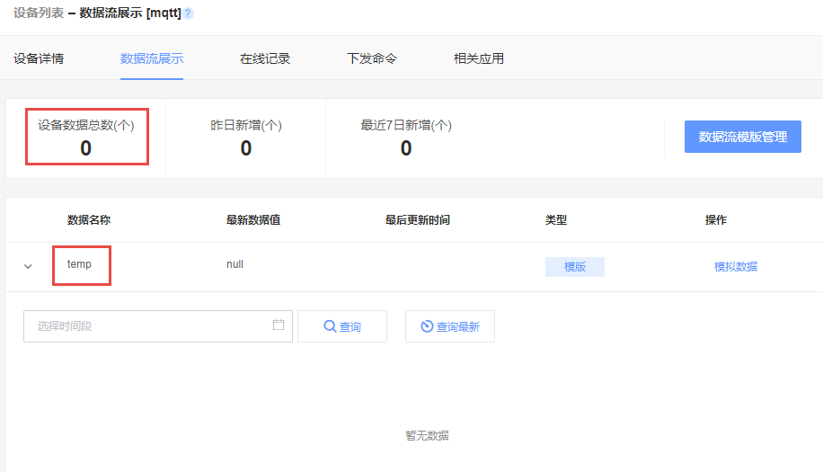

图 24‑8无数据

系统主题的发布格式
~~~~~~~~~~~~~~~~~~

从MQTT发布报文（PUBLISH）的格式我们可以知道，主题名必须是PUBLISH报文可变报头的第一个字段，而系统主题名就是“$dp”，只有当QoS等级是1或2时，报文标识符（Packet
Identifier）字段才能出现在PUBLISH报文中，那么可变报头的结构具体见 图24_9_。

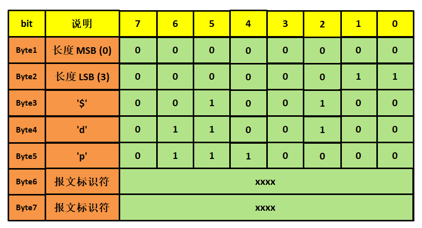

图 24‑9PUBLISH报文可变报头

有效载荷（Payload）则包含真正的数据点内容，本书只讲解第三种类型的数据格式，具体见
图24_10_，第1个字节指明了发布报文的数据类型，OneNET平台支持7种数据类型，第三种是JSON格式，因此数据字段就需要是JSON格式的数据，否则就会发生错误；第2第3字节指明了后面携带的数据长度，第二字节是数据长度的高字节位，第3字节是数据长度的低字节位；而第4字节之后就是真正的数据区域，使用JSON数据即可。

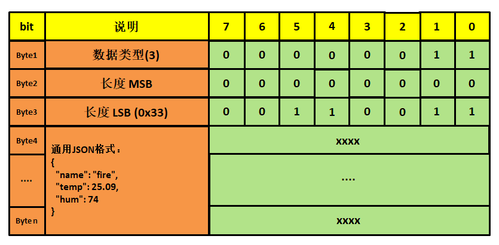

图 24‑10 Payload内容

使用开发板发布数据点
~~~~~~~~~~~~~~~~~~~~

因为是有格式的要求，我们就稍微改一下代码的接口，在数据之前添加类型、长度等字段，因为我们的代码也是自己封装好的，所以想修改也是比较简单，而MQTT层的代码也无需改动，因为是发布数据点，因此我们实现一个MQTTMsgPublish2dp()函数用于发布到“$dp”主题中，具体见
代码清单24_2_。

代码清单 24‑2 MQTTMsgPublish2dp()源码

.. code-block:: c
   :name: 代码清单24_2

    /************************************************************************
    ** 函数名称: MQTTMsgPublish2dp
    ** 函数功能: 用户推送消息到'$dp'系统主题
    ** 入口参数: MQTT_USER_MSG  *msg：消息结构体指针
    ** 出口参数: >=0:发送成功 <0:发送失败
    ** 备    注:
    ************************************************************************/
    int32_t MQTTMsgPublish2dp(int32_t sock, int8_t qos, int8_t type,uint8_t* msg)
    {
        int32_t ret;
        uint16_t msg_len = 0;
        msg_len = strlen((char *)msg);
        uint8_t* q = pvPortMalloc(msg_len+3); //目前只支持1、3、4类型的json数据
        switch (type)
        {
        case TopicType1:
            *(uint8_t*)&q[0] = 0x01;
            break;
        case TopicType3:
            *(uint8_t*)&q[0] = 0x03;
            break;
        case TopicType5:
            *(uint8_t*)&q[0] = 0x05;
            break;
        default:
            goto publish2dpfail;
        }
        *(uint8_t*)&q[0] = 0x03;
        *(uint8_t*)&q[1] = ((msg_len)&0xff00)>>8;
        *(uint8_t*)&q[2] = (msg_len)&0xff;
        memcpy((uint8_t*)(&q[3]),(uint8_t*)msg,msg_len);

        //发布消息
        ret = MQTTMsgPublish(MQTT_Socket,(char*)"$dp",qos,(uint8_t*)q,msg_len+3);

    publish2dpfail:
        vPortFree(q);
        q = NULL;
        return ret;
    }

而为了配合MQTTMsgPublish2dp()函数，我们还需要把MQTTMsgPublish()函数也稍作修改，让其传入指定的数据长度，
因为strlen()函数会在遇到ASCII码‘00’的时候认为数据已经没有了，而有效载荷的数据长度高字节位很有可能是0，
因此不使用自动统计数据，只传入指定数据长度，具体见 代码清单24_3_。

代码清单 24‑3 MQTTMsgPublish()源码

.. code-block:: c
   :name: 代码清单24_3

    /********************************************************
    ** 函数名称: mqtt_msg_publish
    ** 函数功能: 用户推送消息
    ** 入口参数: MQTT_USER_MSG  *msg：消息结构体指针
    ** 出口参数: >=0:发送成功 <0:发送失败
    ** 备    注:
    *******************************************************/
    int32_t MQTTMsgPublish(int32_t sock,
                        char *topic,
                        int8_t qos,
                        uint8_t* msg,
                        uint16_t msg_len)
    {
        int8_t retained = 0;      //保留标志位
        // uint32_t msg_len;         //数据长度
        uint8_t buf[MSG_MAX_LEN];
        int32_t buflen = sizeof(buf),len;
        MQTTString topicString = MQTTString_initializer;
        uint16_t packid = 0,packetidbk;

        //填充主题
        topicString.cstring = (char *)topic;

        //填充数据包ID
        if ((qos == QOS1)||(qos == QOS2))
        {
            packid = GetNextPackID();
        }
        else
        {
            qos = QOS0;
            retained = 0;
            packid = 0;
        }

        // msg_len = strlen((char *)msg);
        //推送消息
        len = MQTTSerialize_publish(buf, buflen, 0, qos, retained,
                                    packid, topicString,
                                    (unsigned char*)msg, msg_len);
        if (len <= 0)
            return -1;
        if (transport_sendPacketBuffer(buf, len) < 0)
            return -2;

        //质量等级0，不需要返回
        if (qos == QOS0)
        {
            return 0;
        }

        //等级1
        if (qos == QOS1)
        {
            //等待PUBACK
            if (WaitForPacket(sock,PUBACK,5) < 0)
                return -3;
            return 1;

        }
        //等级2
        if (qos == QOS2)
        {
            //等待PUBREC
            if (WaitForPacket(sock,PUBREC,5) < 0)
                return -3;
            //发送PUBREL
            len = MQTTSerialize_pubrel(buf, buflen,0, packetidbk);
            if (len == 0)
                return -4;
            if (transport_sendPacketBuffer(buf, len) < 0)
                return -6;
            //等待PUBCOMP
            if (WaitForPacket(sock,PUBREC,5) < 0)
                return -7;
            return 2;
        }
        //等级错误
        return -8;
    }

然后在mqttclient.h头文件中修改相关的宏定义即可，在这里多添加了一个枚举类型的TopicType，
表示选择发布到“$dp”主题的类型，具体见
代码清单24_4_。

代码清单 24‑4mqttclient.h头文件宏定义

.. code-block:: c
   :name: 代码清单24_4

    #if    LWIP_DNS
    #define   HOST_NAME       "mqtt.heclouds.com"     //服务器域名
    #else
    #define   HOST_NAME       "183.230.40.39"     //服务器IP地址
    #endif

    #define   HOST_PORT     6002

    #define   CLIENT_ID     "518725049"         //
    #define   USER_NAME     "217537"     //用户名
    #define   PASSWORD      "12345"  //秘钥

    #define   TOPIC         "temp_hum"      //订阅的主题
    #define   TEST_MESSAGE  "test_message"  //发送测试消息

    enum TopicType
    {
        TopicType1 = 1,
        TopicType3 = 3,
        TopicType5 = 5
    };

编译好程序后，就下载到开发板中，然后在OneNET的控制台中可以看到数据点已经被存储了，而且能看到数据流信息，具体见
图24_11_，然后我们就能用这些数据流作为可视化的数据源。

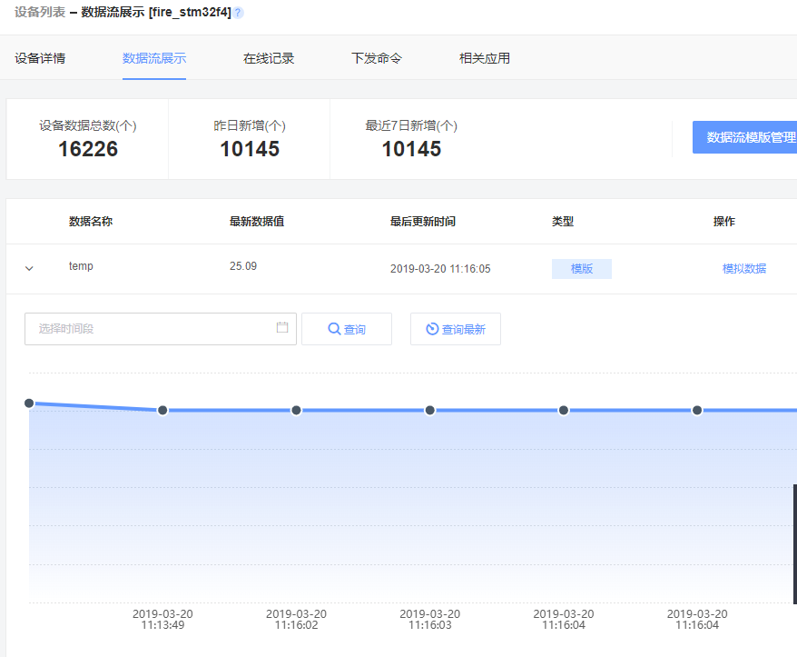

图 24‑11数据流

数据可视化
~~~~~~~~~~

与百度云一样，数据可视化需要依赖数据的来源，而上一章我们得到数据的来源，那么就利用平台自身的可视化技术来让数据实时显示，首先进入“应用管理”页面：\ `https://open.iot.10086.cn/develop/global/product/#/app/independent?pid=217537 <https://open.iot.10086.cn/develop/global/product/#/app/independent?pid=217537>`__\ ，点击添加应用，
然后填写应用的相关信息，因为是测试应用，所以选择“私有”选项即可，具体见 图24_12_。

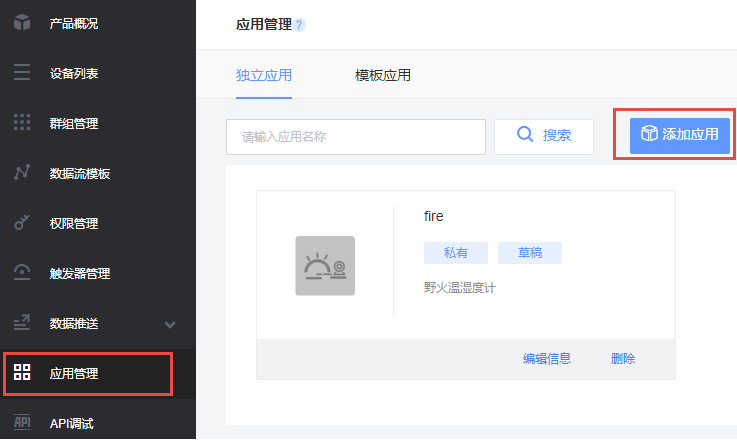

图 24‑12添加应用

在应用编辑页面，选中两个仪表盘，放到画布中，然后点击仪表盘，选择“属性”，选择设备为开发板设备“fire_stm32f4”，数据流选择我们在一开始添加的数据流“temp”，选择自动刷新的频率为3秒，同样的另一个湿度的仪表盘也是这样子操作，此外还可以添加折线图到画布中，也是一样的选择设备与数据流，至此可视化应用的设计部署就已经完成，具体见图
24‑13。然后我们就能看到数据会随着开发板发布的数据更新，演示链接：
`https://open.iot.10086.cn/iotbox/appsquare/appview?openid=c673cc3ee3e436d298494aba2e5c08b8 <https://open.iot.10086.cn/iotbox/appsquare/appview?openid=c673cc3ee3e436d298494aba2e5c08b8>`__\ 。

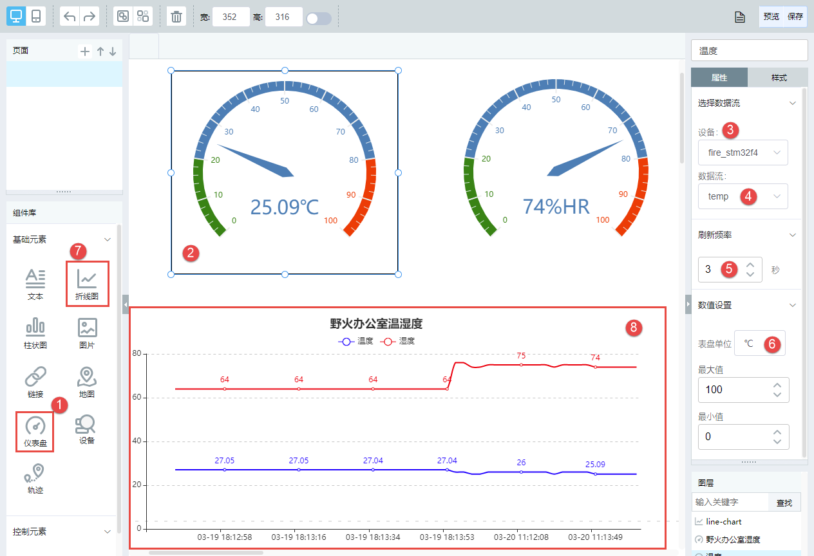

图 24‑13应用编辑
