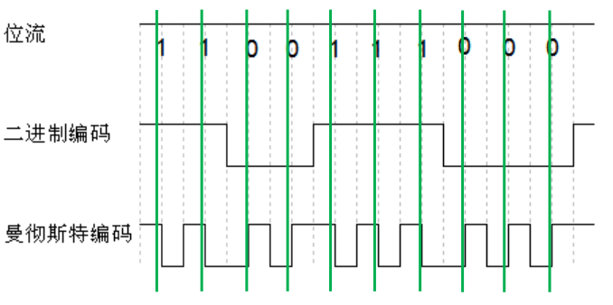
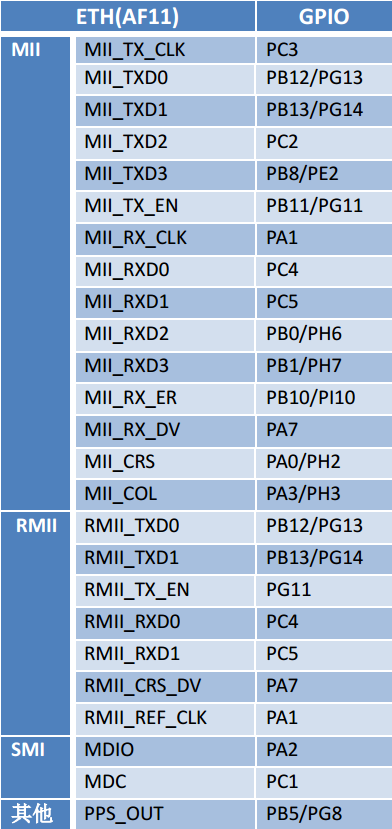

开发平台介绍
------------

本章主要讲解如何使用STM32驱动其ETH章节的讲解，讲解好了基础外设，以便后面章节讲解LwIP移植时对接底层接口。在学习本章的过程中，可以参考我们出版的书籍《STM32库开发实战指南》中的
以太网 章节。

以太网简介
~~~~~~~~~~

以太网(Ethernet)是互联网技术的一种，由于它是在组网技术中占的比例最高，很多人直接把以太网理解为互联网。

以太网是指遵守 IEEE 802.3 标准组成的局域网，由 IEEE 802.3
标准规定的主要是位于参考模型的物理层(PHY)和数据链路层中的介质访问控制子层(MAC)。在家庭、企业和学校所组建的
PC
局域网形式一般也是以太网，其标志是使用水晶头网线来连接(当然还有其它形式)。
IEEE 还有其它局域网标准，如 IEEE 802.11 是无线局域网，俗称 Wi-Fi。
IEEE802.15 是个人域网，即蓝牙技术，其中的 802.15.4 标准则是 ZigBee
技术。

现阶段，工业控制、环境监测、智能家居的嵌入式设备产生了接入互联网的需求，利用以太网技术，嵌入式设备可以非常容易地接入到现有的计算机网络中。

PHY层
^^^^^

在物理层，由 IEEE 802.3
标准规定了以太网使用的传输介质、传输速度、数据编码方式和冲突检测机制，物理层一般是通过一个
PHY
芯片实现其功能的，我们使用的是野火STM32F429挑战者开发板，板载的PHY芯片是LAN8720A。

传输介质
''''''''

传输介质包括同轴电缆、双绞线(水晶头网线是一种双绞线)、光纤。根据不同的传输速度和距离要求，基于这三类介质的信号线又衍生出很多不同的种类。最常用的是“五类线”适用于
100BASE-T 和 10BASE-T 的网络，它们的网络速率分别为 100Mbps 和 10Mbps。

编码
''''

为了让接收方在没有外部时钟参考的情况也能确定每一位的起始、结束和中间位置，在传输信号时不直接采用二进制编码。在
10BASE-T 的传输方式中采用曼彻斯特编码，在100BASE-T 中则采用 4B/5B 编码。

曼彻斯特编码把每一个二进制位的周期分为两个间隔，在表示“1”时，以前半个周期为高电平，后半个周期为低电平。表示“0”时则相反，具体见
图3_1_。

图 3‑1曼彻斯特编码

采用曼彻斯特码在每个位周期都有电压变化，便于同步。但这样的编码方式效率太低，只有
50%。

在 100BASE-T 采用的 4B/5B 编码是把待发送数据位流的每 4
位分为一组，以特定的 5位编码来表示， 这些特定的 5
位编码能使数据流有足够多的跳变，达到同步的目的，而且效率也从曼彻斯特编码的
50%提高到了 80%。

CSMA/CD 冲突检测
''''''''''''''''

早期的以太网大多是多个节点连接到同一条网络总线上(总线型网络)，存在信道竞争问题，因而每个连接到以太网上的节点都必须具备冲突检测功能。以太网具备
CSMA/CD冲突检测机制，如果多个节点同时利用同一条总线发送数据，则会产生冲突，总线上的节点可通过接收到的信号与原始发送的信号的比较检测是否存在冲突，若存在冲突则停止发送数据，随机等待一段时间再重传。

现在大多数局域网组建的时候很少采用总线型网络，大多是一个设备接入到一个独立的路由或交换机接口，组成星型网络，不会产生冲突。但为了兼容，新出的产品还是带有冲突检测机制。

MAC子层
^^^^^^^^^^

MAC的功能
''''''''''''''''

MAC
子层是属于数据链路层的下半部分，它主要负责与物理层进行数据交接，如是否可以发送数据，发送的数据是否正确，对数据流进行控制等。它自动对来自上层的数据包加上一些控制信号，交给物理层。接收方得到正常数据时，自动去除
MAC 控制信号，把该数据包交给上层。

MAC 数据包
''''''''''

IEEE 对以太网上传输的数据包格式也进行了统一规定，见
图3_2_。该数据包被称为MAC 数据包。

图 3‑2 MAC 数据包格式

MAC
数据包由前导字段、帧起始定界符、目标地址、源地址、数据包类型、数据域、填充域、校验和域组成。

-  前导字段，也称报头，这是一段方波，用于使收发节点的时钟同步。内容为连续
   7 个字节的 0x55。字段和帧起始定界符在 MAC 收到数据包后会自动过滤掉。

-  帧起始定界符(SFD)： 用于区分前导段与数据段的，内容为 0xD5。

-  MAC 地址： MAC 地址由 48
   位数字组成，它是网卡的物理地址，在以太网传输的最底层，就是根据 MAC
   地址来收发数据的。部分 MAC
   地址用于广播和多播，在同一个网络里不能有两个相同的 MAC 地址。 PC
   的网卡在出厂时已经设置好了 MAC
   地址，但也可以通过一些软件来进行修改，在嵌入式的以太网控制器中可由程序进行配置。数据包中的
   DA 是目标地址， SA 是源地址。

-  数据包类型： 本区域可以用来描述本 MAC 数据包是属于 TCP/IP 协议层的 IP
   包、 ARP包还是 SNMP 包，也可以用来描述本 MAC 数据包数据段的长度。
   如果该值被设置大于
   0x0600，不用于长度描述，而是用于类型描述功能，表示与以太网帧相关的
   MAC客户端协议的种类。

-  数据段： 数据段是 MAC 包的核心内容，它包含的数据来自 MAC
   的上层。其长度可以从 0~1500 字节间变化。

-  填充域：由于协议要求整个 MAC 数据包的长度至少为 64
   字节(接收到的数据包如果少于 64
   字节会被认为发生冲突，数据包被自动丢弃)，当数据段的字节少于 46
   字节时，在填充域会自动填上无效数据，以使数据包符合长度要求。

-  校验和域： MAC 数据包的尾部是校验和域，它保存了 CRC
   校验序列，用于检错。

以上是标准的 MAC 数据包， IEEE 802.3 同时还规定了扩展的 MAC
数据包，它是在标准的 MAC 数据包的 SA 和数据包类型之间添加 4 个字节的
QTag 前缀字段，用于获取标志的 MAC 帧。前 2 个字节固定为 0x8100，用于识别
QTag 前缀的存在；后两个字节内容分别为 3 个位的用户优先级、 1
个位的标准格式指示符(CFI)和一个 12 位的 VLAN 标识符。

STM32的ETH外设
~~~~~~~~~~~~~~

STM32F42x 系列控制器内部集成了一个以太网外设，它实际是一个通过 DMA
控制器进行介质访问控制(MAC)，它的功能就是实现 MAC
层的任务。借助以太网外设，STM32F42x 控制器可以通过 ETH 外设按照 IEEE
802.3-2002 标准发送和接收 MAC 数据包。

ETH 内部自带专用的 DMA 控制器用于 MAC， ETH
支持两个工业标准接口介质独立接口(MII)和简化介质独立接口(RMII)用于与外部
PHY 芯片连接。 MII 和 RMII 接口用于 MAC数据包传输， ETH
还集成了站管理接口(SMI)接口专门用于与外部 PHY 通信，用于访问PHY
芯片寄存器。

物理层定义了以太网使用的传输介质、传输速度、数据编码方式和冲突检测机制，PHY
芯片是物理层功能实现的实体，生活中常用水晶头网线+水晶头插座+PHY
组合构成了物理层。

ETH 有专用的 DMA 控制器，它通过 AHB 主从接口与内核和存储器相连， AHB
主接口用于控制数据传输，而 AHB 从接口用于访问“控制与状态寄存器”
(CSR)空间。在进行数据发送是，先将数据有存储器以 DMA 传输到发送 TX FIFO
进行缓冲，然后由 MAC 内核发送； 接收数据时， RX FIFO
先接收以太网数据帧，再由 DMA 传输至存储器。 ETH 系统功能框图见 图3_3_。

图 3‑3 ETH 功能框图

MII 和 RMII 接口
~~~~~~~~~~~~~~~~

介质独立接口(MII)用于理解 MAC 控制器和 PHY 芯片，提供数据传输路径。 RMII
接口是 MII 接口的简化版本， MII 需要 16 根通信线， RMII 只需 7
根通信，在功能上是相同的。图3_4_ 为 MII 接口连接示意图， 图3_5_ 为 RMII
接口连接示意图。

图 3‑4 MII 接口连接示意图

图 3‑5 RMII 接口连接示意图

-  TX_CLK：数据发送时钟线。标称速率为 10Mbit/s 时为 2.5MHz；速率为
   100Mbit/s 时为 25MHz。 RMII 接口没有该线。

-  RX_CLK：数据接收时钟线。标称速率为 10Mbit/s 时为 2.5MHz；速率为
   100Mbit/s 时为 25MHz。 RMII 接口没有该线。

-  TX_EN：数据发送使能。在整个数据发送过程保存有效电平。

-  TXD[3:0]或 TXD[1:0]：数据发送数据线。对于 MII 有 4 位， RMII 只有 2
   位。只有在TX_EN 处于有效电平数据线才有效。

-  CRS：载波侦听信号，由 PHY
   芯片负责驱动，当发送或接收介质处于非空闲状态时使能该信号。在全双工模式该信号线无效。

-  COL：冲突检测信号，由 PHY
   芯片负责驱动，检测到介质上存在冲突后该线被使能，并且保持至冲突解除。在全双工模式该信号线无效。

-  RXD[3:0]或 RXD[1:0]：数据接收数据线，由 PHY 芯片负责驱动。对于 MII 有
   4 位，RMII 只有 2 位。在 MII 模式，当 RX_DV 禁止、 RX_ER
   使能时，特定的 RXD[3:0]值用于传输来自 PHY 的特定信息。

-  RX_DV：接收数据有效信号，功能类似 TX_EN，只不过用于数据接收，由 PHY
   芯片负责驱动。对于 RMII 接口，是把 CRS 和 RX_DV 整合成 CRS_DV
   信号线，当介质处于不同状态时会自切换该信号状态。

-  RX_ER：接收错误信号线，由 PHY 驱动，向 MAC
   控制器报告在帧某处检测到错误。

-  REF_CLK：仅用于 RMII 接口，由外部时钟源提供 50MHz
   参考时钟。因为要达到 100Mbit/s 传输速度， MII 和 RMII
   数据线数量不同，使用 MII 和 RMII 在时钟线的设计是完全不同的。对于 MII
   接口，一般是外部为 PHY 提供 25MHz 时钟源，再由 PHY 提供 TX_CLK 和
   RX_CLK 时钟。对于 RMII 接口，一般需要外部直接提供
   50MHz时钟源，同时接入 MAC 和 PHY。

开发板板载的 PHY 芯片型号为 LAN8720A，该芯片只支持 RMII
接口，电路设计时参考 图3_6_。

图 3‑6 ETH 复用引脚

注：其中， PPS_OUT 是 IEEE 1588 定义的一个时钟同步机制。

PHY：LAN8720A
~~~~~~~~~~~~~

LAN8720A 是 SMSC 公司(已被 Microchip
公司收购)设计的一个体积小、功耗低、全能型 10/100Mbps
的以太网物理层收发器。它是针对消费类电子和企业应用而设计的。LAN8720A
总共只有 24Pin，仅支持 RMII 接口。由它组成的网络结构见 图3_7_。

图 3‑7由 LAN8720A 组成的网络系统结构

LAN8720A 通过 RMII 与 MAC 连接。 RJ45 是网络插座，在与 LAN8720A
连接之间还需要一个变压器，所以一般使用带电压转换和 LED 指示灯的
HY911105A 型号的插座。一般来说，必须为使用 RMII 接口的 PHY 提供 50MHz
的时钟源输入到 REF_CLK 引脚，不过LAN8720A 内部集成 PLL，可以将 25MHz
的时钟源陪频到 50MHz 并在指定引脚输出该时钟，所以我们可以直接使其与
REF_CLK 连接达到提供 50MHz 时钟效果。

LAN8720A 内部系统结构见 图3_8_。

图 3‑8LAN8720A 内部系统结构

LAN8720A
有各个不同功能模块组成，最重要的要数接收控制器和发送控制器，其它的基本上都是与外部引脚挂钩，实现信号传输。部分引脚是具有双重功能的，比如PHYAD0
与 RXER 引脚是共用的，在系统上电后 LAN8720A
会马上读取这部分共用引脚的电平，以确定系统的状态并保存在相关寄存器内，之后则自动转入作为另一功能引脚。

PHYAD[0]引脚用于配置 SMI 通信的 LAN8720A
地址，在芯片内部该引脚已经自带下拉电阻，默认认为
0(即使外部悬空不接)，在系统上电时会检测该引脚获取得到 LAN8720A的地址为 0
或者 1，并保存在特殊模式寄存器(R18)的 PHYAD 位中，该寄存器的 PHYAD有 5
个位，在需要超过 2 个 LAN8720A 时可以通过软件设置不同 SMI
通信地址。PHYAD[0]是与 RXER 引脚共用。

MODE[2:0]引脚用于选择 LAN8720A 网络通信速率和工作模式，可选 10Mbps
或100Mbps 通信速度，半双工或全双工工作模式，另外 LAN8720A 支持 HP
Auto-MDIX 自动翻转功能，即可自动识别直连或交叉网线并自适应。一般将 MODE
引脚都设置为 1，可以让 LAN8720A
启动自适应功能，它会自动寻找最优工作方式。 MODE[0]与 RXD0
引脚共用、MODE[1]与 RXD1 引脚共用、 MODE[2]与 CRS_DV 引脚共用。

nINT/REFCLKO 引脚用于 RMII 接口中 REF_CLK 信号线，当 nINTSEL
引脚为低电平是，它也可以被设置成 50MHz 时钟输出，这样可以直接与
STM32F42x 的 REF_CLK 引脚连接为其提供 50MHz 时钟源，这种模式要求为 XTAL1
与 XTAL2 之间或为 TAL1/CLKIN提供 25MHz 时钟，由 LAN8720A 内部 PLL
电路陪频得到 50MHz 时钟，此时nIN/REFCLKO 引脚的中断功能不可用，用于
50MHz 时钟输出。当 nINTSEL 引脚为高电平时，LAN8720A
被设置为时钟输入，即外部时钟源直接提供 50MHz 时钟接入 STM32F42x的
REF_CLK 引脚和 LAN8720A 的 XTAL1/CLKIN 引脚，此时INT/REFCLKO
可用于中断功能。 nINTSEL 与 LED2 引脚共用，一般使用下拉。

REGOFF 引脚用于配置内部+1.2V 电压源， LAN8720A 内部需要+1.2V
电压，可以通过VDDCR 引脚输入+1.2V 电压提供，也可以直接利用 LAN8720A
内部+1.2V 稳压器提供。当REGOFF 引脚为低电平时选择内部+1.2V 稳压器。
REGOFF 与 LED1 引脚共用。

SMI 支持寻址 32 个寄存器， LAN8720A 只用到其中 14 个，参考 图3_9_。

图 3‑9LAN8720A 寄存器列表

序号与 SMI 数据帧中的 RADDR
是对应的，这在编写驱动时非常重要，本文将它们标记为
R0~R31。寄存器可规划为三个组： Basic、 Extended 和
Vendor-specific。Basic 是IEEE802.3 要求的， R0 是基本控制寄存器，其位 15
为 Soft Reset 位，向该位写 1 启动LAN8720A
软件复位，还包括速度、自适应、低功耗等等功能设置。 R1
是基本状态寄存器。Extended 是扩展寄存器，包括 LAN8720A 的 ID
号、制造商、版本号等等信息。Vendorspecific 是供应商自定义寄存器， R31
是特殊控制/状态寄存器，指示速度类型和自适应功能。

硬件设计
~~~~~~~~

在讲解移植步骤之前，有必须先介绍我们的实验硬件设计，主要是 LAN8720A
通过RMII 和 SMI 接口与 STM32F42x 控制器连接，见 图3_10_。

图 3‑10PHY 硬件设计

电路设计时，将 NINTSEL 引脚通过下拉电阻拉低，设置 NINT/FEFCLKO
为输出50MHz 时钟，当然前提是在 XTAL1 和 XTAL2 接入了 25MHz
的时钟源。另外也把REGOFF 引脚通过下拉电阻拉低，使能使用内部+1.2V
稳压器。

软件设计
~~~~~~~~

获取STM32的裸机工程模板
^^^^^^^^^^^^^^^^^^^^^^^^^^

STM32的裸机工程模板我们直接使用野火STM32开发板配套的HAL库例程即可。这里我们选取比较简单的例程—“GPIO输出—使用固件库点亮LED”作为裸机工程模板。该裸机工程模板均可以在对应板子的A盘/程序源码目录下获取到，下面以野火STM32F429-挑战者开发板的光盘目录为例，获取到一个简单的裸机例程，具体见
图3_11_。

图 3‑11获取STM32的裸机工程模板

添加bsp_eth.c与bsp_eth.h
^^^^^^^^^^^^^^^^^^^^^^^^

我们打开裸机工程之后，就创建一个文件夹，命名为eth，并且在该文件夹下创建两个文件，分别为bsp_eth.c与bsp_eth.h文件，具体见
图3_12_。

.. image:: media/image12.png
   :align: center
   :alt: 图 3‑12创建bsp_eth.c与bsp_eth.h文件
   :name: 图3_12

图 3‑12创建bsp_eth.c与bsp_eth.h文件

然后再将bsp_eth.c文件添加到工程分组中，具体见 图3_13_。

图 3‑13将bsp_eth.c添加到工程中

然后我们就可以在bsp_eth.c文件中进行初始化eth驱动了，暂时加入以下代码，具体见
代码清单3_1_。

代码清单3-1 bsp_eth.c内容

.. code-block:: c
   :name: 代码清单3_1

    /**
    **************************************************************************

    * @file    main.c
    * @author  fire
    * @version V1.0
    * @date    2019-xx-xx
    * @brief   eth
    *********************************************************************
    * @attention
    *
    * 实验平台:野火 STM32 F429 开发板
    * 论坛    :http://www.firebbs.cn
    * 淘宝    :http://firestm32.taobao.com
    *
    ***********************************************************************
    */
    #include "./eth/bsp_eth.h"
    #include "main.h"

    #ifndef PRINT_DEBUG
    #define PRINT_DEBUG
    #endif

    #ifndef PRINT_ERR
    #define PRINT_ERR
    #endif

    /* Global Ethernet handle */
    ETH_HandleTypeDef heth;

    #if defined ( __ICCARM__ ) /*!< IAR Compiler */
    #pragma data_alignment=4
    #endif
    __ALIGN_BEGIN ETH_DMADescTypeDef  DMARxDscrTab[ETH_RXBUFNB] __ALIGN_END;
    /* Ethernet Rx MA Descriptor */

    #if defined ( __ICCARM__ ) /*!< IAR Compiler */
    #pragma data_alignment=4
    #endif
    __ALIGN_BEGIN ETH_DMADescTypeDef  DMATxDscrTab[ETH_TXBUFNB] __ALIGN_END;
    /* Ethernet Tx DMA Descriptor */

    #if defined ( __ICCARM__ ) /*!< IAR Compiler */
    #pragma data_alignment=4
    #endif
    __ALIGN_BEGIN uint8_t Rx_Buff[ETH_RXBUFNB][ETH_RX_BUF_SIZE] __ALIGN_END;
    /* Ethernet Receive Buffer */

    #if defined ( __ICCARM__ ) /*!< IAR Compiler */
    #pragma data_alignment=4
    #endif
    __ALIGN_BEGIN uint8_t Tx_Buff[ETH_TXBUFNB][ETH_TX_BUF_SIZE] __ALIGN_END;
    /* Ethernet Transmit Buffer */

    void HAL_ETH_MspInit(ETH_HandleTypeDef* ethHandle)
    {
        GPIO_InitTypeDef GPIO_InitStruct;
        if (ethHandle->Instance==ETH)
        {
            /* USER CODE BEGIN ETH_MspInit 0 */

            /* USER CODE END ETH_MspInit 0 */
    //    /* Enable Peripheral clock */
    //    __HAL_RCC_ETH_CLK_ENABLE();

            /**ETH GPIO Configuration
            PC1     ------> ETH_MDC
            PA1     ------> ETH_REF_CLK
            PA2     ------> ETH_MDIO
            PA7     ------> ETH_CRS_DV
            PC4     ------> ETH_RXD0
            PC5     ------> ETH_RXD1
            PB11     ------> ETH_TX_EN
            PG13     ------> ETH_TXD0
            PG14     ------> ETH_TXD1
            */
            GPIO_InitStruct.Pin = ETH_MDC_Pin|ETH_RXD0_Pin|ETH_RXD1_Pin;
            GPIO_InitStruct.Mode = GPIO_MODE_AF_PP;
            GPIO_InitStruct.Pull = GPIO_NOPULL;
            GPIO_InitStruct.Speed = GPIO_SPEED_FREQ_VERY_HIGH;
            GPIO_InitStruct.Alternate = GPIO_AF11_ETH;
            HAL_GPIO_Init(GPIOC, &GPIO_InitStruct);

            GPIO_InitStruct.Pin = ETH_REF_CLK_Pin|ETH_MDIO_Pin|ETH_CRS_DV_Pin;
            GPIO_InitStruct.Mode = GPIO_MODE_AF_PP;
            GPIO_InitStruct.Pull = GPIO_NOPULL;
            GPIO_InitStruct.Speed = GPIO_SPEED_FREQ_VERY_HIGH;
            GPIO_InitStruct.Alternate = GPIO_AF11_ETH;
            HAL_GPIO_Init(GPIOA, &GPIO_InitStruct);

            GPIO_InitStruct.Pin = ETH_TX_EN_Pin;
            GPIO_InitStruct.Mode = GPIO_MODE_AF_PP;
            GPIO_InitStruct.Pull = GPIO_NOPULL;
            GPIO_InitStruct.Speed = GPIO_SPEED_FREQ_VERY_HIGH;
            GPIO_InitStruct.Alternate = GPIO_AF11_ETH;
            HAL_GPIO_Init(ETH_TX_EN_GPIO_Port, &GPIO_InitStruct);

            GPIO_InitStruct.Pin = ETH_TXD0_Pin|ETH_TXD1_Pin;
            GPIO_InitStruct.Mode = GPIO_MODE_AF_PP;
            GPIO_InitStruct.Pull = GPIO_NOPULL;
            GPIO_InitStruct.Speed = GPIO_SPEED_FREQ_VERY_HIGH;
            GPIO_InitStruct.Alternate = GPIO_AF11_ETH;
            HAL_GPIO_Init(GPIOG, &GPIO_InitStruct);

            /* USER CODE BEGIN ETH_MspInit 1 */
            /* Enable the Ethernet global Interrupt */
            HAL_NVIC_SetPriority(ETH_IRQn, 6, 0);
            HAL_NVIC_EnableIRQ(ETH_IRQn);

            /* Enable ETHERNET clock  */
            __HAL_RCC_ETH_CLK_ENABLE();
            /* USER CODE END ETH_MspInit 1 */
        }
    }

    static void Eth_Reset(void)
    {
        /* PHY RESET: PI1 */
        GPIO_InitTypeDef GPIO_InitStructure;
        __HAL_RCC_GPIOI_CLK_ENABLE();

        GPIO_InitStructure.Mode = GPIO_MODE_OUTPUT_PP;
        GPIO_InitStructure.Pull  = GPIO_PULLUP;
        GPIO_InitStructure.Speed = GPIO_SPEED_FAST;
        GPIO_InitStructure.Pin = GPIO_PIN_1;
        HAL_GPIO_Init(GPIOI, &GPIO_InitStructure);
        HAL_GPIO_WritePin(GPIOI, GPIO_PIN_1, GPIO_PIN_RESET);
        HAL_Delay(5);
        HAL_GPIO_WritePin(GPIOI, GPIO_PIN_1, GPIO_PIN_SET);
        HAL_Delay(5);
    }

    void HAL_ETH_MspDeInit(ETH_HandleTypeDef* ethHandle)
    {
        if (ethHandle->Instance==ETH)
        {
            /* USER CODE BEGIN ETH_MspDeInit 0 */

            /* USER CODE END ETH_MspDeInit 0 */
            /* Peripheral clock disable */
            __HAL_RCC_ETH_CLK_DISABLE();

            /**ETH GPIO Configuration
            PC1     ------> ETH_MDC
            PA1     ------> ETH_REF_CLK
            PA2     ------> ETH_MDIO
            PA7     ------> ETH_CRS_DV
            PC4     ------> ETH_RXD0
            PC5     ------> ETH_RXD1
            PB11     ------> ETH_TX_EN
            PG13     ------> ETH_TXD0
            PG14     ------> ETH_TXD1
            */
            HAL_GPIO_DeInit(GPIOC, ETH_MDC_Pin|ETH_RXD0_Pin|ETH_RXD1_Pin);

            HAL_GPIO_DeInit(GPIOA, ETH_REF_CLK_Pin|ETH_MDIO_Pin|ETH_CRS_DV_Pin);

            HAL_GPIO_DeInit(ETH_TX_EN_GPIO_Port, ETH_TX_EN_Pin);

            HAL_GPIO_DeInit(GPIOG, ETH_TXD0_Pin|ETH_TXD1_Pin);

            /* USER CODE BEGIN ETH_MspDeInit 1 */

            /* USER CODE END ETH_MspDeInit 1 */
        }
    }

    HAL_StatusTypeDef Bsp_Eth_Init(void)
    {
        HAL_StatusTypeDef ret;

        uint8_t MACAddr[6] ;

        HAL_ETH_DeInit(&heth);

        Eth_Reset();

        ETH->DMABMR |= ETH_DMABMR_SR;

        /* Init ETH */
        MACAddr[0] = 0x02;
        MACAddr[1] = 0x00;
        MACAddr[2] = 0x00;
        MACAddr[3] = 0x00;
        MACAddr[4] = 0x00;
        MACAddr[5] = 0x00;
        heth.Instance = ETH;
        heth.Init.AutoNegotiation = ETH_AUTONEGOTIATION_ENABLE;
        heth.Init.PhyAddress = LAN8720_PHY_ADDRESS;
        heth.Init.MACAddr = &MACAddr[0];
        heth.Init.RxMode = ETH_RXPOLLING_MODE;  // rx mode
        heth.Init.ChecksumMode = ETH_CHECKSUM_BY_HARDWARE;
        heth.Init.MediaInterface = ETH_MEDIA_INTERFACE_RMII;
        heth.Init.Speed = ETH_SPEED_100M;       //speed
        heth.Init.DuplexMode = ETH_MODE_FULLDUPLEX;

        /* configure ethernet peripheral (GPIOs, clocks, MAC, DMA) */
        ret = HAL_ETH_Init(&heth);
        if (ret == HAL_OK)
            PRINT_DEBUG("eth hardware init sucess...\n");
        else
            PRINT_DEBUG("eth hardware init faild...\n");

        /* Initialize Tx Descriptors list: Chain Mode */
        HAL_ETH_DMATxDescListInit(&heth, DMATxDscrTab, &Tx_Buff[0][0], ETH_TXBUFNB);

        /* Initialize Rx Descriptors list: Chain Mode  */
        HAL_ETH_DMARxDescListInit(&heth, DMARxDscrTab, &Rx_Buff[0][0], ETH_RXBUFNB);
        /* Enable MAC and DMA transmission and reception */
        return ret;
    }

    void ETH_IRQHandler(void)
    {
        HAL_ETH_IRQHandler(&heth);

    }

    /**
    * @brief  Ethernet Rx Transfer completed callback
    * @param  heth: ETH handle
    * @retval None
    */

    void HAL_ETH_RxCpltCallback(ETH_HandleTypeDef *heth)
    {

    }

    void HAL_ETH_TxCpltCallback(ETH_HandleTypeDef *heth)
    {
        ;
    }

    void HAL_ETH_ErrorCallback(ETH_HandleTypeDef *heth)
    {
        PRINT_ERR("eth err\n");
    }

STM32的HAL库使用一个数据结构对以太网进行描述，我们可以认为那是一个以太网的句柄，
记录着以太网的注册基地址、连接状态、发送描述、接收描述等等，
该数据结构是ETH_HandleTypeDef，具体见 代码清单3_2_。
在bsp_eth.c我们需要定义一个用于描述以太网的数据结构heth，
这样子我们就能通过heth对以太网进行初始化、收发数据等操作。

代码清单 3‑2 ETH_HandleTypeDef结构

.. code-block:: c
   :name: 代码清单3_2

    typedef struct
    {
        ETH_TypeDef          *Instance;  /*!< Register base address */

        ETH_InitTypeDef      Init;       /*!< Ethernet Init Configuration */

        uint32_t             LinkStatus; /*!< Ethernet link status */

        ETH_DMADescTypeDef   *RxDesc;    /*!< Rx descriptor to Get */

        ETH_DMADescTypeDef   *TxDesc;   /*!< Tx descriptor to Set */

        ETH_DMARxFrameInfos  RxFrameInfos; /*!< last Rx frame infos */

        __IO HAL_ETH_StateTypeDef  State; /*!< ETH communication state */

        HAL_LockTypeDef      Lock;   /*!< ETH Lock */

    } ETH_HandleTypeDef;

我们先看一下我们的Bsp_Eth_Init()函数，调用HAL库的HAL_ETH_DeInit(&heth)进行复位ETH
配置，该复位函数内部会调用我们bsp_eth.c文件中的HAL_ETH_MspDeInit()函数，然后我们再对heth的参数进行初始化，如开启网络自适应功能，速度和工作模式无需配置、设置PHY的地址、设置MAC地址、设置接收网络数据的方式为中断方式、设置检查校验为硬件校验、设置以太网速度为100M等等，然后调用HAL库的HAL_ETH_Init()函数将以太网进行初始化，在初始化的时候，会调用HAL_ETH_MspInit()对以太网的接口进行初始化，所以，我们的bsp_eth.c文件需要对HAL_ETH_MspInit()进行封装，根据我们的硬件接口（IO接口）进行初始化操作，再对以太网的收发数据描述列表，无需我们理会，这些HAL库已经帮我们处理好了，这样子，一个以太网接口基本就初始化完成，但是，收发数据的操作还需要我们自己写驱动，所以我们暂时还不可以使用它进行网络数据的收发操作，因为数据的收发需要配合LwIP，会在后面的章节中进行介绍。

修改stm32f4xx_hal_conf.h文件
^^^^^^^^^^^^^^^^^^^^^^^^^^^^

有人可能会问了，PHY的初始化在哪呢？其实，调用HAL_ETH_Init()函数的时候，
HAL库就已经对我们的PHY进行初始化了，当然，每个不一样的PHY肯定是不一样的配置，所以，这就需要我们自己对PHY参数进行配置，我们开发板使用的是LAN8720A芯片，LAN8720A
复位时需要一段延时时间，这里需要定义延时时间长度，大约
5~50ms即可，驱动代码中需要获取 PHY 的速度和工作模式， LAN8720A 的R31
是特殊控制/状态寄存器，包括指示以太网速度和工作模式的状态位，
所以，我们需要在stm32f4xx_hal_conf.h中添加我们自己的PHY配置，具体见 代码清单3_3_。

代码清单 3‑3PHY配置

.. code-block:: c
   :name: 代码清单3_3

    /* ############ Ethernet peripheral configuration ################# */

    /* Section 1 : Ethernet peripheral configuration */

    /* MAC ADDRESS: MAC_ADDR0:MAC_ADDR1:MAC_ADDR2:MAC_ADDR3:MAC_ADDR4:MAC_ADDR5 */
    #define MAC_ADDR0   2U
    #define MAC_ADDR1   0U
    #define MAC_ADDR2   0U
    #define MAC_ADDR3   0U
    #define MAC_ADDR4   0U
    #define MAC_ADDR5   0U

    /* Definition of the Ethernet driver buffers size and count */
    #define ETH_RX_BUF_SIZE                ETH_MAX_PACKET_SIZE
    /* buffer size for receive */
    #define ETH_TX_BUF_SIZE                ETH_MAX_PACKET_SIZE
    /* buffer size for transmit */
    #define ETH_RXBUFNB                    ((uint32_t)8U)
    /* 4 Rx buffers of size ETH_RX_BUF_SIZE  */
    #define ETH_TXBUFNB                    ((uint32_t)8U)
    /* 4 Tx buffers of size ETH_TX_BUF_SIZE  */

    /* Section 2: PHY configuration section */

    /* LAN8720_PHY_ADDRESS Address*/
    #define LAN8720_PHY_ADDRESS           0U
    /* PHY Reset delay these values are based on a 1 ms Systick interrupt*/
    #define PHY_RESET_DELAY                 ((uint32_t)0x00000005U)
    /* PHY Configuration delay */
    #define PHY_CONFIG_DELAY                ((uint32_t)0x00000005U)

    #define PHY_READ_TO                     ((uint32_t)0x0000FFFFU)
    #define PHY_WRITE_TO                    ((uint32_t)0x0000FFFFU)

    /* Section 3: Common PHY Registers */

    #define PHY_BCR                         ((uint16_t)0x00U)
    /*!< Transceiver Basic Control Register   */
    #define PHY_BSR                         ((uint16_t)0x01U)
    /*!< Transceiver Basic Status Register    */

    #define PHY_RESET              ((uint16_t)0x8000U)  /*!< PHY Reset */
    #define PHY_LOOPBACK                    ((uint16_t)0x4000U)
    /*!< Select loop-back mode */
    #define PHY_FULLDUPLEX_100M             ((uint16_t)0x2100U)
    /*!< Set the full-duplex mode at 100 Mb/s */
    #define PHY_HALFDUPLEX_100M             ((uint16_t)0x2000U)
    /*!< Set the half-duplex mode at 100 Mb/s */
    #define PHY_FULLDUPLEX_10M              ((uint16_t)0x0100U)
    /*!< Set the full-duplex mode at 10 Mb/s  */
    #define PHY_HALFDUPLEX_10M              ((uint16_t)0x0000U)
    /*!< Set the half-duplex mode at 10 Mb/s  */
    #define PHY_AUTONEGOTIATION             ((uint16_t)0x1000U)
    /*!< Enable auto-negotiation function     */
    #define PHY_RESTART_AUTONEGOTIATION     ((uint16_t)0x0200U)
    /*!< Restart auto-negotiation function    */
    #define PHY_POWERDOWN                   ((uint16_t)0x0800U)
    /*!< Select the power down mode           */
    #define PHY_ISOLATE                     ((uint16_t)0x0400U)
    /*!< Isolate PHY from MII */

    #define PHY_AUTONEGO_COMPLETE           ((uint16_t)0x0020U)
    /*!< Auto-Negotiation process completed   */
    #define PHY_LINKED_STATUS               ((uint16_t)0x0004U)
    /*!< Valid link established */
    #define PHY_JABBER_DETECTION            ((uint16_t)0x0002U)
    /*!< Jabber condition detected*/

    /* Section 4: Extended PHY Registers */
    #define PHY_SR                          ((uint16_t)0x1FU)
    /*!< PHY status register Offset*/

    #define PHY_SPEED_STATUS                ((uint16_t)0x0004U)
    /*!< PHY Speed mask */
    #define PHY_DUPLEX_STATUS               ((uint16_t)0x0010U)
    /*!< PHY Duplex mask*/
