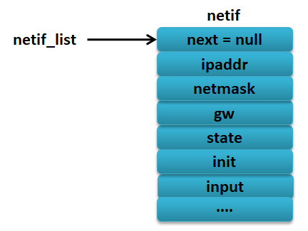
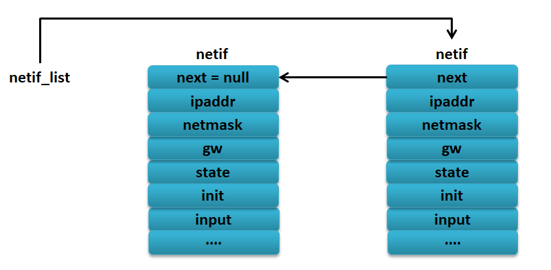

LwIP的网络接口管理
------------------

本章主要是讲解netif结构体，了解底层硬件网络接口如何与LwIP对接。

netif结构体
~~~~~~~~~~~

从前面的章节我们知道，网络接口（如以太网接口）是硬件接口，（提示：网络接口又可以称之为网卡，
为了统一，下文均采用网卡表示网络接口），LwIP是软件，那么怎么让硬件与软件无缝连接起来呢？
而且，网卡又有多种多样，怎么能让LwIP使用同样的软件能兼容不同的硬件呢？
原来LwIP使用一个数据结构——netif来描述一个网卡，但是由于网卡是直接与硬件打交道的，
硬件不同则处理基本是不同的，所以必须由用户提供最底层接口函数，LwIP提供统一的接口，
但是底层的实现需要用户自己去完成，比如网卡的初始化，网卡的收发数据，当LwIP底层得到了网络的数据之后，
才会传入内核中去处理；同理，LwIP内核需要发送一个数据包的时候，也需要调用网卡的发送函数，
这样子才能把数据从硬件接口到软件内核无缝连接起来。LwIP中的
ethernetif.c文件即为底层接口的驱动的模版，用户为自己的网络设备实现驱动时应参照此模块做修改。ethernetif.c文件中的函数通常为与硬件打交道的底层函数，当有数据需要通过网卡接收或者发送数据的时候就会被调用，经过LwIP协议栈内部进行处理后，从应用层就能得到数据或者可以发送数据。

简单来说，netif是LwIP抽象出来的网卡，LwIP协议栈可以使用多个不同的接口，而ethernetif.c文件则提供了netif访问各种不同的网卡，每个网卡有不同的实现方式，用户只需要修改ethernetif.c文件即可。

在单网卡中，这个netif结构体只有一个，可能还有人会问，那么一个设备中有多个网卡怎么办，很简单，LwIP会将每个用netif描述的网卡连接成一个链表（单向链表），该链表就记录每个网卡的netif。屏蔽硬件接口的差异，完成了对不同网卡的抽象，因此了解netif结构体是移植LwIP的关键。

我们可以理解将整个网络的数据传输理解为物流，那么网卡就是不同的运输工具，我们可以选择汽车、飞机、轮船等运输工具，不同的运输工具速度是不一样的，但是对于一个物流公司而言，可能同时存在很多种运输的工具，这就需要物流公司去记录这些运输工具，当有一个包裹需要通过飞机运输出去，那么物流公司就会将这个包裹通过飞机发送出去，这就好比我们的网卡，需要哪个网卡发送或者接收网络数据的时候，就会让对应的网卡去工作。

下面一起来看看netif数据结构是怎么样的，具体见 代码清单4_1_。

代码清单 4‑1 netif数据结构（已删减IPv6相关字段）

.. code-block:: c
   :name: 代码清单4_1

    struct netif
    {
    #if !LWIP_SINGLE_NETIF
        /* 指向netif链表中的下一个 */
        struct netif *next;				(1)
    #endif

    #if LWIP_IPV4
        /* 网络字节中的IP地址、子网掩码、默认网关配置 */
        ip_addr_t ip_addr;
        ip_addr_t netmask;
        ip_addr_t gw;					(2)
    #endif /* LWIP_IPV4 */

        /* 此函数由网络设备驱动程序调用，将数据包传递到TCP/IP协议栈。
        * 对于以太网物理层，这通常是ethernet_input()*/
        netif_input_fn input;				(3)

    #if LWIP_IPV4

        /* 此函数由IP层调用，在接口上发送数据包。通常这个功能，
            * 首先解析硬件地址，然后发送数据包。
            * 对于以太网物理层，这通常是etharp_output() */
        netif_output_fn output;				(4)

    #endif /* LWIP_IPV4 */
        /* 此函数由ethernet_output()调用，当需要在网卡上发送一个数据包时。
            * 底层硬件输出数据函数，一般是调用自定义函数low_level_output*/
        netif_linkoutput_fn linkoutput;			(5)

    #if LWIP_NETIF_STATUS_CALLBACK
        /* 当netif状态设置为up或down时调用此函数 */
        netif_status_callback_fn status_callback;		(6)
    #endif /* LWIP_NETIF_STATUS_CALLBACK */

    #if LWIP_NETIF_LINK_CALLBACK
        /* 当netif链接设置为up或down时，将调用此函数 */
        netif_status_callback_fn link_callback;		(7)
    #endif /* LWIP_NETIF_LINK_CALLBACK */

    #if LWIP_NETIF_REMOVE_CALLBACK
        /* 当netif被删除时调用此函数 */
        netif_status_callback_fn remove_callback;		(8)
    #endif /* LWIP_NETIF_REMOVE_CALLBACK */

        /* 此字段可由设备驱动程序设置并指向设备的状态信息。
        * 主要是将网卡的某些私有数据传递给上层，用户可以自由发挥，也可以不用。*/
        void *state;					(9)

    #ifdef netif_get_client_data
        void* client_data[LWIP_NETIF_CLIENT_DATA_INDEX_MAX + LWIP_NUM_NETIF_CLIENT_DATA];
    #endif
    #if LWIP_NETIF_HOSTNAME
        /* 这个netif的主机名，NULL也是一个有效值 */
        const char*  hostname;
    #endif /* LWIP_NETIF_HOSTNAME */

    #if LWIP_CHECKSUM_CTRL_PER_NETIF
        u16_t chksum_flags;
    #endif /* LWIP_CHECKSUM_CTRL_PER_NETIF*/

        /** 最大传输单位（以字节为单位），对于以太网一般设为 1500 */
        u16_t mtu;					(10)

        /** 此网卡的链路层硬件地址 */
        u8_t hwaddr[NETIF_MAX_HWADDR_LEN];			(11)

        /** 硬件地址长度，对于以太网就是 MAC 地址长度，为6字节 */
        u8_t hwaddr_len;					(12)

        /* 网卡状态信息标志位，是很重要的控制字段，
        * 它包括网卡功能使能、广播使能、 ARP 使能等等重要控制位。 */
        u8_t flags;					(13)

        /* 字段用于保存每一个网卡的名字。用两个字符的名字来标识网络接
        * 口使用的设备驱动的种类，名字由设备驱动来设置并且应该反映通过网卡
        * 表示的硬件的种类。比如蓝牙设备（ bluetooth）的网卡名字可以是 bt，
        * 而 IEEE 802.11b WLAN 设备的名字就可以是wl，当然设置什么名字用户是可
        * 以自由发挥的，这并不影响用户对网卡的使用。当然，如果两个网卡
        * 具有相同的网络名字，我们就用 num 字段来区分相同类别的不同网卡*/
        char name[2];					(14)

        /* 用来标示使用同种驱动类型的不同网卡 */
        u8_t num;						(15)

    #if MIB2_STATS
        /* 连接类型 */
        u8_t link_type;
        /* 连接速度 */
        u32_t link_speed;
        /* 最后一次更改的时间戳 */
        u32_t ts;
        /** counters */
        struct stats_mib2_netif_ctrs mib2_counters;
    #endif /* MIB2_STATS */

    #if LWIP_IPV4 && LWIP_IGMP
        /** 可以调用此函数来添加或删除多播中的条目
            以太网MAC的过滤表。*/
        netif_igmp_mac_filter_fn igmp_mac_filter;
    #endif /* LWIP_IPV4 && LWIP_IGMP */

    #if LWIP_NETIF_USE_HINTS
        struct netif_hint *hints;
    #endif /* LWIP_NETIF_USE_HINTS */

    #if ENABLE_LOOPBACK
        /* List of packets to be queued for ourselves. */
        struct pbuf *loop_first;
        struct pbuf *loop_last;

    #if LWIP_LOOPBACK_MAX_PBUFS
        u16_t loop_cnt_current;
    #endif /* LWIP_LOOPBACK_MAX_PBUFS */

    #endif /* ENABLE_LOOPBACK */
    };

我们挑一些比较重要的netif字段进行讲解：

代码清单
4‑1\ **(1)**\ ：LwIP使用链表来管理同一设备的多个网卡。在netif.c文件中定义两个全局指针：struct
netif \*netif_list和struct netif
\*netif_default，其中netif_list就是网卡链表指针，指向网卡链表的首节点（第一个网卡），后者表示默认情况下（有多网口时）使用哪个网卡。next字段指向下一个netif结构体指针，在一个设备中有多个网卡时，才使用该字段。

代码清单
4‑1\ **(2)**\ ：ip_addr字段记录的是网络中的IP地址，netmask字段记录的是子网掩码，
gw记录的是网关地址，这些字段是用于描述网卡的网络地址属性。

IP地址必须与网卡对应，即设备拥有多少个网卡那就必须有多少个IP地址；子网掩码可以用来判断某个IP地址与当前网卡是否处于同一个子网中，IP在发送数据包的时候会选择与目标IP地址处于同一子网的网卡来发送；网关地址在数据包的发送、转发过程非常重要，如果要向不属于同一子网的主机（主机目标IP地址与网卡不属于同一子网）发送一个数据包，那么LwIP就会将数据包发送到网关中，网关设备会对该数据包进行正确的转发，除此之外，网关还提供很多高级功能，如DNS，DHCP等。

代码清单
4‑1\ **(3)**\ ：input是一个函数指针，指向一个函数，该函数由网络设备驱动程序调用，
将数据包传递到TCP/IP协议栈（IP层）。对于以太网物理层，这通常是ethernet_input()，
参数为pbuf和netif类型，其中pbuf为接收到的数据包。

代码清单
4‑1\ **(4)**\ ：output也是一个函数指针，指向一个函数，此函数由IP层调用，在接口上发送数据包。
用户需要编写该函数并使output指向它，通这个函数的处理步骤是首先解析硬件地址，然后发送数据包。
对于以太网物理层，该函数通常是etharp_output()，参数为pbuf、netif和ip_addr类型，其中，
ipaddr代表要将该数据包发送到的地址，但不一定是数据包最终到到达的IP地址，比如，
要发送IP数据报到一个并不在本网络的主机上，该数据包要被发送到一个路由器上，这里的ipaddr就是路由器IP地址。

代码清单
4‑1\ **(5)**\ ：linkoutput字段和output类似，也需要用户自己实现一个函数，但只有两个参数，
它是由ARP模块调用的，一般是自定义函数low_level_output()。当需要在网卡上发送一个数据包时，
该函数会被ethernet_output()函数调用。

代码清单 4‑1\ **(6)**\ ：当netif状态设置为up或down时，将调用此函数。

代码清单 4‑1\ **(7)**\ ：当netif连接设置为up或down时，将调用此函数。

代码清单 4‑1\ **(8)**\ ：当netif被删除时调用此函数。

代码清单
4‑1\ **(9)**\ ：此字段可由设备驱动程序设置并指向设备的状态信息。主要是将网卡的某些私有数据传递给上层，用户可以自由发挥，也可以不用。

代码清单 4‑1\ **(10)**\ ：最大传输单位（以字节为单位），对于以太网一般为
1500，在IP层发送数据的时候，LwIP会使用该字段决定是否需要对数据包进行分片处理，为什么是在IP层进行分片处理？因为链路层不提供任何的差错处理机制，如果在网卡中接收的数据包不满足网卡自身的属性，那么网卡可能就会直接丢弃该数据包，也可能在底层进行分包发送，但是这种分包在IP层看来是不可接受的，因为它打乱了数据的结构，所以只能由IP层进行分片处理。

代码清单 4‑1\ **(11)**\ ：此网卡的链路层硬件地址。

代码清单 4‑1\ **(12)**\ ：硬件地址长度，对于以太网就是 MAC
地址长度，为6字节

代码清单
4‑1\ **(13)**\ ：网卡状态信息标志位，是很重要的控制字段，它包括网卡功能使能、广播使能、
ARP 使能等等重要控制位。

代码清单
4‑1\ **(14)**\ ：name字段用于保存每一个网卡的名字。用两个字符的名字来标识网卡使用的设备驱动的种类，
名字由设备驱动来设置并且应该反映通过网卡表示的硬件的种类。比如蓝牙设备（bluetooth）的网卡名字可以是
bt，而 IEEE 802.11b
WLAN设备的名字就可以是wl，当然设置什么名字用户是可以自由发挥的，这并不影响用户对网卡的使用。当然，如果两个网卡具有相同的网络名字，我们就用
num字段来区分相同类别的不同网卡。

代码清单 4‑1\ **(15)**\ ：用来标识使用同种驱动类型的不同网卡。

netif使用
~~~~~~~~~

那么netif具体该如何使用呢？其实使用还是非常简单的。首先我们需要根据我们的网卡定义一个netif结构体变量struct
netif
gnetif，我们首先要把网卡挂载到netif_list链表上才能使用，因为LwIP是通过链表来管理所有的网卡，所有第一步是通过netif_add()函数将我们的网卡挂载到netif_list链表上，netif_add()函数具体见
代码清单4_2_。

代码清单 4‑2netif_add()函数（已删减）

.. code-block:: c
   :name: 代码清单4_2

    struct netif *
    netif_add(struct netif *netif,const ip4_addr_t *ipaddr,
            const ip4_addr_t *netmask, const ip4_addr_t *gw,
            void *state, netif_init_fn init, netif_input_fn input)
    {
        LWIP_ASSERT_CORE_LOCKED();

        if (ipaddr == NULL)
        {
            ipaddr = ip_2_ip4(IP4_ADDR_ANY);
        }
        if (netmask == NULL)
        {
            netmask = ip_2_ip4(IP4_ADDR_ANY);
        }
        if (gw == NULL)
        {
            gw = ip_2_ip4(IP4_ADDR_ANY);
        }

        /* reset new interface configuration state */
        ip_addr_set_zero_ip4(&netif->ip_addr);			(1)
        ip_addr_set_zero_ip4(&netif->netmask);
        ip_addr_set_zero_ip4(&netif->gw);
        netif->output = netif_null_output_ip4;

        NETIF_SET_CHECKSUM_CTRL(netif, NETIF_CHECKSUM_ENABLE_ALL);
        netif->mtu = 0;
        netif->flags = 0;

        memset(netif->client_data, 0, sizeof(netif->client_data));

        /* remember netif specific state information data */
        netif->state = state;
        netif->num = netif_num;
        netif->input = input;					(2)

        NETIF_RESET_HINTS(netif);

        netif_set_addr(netif, ipaddr, netmask, gw);			(3)

        /* call user specified initialization function for netif */
        if (init(netif) != ERR_OK)					(4)
        {
            return NULL;
        }

        {
            struct netif *netif2;
            int num_netifs;
            do
            {
                if (netif->num == 255)
                {
                    netif->num = 0;
                }
                num_netifs = 0;
            for(netif2 = netif_list; netif2 != NULL; netif2 = netif2->next)
                {
                    num_netifs++;
                    if (netif2->num == netif->num)
                    {
                        netif->num++;
                        break;
                    }
                }
            }
            while (netif2 != NULL);
        }
        if (netif->num == 254)
        {
            netif_num = 0;
        }
        else
        {
            netif_num = (u8_t)(netif->num + 1);			(5)
        }

        /* add this netif to the list */
        netif->next = netif_list;
        netif_list = netif;					(6)

        mib2_netif_added(netif);

        ip4_addr_debug_print(NETIF_DEBUG, ipaddr);

        ip4_addr_debug_print(NETIF_DEBUG, netmask);

        ip4_addr_debug_print(NETIF_DEBUG, gw);

        netif_invoke_ext_callback(netif, LWIP_NSC_NETIF_ADDED, NULL);

        return netif;
    }

代码清单 4‑2\ **(1)**\ ：清空主机IP地址、子网掩码、网关等字段信息。

代码清单
4‑2\ **(2)**\ ：根据传递进来的参数填写网卡state、input等字段的相关信息。

代码清单
4‑2\ **(3)**\ ：调用网卡设置函数netif_set_addr()设置网卡IP地址、子网掩码、网关等信息。

代码清单
4‑2\ **(4)**\ ：通过传递进来的回调函数init()进行网卡真正的初始化操作，
所以该函数是由用户实现的，对于不同网卡就使用不一样的初始化，而此处是以太网，
则该回调函数一般为ethernetif_init()，该函数在后文详细讲解。

代码清单
4‑2\ **(5)**\ ：初始化网卡成功，则遍历当前设备拥有多少个网卡，并为当前网卡分配唯一标识num。

代码清单 4‑2\ **(6)**\ ：将当前网卡插入netif_list链表中。

在使用之前需要进行初始化主机IP地址、子网掩码、网关等，并且在调用netif_add()函数之后会触发netif_init_fn的回调函数。

总之一句话，在开始使用LwIP协议栈的时候，我们就需要将网卡底层移植完成，
才能开始使用，而移植的第一步，就是将网络进行初始化，
并且设置该网卡为默认网卡，让LwIP能通过网卡进行收发数据，具体见
代码清单4_3_ 加粗部分。

代码清单 4‑3挂载网卡

.. code-block:: c
   :name: 代码清单4_3

    /*Static IP ADDRESS: IP_ADDR0.IP_ADDR1.IP_ADDR2.IP_ADDR3 */
    #define IP_ADDR0                    192
    #define IP_ADDR1                    168
    #define IP_ADDR2                      1
    #define IP_ADDR3                    122

    /*NETMASK*/
    #define NETMASK_ADDR0               255
    #define NETMASK_ADDR1               255
    #define NETMASK_ADDR2               255
    #define NETMASK_ADDR3                 0

    /*Gateway Address*/
    #define GW_ADDR0                    192
    #define GW_ADDR1                    168
    #define GW_ADDR2                      1
    #define GW_ADDR3                      1

    struct netif gnetif;
    ip4_addr_t ipaddr;
    ip4_addr_t netmask;
    ip4_addr_t gw;
    uint8_t IP_ADDRESS[4];
    uint8_t NETMASK_ADDRESS[4];
    uint8_t GATEWAY_ADDRESS[4];

    void TCPIP_Init(void)
    {

        tcpip_init(NULL, NULL);

        /* IP addresses initialization */
        /* USER CODE BEGIN 0 */
    #ifdef USE_DHCP
        ip_addr_set_zero_ip4(&ipaddr);
        ip_addr_set_zero_ip4(&netmask);
        ip_addr_set_zero_ip4(&gw);
    #else
        IP4_ADDR(&ipaddr,IP_ADDR0,IP_ADDR1,IP_ADDR2,IP_ADDR3);
        IP4_ADDR(&netmask,NETMASK_ADDR0,NETMASK_ADDR1,NETMASK_ADDR2,NETMASK_ADDR3);
        IP4_ADDR(&gw,GW_ADDR0,GW_ADDR1,GW_ADDR2,GW_ADDR3);
    #endif /* USE_DHCP */
        /* USER CODE END 0 */
        /* Initilialize the LwIP stack without RTOS */
        /* add the network interface (IPv4/IPv6) without RTOS */
        netif_add(&gnetif, &ipaddr, &netmask, &gw, NULL, &ethernetif_init,
                                &tcpip_input);
        /* Registers the default network interface */
        netif_set_default(&gnetif);

        if (netif_is_link_up(&gnetif))
        {
    /* When the netif is fully configured this function must be called */
            netif_set_up(&gnetif);
        }
        else
        {
            /* When the netif link is down this function must be called */
            netif_set_down(&gnetif);
        }
    }

挂载网卡的过程是非常简单的，如果一个设备当前是还没有网卡的，当调用netif_add()函数挂载网卡后，其过程如
图4_1_ 所示，当设备需要挂载多个网卡的时候，
就多次调用netif_add()函数即可，新挂载的网卡会在链表的最前面，具体见
图4_2_。

图 4‑1挂载第一个网卡

图 4‑2挂载第二个网卡（右边是新挂载的网卡）

与netif相关的底层函数
~~~~~~~~~~~~~~~~~~~~~

通过前面的学习，我们知道每个netif接口都需要一个底层接口文件提供访问硬件的支持，而LwIP作者将这种支持做成一个框架供我们参考，如ethernetif.c文件就是实现为一个框架的形式，我们在移植的时候只需要根据实际的网卡特性完善这里面的函数即可，该文件在后文会讲解。框架中的函数名、参数等都已经实现，我们只需往里面填充完善即可，当然，网卡的驱动与这些函数名字我们也可以进行修改，只要LwIP内核能正确识别网卡中的功能即可，为了方便，我们还是使用LwIP作者提供的框架进行移植操作，当一个设备使用了多个网卡的时候，那就需要编写多个不同的网卡驱动。与网卡驱动密切相关的函数有三个，分别是：

代码清单 4‑4

.. code-block:: c
   :name: 代码清单4_4

    static void low_level_init(struct netif *netif);
    static err_t low_level_output(struct netif *netif, struct pbuf *p);
    static struct pbuf * low_level_input(struct netif *netif);

low_level_init()为网卡初始化函数，它主要完成网卡的复位及参数初始化，根据实际的网卡属性进行配置netif中与网卡相关的字段，例如网卡的MAC地址、长度，最大发送单元等。

low_level_output()函数为网卡的发送函数，它主要将内核的数据包发送出去，数据包采用pbuf数据结构进行描述，该数据结构是一个比较复杂的数据结构，后续我们会详细讲解。

low_level_input()函数为网卡的数据接收函数，该函数会接收一个数据包，为了内核易于对数据包的管理，该函数必须将接收的数据封装成pbuf的形式。

在这一章节中我们仅讲解low_level_init()函数，后面的两个函数涉及到pbuf数据结构，在后面会详细讲解。

除此之外，还有两个函数也与网卡与关系，分别是：

.. code-block:: c
   :name: 代码清单4_5

    err_t ethernetif_init(struct netif *netif);
    void ethernetif_input(void *pParams);

ethernetif_init()函数是在上层管理网卡netif的到时候会被调用的函数，如使用netif_add()添加网卡的时候，就会调用ethernetif_init()函数对网卡进行初始化，其实该函数的最终调用的初始化函数就是low_level_init()函数，我们目前只有一个网卡，就暂时不用对该函数进行改写，直接使用即可，它内部会将网卡的name、output、linkoutput等字段进行初始化，这样子就能将内核与网卡无缝连接起来。

ethernetif_input()函数的主要作用就是调用low_level_input()函数从网卡中读取一个数据包，然后解析该数据包的类型是属于ARP数据包还是IP数据包，再将包递交给上层，在无操作系统的时候ethernetif_input()就是一个可以直接使用的函数，已经无需我们自己去修改，内核会周期性处理该接收函数。而在多线程操作系统的时候，我们一般会将其改写成一个线程的形式，可以周期性去调用low_level_input()网卡接收函数；也可以使用中断的形式去处理，当这个线程将在尚未接收到数据包的时候，处于阻塞状态，当收到数据包的时候，中断利用操作系统的IPC通信机制来唤醒线程去处理接收到的数据包，并将数据包递交上层，这样子的效率会更加高效，事实上我们也是这样子处理的。

ethernetif.c文件内容
~~~~~~~~~~~~~~~~~~~~~~~~~

ethernetif数据结构
^^^^^^^^^^^^^^^^^^^^

既然已经了解了与网卡有关的底层驱动函数，那么我们先看看ethernetif.c文件到底是怎么样子的，又是怎么将网卡与LwIP内核连接在一起。

首先在ethernetif.c文件的开始时，就定义了一个ethernetif数据结构，具体见
代码清单4_6_。

代码清单 4‑6 ethernetif数据结构

.. code-block:: c
   :name: 代码清单4_6

    struct ethernetif
    {
        struct eth_addr *ethaddr;
        /* Add whatever per-interface state that is needed here. */
    };

ethernetif数据结构用来描述底层硬件设备的一些私有信息，如MAC地址等，该结构体唯一不可或缺的是MAC地址，它是LwIP用于相应ARP查询的核心数据。用户可以对该结构进行添加其他的网卡描述信息，如果没有特殊需要，就不用添加其他成员数据，该数据结构在初始化的时候，会通过netif的state成员变量将这些硬件的私有信息传递给上层。

ethernetif_init()
^^^^^^^^^^^^^^^^^

该函数是直接拿来用即可，如果没有特别的需求，基本不需要怎么修改它，
它是LwIP中默认的网卡初始化函数，内部封装了low_level_init()函数，
具体见 代码清单4_7_。

代码清单 4‑7 ethernetif_init()源码

.. code-block:: c
   :name: 代码清单4_7

    err_t ethernetif_init(struct netif *netif)
    {
        struct ethernetif *ethernetif;

    //  LWIP_ASSERT("netif != NULL", (netif != NULL));

        ethernetif = mem_malloc(sizeof(struct ethernetif));

        if (ethernetif == NULL)
        {
            PRINT_ERR("ethernetif_init: out of memory\n");
            return ERR_MEM;
        }

        LWIP_ASSERT("netif != NULL", (netif != NULL));
    //
    #if LWIP_NETIF_HOSTNAME
        /* Initialize interface hostname */
        netif->hostname = "lwip";
    #endif /* LWIP_NETIF_HOSTNAME */
        netif->state = ethernetif;				(1)
        netif->name[0] = IFNAME0;
        netif->name[1] = IFNAME1;

    #if LWIP_IPV4
    #if LWIP_ARP || LWIP_ETHERNET
    #if LWIP_ARP
        netif->output = etharp_output;
    #else

        netif->output = low_level_output_arp_off;
    #endif /* LWIP_ARP */
    #endif /* LWIP_ARP || LWIP_ETHERNET */
    #endif /* LWIP_IPV4 */

    #if LWIP_IPV6
        netif->output_ip6 = ethip6_output;
    #endif /* LWIP_IPV6 */

        netif->linkoutput = low_level_output;

        /* initialize the hardware */
        low_level_init(netif);				(2)
        ethernetif->ethaddr = (struct eth_addr *) &(netif->hwaddr[0]);

        return ERR_OK;
    }

代码清单
4‑7\ **(1)**\ ：通过netif的state成员变量将ethernetif结构传递给上层。

代码清单
4‑7\ **(2)**\ ：调用low_level_init()函数对网卡进行初始化，而该函数需要我们根据网卡的实际情况进行编写。

low_level_init()
^^^^^^^^^^^^^^^^

该函数主要是根据实际情况对网卡进行一系列的初始化工作，例如：初始化MAC地址、长度，
设置最大传输包的大小，设置网卡的属性字段，支持广播、多播、ARP等功能，
如果是使用操作系统的话，还需要建立接收数据、发送数据的任务以及一些需要的消息队列、
信号量等，此处讲解的是裸机底层驱动的编写，low_level_init()源码具体见 代码清单4_8_。

代码清单 4‑8low_level_init()源码

.. code-block:: c
   :name: 代码清单4_8

    static void low_level_init(struct netif *netif)
    {
        HAL_StatusTypeDef hal_eth_init_status;

        //初始化bsp—eth
        hal_eth_init_status = Bsp_Eth_Init();		 (1)

        if (hal_eth_init_status == HAL_OK)
        {
            /* Set netif link flag */
            netif->flags |= NETIF_FLAG_LINK_UP;
        }
    #if LWIP_ARP || LWIP_ETHERNET

        /* set MAC hardware address length */
        netif->hwaddr_len = ETH_HWADDR_LEN;

        /* set MAC hardware address */
        netif->hwaddr[0] =  heth.Init.MACAddr[0];
        netif->hwaddr[1] =  heth.Init.MACAddr[1];
        netif->hwaddr[2] =  heth.Init.MACAddr[2];
        netif->hwaddr[3] =  heth.Init.MACAddr[3];
        netif->hwaddr[4] =  heth.Init.MACAddr[4];
        netif->hwaddr[5] =  heth.Init.MACAddr[5];

        /* maximum transfer unit */
        netif->mtu = NETIF_MTU;

    #if LWIP_ARP
        netif->flags |= NETIF_FLAG_BROADCAST | NETIF_FLAG_ETHARP;
    #else
        netif->flags |= NETIF_FLAG_BROADCAST;
    #endif /* LWIP_ARP */

    #endif /* LWIP_ARP || LWIP_ETHERNET */

        HAL_ETH_Start(&heth);				(2)
    }

代码清单
4‑8\ **(1)**\ ：调用我们自己实现的以太网驱动初始化函数Bsp_Eth_Init()，
这是根据网卡的驱动所编写的函数，不同的网卡是不一样的，
由用户实现，该函数在代码清单
3‑1中实现，此处就不再赘述。

代码清单
4‑8\ **(1)**\ ：初始化完成就需要启动网卡，才能进行数据的收发操作。

本章就暂时讲解网卡初始相关的函数，而对于网卡的接收数据和发送数据都涉及到pbuf，我们会在后续进行详细讲解。

