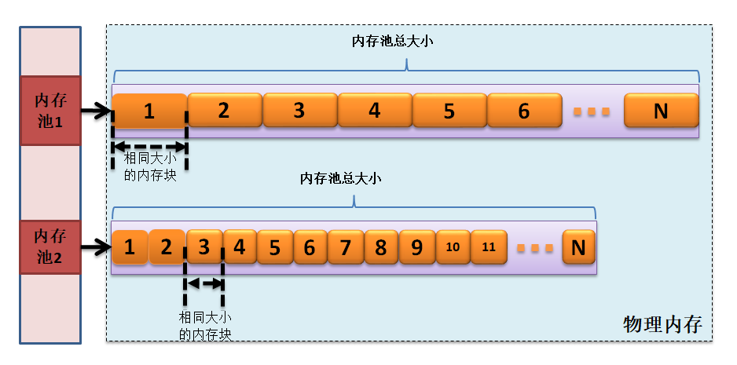
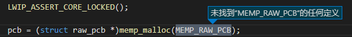
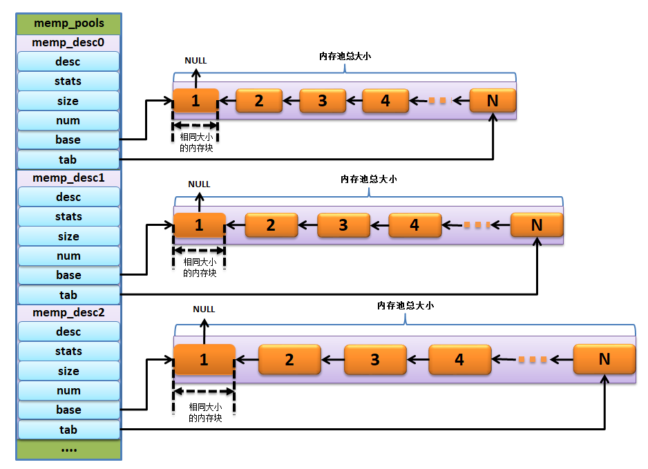
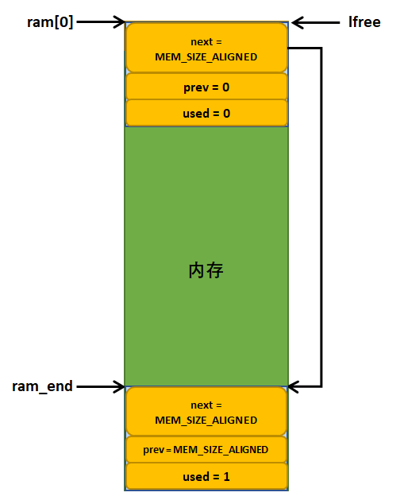
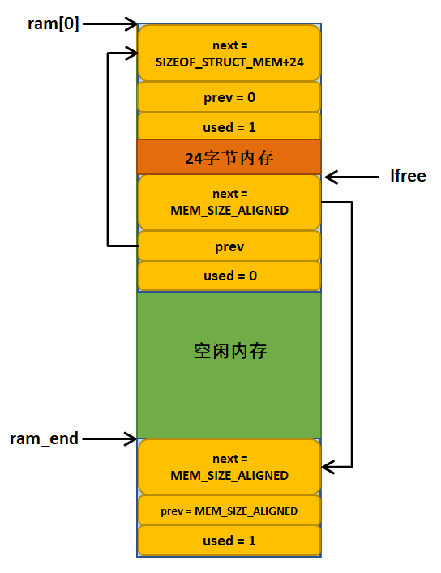

LwIP的内存管理
--------------

从本章开始，我们就开始正式进入LwIP内核的学习，LwIP本质就是对数据的处理，网络中的数据是非常多的，那么LwIP对这些数据的处理必然是需要消耗系统资源的，而有好的内存管理策略就显得非常必要了，内存分配策略、内存分配效率等都是衡量系统性能的重要因素。

几种内存分配策略
~~~~~~~~~~~~~~~~

常见的内存分配策略有两种，一种是分配固定大小的内存块；另一种是利用内存堆进行动态分配，属于可变长度的内存块。这两种内存分配策略都会在LwIP中被使用到，他们各有所长，LwIP的作者根据不同的应用场景选择不同的内存分配策略，这样子使得系统的内存开销、分配效率等都得到很大的提高。此外LwIP还支持使用C标准库中的malloc和free进行内存分配，但是这种内存分配我们不建议使用，因为C标准库在嵌入式设备中使用会有很多问题，系统每次调用这些函数执行的时间可能都不一样，这是致命的，因为内存分配中最重要的就是分配时间效率的问题。内存分配的本质就是事先准备一大块内存堆（可以理解为一个巨大的数组），然后将该空间起始地址返回给申请者，这就需要内核必须采用自己独有的一套数据结构来描述、记录哪些内存空间已经分配，哪些内存空间是未使用的，根据使用的机制不同，延伸出多种类型的内存分配策略。

固定大小的内存块
^^^^^^^^^^^^^^^^

使用固定大小的内存块分配策略，用户只能申请大小固定的内存块，在内存初始化的时候，系统会将所有可用的内存区域划分为N块固定大小的内存，然后将这些内存块通过单链表的方式连接起来，用户在申请内存块的时候就直接从链表的头部取出一个内存块进行分配，同理释放内存块的时候也是很简单，直接将内存块释放到链表的头部即可，这样子分配内存的时间就是固定的，非常高效。但是缺点也是很明显的，用户只能申请固定大小的内存块，如果内存块无法满足用户的需求，那么则无法申请成功，而如果将内存块大小变大，那么在用户需要极小的内存的时候就会造成内存的浪费，这也是不适合的。

可能会有人问了，那这种内存分配策略不好用，为什么LwIP作者会使用呢？其实不然，LwIP中有很多固定的数据结构空间，如TCP首部、UDP首部，IP首部，以太网首部等都是固定的数据结构，其大小就是一个固定的值，那么我们就能采用这种方式分配这些固定大小的内存空间，这样子的效率就会大大提高，并且无论怎么申请与释放，都不会产生内存碎片，这就让系统能很稳定地运行。这种分配策略在LwIP中被称之为动态内存池分配策略，内存池示意图具体见
图5_1_。

图 5‑1动态内存池

可变长度分配
^^^^^^^^^^^^

这种内存分配策略在很多系统中都会被使用到，系统运行的时候，各个空闲内存块的大小是不固定的，它会随着用户的申请而改变，刚开始的时候，系统就是一块大的内存堆，随着系统的运行，用户会申请与释放内存块，所以系统的内存块的大小。数量都会随之改变，并且对于这种内存分配策略是有多种不同的算法的，具体的我们就不再细说，可以参考操作系统相关的书籍。

LwIP中也会使用这种内存分配策略，它采用First
Fit（首次拟合）内存管理算法，申请内存时只要找到一个比所请求的内存大的空闲块，就从中切割出合适的块，并把剩余的部分返回到动态内存堆中，这种分配策略分配的内存块大小有限制，要求请求的分配大小不能小于MIN_SIZE，否则请求会被分配到
MIN_SIZE 大小的内存空间，一般 MIN_SIZE 大小为 12 字节，在这 12
个字节中前几个字节会存放内存分配器管理用的私有数据，该数据区域不能被用户程序修改，否则导致致命问题。内存释放的过程是相反的过程，但分配器会查看该节点前后相邻的内存块是否空闲，如果空闲则合并成一个大的内存空闲块。当然，采用这种内存堆的分配方式，在申请和释放的时候肯定需要消耗时间，可以类似地看做是以时间换空间的策略。采用这种分配策略，其优点就是内存浪费小，比较简单，适合用于小内存的管理，其缺点就是如果频繁的动态分配和释放，可能会造成严重的内存碎片，如果在碎片情况严重的话，可能会导致内存分配不成功从而导致系统崩溃。

补充：存碎片导致系统崩溃的原因并不是因为系统没有可用内存了，而是内存块被分割成很多不连续的小内存块，当用户需要申请一个更大的内存块的时候，系统没办法提供这样子的内存块，就会导致申请失败。

当然LwIP也支持C标准库的malloc()和free()，因为不建议使用这种情况，所以此处我们就不做过多的讲解。

动态内存池（POOL）
~~~~~~~~~~~~~~~~~~

申请大小必须是指定固定大小字节的值（如4、8、16等等），系统将所有可用区域以固定大小的字节单位进行划分，然后用单链表将所有空闲内存块连接起来。链表中所有节点大小相同，分配，释放都非常简单。。

LwIP源文件中memp.c和memp.h就是动态内存池分配策略，为什么LWIP需要有POOL？因为协议栈里面有大量的协议首部，这些协议首部长度都是固定不变的，所以我们可以首先分配固定内存，给这些固定长度的协议首部，以后每次需要处理协议首部的时候，都直接使用这些已经分配的内存，不需要重新分配内存区域，这样子就达到一个地方分配，多个地方使用的方便与效率。

内存池的预处理
^^^^^^^^^^^^^^^

在内核初始化时，会事先在内存中初始化相应的内存池，内核会将所有可用的区域根据宏定义的配置以固定的大小为单位进行划分，然后用一个简单的链表将所有空闲块连接起来，这样子就组成一个个的内存池。由于链表中所有节点的大小相同，所以分配时不需要查找，直接取出第一个节点中的空间分配给用户即可。

注意了，内核在初始化内存池的时候，是根据用户配置的宏定义进行初始化的，比如，用户定义了LWIP_UDP这个宏定义，在编译的时候，编译器就会将与UDP协议控制块相关的数据构编译编译进去，这样子就将LWIP_MEMPOOL(UDP_PCB,
MEMP_NUM_UDP_PCB, sizeof(struct
udp_pcb),"UDP_PCB")包含进去，在初始化的时候，UDP协议控制块需要的POOL资源就会被初始化，其数量由MEMP_NUM_UDP_PCB宏定义决定，注意了，不同协议的POOL内存块的大小是不一样的，这由协议的性质决定，如UDP协议控制块的内存块大小是sizeof(struct
udp_pcb)，而TCP协议控制块的POOL大小则为sizeof(struct
tcp_pcb)。通过这种方式，就可以将一个个用户配置的宏定义功能需要的POOL包含进去，就使得编程变得更加简便。

在这里有一个很有意思的文件，那就是memp_std.h文件，该文件位于include/lwip/priv目录下，它里面全是宏定义，LwIP为什么要这样子写呢，其实很简单，当然是为了方便，在不同的地方调用#include
"lwip/priv/memp_std.h"就能产生不同的效果。

该文件中的宏值定义全部依赖于宏LWIP_MEMPOOL(name,num,size,desc)，这样，只要外部提供的该宏值不同，则包含该文件的源文件在编译器的预处理后，就会产生不一样的结果。这样，就可以通过在不同的地方多次包含该文件，前面必定提供宏值MEMPOOL以产生不同结果。可能有些人看得一脸懵逼，其实我一开始也是这样子，不得不说LwIP源码的作者还是很厉害的。

简单来说，就是在外边提供LWIP_MEMPOOL宏定义，然后在包含memp_std.h文件，编译器就会帮我们处理，我们先来看看memp_std.h文件到底有什么内容，具体见
代码清单5_1_ ，再举个简单的例子说明一下，具体见 代码清单5_2_。

代码清单 5‑1memp_std.h文件（已删减）

.. code-block:: c
   :name: 代码清单5_1

    #if LWIP_RAW
    LWIP_MEMPOOL(RAW_PCB,        MEMP_NUM_RAW_PCB,
                sizeof(struct raw_pcb),        "RAW_PCB")
    #endif /* LWIP_RAW */

    #if LWIP_UDP
    LWIP_MEMPOOL(UDP_PCB,        MEMP_NUM_UDP_PCB,
                sizeof(struct udp_pcb),        "UDP_PCB")
    #endif /* LWIP_UDP */

    #if LWIP_TCP
    LWIP_MEMPOOL(TCP_PCB,        MEMP_NUM_TCP_PCB,
                sizeof(struct tcp_pcb),        "TCP_PCB")

    LWIP_MEMPOOL(TCP_PCB_LISTEN, MEMP_NUM_TCP_PCB_LISTEN,
                sizeof(struct tcp_pcb_listen), "TCP_PCB_LISTEN")

    LWIP_MEMPOOL(TCP_SEG,        MEMP_NUM_TCP_SEG,
                sizeof(struct tcp_seg),        "TCP_SEG")
    #endif /* LWIP_TCP */

    #if LWIP_ALTCP && LWIP_TCP
    LWIP_MEMPOOL(ALTCP_PCB,      MEMP_NUM_ALTCP_PCB,
                sizeof(struct altcp_pcb),      "ALTCP_PCB")
    #endif /* LWIP_ALTCP && LWIP_TCP */

    #if LWIP_IPV4 && IP_REASSEMBLY
    LWIP_MEMPOOL(REASSDATA,      MEMP_NUM_REASSDATA,
                sizeof(struct ip_reassdata),   "REASSDATA")
    #endif /* LWIP_IPV4 && IP_REASSEMBLY */

    #if LWIP_NETCONN || LWIP_SOCKET
    LWIP_MEMPOOL(NETBUF,         MEMP_NUM_NETBUF,
                sizeof(struct netbuf),         "NETBUF")

    LWIP_MEMPOOL(NETCONN,        MEMP_NUM_NETCONN,
                sizeof(struct netconn),        "NETCONN")
    #endif /* LWIP_NETCONN || LWIP_SOCKET */
    #undef LWIP_MEMPOOL

代码清单 5‑2 memp_std.h使用方式的例子

.. code-block:: c
   :name: 代码清单5_2

    typedef enum
    {
    #define LWIP_MEMPOOL(name,num,size,desc)  MEMP_##name,
    #include "lwip/priv/memp_std.h"
        MEMP_MAX
    } memp_t;

可能很多人一看到
代码清单5_2_ 的例子，就懵逼了，这写的是什么鬼东西，
完全不知道LwIP作者想要干什么，但是当你读懂这段代码的时候，
你就不得不佩服LwIP作者的水平了，那是真的厉害。

先说说“#define LWIP_MEMPOOL(name,num,size,desc)
MEMP_##name,”这个宏定义，此处先补充一下C语言的连接符“##”相关的知识，##被称为连接符（concatenator），用来将两个Token连接为一个Token。注意这里连接的对象是Token就行，而不一定是宏的变量。在编译器编译的时候，它会扫描源码，将代码分解为一个个的Token，Token可以是C语言的关键字，如int、for、while等，也可以是用户自定义的变量，如，a、num、name等，当我们经过“#define
LWIP_MEMPOOL(name,num,size,desc)
MEMP_##name,”这个宏定义后，在编译过程中遇到了“LWIP_MEMPOOL(EmbedFire,num,size,desc)”这句代码，编译器就会将它替换为“MEMP_EmbedFire,”注意，这里有一个英文的逗号“,”，因为现在是定义枚举类型的数据，那么经过编译器处理的
代码清单5_2_ 代码后，这个枚举变量就会变成以下的内容（假设所有的宏定义都是使能状态），具体见
代码清单5_3_。

代码清单 5‑3经过编译器处理的代码

.. code-block:: c
   :name: 代码清单5_3

    typedef enum
    {
        MEMP_RAW_PCB,
        MEMP_UDP_PCB,
        MEMP_TCP_PCB,
        MEMP_TCP_PCB_LISTEN,
        MEMP_TCP_SEG,
        MEMP_ALTCP_PCB,
        MEMP_REASSDATA,
        MEMP_NETBUF,
        MEMP_NETCONN,
        MEMP_MAX
    } memp_t;

memp_t类型在整个内存池的管理中是最重要的存在，通过内存池申请函数申请内存的时候，唯一的参数就是memp_t类型的，它将告诉分配的函数在哪种类型的POOL中去分配对应的内存块，这样子就直接管理了系统中所有类型的POOL。

这个枚举变量的MEMP_MAX不代表任何类型的POOL，它只是记录这系统中所有的POOL的数量，比如例子中的MEMP_RAW_PCB
的值为0，而MEMP_MAX的值为9，就表示当前系统中有9种POOL。

这样子的编程方式，是不是大开眼界了？不过还有一点需要注意的是，在memp_std.h文件的最后需要对LWIP_MEMPOOL宏定义进行撤销，因为该文件很会被多个地方调用，在每个调用的地方会重新定义这个宏定义的功能，所以在文件的末尾添加这句#undef
LWIP_MEMPOOL代码是非常有必要的。

在这里还要给大家提个醒，如果以后看LwIP源码的时候，发现某个找不到定义，
但是编译是没有问题的，那么很可能就是通过“##”连接符产生的宏定义了，
例如 图5_2_ 出现的情况，MEMP_RAW_PCB定义就在memp_t类型中，
是通过“##”连接符产生的。

图 5‑2未找到MEMP_RAW_PCB的定义

按照这种包含头文件的原理，只需要定义LWIP_MEMPOOL宏的作用，就能产生很大与内存池相关的操作，如在memp.c文件的开头就定义了如下代码：

代码清单 5‑4

.. code-block:: c
   :name: 代码清单5_4

    #define LWIP_MEMPOOL(name,num,size,desc) LWIP_MEMPOOL_DECLARE(name,num,size,desc)
    #include "lwip/priv/memp_std.h"

经过包含memp_std.h文件后，再经过编译器的处理，就能得到下面的结果，具体见
代码清单5_5_ 加粗部分。
其实这些编译器处理的代码我们并不需要怎么理会，简单了解一下即可

代码清单 5‑5

.. code-block:: c
   :name: 代码清单5_5

    #define LWIP_MEMPOOL(name,num,size,desc) \
            LWIP_MEMPOOL_DECLARE(name,num,size,desc)

    #define LWIP_DECLARE_MEMORY_ALIGNED(variable_name, size) \
            u8_t variable_name[LWIP_MEM_ALIGN_BUFFER(size)]

    LWIP_MEM_ALIGN_BUFFER(size) (((size) + MEM_ALIGNMENT - 1U))

    #define LWIP_MEMPOOL_DECLARE(name,num,size,desc) \
    LWIP_DECLARE_MEMORY_ALIGNED(memp_memory_ ## name ## _base, \
    ((num) * (MEMP_SIZE + MEMP_ALIGN_SIZE(size)))); \
    \
    LWIP_MEMPOOL_DECLARE_STATS_INSTANCE(memp_stats_ ## name) \
    \
    static struct memp *memp_tab_ ## name; \
    \
    const struct memp_desc memp_ ## name = { \
    DECLARE_LWIP_MEMPOOL_DESC(desc) \
    LWIP_MEMPOOL_DECLARE_STATS_REFERENCE(memp_stats_ ## name) \
    LWIP_MEM_ALIGN_SIZE(size), \
    (num), \
    memp_memory_ ## name ## _base, \
    &memp_tab_ ## name \
    };

    /* 编译时候的宏定义 */
    LWIP_MEMPOOL(RAW_PCB,MEMP_NUM_RAW_PCB,sizeof(struct raw_pcb),"RAW_PCB")

    /* 通过转换后得到的结果，例子是 RAW_PCB */
    LWIP_DECLARE_MEMORY_ALIGNED(memp_memory_RAW_PCB_base,
    ((MEMP_NUM_RAW_PCB) * (MEMP_SIZE + MEMP_ALIGN_SIZE(sizeof(struct raw_pcb)))));

    LWIP_MEMPOOL_DECLARE_STATS_INSTANCE(memp_stats_RAW_PCB)

    static struct memp *memp_tab_RAW_PCB;

    const struct memp_desc memp_RAW_PCB =
    {
        DECLARE_LWIP_MEMPOOL_DESC("RAW_PCB")
        LWIP_MEMPOOL_DECLARE_STATS_REFERENCE(memp_stats_RAW_PCB)
        LWIP_MEM_ALIGN_SIZE(sizeof(struct raw_pcb)),
        (MEMP_NUM_RAW_PCB),
        memp_memory_RAW_PCB_base,
        &memp_tab_RAW_PCB
    };

    /* 再次转换 */
    u8_t memp_memory_RAW_PCB_base[(((((MEMP_NUM_RAW_PCB) *
                    (MEMP_SIZE + MEMP_ALIGN_SIZE(sizeof(struct raw_pcb)))))
                    + MEM_ALIGNMENT - 1U))];

    static struct memp *memp_tab_RAW_PCB;

    const struct memp_desc memp_RAW_PCB ={
    (((sizeof(struct raw_pcb)) + MEM_ALIGNMENT - 1U) & ~(MEM_ALIGNMENT-1U)),
        LWIP_MEM_ALIGN_SIZE(sizeof(struct raw_pcb)),
        (MEMP_NUM_RAW_PCB),
        memp_memory_RAW_PCB_base,
        &memp_tab_RAW_PCB
    };

    /* 代入数据得到，注意，数据是根据自己配置的宏定义得到的 */
    u8_t memp_memory_RAW_PCB_base[((4 * 24) + 4 - 1U)];

    static struct memp *memp_tab_RAW_PCB;

    const struct memp_desc memp_RAW_PCB ={
        ((24) + 4 - 1U) & ~(4-1U)),
        (24),
        4
        memp_memory_RAW_PCB_base,
        &memp_tab_RAW_PCB
    };

关于包含memp_std.h文件的处理就不再过多说明了，用户也不需要了解太多，我们就来看看关于内存池的主要参数，就使用上面的RAW_PCB的例子，每种POOL在经过编译器都会得到一个结构体，memp_desc
memp_XXXX，XXXX表示对应的POOL类型，如RAW_PCB的结构体就是memp_desc
memp_RAW_PCB，这里面就记录了该内存块对其后的大小LWIP_MEM_ALIGN_SIZE(sizeof(struct
raw_pcb))。也就是说，在经过编译器的处理，该结构体就保存了每种POOL的内存对齐后的大小。

同理该结构体也记录了每种POOL的其他参数，如内存块的个数num，比如MEMP_NUM_RAW_PCB，这些就是用户配置的宏定义，都会被记录在里面，还有每种POOL的描述
“DECLARE_LWIP_MEMPOOL_DESC("RAW_PCB")”，当然这个参数可用可不用，这只是一个字符串，在输出信息的时候用到。

除了这些信息，还有一个最重要的信息，那就是真正的内存池区域，使用u8_t
memp_memory_XXXX_base进行定义，XXXX表示对应的POOL类型，每个类型都有自己的内存池区域，是编译器开辟出来的内存空间，简单来说就是一个数组，我们知道这个区域的的起始地址，就能对它进行操作。

内存池的初始化
^^^^^^^^^^^^^^

在LwIP协议栈初始化的时候，
memp_init()会对内存池进行初始化，真正的内存初始化函数是memp_init_pool()函数，该函数源码具体见
代码清单5_6_。

代码清单 5‑6内存池的初始化（已删减）

.. code-block:: c
   :name: 代码清单5_6

    void
    memp_init(void)
    {
        u16_t i;

        /* for every pool: */
        for (i = 0; i < LWIP_ARRAYSIZE(memp_pools); i++)
        {
            memp_init_pool(memp_pools[i]);
        }
    }

    void
    memp_init_pool(const struct memp_desc *desc)
    {
        int i;
        struct memp *memp;

        *desc->tab = NULL;
        memp = (struct memp *)LWIP_MEM_ALIGN(desc->base);

        memset(memp, 0, (size_t)desc->num * (MEMP_SIZE + desc->size));

        /* 将内存块链接成链表形式 */
        for (i = 0; i < desc->num; ++i)
        {
            memp->next = *desc->tab;
            *desc->tab = memp;

        /* 地址偏移*/
        memp = (struct memp *)(void *)((u8_t *)memp + MEMP_SIZE + desc->size);
        }
    }

该函数是比较简单的函数，就是根据每种POOL的memp_desc描述进行初始化，在每种类型的POOL中将空闲内存块连接成单链表，并且使用memset()函数将其内容清零，这样子就初始化完成了。

初始化完成的示意图（只有部分POOL）具体见 图5_3_。

图 5‑3内存池初始化完成示意图

内存分配
^^^^^^^^

内存池的初始化之后，这些内存池中的内存块就可以使用了，这就需要用户通过memp_malloc函数进行申请内存块，
而内存块的大小就是指定的大小，其过程很简单，就是根据内存池的类型去选择从哪个内存池进行分配，
因为不同类型的内存池中内存块大小是不一样的，比如TCP_PCB与UDP_PCB的大小就不一样，
所以申请内存的时候传入的参数是内存池的类型而并非要申请的内存大小，
系统中所有的内存池类型都会被记录在memp_pools数组中，我们可以将该数组称之为内存池描述表，
它负责将系统所有的内存池信息描述并且记录下来，这样子在申请内存的时候就能很迅速得到一个对应的内存块，
内存分配函数的源码具体见
代码清单5_7_。

代码清单 5‑7内存分配函数（已删减）

.. code-block:: c
   :name: 代码清单5_7

    void *
    memp_malloc(memp_t type)
    {
        void *memp;
    LWIP_ERROR("memp_malloc: type < MEMP_MAX", (type < MEMP_MAX), return NULL;);

        memp = do_memp_malloc_pool(memp_pools[type]);

        return memp;
    }

    static void *
    do_memp_malloc_pool(const struct memp_desc *desc)
    {
        struct memp *memp;
        SYS_ARCH_DECL_PROTECT(old_level);
        memp = *desc->tab;
        if (memp != NULL)
        {

            *desc->tab = memp->next;

            LWIP_ASSERT("memp_malloc: memp properly aligned",
                        ((mem_ptr_t)memp % MEM_ALIGNMENT) == 0);

            SYS_ARCH_UNPROTECT(old_level);
            /* cast through u8_t* to get rid of alignment warnings */
            return ((u8_t *)memp + MEMP_SIZE);
        }
        else
        {
            SYS_ARCH_UNPROTECT(old_level);
            LWIP_DEBUGF(MEMP_DEBUG | LWIP_DBG_LEVEL_SERIOUS,
                    ("memp_malloc: out of memory in pool %s\n", desc->desc));
        }
        return NULL;
    }

内存池申请函数的核心代码就一句，那就是memp =
\*desc->tab;，通过这句代码，能直接得到对应内存块中的第一个空闲内存块，并将其取出，并且移动*desc->tab指针，指向下一个空闲内存块，然后将((u8_t
\*)memp +
MEMP_SIZE)返回，MEMP_SIZE偏移的空间大小，因为内存块需要一些空间存储内存块相关的信息，该宏定义的值是(LWIP_MEM_ALIGN_SIZE(sizeof(struct
memp)) +
MEM_SANITY_REGION_BEFORE_ALIGNED)，我们暂时无需理会它，只要知道申请内存块后返回的地址是直接可用的地址即可，而偏移的MEMP_SIZE这部分内容是内存分配器管理的空间，用户是不允许触碰的地方，否则就很可能发生错误。

内存释放
^^^^^^^^

同样的，内存释放函数也非常简单的，只需要把使用完毕的内存添加到对应内存池中的空闲内存块链表即可，只不过释放内存有两个参数，一个是POOL的类型，还有就是内存块的起始地址，源码具体见
代码清单5_8_。

代码清单 5‑8内存释放函数（已删减）

.. code-block:: c
   :name: 代码清单5_8

    void
    memp_free(memp_t type, void *mem)
    {
        LWIP_ERROR("memp_free: type < MEMP_MAX",
                (type < MEMP_MAX), return;);

        if (mem == NULL)
        {
            return;
        }
        do_memp_free_pool(memp_pools[type], mem);
    }

    static void
    do_memp_free_pool(const struct memp_desc *desc, void *mem)
    {
        struct memp *memp;
        SYS_ARCH_DECL_PROTECT(old_level);

        LWIP_ASSERT("memp_free: mem properly aligned",
                    ((mem_ptr_t)mem % MEM_ALIGNMENT) == 0);

        /* cast through void* to get rid of alignment warnings */
        memp = (struct memp *)(void *)((u8_t *)mem - MEMP_SIZE);	(1)

        SYS_ARCH_PROTECT(old_level);

        memp->next = *desc->tab;					(2)
        *desc->tab = memp;						(3)

        SYS_ARCH_UNPROTECT(old_level);
    }

代码清单
5‑8\ **(1)**\ ：根据内存块的地址偏移得到内存块的起始地址，因为前面也说了，内存块中有一部分内容是内存分配器操作的，所以需要进行偏移。

代码清单 5‑8\ **(2)**\ ： 内存块的下一个就是链表中的第一个空闲内存块。

代码清单 5‑8\ **(3)**\ ：将内存块插入到对应内存池的*desc->tab中。

LwIP对内存池的设计，采用了很多巧妙的地方，特别是对编译全局变量的过程，根据用户配置的宏定义决定是否编译进去。而且，内存池还采用内存池描述表进行管理系统中所有的内存池，在用户需要某种类型的内存块时候，就直接将其需要的类型传递进去就能得到对应大小的内存块，分配的方式是非常方便并且高效的。

动态内存堆
~~~~~~~~~~

在嵌入式开发中，内存管理以及使用是至关重要的，内存使用的多少、内存泄漏等时刻需要注意。合理的内存管理策略将从根本上决定内存分配和回收效率，最终决定系统的整体性能。LwIP为了能够灵活的使用内存，为使用者提供两种简单却又高效的动态内存管理策略：动态内存堆管理（heap）、动态内存池管理（pool），而内存池管理策略在前面的章节已经讲解，那么现在就来看看内存堆的管理。

其中，动态内存堆管理（heap）又可以分为两种：一种是 C
标准库自带的内存管理策略，另一种是LwIP自身实现的内存堆管理策略。这两者的选择需要通过宏值MEM_LIBC_MALLOC来选择，且二者只能选择其一。

其次，LwIP在自身内存堆和内存池的实现上设计得非常灵活。内存池可由内存堆实现，反之，内存堆也可以由内存池实现。通过MEM_USE_POOLS和MEMP_MEM_MALLOC这两个宏定义来选择，且二者只能选择其一。

内存堆的组织结构
^^^^^^^^^^^^^^^^

在学习内存堆之前，我们先看看内存堆的的组织结构，它包括了内存数据结构与某些重要的全局变量，具体见
代码清单5_9_。

代码清单 5‑9内存堆的组织结构（部分）

.. code-block:: c
   :name: 代码清单5_9

    struct mem
    {
        /** index (-> ram[next]) of the next struct */
        mem_size_t next;					(1)
        /** index (-> ram[prev]) of the previous struct */
        mem_size_t prev;					(2)
        /** 1: this area is used; 0: this area is unused */
        u8_t used;					(3)
    #if MEM_OVERFLOW_CHECK
        /** this keeps track of the user allocation size for guard checks */
        mem_size_t user_size;
    #endif
    };

    #define MIN_SIZE             12			(4)

    LWIP_DECLARE_MEMORY_ALIGNED(ram_heap, MEM_SIZE_ALIGNED+(2U*SIZEOF_STRUCT_MEM)); (5)

    #define LWIP_RAM_HEAP_POINTER 	ram_heap			(6)

    /** pointer to the heap (ram_heap):
    for alignment, ram is now a pointer instead of an array */
    static u8_t *ram;					(7)

    /** the last entry, always unused! */
    static struct mem *ram_end;				(8)

    #if !NO_SYS
    static sys_mutex_t mem_mutex;				(9)
    #endif

    static struct mem * LWIP_MEM_LFREE_VOLATILE lfree;		(10)

代码清单
5‑9\ **(1)(2)**\ ：可能很多人都会认为next与prev是一个指针，
分别指向下一个内存块与上一个内存块，但是其实这两个字段表示的是目的地址的偏移量，
基地址是整个内存堆的起始地址。

代码清单 5‑9\ **(3)**\ ：used字段用于标记该内存是否已经被使用。

代码清单
5‑9\ **(4)**\ ：申请的内存最小为12字节，因为一个内存块最起码需要保持mem结构体的信息，
以便于对内存块进行操作，而该结构体在对齐后的内存大小就是12字节。

代码清单
5‑9\ **(5)**\ ：内存堆的大小是由这个宏定义的，该语句在编译器处理之后就是u8_t
ram_heap[(((MEM_SIZE_ALIGNED + (2U \* SIZEOF_STRUCT_MEM)) +
MEM_ALIGNMENT -
1U))];，其中MEM_SIZE_ALIGNED宏是内存堆大小MEM_SIZE经过内存对齐后的大小；而SIZEOF_STRUCT_MEM则是结构体mem经过内存对其后的大小，MEM_ALIGNMENT则是CPU按多少字节对其的宏定义，一般为4。

代码清单
5‑9\ **(6)**\ ：ram_heap[]就是内核的内存堆空间，LWIP_RAM_HEAP_POINTER这个宏定义相对于重新命名ram_heap。

代码清单
5‑9\ **(7)**\ ：ram是一个全局指针变量，指向内存堆对齐后的起始地址，
因为真正的内存堆起始地址不一定是按照CPU的对齐方式对齐的，
而此处就要确保内存堆的起始地址是对齐的。

代码清单 5‑9\ **(8)**\ ：mem类型指针，指向内存堆中最后一个内存块。

代码清单 5‑9\ **(9)**\ ：互斥量，用户保护内存堆的互斥量，暂时未用。

代码清单
5‑9\ **(10)**\ ：mem类型指针，指向内存堆中低地址的空闲内存块，简单来说就是空闲内存块链表指针。

内存堆初始化
^^^^^^^^^^^^

在内核初始化的时候，会调用mem_init()函数进行内存堆的初始化，
内存堆初始化主要的过程就是对上述所属的内存堆组织结构进行初始化，
主要设置内存堆的起始地址，以及初始化空闲列表。根据用户配置的宏定义进行相关初始化，
配置不同其实现也不同（可能为空），该函数源码具体见
代码清单5_10_。

代码清单 5‑10 mem_init()源码

.. code-block:: c
   :name: 代码清单5_10

    void
    mem_init(void)
    {
        struct mem *mem;

        LWIP_ASSERT("Sanity check alignment",
                    (SIZEOF_STRUCT_MEM & (MEM_ALIGNMENT - 1)) == 0);

        /* align the heap */
        ram = (u8_t *)LWIP_MEM_ALIGN(LWIP_RAM_HEAP_POINTER);		(1)
        /* initialize the start of the heap */
        mem = (struct mem *)(void *)ram;				(2)
        mem->next = MEM_SIZE_ALIGNED;				(3)
        mem->prev = 0;						(4)
        mem->used = 0;						(5)
        /* initialize the end of the heap */
        ram_end = ptr_to_mem(MEM_SIZE_ALIGNED);			(6)
        ram_end->used = 1;						(7)
        ram_end->next = MEM_SIZE_ALIGNED;
        ram_end->prev = MEM_SIZE_ALIGNED;
        MEM_SANITY();

        /* initialize the lowest-free pointer to the start of the heap */
        lfree = (struct mem *)(void *)ram;				(8)

        MEM_STATS_AVAIL(avail, MEM_SIZE_ALIGNED);

        if (sys_mutex_new(&mem_mutex) != ERR_OK)			(9)
        {
            LWIP_ASSERT("failed to create mem_mutex", 0);
        }
    }

代码清单
5‑10\ **(1)**\ ：内存堆空间对齐，LWIP_RAM_HEAP_POINTER宏定义就是ram_mem，内存堆对齐后的起始地址被记录在ram中。

代码清单
5‑10\ **(2)**\ ：在内存堆起始位置放置一个mem类型的结构体，
因为初始化后的内存堆就是一个大的空闲内存块，
每个空闲内存块的前面都需要放置一个mem结构体。

代码清单
5‑10\ **(3)**\ ：下一个内存块的偏移量为MEM_SIZE_ALIGNED，这相对于直接到内存堆的结束地址了。

代码清单 5‑10\ **(4)**\ ：上一个内存块为空。

代码清单 5‑10\ **(5)**\ ：标记未被使用。

代码清单
5‑10\ **(6)**\ ：指针移动到内存堆末尾的位置，并且在那里放置一个mem类型的结构体，并初始化表示内存堆结束的内存块。

代码清单
5‑10\ **(7)**\ ：标记已经使用了该内存块，因为结束的地方是没有内存块的，
不能被分配出去，只能表示已经使用。同时mem结构体的next与prev字段都指向自身，
此处仅表示已经到了内存堆的结束的地方，并无内存可以分配。

代码清单
5‑10\ **(8)**\ ：空闲内存块链表指针指向内存堆的起始地址，因为当前只有一个内存块。

代码清单
5‑10\ **(9)**\ ：创建一个内存堆分配时候使用的互斥量，如果是无操作系统的情况，该语句等效于空。

经过mem_init()函数后，内存堆会被初始化为两个内存块，第一个内存块的大小就是整个内存堆的大小，
而第二个内存块就是介绍内存块，其大小为0，并且被标记为已使用状态，无法进行分配。
值得注意的是，系统在运行的时候，随着内存的分配与释放，lfree指针的指向地址不断改变，
都指向内存堆中低地址空闲内存块，而ram_end则不会改变，它指向系统中最后一个内存块，
也就是内存堆的结束地址。初始化完成的示意图具体见 图5_4_。

图 5‑4内存堆初始化完成示意图

内存分配
^^^^^^^^

内存分配函数根据用户指定申请大小的内存空间进行分配内存，其大小要大于MIN_SIZE，LwIP中使用内存分配算法是首次拟合方法，其分配原理就是在空闲内存块链表中遍历寻找，直到找到第一个合适用户需求大小的内存块进行分配，如果该内存块能进行分割，则将用户需要大小的内存块分割出来，剩下的空闲内存块则重新插入空闲内存块链表中。经过多次的分配与释放，很可能会出现内存碎片，当然，LwIP也有解决的方法，在内存释放中会进行讲解。

mem_malloc()函数是LwIP中内存分配函数，其参数是用户指定大小的内存字节数，如果申请成功则返回内存块的地址，如果内存没有分配成功，则返回NULL，分配的内存空间会受到内存对其的影响，可能会比申请的内存略大，比如用户需要申请22个字节的内存，而CPU是按照4字节内存对齐的，那么分配的时候就会申请24个字节的内存块。

内存块在申请成功后返回的是内存块的起始地址，但是该内存并未进行初始化，
可能包含任意的随机数据，用户可以立即对其进行初始化或者写入有效数据以防止数据错误。
此外内存堆是一个全局变量，在操作系统的环境中进行申请内存块是不安全的，
所以LwIP使用互斥量实现了对临界资源的保护，在多个线程同时申请或者释放的时候，
会因为互斥量的保护而产生延迟。内存分配函数具体见
代码清单5_11_。

代码清单 5‑11 mem_malloc()源码

.. code-block:: c
   :name: 代码清单5_11

    void *
    mem_malloc(mem_size_t size_in)
    {
        mem_size_t ptr, ptr2, size;
        struct mem *mem, *mem2;
        LWIP_MEM_ALLOC_DECL_PROTECT();

        if (size_in == 0)
        {
            return NULL;
        }

        size = (mem_size_t)LWIP_MEM_ALIGN_SIZE(size_in);	(1)

        if (size < MIN_SIZE_ALIGNED)
        {

            size = MIN_SIZE_ALIGNED;			(2)
        }

        if ((size > MEM_SIZE_ALIGNED) || (size < size_in))
        {
            return NULL;					(3)
        }

        sys_mutex_lock(&mem_mutex);			(4)

        LWIP_MEM_ALLOC_PROTECT();

        /* 遍历空闲内存块链表 */
        for (ptr = mem_to_ptr(lfree); ptr < MEM_SIZE_ALIGNED - size;
                ptr = ptr_to_mem(ptr)->next)		(5)
        {
            mem = ptr_to_mem(ptr);				(6)

            if((!mem->used)&&(mem->next-(ptr + SIZEOF_STRUCT_MEM))>= size) (7)
            {
                if (mem->next - (ptr + SIZEOF_STRUCT_MEM) >=
                        (size + SIZEOF_STRUCT_MEM + MIN_SIZE_ALIGNED))
                {
                    ptr2 = (mem_size_t)(ptr + SIZEOF_STRUCT_MEM + size);   (8)
                    LWIP_ASSERT("invalid next ptr",ptr2 != MEM_SIZE_ALIGNED);
                    /* create mem2 struct */
                    mem2 = ptr_to_mem(ptr2);			(9)
                    mem2->used = 0;				(10)
                    mem2->next = mem->next;
                    mem2->prev = ptr;
                    /* and insert it between mem and mem->next */
                    mem->next = ptr2;
                    mem->used = 1;					(11)

                    if (mem2->next != MEM_SIZE_ALIGNED)
                    {
                        ptr_to_mem(mem2->next)->prev = ptr2;		(12)
                    }
                    MEM_STATS_INC_USED(used, (size + SIZEOF_STRUCT_MEM));
                }
                else
                {
                    mem->used = 1;					(13)
                    MEM_STATS_INC_USED(used, mem->next - mem_to_ptr(mem));
                }

                if (mem == lfree)					(14)
                {
                    struct mem *cur = lfree;
                /*Find next free block after mem and update lowest free pointer */
                    while (cur->used && cur != ram_end)
                    {
                        cur = ptr_to_mem(cur->next); 		(15)
                    }
                    lfree = cur;					(16)
                    LWIP_ASSERT("mem_malloc: !lfree->used",
                                ((lfree == ram_end) || (!lfree->used)));
                }
                LWIP_MEM_ALLOC_UNPROTECT();
                sys_mutex_unlock(&mem_mutex);			(17)
                LWIP_ASSERT("mem_malloc: allocated memory not above ram_end.",
                (mem_ptr_t)mem +SIZEOF_STRUCT_MEM+size <=(mem_ptr_t)ram_end);
                LWIP_ASSERT("mem_malloc: allocated memory properly aligned.",
                ((mem_ptr_t)mem + SIZEOF_STRUCT_MEM) % MEM_ALIGNMENT == 0);
                LWIP_ASSERT("mem_malloc: sanity check alignment",
                            (((mem_ptr_t)mem) & (MEM_ALIGNMENT - 1)) == 0);

            MEM_SANITY();
            return (u8_t *)mem + SIZEOF_STRUCT_MEM + MEM_SANITY_OFFSET; (18)
            }
        }
        MEM_STATS_INC(err);
        LWIP_MEM_ALLOC_UNPROTECT();
        sys_mutex_unlock(&mem_mutex);				(19)
        LWIP_DEBUGF(MEM_DEBUG | LWIP_DBG_LEVEL_SERIOUS,
            ("mem_malloc: could not allocate %"S16_F" bytes\n", (s16_t)size));
        return NULL;
    }

代码清单 5‑11\ **(1)**\ ：将用户申请的内存大小进行对齐操作。

代码清单
5‑11\ **(2)**\ ：如果用户申请的内存大小小于最小的内存对齐大小MIN_SIZE_ALIGNED，则设为最小的默认值。

代码清单
5‑11\ **(3)**\ ：如果申请的内存大小大于整个内存堆对齐后的大小，则返回NULL，申请内存失败。

代码清单 5‑11\ **(4)**\ ：获得互斥量，这一句代码在操作系统环境才起作用。

代码清单
5‑11\ **(5)**\ ：遍历空闲内存块链表，直到找到第一个适合用户需求的内存块大小。

代码清单 5‑11\ **(6)**\ ：得到这个内存块起始地址。

代码清单
5‑11\ **(7)**\ ：如果该内存块是未使用的，并且它的大小不小于用户需要的大小加上mem结构体的大小，那么就满足用户的需求。

代码清单
5‑11\ **(8)**\ ：既然满足用户需求，那么这个内存块可能很大，不能直接分配给用户，
否则就是太浪费了，那就看看这个内存块能不能切开，如果能就将一部分分配给用户即可，
程序能执行到这里，说明内存块能进行分割，那就通过内存块的起始地址与用户需求大小进行偏移，
得到剩下的的内存起始块地址ptr2。

代码清单
5‑11\ **(9)**\ ：将该地址后的内存空间作为分割之后新内存块mem2，将起始地址转换为mem结构体用于记录内存块的信息。

代码清单
5‑11\ **(10)**\ ：标记为未使用的内存块，并且将其插入空闲内存块链表中。

代码清单 5‑11\ **(11)**\ ：被分配出去的内存块mem标记为已使用状态。

代码清单
5‑11\ **(12)**\ ：如果mem2内存块的下一个内存块不是链表中最后一个内存块（结束地址），那就将它下一个的内存块的prve指向mem2。

代码清单
5‑11\ **(13)**\ ：如果不能分割，直接将分配的内存块标记为已使用即可。

代码清单
5‑11\ **(14)**\ ：如果被分配出去的内存块是lfree指向的内存块，那么就需要重新给lfree赋值。

代码清单 5‑11\ **(15)**\ ：找到第一个低地址的空闲内存块。

代码清单 5‑11\ **(16)**\ ：将lfree指向该内存块。

代码清单 5‑11\ **(17)**\ ：释放互斥量。

代码清单
5‑11\ **(18)**\ ：返回内存块可用的起始地址，因为内存块的块头需要使用mem结构体保存内存块的基本信息。

代码清单 5‑11\ **(19)**\ ：如果没法分配成功，就释放互斥量并且退出。

如果在初始化后的内存堆中分配了一个大小为24字节的内存块出去，则分配完成的示意图具体见
图5_5_。

图 5‑5申请24字节内存块完成示意图

内存释放
^^^^^^^^

内存释放的操作也是比较简单的，LwIP是这样子做的：它根据用户释放的内存块地址，通过偏移mem结构体大小得到正确的内存块起始地址，并且根据mem中保存的内存块信息进行释放、合并等操作，并将used字段清零，表示该内存块未被使用。

LwIP为了防止内存碎片的出现，通过算法将内存相邻的两个空闲内存块进行合并，在释放内存块的时候，如果内存块与上一个或者下一个空闲内存块在地址上是连续的，那么就将这两个内存块进行合并，其源码具体见
代码清单5_12_。

代码清单 5‑12源码

.. code-block:: c
   :name: 代码清单5_12

    void
    mem_free(void *rmem)
    {
        struct mem *mem;
        LWIP_MEM_FREE_DECL_PROTECT();

        if (rmem == NULL)					(1)
        {
            LWIP_DEBUGF(MEM_DEBUG | LWIP_DBG_TRACE |
                        LWIP_DBG_LEVEL_SERIOUS,
                        ("mem_free(p == NULL) was called.\n"));
            return;
        }
        if ((((mem_ptr_t)rmem) & (MEM_ALIGNMENT - 1)) != 0)
        {
            LWIP_MEM_ILLEGAL_FREE("mem_free: sanity check alignment");
            LWIP_DEBUGF(MEM_DEBUG | LWIP_DBG_LEVEL_SEVERE,
                        ("mem_free: sanity check alignment\n"));
            /* protect mem stats from concurrent access */
            MEM_STATS_INC_LOCKED(illegal);
            return;
        }

        mem = (struct mem *)(void *)((u8_t *)rmem -
            (SIZEOF_STRUCT_MEM + MEM_SANITY_OFFSET));	(2)

        if ((u8_t *)mem < ram ||
                (u8_t *)rmem + MIN_SIZE_ALIGNED > (u8_t *)ram_end) (3)
        {
            LWIP_MEM_ILLEGAL_FREE("mem_free: illegal memory");
            LWIP_DEBUGF(MEM_DEBUG | LWIP_DBG_LEVEL_SEVERE,
                        ("mem_free: illegal memory\n"));
            /* protect mem stats from concurrent access */
            MEM_STATS_INC_LOCKED(illegal);
            return;
        }

        /* protect the heap from concurrent access */
        LWIP_MEM_FREE_PROTECT();

        /* mem has to be in a used state */
        if (!mem->used)					(4)
        {
            LWIP_MEM_ILLEGAL_FREE("mem_free: illegal \
        memory: double free");
            LWIP_MEM_FREE_UNPROTECT();
            LWIP_DEBUGF(MEM_DEBUG | LWIP_DBG_LEVEL_SEVERE,
                        ("mem_free: illegal memory: double free?\n"));
            /* protect mem stats from concurrent access */
            MEM_STATS_INC_LOCKED(illegal);
            return;
        }

        if (!mem_link_valid(mem))				(5)
        {
            LWIP_MEM_ILLEGAL_FREE("mem_free: illegal memory:\
        non-linked: double free");
            LWIP_MEM_FREE_UNPROTECT();
            LWIP_DEBUGF(MEM_DEBUG | LWIP_DBG_LEVEL_SEVERE,
                    ("mem_free: illegal memory: non-linked: double free?\n"));
            /* protect mem stats from concurrent access */
            MEM_STATS_INC_LOCKED(illegal);
            return;
        }

        /* mem is now unused. */
        mem->used = 0;					(6)

        if (mem < lfree)
        {
            /* the newly freed struct is now the lowest */
            lfree = mem;					(7)
        }

        MEM_STATS_DEC_USED(used, mem->next -
                        (mem_size_t)(((u8_t *)mem - ram)));

        /* finally, see if prev or next are free also */
        plug_holes(mem);					(8)

        MEM_SANITY();

        LWIP_MEM_FREE_UNPROTECT();
    }

代码清单 5‑12\ **(1)**\ ：如果释放的地址为空，则直接返回。

代码清单
5‑12\ **(2)**\ ：对释放的地址进行偏移，得到真正内存块的起始地址。

代码清单
5‑12\ **(3)**\ ：判断一下内存块的起始地址是否合法，如果不合法则直接返回。

代码清单
5‑12\ **(4)**\ ：判断一下内存块是否被使用，如果是未使用的也直接返回。

代码清单
5‑12\ **(5)**\ ：判断一下内存块在链表中的连接是否正常，如果不正常也直接返回。

代码清单
5‑12\ **(6)**\ ：程序执行到这里，表示内存块能正常释放，就将used置0表示已经释放了内存块。

代码清单
5‑12\ **(7)**\ ：如果刚刚释放的内存块地址比lfree指向的内存块地址低，则更新lfree指针。

代码清单
5‑12\ **(8)**\ ：调用plug_holes()函数尝试进行内存块合并，如果能合并则合并，
该函数就是我们说的内存块合并算法，只要新释放的内存块与上一个或者下一个空闲内存块在地址上是连续的，
则进行合并，该函数的代码具体见
代码清单5_13_，该函数比较容易理解，就不做过多赘述。

代码清单 5‑13 plug_holes()源码

.. code-block:: c
   :name: 代码清单5_13

    static void
    plug_holes(struct mem *mem)
    {
        struct mem *nmem;
        struct mem *pmem;

        LWIP_ASSERT("plug_holes: mem >= ram", (u8_t *)mem >= ram);
        LWIP_ASSERT("plug_holes: mem < ram_end",
                    (u8_t *)mem < (u8_t *)ram_end);
        LWIP_ASSERT("plug_holes: mem->used == 0", mem->used == 0);

        /* plug hole forward */
        LWIP_ASSERT("plug_holes: mem->next <= MEM_SIZE_ALIGNED",
                    mem->next <= MEM_SIZE_ALIGNED);

        nmem = ptr_to_mem(mem->next);
        if (mem != nmem && nmem->used == 0 &&
                (u8_t *)nmem != (u8_t *)ram_end)
        {
        /* if mem->next is unused and not end of ram, combine mem and mem->next */
            if (lfree == nmem)
            {
                lfree = mem;
            }
            mem->next = nmem->next;
            if (nmem->next != MEM_SIZE_ALIGNED)
            {
                ptr_to_mem(nmem->next)->prev = mem_to_ptr(mem);
            }
        }

        /* plug hole backward */
        pmem = ptr_to_mem(mem->prev);
        if (pmem != mem && pmem->used == 0)
        {
            /* if mem->prev is unused, combine mem and mem->prev */
            if (lfree == mem)
            {
                lfree = pmem;
            }
            pmem->next = mem->next;
            if (mem->next != MEM_SIZE_ALIGNED)
            {
                ptr_to_mem(mem->next)->prev = mem_to_ptr(pmem);
            }
        }
    }

对内存释放函数的操作要非常小心，尤其是传递给函数的参数，该参数必须是内存申请返回的地址，这样子才能保证系统根据该地址去寻找内存块中的mem结构体，最终通过操作mem结构体才能实现内存块的释放操作，并且这样子才有可能进行内存块的合并，否则就没法正常合并内存块，还会把整个内存堆打乱，这样子就会很容易产生内存碎片。

此外，用户在申请内存的时候要注意及时释放内存块，否则就会造成内存泄漏，什么是内存泄漏呢？就是用户在调用内存分配函数后，没有及时或者进行错误的内存释放操作，一次两次这样子的操作并没有什么影响，如果用户周期性调用mem_malloc()函数进行内存申请，并且在内存使用完的时候么有释放，这样子程序就会用完内存堆中的所有内存，最终导致内存耗尽无法申请内存，出现死机等现象。

使用C库的malloc和free来管理内存
~~~~~~~~~~~~~~~~~~~~~~~~~~~~~~~

在前面的章节也说了，LwIP支持使用C标准库的malloc与free进行内存的管理，当宏定义MEM_LIBC_MALLOC被定义的时候，编译器就会把以下代码编译进去，就会采用C标准库的malloc与free函数，具体见
代码清单5_14_。

代码清单 5‑14 使用C标准库进行内存管理相关的宏定义

.. code-block:: c
   :name: 代码清单5_14

    #if MEM_LIBC_MALLOC
    void
    mem_init(void)
    {
    }
    void *
    mem_trim(void *mem, mem_size_t size)
    {
        LWIP_UNUSED_ARG(size);
        return mem;
    }

    #ifndef mem_clib_free
    #define mem_clib_free free
    #endif
    #ifndef mem_clib_malloc
    #define mem_clib_malloc malloc
    #endif
    #ifndef mem_clib_calloc
    #define mem_clib_calloc calloc
    #endif

    #define MEM_LIBC_STATSHELPER_SIZE 0

    #endif

如果用户选择了使用C标准库这种方式管理内存，那么内存处理函数void
mem_init(void)和void\* mem_trim(void \*mem, mem_size_t
size)将没有实际的实现内容，因为既然选择了C库策略，那肯定必然是没法实现的，当然ram_heap也不会被编译，用户申请的内存块是在C标准库管理的系统堆中进行的，这就意味着我们必须将整个C标准库初始化好，并为其建立内存堆空间。所以我们不建议使用这种方式进行内存管理。

LwIP中的配置
~~~~~~~~~~~~

LwIP中，内存的选择是通过以下这几个宏值来决定的，根据用户对宏值的定义值来判断使用那种内存管理策略，具体如下：

-  MEM_LIBC_MALLOC：该宏定义是否使用C
   标准库自带的内存分配策略。该值默认情况下为0，表示不使用C
   标准库自带的内存分配策略。即默认使用LwIP提供的内存堆分配策略。如果要使用C标准库自带的分配策略，则需要把该值定义为
   1。

当该宏定义为0表示使用LwIP自己实现的动态内存管理策略。LwIP的动态内存管理策略又分为两种实现形式：一种通过内存堆(HEAP)管理策略来实现内存管理(大数组)，另一种是通过内存池(POOL)管理策略来实现内存管理(事先开辟好的内存池)。

-  MEMP_MEM_MALLOC：该宏定义表示是否使用LwIP内存堆分配策略实现内存池分配（
   即：要从内存池中获取内存时，实际是从内存堆中分配）。默认情况下为
   0，表示不从内存堆中分配，内存池为独立一块内存实现。与MEM_USE_POOLS只能选择其一。

-  MEM_USE_POOLS：该宏定义表示是否使用LwIP内存池分配策略实现内存堆的分配（
   即：要从内存堆中获取内存时，实际是从内存池中分配）。默认情况下为
   0，表示不使用从内存池中分配，内存堆为独立一块内存实现。与MEMP_MEM_MALLOC只能选择其一。

要使用内存池的方式实现内存堆分配，则需要将MEM_USE_POOLS与MEMP_USE_CUSTOM_POOLS定义为
1，并且宏定义MEMP_MEM_MALLOC必须为 0，除此之外还需要做一下处理：

创建一个lwippools.h文件，在该文件中添加类似
代码清单5_15_ 初始化内存池相关的代码，
内存池的大小及数量是由用户自己决定的。

代码清单 5‑15lwippools.h文件

.. code-block:: c
   :name: 代码清单5_15

    LWIP_MALLOC_MEMPOOL_START

    LWIP_MALLOC_MEMPOOL(20, 256)

    LWIP_MALLOC_MEMPOOL(10, 512)

    LWIP_MALLOC_MEMPOOL(5, 1512)

    LWIP_MALLOC_MEMPOOL_END

此处需要注意一点的是，内存池的大小要依次增大，在编译阶段，编译器就会将这些内存个数及大小添加到系统的内存池之中，用户在申请内存的时候，根据其需要的大小在这些内存池中选择最合适的大小的内存块进行分配，如果具有最匹配的内存池中的内存块已经用完，则选择更大的内存池进行分配，只不过这样子会浪费更多的内存，当然，内存池的分配效率也是最高的，也相对于是我们常说的以空间换时间。

关于如何选择这些宏定义及其分配策略，具体见表格 5‑1。

表格 5‑1宏定义及其分配策略

+-----------------+---------------+--------------------------------------+
| MEMP_MEM_MALLOC | MEM_USE_POOLS |             内存分配策略             |
+=================+===============+======================================+
| 0               | **0**         | LwIP中默认的宏定义，内存池与内存堆独 |
|                 |               | 立实现，互不相干。                   |
+-----------------+---------------+--------------------------------------+
| 0               | **1**         | 内存堆的实现由内存池实现。           |
+-----------------+---------------+--------------------------------------+
| 1               | **0**         | 内存池的实现由内存堆实现。           |
+-----------------+---------------+--------------------------------------+
| 1               | **1**         | 不允许的方式。                       |
+-----------------+---------------+--------------------------------------+

总结来说，无论宏值怎么配置，LWIP都有两种内存管理策略：内存堆和内存池。
