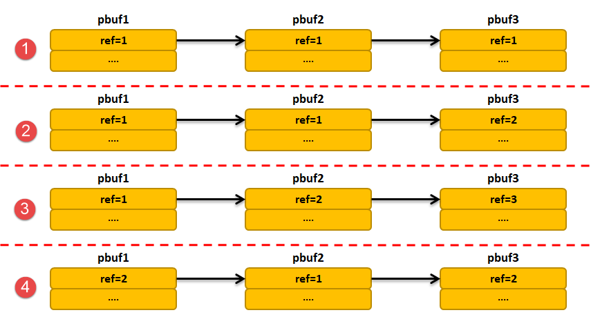

网络数据包
----------

TCP/IP
是一种数据通信机制，因此，协议栈的实现本质上就是对数据包进行处理，为了实现高效的效率，LwIP数据包管理要提供一种高效处理的机制。协议栈各层能对数据包进行灵活的处理，同时减少数据在各层间传递时的时间与空间开销，这是提高协议栈工作效率的关键点。在BSD的实现中，一个描述数据包的结构体叫做mbuf，同样的 在
LwIP 中，也有个类似的结构，称之为 pbuf，本章所有知识点将围绕 pbuf
而展开。

什么是数据包？数据包的种类可谓是五花八门，无奇不有，就比如网卡上的接收到的数据，它可以是一个一千多字节的数据包，也可以是几十个字节的ARP数据包，还有用户的数据，这些数据可能存在RAM、ROM上，重点是这些数据大小不一，可以是几个字节，也看是上千个字节，并且LwIP各层在数据处理的时候极力避免进行数据的拷贝，所以就需要一个数据包这些数据进行统一的管理，使得LwIP处理效率更加高效。

TCP/IP协议的分层思想
~~~~~~~~~~~~~~~~~~~~

在标准的TCP/IP协议栈中，各层之间都是一个独立的模块，它有着很清晰的层次结构，每一层只负责完成该层的处理，不会越界到其他层次去读写数据。而LwIP只是一个轻量级TCP/IP协议栈，它只是一个较完整的TCP/IP协议，多应用在嵌入式领域中，由于处理器的性能有限，LwIP并没有采用很明确的分层结构，它假设各层之间的部分数据和结构体和实现原理在其他层是可见的，简单来说就传输层知道IP层是如何封装数据、传递数据的，IP层知道链路层是怎么封装数据的等等。

为什么要模糊分层的处理？简单来说就是为了提高效率，例如链路层完成数据包在物理线路上传输的封装；IP层完成数据包的选择和路由，负责将数据包发送到目标主机；传输层负责根据IP地址将数据包传输到指定主机，端口号识别一台主机的线程，向不同的应用层递交数据；但是，如果按照标准的TCP/IP协议栈这种严格的分层思想，在数据传输的时候就需要层层拷贝，因为各层之间的内存都不是共用的，在链路层递交到IP层需要拷贝，在IP层递交到传输层需要拷贝，反之亦然，这样子每当收到或者发送一个数据的时候都要CPU去拷贝数据，这个效率就太慢了，所以LwIP假设各层之间的资源都是共用的，各层之间的实现方式也是已知的，那么在IP层往传输层递交数据的时候，链路层往IP层递交数据的时候就无需再次拷贝，直接操作协议栈中属于其他层次的字段，得到相应的信息，然后直接读取传递的数据即可，这样子处理的方式就无需拷贝，各个层次之间存在交叉存取数据的现象，既节省系统的空间也节省处理的时间，而且更加灵活。例如在传输层，在计算TCP报文段的校验以及TCP在重装无需报文时，TCP层必须知道该报文的源IP地址和目的IP地址，为了得到这些信息，传输层并不是调用IP层的接口，而是直接访问数据包中的IP数据报首部，因为传输层已经知道IP层的数据报的格式及作用，直接访问读取这些信息即可。

在小型嵌入式设备中，LwIP与用户程序之间通常没有太严格的分层结构，这种方式允许用户处理数据与内核之间变得更加宽松。LwIP假设用户完全了解协议栈内部的数据处理机制，用户程序可以直接访问协议栈内部各层的数据包，可以让协议栈与用户使用同样的内存区域，允许用户直接对这片区域进行读写操作，这样子就很好地避免了拷贝的现象，当然这样子的做法也有缺陷，取决于用户对协议栈处理过程的了解程度，因为数据是公共的，如果处理不正确那就让协议栈也没法正常工作。

当然，除了标准的TCP/IP协议，还存在很多其他的TCP/IP协议，即使这些协议栈内部存在着模糊分层、交叉存取现象，但是对协议栈外部的应用层则保持着明显的分层结构，在操作系统中，TCP/IP协议栈往往被设计为内核代码的一部分，用户可以的函数仅仅是协议栈为用户提供的那些，或者直接完全封装起来，用户的操作类似于读写文件的方式进行（如BSD
Socket），这样子用户就无法避免数据的拷贝，在数据发送的时候，用户数据必须从用户区域拷贝到协议栈内部，在数据接收的时候，协议栈内部数据也将被拷贝到用户区域。

严格按照TCP协议的分层思想会导致数据包在各层递交产生内存拷贝问题，影响性能。为了节省时间和空间的开销，LwIP没有遵循严格的分层机制，各层次之间存在交叉存取的现象，提高效率。

由于LwIP的内存共享机制，使得应用程序能直接对协议栈内核的内存区域直接操作，减少时间和空间的损耗。

LwIP的线程模型
~~~~~~~~~~~~~~

线程模型可以理解为协议栈的实现被划分在多个线程之中，如让协议栈的各个层次都独立成为一个线程，在这种模式下，各个层次都有严格分层结构，各个层次的提供的API接口也是分层清晰的，这样子能使得编程的时候更加简便，代码的组织也更加灵活，当然，按照前面所说的，在嵌入式设备中，这种严格的分层结构并不是最好的，在数据包向其他层递交的时候，都需要进行拷贝以及切换线程，这是一个很大的开销，当数据量太大的时候，这种开销就足以导致系统没法处理大量的数据，如一个数据包在各个层次间的递交至少需要进行3次切换线程：底层网卡接收到一个数据包，此时是链路层的线程在工作，当它往上层递交该数据包的时候，就需要切换线程，该数据包被拷贝到IP层，此时是IP层的线程在工作，当IP层处理完毕之后，要向传输层递交数据包，那么此时又需要切换线程，到传输层的线程中处理该数据包，这样子使得协议栈的效率非常低下。

还有一种方式就是协议栈与操作系统融合，成为操作系统的一部分，这样子用户线程与协议栈内核之间都是通过操作系统提供的函数来实现的，这种情况让协议栈各层之间与用户线程就没有很严格的分层结构，各层之间能交叉存取，从而提高效率。

但是LwIP采用了另一种方式，让协议栈内核与操作系统相互隔离，协议栈仅仅作为操作系统的一个独立线程存在，用户程序能驻留在协议栈内部，协议栈通过回调函数实现用户与协议栈之间的数据交互；也可以让用户程序单独实现一个线程，与协议栈使用系统的信号量和邮箱等IPC通信机制联系起来，进行数据的交互。当使用第一种通过回调函数进行交互情况的时候，也就是我们所说的RAW
API编程，而使用第二种通过操作系统IPC通信机制的时候，就是另外两种API编程，即NETCONN
API和Socket
API。当然这样子既有优点也有缺点，优点就是能在任何的操作系统中移植，缺点就是受到操作系统的影响，因为即使LwIP作为一个独立的线程，也是需要借助操作系统进行调度的，因此，协议栈的响应的实时性会有一定影响，并且建议设置LwIP线程的优先级为最高优先级。

pbuf结构体说明
~~~~~~~~~~~~~~

pbuf就是一个描述协议栈中数据包的数据结构，LwIP中在pbuf.c和pubf.h实现了协议栈数据包管理的所有函数与数据结构，pbuf数据结构的定义具体见
代码清单6_1_。

代码清单 6‑1pbuf结构体

.. code-block:: c
   :name: 代码清单6_1

    /** Main packet buffer struct */
    struct pbuf
    {
        /** next pbuf in singly linked pbuf chain */
        struct pbuf *next;					(1)

        /** pointer to the actual data in the buffer */
        void *payload;					(2)

        u16_t tot_len;					(3)

        /** length of this buffer */
        u16_t len;					(4)

        u8_t type_internal;				(5)

        /** misc flags */
        u8_t flags;					(6)

        LWIP_PBUF_REF_T ref;				(7)

        /** For incoming packets, this contains the input netif's index */
        u8_t if_idx;					(8)
    };

代码清单
6‑1\ **(1)**\ ：next是一个pbuf类型的指针，指向下一个pbuf，
因为网络中的数据包可能很大，而pbuf能管理的数据包大小有限，
就会采用链表的形式将所有的pbuf包连接起来，这样子才能完整描述一个数据包，
这些连接起来的pbuf包会组成一个链表，我称之为pbuf链表。

代码清单
6‑1\ **(2)**\ ：payload是一个指向数据区域的指针，指向该pbuf管理的数据区域起始地址，
这里的数据区域可以是紧跟在pbuf结构体地址后面的RAM空间，也可以是ROM中的某个地址上，取决于pbuf的类型。

代码清单
6‑1\ **(3)**\ ：tot_len中记录的是当前pbuf及其后续pbuf所有数据的长度，
例如如果当前pbuf是pbuf链表上第一个数据结构，那么tot_len就记录着整个pbuf链表中所有pbuf中数据的长度；
如果当前pbuf是链表上最后一个数据结构，那就记录着当前pbuf的长度。

代码清单 6‑1\ **(4)**\ ：len表示当前pbuf中有效的数据长度。

代码清单
6‑1\ **(5)**\ ：type_internal表示pbuf的类型，LwIP中有4种pbuf的类型，
并且使用了一个枚举类型的数据结构定义他们，具体见代码清单
6‑2。

代码清单
6‑1\ **(6)**\ ：flags字段在初始化的时候一般被初始化为0，此处就不对flags字段进行过多讲解。

代码清单
6‑1\ **(7)**\ ：ref表示该pbuf被引用的次数，引用表示有其他指针指向当前pbuf，
这里的指针可以是pbuf的next指针，也可以是其他任意形式的指针，初始化一个pbuf的时候，
ref会被设置为1，因为该pbuf的地址一点会被返回一个指针变量，当有其他指针指向pbuf的时候，
就必须调用相关函数将ref字段加1。

代码清单
6‑1\ **(8)**\ ：if_idx用于记录传入的数据包中输入netif的索引，也就是netif中num字段。

pbuf的类型
~~~~~~~~~~

代码清单 6‑2pbuf的类型

.. code-block:: c
   :name: 代码清单6_2

    typedef enum
    {
        PBUF_RAM = (PBUF_ALLOC_FLAG_DATA_CONTIGUOUS |
                    PBUF_TYPE_FLAG_STRUCT_DATA_CONTIGUOUS |
                    PBUF_TYPE_ALLOC_SRC_MASK_STD_HEAP),

        PBUF_ROM = PBUF_TYPE_ALLOC_SRC_MASK_STD_MEMP_PBUF,

        PBUF_REF = (PBUF_TYPE_FLAG_DATA_VOLATILE |
                    PBUF_TYPE_ALLOC_SRC_MASK_STD_MEMP_PBUF),

        PBUF_POOL = (PBUF_ALLOC_FLAG_RX |
                    PBUF_TYPE_FLAG_STRUCT_DATA_CONTIGUOUS |
                    PBUF_TYPE_ALLOC_SRC_MASK_STD_MEMP_PBUF_POOL)

    } pbuf_type;

pbuf的类型有4种，分别为PBUF_RAM、PBUF_POOL 、PBUF_ROM、PBUF_REF。

PBUF_RAM类型的pbuf
^^^^^^^^^^^^^^^^^^

PBUF_RAM类型的pbuf空间是通过内存堆分配而来的，这种类型的pbuf在协议栈中使用得最多，
一般协议栈中要发送的数据都是采用这种形式，在申请这种pbuf内存块的时候，
协议栈会在管理的内存堆中根据需要的大小进行分配对应的内存空间，这种pbuf内存块包含数据空间以及pbuf数据结构区域，
在连续的RAM内存空间中。很多人又会有疑问了，不是说各个协议层都有首部吗，这些内存空间在哪呢？
能想到这一层的读者是非常聪明的，我很欣慰，你们有认真看前面的章节，内核申请这类型的pbuf时，
也算上了协议首部的空间，当然是根据协议栈不同层次需要的首部进行申请，
LwIP也使用一个枚举类型对不同的协议栈分层需要的首部大小进行定义，关于各层间的首部区域我们在后续讲解，
此处只需知道即可。那么申请这种pbuf是怎么样申请的呢？具体见
代码清单6_3_。

代码清单 6‑3申请PBUF_RAM类型的pbuf（伪代码）

.. code-block:: c
   :name: 代码清单6_3

    /* 函数原型 */
    struct pbuf *
    pbuf_alloc(pbuf_layer layer, u16_t length, pbuf_type type);

    //例子
    struct pbuf *p;

    p = pbuf_alloc(PBUF_RAW, (u16_t)(req_len + 1), PBUF_RAM);

    p = pbuf_alloc(PBUF_TRANSPORT, 1472, PBUF_RAM);

PBUF_RAM类型的pbuf示意图具体见
图6_1_，图中可以看出整个pbuf就是一个连续的内存区域，layer（offset）就是各层协议的首部，
如TCP报文首部、IP首部、以太网帧首部等，预留出来的这些空间是为了在各个协议层中灵活地处理这些数据，
当然layer的大小也可以是0，具体是多少就与数据包的申请方式有关，具体在后面的章节中讲解。

图 6‑1PBUF_RAM类型的pbuf

PBUF_POOL类型的pbuf
^^^^^^^^^^^^^^^^^^^

PBUF_POOL类型的pbuf与PBUF_RAM类型的pbuf都是差不多的，其pbuf结构体与数据缓冲区也是存在于连续的内存块中，但它的空间是通过内存池分配的，这种类型的pbuf可以在极短的时间内分配得到，因为这是内存池分配策略的优势，在网卡接收数据的时候，LwIP一般就使用这种类型的pbuf来存储接收到的数据，申请PBUF_POOL类型时，协议栈会在内存池中分配适当的内存池个数以满足需要的数据区域大小。

除此之外，在系统进行内存池初始化的时候，还好初始化两个与pbuf相关的内存池，分别为MEMP_PBUF、MEMP\_
PBUF_POOL，具体见 代码清单6_4_。

代码清单 6‑4与pbuf相关的内存池

.. code-block:: c
   :name: 代码清单6_4

    LWIP_MEMPOOL(PBUF, MEMP_NUM_PBUF, sizeof(struct pbuf),"PBUF_REF/ROM")
    LWIP_PBUF_MEMPOOL(PBUF_POOL,PBUF_POOL_SIZE,PBUF_POOL_BUFSIZE,"PBUF_POOL")

MEMP_PBUF内存池是专门用于存放pbuf数据结构的内存池，主要用于PBUF_ROM、PBUF_REF类型的pbuf，其大小为sizeof(struct
pbuf)，内存块的数量为MEMP_NUM_PBUF；而MEMP_PBUF_POOL则包含pbuf结构与数据区域，也就是PBUF_POOL类型的pbuf，内存块的大小为PBUF_POOL_BUFSIZE，其值由用户自己定义，默认为590（536+40+0+14）字节，当然也可以由我们定义TCP_MSS的大小改变该宏定义，我们将宏定义TCP_MSS的值定义为1460，这样子我们PBUF_POOL类型的pbuf的内存池大小为1514（1460+40+0+14），内存块的个数为PBUF_POOL_SIZE。

如果按照默认的内存大小，对于有些很大的以太网数据包，可能就需要多个pbuf才能将这些数据存放下来，这就需要申请多个pbuf，因为是PBUF_POOL类型的pbuf，所以申请内存空间只需要调用memp_malloc()函数进行申请即可。然后再将这些pbuf通过链表的形式连接起组成pbuf链表上，以保证用户的空间需求，分配与连接成功的pbuf示意图具体见
图6_2_。

图 6‑2 PBUF_POOL类型pbuf（组成pbuf链表）

注意了，pbuf链表中第一个pbuf是有layer字段的，用于存放协议头部，而在它后面的pbuf则是没有该字段，由于PBUF_POOL类型pbuf都是以固定长度分配的，在最后一个pbuf中，可能会被浪费大量的空间，并且，每个pbuf的tot_len字段记录的就是自身及其后面的pbuf总大小。

PBUF_ROM和PBUF_REF类型pbuf
^^^^^^^^^^^^^^^^^^^^^^^^^^

PBUF_ROM和PBUF_REF类型的pbuf基本是一样的，它们在内存池申请的pbuf不包含数据区域，只包含pbuf结构体，即MEMP_PBUF类型的POOL，这也是PBUF_ROM和PBUF_REF与前面两种类型的pbuf最大的差别。

PBUF_ROM类型的pbuf的数据区域存储在ROM中，是一段静态数据，而PBUF_REF类型的pbuf的数据区域存储在RAM空间中。申请这两种类型的pbuf时候也是只需要调用memp_malloc()函数从内存池中申请即可，申请内存的大小就是MEMP_PBUF，它只是一个pbuf结构体大小，正确分配到的pbuf内存块示意图具体见
图6_3_。

图 6‑3 PBUF_ROM/PBUF_REF类型pbuf

最后，作者想要提醒一下大家，对于一个数据包，它可能会使用任意类型的pbuf进行描述，也可能使用多种不同的pbuf一起描述，如
图6_4_ 所示，就是采用多种pbuf描述一个数据包，但是无论怎么样描述，数据包的处理都是不变的，
payload指向的始终是数据区域，采用链表的形式连接起来的数据包，
其tot_len字段永远是记录当前及其后续pbuf的总大小。

图 6‑4不同类型的pbuf组成pbuf链表

pbuf_alloc()
~~~~~~~~~~~~

数据包申请函数pbuf_alloc()在系统中的许多地方都会用到，例如在网卡接收数据时，需要申请一个数据包，
然后将网卡中的数据填入数据包中；在发送数据的时候，协议栈会申请一个pbuf数据包，
并将即将发送的数据装入到pbuf中的数据区域，同时相关的协议首部信息也会被填入到pbuf中的layer区域内，
所以pbuf数据包的申请函数几乎无处不在，存在协议栈于各层之中，当然，在不同层的协议中，
layer字段的大小是不一样的，因为不一样的协议其首部大小是不同的，这个知识点会在后文讲解各协议的时候讲解，
此处只需了解一下即可。协议栈中各层首部的大小都会被预留出来，LwIP采用枚举类型的变量将各个层的首部大小记录下来，
在申请的时候就把layer需要空间的大小根据协议进行分配，具体见
代码清单6_5_。

代码清单 6‑5各层协议首部大小

.. code-block:: c
   :name: 代码清单6_5

    #define PBUF_TRANSPORT_HLEN 20
    #define PBUF_IP_HLEN        20

    typedef enum
    {
        PBUF_TRANSPORT = PBUF_LINK_ENCAPSULATION_HLEN +
                PBUF_LINK_HLEN + PBUF_IP_HLEN + PBUF_TRANSPORT_HLEN,(1)

        PBUF_IP = PBUF_LINK_ENCAPSULATION_HLEN +
                PBUF_LINK_HLEN + PBUF_IP_HLEN,			(2)

        PBUF_LINK = PBUF_LINK_ENCAPSULATION_HLEN + PBUF_LINK_HLEN,	(3)

        PBUF_RAW_TX = PBUF_LINK_ENCAPSULATION_HLEN,			(4)

        PBUF_RAW = 0						(5)
    } pbuf_layer;

代码清单
6‑5\ **(1)**\ ：传输层协议首部内存空间，如UDP、TCP报文协议首部。

代码清单 6‑5\ **(2)**\ ：网络层协议首部内存空间，如IP协议。

代码清单 6‑5\ **(3)**\ ：链路层协议首部内存空间，如以太网。

代码清单 6‑5\ **(4)(5)**\ ： 原始层，不预留空间，
PBUF_LINK_ENCAPSULATION_HLEN宏定义默认为0。

数据包申请函数有两个重要的参数：数据包pbuf的类型和数据包在哪一层被申请。数据包类型就是我们之前讲的那四种，数据包在哪一层申请这个参数主要是为了预留各层协议的内存大小，也就是前面所说的layer值，当数据包申请时，所处的层次不同，就会导致预留空间的的layer值不同。

pbuf分配函数pbuf_alloc()的实现具体见 代码清单6_6_。

代码清单 6‑6 pbuf_alloc()源码

.. code-block:: c
   :name: 代码清单6_6

    struct pbuf *
    pbuf_alloc(pbuf_layer layer, u16_t length, pbuf_type type)
    {
        struct pbuf *p;
        u16_t offset = (u16_t)layer;

        switch (type)
        {
        case PBUF_REF: /* fall through */
        case PBUF_ROM:
            p = pbuf_alloc_reference(NULL, length, type);		(1)
            break;
        case PBUF_POOL:						(2)
        {
            struct pbuf *q, *last;
            u16_t rem_len; /* remaining length */
            p = NULL;
            last = NULL;
            rem_len = length;
            do
            {
                u16_t qlen;
                q = (struct pbuf *)memp_malloc(MEMP_PBUF_POOL);	(3)
                if (q == NULL)					(4)
                {
                    PBUF_POOL_IS_EMPTY();
                    /* free chain so far allocated */
                    if (p)
                    {
                        pbuf_free(p);				(5)
                    }
                    /* bail out unsuccessfully */
                    return NULL;
                }
                qlen = LWIP_MIN(rem_len,(u16_t)(PBUF_POOL_BUFSIZE_ALIGNED -
                                LWIP_MEM_ALIGN_SIZE(offset)));	(6)
                pbuf_init_alloced_pbuf(q, LWIP_MEM_ALIGN((void *)
                            ((u8_t *)q + SIZEOF_STRUCT_PBUF + offset)),
                                rem_len, qlen, type, 0);		(7)

                if (p == NULL)
                {
                    /* allocated head of pbuf chain (into p) */
                    p = q;
                }
                else
                {
                    /* make previous pbuf point to this pbuf */
                    last->next = q;				(8)
                }
                last = q;
                rem_len = (u16_t)(rem_len - qlen);			(9)
                offset = 0;
            }
            while (rem_len > 0);					(10)
            break;
        }
        case PBUF_RAM:						(11)
        {
            u16_t payload_len = (u16_t)(LWIP_MEM_ALIGN_SIZE(offset) +
                                LWIP_MEM_ALIGN_SIZE(length));
            mem_size_t alloc_len = (mem_size_t)
                (LWIP_MEM_ALIGN_SIZE(SIZEOF_STRUCT_PBUF) + payload_len); (12)

            if ((payload_len < LWIP_MEM_ALIGN_SIZE(length)) ||
                    (alloc_len < LWIP_MEM_ALIGN_SIZE(length)))
            {
                return NULL;
            }

            /* If pbuf is to be allocated in RAM, allocate memory for it. */
            p = (struct pbuf *)mem_malloc(alloc_len);		(13)
            if (p == NULL)
            {
                return NULL;
            }
            pbuf_init_alloced_pbuf(p, LWIP_MEM_ALIGN((void *)
                                ((u8_t *)p + SIZEOF_STRUCT_PBUF + offset)),
                                length, length, type, 0);		(14)

            break;
        }
        default:
            return NULL;						(15)
        }
        return p;
    }

代码清单
6‑6\ **(1)**\ ：根据具体的pbuf类型进行分配，对于PBUF_ROM与PBUF_REF类型的pbuf，只分配pbuf结构体空间大小。

代码清单
6‑6\ **(2)**\ ：对于PBUF_POOL这种类型的pbuf，可能需要进行分配几个内存块才能描述一个数据包。

代码清单
6‑6\ **(3)**\ ：调用memp_malloc(MEMP_PBUF_POOL)分配内存块吗，内存块类型为MEMP_PBUF_POOL。

代码清单 6‑6\ **(4)**\ ：分配失败，可能内存块已经用完。

代码清单
6‑6\ **(5)**\ ：如果前面分配内存块成功，但是这次分配失败，无法描述一个完整的数据包，则将之前分配的内存块都释放掉。

代码清单 6‑6\ **(6)**\ ：分配成功，得到实际数据区域长度。

代码清单 6‑6\ **(7)**\ ：初始化pbuf结构体的成员变量。

代码清单 6‑6\ **(8)**\ ：将这些pbuf连接成pbuf链表。

代码清单 6‑6\ **(9)**\ ：计算存下所有数据需要的长度。

代码清单 6‑6\ **(10)**\ ：继续分配内存块，直到将所有的数据装下为止

代码清单
6‑6\ **(11)**\ ：对于PBUF_RAM这种类型的pbuf，内核将从内存堆中申请pbuf。

代码清单 6‑6\ **(12)**\ ：计算要申请的内存大小。

代码清单 6‑6\ **(13)**\ ：调用mem_malloc()函数申请内存。

代码清单 6‑6\ **(14)**\ ：初始化pbuf结构体的成员变量。

代码清单 6‑6\ **(15)**\ ：类型超出预期，直接返回。

pbuf_alloc()函数的思路很清晰，根据传入的pbuf类型及协议层次layer，去申请对应的pbuf，就能预留出对应的协议首部空间，对于PBUF_ROM与PBUF_REF类型的pbuf，内核不会申请数据区域，因此，pbuf结构体中payload指针就需要用户自己去设置，我们通常在申请PBUF_ROM与PBUF_REF类型的pbuf成功后，紧接着就将payload指针指向某个数据区域。

举个例子，假设TCP协议需要申请一个pbuf数据包，那么就会调用下面代码进行申请：

代码清单 6‑7 TCP协议申请数据包（伪代码）

.. code-block:: c
   :name: 代码清单6_7

    p = pbuf_alloc(PBUF_TRANSPORT, 1472, PBUF_RAM);

内核就会根据这句代码进行分配一个PBUF_RAM类型的pbuf，其数据区域大小是1472字节，并且会根据协议层次进行预留协议首部空间，由于是传输层，所以内核需要预留54个字节空间，即以太网帧首部长度PBUF_LINK_HLEN（14字节）、IP数据报首部长度PBUF_IP_HLEN（20字节）、TCP首部长度PBUF_TRANSPORT_HLEN（20字节）。当数据报往下层递交的时候，其他层直接填充对应的协议首部即可，无需对数据进行拷贝等操作，这也是LwIP能快速处理的优势。

pbuf_free()
~~~~~~~~~~~

数据包pbuf的释放是必须的，因为当内核处理完数据就要将这些资源进行回收，否则就会造成内存泄漏，在后续的数据处理中无法再次申请内存。当底层将数据发送出去后或者当应用层将数据处理完毕的时候，数据包就要被释放掉。

当然，既然要释放数据包，那么肯定有条件，pbuf中ref字段就是记录pbuf数据包被引用的次数，在申请pbuf的时候，ref字段就被初始化为1，当释放pbuf的时候，先将ref减1，如果ref减1后为0，则表示能释放pbuf数据包，此外，能被内核释放的pbuf数据包只能是首节点或者其他地方未被引用过的节点，如果用户错误地调用pbuf释放函数，将pbuf链表中的某个中间节点删除了，那么必然会导致错误。

前面我们也说了，一个数据包可能会使用链表的形式将多个pbuf连接起来，那么假如删除一个首节点，怎么保证删除完属于一个数据包的数据呢？很简单，LwIP的数据包释放函数会自动删除属于一个数据包中连同首节点在内所有pbuf，举个例子，假设一个数据包需要3个pbuf连接起来，那么在删除第一个pbuf的时候，内核会检测一下它下一个pbuf释放与首节点是否存储同一个数据包的数据，如果是那就将第二个节点也删除掉，同理第三个也会被删除。但如果删除某个pbuf链表的首节点时，链表中第二个节点的pbuf中ref字段不为0，则表示该节点还在其他地方被引用，那么第二个节点不与第一个节点存储同一个数据包，那么就不会删除第二个节点。

下面用示意图来解释一下删除的过程，假设有4个pbuf链表，链表中每个pbuf的ref都有一个值，具体见
图6_5_，当调用pbuf_free()删除第一个节点的时候，剩下的pbuf变化情况，具体见。

图 6‑5开始时4个pbuf链表

图 6‑6删除第一个节点后的pbuf’链表

从这两张图中我们也看到了，当删除第一个节点后，如果后续的pbuf的ref为1（即与第一个节点存储同一个数据包），那么该节点也会被删除。第一个pbuf链表在删除首节点之后就不存在节点；第二个pbuf链表在删除首节点后只存在pbuf3；第三个pbuf链表在删除首节点后还存在pbuf2与pbuf3；第四个链表还不能删除首节点，因为该数据包还在其他地方被引用了。

pbuf_free()函数源码具体见 代码清单6_8_。

代码清单 6‑8pbuf_free()函数

.. code-block:: c
   :name: 代码清单6_8

    u8_t
    pbuf_free(struct pbuf *p)
    {
        u8_t alloc_src;
        struct pbuf *q;
        u8_t count;

        if (p == NULL)
        {
            return 0;					(1)
        }

        PERF_START;

        count = 0;

        while (p != NULL)
        {
            LWIP_PBUF_REF_T ref;

            SYS_ARCH_DECL_PROTECT(old_level);

            SYS_ARCH_PROTECT(old_level);

            ref = --(p->ref);				(2)
            SYS_ARCH_UNPROTECT(old_level);
            /* this pbuf is no longer referenced to? */
            if (ref == 0)
            {
                /* remember next pbuf in chain for next iteration */
                q = p->next;				(3)

                alloc_src = pbuf_get_allocsrc(p);		(4)
                /* is this a pbuf from the pool? */
                if (alloc_src == PBUF_TYPE_ALLOC_SRC_MASK_STD_MEMP_PBUF_POOL)
                {
                    memp_free(MEMP_PBUF_POOL, p);
                    /* is this a ROM or RAM referencing pbuf? */
                }
                else if (alloc_src == PBUF_TYPE_ALLOC_SRC_MASK_STD_MEMP_PBUF)
                {
                    memp_free(MEMP_PBUF, p);
                    /* type == PBUF_RAM */
                }
                else if (alloc_src == PBUF_TYPE_ALLOC_SRC_MASK_STD_HEAP)
                {
                    mem_free(p);
                }
                else
                {
                    /* @todo: support freeing other types */
                    LWIP_ASSERT("invalid pbuf type", 0);
                }
                count++;					(5)
                /* proceed to next pbuf */
                p = q;					(6)
                /* p->ref > 0, this pbuf is still referenced to */
                /* (and so the remaining pbufs in chain as well) */
            }
            else
            {
                /* stop walking through the chain */
                p = NULL;
            }
        }
        PERF_STOP("pbuf_free");
        /* return number of de-allocated pbufs */
        return count;
    }

代码清单 6‑8\ **(1)**\ ：如果释放的pbuf地址为空，则直接返回。

代码清单 6‑8\ **(2)**\ ：将pbuf中ref字段减一。

代码清单
6‑8\ **(3)**\ ：若ref为0，表示该pbuf被引用次数为0，则可以删除该pbuf，用q记录下当前pbuf的下一个pbuf。

代码清单
6‑8\ **(4)**\ ：获取当前pbuf的类型，根据不一样的类型进行不一样的释放操作，
如果是从内存池中申请的pbuf，则调用memp_free()函数进行释放，
如PBUF_POOL、PBUF_ROM和PBUF_REF类型的pbuf，如果是从内存堆中申请的，
就调用mem_free()函数进行释放内存，如PBUF_RAM类型的pbuf。

代码清单 6‑8\ **(5)**\ ：记录删除的pbuf个数。

代码清单
6‑8\ **(6)**\ ：处理链表中的下一个pbuf，直到pbuf中引用次数不为0才退出。

pbuf的释放要小心，如果pbuf是串成链表的话，
pbuf在释放的时候，就会把pbuf的ref值减1，然后函数会判断ref减完之后是不是变成0，如果是0就会根据pbuf的类型调用内存池或者内存堆回收函数进行回收。然后这里就有个很危险的事，对于这个pbuf_free()函数，用户传递的参数必须是链表头指针，假如不是链表头而是指向链表中间的某个pbuf的指针，那就很容易出现问题，因为这个pbuf_free()函数可不会帮我们检查是不是链表头，这样子势必会导致一部分pbuf没被回收，意味着一部分内存池就这样被泄漏了，以后没办法用了。同时，还可能将一些尚未处理的数据回收了，这样子整个系统就乱套了。

其它pbuf操作函数
~~~~~~~~~~~~~~~~~~~~~~

pbuf_realloc()
^^^^^^^^^^^^^^^^^^

pbuf_realloc()函数在相应pbuf(链表）尾部释放一定的空间，将数据包pbuf中的数据长度减少为某个长度值。对于PBUF_RAM类型的pbuf，函数将调用内存堆管理中介绍到的mem_realloc()函数，释放这些多余的空间。对于其他三种类型的pbuf，该函数只是修改pbuf中的长度字段值，并不释放对应的内存池空间。

pbuf_header()
^^^^^^^^^^^^^

pbuf_header()函数用于调整pbuf的payload指针（向前或向后移动一定字节数），在前面也说到过，在pbuf的数据区前可能会预留一些协议首部空间，而pbuf被创建时，payload指针是指向数据区的，为了实现对这些预留空间的操作，可以调用pbuf_header()函数使payload指针指向数据区前的首部字段，这就为各层对数据包首部的操作提供了方便。当然，进行这个操作的时候，len和tot_len字段值也会随之更新。

pbuf_take()
^^^^^^^^^^^

pbuf_take()函数用于向pbuf的数据区域拷贝数据。pbuf_copy()函数用于将一个任何类型的pbuf中的数据拷贝到一个PBUF_RAM类型的pbuf中。pbuf_chain()函数用于连接两个pbuf（链表）为一个pbuf链表。pbuf_ref函数用于将pbuf中的值加1。

网卡中使用的pbuf
~~~~~~~~~~~~~~~~

在第4章
讲解网卡的时候，我们仅仅讲解了网卡初始化相关的内容，但是对于网卡的接收数据与发送数据并未做过多的讲解，现在我们学习了pbuf数据包，那么就能编写网卡底层的接收与发送数据相关的代码了。

low_level_output()
^^^^^^^^^^^^^^^^^^

网卡发送数据是通过low_level_output()函数实现的，该函数是一个底层驱动函数，
这要求用户熟悉网卡底层特性，还要熟悉pbuf数据包。首先说说发送数据的过程，
用户在应用层想要通过一个网卡发送数据，那么就要将数据传入LwIP内核中，经过内核的传输层封装、
IP层封装等等，简单来说就是上层将要发送的数据层层封装，存储在pbuf数据包中，
可能数据很大，想要多个pbuf才能存放得下，这时候pbuf就以链表的形式存在，当数据发送的时候，
就要将属于一个数据包的数据全部发送出去，此处需要注意的是，
属于同一个数据包中的所有数据都必须放在同一个以太网帧中发送。low_level_output()函数的实现具体见 代码清单6_9_。

代码清单 6‑9 low_level_output()实现

.. code-block:: c
   :name: 代码清单6_9

    static err_t low_level_output(struct netif *netif, struct pbuf *p)
    {
        err_t errval;
        struct pbuf *q;
        uint8_t *buffer = (uint8_t *)(heth.TxDesc->Buffer1Addr);
        __IO ETH_DMADescTypeDef *DmaTxDesc;
        uint32_t framelength = 0;
        uint32_t bufferoffset = 0;
        uint32_t byteslefttocopy = 0;
        uint32_t payloadoffset = 0;
        DmaTxDesc = heth.TxDesc;
        bufferoffset = 0;

        /* copy frame from pbufs to driver buffers */
        for (q = p; q != NULL; q = q->next)				(1)
        {
            /* Is this buffer available? If not, goto error */
            if ((DmaTxDesc->Status & ETH_DMATXDESC_OWN) != (uint32_t)RESET)
            {
                errval = ERR_USE;
                goto error;					(2)
            }

            /* Get bytes in current lwIP buffer */
            byteslefttocopy = q->len;				(3)
            payloadoffset = 0;

            /* Check if the length of data to copy is bigger than Tx buffer size*/
            while ( (byteslefttocopy + bufferoffset) > ETH_TX_BUF_SIZE ) (4)
            {
                /* Copy data to Tx buffer*/
                memcpy( (uint8_t*)((uint8_t*)buffer + bufferoffset),
                        (uint8_t*)((uint8_t*)q->payload + payloadoffset),
                        (ETH_TX_BUF_SIZE - bufferoffset) );		(5)

                /* Point to next descriptor */
                DmaTxDesc = (ETH_DMADescTypeDef *)(DmaTxDesc->Buffer2NextDescAddr); (6)

                /* Check if the buffer is available */
                if((DmaTxDesc->Status & ETH_DMATXDESC_OWN) != (uint32_t)RESET)
                {
                    errval = ERR_USE;
                    goto error;					(7)
                }

                buffer = (uint8_t *)(DmaTxDesc->Buffer1Addr);	(8)

                byteslefttocopy = byteslefttocopy - (ETH_TX_BUF_SIZE - bufferoffset);
                payloadoffset = payloadoffset + (ETH_TX_BUF_SIZE - bufferoffset);
                framelength = framelength + (ETH_TX_BUF_SIZE - bufferoffset);
                bufferoffset = 0;					(9)
            }

            /* Copy the remaining bytes */
            memcpy( (uint8_t*)((uint8_t*)buffer + bufferoffset),
                    (uint8_t*)((uint8_t*)q->payload + payloadoffset), byteslefttocopy );
            bufferoffset = bufferoffset + byteslefttocopy;
            framelength = framelength + byteslefttocopy;		(10)
        }

        /* Prepare transmit descriptors to give to DMA */
        HAL_ETH_TransmitFrame(&heth, framelength);			(11)

        errval = ERR_OK;

    error:

        /* When Transmit Underflow flag is set, clear it and issue a
        Transmit Poll Demand to resume transmission */
        if ((heth.Instance->DMASR & ETH_DMASR_TUS) != (uint32_t)RESET)
        {
            /* Clear TUS ETHERNET DMA flag */
            heth.Instance->DMASR = ETH_DMASR_TUS;			(12)

            /* Resume DMA transmission*/
            heth.Instance->DMATPDR = 0;				(13)
        }
        return errval;
    }

代码清单
6‑9\ **(1)**\ ：前面也说了，可能一个pbuf没法存储所有的数据，
LwIP就会使用链表形式的pbuf将所有属于一个数据包的数据存储起来，
那么在发送的时候就要变量这个pbuf链表，将所有数据都取出来。

代码清单
6‑9\ **(2)**\ ：判断一下要发送数据的缓冲区可用吗？如果不可用，就跳转错误。

代码清单 6‑9\ **(3)**\ ：获取pbuf中的数据长度。

代码清单
6‑9\ **(4)**\ ：检查要拷贝的数据长度是否大于ETH_TX_BUF_SIZE的大小，当数据长度大于以太网发送缓冲区的时候，就需要分批次拷贝了。

代码清单
6‑9\ **(5)**\ ：将pbuf中payload指向数据区域的数据拷贝到缓冲区，拷贝的大小就是缓冲区的大小。

代码清单
6‑9\ **(6)**\ ：指向下一个发送的描述符（描述符是STM32以太网中的一种数据结构，此处了解一下即可）。

代码清单
6‑9\ **(7)**\ ：检查一下要发送数据的缓冲区可用吗？如果不可用，就跳转错误。

代码清单 6‑9\ **(8)**\ ：得到新的buff地址。

代码清单
6‑9\ **(9)**\ ：计算还需要拷贝的长度、得到要偏移的数据地址、
记录已经拷贝的长度，重新进行拷贝，直到要拷贝的数据长度小于ETH_TX_BUF_SIZE的大小。

代码清单
6‑9\ **(10)**\ ：退出了while循环，拷贝剩余的数据，并记录拷贝了多大的数据。

代码清单 6‑9\ **(11)**\ ：提供传输描述符及长度给DMA启动发送。

代码清单 6‑9\ **(12)**\ ：当发送错误的时候，清除TUS ETHERNET DMA标志位。

代码清单 6‑9\ **(13)**\ ：重新恢复DMA传输。

low_level_input()
^^^^^^^^^^^^^^^^^

与low_level_output()函数相反的是low_level_input()函数，
该函数用于从网卡中接收一个数据包，并将数据包封装在pbuf中递交给上层。
low_level_input()函数的编写也需要用户熟悉pbuf与网卡底层驱动，
该函数的实现具体见 代码清单6_10_。

代码清单 6‑10 low_level_input()实现

.. code-block:: c
   :name: 代码清单6_10

    static struct pbuf * low_level_input(struct netif *netif)
    {
        struct pbuf *p = NULL;
        struct pbuf *q = NULL;
        uint16_t len = 0;
        uint8_t *buffer;
        __IO ETH_DMADescTypeDef *dmarxdesc;
        uint32_t bufferoffset = 0;
        uint32_t payloadoffset = 0;
        uint32_t byteslefttocopy = 0;
        uint32_t i=0;

        /* get received frame */
        if (HAL_ETH_GetReceivedFrame(&heth) != HAL_OK)		(1)
        {
            PRINT_ERR("receive frame faild\n");
            return NULL;
        }
    /*Obtain the size of the packet and put it into the "len" variable. */
        len = heth.RxFrameInfos.length;
        buffer = (uint8_t *)heth.RxFrameInfos.buffer;		(2)

        PRINT_INFO("receive frame len : %d\n", len);

        if (len > 0)
        {
            /* We allocate a pbuf chain of pbufs from the Lwip buffer pool */
            p = pbuf_alloc(PBUF_RAW, len, PBUF_POOL);		(3)
        }

        if (p != NULL)
        {
            dmarxdesc = heth.RxFrameInfos.FSRxDesc;
            bufferoffset = 0;
            for (q = p; q != NULL; q = q->next)			(4)
            {
                byteslefttocopy = q->len;
                payloadoffset = 0;

                /* Check if the length of bytes to copy in
                current pbuf is bigger than Rx buffer size*/
                while ((byteslefttocopy + bufferoffset) > ETH_RX_BUF_SIZE) (5)
                {
                    /* Copy data to pbuf */
                    memcpy( (uint8_t*)((uint8_t*)q->payload + payloadoffset),
                            (uint8_t*)((uint8_t*)buffer + bufferoffset),
                            (ETH_RX_BUF_SIZE - bufferoffset));	 (6)

                    /* Point to next descriptor */
                    dmarxdesc = (ETH_DMADescTypeDef *)(dmarxdesc->Buffer2NextDescAddr);
                buffer = (uint8_t *)(dmarxdesc->Buffer1Addr);    (7)

                    byteslefttocopy = byteslefttocopy -(ETH_RX_BUF_SIZE - bufferoffset);
                    payloadoffset = payloadoffset + (ETH_RX_BUF_SIZE - bufferoffset);
                    bufferoffset = 0;				(8)
                }
                /* Copy remaining data in pbuf */
                memcpy( (uint8_t*)((uint8_t*)q->payload + payloadoffset),
                        (uint8_t*)((uint8_t*)buffer + bufferoffset), byteslefttocopy);
                bufferoffset = bufferoffset + byteslefttocopy;	(9)
            }
        }
        /* Release descriptors to DMA */
        /* Point to first descriptor */
        dmarxdesc = heth.RxFrameInfos.FSRxDesc;			(10)
        /* Set Own bit in Rx descriptors: gives the buffers back to DMA */
        for (i=0; i< heth.RxFrameInfos.SegCount; i++)
        {
            dmarxdesc->Status |= ETH_DMARXDESC_OWN; 		(11)
            dmarxdesc = (ETH_DMADescTypeDef *)(dmarxdesc->Buffer2NextDescAddr);
        }

        /* Clear Segment_Count */
        heth.RxFrameInfos.SegCount =0;				(12)

        /* When Rx Buffer unavailable flag is set: clear it and resume reception */
        if ((heth.Instance->DMASR & ETH_DMASR_RBUS) != (uint32_t)RESET)
        {
            /* Clear RBUS ETHERNET DMA flag */
            heth.Instance->DMASR = ETH_DMASR_RBUS;			(13)
            /* Resume DMA reception */
            heth.Instance->DMARPDR = 0;
        }
        return p;							(14)
    }

代码清单
6‑10\ **(1)**\ ：看看是否接收到数据，如果没有直接返回NULL，如果有则将数据获取到heth数据结构中。

代码清单
6‑10\ **(2)**\ ：获取接收到数据包大小并将其放入len变量中，以及获取数据区域存放在buffer指针中。

代码清单 6‑10\ **(3)**\ ：调用pbuf_alloc()函数从LwIP的内存池中分配pbuf。

代码清单
6‑10\ **(4)**\ ：如果pbuf分配成功，则将内存拷贝到pbuf中，因为pbuf可能不止一个，就需要遍历pbuf链表将所有数据都存储进来。

代码清单
6‑10\ **(5)**\ ：检查一下要拷贝的数据大小于接收缓冲区ETH_RX_BUF_SIZE的大小，
如果要拷贝的数据大于ETH_RX_BUF_SIZE的大小，那么就要分几次拷贝。

代码清单
6‑10\ **(6)**\ ：将接收到的数据拷贝到pbuf中payload指向的数据区域。

代码清单
6‑10\ **(7)**\ ：指向下一个描述符，得到未拷贝的数据区域地址buffer。

代码清单
6‑10\ **(8)**\ ：重新计算还需要拷贝的数据大小byteslefttocopy，
pbuf中数据的偏移量payloadoffset，重置接收缓冲区偏移量bufferoffset，
然后重复进行拷贝，直到要拷贝的数据小于ETH_RX_BUF_SIZE的值，才退出while循环。

代码清单 6‑10\ **(9)**\ ：将剩余的数据拷贝到pbuf中。

代码清单 6‑10\ **(10)**\ ：dmarxdesc变量指向第一个接收描述符。

代码清单
6‑10\ **(11)**\ ：进行遍历描述符列表，将描述符中Status状态设置为ETH_DMARXDESC_OWN。

代码清单 6‑10\ **(12)**\ ：清除描述符中SegCount变量的值。

代码清单 6‑10\ **(13)**\ ：清除DMA标志。

代码清单 6‑10\ **(14)**\ ：重新恢复DMA接收。

ethernetif_input()
^^^^^^^^^^^^^^^^^^

low_level_output()函数只是完成了网卡驱动接收，但是还没将pbuf数据包递交给上层，
那么又是谁将pbuf数据包递交给上层的呢？我们在前面讲解4.3
小节的时候，就知道ethernetif_input()函数会被周期性调用（如果是采用操作系统方式，往往会将该函数变成线程形式运行），这样子就能接收网卡的数据，在接收完毕，就能将数据通过网卡netif的input接口将pbuf递交给上层，该函数的实现具体见
代码清单6_11_。

代码清单 6‑11 ethernetif_input()实现

.. code-block:: c
   :name: 代码清单6_11

    void ethernetif_input(struct netif *netif)
    {
        err_t err;
        struct pbuf *p;

        /* move received packet into a new pbuf */
        p = low_level_input(netif);

        /* no packet could be read, silently ignore this */
        if (p == NULL) return;

        /* entry point to the LwIP stack */
        err = netif->input(p, netif);

        if (err != ERR_OK)
        {
            LWIP_DEBUGF(NETIF_DEBUG, ("ethernetif_input: IP input error\n"));
            pbuf_free(p);
            p = NULL;
        }
    }
