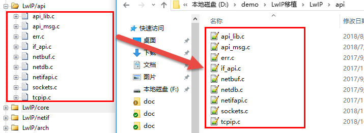

无操作系统移植LwIP
------------------

本章开始正式进入LwIP移植的学习，在前面的章节中，都是打基础的部分，俗话说“基础不牢，地动山摇”，我们只有在叫了解LwIP的时候才开始移植，这样子会更加加深我们的印象。

LwIP的官方源代码中并没有提供对任何芯片的底层驱动移植程序，因此这部分程序需要由开发者自己完成，在前面的章节，我们也对底层驱动进行编写，网卡的初始化、收发数据等都已经实现了，那么直接拿过来用即可。

将LwIP添加到裸机工程
~~~~~~~~~~~~~~~~~~~~

首先我们将3.6
小节中得到的裸机（已经写好以太网驱动）工程拿过来，将工程名字改为“LwIP移植”；然后再将我们已经下载的LwIP源码拿过来，准备将LwIP源码添加到工程中，但是LwIP源码太大了，我们不需要那么多东西，所以我们只需要将LwIP源码中的src文件文件夹添加进去即可，具体见
图7_1_，但是我发现src表示源码，但是不够明显，
无法一眼就知道它是LwIP中的源码，那我们直接把文件夹重命名为“LwIP”，
这样子就能让别人一目了然知道文件夹是什么内容了，具体见 图7_2_。

图 7‑1将LwIP源码添加到工程中

图 7‑2 将src文件夹重命名为LwIP

在前面的章节中也讲解了LwIP源码文件夹的功能及作用，那么我们现在直接添加到工程分组中即可，
首先我们在工程中创建4个与LwIP相关的工程分组，
其中三个分别用于存放LwIP源码中的三个文件，其对应关系具体见
图7_3_。

图 7‑3工程中创建分组存放LwIP源码

每个分组中都添加对应文件夹下的源码，添加完成后的源码具体见图 7‑4、图
7‑5、图 7‑6与图 7‑7。

图 7‑4

图 7‑5

图 7‑6

图 7‑7

然后在工程中添加LwIP头文件路径，并且把C99模式也勾选上，添加完成的示意图具体见
图7_8_。

图 7‑8在工程中添加LwIP头文件路径

移植头文件
~~~~~~~~~~

经过上面的步骤，我们的工程基本就添加完成，但是要想LwIP跑起来，还需一些头文件的支持，分别是lwipopts.h、cc.h、pref.h等。
lwipopts.h就是用于配置LwIP的相关参数的，一般来说LwIP默认会有参数的配置，存放在opt.h文件中，如果用户没有在lwipopts.h文件进行配置，那么LwIP就会使用opt.h默认的参数，注意，在移植的时候出现定义某些参数是非常重要的，这对我们LwIP的性能至关重要，甚至在配置错误的时候能直接导致LwIP的运行崩溃，下面一起来看看lwipopts.h文件的内容，这个文件的内容是由我们自己添加进来的，这里仅仅是介绍一部分配置。

我们先在工程的User文件夹下面新建一个arch文件夹，用于存放与底层接口相关的文件，然后打开LwIP的contrib包，把路径“contrib-2.1.0\examples\example_app”下的lwipopts.h文件拷贝到arch文件夹中；为了方便，我们把cc.h于pref.h也添加进来，这两个文件也是存放在LwIP的contrib包中，路径为“contrib-2.1.0\ports\unix\port\include\arch”，我们把这些拷贝到arch中，并且将工程的头文件路径添加进去，这样子就能对LwIP进行配置了，具体见
图7_9_。

图 7‑9 arch的文件

然后我们打开lwipopts.h，并在文件内部写入以下配置，具体见 代码清单7_1_。

代码清单 7‑1lwipopts.h文件内容

.. code-block:: c
   :name: 代码清单7_1

    #ifndef __LWIPOPTS_H__
    #define __LWIPOPTS_H__

    /**
    * SYS_LIGHTWEIGHT_PROT==1: if you want inter-task protection for certain
    * critical regions during buffer allocation, deallocation and memory
    * allocation and deallocation.
    */
    #define SYS_LIGHTWEIGHT_PROT    0

    /**
    * NO_SYS==1: Provides VERY minimal functionality. Otherwise,
    * use lwIP facilities.
    */
    #define NO_SYS                  1			(1)

    /**
    * NO_SYS_NO_TIMERS==1: Drop support for sys_timeout when NO_SYS==1
    * Mainly for compatibility to old versions.
    */
    #define NO_SYS_NO_TIMERS        0

    /* ---------- Memory options ---------- */
    /* MEM_ALIGNMENT: should be set to the alignment of the CPU for which
        lwIP is compiled. 4 byte alignment -> define MEM_ALIGNMENT to 4, 2
        byte alignment -> define MEM_ALIGNMENT to 2. */
    #define MEM_ALIGNMENT           4			(2)

    /* MEM_SIZE: the size of the heap memory. If the application will send
    a lot of data that needs to be copied, this should be set high. */
    #define MEM_SIZE                (30*1024)		(3)

    /* MEMP_NUM_PBUF: the number of memp struct pbufs. If the application
        sends a lot of data out of ROM (or other static memory), this
        should be set high. */
    #define MEMP_NUM_PBUF           50
    /* MEMP_NUM_UDP_PCB: the number of UDP protocol control blocks. One
        per active UDP "connection". */
    #define MEMP_NUM_UDP_PCB        6
    /* MEMP_NUM_TCP_PCB: the number of simulatenously active TCP
        connections. */
    #define MEMP_NUM_TCP_PCB        10
    /* MEMP_NUM_TCP_PCB_LISTEN: the number of listening TCP
        connections. */
    #define MEMP_NUM_TCP_PCB_LISTEN 6
    /* MEMP_NUM_TCP_SEG: the number of simultaneously queued TCP
        segments. */
    #define MEMP_NUM_TCP_SEG        12
    /* MEMP_NUM_SYS_TIMEOUT: the number of simulateously active
        timeouts. */
    #define MEMP_NUM_SYS_TIMEOUT    10

    /* ---------- Pbuf options ---------- */
    /* PBUF_POOL_SIZE: the number of buffers in the pbuf pool. */
    #define PBUF_POOL_SIZE          10			(4)

    /* PBUF_POOL_BUFSIZE: the size of each pbuf in the pbuf pool. */
    #define PBUF_POOL_BUFSIZE       500			(5)

    /* ---------- TCP options ---------- */
    #define LWIP_TCP                1
    #define TCP_TTL                 255

    /* Controls if TCP should queue segments that arrive out of
        order. Define to 0 if your device is low on memory. */
    #define TCP_QUEUE_OOSEQ         0

    /* TCP Maximum segment size. */
    #define TCP_MSS                 (1500 - 40)   		(6)

    /* TCP sender buffer space (bytes). */
    #define TCP_SND_BUF             (4*TCP_MSS)		(7)

    /*  TCP_SND_QUEUELEN: TCP sender buffer space (pbufs). This must be at least
    as much as (2 * TCP_SND_BUF/TCP_MSS) for things to work. */

    #define TCP_SND_QUEUELEN        (2* TCP_SND_BUF/TCP_MSS)

    /* TCP receive window. */
    #define TCP_WND                 (2*TCP_MSS)		(8)

    /* ---------- ICMP options ---------- */
    #define LWIP_ICMP                       1

    /* ---------- DHCP options ---------- */
    /* Define LWIP_DHCP to 1 if you want DHCP configuration of
    interfaces. DHCP is not implemented in lwIP 0.5.1, however, so
    turning this on does currently not work. */
    #define LWIP_DHCP               1

    /* ---------- UDP options ---------- */
    #define LWIP_UDP                1
    #define UDP_TTL                 255

    /* ---------- Statistics options ---------- */
    #define LWIP_STATS 0
    #define LWIP_PROVIDE_ERRNO 1

    /* ---------- link callback options ---------- */
    /* LWIP_NETIF_LINK_CALLBACK==1: Support a callback function from an interface
    * whenever the link changes (i.e., link down)
    */
    #define LWIP_NETIF_LINK_CALLBACK        0
    /*
        --------------------------------------
        ---------- Checksum options ----------
        --------------------------------------
    */

    /*The STM32F4x7 allows comput
    ing and verifying the IP, UDP, TCP and ICMP checksums by hardware:
    - To use this feature let the following define uncommented.
    - To disable it and process by CPU comment the  the checksum.
    */
    #define CHECKSUM_BY_HARDWARE

    #ifdef CHECKSUM_BY_HARDWARE
    /* CHECKSUM_GEN_IP==0: Generate checksums by hardware for outgoing IP packets.*/
    #define CHECKSUM_GEN_IP                 0
    /* CHECKSUM_GEN_UDP==0: Generate checksums by hardware for outgoing UDP packets.*/
    #define CHECKSUM_GEN_UDP                0
    /* CHECKSUM_GEN_TCP==0: Generate checksums by hardware for outgoing TCP packets.*/
    #define CHECKSUM_GEN_TCP                0
    /* CHECKSUM_CHECK_IP==0: Check checksums by hardware for incoming IP packets.*/
    #define CHECKSUM_CHECK_IP               0
    /* CHECKSUM_CHECK_UDP==0: Check checksums by hardware for incoming UDP packets.*/
    #define CHECKSUM_CHECK_UDP              0
    /* CHECKSUM_CHECK_TCP==0: Check checksums by hardware for incoming TCP packets.*/
    #define CHECKSUM_CHECK_TCP              0
    /*CHECKSUM_CHECK_ICMP==0: Check checksums by hardware for incoming ICMP packets.*/
    #define CHECKSUM_GEN_ICMP               0
    #else
    /* CHECKSUM_GEN_IP==1: Generate checksums in software for outgoing IP packets.*/
    #define CHECKSUM_GEN_IP                 1
    /* CHECKSUM_GEN_UDP==1: Generate checksums in software for outgoing UDP packets.*/
    #define CHECKSUM_GEN_UDP                1
    /* CHECKSUM_GEN_TCP==1: Generate checksums in software for outgoing TCP packets.*/
    #define CHECKSUM_GEN_TCP                1
    /* CHECKSUM_CHECK_IP==1: Check checksums in software for incoming IP packets.*/
    #define CHECKSUM_CHECK_IP               1
    /* CHECKSUM_CHECK_UDP==1: Check checksums in software for incoming UDP packets.*/
    #define CHECKSUM_CHECK_UDP              1
    /* CHECKSUM_CHECK_TCP==1: Check checksums in software for incoming TCP packets.*/
    #define CHECKSUM_CHECK_TCP              1
    /*CHECKSUM_CHECK_ICMP==1: Check checksums by hardware for incoming ICMP packets.*/
    #define CHECKSUM_GEN_ICMP               1
    #endif

    /*
        ----------------------------------------------
        ---------- Sequential layer options ----------
        ----------------------------------------------
    */
    /**
    * LWIP_NETCONN==1: Enable Netconn API (require to use api_lib.c)
    */
    #define LWIP_NETCONN                    0		 (9)

    /*
        ------------------------------------
        ---------- Socket options ----------
        ------------------------------------
    */
    /**
    * LWIP_SOCKET==1: Enable Socket API (require to use sockets.c)
    */
    #define LWIP_SOCKET                     0		 (10)

    /*
        ----------------------------------------
        ---------- Lwip Debug options ----------
        ----------------------------------------
    */
    //#define LWIP_DEBUG                      1

    #endif /* __LWIPOPTS_H__ */

    /************************ (C) COPYRIGHT STMicroelectronics *****END OF FILE****/

代码清单
7‑1\ **(1)**\ ：NO_SYS表示无操作系统模拟层，这个宏非常重要，
因为无操作系统与有操作系统的移植和编写是完全不一样的，
我们现在是无操作系统移植，所以将这个宏定义为1。

代码清单 7‑1\ **(2)**\ ：内存对齐，按照4字节对齐。

代码清单
7‑1\ **(3)**\ ：堆内存的大小。如果应用程序将发送很多需要复制的数据应该设置得大一点。

代码清单 7‑1\ **(4)**\ ：PBUF_POOL内存池中内存块数量。

代码清单 7‑1\ **(5)**\ ：PBUF_POOL内存池中每个内存块大小。

代码清单 7‑1\ **(6)**\ ：TCP协议报文最大长度。

代码清单 7‑1\ **(7)**\ ：允许TCP协议使用的最大发送缓冲区空间（字节）。

代码清单 7‑1\ **(8)**\ ：TCP接收窗口大小。

代码清单 7‑1\ **(9)(10)**\ ：因为现在是无操作系统，就不使能NETCONN
API和Socket API编程。

cc.h文件中包含处理器相关的变量类型、数据结构及字节对齐的相关宏。

LwIP中使用的基本变量类型均以位数进行命名，为抽象的变量类型定义，开发者需要根据所用处理器及编译器特性进行定义，一般我们直接将变量直接定义为C语言的基本类型，如unsigned
char、int等，这样子可以保证LwIP协议栈就与平台无关了。除此之外我们还可以定义大小端模式，输出调试的宏等，cc.h文件内容具体见
代码清单7_2_。

代码清单 7‑2 cc.h文件内容

.. code-block:: c
   :name: 代码清单7_2

    #ifndef __CC_H__
    #define __CC_H__

    #include "stdio.h"

    #include "main.h"

    #define LWIP_NO_STDINT_H  1

    typedef unsigned   char    u8_t;
    typedef signed     char    s8_t;
    typedef unsigned   short   u16_t;
    typedef signed     short   s16_t;
    typedef unsigned   long    u32_t;
    typedef signed     long    s32_t;
    typedef u32_t mem_ptr_t;
    typedef int sys_prot_t;

    #define U16_F "hu"
    #define S16_F "d"
    #define X16_F "hx"
    #define U32_F "u"
    #define S32_F "d"
    #define X32_F "x"
    #define SZT_F "uz"

    /* 选择小端模式 */
    #define BYTE_ORDER LITTLE_ENDIAN

    /* define compiler specific symbols */
    #if defined (__ICCARM__)

    #define PACK_STRUCT_BEGIN
    #define PACK_STRUCT_STRUCT
    #define PACK_STRUCT_END
    #define PACK_STRUCT_FIELD(x) x
    #define PACK_STRUCT_USE_INCLUDES

    #elif defined (__CC_ARM)

    #define PACK_STRUCT_BEGIN __packed
    #define PACK_STRUCT_STRUCT
    #define PACK_STRUCT_END
    #define PACK_STRUCT_FIELD(x) x

    #elif defined (__GNUC__)

    #define PACK_STRUCT_BEGIN
    #define PACK_STRUCT_STRUCT __attribute__ ((__packed__))
    #define PACK_STRUCT_END
    #define PACK_STRUCT_FIELD(x) x

    #elif defined (__TASKING__)

    #define PACK_STRUCT_BEGIN
    #define PACK_STRUCT_STRUCT
    #define PACK_STRUCT_END
    #define PACK_STRUCT_FIELD(x) x

    #endif

    #define LWIP_PLATFORM_ASSERT(x) do {printf(x);}while(0)

    extern u32_t sys_now(void);

    #endif /* __CC_H__ */

perf.h文件是与系统统计与测量相关的头文件，我们暂时无需使用任何统计与测量功能，因此该头文件的量宏定义直接为空即可，具体见
代码清单7_3_。

代码清单 7‑3 perf.h文件内容

.. code-block:: c
   :name: 代码清单7_3

    #ifndef __PERF_H__
    #define __PERF_H__

    #define PERF_START    /* null definition */
    #define PERF_STOP(x)  /* null definition */

    #endif /* __PERF_H__ */

移植网卡驱动
~~~~~~~~~~~~

在前面的4.4 章节与6.8
章节中已经讲解了关于底层驱动的函数，这些函数在网卡中至关重要，而ethernetif.c文件就是存放这些函数的，LwIP的contrib包中就包含这个文件的模板，我们直接拿过来修改即可，该文件的路径为“contrib-2.1.0\examples\ethernetif”，然后我们拷贝到arch文件夹下，并且创建一个ethernetif.h文件，一同添加到我们的工程中即可。我们直接使用4.4
章节与6.8
章节编写的网卡驱动代码，在编写完成的ethernetif.c文件内容具体见
代码清单7_4_。

代码清单 7‑4 ethernetif.c文件全貌

.. code-block:: c
   :name: 代码清单7_4

    #include "main.h"
    #include "lwip/opt.h"
    #include "lwip/mem.h"
    #include "lwip/memp.h"
    #include "lwip/timeouts.h"
    #include "netif/ethernet.h"
    #include "netif/etharp.h"
    #include "lwip/ethip6.h"
    #include "ethernetif.h"
    #include <string.h>

    /* Network interface name */
    #define IFNAME0 's'
    #define IFNAME1 't'

    struct ethernetif
    {
        struct eth_addr *ethaddr;
        /* Add whatever per-interface state that is needed here. */
    };

    extern ETH_HandleTypeDef heth;

    static void arp_timer(void *arg);

    static void low_level_init(struct netif *netif)
    {
        HAL_StatusTypeDef hal_eth_init_status;

        //初始化bsp—eth
        hal_eth_init_status = Bsp_Eth_Init();

        if (hal_eth_init_status == HAL_OK)
        {
            /* Set netif link flag */
            netif->flags |= NETIF_FLAG_LINK_UP;
        }

    #if LWIP_ARP || LWIP_ETHERNET

        /* set MAC hardware address length */
        netif->hwaddr_len = ETH_HWADDR_LEN;

        /* set MAC hardware address */
        netif->hwaddr[0] =  heth.Init.MACAddr[0];
        netif->hwaddr[1] =  heth.Init.MACAddr[1];
        netif->hwaddr[2] =  heth.Init.MACAddr[2];
        netif->hwaddr[3] =  heth.Init.MACAddr[3];
        netif->hwaddr[4] =  heth.Init.MACAddr[4];
        netif->hwaddr[5] =  heth.Init.MACAddr[5];

        /* maximum transfer unit */
        netif->mtu = NETIF_MTU;

    #if LWIP_ARP
        netif->flags |= NETIF_FLAG_BROADCAST | NETIF_FLAG_ETHARP;
    #else
        netif->flags |= NETIF_FLAG_BROADCAST;
    #endif /* LWIP_ARP */

    #endif /* LWIP_ARP || LWIP_ETHERNET */

        HAL_ETH_Start(&heth);
    }

    static err_t low_level_output(struct netif *netif, struct pbuf *p)
    {

        err_t errval;
        struct pbuf *q;

        uint8_t *buffer = (uint8_t *)(heth.TxDesc->Buffer1Addr);

        __IO ETH_DMADescTypeDef *DmaTxDesc;

        uint32_t bufferoffset = 0;
        uint32_t framelength = 0;

        uint32_t byteslefttocopy = 0;

        uint32_t payloadoffset = 0;

        DmaTxDesc = heth.TxDesc;
        bufferoffset = 0;

        if ((DmaTxDesc->Status & ETH_DMATXDESC_OWN) != (uint32_t)RESET)
        {
            errval = ERR_USE;
            goto error;
        }

        /* copy frame from pbufs to driver buffers */
        for (q = p; q != NULL; q = q->next)
        {
            /* Get bytes in current lwIP buffer */
            byteslefttocopy = q->len;
            payloadoffset = 0;

        /*Check if the length of data to copy is bigger than Tx buffer size*/
            while ( (byteslefttocopy + bufferoffset) > ETH_TX_BUF_SIZE )
            {
                /* Copy data to Tx buffer*/
                memcpy( (uint8_t*)((uint8_t*)buffer + bufferoffset),
                        (uint8_t*)((uint8_t*)q->payload + payloadoffset),
                        (ETH_TX_BUF_SIZE - bufferoffset) );

                /* Point to next descriptor */
                DmaTxDesc = (ETH_DMADescTypeDef *)(DmaTxDesc->Buffer2NextDescAddr);

                /* Check if the buffer is available */
                if ((DmaTxDesc->Status & ETH_DMATXDESC_OWN) != (uint32_t)RESET)
                {
                    errval = ERR_USE;
                    goto error;
                }

                buffer = (uint8_t *)(DmaTxDesc->Buffer1Addr);

                byteslefttocopy = byteslefttocopy - (ETH_TX_BUF_SIZE - bufferoffset);
                payloadoffset = payloadoffset + (ETH_TX_BUF_SIZE - bufferoffset);
                framelength = framelength + (ETH_TX_BUF_SIZE - bufferoffset);
                bufferoffset = 0;
            }

            /* Copy the remaining bytes */
            memcpy( (uint8_t*)((uint8_t*)buffer + bufferoffset),
                (uint8_t*)((uint8_t*)q->payload + payloadoffset), byteslefttocopy );
            bufferoffset = bufferoffset + byteslefttocopy;
            framelength = framelength + byteslefttocopy;
        }

        /* Prepare transmit descriptors to give to DMA */
        HAL_ETH_TransmitFrame(&heth, framelength);

        errval = ERR_OK;

    error:

        if ((heth.Instance->DMASR & ETH_DMASR_TUS) != (uint32_t)RESET)
        {
            /* Clear TUS ETHERNET DMA flag */
            heth.Instance->DMASR = ETH_DMASR_TUS;

            /* Resume DMA transmission*/
            heth.Instance->DMATPDR = 0;
        }

        return errval;
    }

    static struct pbuf * low_level_input(struct netif *netif)
    {
        struct pbuf *p = NULL;
        struct pbuf *q = NULL;
        uint16_t len = 0;
        uint8_t *buffer;
        __IO ETH_DMADescTypeDef *dmarxdesc;
        uint32_t bufferoffset = 0;
        uint32_t payloadoffset = 0;
        uint32_t byteslefttocopy = 0;
        uint32_t i=0;

        /* get received frame */
        if (HAL_ETH_GetReceivedFrame(&heth) != HAL_OK)
        {
            PRINT_ERR("receive frame faild\n");
            return NULL;
        }
    /*Obtain the size of the packet and put it into the "len" variable.*/
        len = heth.RxFrameInfos.length;
        buffer = (uint8_t *)heth.RxFrameInfos.buffer;

        PRINT_INFO("receive frame len : %d\n", len);

        if (len > 0)
        {
        /* We allocate a pbuf chain of pbufs from the Lwip buffer pool */
            p = pbuf_alloc(PBUF_RAW, len, PBUF_POOL);
        }

        if (p != NULL)
        {
            dmarxdesc = heth.RxFrameInfos.FSRxDesc;
            bufferoffset = 0;
            for (q = p; q != NULL; q = q->next)
            {
                byteslefttocopy = q->len;
                payloadoffset = 0;

                while ( (byteslefttocopy + bufferoffset) > ETH_RX_BUF_SIZE )
                {
                    /* Copy data to pbuf */
                    memcpy( (uint8_t*)((uint8_t*)q->payload + payloadoffset),
                            (uint8_t*)((uint8_t*)buffer + bufferoffset),
                            (ETH_RX_BUF_SIZE - bufferoffset));

                    /* Point to next descriptor */
                    dmarxdesc = (ETH_DMADescTypeDef *)(dmarxdesc->Buffer2NextDescAddr);
                    buffer = (uint8_t *)(dmarxdesc->Buffer1Addr);

                byteslefttocopy = byteslefttocopy - (ETH_RX_BUF_SIZE - bufferoffset);
                    payloadoffset = payloadoffset + (ETH_RX_BUF_SIZE - bufferoffset);
                    bufferoffset = 0;
                }
                /* Copy remaining data in pbuf */
                memcpy( (uint8_t*)((uint8_t*)q->payload + payloadoffset),
                        (uint8_t*)((uint8_t*)buffer + bufferoffset), byteslefttocopy);
                bufferoffset = bufferoffset + byteslefttocopy;
            }
        }

        /* Release descriptors to DMA */
        /* Point to first descriptor */
        dmarxdesc = heth.RxFrameInfos.FSRxDesc;
        /* Set Own bit in Rx descriptors: gives the buffers back to DMA */
        for (i=0; i< heth.RxFrameInfos.SegCount; i++)
        {
            dmarxdesc->Status |= ETH_DMARXDESC_OWN;
            dmarxdesc = (ETH_DMADescTypeDef *)(dmarxdesc->Buffer2NextDescAddr);
        }

        /* Clear Segment_Count */
        heth.RxFrameInfos.SegCount =0;

        /* When Rx Buffer unavailable flag is set: clear it and resume reception */
        if ((heth.Instance->DMASR & ETH_DMASR_RBUS) != (uint32_t)RESET)
        {
            /* Clear RBUS ETHERNET DMA flag */
            heth.Instance->DMASR = ETH_DMASR_RBUS;
            /* Resume DMA reception */
            heth.Instance->DMARPDR = 0;
        }
        return p;
    }

    void ethernetif_input(struct netif *netif)
    {
        err_t err;
        struct pbuf *p;

        /* move received packet into a new pbuf */
        p = low_level_input(netif);

        /* no packet could be read, silently ignore this */
        if (p == NULL) return;

        /* entry point to the LwIP stack */
        err = netif->input(p, netif);

        if (err != ERR_OK)
        {
            LWIP_DEBUGF(NETIF_DEBUG, ("ethernetif_input: IP input error\n"));
            pbuf_free(p);
            p = NULL;
        }
    }

    #if !LWIP_ARP

    static err_t low_level_output_arp_off(struct netif *netif, struct pbuf *q, con
    ip4_addr_t *ipaddr)
    {
        err_t errval;
        errval = ERR_OK;

        return errval;

    }
    #endif /* LWIP_ARP */

    err_t ethernetif_init(struct netif *netif)
    {
        struct ethernetif *ethernetif;

    //  LWIP_ASSERT("netif != NULL", (netif != NULL));

        ethernetif = mem_malloc(sizeof(struct ethernetif));

        if (ethernetif == NULL)
        {
            PRINT_ERR("ethernetif_init: out of memory\n");
            return ERR_MEM;
        }

        LWIP_ASSERT("netif != NULL", (netif != NULL));
    //
    #if LWIP_NETIF_HOSTNAME
        /* Initialize interface hostname */
        netif->hostname = "lwip";
    #endif /* LWIP_NETIF_HOSTNAME */
        netif->state = ethernetif;
        netif->name[0] = IFNAME0;
        netif->name[1] = IFNAME1;

    #if LWIP_IPV4
    #if LWIP_ARP || LWIP_ETHERNET
    #if LWIP_ARP
        netif->output = etharp_output;
    #else
        netif->output = low_level_output_arp_off;
    #endif /* LWIP_ARP */
    #endif /* LWIP_ARP || LWIP_ETHERNET */
    #endif /* LWIP_IPV4 */

    #if LWIP_IPV6
        netif->output_ip6 = ethip6_output;
    #endif /* LWIP_IPV6 */

        netif->linkoutput = low_level_output;

        /* initialize the hardware */
        low_level_init(netif);
        ethernetif->ethaddr = (struct eth_addr *) &(netif->hwaddr[0]);

        return ERR_OK;
    }
    static void arp_timer(void *arg)
    {
        etharp_tmr();
        sys_timeout(ARP_TMR_INTERVAL, arp_timer, NULL);
    }

    /* USER CODE BEGIN 6 */

    void ethernetif_update_config(struct netif *netif)
    {
        __IO uint32_t tickstart = 0;
        uint32_t regvalue = 0;

        if (netif_is_link_up(netif))
        {
            /* Restart the auto-negotiation */
            if (heth.Init.AutoNegotiation != ETH_AUTONEGOTIATION_DISABLE)
            {
                /* Enable Auto-Negotiation */
                HAL_ETH_WritePHYRegister(&heth, PHY_BCR, PHY_AUTONEGOTIATION);

                /* Get tick */
                tickstart = HAL_GetTick();

                /* Wait until the auto-negotiation will be completed */
                do
                {
                    HAL_ETH_ReadPHYRegister(&heth, PHY_BSR, &regvalue);

                    /* Check for the Timeout ( 1s ) */
                    if ((HAL_GetTick() - tickstart ) > 1000)
                    {
                        /* In case of timeout */
                        goto error;
                    }
                }
                while (((regvalue & PHY_AUTONEGO_COMPLETE) != PHY_AUTONEGO_COMPLETE));

                /* Read the result of the auto-negotiation */
                HAL_ETH_ReadPHYRegister(&heth, PHY_SR, &regvalue);

                if ((regvalue & PHY_DUPLEX_STATUS) != (uint32_t)RESET)
                {

                    heth.Init.DuplexMode = ETH_MODE_FULLDUPLEX;
                }
                else
                {

                    heth.Init.DuplexMode = ETH_MODE_HALFDUPLEX;
                }

                if (regvalue & PHY_SPEED_STATUS)
                {
            /* Set Ethernet speed to 10M following the auto-negotiation */
                    heth.Init.Speed = ETH_SPEED_10M;
                }
                else
                {
            /* Set Ethernet speed to 100M following the auto-negotiation */
                    heth.Init.Speed = ETH_SPEED_100M;
                }
            }
            else /* AutoNegotiation Disable */
            {
    error :
                /* Check parameters */
                assert_param(IS_ETH_SPEED(heth.Init.Speed));
                assert_param(IS_ETH_DUPLEX_MODE(heth.Init.DuplexMode));

                /* Set MAC Speed and Duplex Mode to PHY */
                HAL_ETH_WritePHYRegister(&heth, PHY_BCR,
                                ((uint16_t)(heth.Init.DuplexMode >> 3) |
                                (uint16_t)(heth.Init.Speed >> 1)));
            }

            /* ETHERNET MAC Re-Configuration */
            HAL_ETH_ConfigMAC(&heth, (ETH_MACInitTypeDef *) NULL);

            /* Restart MAC interface */
            HAL_ETH_Start(&heth);
        }
        else
        {
            /* Stop MAC interface */
            HAL_ETH_Stop(&heth);
        }

        ethernetif_notify_conn_changed(netif);
    }

当然，我们还需要一个ethernetif.h文件，主要是对函数的一些声明，其内容具体见
代码清单7_5_。

代码清单 7‑5 ethernetif.h文件内容

.. code-block:: c
   :name: 代码清单7_5

    #ifndef __ETHERNETIF_H__
    #define __ETHERNETIF_H__

    #include "lwip/err.h"
    #include "lwip/netif.h"

    err_t ethernetif_init(struct netif *netif);

    void ethernetif_input(struct netif *netif);
    void ethernetif_update_config(struct netif *netif);
    void ethernetif_notify_conn_changed(struct netif *netif);

    #endif

LwIP时基
~~~~~~~~

LwIP也是一个内核，与操作系统一样，也是由时基驱动的，LwIP作者为了能让内核正常运行，也引入了一个时钟来驱动，这样子可以处理内核中各种定时事件，如ARP定时、TCP定时等，LwIP已经实现处理超时（定时）事件的函数sys_check_timeouts()，具体怎么处理的就无需用户关心。由于时钟的来源是由用户提供的，这就需要用户实现一个sys_now()函数来获取系统的时钟，以毫秒为单位，LwIP通过两次获取的时间就能判断是否有超时，从而让内核去处理对应的事件。

我们在STM32中，一般采用SysTick作为LwIP的时基定时器，将SysTick产生中断的频率设置为1000HZ，也就是1ms触发一次中断，每次产生中断的时候，系统变量就会加1，当然，在HAL库中已经实现了获取系统时间的函数HAL_GetTick()，那么很简单，我们在sys_now()函数中直接返回HAL_GetTick()函数得到的值即可，具体见。但是有个问题，如果SysTick的频率不是1000HZ，那就需要将HAL_GetTick()函数得到的值转换为时间（ms），这就由用户自己实现即可，这也是很简单的，当我们使用操作系统的时候，就直接可以转换了使用操作系统的宏进行tick与ms的转换了，在后续讲解。

代码清单 7‑6 sys_now()实现

.. code-block:: c
   :name: 代码清单7_6

    u32_t sys_now(void)
    {
        return HAL_GetTick();
    }

    void SysTick_Handler(void)
    {
        HAL_IncTick();
    }

协议栈初始化
~~~~~~~~~~~~

想要使用LwIP，那就必须先将协议栈初始化，我们就创建一个函数，在函数中初始化协议栈，注册网卡，设置主机的IP地址、子网掩码、网关地址等，比如作者个人电脑的IP地址是192.163.1.181，那么我们在开发板上设置的IP地址必须是与路由器处于同一子网的，我就设置为192.168.1.122，因为这个地址必须是路由器承认的合法地址，否则路由器不会对这个IP地址的数据包进行转发，网关就写对应的网关（路由器IP地址）192.168.1.1即可，255.255.255.0为整个局域网的子网掩码。

然后挂载我们的网卡，挂载网卡的函数我们也讲解过了，就是netif_add()函数，
如果我们了解了前面章节的内容，移植起来是一点都不费劲的。这里主要讲解一下ethernet_input()函数，
这个函数在ethernet.c文件中（在以前的版本如1.4.1，这个函数在etharp.c文件），
主要是用于无操作系统时候LwIP去处理接收到的数据，接收网卡的数据然后往上层递交，
对于不同的数据包进行不同的处理，如果是ARP包，则调用etharp_input()函数交给ARP去处理，
更新ARP缓存表；如果是IP包，则调用ip4_input()函数递交给IP层去处理，在后续会详细讲解，
此处了解一下即可，协议栈初始化的源码具体见
代码清单7_7_。

提示：该函数由用户编写，可以随意放在任何地方，作者个人就将它放在main.c文件中。

代码清单 7‑7协议栈初始化

.. code-block:: c
   :name: 代码清单7_7

    /*Static IP ADDRESS: IP_ADDR0.IP_ADDR1.IP_ADDR2.IP_ADDR3 */
    #define IP_ADDR0                    192
    #define IP_ADDR1                    168
    #define IP_ADDR2                      1
    #define IP_ADDR3                    122

    /*NETMASK*/
    #define NETMASK_ADDR0               255
    #define NETMASK_ADDR1               255
    #define NETMASK_ADDR2               255
    #define NETMASK_ADDR3                 0

    /*Gateway Address*/
    #define GW_ADDR0                    192
    #define GW_ADDR1                    168
    #define GW_ADDR2                      1
    #define GW_ADDR3                      1
    /* USER CODE END 0 */

    void LwIP_Init(void)
    {

        IP4_ADDR(&ipaddr,IP_ADDR0,IP_ADDR1,IP_ADDR2,IP_ADDR3);
        IP4_ADDR(&netmask,NETMASK_ADDR0,NETMASK_ADDR1,
                NETMASK_ADDR2,NETMASK_ADDR3);
        IP4_ADDR(&gw,GW_ADDR0,GW_ADDR1,GW_ADDR2,GW_ADDR3);

        /* Initilialize the LwIP stack without RTOS */
        lwip_init();

        /* add the network interface (IPv4/IPv6) without RTOS */
        netif_add(&gnetif, &ipaddr, &netmask, &gw, NULL,
                &ethernetif_init, &ethernet_input);

        /* Registers the default network interface */
        netif_set_default(&gnetif);

        if (netif_is_link_up(&gnetif))
        {
        /*When the netif is fully configured this function must be called */
            netif_set_up(&gnetif);
        }
        else
        {
            /* When the netif link is down this function must be called */
            netif_set_down(&gnetif);
        }

    }

获取数据包
~~~~~~~~~~

通过上面的步骤，我们能使用开发板获取网络的数据包了，但是获取数据包的方式有两种，一种是查询方式，另一种是中断方式。查询方式通过主函数的while循环进行周期性处理，去获取网卡中是否接收到数据包，然后递交给上层协议去处理，而中单方式则不一样，在网卡接收到一个数据包的时候，就触发中断，通知CPU去处理，这样子效率就会高很多，特别是在操作系统环境下，我们都采用中断方式去获取数据包。当然，查询方式与中断方式的网卡底层初始化是不一样的，主要是通过网卡接收方式的配置进行初始化，在初始化的时候，如果网卡接收模式被配置为ETH_RXINTERRUPT_MODE，则表示使用中断方式获取数据包，而如果网卡接收模式被配置为ETH_RXPOLLING_MODE则表明用查询方式获取数据包。

提示：网卡底层初始化函数是Bsp_Eth_Init()，在bsp_eth.c文件中，用户可以自行修改。

查询方式
^^^^^^^^

使用查询方式获取数据包的时候，我们只需要在程序中周期性调用网卡接收函数即可，具体见
代码清单7_8_.

代码清单 7‑8 查询方式获取数据包

.. code-block:: c
   :name: 代码清单7_8

    int main(void)
    {
        //板级外设初始化
        BSP_Init();

        //LwIP协议栈初始化
        LwIP_Init();

        while (1)
        {
            //调用网卡接收函数
            ethernetif_input(&gnetif);

            //处理LwIP中定时事件
            sys_check_timeouts();
        }
    }

然后我们编译一下程序，并且将程序下载到开发板，然后我们打开Windows的控制台，可以直接通过win+r快捷键输入“cmd”快速打开，具体见
图7_10_。

图 7‑10打开Windows的控制台

如果不知道自己所处的局域网网关与电脑IP地址的，我们可以通过在Windows的控制台中执行“ipconfig”命令，就能得到电脑的IP地址，相应的就能得到网关地址，我们只需要将电脑IP地址中最后的3位数改成我们开发板上的地址即可，具体见
图7_11_。

图 7‑11执行“ipconfig”命令查看IP地址

ping命令详解
^^^^^^^^^^^^

然后我们在命令行中执行ping命令，看看网卡驱动与协议栈是否能正常工作，关于ping命令的基本介绍如下（“[
]”中的命令是非必须填充字段）：

ping [-t] [-a] [-n count] [-l size] [-f] [-i TTL] [-v TOS] [-r count]
[-s count] [[-j host-list] \| [-k host-list]][-w timeout] [-R] [-S
srcaddr] [-c compartment] [-p][-4] [-6] target_name

选项：

-  -t Ping 指定的主机，直到停止。若要查看统计信息并继续操作，请键入
   Ctrl+Break；若要停止，请键入 Ctrl+C。

-  -a 将地址解析为主机名。

-  -n count 要发送的回显请求数，默认值为 4。

-  -l size 发送缓冲区大小。

-  -f 在数据包中设置“不分段”标记(仅适用于
   IPv4)，数据包就不会被路由上的网关分段。

-  -i TTL 指定生存时间。

-  -v TOS 服务类型(仅适用于 IPv4。该设置已被弃用，对 IP
   标头中的服务类型字段没有任何影响)

-  -r count 记录计数跃点的路由(仅适用于 IPv4)。

-  -s count 计数跃点的时间戳(仅适用于 IPv4)。

-  -j host-list 与主机列表一起使用的松散源路由(仅适用于 IPv4)。

-  -k host-list 与主机列表一起使用的严格源路由(仅适用于 IPv4)。

-  -w timeout 等待每次回复的超时时间(毫秒)。

-  -R 同样使用路由标头测试反向路由(仅适用于 IPv6)。根据 RFC
   5095，已弃如果使用此标头，某些系统可能丢弃用此路由标头，如果使用此标头，某些系统可能丢弃回显请求

-  -S srcaddr 要使用的源地址。

-  -c compartment 路由隔离舱标识符。

-  -p Ping Hyper-V 网络虚拟化提供程序地址。

-  -4 强制使用 IPv4。

-  -6 强制使用 IPv6。

-  target_name 指定要 ping 的远程计算机。

当然，那么多命令肯定也是记不住的，那我们可以通过在控制台中执行“ping
/?”命令，就能得到ping命令说明了，具体见 图7_12_。

图 7‑12“ping /?”命令

学习了ping命令，我们直接执行“ping
xxx.xxx.xxx.xxx”命令，看一下我们的开发板看看能否ping得通，如果电脑发出的ping包能被开发板接收并且正确返回，这代表这电脑与开发板在网络上已经是连通的，xxx对应自己开发板的IP地址，执行命令的结果具体见
图7_13_，然后我们再执行“arp
-a”命令，可以看到电脑主机的ARP表，我们开发板的IP地址与MAC地址都正确出现在ARP表中，具体见
图7_14_。

图 7‑13 ping结果

图 7‑14电脑主机ARP表

中断方式
^^^^^^^^

采用查询的方式虽然可行，但是这种方式的效率不高，因为查询就要CPU去看看有没有数据，
就像一个人在房子中等朋友过来，但是不知道朋友什么时候来，那主人就要每隔一段时间去看看朋友有没有过来，
这样子就占用了大量的资源，主人也没能做其他事情，而如果在门口装一个门铃，
朋友来的时候就按下门铃，主人就知道朋友来了，就出去迎接，这样子就不会占用主人的时间，
主人可以做其他事情。同样的，我们可以使用中断方式来接收数据，当接收完成的时候，
就通知CPU来处理即可，当然，还需要我们编写对应的中断服务函数ETH_IRQHandler()，具体见
代码清单7_9_。

代码清单 7‑9 中断方式接收数据包

.. code-block:: c
   :name: 代码清单7_9

    int flag = 0;
    int main(void)
    {
        //板级外设初始化
        BSP_Init();

        //LwIP协议栈初始化
        LwIP_Init();

        while (1)
        {
            if (flag)
            {
                flag = 0;
                //调用网卡接收函数
                ethernetif_input(&gnetif);
            }
            //处理LwIP中定时事件
            sys_check_timeouts();
        }
    }

    void ETH_IRQHandler(void)
    {

        HAL_ETH_IRQHandler(&heth);

    }

    void HAL_ETH_RxCpltCallback(ETH_HandleTypeDef *heth)
    {
        flag = 1;
    //  LWIP_Process();
    }

当我们编译并下载好程序，同样用ping命令去ping一下开发板，其结果具体见
图7_15_，说明说明我们的中断方式的接收也是能正常工作的。

图 7‑15中断方式ping结果
