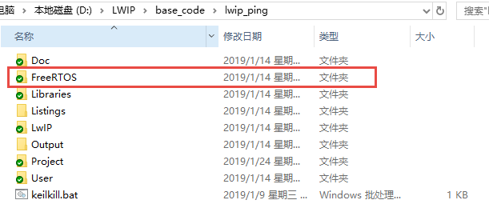
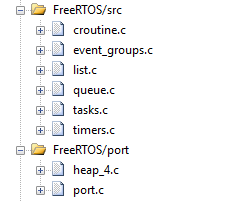
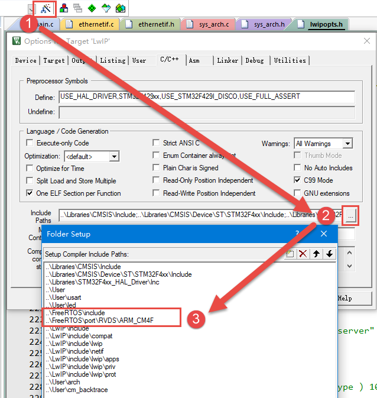
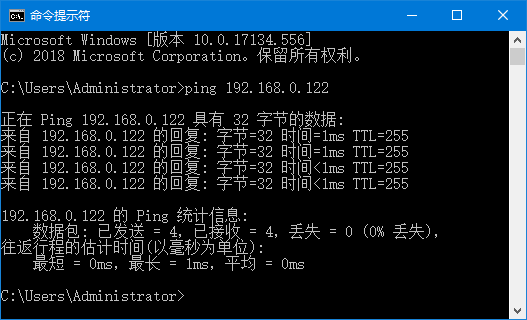

有操作系统移植LwIP
------------------

LwIP不仅能在裸机上运行，也能在操作系统环境下运行，而且在操作系统环境下，用户能使用NETCONN
API 与Socket API编程，相比RAW
API编程会更加简便。操作系统环境下，这意味着多线程环境，一般来说LwIP作为一个独立的处理线程运行，用户程序也独立为一个/多个线程，这样子在操作系统中就相互独立开，并且借助操作系统的IPC通信机制，更好地实现功能的需求。

LwIP在设计之初，设计者无法预测LwIP运行的环境是怎么样的，而且世界上操作系统那么多，根本没法统一，而如果LwIP要运行在操作系统环境中，那么就必须产生依赖，即LwIP需要依赖操作系统自身的通信机制，如信号量、互斥量、消息队列（邮箱）等，所以LwIP设计者在设计的时候就提供一套与操作系统相关的接口，由用户根据操作系统的不同进行移植，这样子就能降低耦合度，让LwIP内核不受其运行的环境影响，因为往往用户并不能完全了解内核的运作，所以只需要用户在移植的时候对LwIP提供的接口根据不同操作系统进行完善即可。

LwIP中添加操作系统
~~~~~~~~~~~~~~~~~~~~~~~

拷贝FreeRTOS源码到工程文件夹
^^^^^^^^^^^^^^^^^^^^^^^^^^^^^^

我们先把无操作性移植的代码拷贝过来，再往工程中添加操作系统的源码，操作系统的源码可以从我们对外发布的例程中获取，也可以从官网获取，此处以FreeRTOS为例进行移植操作。

首先将FreeRTOS源码拷贝到工程文件夹下，具体见

图 8‑1拷贝FreeRTOS源码到工程文件夹下

添加FreeRTOS源码到工程组文件夹
^^^^^^^^^^^^^^^^^^^^^^^^^^^^^^

在上一步我们只是将FreeRTOS的源码放到了本地工程目录下，还没有添加到开发环境里面的组文件夹里面，FreeRTOS也就没有移植到我们的工程中去。

接下来我们在开发环境里面新建FreeRTOS/src和FreeRTOS/port两个组文件夹，其中FreeRTOS/src用于存放src文件夹的所有内容，FreeRTOS/port用于存放port\MemMang文件夹与port\RVDS\ARM_CM？文件夹的内容，“？”表示3、4或者7，具体选择哪个得看你使用的是野火哪个型号的STM32开发板，具体见表8‑1。

表8‑1野火STM32开发板型号对应FreeRTOS的接口文件

+---------------------+---------------+----------------------------+
| 野火STM32开发板型号 | 具体芯片型号  | FreeRTOS不同内核的接口文件 |
+=====================+===============+============================+
| MINI                | STM32F103RCT6 | port\RVDS\ARM_CM3          |
+---------------------+---------------+----------------------------+
| 指南者              | STM32F103VET6 |                            |
+---------------------+---------------+----------------------------+
| 霸道                | STM32F103ZET6 |                            |
+---------------------+---------------+----------------------------+
| 霸天虎              | STM32F407ZGT6 | port\RVDS\ARM_CM4          |
+---------------------+---------------+----------------------------+
| F429-挑战者         | STM32F429IGT6 |                            |
+---------------------+---------------+----------------------------+
| F767-挑战者         | STM32F767IGT6 | port\RVDS\ARM_CM7          |
+---------------------+---------------+----------------------------+
| H743-挑战者         | STM32H743IIT6 |                            |
+---------------------+---------------+----------------------------+

然后我们将工程文件中FreeRTOS的内容添加到工程中去，按照已经新建的分组添加我们的FreeRTOS工程源码。

在FreeRTOS/port分组中添加MemMang文件夹中的文件只需选择其中一个即可，我们选择“heap_4.c”，这是FreeRTOS的一个内存管理源码文件。同时，需要根据自己的开发板型号在FreeRTOS\\port\\RVDS\\ARM_CM?中选择，“？”表示3、4或者7，具体选择哪个得看你使用的是野火哪个型号的STM32开发板，具体见上表8‑1。

至此我们的FreeRTOS添加到工程中就已经完成，完成的效果具体见 图8_2_。

图8‑2添加FreeRTOS源码到工程分组中

指定FreeRTOS头文件的路径
^^^^^^^^^^^^^^^^^^^^^^^^

FreeRTOS的源码已经添加到开发环境的组文件夹下面，编译的时候需要为这些源文件指定头文件的路径，
不然编译会报错。FreeRTOS的源码里面只有FreeRTOS\\include和FreeRTOS\\port\\RVDS\\ARM_CM这两个文件夹下面有头文件，
只需要将这两个头文件的路径在开发环境里面指定即可。
同时我们还将FreeRTOSConfig.h这个头文件拷贝到了工程根目录下的user文件夹下，
所以user的路径也要加到开发环境里面。FreeRTOS头文件的路径添加完成后的效果具体见 图8_3_。

图8‑3在开发环境中指定FreeRTOS 的头文件的路径

至此，FreeRTOS的整体工程基本移植完毕，我们也不需要修改FreeRTOS配置文件，直接使用我们FreeRTOS例程中的头文件即可。

修改stm32f4xx_it.c
^^^^^^^^^^^^^^^^^^

SysTick中断服务函数是一个非常重要的函数，FreeRTOS所有跟时间相关的事情都在里面处理，
SysTick就是FreeRTOS的一个心跳时钟，驱动着FreeRTOS的运行，就像人的心跳一样，假如没有心跳，
我们就相当于“死了”，同样的，FreeRTOS没有了心跳，那么它就会卡死在某个地方，不能进行任务调度，
不能运行任何的东西，因此我们需要实现一个FreeRTOS的心跳时钟，FreeRTOS帮我们实现了SysTick的启动的配置：
在port.c文件中已经实现vPortSetupTimerInterrupt()函数，并且FreeRTOS通用的SysTick中断服务函数也实现了：
在port.c文件中已经实现xPortSysTickHandler()函数，
所以移植的时候只需要我们在stm32f4xx_it.c文件中实现我们对应（STM32）平台上的SysTick_Handler()函数即可。
FreeRTOS为开发者考虑得特别多，PendSV_Handler()与SVC_Handler()这两个很重要的函数都帮我们实现了，
在在port.c文件中已经实现xPortPendSVHandler()与vPortSVCHandler()函数，防止我们自己实现不了，
那么在stm32f4xx_it.c中就需要我们注释掉或者删除掉PendSV_Handler()与SVC_Handler()这两个函数了，
具体实现见 代码清单8_1_ 加粗部分。

代码清单8‑1stm32f4xx_it.c文件内容

.. code-block:: c
   :name: 代码清单8_1

    /* Includes ----------------------------------------------------------*/
    #include "main.h"
    #include "stm32f4xx_it.h"
    #include "./usart/bsp_debug_usart.h"

    #include "FreeRTOS.h"         //FreeRTOS使用
    #include "task.h"

    /** @addtogroup STM32F4xx_HAL_Examples
    * @{
    */

    /** @addtogroup GPIO_EXTI
    * @{
    */

    /* Private typedef ----------------------------------------------*/
    /* Private define ------------------------------------------------*/
    /* Private macro -------------------------------------------------*/
    /* Private variables --------------------------------------------*/
    /* Private function prototypes -------------------------------------*/
    /* Private functions ---------------------------------------------*/

    /*******************************************************************/
    /*          Cortex-M4 Processor Exceptions Handlers             */
    /*****************************************************************/

    /**
    * @brief  This function handles NMI exception.
    * @param  None
    * @retval None
    */
    void NMI_Handler(void)
    {
    }

    /**
    * @brief  This function handles Hard Fault exception.
    * @param  None
    * @retval None
    */
    //void HardFault_Handler(void)
    //{
    //  /* Go to infinite loop when Hard Fault exception occurs */
    //  while (1)
    //  {
    //  }
    //}

    /**
    * @brief  This function handles Memory Manage exception.
    * @param  None
    * @retval None
    */
    void MemManage_Handler(void)
    {
        /* Go to infinite loop when Memory Manage exception occurs */
        while (1)
        {
        }
    }

    /**
    * @brief  This function handles Bus Fault exception.
    * @param  None
    * @retval None
    */
    void BusFault_Handler(void)
    {
        /* Go to infinite loop when Bus Fault exception occurs */
        while (1)
        {
        }
    }

    /**
    * @brief  This function handles Usage Fault exception.
    * @param  None
    * @retval None
    */
    void UsageFault_Handler(void)
    {
        /* Go to infinite loop when Usage Fault exception occurs */
        while (1)
        {
        }
    }

    /**
    * @brief  This function handles Debug Monitor exception.
    * @param  None
    * @retval None
    */
    void DebugMon_Handler(void)
    {
    }

    /**
    * @brief  This function handles SysTick Handler.
    * @param  None
    * @retval None
    */
    extern void xPortSysTickHandler(void);

    void SysTick_Handler(void)
    {
        uint32_t ulReturn;
        /* 进入临界段，临界段可以嵌套 */
        ulReturn = taskENTER_CRITICAL_FROM_ISR();

        HAL_IncTick();
    #if (INCLUDE_xTaskGetSchedulerState  == 1 )
        if (xTaskGetSchedulerState() != taskSCHEDULER_NOT_STARTED)
        {
    #endif  /* INCLUDE_xTaskGetSchedulerState */
            xPortSysTickHandler();
    #if (INCLUDE_xTaskGetSchedulerState  == 1 )
        }
    #endif  /* INCLUDE_xTaskGetSchedulerState */

        /* 退出临界段 */
        taskEXIT_CRITICAL_FROM_ISR( ulReturn );
    }

至此，将FreeRTOS添加到LwIP裸机工程中的步骤就基本完成了，编译的时候就基本也不会有错，下面就正式使用这个工程进行LwIP与操作系统的移植，因为还需要根据操作系统的特性修改很多接口文件。

lwipopts.h文件需要加入的配置
~~~~~~~~~~~~~~~~~~~~~~~~~~~~

在前面的章节也说了lwipopts.h文件的作用，而此刻在操作系统中移植，
我们首先要将添加了操作系统的工程拿过来，把lwipopts.h文件修改一下，
该文件最重要的宏定义就是NO_SYS，我们把它定义为0就表示使用操作系统，
当然，在使用操作系统的时候我们一般都会使用NETCONN
API 与Socket
API编程，那么就需要将宏LWIP_NETCONN与LWIP_SOCKET定义为1，表示使能这两种API编程，lwipopts.h简单修改一下即可，然后再添加一下线程运行的一些宏定义，必须修改的部分具体见
代码清单8_2_ 加粗部分，而其他宏定义是根据实际情况进行修改即可。

代码清单 8‑2 lwipopts.h文件

.. code-block:: c
   :name: 代码清单8_2

    #ifndef __LWIPOPTS_H__
    #define __LWIPOPTS_H__

    /**
    * SYS_LIGHTWEIGHT_PROT==1: if you want inter-task protection for certain
    * critical regions during buffer allocation, deallocation and memory
    * allocation and deallocation.
    */
    #define SYS_LIGHTWEIGHT_PROT    1

    /**
    * NO_SYS==1: Provides VERY minimal functionality. Otherwise,
    * use lwIP facilities.
    */
    #define NO_SYS                  0

    /**
    * NO_SYS_NO_TIMERS==1: Drop support for sys_timeout when NO_SYS==1
    * Mainly for compatibility to old versions.
    */
    #define NO_SYS_NO_TIMERS        0

    /* ---------- Memory options ---------- */
    /* MEM_ALIGNMENT: should be set to the alignment of the CPU for which
    lwIP is compiled. 4 byte alignment -> define MEM_ALIGNMENT to 4, 2
    byte alignment -> define MEM_ALIGNMENT to 2. */
    #define MEM_ALIGNMENT           4

    /* MEM_SIZE: the size of the heap memory. If the application will send
    a lot of data that needs to be copied, this should be set high. */
    #define MEM_SIZE                (15*1024)

    /* MEMP_NUM_PBUF: the number of memp struct pbufs. If the application
    sends a lot of data out of ROM (or other static memory), this
    should be set high. */
    #define MEMP_NUM_PBUF           25
    /* MEMP_NUM_UDP_PCB: the number of UDP protocol control blocks. One
    per active UDP "connection". */
    #define MEMP_NUM_UDP_PCB        4
    /* MEMP_NUM_TCP_PCB: the number of simulatenously active TCP
    connections. */
    #define MEMP_NUM_TCP_PCB        6
    /* MEMP_NUM_TCP_PCB_LISTEN: the number of listening TCP
    connections. */
    #define MEMP_NUM_TCP_PCB_LISTEN 6
    /* MEMP_NUM_TCP_SEG: the number of simultaneously queued TCP
    segments. */
    #define MEMP_NUM_TCP_SEG        150
    /* MEMP_NUM_SYS_TIMEOUT: the number of simulateously active
    timeouts. */
    #define MEMP_NUM_SYS_TIMEOUT    6

    /* ---------- Pbuf options ---------- */
    /* PBUF_POOL_SIZE: the number of buffers in the pbuf pool. */
    #define PBUF_POOL_SIZE          45
    /* PBUF_POOL_BUFSIZE: the size of each pbuf in the pbuf pool. */
    #define PBUF_POOL_BUFSIZE    \
    LWIP_MEM_ALIGN_SIZE(TCP_MSS+40+PBUF_LINK_ENCAPSULATION_HLEN+PBUF_LINK_HLEN)

    /* ---------- TCP options ---------- */
    #define LWIP_TCP                1
    #define TCP_TTL                 255

    /* Controls if TCP should queue segments that arrive out of
    order. Define to 0 if your device is low on memory. */
    #define TCP_QUEUE_OOSEQ         0

    /* TCP Maximum segment size. */
    #define TCP_MSS                 (1500 - 40)

    /* TCP sender buffer space (bytes). */
    #define TCP_SND_BUF             (10*TCP_MSS)

    /*  TCP_SND_QUEUELEN: TCP sender buffer space (pbufs). This must be at least
    as much as (2 * TCP_SND_BUF/TCP_MSS) for things to work. */

    #define TCP_SND_QUEUELEN        (8* TCP_SND_BUF/TCP_MSS)

    /* TCP receive window. */
    #define TCP_WND                 (11*TCP_MSS)

    /* ---------- ICMP options ---------- */
    #define LWIP_ICMP                       1

    /* ---------- DHCP options ---------- */
    /* Define LWIP_DHCP to 1 if you want DHCP configuration of
    interfaces. DHCP is not implemented in lwIP 0.5.1, however, so
    turning this on does currently not work. */
    #define LWIP_DHCP               1

    /* ---------- UDP options ---------- */
    #define LWIP_UDP                1
    #define UDP_TTL                 255

    /* ---------- Statistics options ---------- */
    #define LWIP_STATS 0
    #define LWIP_PROVIDE_ERRNO 1

    /* ---------- link callback options ---------- */
    /* LWIP_NETIF_LINK_CALLBACK==1: Support a callback function from an interface
    * whenever the link changes (i.e., link down)
    */
    #define LWIP_NETIF_LINK_CALLBACK        0
    /*
        --------------------------------------
        ---------- Checksum options ----------
        --------------------------------------
    */

    /* The STM32F4x7 allows computing and verifying the IP,
        UDP, TCP and ICMP checksums by hardware:
    - To use this feature let the following define uncommented.
    - To disable it and process by CPU comment the  the checksum.
    */
    #define CHECKSUM_BY_HARDWARE

    #ifdef CHECKSUM_BY_HARDWARE
    /* CHECKSUM_GEN_IP==0: Generate checksums by hardware for outgoing IP packets.*/
    #define CHECKSUM_GEN_IP                 0
    /* CHECKSUM_GEN_UDP==0: Generate checksums by hardware for outgoing UDP packets.*/
    #define CHECKSUM_GEN_UDP                0
    /* CHECKSUM_GEN_TCP==0: Generate checksums by hardware for outgoing TCP packets.*/
    #define CHECKSUM_GEN_TCP                0
    /* CHECKSUM_CHECK_IP==0: Check checksums by hardware for incoming IP packets.*/
    #define CHECKSUM_CHECK_IP               0
    /* CHECKSUM_CHECK_UDP==0: Check checksums by hardware for incoming UDP packets.*/
    #define CHECKSUM_CHECK_UDP              0
    /* CHECKSUM_CHECK_TCP==0: Check checksums by hardware for incoming TCP packets.*/
    #define CHECKSUM_CHECK_TCP              0
    /*CHECKSUM_CHECK_ICMP==0: Check checksums by hardware for incoming ICMP packets.*/
    #define CHECKSUM_GEN_ICMP               0
    #else
    /* CHECKSUM_GEN_IP==1: Generate checksums in software for outgoing IP packets.*/
    #define CHECKSUM_GEN_IP                 1
    /* CHECKSUM_GEN_UDP==1: Generate checksums in software for outgoing UDP packets.*/
    #define CHECKSUM_GEN_UDP                1
    /* CHECKSUM_GEN_TCP==1: Generate checksums in software for outgoing TCP packets.*/
    #define CHECKSUM_GEN_TCP                1
    /* CHECKSUM_CHECK_IP==1: Check checksums in software for incoming IP packets.*/
    #define CHECKSUM_CHECK_IP               1
    /* CHECKSUM_CHECK_UDP==1: Check checksums in software for incoming UDP packets.*/
    #define CHECKSUM_CHECK_UDP              1
    /* CHECKSUM_CHECK_TCP==1: Check checksums in software for incoming TCP packets.*/
    #define CHECKSUM_CHECK_TCP              1
    /*CHECKSUM_CHECK_ICMP==1: Check checksums by hardware for incoming ICMP packets.*/
    #define CHECKSUM_GEN_ICMP               1
    #endif

    /*
        ----------------------------------------------
        ---------- Sequential layer options ----------
        ----------------------------------------------
    */
    /**
    * LWIP_NETCONN==1: Enable Netconn API (require to use api_lib.c)
    */
    #define LWIP_NETCONN                    1

    /*
        ------------------------------------
        ---------- Socket options ----------
        ------------------------------------
    */
    /**
    * LWIP_SOCKET==1: Enable Socket API (require to use sockets.c)
    */
    #define LWIP_SOCKET                     1

    /*
        ---------------------------------
        ---------- OS options ----------
        ---------------------------------
    */

    #define DEFAULT_UDP_RECVMBOX_SIZE       10
    #define DEFAULT_TCP_RECVMBOX_SIZE       10
    #define DEFAULT_ACCEPTMBOX_SIZE         10
    #define DEFAULT_THREAD_STACKSIZE        1024

    #define TCPIP_THREAD_NAME              "lwip"
    #define TCPIP_THREAD_STACKSIZE          512
    #define TCPIP_MBOX_SIZE                 8
    #define TCPIP_THREAD_PRIO               3

sys_arch.c/h文件的编写
~~~~~~~~~~~~~~~~~~~~~~

操作系统环境下，
LwIP移植的核心就是编写与操作系统相关的接口文件sys_arch.c和sys_arch.h，这两个文件可以自己创建也可以从contrib包中获取，路径分别为“contrib-2.1.0\\ports\\freertos”与“contrib-2.1.0\\ports\\freertos\\include\arch”，用户在移植的时候必须根据操作系统的功能为协议栈提供相应的接口，如邮箱（因为本次移植以FreeRTOS为例子，FreeRTOS中没有邮箱这种概念，但是可以使用消息队列替代，为了迎合LwIP中的命名，下文统一采用邮箱表示）、信号量、互斥量等，这些IPC通信机制是保证内核与上层API接口通信的基本保障，也是内核实现管理的继承，同时在sys.h文件中声明了用户需要实现的所有函数框架，这些函数具体见表格
8‑2。

表格 8‑2需要用户实现的函数

+--------------------------+----------+--------------------------+------------+
| 名称                     | 属性     | 功能                     | 所在文件   |
+==========================+==========+==========================+============+
| sys_sem_t                | 数据类型 | 指针类型，指向系统信号量 | sys_arch.h |
+--------------------------+----------+--------------------------+------------+
| sys_mutex_t              | 数据类型 | 指针类型，指向系统互斥量 | sys_arch.h |
+--------------------------+----------+--------------------------+------------+
| sys_mbox_t               | 数据类型 | 指针类型，指向系统邮箱   | sys_arch.h |
+--------------------------+----------+--------------------------+------------+
| sys_thread_t             | 数据类型 | 指针类型，指向系统任务   | sys_arch.h |
+--------------------------+----------+--------------------------+------------+
| SYS_MBOX_NULL            | 宏定义   | 系统邮箱的空值           | sys_arch.h |
+--------------------------+----------+--------------------------+------------+
| SYS_SEM_NULL             | 宏定义   | 系统信号量的空值         | sys_arch.h |
+--------------------------+----------+--------------------------+------------+
| SYS_MRTEX_NULL           | 宏定义   | 系统互斥量的空值         | sys_arch.h |
+--------------------------+----------+--------------------------+------------+
| sys_now                  | 函数     | 内核时钟                 | sys_arch.c |
+--------------------------+----------+--------------------------+------------+
| sys_init                 | 函数     | 初始化系统               | sys_arch.c |
+--------------------------+----------+--------------------------+------------+
| sys_arch_protect         | 函数     | 进入临界段               | sys_arch.c |
+--------------------------+----------+--------------------------+------------+
| sys_arch_unprotect       | 函数     | 退出临界段               | sys_arch.c |
+--------------------------+----------+--------------------------+------------+
| sys_sem_new              | 函数     | 创建一个信号量           | sys_arch.c |
+--------------------------+----------+--------------------------+------------+
| sys_sem_free             | 函数     | 删除一个信号量           | sys_arch.c |
+--------------------------+----------+--------------------------+------------+
| sys_sem_valid            | 函数     | 判断信号量是否有效       | sys_arch.c |
+--------------------------+----------+--------------------------+------------+
| sys_sem_set_invalid      | 函数     | 将信号量设置无效状态     | sys_arch.c |
+--------------------------+----------+--------------------------+------------+
| sys_arch_sem_wait        | 函数     | 等待一个信号量           | sys_arch.c |
+--------------------------+----------+--------------------------+------------+
| sys_sem_signal           | 函数     | 释放一个信号量           | sys_arch.c |
+--------------------------+----------+--------------------------+------------+
| sys_mutex_new            | 函数     | 创建一个互斥量           | sys_arch.c |
+--------------------------+----------+--------------------------+------------+
| sys_mutex_free           | 函数     | 删除一个互斥量           | sys_arch.c |
+--------------------------+----------+--------------------------+------------+
| sys_mutex_set_invalid    | 函数     | 设置互斥量为无效状态     | sys_arch.c |
+--------------------------+----------+--------------------------+------------+
| sys_mutex_lock           | 函数     | 获取一个互斥量           | sys_arch.c |
+--------------------------+----------+--------------------------+------------+
| sys_mutex_unlock         | 函数     | 释放一个互斥量           | sys_arch.c |
+--------------------------+----------+--------------------------+------------+
| sys_mbox_new             | 函数     | 创建一个邮箱             | sys_arch.c |
+--------------------------+----------+--------------------------+------------+
| sys_mbox_free            | 函数     | 删除一个邮箱             | sys_arch.c |
+--------------------------+----------+--------------------------+------------+
| sys_mbox_valid           | 函数     | 判断邮箱是否有效         | sys_arch.c |
+--------------------------+----------+--------------------------+------------+
| sys_mbox_set_invalid     | 函数     | 设置邮箱为无效状态       | sys_arch.c |
+--------------------------+----------+--------------------------+------------+
| sys_mbox_post            | 函数     | 向邮箱发送消息，一直阻塞 | sys_arch.c |
+--------------------------+----------+--------------------------+------------+
| sys_mbox_trypost         | 函数     | 向邮箱发送消息，非阻塞   | sys_arch.c |
+--------------------------+----------+--------------------------+------------+
| sys_mbox_trypost_fromisr | 函数     | 在中断中向邮箱发送消息   | sys_arch.c |
+--------------------------+----------+--------------------------+------------+
| sys_arch_mbox_fetch      | 函数     | 从邮箱中获取消息，阻塞   | sys_arch.c |
+--------------------------+----------+--------------------------+------------+
| sys_arch_mbox_tryfetch   | 函数     | 从邮箱中获取消息，非阻塞 | sys_arch.c |
+--------------------------+----------+--------------------------+------------+
| sys_thread_new           | 函数     | 创建一个线程             | sys_arch.c |
+--------------------------+----------+--------------------------+------------+

看到那么多函数，是不是头都大了，其实这些函数的实现都是很简单的，首先讲解一下邮箱函数的实现。在LwIP中，用户代码与协议栈内部之间是通过邮箱进行数据的交互的，邮箱本质上就是一个指向数据的指针，API将指针传递给内核，内核通过这个指针访问数据，然后去处理，反之内核将数据传递给用户代码也是通过邮箱将一个指针进行传递。

在操作系统环境下，LwIP会作为一个线程运行，线程的名字叫tcpip_thread，在初始化LwIP的时候，内核就会自动创建这个线程，并且在线程运行的时候阻塞在邮箱上，等待数据进行处理，这个邮箱数据的来源可能在底层网卡接收到的数据或者上层应用程序的数据，总之，tcpip_thread线程在获取到邮箱中的数据时候，就会退出阻塞态，去处理数据，在处理完毕数据后又进入阻塞态中等待数据的到来，如此反复。

信号量与互斥量的实现为内核提供同步与互斥的机制，比如当用户想要发送一个数据的时候，就会调用上层API接口，API接口就会去先发送一个数据给内核去处理，然后尝试获取一个信号量，因为此时是没有信号量的，所以就会阻塞用户线程；内核在知道用户想要发送数据后，就会调用对应的网卡去发送数据，当数据发送完成后就释放一个信号量告知用户线程发送完成，这样子用户线程就得以继续执行。

所以这些函数的接口都必须由用户实现，下面具体看看这些函数的实现，具体见
代码清单8_3_。

代码清单 8‑3 sys_arch.c文件内容

.. code-block:: c
   :name: 代码清单8_3

    #include "debug.h"

    #include <lwip/opt.h>
    #include <lwip/arch.h>

    #include "tcpip.h"
    #include "lwip/init.h"
    #include "lwip/netif.h"
    #include "lwip/sio.h"
    #include "ethernetif.h"

    #if !NO_SYS
    #include "sys_arch.h"
    #endif
    #include <lwip/stats.h>
    #include <lwip/debug.h>
    #include <lwip/sys.h>

    #include <string.h>

    int errno;

    u32_t lwip_sys_now;

    struct sys_timeouts
    {
        struct sys_timeo *next;
    };

    struct timeoutlist
    {
        struct sys_timeouts timeouts;
        xTaskHandle pid;
    };

    #define SYS_THREAD_MAX 4

    static struct timeoutlist s_timeoutlist[SYS_THREAD_MAX];

    static u16_t s_nextthread = 0;

    u32_t
    sys_jiffies(void)
    {
        lwip_sys_now = xTaskGetTickCount();
        return lwip_sys_now;
    }

    u32_t
    sys_now(void)
    {
        lwip_sys_now = xTaskGetTickCount();
        return lwip_sys_now;
    }

    void
    sys_init(void)
    {
        int i;
        // Initialize the the per-thread sys_timeouts structures
        // make sure there are no valid pids in the list
        for (i = 0; i < SYS_THREAD_MAX; i++)
        {
            s_timeoutlist[i].pid = 0;
            s_timeoutlist[i].timeouts.next = NULL;
        }
        // keep track of how many threads have been created
        s_nextthread = 0;
    }

    struct sys_timeouts *sys_arch_timeouts(void)
    {
        int i;
        xTaskHandle pid;
        struct timeoutlist *tl;
        pid = xTaskGetCurrentTaskHandle( );
        for (i = 0; i < s_nextthread; i++)
        {
            tl = &(s_timeoutlist[i]);
            if (tl->pid == pid)
            {
                return &(tl->timeouts);
            }
        }
        return NULL;
    }

    sys_prot_t sys_arch_protect(void)
    {
        vPortEnterCritical();         //进入临界段
        return 1;
    }

    void sys_arch_unprotect(sys_prot_t pval)
    {
        ( void ) pval;
        vPortExitCritical();      //退出临界段
    }

    #if !NO_SYS

    err_t
    sys_sem_new(sys_sem_t *sem, u8_t count)
    {
        /* 创建 sem */
        if (count <= 1)
        {
            *sem = xSemaphoreCreateBinary();      //创建二值信号量
            if (count == 1)
            {
                sys_sem_signal(*sem);  //新创建的信号量是无效的，需要释放一个信号量
            }
        }
        else
            *sem = xSemaphoreCreateCounting(count,count); //创建计数信号量

    #if SYS_STATS
        ++lwip_stats.sys.sem.used;
        if (lwip_stats.sys.sem.max < lwip_stats.sys.sem.used)
        {
            lwip_stats.sys.sem.max = lwip_stats.sys.sem.used;
        }
    #endif /* SYS_STATS */

        if (*sem != SYS_SEM_NULL)
            return ERR_OK;          //创建成功返回ERR_OK
        else
        {
    #if SYS_STATS
            ++lwip_stats.sys.sem.err;
    #endif /* SYS_STATS */
            printf("[sys_arch]:new sem fail!\n");
            return ERR_MEM;
        }
    }

    void
    sys_sem_free(sys_sem_t *sem)
    {
    #if SYS_STATS
        --lwip_stats.sys.sem.used;
    #endif /* SYS_STATS */
        /* 删除 sem */
        vSemaphoreDelete(*sem);   //删除一个信号量
        *sem = SYS_SEM_NULL;  //删除之后置空
    }

    int sys_sem_valid(sys_sem_t *sem)
    {
        return (*sem != SYS_SEM_NULL);   //返回信号量是否有效
    }

    void
    sys_sem_set_invalid(sys_sem_t *sem)
    {
        *sem = SYS_SEM_NULL;    //信号量设置为无效
    }

    /*
    如果timeout参数不为零，则返回值为
    等待信号量所花费的毫秒数。如果
    信号量未在指定时间内发出信号，返回值为
    SYS_ARCH_TIMEOUT。如果线程不必等待信号量
    该函数返回零。 */
    u32_t
    sys_arch_sem_wait(sys_sem_t *sem, u32_t timeout)
    {
        u32_t wait_tick = 0;
        u32_t start_tick = 0 ;

        //看看信号量是否有效
        if (*sem == SYS_SEM_NULL)
            return SYS_ARCH_TIMEOUT;

        //首先获取开始等待信号量的时钟节拍
        start_tick = xTaskGetTickCount();

        //timeout != 0，需要将ms换成系统的时钟节拍
        if (timeout != 0)
        {
            //将ms转换成时钟节拍
            wait_tick = timeout / portTICK_PERIOD_MS;
            if (wait_tick == 0)
                wait_tick = 1;
        }
        else
            wait_tick = portMAX_DELAY;  //一直阻塞

        //等待成功，计算等待的时间，否则就表示等待超时
        if (xSemaphoreTake(*sem, wait_tick) == pdTRUE)
            return ((xTaskGetTickCount()-start_tick)*portTICK_RATE_MS);
        else
            return SYS_ARCH_TIMEOUT;
    }

    void
    sys_sem_signal(sys_sem_t *sem)
    {
        if (xSemaphoreGive( *sem ) != pdTRUE)   //释放信号量
            printf("[sys_arch]:sem signal fail!\n");
    }

    err_t
    sys_mutex_new(sys_mutex_t *mutex)
    {
        /* 创建 sem */
        *mutex = xSemaphoreCreateMutex(); //创建互斥量
        if (*mutex != SYS_MRTEX_NULL)
            return ERR_OK;      //创建成功返回ERR_OK
        else
        {
            printf("[sys_arch]:new mutex fail!\n");
            return ERR_MEM;
        }
    }

    void
    sys_mutex_free(sys_mutex_t *mutex)
    {
        vSemaphoreDelete(*mutex);   //删除互斥量
    }

    void
    sys_mutex_set_invalid(sys_mutex_t *mutex)
    {
        *mutex = SYS_MRTEX_NULL;    //设置互斥量为无效
    }

    void
    sys_mutex_lock(sys_mutex_t *mutex)
    {
        xSemaphoreTake(*mutex,/* 互斥量句柄 */
                        portMAX_DELAY); /* 等待时间 */
    }

    void
    sys_mutex_unlock(sys_mutex_t *mutex)
    {
        xSemaphoreGive( *mutex );//给出互斥量
    }

    sys_thread_t
    sys_thread_new(const char *name, lwip_thread_fn function,
            void *arg, int stacksize, int prio)
    {
        sys_thread_t handle = NULL;
        BaseType_t xReturn = pdPASS;
        /* 创建一个线程 */
        xReturn = xTaskCreate((TaskFunction_t )function,  /* 线程入口函数 */
                            (const char*    )name,/* 线程名字 */
                            (uint16_t       )stacksize,  /* 线程栈大小 */
                            (void*          )arg,/* 线程入口函数参数 */
                            (UBaseType_t    )prio, /* 线程的优先级 */
                            (TaskHandle_t*  )&handle);/* 线程控制块指针 */
        if (xReturn != pdPASS)
        {
            printf("[sys_arch]:create task fail!err:%#lx\n",xReturn);
            return NULL;
        }
        return handle;
    }

    err_t
    sys_mbox_new(sys_mbox_t *mbox, int size)
    {
        /* 创建一个邮箱 */
        *mbox = xQueueCreate((UBaseType_t ) size,/* 邮箱的长度 */
                            (UBaseType_t ) sizeof(void *));/* 消息的大小 */
    #if SYS_STATS
        ++lwip_stats.sys.mbox.used;
        if (lwip_stats.sys.mbox.max < lwip_stats.sys.mbox.used)
        {
            lwip_stats.sys.mbox.max = lwip_stats.sys.mbox.used;
        }
    #endif /* SYS_STATS */
        if (NULL == *mbox)
            return ERR_MEM;   // 创建成功返回ERR_OK

        return ERR_OK;
    }

    void
    sys_mbox_free(sys_mbox_t *mbox)
    {
        if ( uxQueueMessagesWaiting( *mbox ) )
        {
            /* Line for breakpoint.  Should never break here! */
            portNOP();
    #if SYS_STATS
            lwip_stats.sys.mbox.err++;
    #endif /* SYS_STATS */
        }

        vQueueDelete(*mbox);    //删除一个邮箱

    #if SYS_STATS
        --lwip_stats.sys.mbox.used;
    #endif /* SYS_STATS */
    }

    int sys_mbox_valid(sys_mbox_t *mbox)
    {
        if (*mbox == SYS_MBOX_NULL)     //判断邮箱是否有效
            return 0;
        else
            return 1;
    }

    void
    sys_mbox_set_invalid(sys_mbox_t *mbox)
    {
        *mbox = SYS_MBOX_NULL;  //设置有效为无效状态
    }

    void
    sys_mbox_post(sys_mbox_t *q, void *msg)
    {
        while (xQueueSend( *q, /* 邮箱的句柄 */
                            &msg,/* 发送的消息内容 */
                            portMAX_DELAY) != pdTRUE); /* 等待时间 */
    }

    err_t
    sys_mbox_trypost(sys_mbox_t *q, void *msg)
    {
        if (xQueueSend(*q,&msg,0) == pdPASS) //尝试发送一个消息，非阻塞发送
            return ERR_OK;
        else
            return ERR_MEM;
    }

    err_t
    sys_mbox_trypost_fromisr(sys_mbox_t *q, void *msg)
    {
        uint32_t ulReturn;
        err_t err = ERR_MEM;
        BaseType_t pxHigherPriorityTaskWoken;

        /* 进入临界段，临界段可以嵌套 */
        ulReturn = taskENTER_CRITICAL_FROM_ISR();

        if (xQueueSendFromISR(*q,&msg,&pxHigherPriorityTaskWoken)==pdPASS)
        {
            err = ERR_OK;
        }
        //如果需要的话进行一次线程切换
        portYIELD_FROM_ISR(pxHigherPriorityTaskWoken);

        /* 退出临界段 */
        taskEXIT_CRITICAL_FROM_ISR( ulReturn );

        return err;
    }

    u32_t
    sys_arch_mbox_fetch(sys_mbox_t *q, void **msg, u32_t timeout)
    {
        void *dummyptr;
        u32_t wait_tick = 0;
        u32_t start_tick = 0 ;

        if ( msg == NULL )  //看看存储消息的地方是否有效
            msg = &dummyptr;

        //首先获取开始等待信号量的时钟节拍
        start_tick = sys_now();

        //timeout != 0，需要将ms换成系统的时钟节拍
        if (timeout != 0)
        {
            //将ms转换成时钟节拍
            wait_tick = timeout / portTICK_PERIOD_MS;
            if (wait_tick == 0)
                wait_tick = 1;
        }
        //一直阻塞
        else
            wait_tick = portMAX_DELAY;

        //等待成功，计算等待的时间，否则就表示等待超时
        if (xQueueReceive(*q,&(*msg), wait_tick) == pdTRUE)
            return ((sys_now() - start_tick)*portTICK_PERIOD_MS);
        else
        {
            *msg = NULL;
            return SYS_ARCH_TIMEOUT;
        }
    }

    u32_t
    sys_arch_mbox_tryfetch(sys_mbox_t *q, void **msg)
    {
        void *dummyptr;
        if ( msg == NULL )
            msg = &dummyptr;

        //等待成功，计算等待的时间
        if (xQueueReceive(*q,&(*msg), 0) == pdTRUE)
            return ERR_OK;
        else
            return SYS_MBOX_EMPTY;
    }

    #if LWIP_NETCONN_SEM_PER_THREAD
    #error LWIP_NETCONN_SEM_PER_THREAD==1 not supported
    #endif /* LWIP_NETCONN_SEM_PER_THREAD */

    #endif /* !NO_SYS */

这些函数都是对操作系统的IPC通信机制进行简单的封装，在这里用户只需要稍微注意一下sys_arch_sem_wait()函数与sys_arch_mbox_fetch()函数，因为LwIP中使用的时间是以毫秒（ms）为单位的，而操作系统中则以时钟节拍（tick）为单位，那么在返回等待信号量或者邮箱所使用的时间就是要转换成ms，而操作系统并未提供等待这些信息的时间，那么我们可以使用一个折中的方法，在获取的时候开始记录时间戳，在获取结束后再次记录一次时间戳，两次时间戳相减就得到等待的时间，但是需要将这些时间（tick）转换为毫秒，这种做法当然是不精确的，但是对LwIP来说影响不大。

网卡底层的编写
~~~~~~~~~~~~~~

在无操作性移植的时候，我们的网卡收发数据就是单纯的收发数据，
ethernetif_input()函数就是处理接收网卡数据的，但是使用了操作系统的话，
我们一般将接收数据函数独立成为一个网卡接收线程，这样子在收到数据的时候才去处理数据，
然后递交给内核线程，所以我们只需要稍作修改即可，将函数转换成线程就行了，
并且在初始化网卡的时候创建网卡接收线程。当然，我们也能将发送函数独立成一个线程，
我们暂时没有必要去处理它，此处只创建一个网卡接收线程，具体见
代码清单8_4_。

代码清单 8‑4网卡接收线程ethernetif_input()

.. code-block:: c
   :name: 代码清单8_4

    void ethernetif_input(void *pParams)
    {
        struct netif *netif;
        struct pbuf *p = NULL;
        netif = (struct netif*) pParams;
        LWIP_DEBUGF(NETIF_DEBUG, ("ethernetif_input: IP input error\n"));

        while (1)
        {
            if (xSemaphoreTake( s_xSemaphore, portMAX_DELAY ) == pdTRUE)
            {
                /* move received packet into a new pbuf */
                taskENTER_CRITICAL();
                p = low_level_input(netif);
                taskEXIT_CRITICAL();
                /* points to packet payload, which starts with an Ethernet header */
                if (p != NULL)
                {
                    taskENTER_CRITICAL();
                    /* full packet send to tcpip_thread to process */
                    if (netif->input(p, netif) != ERR_OK)
                    {
                    LWIP_DEBUGF(NETIF_DEBUG, ("ethernetif_input: IP input error\n"));
                        pbuf_free(p);
                        p = NULL;
                    }
                    taskEXIT_CRITICAL();
                }
            }
        }
    }

在网卡接收线程中需要留意一下以下内容：网卡接收线程是需要通过信号量机制去接收数据的，一般来说我们都是使用中断的方式去获取网络数据包，当产生中断的时候，我们一般不会在中断中处理数据，而是告诉对应的线程去处理，也就是我们的网卡接收线程去处理数据，那么就会通过信号量进行同步，当网卡接收到了数据就会产生中断释放一个信号量，然后线程从阻塞中恢复，去获取网卡的数据并且向上层递交。

当然我们还需要在中断中对网卡底层进行编写，具体见 代码清单8_5_

代码清单 8‑5网卡中断处理（bsp_eth.c）

.. code-block:: c
   :name: 代码清单8_5

    void ETH_IRQHandler(void)
    {
        uint32_t ulReturn;
        /* 进入临界段，临界段可以嵌套 */
        ulReturn = taskENTER_CRITICAL_FROM_ISR();

        HAL_ETH_IRQHandler(&heth);

        /* 退出临界段 */
        taskEXIT_CRITICAL_FROM_ISR( ulReturn );
    }

    extern xSemaphoreHandle s_xSemaphore;
    void HAL_ETH_RxCpltCallback(ETH_HandleTypeDef *heth)
    {
    //  LED2_TOGGLE;
        portBASE_TYPE xHigherPriorityTaskWoken = pdFALSE;
        xSemaphoreGiveFromISR( s_xSemaphore, &xHigherPriorityTaskWoken );
        portYIELD_FROM_ISR(xHigherPriorityTaskWoken);
    }

此外我们还需要在网卡初始化的时候创建网卡接收线程与对应的信号量，
网卡初始化函数还是low_level_init()函数，并且初始化的其他信息都未修改，
只是添加了线程与信号量的创建，具体见
代码清单8_6_ 加粗部分。

代码清单 8‑6网卡初始化函数 low_level_init()

.. code-block:: c
   :name: 代码清单8_6

    static void low_level_init(struct netif *netif)
    {
        HAL_StatusTypeDef hal_eth_init_status;

        //初始化bsp—eth
        hal_eth_init_status = Bsp_Eth_Init();
        if (hal_eth_init_status == HAL_OK)
        {
            /* Set netif link flag */
            netif->flags |= NETIF_FLAG_LINK_UP;
        }

    #if LWIP_ARP || LWIP_ETHERNET

        /* set MAC hardware address length */
        netif->hwaddr_len = ETH_HWADDR_LEN;

        /* set MAC hardware address */
        netif->hwaddr[0] =  heth.Init.MACAddr[0];
        netif->hwaddr[1] =  heth.Init.MACAddr[1];
        netif->hwaddr[2] =  heth.Init.MACAddr[2];
        netif->hwaddr[3] =  heth.Init.MACAddr[3];
        netif->hwaddr[4] =  heth.Init.MACAddr[4];
        netif->hwaddr[5] =  heth.Init.MACAddr[5];

        /* maximum transfer unit */
        netif->mtu = NETIF_MTU;

        /* Accept broadcast address and ARP traffic */
        /* don't set NETIF_FLAG_ETHARP if this device is not an ethernet one */
    #if LWIP_ARP
        netif->flags |= NETIF_FLAG_BROADCAST | NETIF_FLAG_ETHARP;
    #else
        netif->flags |= NETIF_FLAG_BROADCAST;
    #endif /* LWIP_ARP */

        /* USER CODE BEGIN PHY_PRE_CONFIG */

        s_xSemaphore = xSemaphoreCreateCounting(40,0);

        /* create the task that handles the ETH_MAC */
        sys_thread_new("ETHIN",
                        ethernetif_input,  /* 任务入口函数 */
                        netif,           /* 任务入口函数参数 */
                        NETIF_IN_TASK_STACK_SIZE,/* 任务栈大小 */
                        NETIF_IN_TASK_PRIORITY); /* 任务的优先级 */

    #endif /* LWIP_ARP || LWIP_ETHERNET */

        /* Enable MAC and DMA transmission and reception */
        HAL_ETH_Start(&heth);
    }

协议栈初始化
~~~~~~~~~~~~

经过上面的移植，我们的底层与操作系统接口都基本移植完毕，想要让LwIP在操作系统中能跑起来，
还需要最后一步，将协议栈进行初始化，前面我们也说了，内核在操作系统中是作为一个线程独立存在的，
在初始化的时候，我们不仅要挂载网卡，也要创建tcpip_thread()线程，当然，这个线程LwIP会在初始的时候自动创建，
而挂载网卡的内容与无操作系统是一样的，就无需过多修改，协议栈初始化的源码具体见
代码清单8_7_。

代码清单 8‑7 协议栈初始化

.. code-block:: c
   :name: 代码清单8_7

    /*Static IP ADDRESS: IP_ADDR0.IP_ADDR1.IP_ADDR2.IP_ADDR3 */
    #define IP_ADDR0                    192
    #define IP_ADDR1                    168
    #define IP_ADDR2                      1
    #define IP_ADDR3                    122

    /*NETMASK*/
    #define NETMASK_ADDR0               255
    #define NETMASK_ADDR1               255
    #define NETMASK_ADDR2               255
    #define NETMASK_ADDR3                 0

    /*Gateway Address*/
    #define GW_ADDR0                    192
    #define GW_ADDR1                    168
    #define GW_ADDR2                      1
    #define GW_ADDR3                      1
    /* USER CODE END 0 */

    struct netif gnetif;
    ip4_addr_t ipaddr;
    ip4_addr_t netmask;
    ip4_addr_t gw;
    uint8_t IP_ADDRESS[4];
    uint8_t NETMASK_ADDRESS[4];
    uint8_t GATEWAY_ADDRESS[4];

    void LwIP_Init(void)
    {

        tcpip_init(NULL, NULL);

        /* IP addresses initialization */
        /* USER CODE BEGIN 0 */
    #ifdef USE_DHCP
        ip_addr_set_zero_ip4(&ipaddr);
        ip_addr_set_zero_ip4(&netmask);
        ip_addr_set_zero_ip4(&gw);
    #else
        IP4_ADDR(&ipaddr,IP_ADDR0,IP_ADDR1,IP_ADDR2,IP_ADDR3);
        IP4_ADDR(&netmask,NETMASK_ADDR0,NETMASK_ADDR1,NETMASK_ADDR2,NETMASK_ADDR3);
        IP4_ADDR(&gw,GW_ADDR0,GW_ADDR1,GW_ADDR2,GW_ADDR3);
    #endif /* USE_DHCP */
        /* USER CODE END 0 */
        /* Initilialize the LwIP stack without RTOS */
        /* add the network interface (IPv4/IPv6) without RTOS */
        netif_add(&gnetif, &ipaddr, &netmask, &gw, NULL,
                &ethernetif_init, &tcpip_input);

        /* Registers the default network interface */
        netif_set_default(&gnetif);
        if (netif_is_link_up(&gnetif))
        {
        /* When the netif is fully configured this function must be called */
            netif_set_up(&gnetif);
        }
        else
        {
            /* When the netif link is down this function must be called */
            netif_set_down(&gnetif);
        }

    }

在tcpip_init()函数中，LwIP会调用lwip_init()将内核进行初始化，并且创建一个tcpip_mbox邮箱，
邮箱的大小是TCPIP_MBOX_SIZE，用于接收从底层或者上层传递过来的消息，
并且最重要的是创建一个tcpip_thread线程，这就是LwIP在操作系统中作为一个独立的线程运行，
所有处理的数据都要这个线程去处理，这个线程我们会在后续讲解。lwip_init()函数的源码具体见
代码清单8_8_。

代码清单 8‑8 lwip_init()源码

.. code-block:: c
   :name: 代码清单8_8

    void
    tcpip_init(tcpip_init_done_fn initfunc, void *arg)
    {
        lwip_init();

        tcpip_init_done = initfunc;
        tcpip_init_done_arg = arg;
        if (sys_mbox_new(&tcpip_mbox, TCPIP_MBOX_SIZE) != ERR_OK)
        {
            LWIP_ASSERT("failed to create tcpip_thread mbox", 0);
        }
    #if LWIP_TCPIP_CORE_LOCKING
        if (sys_mutex_new(&lock_tcpip_core) != ERR_OK)
        {
            LWIP_ASSERT("failed to create lock_tcpip_core", 0);
        }
    #endif /* LWIP_TCPIP_CORE_LOCKING */

        sys_thread_new(TCPIP_THREAD_NAME, tcpip_thread, NULL,
                    TCPIP_THREAD_STACKSIZE, TCPIP_THREAD_PRIO);
    }

对于代码清单
8‑7中netif_add()函数，与裸机移植的时候有一点细微的差别，它最后一个参数就是tcpip_input，是一个函数，而不是原来的ethernet_input()，因为tcpip_input()函数会将网卡收到的数据包打包成为一个消息，发送到tcpip_mbox邮箱中，传递给tcpip_thread线程去处理，不过本质上也是调用ethernet_input()函数去递交这个数据包，只不过是绕了一大圈，因此，想要LwIP能正常运行，消息机制是不可或缺的，关于这个运作机制我们在后文详细讲解。

移植后使用ping测试基本响应
~~~~~~~~~~~~~~~~~~~~~~~~~~

在移植完操作系统与LwIP，我们也应该用电脑去ping一下开发版，看看是否能ping通，如果通了就表明我们的移植是正常的，那么我们才能继续去用LwIP完成更高级的应用，ping结果具体见
图8_4_。

图 8‑4ping响应结果
