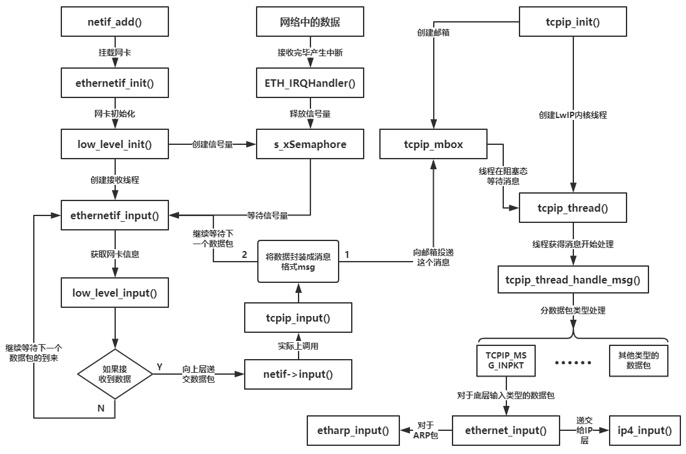
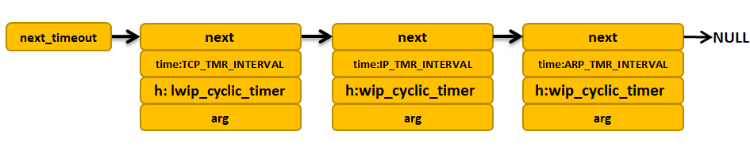
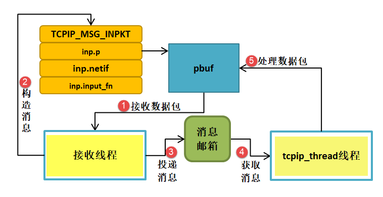
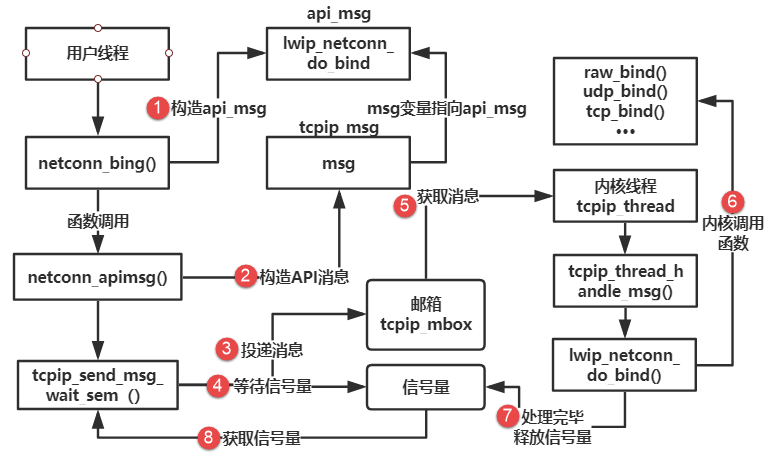

LwIP一探究竟
------------

可能很多同学看完了前面的章节，是不是感觉像是在云里雾里一样，完全没有头绪，不得不说中文是很棒的语言，所有的文字都认识，但是连在一起就不知道说什么了。其实我也是过来人，刚开始研究LwIP的时候，也是不知所云，但是，当你对LwIP有一个框架的时候，这些都不是事。

而本章，就是让你们对LwIP有一个框架，让你们知道网卡中的数据是怎么传递到LwIP内核中的，然后LwIP内核又是怎么处理这些数据的，本章会简化这些流程，看完本章，你们就会惊叹，原来LwIP的处理是那么的优秀！

注意：由于不推荐使用RAW
API编程，所以我们只会讲解LwIP在操作系统环境下网卡数据传递到内核的运作流程。

网卡接收数据的流程
~~~~~~~~~~~~~~~~~~

网卡是怎么接收数据的，我想也无需多说了，基本就是开发板上eth接收完数据后产生一个中断，
然后释放一个信号量通知网卡接收线程去处理这些接收的数据，然后将数据这些数据封装成消息，
投递到tcpip_mbox邮箱中，LwIP内核线程得到这个消息，就对消息进行解析，根据消息中数据包类型进行处理，
实际上是调用ethernet_input()函数决定是否递交到IP层，如果是ARP包，内核就不会递交给IP层，
而是更新ARP缓存表，对于IP数据包则递交给IP层去处理，这就是一个数据从网卡到内核的过程，具体见 图9_1_。

图 9‑1网卡数据传入LwIP内核

从这个图中，我们也能很明显看到，用户程序与内核是完全独立的，只是通过操作系统的IPC通信机制进行数据交互。

内核超时处理
~~~~~~~~~~~~

在LwIP中很多时候都要用到超时处理，例如ARP缓存表项的时间管理、IP分片数据报的重装等待超时、TCP中的建立连接超时、重传超时机制等，因此超时处理的实现是
TCP/IP 协议栈中一个重要部分，LwIP为每个与外界网络连接的任务都有设定了
timeout
属性，即等待超时时间，超时处理的相关代码实现在timeouts.c与timeouts.h中。

在旧版本的LwIP中（如LwIP
1.4.1版本），超时处理被称之为定时器（其实现在我们也能这样子称之为定时器，但是为了下文统一，我们一律使用超时处理），但是，在最新版的LwIP中，原来的timer.c已经被删除，转而使用了timeouts.c来代替，并且该源码在实现上也有一定的区别。

由于LwIP是软件，它自身并没有硬件定时器，更不会对硬件定时器进行管理，所以LwIP作者就采用软件定时器对这些超时进行处理，因为软件定时器很容易维护，并且与平台无关，只需要用户提供一个较为准确的时基即可。

sys_timeo结构体与超时链表
^^^^^^^^^^^^^^^^^^^^^^^^^

LwIP通过一个sys_timeo类型的数据结构管理与超时链表相关的所有超时事件。
LwIP使用这个结构体记录下内核中所有被注册的超时事件，这些结构体会以链表的形式一个个连接在超时链表中，
而内核中只有一条超时链表，那么怎么对超时链表进行管理呢？LwIP定义了一个sys_timeo类型的指针next_timeout，
并且将next_timeout指向当前内核中链表头部，所有被注册的超时事件都会按照被处理的先后顺序排列在超时链表上。
sys_timeo结构体与超时链表源码具体见 代码清单9_1_。

代码清单 9‑1 sys_timeo结构体与超时链表

.. code-block:: c
   :name: 代码清单9_1

    typedef void (* sys_timeout_handler)(void *arg);

    struct sys_timeo
    {
        struct sys_timeo *next;			(1)
        u32_t time;				(2)
        sys_timeout_handler h;			(3)
        void *arg;				(4)
    };

    /** The one and only timeout list */
    static struct sys_timeo *next_timeout;	    (5)

代码清单 9‑1\ **(1)**\ ：指向下一个超时事件的指针，用于超时链表的连接。

代码清单 9‑1\ **(2)**\ ：当前超时事件的等待时间。

代码清单
9‑1\ **(3)**\ ：指向超时的回调函数，该事件超时后就执行对应的回调函数。

代码清单 9‑1\ **(4)**\ ：向回调函数传入参数。

代码清单 9‑1\ **(5)**\ ：指向超时链表第一个超时事件。

注册超时事件
^^^^^^^^^^^^

LwIP虽然使用超时链表进行管理所有的超时事件，那么它首先需要知道有哪些超时事件才能去管理，
而这些超时事件就是通过注册的方式被挂载在链表上，简单来说就是这些超时事件要在内核中登记一下，
内核才会去处理，LwIP中注册超时事件的函数是sys_timeout()，
但是实际上是调用sys_timeout_abs()函数，具体见
代码清单9_2_。

代码清单 9‑2 sys_timeout()源码

.. code-block:: c
   :name: 代码清单9_2

    void
    sys_timeout(u32_t msecs, sys_timeout_handler handler, void *arg)
    {
    u32_t next_timeout_time;
    LWIP_ASSERT_CORE_LOCKED();

    /* overflow handled by TIME_LESS_THAN macro */
    next_timeout_time = (u32_t)(sys_now() + msecs);		(1)

        sys_timeout_abs(next_timeout_time, handler, arg);
    }

    static void
    sys_timeout_abs(u32_t abs_time, sys_timeout_handler handler, void *arg)
    {
        struct sys_timeo *timeout, *t;

        timeout = (struct sys_timeo *)memp_malloc(MEMP_SYS_TIMEOUT); (2)
        if (timeout == NULL)
        {
            return;
        }

        timeout->next = NULL;
        timeout->h = handler;
        timeout->arg = arg;
        timeout->time = abs_time;					(3)

        if (next_timeout == NULL)
        {
            next_timeout = timeout;				(4)
            return;
        }
        if (TIME_LESS_THAN(timeout->time, next_timeout->time))
        {
            timeout->next = next_timeout;
            next_timeout = timeout;				(5)
        }
        else
        {
            for (t = next_timeout; t != NULL; t = t->next)
            {
                if ((t->next == NULL) ||
                        TIME_LESS_THAN(timeout->time, t->next->time))
                {
                    timeout->next = t->next;
                    t->next = timeout;				(6)
                    break;
                }
            }
        }
    }

代码清单
9‑2\ **(1)**\ ：根据当前时间计算出超时的时间，然后调用sys_timeout_abs()函数将当前事件插入超时链表。

代码清单
9‑2\ **(2)**\ ：从内存池中申请一个MEMP_SYS_TIMEOUT类型内存，保存对应超时事件的相关信息。

代码清单
9‑2\ **(3)**\ ：填写对应的超时事件信息，超时回调函数、函数参数、超时的
时间。

代码清单
9‑2\ **(4)**\ ：如果超时链表中没有超时事件，那么新添加的事件就是链表的第一个。

代码清单
9‑2\ **(5)**\ ：如果新插入的超时事件比链表上第一个事件的时间短，则将新插入的超时事件设置成链表的第一个。

代码清单
9‑2\ **(6)**\ ：遍历链表，寻找合适的插入节点，超时链表根据超时事件的时间升序排列。

在timeouts.c中，有一个名字为lwip_cyclic_timer的结构，LwIP使用该结构存放了其内部使用的循环超时事件。
这些超时事件在LwIP初始化时通过函数sys_timeouts_init()调用定时器注册函数sys_timeout()注册进入超时链表中，
lwip_cyclic_timer的结构具体见
代码清单9_3_。

代码清单 9‑3 lwip_cyclic_timer结构 （已删减）

.. code-block:: c
   :name: 代码清单9_3

    #define   TCP_TMR_INTERVAL       250
    #define   IP_TMR_INTERVAL        1000
    #define   ARP_TMR_INTERVAL       1000

    struct lwip_cyclic_timer
    {
        u32_t interval_ms;
        lwip_cyclic_timer_handler handler;
    };

    const struct lwip_cyclic_timer lwip_cyclic_timers[] =
    {
        {TCP_TMR_INTERVAL, HANDLER(tcp_tmr)},

        {IP_TMR_INTERVAL, HANDLER(ip_reass_tmr)},

        {ARP_TMR_INTERVAL, HANDLER(etharp_tmr)},
    };

lwip_cyclic_timers数组中存放了每个周期性的超时事件回调函数及超时时间，
在LwIP初始化的时候就将这些事件一个个插入超时链表中，具体见
代码清单9_4_。

代码清单 9‑4 sys_timeouts_init()源码

.. code-block:: c
   :name: 代码清单9_4

    void sys_timeouts_init(void)
    {
        size_t i;

        for(i =(LWIP_TCP ? 1 : 0);i < LWIP_ARRAYSIZE(lwip_cyclic_timers); i++)
        {
            sys_timeout(lwip_cyclic_timers[i].interval_ms,lwip_cyclic_timer,
                        LWIP_CONST_CAST(void *, &lwip_cyclic_timers[i]));
        }
    }

插入超时链表后的示意图具体见 图9_2_。

图 9‑2初始化插入的超时事件示意图

每个sys_timeo结构体中的h成员变量记录着对应的超时回调函数，对于周期性的回调函数，
LwIP是这样子处理的：在初始化的时候将他们注册到
lwip_cyclic_timer()函数中，每次在处理回调函数之后，
就调用sys_timeout_abs()函数将其重新注册到超时链表中，具体见
代码清单9_5_。

代码清单 9‑5 lwip_cyclic_timer()源码（已删减）

.. code-block:: c
   :name: 代码清单9_5

    lwip_cyclic_timer(void *arg)
    {
        u32_t now;
        u32_t next_timeout_time;
        const struct lwip_cyclic_timer *cyclic = (const struct lwip_cyclic_timer *)arg;

        cyclic->handler();

        now = sys_now();
        next_timeout_time = (u32_t)(current_timeout_due_time + cyclic->interval_ms);

        if (TIME_LESS_THAN(next_timeout_time, now))
        {
            sys_timeout_abs((u32_t)(now + cyclic->interval_ms), lwip_cyclic_timer, arg);
        }
        else
        {
            sys_timeout_abs(next_timeout_time, lwip_cyclic_timer, arg);
        }
    }

超时检查
^^^^^^^^

有的同学可能会发现，前面讲解的超时处理根本是不需要我们用户去考虑的，为什么还有讲解呢，其实不是这样子的，学习讲究的是一个循序渐进的过程，本书讲解的东西自然有其要讲解的道理，LwIP实现了超时处理，那么无论我们的开发平台是否使用操作系统，都可以对其进行超时检查并且去处理，lwip中以下两个函数可以实现对超时的处理：

void
sys_check_timeouts(void)：这是用于裸机的函数，用户需要在裸机应用程序中周期性调用该函数，每次调用的时候LwIP都会检查超时链表上第一个sys_timeo结构体是否到期，如果没有到期，直接退出该函数，否则，执行sys_timeo结构体中对应的超时回调函数，并从链表上删除它，然后继续检查下一个sys_timeo结构体，直到sys_timeo结构体没有超时才退出。

tcpip_timeouts_mbox_fetch(sys_mbox_t \*mbox, void
\**msg)：这个函数在操作系统的线程中循环调用，主要是等待tcpip_mbox消息，是可阻塞的，如果在等待tcpip_mbox的过程中发生超时事件，则会同时执行超时事件处理，即调用超时回调函数。LwIP是这样子处理的，如果已经发生超时，LwIP就会内部调用sys_check_timeouts()函数去检查超时的sys_timeo结构体并调用其对应的回调函数，如果没有发生超时，那就一直等待消息，其等待的时间为下一个超时时间的时间，一举两得。
LwIP中tcpip线程就是靠这种方法，即处理了上层及底层的tcpip_mbox消息，同时处理了所有需要超时处理的事件。具体见
代码清单9_6_。

代码清单 9‑6 tcpip_timeouts_mbox_fetch()

.. code-block:: c
   :name: 代码清单9_6

    #define TCPIP_MBOX_FETCH(mbox, msg) tcpip_timeouts_mbox_fetch(mbox, msg)

    static void
    tcpip_timeouts_mbox_fetch(sys_mbox_t *mbox, void **msg)
    {
        u32_t sleeptime, res;

    again:
        LWIP_ASSERT_CORE_LOCKED();

        sleeptime = sys_timeouts_sleeptime();		(1)
        if (sleeptime == SYS_TIMEOUTS_SLEEPTIME_INFINITE)
        {
            UNLOCK_TCPIP_CORE();
            sys_arch_mbox_fetch(mbox, msg, 0);		(2)
            LOCK_TCPIP_CORE();
            return;
        }
        else if (sleeptime == 0)
        {
            sys_check_timeouts();				(3)
            goto again;
        }

        UNLOCK_TCPIP_CORE();
        res = sys_arch_mbox_fetch(mbox, msg, sleeptime);	(4)
        LOCK_TCPIP_CORE();
        if (res == SYS_ARCH_TIMEOUT)
        {
            sys_check_timeouts();
            goto again;
        }
    }

代码清单
9‑6\ **(1)**\ ：调用sys_timeouts_sleeptime()函数得到距离事件超时的时间并保存在sleeptime变量中。

代码清单
9‑6\ **(2)**\ ：如果sleeptime为SYS_TIMEOUTS_SLEEPTIME_INFINITE，表示当前系统无超时事件，
那只需一直等待mbox消息即可，所以调用sys_arch_mbox_fetch()函数进行等待消息，等待时间是一直等待。

代码清单
9‑6\ **(3)**\ ：如果sleeptime为0表示已经发生超时了，
那就调用sys_check_timeouts()去检查一下到底是哪个事件发生超时并且去处理其超时回调函数。

代码清单
9‑6\ **(4)**\ ：对于其他时间，LwIP就在等待tcpip_mbox的消息的同时就去处理超时事件，
等待tcpip_mbox的消息的时间为sleeptime，然后在时间到达的时候就处理超时事件。
如果接收到消息，并且超时时间还没到，那就去处理tcpip_mbox的消息，
然后再回来重新计算等待时间sleeptime，如此反复，这样子既不会错过tcpip_mbox的消息，也不会错过超时的事件。

tcpip_thread线程
~~~~~~~~~~~~~~~~

从前面的章节我们也知道，LwIP在操作系统的环境下，LwIP内核是作为操作系统的一个线程运行的，
在协议栈初始化的时候就会创建tcpip_thread线程，那么我们现在来看看tcpip_thread线程到底是怎么样的东西，具体见 代码清单9_7_。

代码清单 9‑7 tcpip_thread线程

.. code-block:: c
   :name: 代码清单9_7

    static void
    tcpip_thread(void *arg)
    {
        struct tcpip_msg *msg;
        LWIP_UNUSED_ARG(arg);

        LWIP_MARK_TCPIP_THREAD();

        LOCK_TCPIP_CORE();
        if (tcpip_init_done != NULL)
        {
            tcpip_init_done(tcpip_init_done_arg);
        }

        while (1)
        {
            LWIP_TCPIP_THREAD_ALIVE();
            /* 等待消息，等待时处理超时 */
            TCPIP_MBOX_FETCH(&tcpip_mbox, (void **)&msg);	(1)
            if (msg == NULL)
            {
                continue;					(2)
            }
            tcpip_thread_handle_msg(msg);			(3)
        }
    }

代码清单
9‑7\ **(1)**\ ：LwIP将函数tcpip_timeouts_mbox_fetch()定义为带参宏TCPIP_MBOX_FETCH，
所以在这里就是等待消息并且处理超时事件。

代码清单 9‑7\ **(2)**\ ：如果没有等到消息就继续等待。

代码清单
9‑7\ **(3)**\ ：等待到消息就对消息进行处理，这个函数具体见代码清单 9‑8。

代码清单 9‑8 tcpip_thread_handle_msg()源码

.. code-block:: c
   :name: 代码清单9_8

    static void
    tcpip_thread_handle_msg(struct tcpip_msg *msg)
    {
        switch (msg->type)
        {
    #if !LWIP_TCPIP_CORE_LOCKING
        case TCPIP_MSG_API:
            msg->msg.api_msg.function(msg->msg.api_msg.msg);		(1)
            break;
        case TCPIP_MSG_API_CALL:
            msg->msg.api_call.arg->err =
                msg->msg.api_call.function(msg->msg.api_call.arg);	(2)
            sys_sem_signal(msg->msg.api_call.sem);
            break;
    #endif /* !LWIP_TCPIP_CORE_LOCKING */

    #if !LWIP_TCPIP_CORE_LOCKING_INPUT
        case TCPIP_MSG_INPKT:
        if (msg->msg.inp.input_fn(msg->msg.inp.p, msg->msg.inp.netif) != ERR_OK) (3)
            {
                pbuf_free(msg->msg.inp.p);
            }
            memp_free(MEMP_TCPIP_MSG_INPKT, msg);
            break;
    #endif /* !LWIP_TCPIP_CORE_LOCKING_INPUT */

    #if LWIP_TCPIP_TIMEOUT && LWIP_TIMERS
        case TCPIP_MSG_TIMEOUT:
        sys_timeout(msg->msg.tmo.msecs, msg->msg.tmo.h, msg->msg.tmo.arg);(4)
            memp_free(MEMP_TCPIP_MSG_API, msg);
            break;
        case TCPIP_MSG_UNTIMEOUT:
            sys_untimeout(msg->msg.tmo.h, msg->msg.tmo.arg);		(5)
            memp_free(MEMP_TCPIP_MSG_API, msg);
            break;
    #endif /* LWIP_TCPIP_TIMEOUT && LWIP_TIMERS */

        case TCPIP_MSG_CALLBACK:
            msg->msg.cb.function(msg->msg.cb.ctx);			(6)
            memp_free(MEMP_TCPIP_MSG_API, msg);
            break;

        case TCPIP_MSG_CALLBACK_STATIC:
            msg->msg.cb.function(msg->msg.cb.ctx);			(7)
            break;

        default:
            break;
        }
    }

代码清单
9‑8\ **(1)(2)**\ ：根据消息中的不同类型进行不同的处理，对于TCPIP_MSG_API类型，就执行对应的API函数。

代码清单 9‑8\ **(3)**\ ：对于TCPIP_MSG_INPKT类型，直接交给ARP层处理。

代码清单
9‑8\ **(4)**\ ：对于TCPIP_MSG_TIMEOUT类型，表示上层注册一个超时事件，直接执行注册超时事件即可。

代码清单 9‑8\ **(5)**\ ：相反的，对于TCPIP_MSG\_
UNTIMEOUT类型，表示上层删除一个超时事件，直接执行删除超时事件即可。

代码清单
9‑8\ **(6)(7)**\ ：对于TCPIP_MSG_CALLBACK或者是TCPIP_MSG_CALLBACK_STATIC类型，
表示上层通过回调方式执行一个回调函数，那么就执行对应的回调函数即可。

LwIP中的消息
~~~~~~~~~~~~

本小节主要讲解数据包消息与API消息，这最常用的两种消息类型，而且是LwIP中必须存在的消息，整个内核的运作都要依赖他们。

消息结构
^^^^^^^^

从前面的章节，我们知道消息有多种类型，LwIP中消息是有多种结构的的，对于不同的消息类型其封装是不一样的，tcpip_thread线程是通过tcpip_msg描述消息的，tcpip_thread线程接收到消息后，根据消息的类型进行不同的处理。LwIP中使用tcpip_msg_type枚举类型定义了系统中可能出现的消息的类型，消息结构msg字段是一个共用体，其中定义了各种消息类型的具体内容，每种类型的消息对应了共用体中的一个字段，其中注册与删除事件的消息使用了同一个tmo字段。LwIP中的API相关的消息内容很多，不适合直接放在tcpip_msg中，所以LwIP用一个api_msg结构体来描述API消息，在
tcpip_msg中只存放指向api_msg结构体的指针，具体见 代码清单9_9_。

代码清单 9‑9消息结构

.. code-block:: c
   :name: 代码清单9_9

    enum tcpip_msg_type
    {
        TCPIP_MSG_API,
        TCPIP_MSG_API_CALL,   	//API函数调用
        TCPIP_MSG_INPKT,     	//底层数据包输入
        TCPIP_MSG_TIMEOUT,    	//注册超时事件
        TCPIP_MSG_UNTIMEOUT,  	//删除超时事件
        TCPIP_MSG_CALLBACK,
        TCPIP_MSG_CALLBACK_STATIC	//执行回调函数
    };

    struct tcpip_msg
    {
        enum tcpip_msg_type type;				(1)
        union
        {
            struct
            {
                tcpip_callback_fn function;
                void* msg;
            } api_msg;					(2)

            struct
            {
                tcpip_api_call_fn function;
                struct tcpip_api_call_data *arg;
                sys_sem_t *sem;
            } api_call;					(3)

            struct
            {
                struct pbuf *p;
                struct netif *netif;
                netif_input_fn input_fn;
            } inp;					(4)

            struct
            {
                tcpip_callback_fn function;
                void *ctx;
            } cb;						(5)

            struct
            {
                u32_t msecs;
                sys_timeout_handler h;
                void *arg;
            } tmo;					(6)

        } msg;
    };

代码清单 9‑9\ **(1)**\ ：消息的类型，目前有7种。

代码清单
9‑9\ **(2)**\ ：API消息主要由两部分组成，一部分是用于表示内核执行的API函数，另一部分是执行函数时候的参数，都会被记录在api_msg中。

代码清单
9‑9\ **(3)**\ ：与API消息差不多，也是由两部分组成，一部分是tcpip_api_call_fn类型的函数，
另一部分是其对应的形参，此外还有用于同步的信号量。

代码清单
9‑9\ **(4)**\ ：inp用于记录数据包消息的内容，p指向接收到的数据包；netif表示接收到数据包的网卡；
input_fn表示输入的函数接口，在tcpip_inpkt进行配置。

代码清单 9‑9\ **(5)**\ ：cb用于记录回调函数与其对应的形参。

代码清单
9‑9\ **(6)**\ ：tmo用于记录超时相关信息，如超时的时间，超时回调函数，参数等。

数据包消息
^^^^^^^^^^

对于每种类型的消息，LwIP内核都必须有一个产生与之对应的消息函数，
在产生该类型的消息后就将其投递到系统邮箱tcpip_mbox中，
这样子tcpip_thread线程就会从邮箱中得到消息并且处理，从而能使内核完美运作，从
图9_1_ 中我们可以很直观看到对应数据包的消息，是通过tcpip_input()函数对消息进行构造并且投递的，
但是真正执行这些操作的函数是tcpip_inpkt()，其源码具体见
代码清单9_10_。

代码清单 9‑10 tcpip_input()源码

.. code-block:: c
   :name: 代码清单9_10

    err_t
    tcpip_input(struct pbuf *p, struct netif *inp)
    {
        if (inp->flags & (NETIF_FLAG_ETHARP | NETIF_FLAG_ETHERNET))
        {
            return tcpip_inpkt(p, inp, ethernet_input);		(1)
        }
    }

    err_t
    tcpip_inpkt(struct pbuf *p, struct netif *inp, netif_input_fn input_fn)
    {
        struct tcpip_msg *msg;

        LWIP_ASSERT("Invalid mbox", sys_mbox_valid_val(tcpip_mbox));

        msg = (struct tcpip_msg *)memp_malloc(MEMP_TCPIP_MSG_INPKT); (2)
        if (msg == NULL)
        {
            return ERR_MEM;
        }

        msg->type = TCPIP_MSG_INPKT;
        msg->msg.inp.p = p;
        msg->msg.inp.netif = inp;
        msg->msg.inp.input_fn = input_fn;			(3)
        if (sys_mbox_trypost(&tcpip_mbox, msg) != ERR_OK)	(4)
        {
            memp_free(MEMP_TCPIP_MSG_INPKT, msg);		(5)
            return ERR_MEM;
        }
        return ERR_OK;
    }

代码清单
9‑10\ **(1)**\ ：调用tcpip_inpkt()函数将ethernet_input()函数作为结构体的一部分传递给内核，
然后内核接收到这个数据包就调用该函数。

代码清单 9‑10\ **(2)**\ ：申请存放消息的内存空间。

代码清单
9‑10\ **(3)**\ ：构造消息，消息的类型是数据包消息，初始化消息结构中msg共用体的inp字段，
p指向数据包，网卡就是对应的网卡，处理的函数就是我们熟悉的ethernet_input()函数。

代码清单
9‑10\ **(4)**\ ：构造消息完成，就调用sys_mbox_trypost进行投递消息，
这其实就是对操作系统的API简单封装，如果投递成功则返回ERR_OK。

代码清单 9‑10\ **(5)**\ ：如果投递失败，就释放对应的消息结构空间。

总的来说，万变不离其宗，无论是裸机编程还是操作系统，都是通过ethernet_input()函数去处理接收到的数据包，只不过操作系统通过线程与线程间数据通信，使用了消息进行传递，这样子能使接收线程与内核线程互不干扰，相互独立开，在操作系统环境下，接收线程只负责接收数据包、构造消息并且完成投递消息即可，这样子处理完又能接收下一个数据包，这样子的效率更加高效，而内核根据这些消息做对应处理即可。

其运作示意图具体见 图9_3_。

图 9‑3数据包消息运作

API消息
^^^^^^^

LwIP使用api_msg结构体描述一个API消息的内容，具体见 代码清单9_11_。

代码清单 9‑11api_msg结构体（已删减）

.. code-block:: c
   :name: 代码清单9_11

    struct api_msg
    {
        struct netconn *conn; //当前连接
        err_t err; 	//执行结果

        union
        {
            struct netbuf *b; //执行lwip_netconn_do_send需要的参数，待发送数据

            struct
            {
                u8_t proto; //执行lwip_netconn_do_newconn需要的参数，连接类型
            } n;

            //执行lwip_netconn_do_bind 和 lwip_netconn_do_connect需要的参数
            struct
            {
                API_MSG_M_DEF_C(ip_addr_t, ipaddr);   //ip地址
                u16_t port;                           //端口号
                u8_t if_idx;
            } bc;

            //执行lwip_netconn_do_getaddr需要的参数
            struct
            {
                ip_addr_t API_MSG_M_DEF(ipaddr);//ip地址
                u16_t API_MSG_M_DEF(port);      //端口号
                u8_t local;
            } ad;

            //执行lwip_netconn_do_write需要的参数
            struct
            {
                const struct netvector *vector; //要写入的当前向量
                u16_t vector_cnt;               //未写入的向量的数量
                size_t vector_off;              //偏移到当前向量
                size_t len;                     //总长度
                size_t offset;                  //偏移量
                u8_t apiflags;
            } w;

            //执行lwip_netconn_do_write需要的参数
            struct
            {
                size_t len;   //长度
            } r;
        } msg;
    };

api_msg只包含3个字段，描述连接信息的conn、内核返回的执行结果err、还有msg，msg是一个共用体，根据不一样
的API接口使用不一样的数据结构。在conn中，它保存了当前连接的重要信息，如信号量、邮箱等，lwip_netconn_do_xxx（xxx表示不一样的NETCONN
API接口）类型的函数执行需要用这些信息来完成与应用线程的通信与同步；内核执行lwip_netconn_do_xxx类型的函数返回结果会被记录在err中；msg的各个产业记录各个函数执行时需要的详细参数。

我们了解底层的数据包消息，那么同理对于上层的API函数，想要与内核进行数据交互，也是通过LwIP的消息机制，API消息由用户线程发出，与内核进行交互，因为用户的应用程序并不是与内核处于同一线程中，简单来说就是用户使用NETCONN
API接口的时候，LwIP会将对应API函数与参数构造成消息传递到tcpip_thread线程中，然后根据对应的API函数执行对应的操作，LwIP这样子处理是为了简单用户的编程，这样子就不要求用户对内核很熟悉，与数据包消息类似，也是有独立的API消息投递函数去处理，那就是netconn_apimsg()函数，在NETCONN
API中构造完成数据包，就会调用netconn_apimsg()函数进行投递消息，具体见 代码清单9_12_。

代码清单 9‑12NETCONN API构造消息（以netconn_bind为例，已删减）

.. code-block:: c
   :name: 代码清单9_12

    err_t
    netconn_bind(struct netconn *conn, const ip_addr_t *addr, u16_t port)
    {
        API_MSG_VAR_DECLARE(msg);
        err_t err;

        if (addr == NULL)
        {
            addr = IP4_ADDR_ANY;
        }

        API_MSG_VAR_ALLOC(msg);
        API_MSG_VAR_REF(msg).conn = conn;
        API_MSG_VAR_REF(msg).msg.bc.ipaddr = API_MSG_VAR_REF(addr);
        API_MSG_VAR_REF(msg).msg.bc.port = port;			(1)
        err = netconn_apimsg(lwip_netconn_do_bind, &API_MSG_VAR_REF(msg)); (2)
        API_MSG_VAR_FREE(msg);

        return err;
    }

    static err_t
    netconn_apimsg(tcpip_callback_fn fn, struct api_msg *apimsg)
    {
        err_t err;

        err = tcpip_send_msg_wait_sem(fn, apimsg, LWIP_API_MSG_SEM(apimsg));
        if (err == ERR_OK)
        {
            return apimsg->err;
        }
        return err;
    }

    err_t
    tcpip_send_msg_wait_sem(tcpip_callback_fn fn, void *apimsg, sys_sem_t *sem)
    {
        TCPIP_MSG_VAR_DECLARE(msg);

        TCPIP_MSG_VAR_ALLOC(msg);
        TCPIP_MSG_VAR_REF(msg).type = TCPIP_MSG_API;
        TCPIP_MSG_VAR_REF(msg).msg.api_msg.function = fn;
        TCPIP_MSG_VAR_REF(msg).msg.api_msg.msg = apimsg;		(3)
        sys_mbox_post(&tcpip_mbox, &TCPIP_MSG_VAR_REF(msg));		(4)
        sys_arch_sem_wait(sem, 0);					(5)
        TCPIP_MSG_VAR_FREE(msg);
        return ERR_OK;
    }

代码清单
9‑12\ **(1)**\ ：根据netconn_bind()传递的参数初始化api_msg结构体。

代码清单
9‑12\ **(2)**\ ：调用netconn_apimsg()函数投递这个api_msg结构体，
这个函数实际上是调用tcpip_send_msg_wait_sem()函数投递API消息的，
并且需要等待tcpip_thread线程的回应。

代码清单
9‑12\ **(3)**\ ：构造API消息，类型为TCPIP_MSG_API，函数为API对应的函数lwip_netconn_do_bind，将msg
的指针指向api_msg结构体。

代码清单 9‑12\ **(4)**\ ：调用sys_mbox_post()函数向内核进行投递消息。

代码清单
9‑12\ **(5)**\ ：同时调用sys_arch_sem_wait()函数等待消息处理完毕

总的来说，用户的应用线程与内核也是相互独立的，依赖操作系统的ICP通信机制进行数据交互与同步（邮箱、信号量等），
LwIP提供上层NETCONN API接口，会自动帮我们处理这些事情，只需要我们根据API接口传递正确的参数接口，
当然，NETCONN API的使用我们会在后面的章节具体介绍，此处仅做了解一下即可，
只是为了让大家对LwIP整个内核的运作有个详细的了解，其运作示意图具体见 图9_4_。

图 9‑4API消息运作

其实这个运作示意图并不是最优的，这种运作的方式在每次发送数据的时候，会进行一次线程的调度，这无疑是增大了系统的开销，而将LWIP_TCPIP_CORE_LOCKING宏定义设置为1则无需操作系统邮箱与信号量的参与，直接在用户线程中通过回调函数调用对应的处理，当然在这个过程中，内核线程是无法获得互斥量而运行的，因为是通过互斥量进行保护用户线程的处理，当然，LwIP的作者也是这样子建议的。

更多详细内容请看tcpip_send_msg_wait_sem()源码，具体见
代码清单9_13_。注意：此处的源码是无删减的，它通过宏定义LWIP_TCPIP_CORE_LOCKING决定运行哪部分代码。

代码清单 9‑13 tcpip_send_msg_wait_sem()源码

.. code-block:: c
   :name: 代码清单9_13

    err_t
    tcpip_send_msg_wait_sem(tcpip_callback_fn fn, void *apimsg, sys_sem_t *sem)
    {
    #if LWIP_TCPIP_CORE_LOCKING
        LWIP_UNUSED_ARG(sem);
        LOCK_TCPIP_CORE();
        fn(apimsg);			//调用对应的回调函数去处理
        UNLOCK_TCPIP_CORE();
        return ERR_OK;
    #else /* LWIP_TCPIP_CORE_LOCKING */
        TCPIP_MSG_VAR_DECLARE(msg);

        LWIP_ASSERT("semaphore not initialized", sys_sem_valid(sem));
        LWIP_ASSERT("Invalid mbox", sys_mbox_valid_val(tcpip_mbox));

        TCPIP_MSG_VAR_ALLOC(msg);
        TCPIP_MSG_VAR_REF(msg).type = TCPIP_MSG_API;
        TCPIP_MSG_VAR_REF(msg).msg.api_msg.function = fn;
        TCPIP_MSG_VAR_REF(msg).msg.api_msg.msg = apimsg;
        sys_mbox_post(&tcpip_mbox, &TCPIP_MSG_VAR_REF(msg));
        sys_arch_sem_wait(sem, 0);
        TCPIP_MSG_VAR_FREE(msg);
        return ERR_OK;
    #endif /* LWIP_TCPIP_CORE_LOCKING */
    }

揭开LwIP神秘的面纱
~~~~~~~~~~~~~~~~~~

通过本章的学习，是不是对LwIP没那么陌生了，我敢保证，如果认真学习了本章，那么对LwIP的内核整体运作过程已经熟悉了，从底层数据包输入到内核，从应用程序到内核间的数据交互，都依赖操作系统的IPC通信机制，回过头来，看看本章的图解与源码，是不是觉得LwIP没有那么神秘了，这就是本章需要达到的效果。
